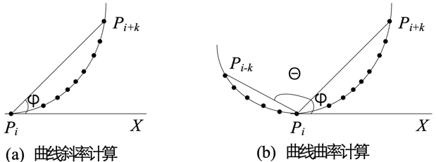
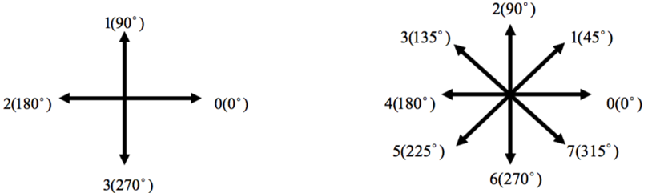
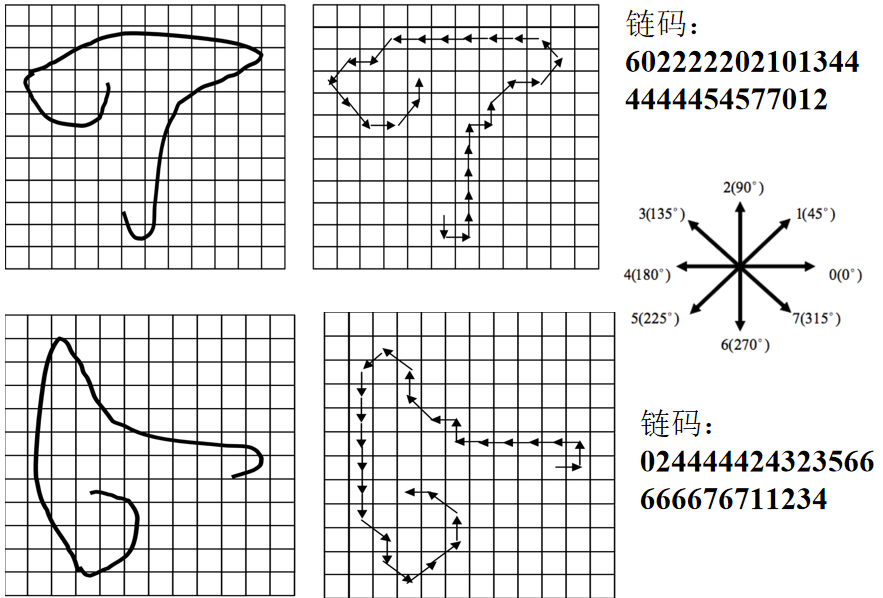
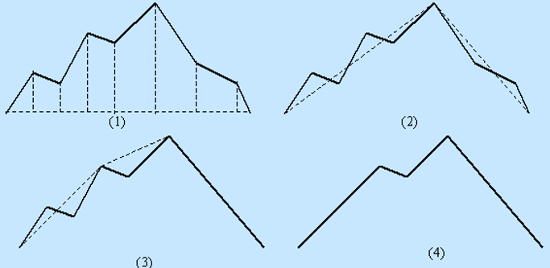
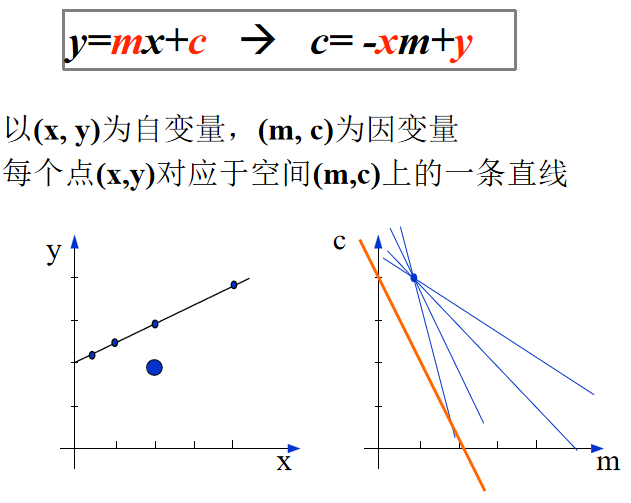
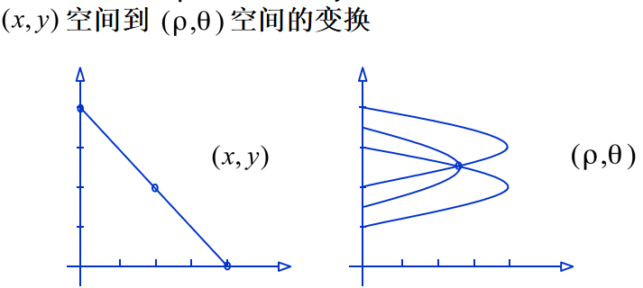
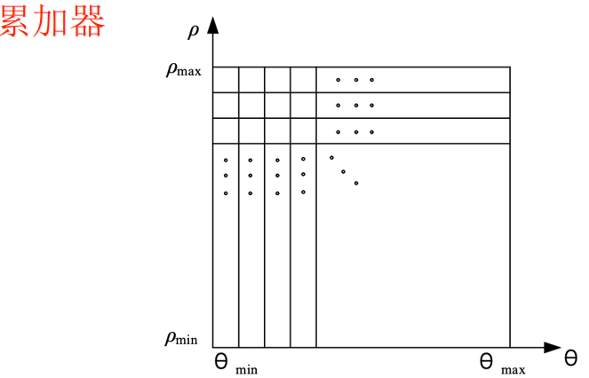
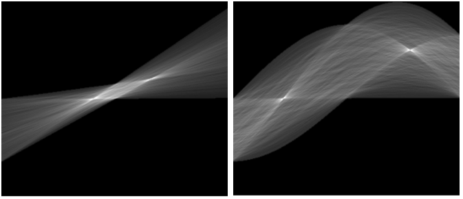
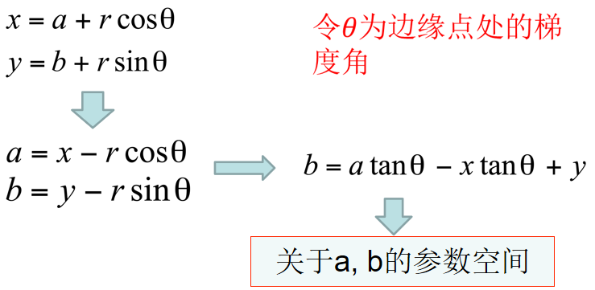

# 轮廓拟合

!!! info "轮廓"
    从上一课中，我们知道可以利用各种边缘检测算法检测出图像中的边缘点，这些边缘点连接起来就可以知道一个物体在二维平面上的投影边界，我们可以称这一边界为轮廓。

    轮廓必须通过某种数学形式来表示，并以此为基础实现视觉信息的计算机处理，并且这种表示必须是高效的、准确的。我们直接用边缘检测得到的边缘点的集合来表示轮廓，但它的时间开销和空间开销都很大。

    通常情况下，我们需要找到一个数学模型，比如曲线，来表示轮廓，从而获得更为高效和准确的表征方式。

## 曲线表示

- 显式表示：$ y = f(x) $
- 隐式表示：$ f(x,y) = 0 $
- 参数表示：$ p(t) = (x, y) = \left( x(t), y(t) \right) $

### 曲线的几何属性

- 曲线长度
    $$ \int_{t_1}^{t_2} \sqrt{\big( x'(t)\big)^2 + \big( y'(t)\big)^2 } $$
- 曲线切方向
    $$ \frac{\big( x(t), y(t) \big)'}{\big| \big( x(t), y(t) \big)' \big|} $$
- 曲率
    $$ \theta = \big( x(t), y(t) \big)'' $$

在计算机中，曲线是以离散化形式保存的，因此它的上述几种几何属性就变为了

- 曲线长度
    $$ s = \sum_{i=2}^n \sqrt{(x_i - x_{i-1})^2 + (y_i - y_{i-1})^2} $$
- 曲线切方向
    $$ \varPhi = \arctan \dfrac{y_{i+k} - y_i}{x_{i+k} - x_i} $$
- 曲率
    $$ \theta = \varPhi_l - \varPhi_r $$

<figure markdown="span">
    {width=65%}
</figure>

!!! info "链码（Chain Code）"
    链码：用相邻边缘点组成的方向序列来表示边缘

    - 4 连通对应四方向链码
    - 8 连通对应八方向链码

    <figure markdown="span">
        {width=55%}
    </figure>

    <figure markdown="span">
        {width=55%}
    </figure>

## 曲线拟合

### 多边形拟合

!!! note "Douglas-Peucker 算法"
    对每一条离散曲线的首末点虚连一条直线，求所有点与直线的距离，并找出最大距离值 $d_{max}$，用 $d_{max}$ 与阈值D相比：

    - 若 $d_{max} ＜ D$，这条曲线上中间点全部舍去；
    - 若 $d_{max} \geqslant D$，保留 $d_{max}$ 对应的点，并以该点为界，把曲线分为两部分，对这两部分重复使用该方法。

    <figure markdown="span">
        {width=65%}
    </figure>

### 椭圆拟合

思路是使用一个二次曲线方程
$$ f(x,y) = ax^2 + bxy + cy^2 + dx + ey +f = 0 $$
来拟合逼近物体的边缘。即目标函数是
$$ \min_{\theta} \sum f(x_i, y_i),\ \theta = < a,b,c,d,e,f > $$
约束条件为 $4ac-b^2=1$

求解思路：使用拉格朗日乘子法 + 最小二乘法

!!! tip "OpenCV 中的椭圆拟合"
    === "Python"

        `cv2.fitEllipse(points)`

        - 输入参数 `points`：输入的二维点集，通常是一个轮廓（可以是 numpy 数组或 OpenCV 的轮廓格式）。要求输入的点集至少包括 5 个点，否则无法拟合椭圆。
        - 返回一个旋转矩形，表示拟合的椭圆，格式为 (center, axes, angle)：
            - center：椭圆的中心点坐标 (x, y)。
            - axes：椭圆的长轴和短轴长度 (major_axis, minor_axis)。
            - angle：椭圆的旋转角度（以度为单位）

        使用示例如下

        ```python
        import cv2
        import numpy as np

        # 创建一个黑色图像并绘制一个椭圆
        image = np.zeros((400, 400), dtype=np.uint8)
        cv2.ellipse(image, (200, 200), (100, 50), 30, 0, 360, 255, -1)

        # 检测轮廓
        contours, _ = cv2.findContours(image, cv2.RETR_EXTERNAL, cv2.CHAIN_APPROX_SIMPLE)

        # 确保轮廓点数足够多才能拟合椭圆
        if len(contours[0]) >= 5:
            ellipse = cv2.fitEllipse(contours[0])
            print("椭圆参数：", ellipse)

            # 在图像上绘制拟合的椭圆
            result = cv2.cvtColor(image, cv2.COLOR_GRAY2BGR)
            cv2.ellipse(result, ellipse, (0, 255, 0), 2)

            # 显示结果
            cv2.imshow("Fitted Ellipse", result)
            cv2.waitKey(0)
            cv2.destroyAllWindows()
        ```

    === "C++"

        ```cpp
        #include <opencv2/opencv.hpp>
        #include <iostream>

        using namespace cv;
        using namespace std;

        int main() {
            // 创建一个黑色图像并绘制一个椭圆
            Mat image = Mat::zeros(400, 400, CV_8UC1);
            ellipse(image, Point(200, 200), Size(100, 50), 30, 0, 360, Scalar(255), -1);

            // 检测轮廓
            vector<vector<Point>> contours;
            findContours(image, contours, RETR_EXTERNAL, CHAIN_APPROX_SIMPLE);

            // 确保轮廓点数足够多才能拟合椭圆
            if (contours[0].size() >= 5) {
                RotatedRect ellipse = fitEllipse(contours[0]);
                cout << "椭圆中心: " << ellipse.center << endl;
                cout << "椭圆长轴和短轴: " << ellipse.size << endl;
                cout << "椭圆角度: " << ellipse.angle << endl;

                // 在图像上绘制拟合的椭圆
                Mat result;
                cvtColor(image, result, COLOR_GRAY2BGR);
                ellipse(result, ellipse, Scalar(0, 255, 0), 2);

                // 显示结果
                imshow("Fitted Ellipse", result);
                waitKey(0);
            }

            return 0;
        }
        ```

## Hough 变换

Hough 变换是基于投票 (Voting) 原理的参数估计方法。基本思想是对图像中每一点对（可能的参数组合）进行表决，赢得多数票的参数组合为最终结果。

### 直线检测

<figure markdown="span">
    {width=60%}
</figure>

为了避免垂直直线带来的问题，我们常会改用极坐标表示直线。

<figure markdown="span">
    {width=60%}
</figure>

Hough 变换可以概括为以下 4 步：

1. 适当地量化参数空间（合适的精度即可）
2. 假定参数空间的每一个单元都是一个累加器，把累加器初始化为零

    <figure markdown="span">
        {width=55%}
    </figure>

3. 对图像空间的每一点，在其所满足的参数方程对应的累加器上加 1
4. 累加器阵列的最大值就拟合得到的模型的参数

!!! example
    从可视化的角度来看，就相当于每个点会给参数空间中的某一条曲线亮度加 1，最后得到的亮度最高的点就是我们应该选择的参数

    <figure markdown="span">
        {width=65%}
    </figure>

### 圆弧检测

<figure markdown="span">
    {width=60%}
</figure>

1. 量化关于 a，b 的参数空间到合适精度
2. 初始化所有累加器为 0
3. 计算图像空间中边缘点的梯度幅度 $G_{mag}(x, y)$ 和角度 $\theta(x, y)$ 
4. 若边缘点参数坐标满足 $b = a\tan\theta - x \tan\theta + y$ 则该参数坐标对应的累加器加 1
5. 拥有最大值的累加器所在的坐标即为图像空间中的圆心所在位置
6. 得到圆心坐标之后，我们可以很容易反求出半径 r
