# 局部特征

Advantages of SIFT local features

- Locality（局部性）: 特征是局部的，因此对于遮挡和杂乱（clutter）具有鲁棒性
- Distinctiveness（区分性）: 可以区分不同的物体
- Quantity（数量）: 从单个对象中可以提取出很多特征
- Efficiency（效率）: 可以实时地检测并提取特征
- Extensibility：（可扩展性）: 可以很容易地从 SIFT 特征拓展到其他特征，并且增加特征的鲁棒性

## 特征检测

### Harris 角点检测

<figure markdown="span">
    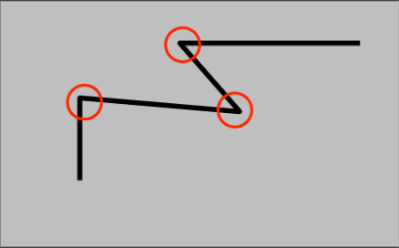{width=65%}
</figure>

Harris 角点检测的思路是使用一个移动的窗口来检测图像中的角点。

- 如果窗口位于一个平坦区域（flat），窗口无论如何移动，窗口内的像素灰度值不会发生变化
- 如果窗口位于一个边缘区域（edge），窗口在沿着边缘方向移动时，窗口内的像素灰度值不会发生变化；但在其他方向上移动时，窗口内的像素灰度值会发生变化
- 如果位于一个角点区域（corner），窗口在任何方向上移动时，窗口内的像素灰度值都会发生较大变化

<figure markdown="span">
    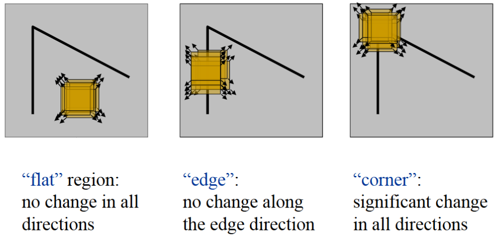{width=65%}
</figure>

我们可以用一个式子来记录窗口在进行一个位移 [u, v] 时，窗口内的像素灰度值的变化量：
$$ E(u, v) = \sum_{x,y} w(x,y) \left[ I(x+u, y+v) - I(x, y) \right]^2 $$

<figure markdown="span">
    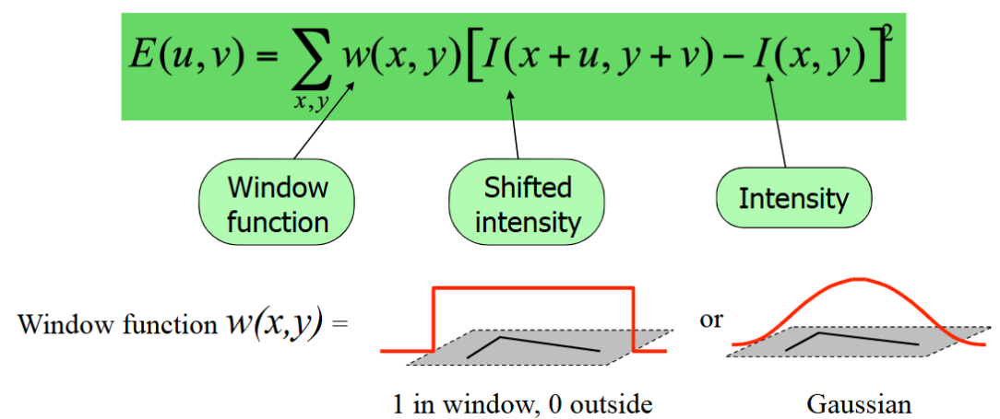{width=65%}
</figure>

<figure markdown="span">
    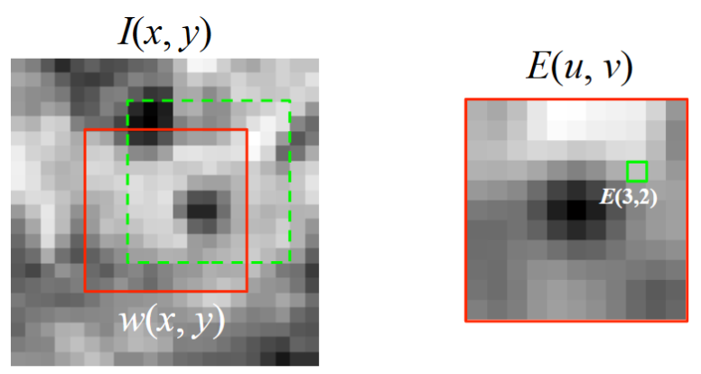{width=45%}
</figure>

我们希望知道当进行一个较小的位移时，窗口内的像素灰度值的变化量。我们可以用泰勒展开式来近似地表示这个变化量：
$$ I(x+u, y+v) \approx I(x, y) + u I_x(x, y) + v I_y(x, y) $$
于是就有

$$ \begin{aligned}
E(u,v) &= \sum_{x,y} w(x,y) \left[ I(x, y) + u I_x(x, y) + v I_y(x, y) - I(x, y) \right]^2 \\
&= \sum_{x,y} w(x,y) \left[ u I_x(x, y) + v I_y(x, y) \right]^2 \\
&= \sum_{x,y} w(x,y) \left[ u^2 I_x^2(x, y) + v^2 I_y^2(x, y) + 2uv I_x(x, y) I_y(x, y) \right] \\
&= 
\begin{bmatrix}
    u, v
\end{bmatrix} \left( \sum_{x,y} w(x,y) \begin{bmatrix}
    I_x^2 & I_x I_y \\
    I_x I_y & I_y^2
\end{bmatrix} \right) \begin{bmatrix}
    u \\
    v
\end{bmatrix}
\end{aligned} $$

因此我们就可以通过双线性插值来近似计算位移 [u, v] 带来的平均灰度值变化 $E(u, v)$ 
$$ E(u, v) \cong 
\begin{bmatrix}
    u, v
\end{bmatrix} M \begin{bmatrix}
    u \\\\
    v
\end{bmatrix} $$ 
其中 $M$ 是一个 $2 \times 2$ 的矩阵，$M$ 的元素是通过对窗口内的像素灰度值的导数计算得到的
$$ M = \sum_{x,y} w(x,y) \begin{bmatrix}
    I_x^2 & I_x I_y \\\\
    I_x I_y & I_y^2
\end{bmatrix} $$

这里的 $M$ 实际上表示的是窗口内的像素灰度值的变化量，我们可以利用矩阵 $M$ 的特征值 $\lambda_1, \lambda_2$ 来判断窗口正处于哪一个区域。

??? tip "一些数学直觉"
    我们知道特征向量是正交的，它们可以构成空间的一组基向量。那么特征值 $\lambda_1, \lambda_2$ 就可以看作是窗口在这两个特征向量方向上的伸缩因子，即特征值越大，窗口内灰度值在该对应特征向量的方向上的变化越大。

<figure markdown="span">
    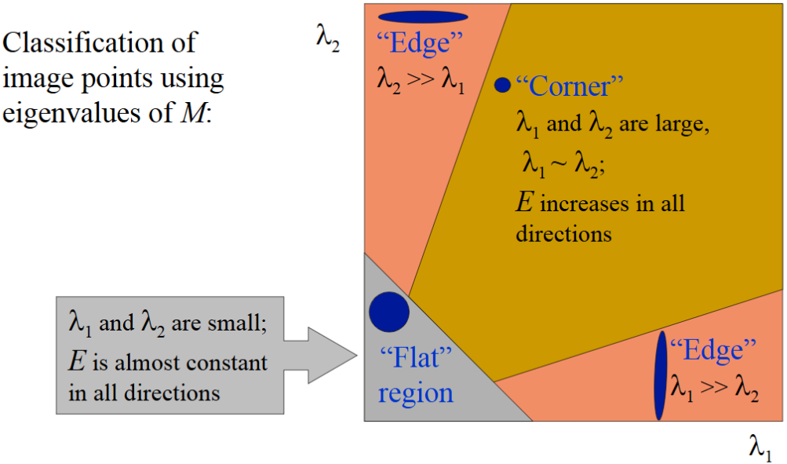{width=70%}
</figure>

- 如果 $\lambda_1, \lambda_2$ 都很小，$E$ 在任何方向上都几乎没有变化，窗口位于平坦区域
- 如果 $\lambda_1 >> \lambda_2$ 或者 $\lambda_2 >> \lambda_1$，说明 $E$ 在某一个方向上变化很大，窗口位于边缘区域
- 如果 $\lambda_1, \lambda_2$ 都很大，且 $\lambda_1 \sim \lambda_2$，说明 $E$ 在任何方向上都变化很大，窗口位于角点区域

**角点相应的测量**

在进行 Harris 角点检测时，通常会使用一个函数来表示角点的响应程度：
$$ R = \det(M) - k \cdot \text{trace}(M)^2 $$
其中 $k$ 是一个常数，通常取值在 $0.04$ 到 $0.06$ 之间。

而我们不难知道 $det(M) = \lambda_1 \cdot \lambda_2$，$\text{trace}(M) = \lambda_1 + \lambda_2$，因此我们可以将 $R$ 进行展开：
$$ R = \lambda_1 \cdot \lambda_2 - k \cdot (\lambda_1 + \lambda_2)^2 $$

现在回到上面那张图，我们可以利用 $R$ 的值来判断窗口正处于哪一个区域。

<figure markdown="span">
    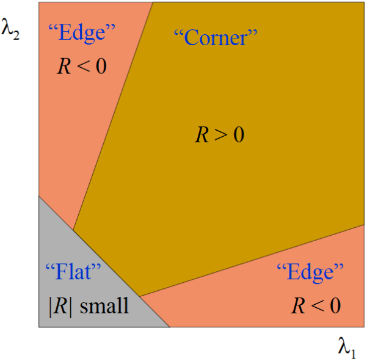{width=50%}
</figure>

- 如果 $R > 0$ 且 $R$ 较大，则说明窗口位于角点区域
- 如果 $R < 0$ 且绝对值很大，则说明窗口位于边缘区域
- 如果 $|R|$ 较小，则说明窗口位于平坦区域

现在我们可以来看一看 Harris 角点检测算法的具体过程了：

1. 计算图像中所有点的角点响应值，只保留响应值 $R$ 大于一定阈值的点
2. 对于每一个点，检查它的邻域内的点，如果邻域内的点的响应值都小于该点的响应值，则认为该点是一个角点（只保留局部最大值）

??? example
    - 原始图像：
    <figure markdown="span">
        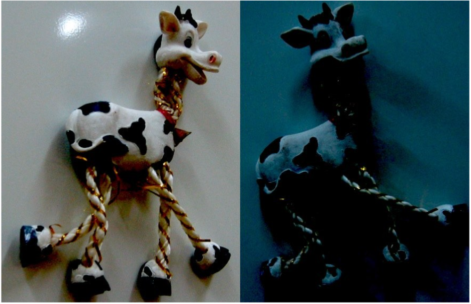{width=50%}
    </figure>

    - 计算每个点的角点响应值：
    <figure markdown="span">
        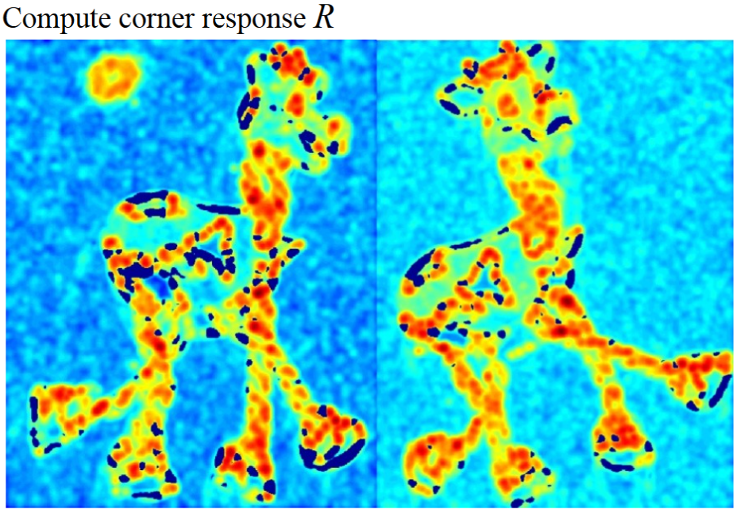{width=50%}
    </figure>

    - 只保留响应值大于一定阈值的点：
    <figure markdown="span">
        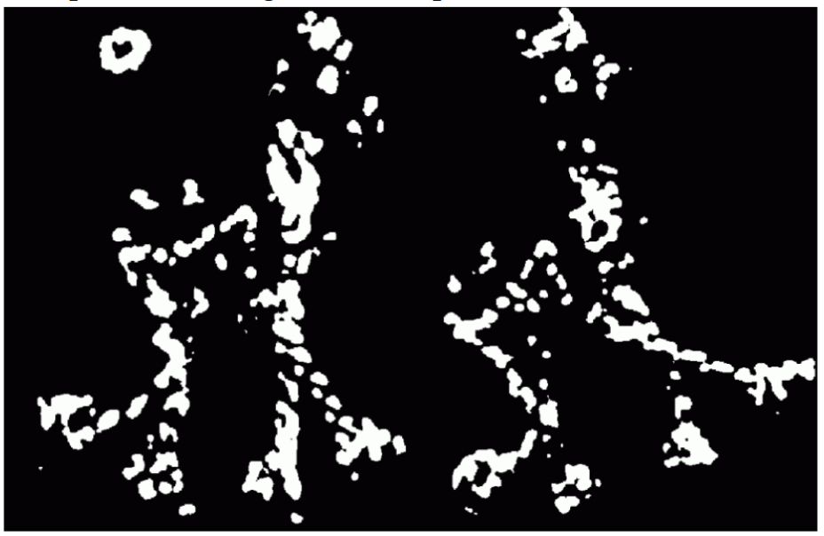{width=50%}
    </figure>

    - 最终的角点检测结果（图中的红色小点，可能不容易观察到）：
    <figure markdown="span">
        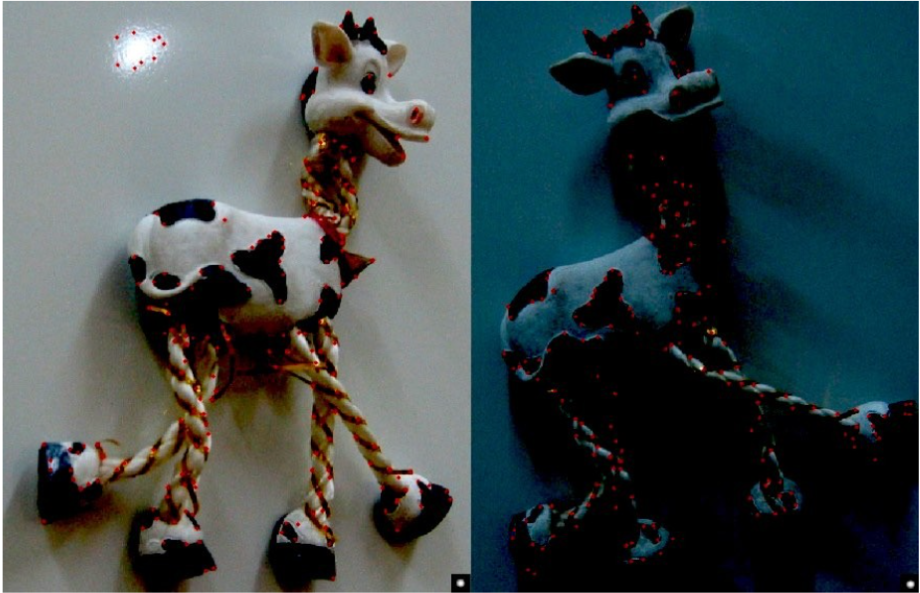{width=50%}
    </figure>

!!! note "Harris 角点检测的优缺点"
    - 优点：
        - 对于旋转的检测具有稳定性
        - 对灰度值的放射变化具有一定稳定性
        - 计算速度较快，适合实时应用
    - 缺点：
        - 当图片进行缩放时，Harris 角点检测的结果会发生变化
            - 当图片放大后，原先的角点可能就不再是角点
            - 原先只是一条曲线的图像，缩小后可能就变成了一个角点
        - 对于噪声和模糊图像敏感
        - 对于光照变化和视角变化不够鲁棒

### Scale Invariant Detection

由于 Harris 角点检测对图像的缩放不够鲁棒，因此我们需要对其进行改进。

我们的思路是设计一个函数，使得它在不同的尺度下都能检测到相同的角点（即具有尺度不变性，scale invariance）。对于图像中某一个固定的点，我们可以把它看作一个关于尺度不变区域大小的函数，我们希望它在任何的缩放比例下都能保持不变。

<figure markdown="span">
    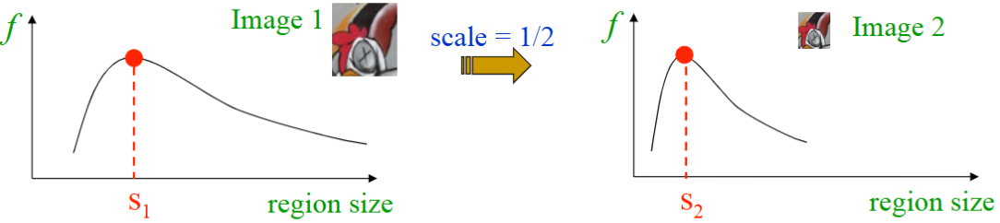{width=80%}
</figure>

> 比如我们使用一个圆圈来作为检测区域，我们希望这个检测区域的大小能够随着图像的缩放而变化，从而找到一个最能够描述该点的区域。

一个能用于尺度检测的“好”的函数应该在区域大小变化时尤其仅有一个较为突出的极值点，这样我们就可以通过寻找极值点来找到尺度不变区域的大小。

<figure markdown="span">
    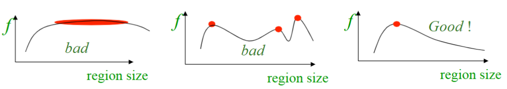{width=80%}
</figure>

!!! info "Scale Invariant Detector"
    <figure markdown="span">
        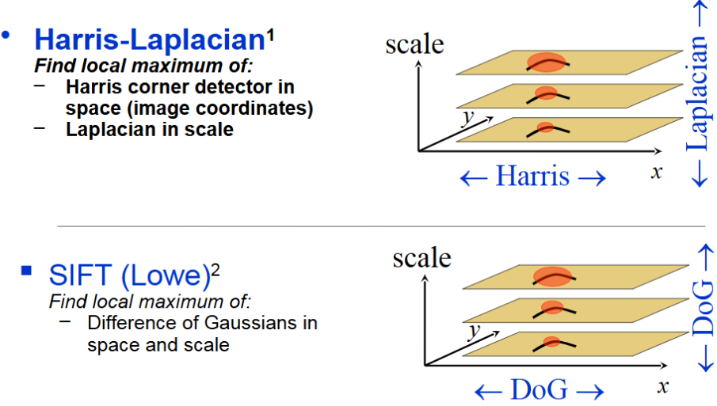{width=65%}
    </figure>

    > DoG（Difference of Gaussian）是一个常用的尺度不变检测器，它是通过对高斯函数进行差分来实现的。
    > 其基本思想是：对图像进行高斯模糊处理，然后计算不同尺度下的高斯函数的差分，最后通过寻找极值点来找到尺度不变区域的大小。

    <figure markdown="span">
        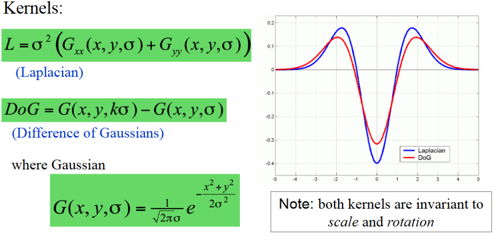{width=65%}
    </figure>

!!! abstract
    - **Given**: two images of the same scene with a large scale difference between them
    - **Goal**: find the same interest points independently in each image
    - **Solution**: search for maxima of suitable functions in scale and in space (over the image)

### 特征描述 (SIFT)

SIFT 特征描述通过对图像进行高斯模糊处理，然后计算不同尺度下的高斯函数的差分，最后通过寻找极值点来找到尺度不变区域的大小。它的主要思想如下：

1. **尺度空间极值检测**

    在图像的不同尺度上找到潜在的特征点，这个过程利用高斯模糊（Gaussian blur）和差分高斯（Difference of Gaussian, DoG）来创建尺度空间。

2. **特征点定位**

    在检测到的尺度空间极值点的基础上，利用高斯平滑和二次拟合来定位特征点的位置和尺度，同时剔除不稳定的点（例如边缘效应导致的点）。

3. **方向分配**

    计算每个特征点周围的 16x16 的区域内像素点的边缘方向，去除弱边缘点（边缘梯度幅度较小的点），使用一个直方图来统计这些像素点的方向，得到一个主方向。

    <figure markdown="span">
        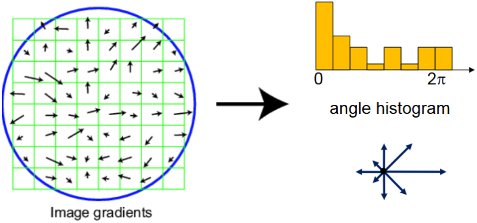{width=65%}
    </figure>

4. **特征描述**

    在得到特征点的位置和方向后，我们还需要把这个 16x16 的区域划分为 4x4 的子区域，计算每个子区域的梯度方向直方图（共有 8 个方向），最终会得到一个 128 维的向量作为描述子（descriptor）。

这个 128 维的特征描述子就是图像的局部特征，它在尺度、旋转变换下保持不变，可以用于图像匹配、物体识别等任务。

!!! note "SIFT 特征描述的优缺点"
    - 优点：
        - 对尺度和旋转不变，适合处理旋转、缩放的图像
            - SIFT 是局部特征，因此关键点平以后仍能提取出相同的特征
            - 在计算方向特征前，我们会把局部范围的 grid 旋转到主方向上，因此具有旋转不变性
        - 能够有效应对图像噪声、光照变化、局部遮挡等问题
    - 缺点：
        - 计算量较大，特别是在高分辨率图像中，提取SIFT特征的计算开销较高
        - 对非刚性变化的物体检测效果一般（例如人类面部表情变化，手帕等物体的变形）
        - 对于大范围的视角变化不够鲁棒
