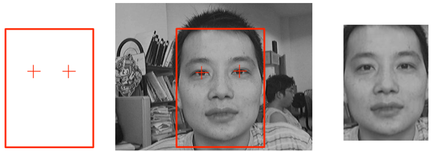

# 特征人脸

## 数学基础

### 随机变量的数字特征

- 期望：$E(x)$
- 方差（variance）：
    - $Var(x) = E[(x - E(x))^2] = E(x^2) - E(x)^2$
    - $Var(x) = \dfrac{1}{n-1} \sum\limits_{i=1}^{n} (x_i - \bar{x})^2$，其中 $\bar{x}$ 为样本均值
- 标准差（standard deviation）：$\sigma(x) = \sqrt{Var(x)}$
- 协方差（covariance）：
    - $Cov(x, y) = E[(x - E(x))(y - E(y))] = E(xy) - E(x)E(y)$
    - $Cov(x, y) = \dfrac{1}{n-1} \sum\limits_{i=1}^{n} (x_i - \bar{x})(y_i - \bar{y})$，其中 $\bar{x}$ 和 $\bar{y}$ 为样本均值
    - 考虑多维随机变量 $X = (x_1, x_2, \cdots, x_d)$，各维度之间的协方差为
        $$ \begin{aligned}
        Cov(x_i, x_j) &= E[(x_i - E(x_i))(x_j - E(x_j))] \\\\
        &= E(x_i x_j) - E(x_i)E(x_j) 
        \end{aligned} $$

协方差是衡量这个维度相较于平均值的偏差程度，协方差越大，说明这个维度的偏差越大。

- 当协方差为正时，两变量同增同减
- 当协方差为负时，一个变量增大（减小）时，另一个变量减小（增大）
- 当协方差为 0 时，两个变量之间没有**线性**关系

### PCA（主成分分析）

主成分分析（PCA，Principal Component Analysis）是一种常用的降维技术，旨在通过线性变换将数据投影到一个新的坐标系中，使得投影后的数据在新坐标系中的方差最大化。（类间方差最大化，类内方差最小化）

对于一个 $d$ 维空间上的数据
$$ x = (x_1, x_2, \ldots, x_d) $$
我们要把它投影到方向 
$$ a_1 = (a_1^1, a_1^2, \ldots, a_1^d)^T $$ 
上，其中 $||a_1|| = a_1^T a_1 = 1$，那么投影值为
$$ z_1 = a_1^T x = \sum_{i=1}^{d} a_1^i x_i $$

我们希望的是投影后的数据在新坐标系中的方差最大化，即最大化 $Var(z_1)$，我们想要得到的是 $\arg \max\limits_{a_1} Var(z_1)$。
于是我们就可以注意到
$$ \begin{aligned}
Var(z_1) & = E[(z_1 - E(z_1))^2] = E[(\sum_{i=1}^{d} a_1^i x_i)^2] - [E(\sum_{i=1}^{d} a_1^i x_i)]^2 \\\\
& = \sum_{i,j=1}^{d} a_1^i a_1^j E(x_i x_j) - \sum_{i,j=1}^{d} a_1^i a_1^j E(x_i) E(x_j) \\\\
& = \sum_{i,j=1}^{d} a_1^i a_1^j [E(x_i x_j) - E(x_i) E(x_j)] \\\\
& = \sum_{i,j=1}^{d} a_1^i a_1^j Cov(x_i, x_j) \\\\
\end{aligned} $$
我们可以记协方差矩阵为 $C$，其中 $C_{ij} = Cov(x_i, x_j)$，那么我们就可以把上面的式子写成
$$ Var(z_1) = a_1^T C a_1 $$

于是我们现在的问题就变成了在约束条件 $a_1^T a_1 = 1$ 下，最大化 $a_1^T C a_1$。
我们可以使用拉格朗日乘数法来求解这个问题。我们构造拉格朗日函数
$$ L(a_1, \lambda) = a_1^T C a_1 - \lambda (a_1^T a_1 - 1) $$
对 $L$ 关于 $a_1$ 和 $\lambda$ 求偏导数并令其为 0，得到
$$ \begin{cases}
& \dfrac{\partial L}{\partial a_1} = 2 C a_1 - 2 \lambda a_1 = 0 \\\\\\\\
& \dfrac{\partial L}{\partial \lambda} = a_1^T a_1 - 1 = 0
\end{cases} $$

于是我们注意到 $C a_1 = \lambda a_1$，这说明 $a_1$ 是协方差矩阵 $C$ 的特征向量，$\lambda$ 是对应的特征值。并且
$$ Var(z_1) = a_1^T C a_1 = a_1^T \lambda a_1 = \lambda (a_1^T a_1) = \lambda $$
这说明我们如果想求 $Var(z_1)$ 的最大值，就需要求协方差矩阵 $C$ 的最大特征值。

现在我们求得了第一个主成分 $a_1$，当我们想要求第二个主成分 $a_2$ 时，我们需要注意到 $a_2$ 需要与 $a_1$ 正交，即 $a_1^T a_2 = 0$。

于是我们可以把第二个主成分的求解问题变成了在约束条件 $a_1^T a_1 = 1$ 和 $a_1^T a_2 = 0$ 下，最大化 $a_2^T C a_2$。

> 更一般的，我们对于新的投影值 $z_k = a_k^T x$，我们希望最大化 $Var(z_k)$，并且要求新投影方向与已经求得的方向投影不相关，即 $Cov(z_k, z_i) = 0$，其中 $1 \leqslant l \leqslant k$。

类似地，我们也可以用拉格朗日乘数法来求解这个问题，最终可以发现 $S a_k = \lambda_k a_k$，其中 $S$ 是协方差矩阵，$\lambda_k$ 是第 $k$ 大的特征值，$a_k$ 是对应的特征向量。

最终我们会发现数据在新坐标中的协方差矩阵倍对角化了

$$ C_z = Cov(z) = \begin{pmatrix}
\lambda_1 &  \cdots & 0 \\
\vdots  & \ddots & \vdots \\
0 & \cdots & \lambda_d
\end{pmatrix} $$

!!! tip "PCA 的步骤"
    PCA 的步骤可以总结为：

    1. 标准化数据

        首先我们要把数据进行标准化处理，即对每个维度的数据进行均值为 0，方差为 1 的处理。这一步是为了消除不同维度之间的量纲差异（例如身高、体重）。

        $$ x_i = \frac{y_i - \bar{y}}{\sigma(y)} $$

    2. 计算协方差矩阵

        假设数据集 $X$ 的维度为 $m \times n$，其中 $m$ 是样本数，$n$ 是特征数。我们可以计算协方差矩阵 $C$，其维度为 $n \times n$。
        $$ C = \frac{1}{m-1} X^T X $$

    3. 求解特征值和特征向量

        对协方差矩阵 $C$ 求解特征值和特征向量。特征值表示数据在对应特征向量方向上的方差大小。特征向量表示数据在新坐标系中的方向。

        $$ C v_i = \lambda_i v_i $$

        具体的求解方法可以使用 numpy 中的 `numpy.linalg.eig` 函数。也可以使用其他方法，例如 Jacobi 方法、QR 分解等。

    4. 投影到新空间

        当我们得到了特征值和特征向量后，我们需要按大小把特征值降序排列。这之后我们可以选择前 $k$ 个特征值对应的特征向量，构成一个新的投影矩阵 $V_k$，维度为 $n \times k$。

        之后我们可以把标准化后的数据投影到前 $k$ 个主成分上
        $$ X_{new} = X \cdot V_k $$

    现在我们就已经使用 PCA 把数据从 $n$ 维降到了 $k$ 维，并且保留了数据中大部分的信息。

## 特征人脸

特征人脸（Eigenfaces）是一种基于 PCA 的人脸识别方法。它的基本思想是将人脸图像看作一个高维空间中的点，然后通过 PCA 将这些点投影到一个低维空间中，从而实现人脸的降维和特征提取。

!!! note "特征人脸的基本步骤"
    1. 收集人脸图像数据集
    2. 对每张人脸图像进行预处理（如灰度化、归一化等）
    3. 将每张人脸图像展平为一个向量，并将所有向量组成一个矩阵
    4. 通过 PCA 计算获得一组特征向量(特征脸)。通常一百个特征向量就足够
    5. 将每张人脸图像投影到由这组特征脸张成的子空间上，得到各个人脸图像在特征空间中的坐标
    6. 对输入的一幅待测图像进行预处理后，再通过同样的方法映射到特征脸子空间中，然后用某种距离度量（如欧氏距离）来判断其与训练集中各个样本的距离，选择距离最小的样本作为识别结果

### 预处理

- 确定模板 (Mask)
- 根据人脸两只眼睛的中心位置，**缩放/平移/旋转**，使所有训练人脸图像与模板对齐。
- 根据模板，切出脸部区域

<figure markdown="span">
    {width=70%}
</figure>

接着我们还需要把裁剪出的图像对灰度值做归一化，然后拉伸成一个向量。

### 训练过程

根据输入的人脸图像，利用 PCA 算法计算出特征向量（特征脸），并将每张人脸图像投影到特征向量上，得到各个人脸在特征空间中的坐标。

对于含有 $k$ 张 $m \times n$ 人脸图像的数据集

1. 求协方差矩阵 $\Sigma$，其大小为 $mn \times mn$，
    $$ \Sigma = \frac{1}{k} \sum_{i=1}^{k} (x_i - \bar{x})(x_i - \bar{x})^T $$
2. 求协方差矩阵的特征值和特征向量
    $$ \Sigma v_i = \lambda_i v_i $$
    其中 $v_i$ 是第 $i$ 个特征向量（$mn$ 维向量），$\lambda_i$ 是对应的特征值。
3. 构建转换矩阵 $A^T$
    $$ y_i = A^T x_i $$
    其中 $x_i$ 是第 $i$ 张人脸图像的向量表示，得到的 $k$ 维向量 $y_i$ 就是第 $i$ 张人脸图像在特征空间中的坐标（特征表示）。

    $A = [v_1, v_2, \ldots, v_k]$，每个列向量 $v_i$ 都是特征向量
    
### 识别与重构

对于任意一个待识别样本 $f$（假设已经经过预处理），我们也可以将其投影到特征向量上，得到其在特征空间中的坐标 $y_f$。
$$ y_f = A^T f $$
然后我们可以计算待识别样本 $f$ 与训练集中每个样本 $x_i$ 的距离，选择距离最小的样本作为识别结果。

我们还可以使用特征空间的坐标 $y_f$ 来重构待识别样本 $f$，即
$$ f' = A y_f $$

!!! info "识别"
    一个识别系统给出的一次识别结果的对错可分为四种情况

    - 合法用户被正确接受 —— 正确接受率（True Acceptance Rate，TAR）
    - 合法用户被错误拒绝 —— 错误拒绝率（False Rejection Rate，FRR）
    - 非法用户被错误接受 —— 错误接受率（False Acceptance Rate，FAR）
    - 非法用户被正确拒绝 —— 正确拒绝率（True Rejection Rate，TRR）
