# 单目视觉

## 相机基本原理

### 薄透镜

<figure markdown="span">
    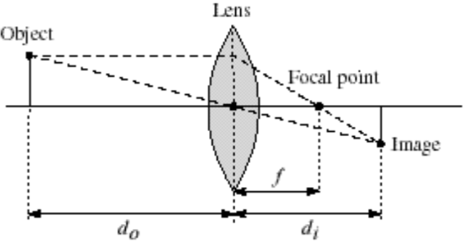{width=65%}
</figure>

薄透镜的焦距、物距和像距之间的关系可以用透镜方程来表示：
$$ \frac{1}{f} = \frac{1}{d_o} + \frac{1}{d_i} $$

### 景深

景深（Depth of Field）是指在拍摄时，能够保持清晰的范围。景深的大小与光圈、焦距和物距有关。

当我们在摄影时，通常不可能保证所有的物体都在焦点上，但在焦点（焦距）附近的物体都可以保证一定的清晰度。景深指的就是能保证物体清晰的物距范围。

<figure markdown="span">
    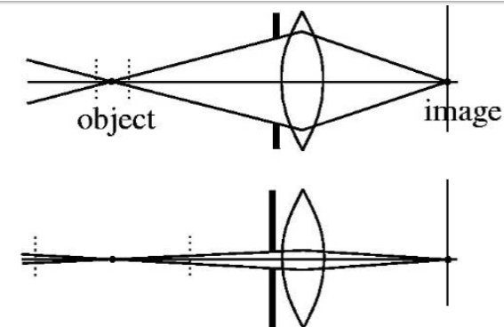{width=65%}
</figure>

- 从上图中我们可以看到，光圈越大，景深越小；光圈越小，景深越大
- 但是较小的光圈可能会导致接收到的光线减少，从而需要更多的曝光时间

### 视野

<figure markdown="span">
    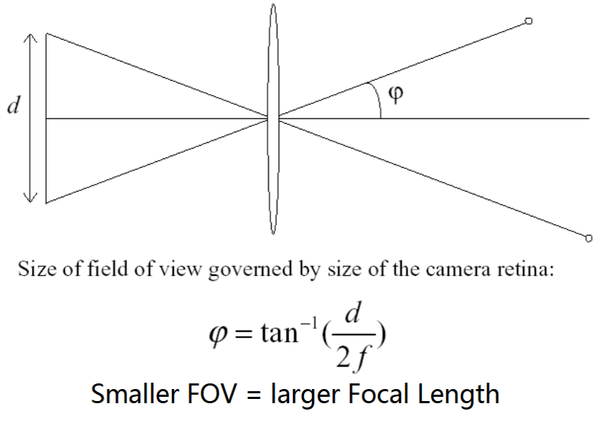{width=55%}
</figure>

Field of View（FOV）

- 放大倍数越大（焦距越大），视野越小
- 当 FOV 偏大或偏小时，图像中的物体会产生畸变

### 投影

<figure markdown="span">
    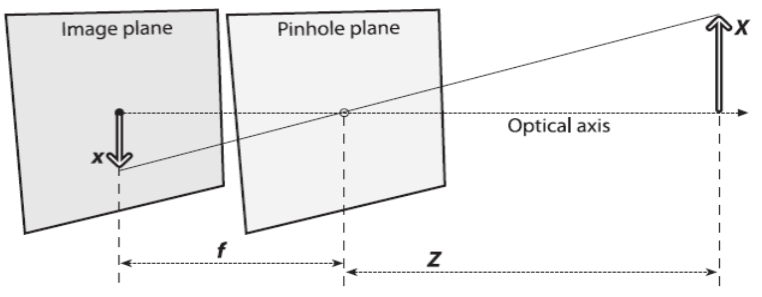{width=60%}
</figure>

我们可以很容易地得到一个式子：
$$ \dfrac{-x}{f} = \dfrac{X}{Z} \longrightarrow -x = f \dfrac{X}{Z} $$
这里的负号表示小孔成像的方向与物体方向相反

<figure markdown="span">
    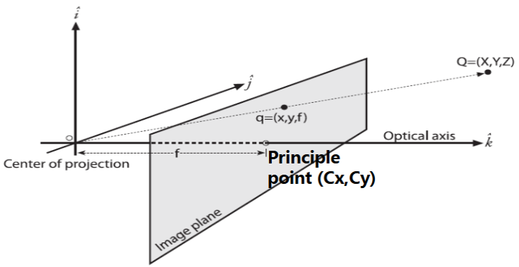{width=60%}
</figure>

但有时候成像的小孔未必处在中心位置，这时候我们可以给上面的式子添加一个偏移量

$$ x = f\dfrac{X}{Z} + c_x $$

于是现在我们就可以得到相机内部的参数

$$ \begin{cases}
x_{screen} = f_x (\dfrac{X}{Z}) + c_x \\\\
y_{screen} = f_y (\dfrac{Y}{Z}) + c_y
\end{cases} $$

其中 $f_x = F s_x,\ f_y = F s_y$

- $F$ 是物体实际的大小，单位是 mm 等，
- $s_x,\ s_y$ 是把实际物体转换到屏幕像素的转换因子，单位是 pixel/mm 等
- $f_x,\ f_y$ 的单位是 pixel

!!! note "intrinsic parameters"
    我们把 $(f_x, f_y, c_x, c_y)$ 称为相机的**内部参数/固有参数（intrinsic parameters）**

但我们注意到上面的式子需要除以 $Z$，并不是一个便于计算的线性关系。这里有一个小技巧：我们可以添加一个额外的坐标维度，从而把笛卡尔坐标转化为齐次坐标

<figure markdown="span">
    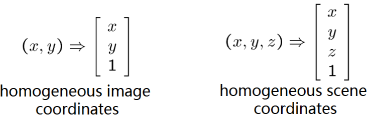{width=65%}
</figure>

类似地，我们也可以把齐次坐标转换为原先的笛卡尔坐标

<figure markdown="span">
    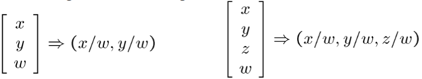{width=65%}
</figure>

于是我们就可以把上面的式子写成矩阵乘法的形式：
$$ q = MQ $$
其中 
$$ q = \begin{bmatrix} x \\\\ y \\\\ z \end{bmatrix}
\quad 
M = \begin{bmatrix} f_x & 0 & c_x \\\\ 0 & f_y & c_y \\\\ 0 & 0 & 1 \end{bmatrix} 
\quad 
Q = \begin{bmatrix} X \\\\ Y \\\\ Z \end{bmatrix} $$

## 透镜畸变

我们使用的透镜不可能是完美的，由于透镜的种种瑕疵，所成的像会出现各种畸变。

### 径向畸变

<figure markdown="span">
    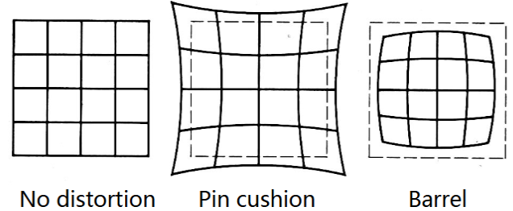{width=65%}
</figure>

图像径向畸变是图像像素点以畸变中心为中心点，沿着径向产生的位置偏差，从而导致图像中所成的像发生形变。图像径向畸变是成像过程中最主要的畸变，同时也是对成像效果影响最大的畸变。

- 枕形畸变（pin cushion）：从图像的中心点到图像的边缘点图像的相对大小逐渐变大
- 桶形畸变（barrel）：从图像的中心点到图像的边缘点图像的相对大小逐渐变小

!!! example "Correcting Radial Distortion"
    <figure markdown="span">
        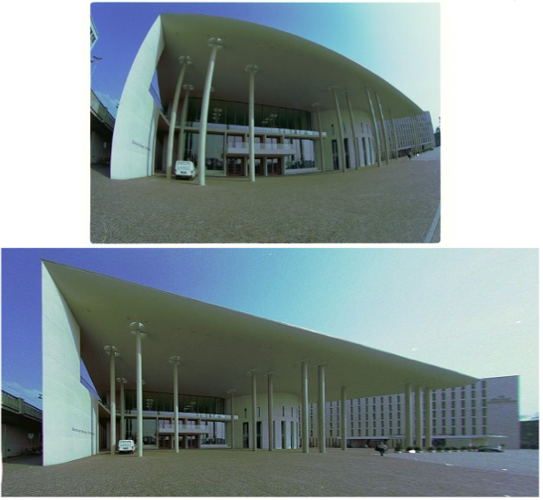{width=65%}
    </figure>

对径向畸变进行建模和矫正的方法是对 $x$ 和 $y$ 进行修正

$$ \begin{aligned}
& x_{corrected} = x(1 + k_1 r^2 + k_2 r^4 + k_3 r^6) \\
& y_{corrected} = y(1 + k_1 r^2 + k_2 r^4 + k_3 r^6)
\end{aligned} $$

### 切向畸变

切向畸变由于镜头的设计和制造过程中，镜头的各个光学元件（如透镜）之间相对位置的不完美，尤其是透镜元件的对准误差。

例如当透镜和感光的 CMOS 芯片之间没有对准时就会导致切向畸变

<figure markdown="span">
    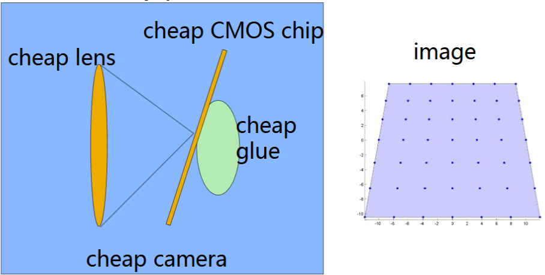{width=60%}
</figure>

要对切向畸变进行建模和校正，可以按照如下的方式：

$$ \begin{aligned}
& x_{corrected} = x +[2p_1 y + p_2(r^2 + 2x^2)] \\
& y_{corrected} = y + [p_1(r^2 + 2y^2) + 2p_2 x]
\end{aligned} $$

!!! note "distortion parameters"
    我们把 $(k_1, k_2, p_1, p_2, k_3)$ 称为相机的**畸变参数（distortion parameters）**

## 坐标系

!!! note "四大坐标系"
    - **世界坐标系**：也称测量坐标系，它是一个三维直角坐标系 $(x_w, y_w, z_w)$
        - 在世界坐标系中，可以描述相机和待测物体的空间位置。而世界坐标系的位置根据实际情况自行确定。
    - **相机坐标系**：同样是一个三维直角坐标系 $(x_c, y_c, z_c)$
        - 相机坐标系的原点是镜头的光心，x、y 轴分别与像平面两边平行，z 轴为镜头的光轴，与像平面垂直
    - **图像坐标系**：也叫平面坐标系，用物理单位（例如 mm）表示像素的位置
        - 从相机坐标系转换到图像坐标系属于从 3D 转换到 2D的透视投影关系
    - **像素坐标系**：使用像素来表示图像

上面我们讨论的是相机内部的参数，但实际上都属于相机坐标系到图像坐标系的转换。也就是说，之前我们得到的矩阵乘法实际上是
$$ q_{image} = MQ_{cam} $$
其中 
$$ q_{image} = \begin{bmatrix} x \\\\ y \\\\ z \end{bmatrix} , \quad 
M = \begin{bmatrix} 
f_x & 0 & c_x \\\\ 
0 & f_y & c_y \\\\ 
0 & 0 & 1 
\end{bmatrix} 
, \quad 
Q_{cam} = \begin{bmatrix} X_{cam} \\\\ Y_{cam} \\\\ Z_{cam} \end{bmatrix} $$

### 世界坐标系到相机坐标系

世界坐标系到相机坐标系的变换属于刚体变换，即只需要改变物体的空间位置（平移）和朝向（旋转），而不改变物体的形状。

我们可以使用旋转矩阵 $R$ 和平移向量 $t$ 来表示这种变换
$$ \begin{bmatrix} x_w \\\\ y_w \\\\ z_w \end{bmatrix} = R \begin{bmatrix} x_c \\\\ y_c \\\\ z_c \end{bmatrix} + t $$
其中 $R$ 是一个 3×3 矩阵，$t = [t_x, t_y, t_z]^T$ 是一个 3×1 矩阵

二维平面 xoy 的旋转可以看作三维坐标系围绕着 z 轴旋转 $\theta$ 角的结果，即

$$ R_z(\theta) = 
\begin{bmatrix} 
\cos\theta & \sin\theta & 0 \\ 
-\sin\theta & \cos\theta & 0 \\ 
0 & 0 & 1 
\end{bmatrix}
$$

另外两个方向的旋转也可以用类似的方式表示出来，因此旋转矩阵 $R$ 就可以表示为三个角度的矩阵相乘
$$ R = R_z(\theta) R_y(\varphi) R_x(\psi) $$
其中

$$ \begin{aligned}
&  R_x(\psi) = 
\begin{bmatrix} 
1 & 0 & 0 \\ 
0 & \cos\psi & \sin\psi \\ 
0 & -\sin\psi & \cos\psi
\end{bmatrix}
, \\\\
& R_y(\varphi) = 
\begin{bmatrix} 
\cos\varphi & 0 & -\sin\varphi \\ 
0 & 1 & 0 \\ 
\sin\varphi & 0 & \cos\varphi
\end{bmatrix}
, \\\\
& R_z(\theta) = 
\begin{bmatrix} 
\cos\theta & \sin\theta & 0 \\ 
-\sin\theta & \cos\theta & 0 \\ 
0 & 0 & 1 
\end{bmatrix}
\end{aligned}
$$

我们现在继续使用齐次坐标来表示坐标系的转换，就可以写成

$$ P = \begin{bmatrix} 
R_{3\times3} & t_{3\times1}  \\ 
0_{1\times3} & 1 
\end{bmatrix} 
P_0
$$

相机在世界坐标系中未必处于坐标轴中心，因此我们如果想要从 $Q_w$ 转换到 $Q_{cam}$，还需要进行一些处理。

我们用 $O_w$ 表示世界坐标系原点所在位置，用 $C_w$ 表示相机的位置，用 $T = O_w - C_w$ 表示的就是相机在世界坐标系的位置。
$$ \begin{aligned}
Q_{cam} &= R(Q_w - C_w) \\\\
&= R(Q_w - O_w + T) \\\\
&= RQ_{obj} + RT
\end{aligned} $$
即 
$$ Q_{cam} = 
\begin{bmatrix} 
R & RT  \\\\
0 & 1 
\end{bmatrix} 
Q_{obj} $$
$$ \Longrightarrow \ t = RT $$ 
又因为 $R$ 是一个正交矩阵，$R^T = R^{-1}$，于是
$$ Q_{obj} = R^T Q_{cam} - T $$ 
即 
$$ Q_{obj} = 
\begin{bmatrix} 
R^T & -T  \\\\ 
0 & 1 
\end{bmatrix} 
Q_{cam} $$
$$ \Longrightarrow \ t = -T $$

### 相机参数

!!! note "Transformation between camera and object"
    - 外部参数（extrinsic parameters）
        $$ (\theta, \varphi, \psi, t_x, t_y, t_z) $$
    - 内部参数（intrinsic parameters）
        $$ (f_x, f_y, c_x, c_y) $$
    - 畸变参数（distortion parameters）
       $$ (k_1, k_2, p_1, p_2, k_3) $$

    内部参数和外部参数属于 3D 几何，共有 10 个；畸变参数属于 2D 几何，共有 5 个。

    $$ Q_{cam} = M_{ext} Q_{obj} $$

    $$ q_{image} = M_{int} Q_{cam} $$

从物体的世界坐标转换到图像坐标，可以概括为使用一个 3×4 的矩阵 $\Pi$ 把外部坐标转变为内部坐标，其中 $\Pi$ 是上面的几个矩阵相乘的结果。

<figure markdown="span">
    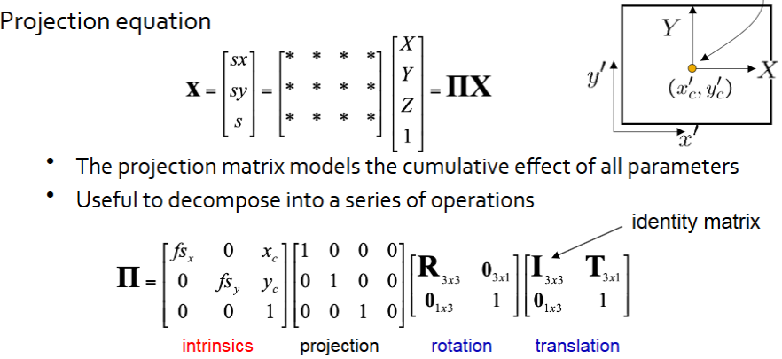{width=75%}
</figure>

## 相机标定

相机标定（Camera Calibration）是指通过一定的数学方法，估算出相机的内外参数，并通过这些参数来进行图像的几何校正。标定的目的是为了准确地理解相机成像过程中的各种畸变（如径向畸变、切向畸变）和图像坐标与实际世界坐标之间的映射关系。

!!! info "棋盘格标定法"

    棋盘格标定法（Checkerboard Calibration）： 这是最常见的标定方法。使用一个平面上的棋盘格图案，在多个视角下拍摄棋盘格图像。通过检测图像中棋盘格的角点（例如交点位置），结合棋盘格的实际物理尺寸，可以求解相机的内参和外参。

    - 使用标定板（如棋盘格）拍摄一系列的图片，确保角度、距离等条件多样化。
    - 对每张图片中的棋盘格角点进行检测（通常是交点位置）。
    - 将每张图片的2D角点与已知的3D世界坐标进行对应，通过优化方法（如最小二乘法）计算出相机的内外参数。

    <figure markdown="span">
        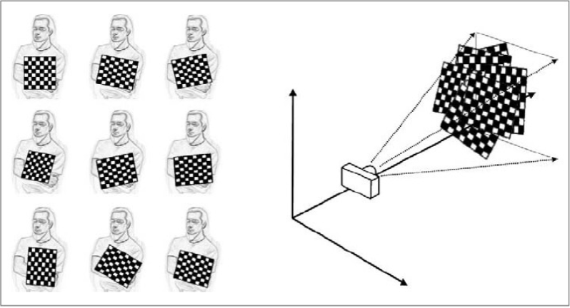{width=60%}
    </figure>

    <figure markdown="span">
        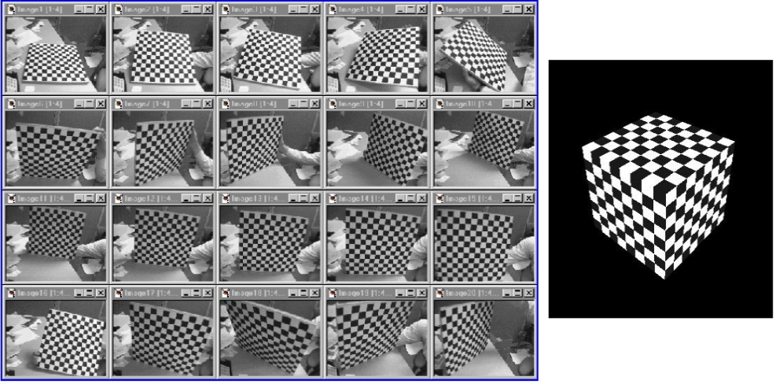{width=60%}
    </figure>

每个角点的标定都可以生成 2 个约束条件（2 个约束方程）。回顾之前的内容，相机需要 6 个外部参数和 4 个内部参数，而每个视角对应的外部参数都是不同的。

假设共有 $N$ 个角点，$K$ 个不同的视角（图像），那么一共能得到 $2NK$ 个角点约束条件。而我们需要的参数共有 $K \times 6 + 4$ 个，因此需要保证
$$ 2NK \geqslant 6K + 4 $$
即
$$ (N-3)K \geqslant 2 $$
其中 $K>1$

注意到 $K=2$ 时，$N=4$，因此每 4 个角点就需要 2 个视角来处理。

## 双目视觉

使用两个或多个摄像机可以帮助我们获取更丰富的场景信息，如可以通过两个摄像机的视差来计算深度信息，从而实现三维重建。

<figure markdown="span">
    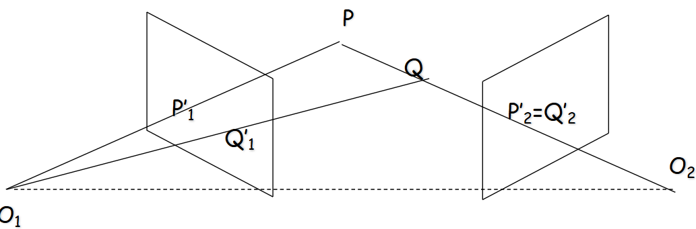{width=75%}
</figure>

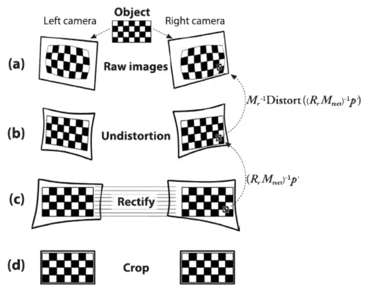{align=right width=30%}

构建立体视觉主要可以分为四个步骤：

- 畸变矫正（Undistortion）
    - 通过标定摄像机的内参和外参来矫正摄像机的畸变，把图像进行处理得到矫正后的图像。
- 图像校正（Rectification）
    - 将两个摄像机的图像进行校正，使得它们在同一平面上。
- 对应点匹配（Correspondence Matching）
    - 在校正后的两张图像中找到对应的特征点，并计算它们的视差。
- 反投影（Reprojection）
    - 利用三角化原理，计算得到深度图。

### 三角化

假设我们已经得到了两张去畸变、对齐（焦点所在直线平行）并且长度单位相同的图片，同时我们还知道 3D 点在 2D 图像平面中的位置，那么我们就可以利用三角化来获取点的深度信息

<figure markdown="span">
    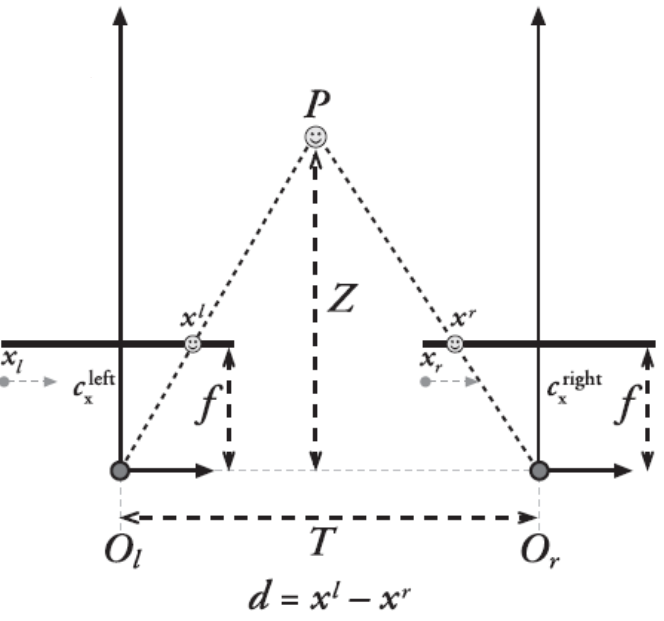{width=75%}
</figure>

通过相似三角形的知识，我们可以从上图中知道
$$ \dfrac{T - (x^l - x^r)}{Z-f} = \dfrac{T}{Z} $$
从而可以得到
$$ Z = \dfrac{f T}{x^l - x^r} $$

!!! info "深度分辨率"
    视差变化时，图像的深度也会发生变化；但深度随视差的变化不是均匀的，只有在靠近相机的位置才有较高的深度分辨率，即可以分辨出较小的视差。

    例如在较近的位置，一米的视差可以观测到很明显的深度变化，但在很远的位置（例如几百米），一米的视差变化就很难观测到了

    <figure markdown="span">
        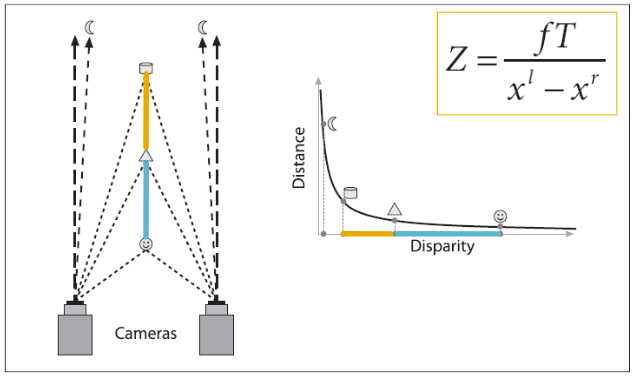{width=65%}
    </figure>

