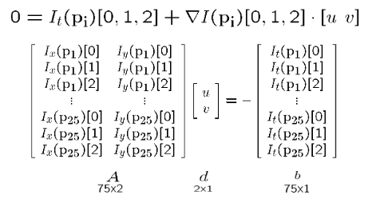
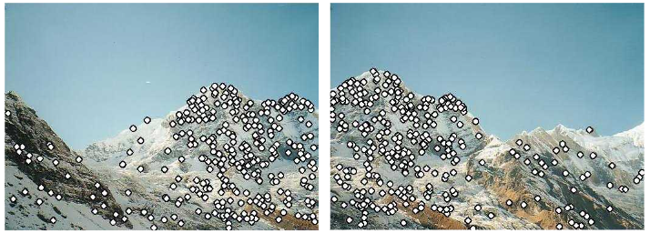
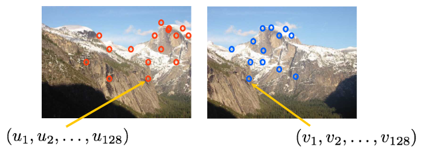
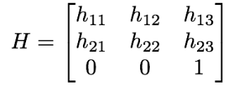
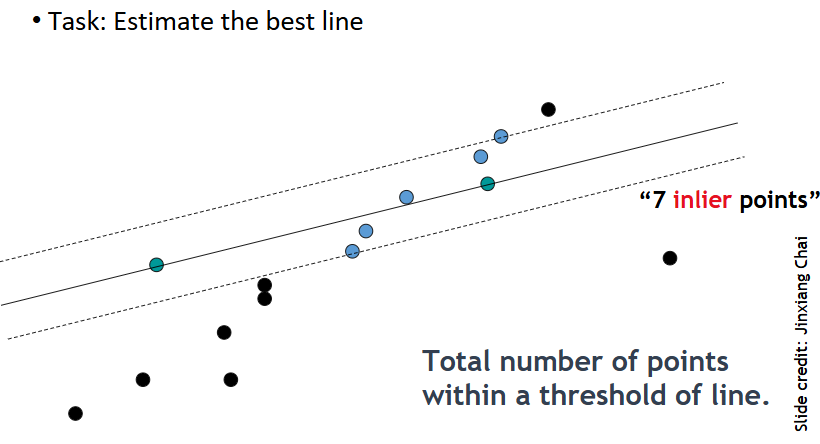
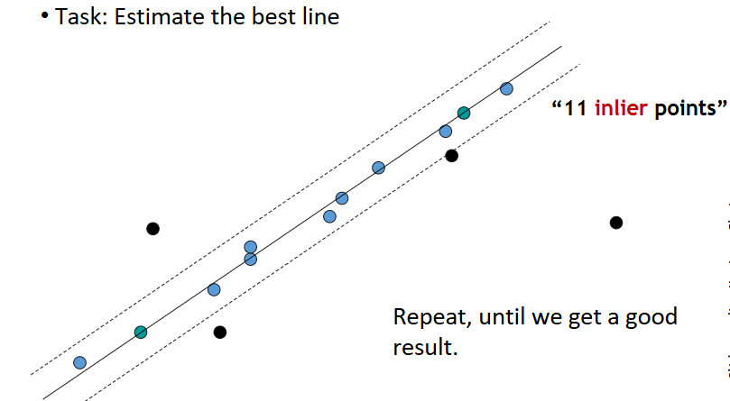
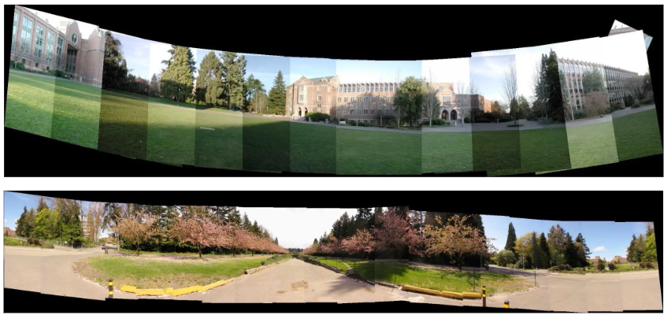
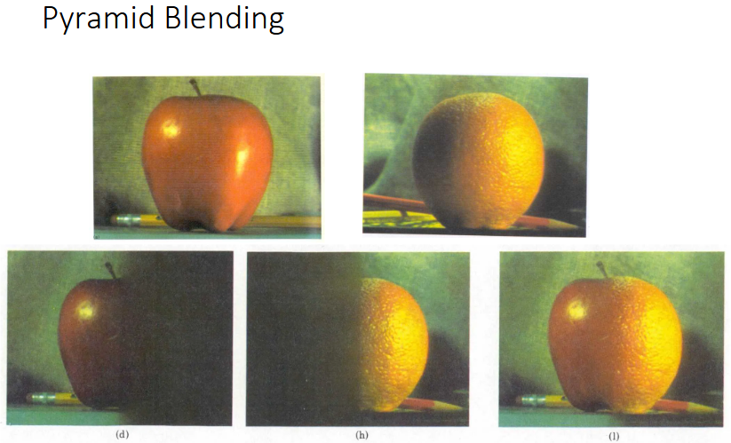

# 运动估计 & 图像分割

!!! info "运动估计"
    运动估计在从连续的图像序列中估计物体或相机的运动，通常用于视频分析、机器人导航和增强现实等应用。

## 运动估计

### 光流

> 其他运动估计方法也可以参考[这里的笔记](../selfstudy/EECS498/lec20.md#optical-flow)

光流法即通过比较连续的图像或视频帧中的像素变化来估计物体或相机的运动。它假设

- 像素的亮度保持不变
- 物体在连续帧之间的运动是平滑的（空间一致性）
- 运动幅度较小

<figure markdown="span">
    {width=75%}
</figure>

在物体（像素）的运动距离较短时，我们可以使用泰勒级数展开来近似像素的亮度变化，即

$$ I(x+dx, y+dy, t+dt) \approx I(x, y, t) + \frac{\partial I}{\partial x} dx + \frac{\partial I}{\partial y} dy + \frac{\partial I}{\partial t} dt $$

由于我们假设相同对象的像素灰度值不变，就有 $I(x+dx,\ y+dy,\ t+dt) = I(x,\ y,\ t)$，因此消去相同项，并都除以 $dt$，我们可以得到

$$ I_x u + I_y v + I_t = 0 $$

其中 $I_x, I_y, I_t$ 分别是图像在 $x, y, t$ 方向的梯度，$u = dx/dt, v = dy/dt$ 分别是像素在 $x, y$ 方向的速度。这个式子被称为**光流约束方程**，有时也记为
$$ 0 = I_t + \nabla I \cdot \begin{pmatrix} \frac{\partial x}{\partial t} \\\\ \frac{\partial y}{\partial t} \end{pmatrix} $$

!!! note 
    对于单个像素，光流约束方程对应 $uv$ 坐标系中的一条直线

    <figure markdown="span">
        {width=75%}
    </figure>

    而对于含有多个像素的小窗口，我们会得到一簇直线，它们会存在公共交点（如果有不止一个公共交点，那么就取交于某点数量最多的一簇），这个公共交点的坐标（u，v）就是这个窗口内像素的在 x 和 y 方向上随时间的整体运动趋势。

    <figure markdown="span">
        {width=75%}
    </figure>

### Lucas-Kanade 法

Lucas-Kanade 法是一种常用的光流估计方法，它假设在一个小的局部窗口内，光流是平滑的（窗口内所有点具有相同的运动趋势）。因此我们就可以利用这些点运动约束方程的方程组来求解未知数 $u, v$。

例如我们可以使用最小二乘法来求解 $u, v$，即最小化以下目标函数
$$ E(u, v) = \sum_{i=1}^{N} (I_x^i u + I_y^i v + I_t^i)^2 $$

<figure markdown="span">
    {width=75%}
    {width=75%}
</figure>

!!! tip
    上图中的矩阵乘法式其实就是窗口内所有像素的光流约束方程组成的方程组

    <figure markdown="span">
        {width=75%}
    </figure>

当出现以下情况时 Lucas-Kanade 法会失败：

- 像素亮度不保持一致
- 物体运动幅度较大
- 窗口内的点不具有相同的运动
    - 通常此时认为我们取的窗口太大了

有时为了保证光流法估计的准确性，还会进行分层的光流估计，即对图片进行下采样，然后在不同的分辨率下进行光流估计，最后将结果上采样到原始分辨率。

<figure markdown="span">
    {width=75%}
</figure>

## 图像分割

图像分割（Image Segmentation）是将图像分成多个有意义的区域或对象的过程，以便更容易地分析和理解图像内容。

- 不连续性：指区域之间像素值差别比较大，在边界上具有某种不连续性。
- 相似性：指区域内部像素值之间具备一定的相似性。

进行图像分割的方法包括聚类、阈值分割、边缘检测等。

!!! note "k-means 聚类"
    k-means 聚类是图像分割中常用的一种方法，它通过将像素分成 $k$ 个簇来实现分割，概念和方法都很简单，到处都能查得到，就不在这里赘述了。

    - 优点：简单快速，易于实现
    - 缺点：需要预先指定 $k$ 值，对噪声和异常点敏感，可能会陷入局部最优

    <figure markdown="span">
        {width=75%}
    </figure>

### mean-shift 分割

mean-shift 分割是一种基于密度的图像分割方法，它通过在特征空间中寻找高密度区域来实现分割。它的基本思想是通过迭代地移动数据点到其邻域内的平均值来找到数据的密集区域。

<figure markdown="span">
    {width=75%}
</figure>

算法的过程如下：

- 选择一个核函数和考虑的窗口大小（为简便起见，窗口不一定是圆，也可以是正方形或矩形）
- 对于每一个点
    - 将这个点作为窗口的中心
    - 计算窗口范围内所有点的平均值（可以理解为重心）
    - 将窗口移动到新的平均值位置
    - 重复上述步骤，直到平均值不再变化（收敛）
- 将所有点分配到最近的平均值所在的簇中

!!! note
    - 在实际应用中，mean-shift 分割通常会在特征空间中进行，而不仅仅是在像素空间。特征空间可以是颜色空间、纹理空间等。
    - 每有一个点，就需要进行一次计算窗口中心点的迭代过程，因此计算复杂度较高，尤其是在处理高维数据和大图像时。

常见的核函数有：

- 正态核函数：
    $$ K_N(x) = c \cdot e^{-\frac{x^2}{2}} $$
- 均匀核函数：
    $$ K_U(x) = \begin{cases} 
    c & \text{if } \Vert x \Vert < 1 \\\\
    0 & \text{otherwise}
    \end{cases} $$
- Epanechnikov 核函数：
    $$ K_E(x) = \begin{cases} 
    c (1 - \Vert x \Vert^2) & \text{if } \Vert x \Vert < 1 \\\\
    0 & \text{otherwise}
    \end{cases} $$

!!! note "mean-shift 分割的优缺点"
    - 优点：
        - 不需要预先指定簇的数量，能够处理任意形状的簇
        - 对噪声和异常点不敏感
    - 缺点：
        - 计算复杂度较高，可能会受到窗口大小的影响
        - 需要预先指定核函数
        - 不适用于高维数据

!!! example "mean-shift 分割效果示例"
    <figure markdown="span">
        {width=75%}
    </figure>

### graph cut 分割

graph cut 分割是一种基于图论的图像分割方法，它将图像看作一个图，节点表示像素，边表示像素之间的相似性。通过最小化图的割（cut）来实现分割。

在一个流网络中，最大流等于最小割的容量，我们可以利用这个定理来解决图像分割问题。

> 关于图的割和流的概念在这里不在重复了

!!! info "Ford-Fulkerson 算法"
    Ford-Fulkerson 算法是一种求解最大流问题的算法，它通过不断寻找增广路径来增加流量，直到没有增广路径为止。

    - 初始化：将所有边的流量设置为 0
    - 重复以下步骤，直到没有增广路径：
        - 在残差网络中寻找增广路径
        - 计算增广路径上的最小容量
        - 沿着增广路径增加流量
        - 更新残差网络

    <figure markdown="span">
        {width=65%}
    </figure>

## 图像拼接

!!! abstract "主要流程"
    - Detect key points
    - Build the SIFT descriptors
    - Match SIFT descriptors
    - Fitting the transformation
    - RANSAC
    - Image Blending

1. 首先需要寻找两张图片中的特征点

    <figure markdown="span">
        {width=65%}
    </figure>

2. 为这些特征点建立 SIFT 描述子（SIFT descriptors）

    > 关于 SIFT 描述子的详细内容在[这里](./lec4.md#sift)

    <figure markdown="span">
        {width=70%}
    </figure>

3. 把这些 SIFT descriptors 匹配起来，找到相互对应的特征点
4. 根据这些特征点的对应关系，得到一个仿射变换矩阵

    <figure markdown="span">
        {width=65%}
    </figure>

    一组点对提供两个约束方程，因此至少需要三个点对

5. 使用 RANSAC 方法提高求解准确率

    ??? info "RANSAC（RANdom SAmple Consensus）"
        基本假设：

        - 正确数据（inliers）：可以被模型描述的数据
        - 错误数据（outliers，离群点）：大幅偏离正常范围，无法被模型正确描述

        算法步骤：

        1. 随机选择若干个点作为 seed group
        2. 根据 seed group 中的点计算转换模型（建立模型）
        3. 将其他的点带入这个转换模型中，判断他们是否属于内点（inliers）
            - 可以通过特定的损失函数等来判断他们是否属于内群（consensus set）
        4. 记录属于内群的点的数量，重复以上步骤
        5. 比较那次计算中内群点数最多，这次计算对应的模型就是要求的解

        **优缺点**：

        - 优点：适用性广（可以用于解决很多模型拟合问题）、易于实现、计算快
        - 缺点：只能用于计算 outliers 不多的情况 —— 与之相对的，Hough 

        !!! example
            例如我们使用 RANSAC 来寻找一个点集的直线拟合

            <figure markdown="span">
                {width=65%}
            </figure>

            <figure markdown="span">
                {width=65%}
            </figure>

6. 最后可以把变换后的图片拼接、渲染出来

    <figure markdown="span">
        {width=60%}
    </figure>

    <figure markdown="span">
        {width=60%}
    </figure>
