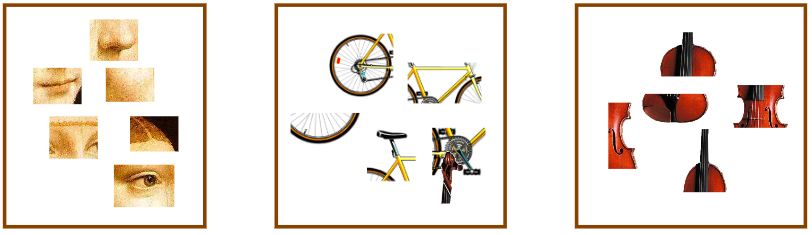
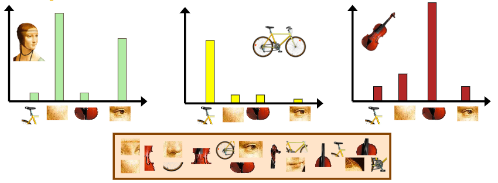
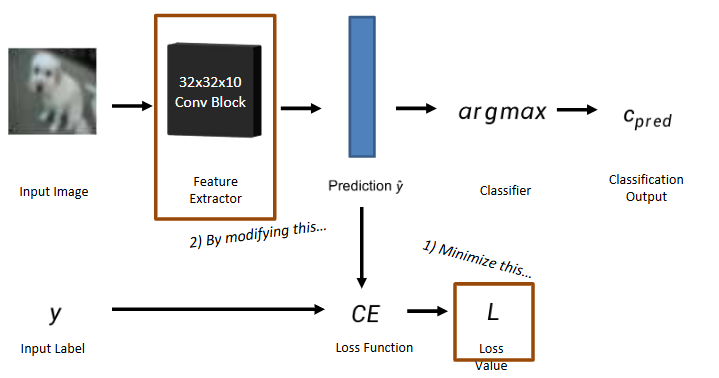
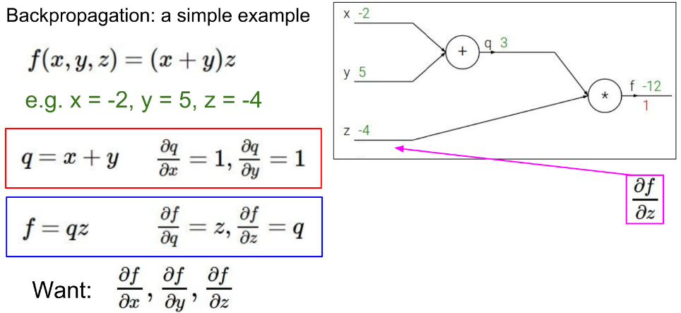
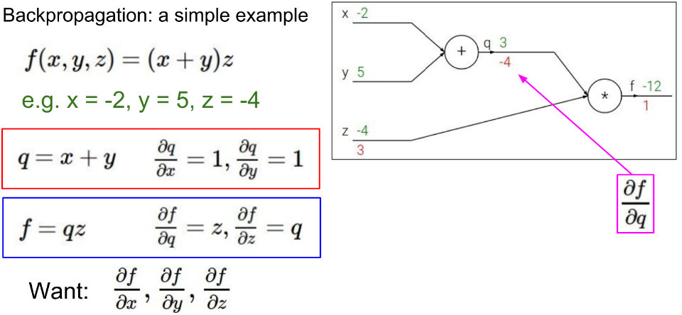
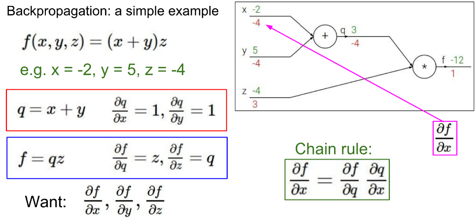
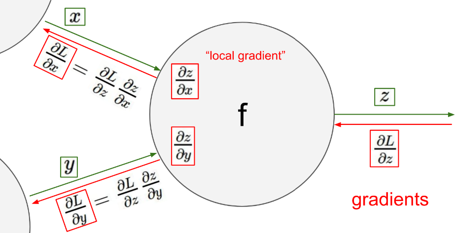
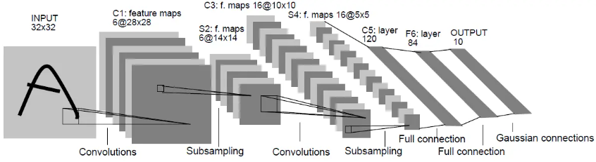

# 图像分类 & CNN

## 词袋法（Bag-of-word）

一个图像中的单词（word）被定义为一个图像块中的特征向量（如 SIFT 特征描述），图像的 BoW 模型即对图像中所有图像块的特征向量进行统计得到的直方图。

<figure markdown="span">
    {width=70%}
</figure>

<figure markdown="span">
    {width=70%}
</figure>

**基本步骤**：

- 对图像进行预处理，进行特征的提取和表示（SIFT 特征）
- 对特征进行聚类（常用 K-means），得到 K 个视觉词组成的字典（codewords dictionary）
- 使用直方图来表示一个图片中各个视觉词出现的次数
- 根据 bag of word 来分类一个未知图片

## CNN

> 老生常谈的内容了，这里就随便记点可能和考试有关的东西🥲

CNN，即**卷积神经网络（Convolutional Neural Network）**，主要由卷积层、池化层、全连接层构成。

卷积层和池化层的作用是提取图像特征，全连接层的作用是进行分类。

- 卷积层是 CNN 的核心，通过卷积操作提取图像特征
- 池化层用于降低特征图的维度，减少计算量，同时保留重要特征
- 全连接层（线性层）将卷积层和池化层提取的特征进行整合，输出分类结果，通常容颜主要的参数和计算量都在全连接层上

!!! info "使用 CNN 进行图像分类"
    <figure markdown="span">
        {width=80%}
    </figure>

### 卷积层

设输入图像大小为 N×N，卷积核大小为 K×K，步长为 s，填充为 p，则输出特征图大小为：
$$ M = \frac{N - K + 2p}{s} + 1 $$

- 每个神经元（卷积核）的参数数量为 $K^2+1$（还要加上一个 bias）
- 如果使用了 $C$ 个卷积核，那么输出图像的通道数为 $C$，参数总数为 $C \times (K^2 + 1)$。
- 如果输入图像有多个通道（例如 RGB 图像），每个卷积核会应用于所有的输入通道
    - 每个输出通道都有一个独立的偏置项（bias）
    - 总参数数量为 $ (C_{in} \times K^2 + 1) \times C_{out}$

### 池化层

单图池化：max pooling、average pooling

- 减少参数数量
- 获得更大的感受野
- 使特征对于图像的微小变化更鲁棒、平滑图像

多图池化：全局最大池化（Global Max Pooling）

- 减少参数数量
- 找到多图之间最显著的特征

### 反向传播

> 详细内容可参考 [EECS498 的笔记](../selfstudy/EECS498/lec5.md)

本质是基于复合求导，通过链式法则计算梯度，然后使用梯度下降法更新参数，用于求解局部最优的权重 W（未必能达到全局最优）

计算图：

- 节点：运算符
    - 常见的有加法、乘法、max 等
- 连线上方：前向计算结果
- 连线下方：反向传播的梯度值

!!! example "反向传播计算图"
    <figure markdown="span">
        {width=70%}
    </figure>

    <figure markdown="span">
        {width=70%}
    </figure>

    <figure markdown="span">
        {width=70%}
    </figure>

<figure markdown="span">
    {width=70%}
</figure>

常见方程的导数：

- $y = ax + b$，则 $\dfrac{\partial y}{\partial x} = a$
- $y = x^2$，则 $\dfrac{\partial y}{\partial x} = 2x$
- $y = \max(x, z)$，则 $\dfrac{\partial y}{\partial x} = \begin{cases} 1 & x > z \\ 0 & x \leq z \end{cases}$
- $y = sigmoid(x)$，则 $\dfrac{\partial y}{\partial x} = y(1 - y)$

!!! note "LeNet-5"
    LeNet-5 是一个经典的卷积神经网络架构，主要用于手写数字识别。
    
    它包含了两个卷积层、两个池化层和三个全连接层。

    <figure markdown="span">
        {width=90%}
    </figure>

    1. 输入层：输入图像大小为 32×32 的灰度图像
    2. 卷积层 1：使用 6 个 5×5 的卷积核，输出特征图大小为 28×28×6
    3. 池化层 1：使用 2×2 的平均池化，输出特征图大小为 14×14×6
    4. 卷积层 2：使用 16 个 5×5 的卷积核，输出特征图大小为 10×10×16
    5. 池化层 2：使用 2×2 的平均池化，输出特征图大小为 5×5×16
    6. 全连接层 1：将特征图展平，输出为 120 维向量
    7. 全连接层 2：输出为 84 维向量
    8. 输出层：使用 softmax 激活函数，输出为 10 维向量（对应 10 个数字类别）
