# Query Optimization

## Introduction 

Alternative ways of evaluating a given query

- Equivalent expressions

    在逻辑层面优化：采用等价的关系代数表达式，例如先做选择、投影，再做连接等。

- Different algorithms for each operation

    在物理层面优化：每个算子都可以选择不同的算法来实现，例如连接可以用嵌套循环、排序-合并、哈希等方法。

<figure markdown="span">
    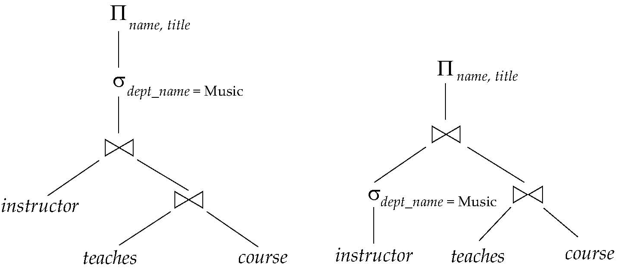{width=65%}
</figure>

一个**评估计划（evaluation plan）**是一个查询的物理实现，它明确指定了每个算子需要使用哪个算法实现，以及这些算子的执行需要如何协调进行。对于同一个查询操作，不同的评估计划的执行代价可能会有很大的差异。（极端情况下时间成本会从几秒到几天之间变化）

1. Generate logically equivalent expressions using equivalence rules 
2. Annotate resultant expressions to get alternative query plans
3. Choose the cheapest plan based on estimated cost

对评估计划的代价估计基于以下几个方面：

- Statistical information about relations
    - 执行计划前预先知道的信息，例如表的大小、索引的存在等
    - e.g., Number of tuples, number of distinct values for an attribute 
- Statistics estimation for intermediate results
    - To compute cost of complex expressions
    - 估计中间结果的大小，如今有基于深度学习的估计方法
- Cost formulae for algorithms, computed using statistics
    - 估计每个算法的代价，例如连接算法的代价

## Transformation of Relational Expressions

Two relational algebra expressions are said to be **equivalent** if the two expressions generate the same set of tuples on every legal database instance

也就是说，如果无论在什么数据库实例下，两个表达式的结果集都是一样的，那么这两个表达式就是等价的。这些表达式可能在形式上和语义上都有所差别，甚至用了截然不同的算子，但只要结果集相同，就可以认为它们是等价的。

### Equivalence Rules

1. 析取选择（conjunctive selection）算子可以被拆分为多个选择算子
    $$ \sigma_{\theta_1 \land \theta_2}(E) = \sigma_{\theta_1}(\sigma_{\theta_2}(E)) $$
2. 选择算子之间是可交换的（commutative）
    $$ \sigma_{\theta_1}(\sigma_{\theta_2}(E)) = \sigma_{\theta_2}(\sigma_{\theta_1}(E)) $$
3. 进行一系列投影操作时，可以只保留最后的投影算子
    $$ \Pi_{L_1}(\Pi_{L_2}( \ldots (\Pi_{L_n}(E)) \ldots)) = \Pi_{L_1}(E) $$
4. 选择算子可以和笛卡尔乘积以及连接算子结合
    $$ \sigma_{\theta}(E_1 \times E_2) = E_1 \bowtie_\theta E_2 $$
    $$ \sigma_{\theta1}(E_1 \bowtie_{\theta2} E_2) = E_1 \bowtie_{\theta1 \land \theta2} E_2 $$
5. theta 连接算子（即条件连接）以及自然连接之间是可交换的
    $$ E_1 \bowtie_{\theta} E_2 = E_2 \bowtie_{\theta} E_1 $$
6. 自然连接算子是可结合的
    $$ (E_1 \bowtie E_2) \bowtie E_3 = E_1 \bowtie (E_2 \bowtie E_3) $$

    - 特别地，当满足一定条件时，theta 连接也是可结合的
    $$ (E_1 \bowtie_{\theta_1} E_2) \bowtie_{\theta_2 \land \theta_3} E_3 = E_1 \bowtie_{\theta_1 \land \theta_3} (E_2 \bowtie_{\theta_2} E_3) $$
    其中 $\theta_2$ 只涉及 $E_2$ 和 $E_3$ 中的属性，$\theta_1$ 只涉及 $E_1$ 和 $E_2$ 中的属性

7. 满足下面两个条件时，选择算子对 theta 连接算子具有分配律
    - 当 $\theta_0$ 中所有的属性都只涉及其中一个表达式时（例如只涉及 $E_1$）
        $$ \sigma_{\theta_0} (E_1 \bowtie_{\theta} E_2) = (\sigma_{\theta_0}(E_1)) \bowtie_{\theta} E_2 $$
    - 当 $\theta_1$ 只涉及 $E_1$ 中的属性，而 $\theta_2$ 只涉及 $E_2$ 中的属性时
        $$ \sigma_{\theta_1 \land \theta_2} (E_1 \bowtie_{\theta} E_2) = (\sigma_{\theta_1}(E_1)) \bowtie_{\theta} (\sigma_{\theta_2}(E_2)) $$

    简单来说，选择操作的分配律就是：**先连后选 $\to$ 先选后连**。

8. 满足下面二个条件时，投影操作对连接运算具有分配律（先连后投 $\to$ 先投后连）
    - $\theta$ 仅涉及 $L_1 \cup L_2$ 中的属性
        $$ \Pi_{L_1 \cup L_2} (E_1 \bowtie_{\theta} E_2) = (\Pi_{L_1}(E_1)) \bowtie_{\theta} (\Pi_{L_2}(E_2)) $$
    - 对于连接 $E_1 \bowtie_{\theta} E_2$，我们用 $L_1, L_2$ 分别表示 $E_1$ 和 $E_2$ 中需要被投影出来的属性集合，$L_3$ 表示在 $E_1$ 中但不在 $L_1 \cup L_2$ 中的属性集合，$L_4$ 表示在 $E_2$ 中但不在 $L_1 \cup L_2$ 中的属性集合
        $$ \Pi_{L_1 \cup L_2} (E_1 \bowtie_{\theta} E_2) = \Pi_{L_1 \cup L_2} (\Pi_{L_1 \cup L_3}(E_1) \bowtie_{\theta} \Pi_{L_2 \cup L_4}(E_2)) $$

        **先连后投 $\to$ 先投后连，再投影**
        
        如果连接要用到投影后不保留的属性，我们在第一次投影时要把连接用的属性也保留下来

9. 集合算子：

    <figure markdown="span">
        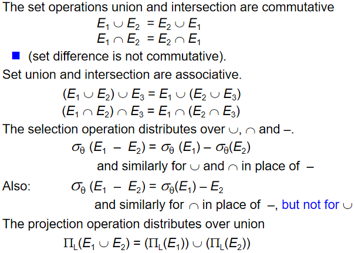{width=75%}
    </figure>

!!! note
    - 由于连接操作的开销较大，一般而言我们会先做选择和投影操作，减小连接操作的输入数据量，然后再做连接操作。
    - 当我们需要多次连接时，连接操作的顺序会影响到最终的代价。
        - 例如 $E_1 \bowtie E_2 \bowtie E_3$，如果 $E_1 \bowtie E_2$ 的结果集比 $E_2 \bowtie E_3$ 的结果集小，那么我们就应该先做 $E_1 \bowtie E_2$，再做 $E_2 \bowtie E_3$ 
        - 对于更多个表达式的连接操作，我们可以使用动态规划的方法来选择连接的顺序。（类似于矩阵乘法链）

### Enumeration of Equivalent Expressions

我们可以按下面的步骤生成所有的等价表达式

- Repeat
    - apply all applicable equivalence rules on every subexpression of every equivalent expression found so far
    - add newly generated expressions to the set of equivalent expressions
- Until no new equivalent expressions are generated above

这样的方法在时间和空间上的开销都很大，在实践中我们通常会根据一些经验规则进行启发式的优化

## Statistics for Cost Estimation

代价估算需要我们预先知道一些统计信息：

- $n_r$: number of tuples in a relation $r$.
- $b_r$: number of blocks containing tuples of $r$.
- $l_r$: size of a tuple of $r$.
- $f_r$: blocking factor of $r$
    - i.e., the number of tuples of $r$ that fit into one block

        即一个块中能存放多少个元组。

- $V(A, r)$: number of distinct values that appear in $r$ for attribute $A$; same as the size of $\Pi_A(r)$. 

    要去掉重复的元组，得到一个关于属性的值的集合。

- If tuples of r are stored together physically in a file, then $b_r = \lceil \dfrac{n_r}{f_r} \rceil$.

??? example "直方图"
    例如我们可以一个直方图来表示关系 person 中的年龄属性的分布情况。
    <figure markdown="span">
        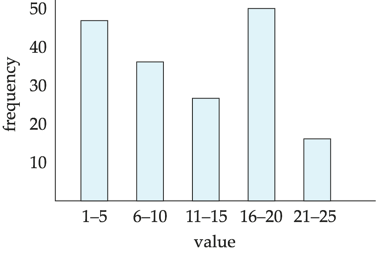{width=70%}
    </figure>

### Selection Size Estimation

- $\sigma_{A=v}(r)$
    - 假设属性值均匀分布，那么就会选择出 $n_r / V(A, r)$ 个记录
    - 假如等值选择是基于键属性的，那么我们就会选择出 $1$ 个记录
- $\sigma_{A \leqslant v}(r)$（$\sigma_{A \geqslant v}(r)$ 是类似的对称情况）
    - 假设有 $c$ 个元组满足上述条件，并且 $\min(A,r)$ 和 $\max(A,r)$ 是可以从统计信息中得到的，那么
        - 如果 $v < \min(A,r)$，那么 $c = 0$
        - 如果 $v > \max(A,r)$，那么 $c = n_r$
        - 否则 $c = n_r \cdot \dfrac{v - \min(A,r)}{\max(A,r) - \min(A,r)}$（假设分布是均匀的）
    - 在无法得知最大最小值的情况下，我们可以假设 $c = n_r / 2$，即一半的元组满足条件

!!! info "Size Estimation of Complex Selections"
    <figure markdown="span">
        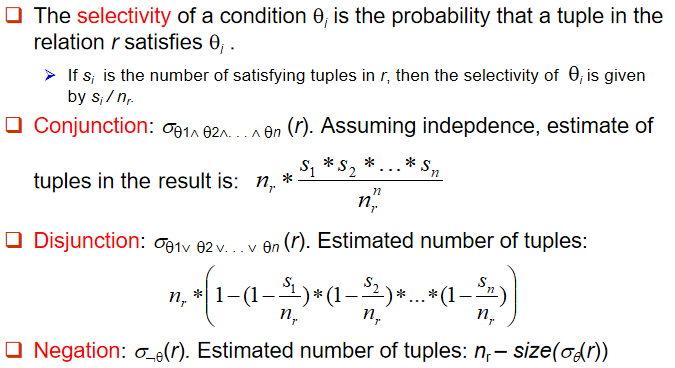{width=75%}
    </figure>

    需要注意的是，这里的公式都要求各个条件（事件）是相互独立的

### Join Size Estimation

The Cartesian product $r \times s$ contains $n_r \cdot n_s$ tuples; each tuple occupies $s_r + s_s$ bytes.

- 如果 $R \cap S = \emptyset$，两个关系没有公共属性，$r \bowtie s$ 等价于 $r \times s$，即笛卡尔积
- 如果 $R \cap S$ 是其中一个集合的键，比如 $R$，那么 $s$ 中的每一个元组至多会匹配到 $r$ 中的一个元组
    - 因此 $r \bowtie s$ 的元组数量一定不会大于 $n_s$，即 $s$ 中的元组数量
- 如果 $R \cap S$ 是 $S$ 中一个参照着 $R$ 的外码，那么 $r \bowtie s$ 的元组数量就等于 $n_s$，即 $s$ 中的元组数量
    - 如果 $R \cap S$ 是 $R$ 中参照着 $S$ 的外码，就是对称的情况
- 如果 $R \cap S = \{ A \}$ 不是 $R$ 或 $S$ 的键属性，那么
    - 如果我们假设 $R$ 中的每个元组都会产生 $R \bowtie S$ 中的元组，结果的元组数量会被估计为 $\dfrac{n_r \cdot n_s }{V(A, s)}$，即每个 $R$ 中的元组都会产生 $\dfrac{n_s}{V(A, s)}$ 个元组
    - 反之，我们也可以估计为 $\dfrac{n_r \cdot n_s }{V(A, r)}$，即每个 $S$ 中的元组都会产生 $\dfrac{n_r}{V(A, r)}$ 个元组
    - 通常而言，两者中较小的那一个更接近真实值

??? example "Join Size Estimation"
    <figure markdown="span">
        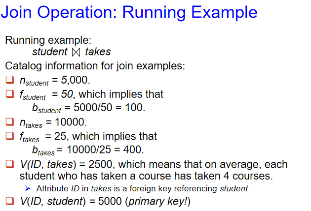{width=65%}
    </figure>

    <figure markdown="span">
        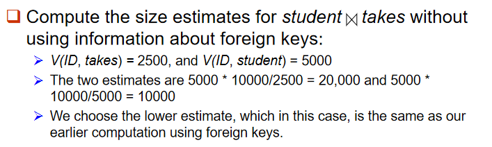{width=65%}
    </figure>
    
### Size Estimation for Other Operations

- 投影 $\Pi_A(r)$：$V(A, r)$ 个元组
- 聚合 $_A\mathcal{G}_F(r)$：$V(A, r)$ 个元组
- 外部连接
    - $r \rtimes s$：$r \bowtie s$ 的大小 + $r$ 的大小（$n_r$）
    - $r$ ⟗ $s$：$r \bowtie s$ 的大小 + $r$ 的大小（$n_r$） + $s$ 的大小（$n_s$）
- 集合操作：
    - 在同一个关系上的交/并集操作，可以把它重写为选择操作
        - 例如 $\sigma_{\theta_1}(r) \cup \sigma_{\theta_2}(r)$ 可以重写为 $\sigma_{\theta_1 \lor \theta_2}(r)$
    - 在不同关系上的交/并集操作，可以进行非常粗略的估计（可以给出结果大小的一个上界）
        - $r \cup s$：$n_r + n_s$
        - $r \cap s$：$\min(n_r, n_s)$
        - $r - s$：$n_r$

### Estimation of Distinct Values

对选择操作 $\sigma_\theta(r)$, 要估计 $V(A,\sigma_\theta(r))$

- If $\theta$ forces A to take a specified value 
    - $V(A,\sigma_\theta(r))=1$
- If $\theta$ forces A to take on one of a specified set of values: 
    - $V(A,\sigma_\theta(r))=$ number of specified values  
- If the selection condition $\theta$ is of the form $A op v$
    - $V(A,\sigma_\theta(r)) = V(A,r) \times s$ 其中 $s$ 是选择率
- In all the other cases, use approximate estimate:
    - $V(A,\sigma_\theta(r))=\min(V(A,r),\ n_{\sigma_\theta(r)})$

对于连接操作 $r \bowtie s$，要估计 $V(A,r \bowtie s)$

- If all attributes in $A$ are from $r$
    - $V(A,r\bowtie s)=\min(V(A,r), n_{r\bowtie s})$
- If $A$ contains attributes $A_1$ from $r$ and $A_2$ from $s$, 
    - $V(A,r\bowtie s) = \min(V(A_1,r) \times V(A_2-A_1,s),\ V(A_1-A_2,r) \times V(A_2,s),\ n_{r\bowtie s})$

        三者中较小的一个

### Choice of Evaluation Plans

- Must consider the interaction of evaluation techniques when choosing evaluation plans
    - 对每个操作独立地采用成本最低的算法未必能让整体的成本最低
- Practical query optimizers incorporate elements of the following two broad approaches
    - Search all the plans and choose the best plan in a cost-based fashion

        可以暴力搜索所有的评估计划，选择成本最低的计划，但是开销非常大，我们有时可以使用动态规划等方法来减少搜索空间

    - Uses heuristics to choose a plan

        基于过往经验等其他信息，用启发式方法来寻找可用的执行计划

## Dynamic Programming for Choosing Evaluation Plans

### Join Order Optimization Algorithm

例如我们想要找到对 $n$ 个关系的连接操作的优化，可以使用以下的算法：

<figure markdown="span">
    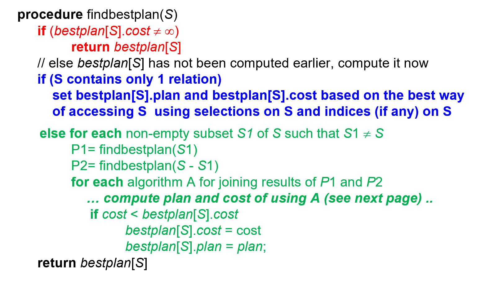{width=75%}
</figure>

- 使用动态规划后，上面的算法的时间复杂度为 $O(3^n)$，空间复杂度为 $O(2^n)$

!!! info "Left Deep Join Trees"
    In left-deep join trees, the right-hand-side input for each join is a relation, not the result of an intermediate join.

    <figure markdown="span">
        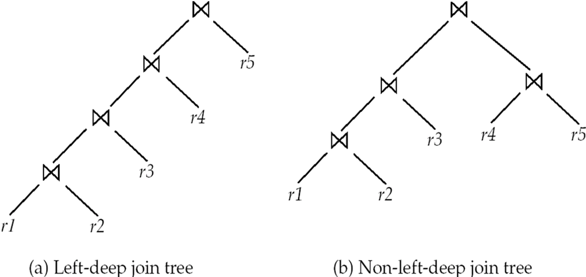{width=65%}
    </figure>

假如只考虑左深连接树，那么找到最优的连接树的时间复杂度为 $O(n \cdot 2^n)$，空间复杂度为仍 $O(2^n)$

### Interesting Sort Orders

An interesting sort order is a particular sort order of tuples that could be useful for a later operation

- 例如使用归并连接来计算 $r_1 \bowtie r_2$ 的开销可能会比使用哈希连接更大，但它会让结果按照连接属性排序，这对于后续的其他操作可能会有所帮助

因此为每一个连接操作寻找最佳的算法往往还不够，我们还需要考虑后续的操作。

- 我们只能为每个 interesting sort order 寻找最佳的连接子集（例如 $(r_1 \bowtie r_2) \bowtie r_3$ 中的 $r_1 \bowtie r_2$）
- 通常而言 interesting sort order 的数量不会太多，寻找它们的开销也不会太大

### Heuristic Optimization

直接基于开销进行优化可能会带来很大的开销，反而得不偿失，因此我们可以使用一些开销较小的启发式方法来进行优化，例如：

- 先执行选择操作：减少元组数量
- 先执行投影操作：减少属性数量
- 先执行限制性最强的选择和连接操作：得到的结果集更小

## Additional Optimization Techniques

### Nested Subqueries

例如我们会使用嵌套子查询来找出 2022 开课的老师的名字：

```sql
select name from instructor 
where exists 
    (select * from teaches
    where instructor.ID = teaches.ID and teaches.year = 2022)
```

这里我们会使用到两层循环，外层循环是对 instructor 表的循环，内层循环是对 teaches 表的循环，如果不优化直接执行，效率很低。

!!! info "correlation variables and correlation ecaluation"
    **Parameters** are variables from outer level query that are used in the nested subquery; such variables are called **correlation variables**

    我们把来自于外层查询中，并且会在内层查询中被使用的变量称为**关联变量（correlation variables）**

    Conceptually, nested subquery is executed once for each tuple in the cross-product generated by the outer level from clause

    概念上来说，对于由外层查询的 from 子句生成的笛卡尔积中的每一个元组，嵌套子查询都要执行一次。

    - Such evaluation is called **correlated evaluation（关联执行）**
    - Note: other conditions in where clause may be used to compute a join (instead of a cross-product) before executing the nested subquery

关联执行并不高效，因为它会导致内层查询被执行多次，造成多次不必要的 I/O 操作。如果可能的话，SQL 优化器会尝试把嵌套子查询转变为连接操作，例如上面的查询可以被转变为：

```sql
select name 
from instructor, teaches
where instructor.ID = teaches.ID and teaches.year = 2022
```

总的来说，SQL 优化器会尝试把嵌套子查询转变为连接操作，或者把内层查询的结果集存储在临时表中，然后再进行连接操作。

<figure markdown="span">
    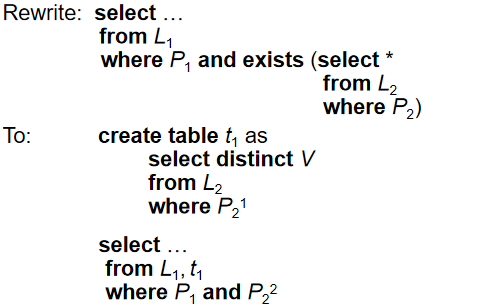{width=65%}
</figure>

- $P_2^1$ 表示 $P_2$ 中不包含关联变量的谓词
- $P_2^2$ 表示 $P_2$ 中包含关联变量的谓词
- $V$ 包含所有在 $P_2^2$ 中使用到的属性

把一个嵌套查询转化为一个使用连接操作的查询（可能还会带有一个临时关系）的过程称为**去相关化（decorrelation）**。

### Materialized Views

A **materialized view** is a view whose contents are computed and stored.

有时为了提高效率，我们会把一个视图（view）计算出来并真实地存储在一个物理表中，这个表称为**物化视图（materialized view）**。

```sql
create view department_total_salary(dept_name, total_salary) as
select dept_name, sum(salary)
from instructor
group by dept_name
```

**materialized view maintenance（物化视图维护）**：

- 我们需要注意时刻保持这个视图和原始表一致，尤其是当原始表发生变化时。

比起每一次更新表时都重建一次视图，更好的方法是使用**增量视图维护（incremental view maintenance）**，即只更新那些受影响的元组。

我们把新插入或被删除的元组称为**差分（differential）**，分别记为 $i_r$ 和 $d_r$，对于不同的物化视图：

- join: 考虑一个物化视图 $V = r \bowtie s$
    - 插入时，$V^{new} = V^{old} \cup (i_r \bowtie s)$
    - 删除时，$V^{new} = V^{old} - (d_r \bowtie s)$

    ??? example
        <figure markdown="span">
            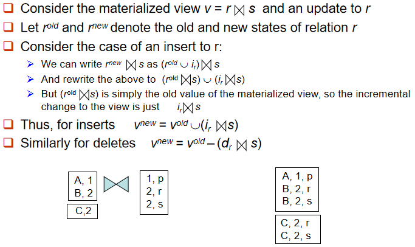{width=675%}
        </figure>

- selection: 考虑一个物化视图 $V = \sigma_\theta(r)$
    - 插入时，$V^{new} = V^{old} \cup \sigma_\theta(i_r)$
    - 删除时，$V^{new} = V^{old} - \sigma_\theta(d_r)$
- projection: 考虑一个物化视图 $V = \Pi_A(r)$
   
    我们需要记录 $\Pi_A(r)$ 中的所有元组，以及它们出现的次数

    - 插入时，如果新插入的元组已经出现在 $\Pi_A(r)$ 中了，就只需要增加它的计数器；如果没有出现过，就需要把它插入到 $\Pi_A(r)$ 中，并设置 count = 1
    - 删除时，把要删除的元组的计数器减去 1，如果计数器为 0，就需要把它从 $\Pi_A(r)$ 中删除

- aggregation: 

    <figure markdown="span">
        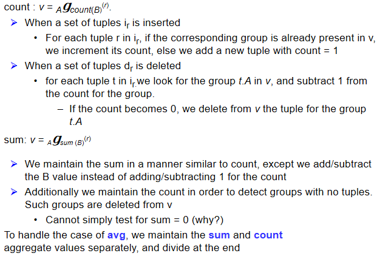{width=75%}
    </figure>

- 交集：考虑一个物化视图 $V = r \cap s$
    - 如果在 $r$ 中新插入了一个元组 $t$，那么就检查 $t$ 是否在 $s$ 中，如果在，就把它插入到 $V$ 中；如果不在，就不需要做任何操作
    - 如果在 $r$ 中删除了一个元组 $t$，那么就检查 $t$ 是否在 $s$ 中，如果在，就把它从 $V$ 中删除；如果不在，就不需要做任何操作
    - 对于 $s$ 中的插入和删除操作也是类似的

!!! extra "Query Optimization and Materialized Views"
    假设我们有一个物化视图 $v = r \bowtie s$
    
    - 那么我们可以把查询操作 $q = r \bowtie s \bowtie t$，重写为 $q = v \bowtie t$
    - 如果我们要查询 $\sigma_{A=10}(v)$，但是 $v$ 上没有索引，但是 $s$ 上有公共属性 $B$ 的索引，$r$ 上有选择属性 $A$ 的索引
        - 那么我们可以把 $v$ 替换回 $r \bowtie s$，最终的查询可以被写成 $\sigma_{A=10}(r) \bowtie s$
        - 这样一来，我们就可以利用 $r$ 上的索引来加速查询
