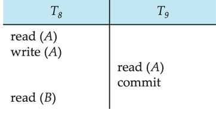

# Transaction

!!! definition "事务（transaction）"
    A transaction is a unit of program execution that accesses and possibly updates various data items. To preserve the integrity of data, the database system must ensure（**ACID** properties）:

    - **Atomicity**: 原子性，事务中的所有操作要么全部执行，要么全部不执行
    - **Consistency**: 一致性，事务执行前后，数据库的状态必须保持一致
    - **Isolation**: 隔离性，多个事务并发执行时，每个事务的执行不受其他事务的影响。
        - 也就是说，对于任意一对并发执行的事务 $T_1$ 和 $T_2$，执行的效果相当于 $T_1$ 执行完毕之后 $T_2$ 才开始执行，或者相当于 $T_2$ 执行完毕之后 $T_1$ 才开始执行。
    - **Durability**: 持久性，事务一旦提交，对数据库的修改是永久性的，即使系统崩溃也不会丢失

## Transaction State

事务可以分为以下几个阶段：

- **Active**: 初始状态，事务正在执行
- **Partially Committed**: 事务的最后一个操作已经执行完毕，但尚未提交。此时的结果数据可能还在内存的 buffer 中
- **Failed**: 事务执行失败，可能是由于系统错误、数据错误等原因导致的
- **Aborted**: 事务被中止，数据库需要恢复到事务开始之前的状态，此时有两种选择：
    - 重启事务，只有在没有内部逻辑错误的情况下才能这么做
    - 放弃事务，直接回滚到事务开始之前的状态
- **Committed**: 事务执行成功，所有操作的结果都已经提交到数据库中

<figure markdown="span">
    {width=65%}
</figure>

## Implementation of Atomicity and Durability

数据库系统中的恢复管理组件（recovery-management component）负责实现事务的原子性和持久性。下面介绍一种简单的恢复方法：**shadow database scheme**

- 使用一个名为 db_pointer 的指针来指向与当前数据库状态一致的数据库副本
- 对数据库的所有更新都在一个新创建的数据库副本上执行，而原始副本（即影子副本）保持不变
    - 若事务终止（abort），则丢弃新创建的副本
    - 若事务提交（commit），先把新副本中所有的 page 写入磁盘中，然后令 db_pointer 指向新副本，最后删除原始副本
- 这种方法的优点是简单易实现，缺点是需要两倍的存储空间，并且在系统崩溃时可能会丢失数据

<figure markdown="span">
    {width=65%}
    {width=65%}
</figure>

这种方法要求对 db_pointer 的操作是原子的，即要么成功，要么失败；同时还要求不能有并发访问、磁盘不能 fail 等等，否则可能会导致数据不一致的情况发生。

因此对于大型的数据库而言，shadow database scheme 并不适用，我们需要使用更复杂的恢复方法来实现事务的原子性和持久性。

## Concurrent Executions

并发指的是数据库系统允许多个事务同时执行。并发执行的优点如下：

- 提高处理器和磁盘的利用率，提高事务吞吐量
- 减少事务的平均响应时间，如短事务不再需要等待长事务执行完毕后才开始执行

但并发也会带来破坏数据一致性等问题，因此我们需要对并发进行控制，即控制事务之间的交互来避免对数据库一致性的破坏，这也是 DBMS 的一个重要工作。

!!! note "Schedules"
    调度（schedules）是指对多个事务中指令的执行顺序进行安排

    - 对一组事务的调度必须包含这些事务中的所有指令
    - 必须保证调度中每个事务中的指令按这些事务内部的顺序执行

!!! example
    假设在事务开始之前，A=1000，B=2000，A+B=3000

    <figure markdown="span">
        {width=75%}
    </figure>

    我们把如上图所示的调度方式称为**串行调度（serial schedule）**，它在一个事务彻底执行完毕后才开始执行下一个事务。
    
    串行调度是最简单但效率低下的调度方式，它一定能保证数据库的一致性（本例中是保证 A+B=3000）。但是不同的串行调度方式未必是等价的（执行结果不同），例如上图的两种调度方式就不是等价的（两种调度中 A、B 最终的值不同）。

    <figure markdown="span">
        {width=75%}
    </figure>

    如上图所示，如果两个事务中的指令交错执行，我们就称这种调度方式为**并发调度（concurrent schedule）**。并行调度的优点是可以提高系统的吞吐量，但它可能会导致数据库的不一致性，因此我们需要对并行调度进行控制。

## Serializability

对于串行调度，我们有一个基本的假设：每个事务自己都能保证数据库的一致性，因此一组事务的串行执行也能保证数据库的一致性。我们把这个假设称为**可串行化（serializability）**，即一个调度是可串行化的，当且仅当它等价于某个串行调度。

如果一个调度是可串行化的，那么它一定能保证数据库的一致性。

!!! note "serializable"
    如果一个调度（它可能是一个并发调度）等价于一个串行调度，那么我们就称这个调度是**可串行化的（serializable）**。
    
    可串行化是并发调度的一个重要性质，它保证了数据库的一致性。

根据调度的不同等价形式，我们可以把可串行化分为两种：

- **冲突可串行化（conflict serializable）**: 
    - 基于操作之间的冲突关系定义
    - 如果两个操作之间没有冲突关系，那么它们可以交换位置，假如若干次操作交换后可以把这个调度变成一个串行调度，那么我们就称这个调度是冲突可串行化的
- **视图可串行化（view serializable）**: 
    - 基于事务所观察到的数据库状态定义
    - 如果一个调度的结果和某个串行调度的结果相同，那么我们就称这个调度是视图可串行化的
    - 视图可串行化是冲突可串行化的一个推广（要求更为宽松），即所有冲突可串行化的调度都是视图可串行化的，但并不是所有视图可串行化的调度都是冲突可串行化的

!!! tip
    为了简便起见，我们的调度现在只考虑读、写操作的次序，忽略掉其他操作。但在读写操作之间可以对数据进行计算和处理。

### Conflict Serializability

对于来自事务 $T_i$ 和 $T_j$ 的两条指令 $I_i$ 和 $I_j$，我们说它们是**冲突的（conflicting）**，当且仅当它们存在对于同一个数据项 $Q$ 的访问，并且至少有一个指令是写操作

1. $I_i = \text{read}(Q)$，$I_j = \text{read}(Q)$：不冲突
2. $I_i = \text{read}(Q)$，$I_j = \text{write}(Q)$：冲突
3. $I_i = \text{write}(Q)$，$I_j = \text{read}(Q)$：冲突
4. $I_i = \text{write}(Q)$，$I_j = \text{write}(Q)$：冲突

直观上来说，如果两个操作之间存在冲突，那么它们之间就会存在一个逻辑上的时间次序。如果 $I_i$ 和 $I_j$ 在调度中是连续执行的，并且它们没有冲突，那么我们即使交换他们的位置也不会影响最终的结果

- 若 2 个操作有冲突，那么它们的执行次序不可交换
- 若 2 个操作没有冲突，那么它们的执行次序可以交换

!!! note "冲突可串行化"
    - 如果一个调度 $S$ 可以通过一系列对非冲突指令的交换变为另一个调度 $S'$，那么就称 $S$ 和 $S'$ 是**冲突等价（conflict equivalent）**的。也就是说，$S$ 和 $S'$ 的执行结果是一样的。
    - 如果一个调度与某个串行调度冲突等价，那么就称这个调度是**冲突可串行化（conflict serializable）**的。

!!! example
    <figure markdown="span">
        {width=65%}
    </figure>

    如上图所示的调度 3 和调度 6 是冲突等价的，并且调度 6 是串行调度，因此调度 3 是冲突可串行化的。

    <figure markdown="span">
        {width=65%}
    </figure>

    但是这个调度就显然不是可串行化的，因为 $T_3$ 的 read 必须在 $T_4$ 的 write 之前执行，并且 $T_3$ 的 write 也必须在 $T_4$ 的 write 之后执行，否则就会导致最终结果不一致，因此它不是冲突可串行化的。

### View Serializability

!!! definition "视图等价"
    假设调度 $S$ 和 $S'$ 中具有的事务相同，并且它们满足以下条件，我们就称 $S$ 和 $S'$ 是**视图等价（view equivalent）**的：

    1. **首读**：对于任意一个数据项 $Q$，如果在 $S$ 中 $T_i$ 是第一个读到 $Q$ 的初始值的事务，那么在 $S'$ 中 $T_i$ 也必须是第一个读到 $Q$ 的事务
    2. **写读**：对于任意一个数据项 $Q$，如果在 $S$ 中 $T_i$ 读取到的值是 $T_j$ 写入的结果，那么在 $S'$ 中 $T_i$ 读取到的值也必须是 $T_j$ 写入的结果
    3. **末写**：对于任意一个数据项 $Q$，如果在 $S$ 中 $T_i$ 是最后一个写入 $Q$ 的事务，那么在 $S'$ 中 $T_i$ 也必须是最后一个写入 $Q$ 的事务

    不难注意到，视图等价的定义仅依赖于读写操作的顺序。

!!! note "视图可串行化"
    - 如果一个调度与某个串行调度视图等价，那么就称这个调度是**视图可串行化（view serializable）**的。
    - 所有的冲突可串行化的调度都是视图可串行化的，但并不是所有的视图可串行化的调度都是冲突可串行化的。

!!! example
    <figure markdown="span">
        {width=70%}
    </figure>

    如上图所示，这一个调度不冲突等价与任何串行调度，但显然视图等价于一个把这三个事务顺序执行的调度 `<T27 T28 T29>`（交换前两个 write 操作）

!!! info "盲写（blind write）"
    盲写是指一个事务会对一个数据项进行写操作，但在此之前它不会读取这个数据项的值，即直接覆盖掉这个数据项而不关心它的原始值。

    **结论**：每个视图可串行化但不是冲突可串行化的调度都包含盲写操作。

### Other Notions of Serializability

<figure markdown="span">
    {width=65%}
</figure>

上面的这个调度既不是冲突可串行化的，也不是视图可串行化的，但它的确等价于串行调度 `<T1 T5>`。这种调度的等价性的判断需要涉及到对于读写之外的其他操作的分析

## Recoverability

### Recoverable Schedules

!!! definiton "可恢复调度（recoverable schedule）"
    如果一个调度是可恢复的，那么它就可以保证在系统崩溃后，所有的事务都能恢复到一致的状态。可恢复调度的定义如下：

    - 如果一个调度 $S$ 中 $T_j$ 要读取一个由 $T_i$ 写入的数据，那么 $T_i$ 的 commit 必须比 $T_j$ 的 commit 先执行。此时我们称这个调度是可恢复的
    - 反之，如果一个调度 $S$ 中 $T_i$ 在 $T_j$ 之前提交，但 $T_j$ 没有读取到 $T_i$ 的写入结果，那么我们就称这个调度是不可恢复的

!!! example
    <figure markdown="span">
        {width=70%}
    </figure>

    上图中的 $T_9$ 的读取后立即提交了，如果在这之后 $T_8$ 中止了（abort），那么 $T_9$ 就会提交一个无效的脏数据，导致数据不一致。因此数据库必须保证调度是可恢复的，避免这种不一致发生。

### Cascading Rollbacks

级联回滚（cascading rollback）指的是调度中一个事务的失败或中止会导致一系列事务的回滚。

<figure markdown="span">
    {width=65%}
</figure>

例如上面的例子中，当 $T_{10}$ 中止后，$T_{11}$ 和 $T_{12}$ 也必须回滚，否则就会读取/写入到无效的数据。

### Cascadeless Schedules

无级联调度（cascadeless schedules，cascade-free schedules）能防止级联回滚的发生：

- 对于任意一对事务 $T_i$ 和 $T_j$，如果 $T_i$ 读取了由 $T_j$ 写入的数据，那么 $T_j$ 的 commit 必须发生在 $T_i$ 的读操作做之前
- 无级联调度都是可恢复的，理想的情况是把所有的调度都限制为无级联调度

## Implementation of Isolation

- 只允许一次执行一个事务的策略会生成串行调度，但会导致较差的并发度。
- 为了保证数据库的一致性，调度必须是冲突可串行化或视图可串行化的，并且是可恢复的，同时最好是无级联的。
- 并发控制方案需要在允许的并发量和并发产生的额外开销之间进行权衡。
- 有些方案只允许生成冲突可串行化的调度，而其他方案则允许生成不是冲突可串行化的视图可串行化调度。

!!! info "Transaction Definition in SQL"
    - 在 SQL 中，事务会在执行第一个 SQL 语句时隐式开始
    - SQL 中可以通过以下方式结束事务：
        - **Commit work**：提交当前事务，并开启一个新的事务 `COMMIT;`
        - **Rollback work**：中止当前事务并回滚 `ROLLBACK;`

    在几乎所有的数据库系统中，当一条 SQL 语句被成功执行时，系统会隐式地 commit 这条语句，即每一条 SQL 语句都会被单独提交。但是我们可以在 DBMS 中通过相应的命令取消 auto commit，这样数据库系统会等到我们显式地调用 `COMMIT` 或 `ROLLBACK` 时才会提交事务。

## Testing for Serializability

我们可以通过前驱图（Precedence Graph）来判断哪些事务是不冲突的。

<figure markdown="span">
    {width=55%}
</figure>

前驱图是一个有向图，其中的顶点表示事务。当事务 $T_i$ 中的某些指令必须比 $T_j$ 中的某些指令先执行时，我们就绘制一条从 $T_i$ 指向 $T_j$ 的有向线段，以此来表示逻辑上的拓扑关系。

<figure markdown="span">
    {width=40%}
</figure>
    
不难知道，一个调度是冲突可串行化的，当且仅当它的前驱图是无环的。因为如果有环存在的话，那么就说明有一些事务存在相互依赖的关系，这些事务不冲突可串行化。

!!! note
    - 通常前驱图仅用于数学原理上的分析，在实际应用数据库系统中不会等到检测完毕之后才开始执行，因为这会花费大量的时间在等待上
        - 也就是说不会等到分析完毕是否冲突可串行化之后才开始执行事务
    - 前驱图并不能用于检查视图可串行化，检查调度是否视图可串行化是一个 NP 完全问题
        - 但我们可以通过使用其他的算法来寻找视图可串行化的一些充分条件
