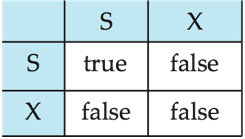
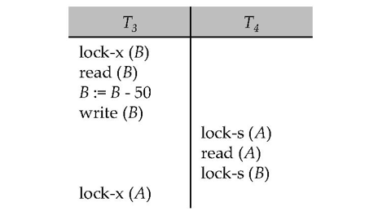
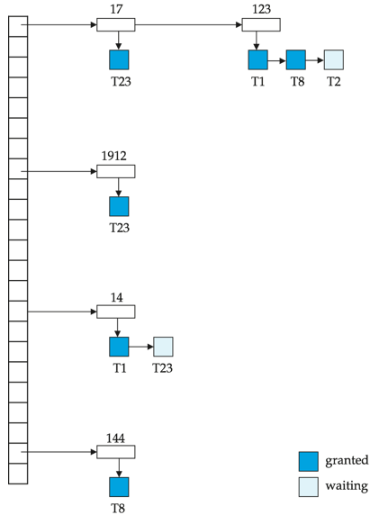
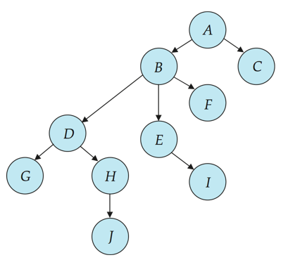
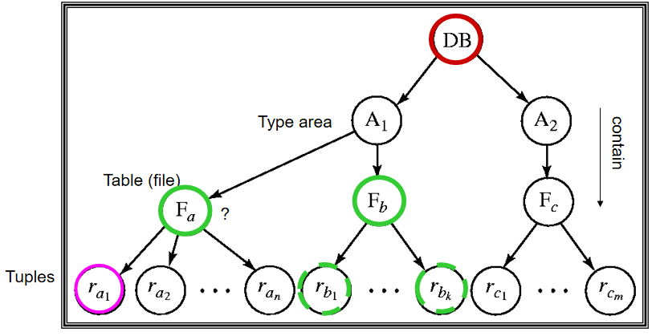
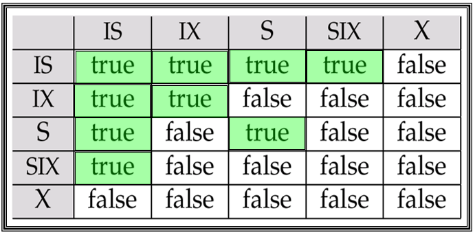
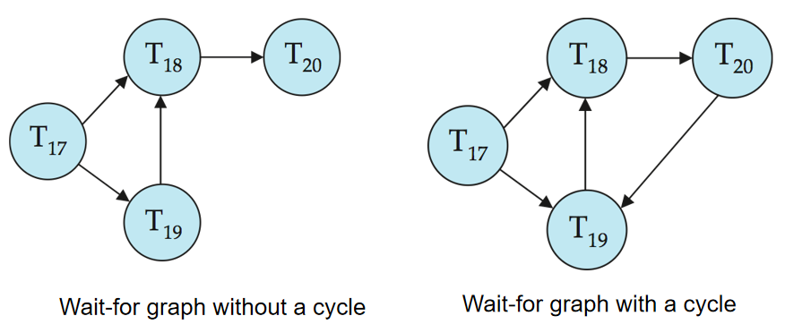

# Concurrency Control

## Lock-Based Protocols

基于锁的协议指的是在并发控制中使用锁来管理对数据库对象的访问。锁可以是共享锁或排他锁。共享锁允许多个事务同时读取数据，而排他锁则只允许一个事务对数据进行修改。

- **Exclusive (X) mode**: 排他锁，数据项可以被读和写，通过 lock-X 指令请求得到
- **Shared (S) mode**: 共享锁，数据项只能被读，通过 lock-S 指令请求得到

锁请求由并发控制管理器来处理，一个事务只有被授予相应的锁后才能访问数据项。锁的释放通常在事务提交或回滚时进行。

<figure markdown="span">
    {width=75%}
</figure>

- 只有当事务所请求的锁与相应数据项上现有的锁不冲突时，才会被授予所需的锁
- 对同一个数据项，可以有任意多个共享锁，但只要有一个排他锁，就不能再有其他的锁
- 如果事务所需的锁无法被授予，那么这个事务就会被阻塞，直到所有与它冲突的锁被释放

锁协议（Locking Protocols）是指在事务执行过程中，如何使用锁来控制对数据的访问。锁协议会限制所有可能的调度（锁的请求和释放），以确保事务的正确性。

!!! example
    <figure markdown="span">
        {width=75%}
    </figure>

    上面的这个调度中，T3 首先申请了 B 上的排他锁；接着 T4 申请了 A 上的共享锁，然后 T4 想要申请了 B 上的共享锁。由于此时 B 上已经有了一个排他锁，所以 T4 被阻塞了。这时候 T3 想要申请 A 上的排他锁，但是由于 A 上有一个共享锁，所以 T3 也被阻塞了。
    
    最终导致了两个事务相互等待彼此释放锁资源的情况，从而导致了这两个事务的死锁（deadlock）。为了解决上面的死锁问题，我们只能通过回滚两个事务的其中一个来释放锁资源。

!!! info "Starvation"
    饥饿（Starvation）是指一个事务在等待锁资源时，长时间得不到锁的分配，从而导致事务无法继续执行。
    
    饥饿通常是由于锁的请求和释放顺序不当造成的，但原因未必就是死锁。例如假设有一个事务需要在数据项上有排他锁，但是在等待过程中不断有其他事务申请这个数据项上的共享锁，导致它一直无法获得排他锁。虽然没有死锁，但是这个事务也无法继续执行，这就是饥饿。

### The Two-Phase Locking Protocol

两阶段锁协议（Two-Phase Locking Protocol）是最常用的锁协议之一。它分为两个阶段：

- Phase 1: Growing Phase
    - Transaction may obtain locks 
    - Transaction may not release locks
- Phase 2: Shrinking Phase
    - Transaction may release locks
    - Transaction may not obtain locks

这一个协议可以保证调度是冲突可串行化的：事务可以按照他们的 lock point（锁点，即事务获取其最后一个锁的时刻）进行串行化。也就是说，所有的锁请求都必须在所有的锁释放之前完成。

但是两阶段锁协议也还存在一些问题：

- 虽然可以保证冲突可串行化，但是它并不能防止死锁问题的发生
- 可能发生级联回滚（Cascading Rollback）的问题

为了解决上述问题，我们可以对 two-phase locking 协议进行一些改进：

- **Strict Two-Phase Locking Protocol**
    - 事务在执行过程中，必须在 Phase 1 中获取所有的锁，并且在 Phase 2 中释放所有的锁，即按照 two-phase 的方式进行锁的请求和释放
    - 事务所持有的排他锁必须在事务结束（提交或中止）后才可以释放
    - strict 2PL 可以保证调度是可串行化的，并且不会发生级联回滚的问题
- **Rigorous Two-Phase Locking Protocol**
    - rigorous 2PL 比 strict 2PL 更严格，他要求所有的锁都必须在事务结束后才可以释放
    - 在这个协议中，事务按照它们提交的顺序被串行化

### Lock Conversions

锁转换（Lock Conversions）是指在事务执行过程中，锁的模式可以进行转换。例如，一个事务可以将一个共享锁转换为排他锁，或者将一个排他锁转换为共享锁。

– **First Phase**:        
    - can acquire a lock-S on item
    - can acquire a lock-X on item
    - can convert a lock-S to a lock-X (upgrade)
– **Second Phase**:
    - can release a lock-S (unlock)
    - can release a lock-X (unlock)
    - can convert a lock-X to a lock-S  (downgrade)

### Automatic acquisition of locks

在实际的数据库系统应用中，我们不会手动地申请和释放锁，而是通过数据库系统自动地申请和释放锁。

例如一个事务 $T_i$ 需要对数据项 $D$ 执行标准的读/写操作，那么读/写操作的执行过程如下：

```c title="Read"
if Ti has a lock on D then
    read(D) 
else begin 
    if necessary, wait until no other transaction has a lock-X on D,
    then grant Ti a lock-S on D;
    read(D)
    end
```

```c title="Write"
if Ti has a lock on D then
    write(D) 
else begin 
    if necessary, wait until no other transaction has any lock on D, then 
        if Ti has a lock-S on D then
            upgrade lock on D to lock-X
        else
            grant Ti a lock-X on D

        write(D)
    end
```

同样的，所有的锁都会在事务结束时自动释放。

### Implementation of Locking

锁管理器（lock manager）通常会被实现为一个独立的进程

- 事务会向锁管理器发送 lock 和 unlock 请求
- 锁管理器则会通过发送锁授权信息来回复锁请求，如果是死锁状态，则会发送要求事务回滚的消息
- 发出请求的事务会一直等待，直到请求被锁管理器回复

锁管理器会维护一个锁表（lock table），用于记录当前所有的锁状态，以及锁的请求和释放情况

- 锁表通常会被实现为一个哈希表，以上锁的数据项名称作为索引

<figure markdown="span">
    {width=75%}
</figure>

- 锁表也会记录已授予或正在请求的锁的类型
- 新的锁请求会被添加到数据项请求列表的末尾，如果该请求与这个数据项上所有现存的锁都兼容，则会被授予锁
- 解锁请求（unlock request）会使相应的请求从请求列表中删除，系统会检查检查会须的请求是否可以被授予
- 当一个事务中止时，这个事务所有正在等待或已经被授予的请求都会被删除
    - 为了高效地实现这个机制，锁管理器通常还会为每个事务都维持一个持有锁的列表，这样当事务完成或中止时，就可以快速找到并释放它持有的所有锁

### Graph-Based Protocols

!!! note "Graph-Based Protocols"
    图基协议（Graph-Based Protocols）是除了两阶段锁协议之外的另一种方案，它指在并发控制中使用图来表示数据项之间的偏序关系。
    
    图的节点表示数据项，如果 $d_i \to d_j$，那么所有既需要访问 $d_i$ 又需要访问 $d_j$ 的事务都必须先访问 $d_i$，再访问 $d_j$。这样一来，数据集 $D$ 就可以被表示为一个有向无环图，称为数据库图（database graph）。

<figure markdown="span">
    {width=70%}
</figure>

tree-protocol 就是一种简单的图基协议，它要求

- 只允许存在排他锁
- 事务 $T_i$ 的第一个锁可以在任意一个数据项上，但是后续的加锁操作必须在 $T_i$ 的第一个锁的子树上进行
    - 也就是说，仅当 $T_i$ 在数据项 $Q$ 的父结点上有锁时，才可以在 $Q$ 上加锁
- 数据项可以在任意时刻被解锁
- 一旦某个数据项被 $T_i$ 解锁，那么后续 $T_i$ 就不能再在这个数据项上再次加锁了

!!! info "树协议"
    **优点**：

    - 可以保证调度是冲突可串行化的，并且能够防止死锁的发生
        - 不再因为死锁而导致事务回滚
    - 树协议允许事务比两阶段锁协议更早地释放锁，从而减少了锁的持有时间，提高并发度

    **缺点**：

    - 树协议不能保证可恢复性，也无法避免级联回滚问题。为了确保可恢复性，需要引入其他的机制
    - 事务在执行过程中需要给可能并不会访问到的数据项上锁，这会导致额外的锁开销和事务等待事件，从而潜在地降低并发度

## Timestamp-Based Protocols

在基于时间戳的协议中，每个事务在开始时会被分配一个唯一的时间戳（timestamp），这个时间戳是一个全局递增的整数。时间戳可以用来确定事务的执行顺序，从而保证事务的可串行化顺序。

假设 $T_i$ 是较老的事务，$T_j$ 是较新的事务，那么 $T_i$ 和 $T_j$ 的时间戳满足 $TS(T_i) < TS(T_j)$。

这一协议为每个数据项 $Q$ 维护两个时间戳值：

- **W-timestamp**: 所有成功执行 write(Q) 操作的事务的时间戳中最大的一个
- **R-timestamp**: 所有成功执行 read(Q) 操作的事务的时间戳中最大的一个

在基于时间戳的协议中，所有的读和写操作都必须遵循以下规则：

- 如果事务 $T_i$ 需要进行 read(Q) 操作
    - 如果 $TS(T_i) \leqslant \text{W-timestamp}(Q)$，那么说明 $T_i$ 需要读取的 $Q$ 的值已经被覆写了，那么这个读操作会被拒绝，$T_i$ 会回滚
    - 否则，$T_i$ 可以读取数据项 $Q$，并且把 $\text{R-timestamp}(Q)$ 更新为 $\text{R-timestamp}(Q)$ 和 $TS(T_i)$ 之间的最大值
- 如果事务 $T_i$ 需要进行 write(Q) 操作
    - 如果 $TS(T_i) \leqslant \text{R-timestamp}(Q)$，那么说明有更新的事务已经读取了 $Q$ 的值，$T_i$ 将要写入的值是无效的，那么这个写操作会被拒绝，$T_i$ 会回滚
    - 如果 $TS(T_i) \leqslant \text{W-timestamp}$，则说明 $T_i$ 将要写入一个已经过时了的值，写操作也会被拒绝，$T_i$ 会回滚
    - 否则，$T_i$ 可以写入数据项 $Q$，并且把 $\text{W-timestamp}(Q)$ 更新为 $\text{W-timestamp}(Q)$ 和 $TS(T_i)$ 之间的最大值

## Multiple Granularity

多粒度锁协议（Multiple Granularity Locking Protocol）是指在并发控制中使用多粒度的锁来管理对数据库对象的访问。多粒度锁协议允许事务在不同的粒度上申请锁，例如在数据库、表空间、表、记录等不同的粒度上申请锁。

这一种方法通过定义数据不同粒度的层次结构来实现，较小的粒度的数据嵌套在较大的粒度中，可以图形化地表示为一棵树（注意不要与 tree protocol 混淆）

<figure markdown="span">
    {width=70%}
</figure>

> 上图中最高层的节点是整个数据库，从上至下依次是类型空间（type area）、表（table）和记录（record）

当事务显式地锁定树中某一个节点时，它会隐式地以同样的模式锁定它的所有后代节点（descendant nodes）

- **Fine granularity** (细粒度，lower in tree): high concurrency, high locking overhead
- **Coarse granularity** (粗粒度，higher in tree): low locking overhead, low concurrency

### Intention Lock Modes

在多粒度锁协议中，除了 shared 和 exclusive 锁之外，还引入了意向锁（intention lock），用于表示事务对某个节点的意图

- **Intention Shared (IS，共享型意向锁)**: 事务打算在某个节点上申请共享锁，意味着该节点的后代可能会被显式地以共享模式锁定
- **Intention Exclusive (IX ，排它型意向锁)**: 事务打算在某个节点上申请排他锁，意味着该节点的后代可能会被显式地以排他模式锁定
- **Shared Intention Exclusive (SIX，共享排它型意向锁)**: 事务打算在某个节点上申请共享锁，并且在该节点的后代上申请排他锁，意味着该节点的后代可能会被显式地以排他模式锁定

再额外考虑了意向锁后，各个锁的相容矩阵如下：

<figure markdown="span">
    {width=65%}
</figure>

!!! info
    当一个事务 $T_i$ 想要给节点 $Q$ 上锁时，需要遵循下面的规则：

    1. 申请的锁必须遵循锁相容矩阵
    2. 树的根必须首先被上锁，并且可以被任意模式锁定
    3. 如果 $T_i$ 想要在节点 $Q$ 上申请 S 或 IS 模式的锁，那么 $T_i$ 必须首先在 $Q$ 的父结点上申请 IX 或 IS 模式的锁
    4. 如果 $T_i$ 想要在节点 $Q$ 上申请 X、SIX 或 IX 模式的锁，那么 $T_i$ 必须首先在 $Q$ 的父结点上申请 IX 或 SIX 模式的锁
    5. 仅当某个节点在此之前没有被解锁时，$T_i$ 才可以在这个节点上申请锁（也就是说，事务 $T_i$ 是满足两阶段的）
    6. 如果 $T_i$ 想要解锁节点 $Q$，那么必须保证 $Q$ 的所有后代节点都已经被解锁 

    总的来说，加锁是自顶向下的，解锁是自底向上的，并且这一过程遵守 2PL 协议

## Deadlock Handling

### Deadlock Prevention

死锁预防（Deadlock Prevention）是指在并发控制中，通过一些机制来避免死锁的发生。常用的死锁预防方法有：

1. 要求每个事务都在开始执行前对所有需要访问的数据项进行锁定
    - 缺点是会导致锁的持有时间过长，降低并发度
2. 对所有的数据项进行排序，得到数据项之间的偏序关系，要求事务只能按照这个顺序来锁定数据项（即 graph-based protocol）

具体而言，常用的有 wait-die 和 wound-wait 两种策略：

- **wait-die**: 较老的事务（$T_i$）可以等待较新的事务（$T_j$）释放锁资源，但是较新的事务不能等待较老的事务
    - 如果 $T_i$ 需要访问的数据项已经被 $T_j$ 锁定，那么 $T_i$ 会被阻塞，直到 $T_j$ 释放锁
    - 如果 $T_j$ 需要访问的数据项已经被 $T_i$ 锁定，那么 $T_j$ 会被回滚（die），并且 $T_j$ 会被重新调度
    - 一个事务在获取所需的数据项之前可能会经历多次回滚
    - 老的事务可以等新的事务，新的事务不能等老的事务
- **wound-wait**: 较老的事务（$T_i$）会伤害（wound）较新的事务（$T_j$），即强制 $T_j$ 回滚
    - 如果 $T_i$ 需要访问的数据项已经被 $T_j$ 锁定，那么 $T_i$ 会令 $T_j$ 回滚，从而获得锁资源
    - 如果 $T_j$ 需要访问的数据项已经被 $T_i$ 锁定，那么 $T_j$ 会被阻塞，直到 $T_i$ 释放锁
    - 老的事务不会等新的事务，新的事务可以等老的事务

### Deadlock Detection

死锁检测（Deadlock Detection）是指在并发控制中，通过一些机制来检测死锁的发生，如果存在死锁，就让死锁循环中的一个事务回滚。

死锁可以通过一个等待图（wait-for graph）来表示，图中的节点表示事务，边表示事务之间的等待关系

- 如果 $T_i$ 等待 $T_j$ 释放锁资源，那么就有一条从 $T_i \to T_j$ 的边
- 如果 $T_i$ 需要的资源此刻被 $T_j$ 持有，那么就需要插入一条边 $T_i \to T_j$。当 $T_j$ 释放资源时，边 $T_i \to T_j$ 会被删除
- 一个系统中存在死锁当且仅当等待图中存在一个环路，因此我们就可以把死锁检测问题转变为有向图中环路检测的问题

<figure markdown="span">
    {width=65%}
</figure>

### Deadlock Recovery

当我们检测到死锁时，就不得不选择某些事务进行回滚，我们需要做的是选择能够最小化损失的事务进行回滚。我们可以通过以下几个标准来选择回滚的事务：

- **最小化回滚代价**: 选择那些已经执行了最少操作的事务进行回滚
- **最小化锁资源**: 选择那些持有最少锁资源的事务进行回滚
- **最小化等待时间**: 选择那些等待时间最长的事务进行回滚
- **最小化优先级**: 选择那些优先级最低的事务进行回滚

## Insert and Delete Operations

实际的数据库系统中，除了读/写操作意外，常见还有插入和删除等（更新可以视为先删除后插入）

If two-phase locking is used:

- A delete operation may be performed only if the transaction deleting the tuple has an exclusive lock on the tuple to be deleted.

    在删除之前需要给要删除的元组加上 X 锁

- A transaction that inserts a new tuple into the database is given an X-mode lock on the tuple

    在插入之前数据库中并没有这个元组，无法提前加锁，应该在插入后立刻加上 X 锁

数据库的并发插入、删除可能导致幻影现象（phantom phenomenon），即在一个事务中读取到的结果集在另一个事务中被插入或删除了，从而导致第一个事务的结果集发生了变化。

!!! example "幻影现象"
    假设有两个事务 $T_1$ 和 $T_2$

    ```sql title="T1"
    select count(*) from instructor where dept name = 'Physics';
    ```

    ```sql title="T2"
    insert into instructor values (11111, 'Feynman', 'Physics', 94000);
    ```

    在 $T_1$ 执行时，$T_2$ 插入了一条新的记录，这样 $T_1$ 读取到的结果集就发生了变化。假设 $T_1$ 最开始读取到的结果集是 10，那么在 $T_2$ 执行完后，$T_1$ 读取到的结果集就变成了 11。

为了避免幻影现象，我们可以使用范围锁（range lock）来锁定一个范围内的所有数据项，从而避免幻影现象的发生，例如给编号在 1000 到 2000 之间的所有数据项加锁，如果出现了对这个范围内的数据的修改，我们就能检测出来，但是这样的实现是比较复杂的
