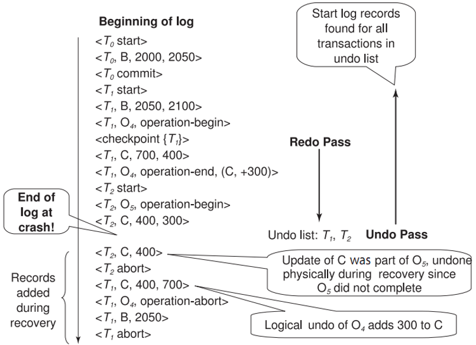
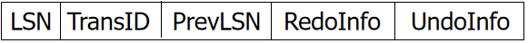
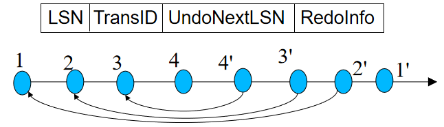
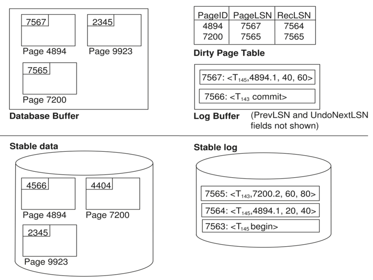
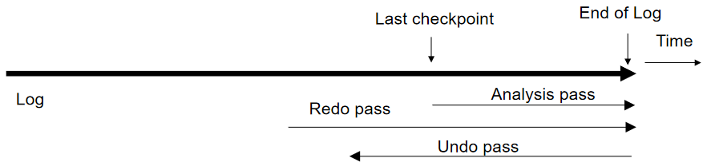
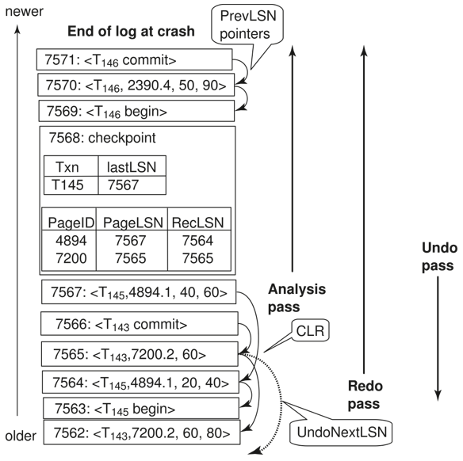

# Recovery System

## Failure Classification

- Transaction failure :
    - Logical errors: 由于内部错误导致事务无法完成（例如溢出、错误输入、数据无法找到等）
    - System errors: 由于某个错误条件而导致数据库系统不得不中止一个正在运行的事务（例如死锁、资源耗尽等）
- System crash: 断电或其他硬件或软件故障导致系统崩溃。
    - Fail-stop assumption: 我们通常假设保存在非易失性存储介质中的内容在系统崩溃时不会丢失
- Disk failure: 磁盘头损坏或其他类似的磁盘故障会导致部分或全部磁盘中的存储内容丢失。
    - 我们通常认为磁盘的损坏是可检测到的

<figure markdown="span">
    {width=75%}
</figure>

!!! info "Recovery Algorithms"
    考虑一个简单的情形：事务 $T$ 要把 50 美元从账户 $A$ 转移到账户 $B$，那么这期间会进行两次更新操作：账户 $A$ 的余额减去 50 美元，账户 $B$ 的余额加上 50 美元。在我们修改其中一个账户，而另一个账户还未修改时，我们可能会遇见错误：

    - 如果我们在事务提交之前就把修改写入数据库中，可能导致数据库中数据的一致性被破坏
    - 如果我们在事务真正提交后才开始写入数据库中，那么如果在 commit 之后立即发生系统崩溃（此时还未写入数据库），可能会导致事务的修改丢失

    那么这时候我们就需要一个恢复算法来在保证数据一致性的同时，尽可能地减少数据丢失。恢复算法包括两部分：

    1. 在进行一般的事务操作时（during normal transaction processing），通过记录一些信息来保证在遇到错误时能够恢复数据
    2. 在发生错误后，能够采取一些措施来恢复数据库中的内容，并且保证原子性、一致性和持久性（atomicity, consistency, and durability）

## Storage Structure

整体而言，数据的存储结构可以分为三类：

- Volatile storage（易失性存储）:
    - 当系统崩溃时不会保留数据
    - Examples: main memory, cache memory
- Nonvolatile storage（非易失性存储）:
    - 当系统崩溃时仍然保留数据，但在某些情况下仍可能会丢失数据
    - Examples: disk, tape, flash memory, non-volatile (battery backed up) RAM 
- Stable storage（稳定存储）:
    - 一个虚拟、理想的（mythical）存储介质，能够在所有故障中保留数据
    - 但我们可以通过在非易失性存储介质上维护多个副本来近似实现稳定存储

### Stable-Storage Implementation

- 对于每个数据块的多个副本，我们可以把它们放在不同的磁盘上来保证安全
    - 甚至可以把它们放在不同的远程站点上来防止自然灾害（例如火灾或洪水）导致数据丢失
- 在数据传输过程中的失败可能会导致各个副本之间的不一致，块传输可能的结果有：
    - 成功完成
    - 部分失败：目标块包含错误信息
    - 完全失败：目标块未被更新
- 为了保证数据的一致性，我们需要在数据传输过程中采取一些措施来保护存储介质

    假设每个块有两个副本，输出操作如下：

    1. 先将信息写入第一个物理块。  
    2. 第一次写入成功后，再将相同信息写入第二个物理块。  
    3. 只有第二次写入也成功后，输出操作才算完成。
- 由于输出操作期间的故障，某个数据块的副本可能不同步，再从错误中恢复时，我们需要进行如下操作：
    1. 首先找到不一致的块：
        - 代价较为高昂的解决方案：比较每个磁盘块的两个副本
        - 更好的解决方案：在非易失性存储（如非易失性 RAM 或特殊磁盘区域）中记录正在进行的磁盘写入操作，使用这些信息在恢复过程中找到可能不一致的块（即发生错误前正在修改的块），我们只需要比较这些块的副本。这种方法通常用于硬件 RAID 系统。
    2. 如果检测到不一致的块，比较两个副本：
        - 如果其中一个副本有错误（例如校验和错误），则用另一个副本覆盖它。
        - 如果两个副本都没有错误，但内容不同，则用第一个副本覆盖第二个副本。

### Data Access

- Physical blocks：存储在磁盘上的数据块
- Buffer blocks：临时存储在主存中的数据块

当我们要在磁盘和主存之间进行块的传递时：

- input(B)：把磁盘里的物理块 B 传输到主存中
- output(B)：把主存中的缓冲块 B 写入到磁盘中，替代其中某个物理块

每一个事务 $T_i$ 都有它们自己私有的工作区，用于保存它访问和更新的数据块的本地副本。（$T_i$ 对于数据项 $X$ 的本地副本记为 $X_i$）

在系统 buffer 和事务私有工作区之间进行数据项传输操作时：

- read(X)：将数据项 $X$ 的值赋给局部副本 $X_i$
- write(X)：将局部副本 $X_i$ 的值写入到缓冲区中的数据项 $X$ 中
    - 当我们执行完 write(X) 操作后未必需要立即执行 output($B_X$)，系统可以选择某个恰当的时间在执行 output 操作

对于事务而言

- 在首次访问数据项 $X$ 之前，必须执行 read(X) 操作
- write(X) 操作可以在事务执行过程中的任意时刻执行

<figure markdown="span">
    {width=75%}
</figure>

## Log-Based Recovery

我们把日志（log）保存在稳定存储器中，日志由一系列日志记录（log record）组成，每个日志记录包含了一个事务的操作信息。日志记录的格式如下：

- `<Ti start>`：事务 $T_i$ 开始执行
- `<Ti, X, V1, V2>`：事务 $T_i$ 对数据项 $X$ 的值从 $V1$ 修改为 $V2$
    - 在进行 write(X) 操作之前记录
    - 把数据项 $X$ 从旧值 $V1$ 修改为新值 $V2$
    - 这是实现恢复的基础，redo 会把 $X$ 的值改为 $V_2$，undo 会把 $X$ 的值改为 $V_1$
    - insert 的旧值为空，delete 的新值为空
- `<Ti commit>`：当事务 $T_i$ 成功完成最后一条语句后，写入本条日志记录，表示事务提交
- `<Ti abort>`：当事务 $T_i$ 由于某种原因被中止时，完成所有的回滚操作后写入本条日志记录，表示事务已经中止

### Deferred Database Modification

延迟数据库修改（Deferred Database Modification）是一种恢复方法，它在事务提交之前不对数据库进行任何修改，而是先把所有的修改都记录在日志中，在事务提交后（即在写入 `<Ti commit>` 日志记录后），才将修改应用到数据库中。

- 使用这种方法时，write(X) 操作不需要记录旧值，对应的日志记录是 `<Ti, X, V>`，表示事务 $T_i$ 将数据项 $X$ 的值修改为 $V$。 
- 当事务最终提交时，`<Ti commit>` 会被写入到日志中
- 最后这一个事务对数据项的修改才会被写入到数据库中

!!! example
    <figure markdown="span">
        {width=65%}
    </figure>

    对于上面三种情况，当发生崩溃时，我们需要进行如下操作：

    - a）不需要 redo，因为数据库没有被修改
    - b）$T_0$ 需要 redo，$T_1$ 不需要 redo，因为 $T_0$ 已经提交了而 $T_1$ 还未提交
    - c）$T_0$ 和 $T_1$ 都需要 undo，因为它们都已经提交了

### Immediate Database Modification

即时数据库修改（Immediate Database Modification）允许在事务执行过程中立即对主存缓冲区或数据库进行修改，并且在日志中记录这些修改。

- 为了保证日志的正确性，在修改数据库之前把日志记录的更新写入到日志中（我们假设日志记录会直接输出到稳定存储器中），然后再对数据库进行修改
- 当事务提交后，修改的结果也可能还在缓冲区中，因为如果立即把 block 写回磁盘，可能导致大量的 I/O 操作，影响性能

数据库的恢复过程包括两个操作：

- undo(Ti)：撤销执行事务 $T_i$ 的所有更新操作，将所有数据项恢复到它们的旧值，从 $T_i$ 的最后一条日志记录开始逆向进行
- redo(Ti)：重新执行事务 $T_i$ 的所有更新操作，将所有数据项恢复到 $T_i$ 修改的新值，从 $T_i$ 的第一条日志记录开始正向进行

上述两个操作都必须满足幂等性（idempotency），即多次执行同一操作的结果应当与执行一次的结果相同。

当我们进行数据库恢复时，需要遵循以下的原则：

- 如果日志中包含 `<Ti start>` 但不包含 `<Ti commit>`，那么就需要执行 undo(Ti)
- 如果日志中同时包含 `<Ti start>` 和 `<Ti commit>`，那么就需要执行 redo(Ti)
- 恢复时先执行所有的 undo 操作，然后再执行所有 redo 操作

!!! example
    <figure markdown="span">
        {width=65%}
    </figure>

    对于上述几种情况，在恢复时需要执行的操作分别为

    - a）undo(T0)：把 B 恢复为 2000，A 恢复为 1000，然后写入日志记录 `<T0, B, 2000>` 和 `<T0, A, 1000>`，最后写入 `<T0 abort>`。
    - b）redo(T0) 且 undo(T1)：先把 C 恢复为 700，再把 A 和 B 分别置为 950 和 2050（先 undo 再 redo），随后写入日志记录 `<T1, C, 700>` 和 `<T1 abort>`。
    - c）redo(T0) 且 redo(T1)：先把 A 和 B 分别置为 950 和 2050，然后把 C 置为 600，不需要写入新的日志记录。

??? example "另一个例子"
    <figure markdown="span">
        {width=65%}
    </figure>

    如上图所示，当我们执行到第 12 行后，开始对 $T_2$ 进行回滚（此时尚未崩溃，进程仍处于正常执行状态），我们需要逐一撤销 $T_2$ 的操作，如把 C 恢复为 500，把 B 恢复为 300。这期间的 undo 操作也会被记录到日志中，称为补偿日志（compensation log）。

    当我们执行完第 15 行后，发生了 crash，我们首先需要 repeat history，即重复执行日志中的所有操作（包括对 $T_2$ 的 undo 操作），然后此时我们发现 undo list 中只有 $T_4$，因此此时我们只需要 undo(T4) 即可。

    > 在 repeat history 开始时我们会维护一个 undo list，当事务开始时就把它放入 list 中，当事务提交或中止时就把它移出来，这样我们就可以在 repeat history 完成后得到需要 undo 的事务列表。

### Checkpoints

从日志的起点开始 redo/undo 是很低效的，repeat history 可能会耗费大量的时间。因此我们可以每隔一段时间设置一个检查点（checkpoint），在检查点处记录当前的状态，在发生崩溃时我们可以从最后一个 checkpoint 开始恢复。

checkpoint 会保证此前的所有操作都已经被反映到数据库中了，因此我们在恢复时可以放心地从 checkpoint 开始 redo/undo 操作。

- Output all log records currently residing in main memory onto stable storage.
    - 设置检查点时，我们需要把当前主存中的所有日志记录（日志缓冲区里的日志）输出到稳定存储器中，以确保在发生崩溃时可以从检查点开始恢复。
- Output all modified buffer blocks to the disk.
    - 主存 buffer 里的数据也要被写到磁盘里
- Write a log record `<checkpoint L>` onto stable storage 
    - 其中 $L$ 是设置检查点时所有正在活动的事务的列表，用于初始化 undo list
- All updates are stopped while doing checkpointing
    - 进行检查点时，所有的更新操作都被暂停，以确保检查点的一致性。

进行恢复时，我们只需要从后往前寻找最近的一个检查点，并且只需要 redo/undo 在 $L$ 中和检查点之后才开始的事务

- 如果 $T_i$ 在 $L$ 中，我们需要找到对应的 `<Ti start>`，早于所有 `<Ti start>` 中最早的那一个的操作都一定不需要 redo，因为它们的修改已经被写入到数据库中

!!! example "陈刚老师的 PPT 例子"
    <figure markdown="span">
        {width=65%}
    </figure>

    - $T_1$ 可以被忽略，它在 checkpoint 之前就已经提交了
    - $T_2, T_3$ 需要 redo
    - $T_4$ 需要 undo（回滚）

!!! example "孙建伶老师的 PPT 例子"
    <figure markdown="span">
        {width=65%}
    </figure>

    在这个例子中，数据库系统在执行第 16 行后崩溃了，我们要从最近的 checkpoint（第 12 行）开始 repeat history。

    - undo list 初始化为 {T2, T4}
    - redo 至第 16 行，期间对于 $T_2$ 的回滚属于正常的进程
    - 开始 recover，此时 undo list 中仅有 $T_4$，因此只需要 undo(T4) 即可

!!! tip
    对于上述的情况，我们假设

    - 所有事务共享一个磁盘缓冲区和日志文件
    - 使用严格两阶段锁（strict two-phase locking）进行并发控制
        - 在事务结束后才会释放排他锁
        - 未提交的事务对数据的修改对于其他事务是不可见的

## Buffer Management

通常而言，项稳定存储器输出的单位是块，而日志记录通常会比块小得多，因此日志记录会先缓冲在主存中，直到出现以下情况时才输出到稳定存储中：

- 缓冲区中的日志记录块已满
- 执行了强制日志操作（例如出现了检查点）

强制日志操作通过将所有的日志记录（包括 `<Ti commit>`）强制输出到稳定存储中来实现提交事务

!!! note "The Rules for Log Record Buffering"
    如果日志记录是被缓冲的，那么就必须遵循以下四条规则：

    1. 日志记录必须按照它们被创建的顺序输出到稳定存储中。
    2. 事务 $T_i$ 只有在日志记录 `<Ti commit>` 被输出到稳定存储中后才能进入提交状态。
    3. 在 `<Ti commit>` 被输出到稳定存储之前，所有与 $T_i$ 相关的日志记录必须已经被输出到稳定存储中。
    4. 在主存中的数据块被输出到数据库之前，所有与该数据块中的数据相关的日志记录必须已经被输出到稳定存储中。（日志应先于数据写到磁盘）
        - 这个规则被称为先写日志规则（write-ahead logging rule，WAL），严格来说 WAL 只要求撤销信息被输出到稳定存储中

- 数据库会在主存中维护一个数据块缓冲区，当需要一个新的数据块，并且缓冲区已经满时，就需要替换掉一个旧的块，假如被替换的块是脏的，那么就需要输出到磁盘中。
- 恢复算法也可以支持**非强制策略（no-force policy）**，即事务提交时不一定强制要求被更新的数据块立即写入到磁盘中，而是可以在某个合适的时机再写入，这样可以减少 I/O 操作，提高性能。
- 恢复算法可以支持**窃取策略（steal policy）**，即允许在事务提交之前就把脏块写回磁盘，这样可以减少主存的压力（同样要求先把对应的日志写到稳定存储中）

!!! info "Failure with Loss of Nonvolatile Storage"
    在上面的讨论中，我们都假设非易失性存储中的数据没有丢失，但是如果非易失性存储中的数据丢失了（例如磁盘损坏），那么我们需要采取一些额外的措施来恢复数据。

    通常我们可以采用类似于检查点的技术来应对非易失性存储的内容丢失问题

    - 定期地将整个数据库的内容转储（dump）到稳定存储中
    - 在转储过程中，不能有任何事务处于活动状态；需要进行类似于检查点的操作
        - 将当前主存中的所有日志记录输出到稳定存储中
        - 将所有缓冲块输出到磁盘中
        - 将数据库的内容复制到稳定存储中
        - 输出一条日志记录 `<dump>` 到稳定存储的日志中

    当出现磁盘故障时，首先从最近的转储中恢复数据库内容，然后根据日志记录重新执行所有在转储之后提交的事务。
    
    我们还可以对这种方法进行拓展，即允许事务在转储过程中保持活跃状态，这通常被称为模糊转储（fuzzy dump）或在线转储（online dump）。

## Advanced Recovery Techniques

在高并发环境中，我们进行 B+ 树的插入和删除操作后可能会提前释放锁资源，因此撤销操作就不能通过恢复旧值的方法（物理撤销，physical undo）来实现，因为一旦锁被释放，那么其他事务就可能立即对 B+ 树进行了更新，直接进行物理撤销就可能导致其他事务的操作被破坏，因此我们需要采用逻辑撤销（logical undo）的方法来实现撤销操作。

!!! info "物理日志与逻辑日志"
    - 物理日志：
        - 记录了数据项的物理变化
        - 适用于简单的事务和操作
        - 例如从 $V1$ 改为 $V2$，`<Ti, X, V1, V2>`
    - 逻辑日志：
        - 记录了数据项的逻辑变化，例如插入、删除、更新等操作
        - 适用于复杂的事务和操作，尤其是需要撤销的情况
        - `<Ti, Oj, operation-begin>` 表示开始一个操作 $O_j$，`<Ti, Oj, operation-end, U>` 表示结束操作 $O_j$，其中 $U$ 是撤销操作对应的逻辑信息
    
    例如事务 $T_1$ 要令数据项 $A$ 的值从 100 改为 200，那么
    
    - 物理日志记录为 `<T1, A, 100, 200>`
    - 逻辑日志记录为
        ```
        <T1, O1, operation-begin>
        <T1, A, 100, 200>
        <T1, O1, operation-end, (A, -100)>
        ```

- 假如在操作完成之前就出现了崩溃/回滚，那么将找不到 operation-end 的记录，我们需要使用物理撤销信息来撤销这个操作
- 假如在整个操作完成后才出现崩溃/回滚，那么我们可以找到 operation-end 的记录，此时我们可以直接使用使用逻辑撤销信息 $U$ 来撤销这个操作

!!! tip "回滚事务"
    我们也可以利用逻辑日志来回滚事务，我们需要从后往前逆向扫描日志：

    1. 如果找到日志记录 `<Ti, X, V1, V2>`，那么就执行物理撤销操作，并记录补偿日志（仅重做日志记录） `<Ti, X, V1>`
    2. 如果找到 `<Ti, Oj, operation-end, U>`
        - 使用撤销信息 $U$ 执行逻辑回滚操作
            - 回滚期间执行的操作会像正常操作一样被记录
            - 回滚操作结束时，生成记录 `<Ti, Oj, operation-abort>` 而非 operation-end
        - 跳过事务 $T_i$ 的所有操作，直到找到 `<Ti, operation-begin>`，然后继续回滚下一个操作
    3. 如果找到了仅重做记录（redo-only record），忽略它，继续扫描
    4. 如果找到了 `<Ti, Oj, operation-abort>`，则跳过事务 $T_i$ 的所有操作，直到找到 `<Ti, operation-begin>`
    5. 当找到记录 `<Ti, start>` 时停止扫描
    6. 在日志中添加一条 `<Ti, abort>` 记录，表示事务 $T_i$ 已经被回滚

    > 情况 3 和 4 仅在数据库在事务正在进行回滚时崩溃才会出现

!!! example
    <figure markdown="span">
        {width=65%}
    </figure>

    在上图的例子中，执行完 `<T2, C, 400, 300>` 后发生了崩溃，我们从 checkpoint 开始 redo，得到的 undo list 为 {T1, T2}.

    由于此时 $T_2$ 还没有 end，因此我们需要做的是物理撤销 `<T2, C, 400, 300>`，并记录相应的日志 `<T2, C, 400>`，接着遇到了 `<T2 start>`，因此再记录 `<T2 abort>`。

    接着继续按照上面的步骤回滚 $T_1$ 即可。

## ARIES Recovery Algorithm

> ARIES is a state of the art recovery method. ARIES 目前正在工业界中被广泛使用。

### ARIES Data Structures

- **Log sequence number (LSN)** identifies each log record
    - 每个日志记录都有一个唯一的 LSN 作为标识符
    - Must be sequentially increasing
    - 通常使用相对于日志文件开头的偏移量来表示 LSN，以便快速访问
- **Page LSN**
    - 每个数据页都有一个 Page LSN，表示该页上最近的日志记录的 LSN
    - 用于判断数据页是否需要 redo 或 undo
- **Log records of several different types**
- **Dirty page table**
    - 记录了所有脏页（dirty page）的 LSN

#### Log Record

每一个日志记录中都包含同一事务中前一个日志记录的 LSN（prevLSN），用于在 redo/undo 时追踪事务的操作顺序。

<figure markdown="span">
    {width=75%}
</figure>

特别的 redo-only 日志记录被称为补偿日志记录（compensation log record，CLR），用于记录在恢复过程中采取的操作

- 这些操作永远不需要被撤销
- 它具有一个 UndoNextLSN 字段，用于指示下一个（更早的）需要撤销的记录
- 位于当前记录和下一个记录之间的记录已经被撤销，因此不需要再次撤销。

<figure markdown="span">
    {width=75%}
</figure>

#### DirtyPage Table

脏页表（DirtyPage Table）用于记录所有脏页的 LSN，包括

- **PageLSN** of the page
- **RecLSN** is an LSN such that log records before this LSN have already been applied to the page version on disk

PageLSN 表示的是该页上最近的日志记录的 LSN，而 RecLSN 表示在该页上最近被反映到数据库中的日志记录的 LSN

#### Checkpoint Log

- **Checkpoint Log** contains DirtyPageTable and list of active transactions
- 记录了每个活动事务的最后一个日志记录的 LSN，便于知道要从哪里开始恢复
- 脏页不会在 checkpoint 时被输出到磁盘中，而是会在后台持续地被输出，因此 checkpoint 带来的开销很小，可以持续地记录检查点

!!! example
    <figure markdown="span">
        {width=75%}
    </figure>

    如上图所示：
    
    - 数据库缓冲区中的每一个 page 都会记录最近的日志记录的 LSN
    - 脏页表会记录脏页对应的 PageLSN 和 RecLSN
    - 日志缓冲区会记录尚未被输出到稳定存储器中的日志记录（4894.1 表示块 4894 的第 1 个数据项）
    - 横线下方的稳定存储中包含已经被输出的数据页和日志记录

### ARIES Recovery

ARIES 的恢复过程分为三个阶段：

1. **Analysis Phase**：分析阶段
    - 从最近的检查点开始，分析日志记录，构建脏页表和活动事务列表
    - 确定需要 redo 和 undo 的事务
2. **Redo Phase**：重做阶段
    - 从检查点开始，按照日志记录的顺序重做所有需要重做的事务
    - 对于每个脏页，检查其 PageLSN 是否大于 RecLSN，如果是，则需要 redo
    - 如果遇到 CLR，则不需要 redo，而是继续处理下一个日志记录
3. **Undo Phase**：撤销阶段
    - 从活动事务列表中找到需要撤销的事务，按照 LSN 的逆序进行撤销
    - 对于每个需要撤销的事务，按照日志记录的顺序逆向执行 undo 操作
    - 如果遇到 CLR，则不需要撤销，而是继续处理下一个日志记录

<figure markdown="span">
    {width=75%}
</figure>

!!! example
    <figure markdown="span">
        {width=75%}
    </figure>

    下方是较老的日志，上方是较新的日志。

    - 当出现崩溃后，我们从最近的检查点开始分析，我们发现 page 4884 的 PageLSN 是 7567，大于 RecLSN 7564，因此需要 redo。
    - 接着我们 redo 事务 $T_{146}$ 的内容，并把 page 2390 更新到脏页表中
    - 我们此时发现 undo list 中只有 $T_{145}$，因此需要撤销它的操作。在撤销过程中，我们可以利用 $T_{145}$ 的日志记录的 PrevLSN 字段来找到它的上一个日志记录，从而逆向执行撤销操作。
    - 撤销操作完成后，我们会在日志中记录补偿日志记录（CLR），表示该操作已经被撤销，并且不需要再次撤销。
