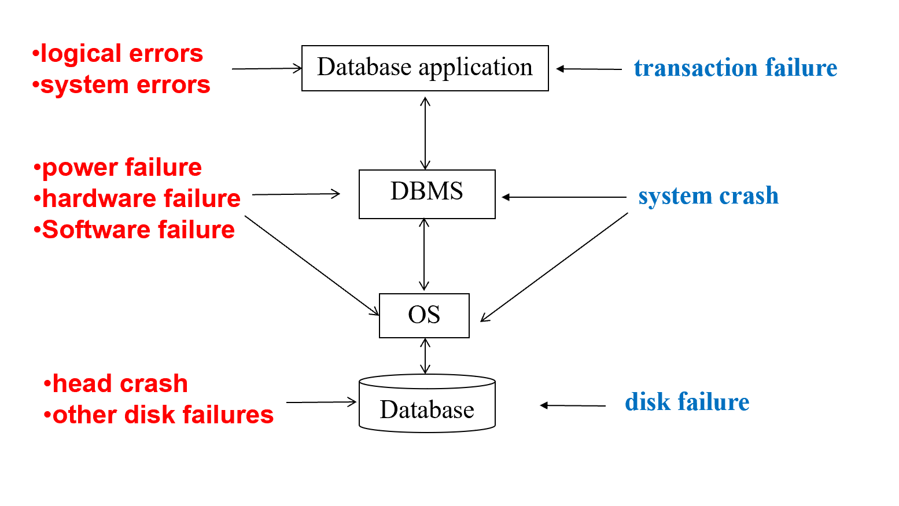
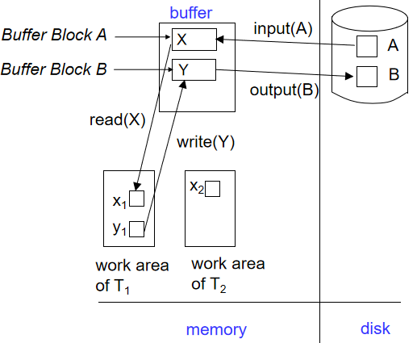
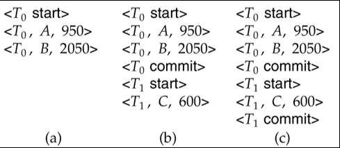
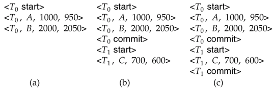
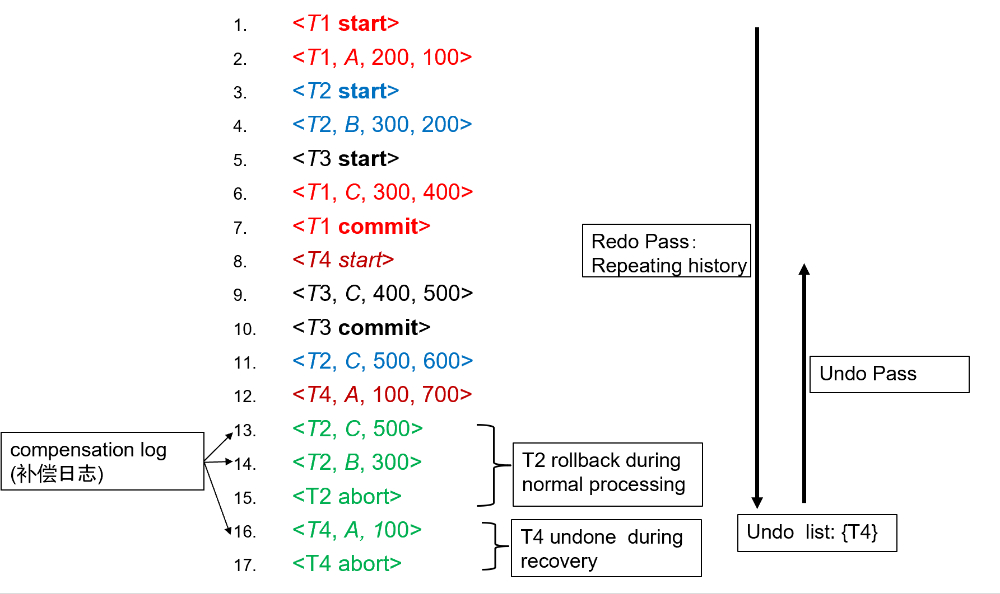
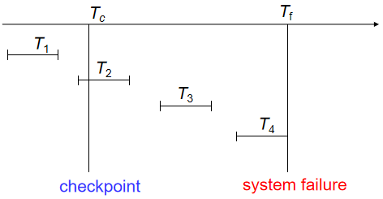
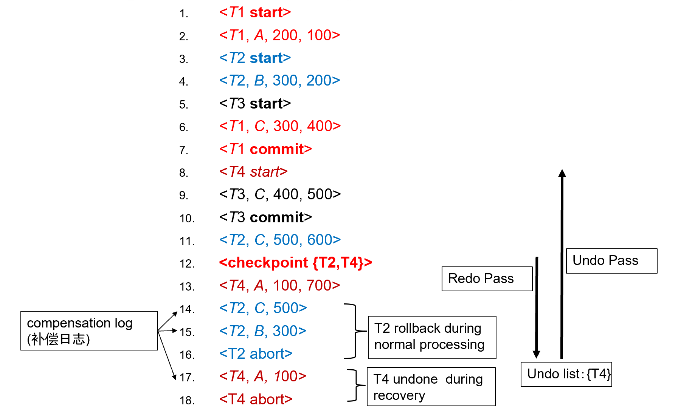

# Recovery System

## Failure Classification

- Transaction failure :
    - Logical errors: 由于内部错误导致事务无法完成（例如溢出、错误输入、数据无法找到等）
    - System errors: 由于某个错误条件而导致数据库系统不得不中止一个正在运行的事务（例如死锁、资源耗尽等）
- System crash: 断电或其他硬件或软件故障导致系统崩溃。
    - Fail-stop assumption: 我们通常假设保存在非易失性存储介质中的内容在系统崩溃时不会丢失
- Disk failure: 磁盘头损坏或其他类似的磁盘故障会导致部分或全部磁盘中的存储内容丢失。
    - 我们通常认为磁盘的损坏是可检测到的

<figure markdown="span">
    {width=75%}
</figure>

!!! info "Recovery Algorithms"
    考虑一个简单的情形：事务 $T$ 要把 50 美元从账户 $A$ 转移到账户 $B$，那么这期间会进行两次更新操作：账户 $A$ 的余额减去 50 美元，账户 $B$ 的余额加上 50 美元。在我们修改其中一个账户，而另一个账户还未修改时，我们可能会遇见错误：

    - 如果我们在事务提交之前就把修改写入数据库中，可能导致数据库中数据的一致性被破坏
    - 如果我们在事务真正提交后才开始写入数据库中，那么如果在 commit 之后立即发生系统崩溃（此时还未写入数据库），可能会导致事务的修改丢失

    那么这时候我们就需要一个恢复算法来在保证数据一致性的同时，尽可能地减少数据丢失。恢复算法包括两部分：

    1. 在进行一般的事务操作时（during normal transaction processing），通过记录一些信息来保证在遇到错误时能够恢复数据
    2. 在发生错误后，能够采取一些措施来恢复数据库中的内容，并且保证原子性、一致性和持久性（atomicity, consistency, and durability）

## Storage Structure

整体而言，数据的存储结构可以分为三类：

- Volatile storage（易失性存储）:
    - 当系统崩溃时不会保留数据
    - Examples: main memory, cache memory
- Nonvolatile storage（非易失性存储）:
    - 当系统崩溃时仍然保留数据，但在某些情况下仍可能会丢失数据
    - Examples: disk, tape, flash memory, non-volatile (battery backed up) RAM 
- Stable storage（稳定存储）:
    - 一个虚拟、理想的（mythical）存储介质，能够在所有故障中保留数据
    - 但我们可以通过在非易失性存储介质上维护多个副本来近似实现稳定存储

### Stable-Storage Implementation

- 对于每个数据块的多个副本，我们可以把它们放在不同的磁盘上来保证安全
    - 甚至可以把它们放在不同的远程站点上来防止自然灾害（例如火灾或洪水）导致数据丢失
- 在数据传输过程中的失败可能会导致各个副本之间的不一致，块传输可能的结果有：
    - 成功完成
    - 部分失败：目标块包含错误信息
    - 完全失败：目标块未被更新
- 为了保证数据的一致性，我们需要在数据传输过程中采取一些措施来保护存储介质

    假设每个块有两个副本，输出操作如下：

    1. 先将信息写入第一个物理块。  
    2. 第一次写入成功后，再将相同信息写入第二个物理块。  
    3. 只有第二次写入也成功后，输出操作才算完成。
Copies of a block may differ due to failure during output operation. To recover from failure:
First find inconsistent blocks:
Expensive solution: Compare the two copies of every disk block.
Better solution: 
Record in-progress disk writes on non-volatile storage (Non-volatile RAM or special area of disk). 
Use this information during recovery  to find blocks that may be inconsistent, and only compare copies of these. 
Used in hardware RAID systems

- 由于输出操作期间的故障，某个数据块的副本可能不同步，再从错误中恢复时，我们需要进行如下操作：
    1. 首先找到不一致的块：
        - 代价较为高昂的解决方案：比较每个磁盘块的两个副本
        - 更好的解决方案：在非易失性存储（如非易失性 RAM 或特殊磁盘区域）中记录正在进行的磁盘写入操作，使用这些信息在恢复过程中找到可能不一致的块（即发生错误前正在修改的块），我们只需要比较这些块的副本。这种方法通常用于硬件 RAID 系统。
    2. 如果检测到不一致的块，比较两个副本：
        - 如果其中一个副本有错误（例如校验和错误），则用另一个副本覆盖它。
        - 如果两个副本都没有错误，但内容不同，则用第一个副本覆盖第二个副本。

### Data Access

- Physical blocks：存储在磁盘上的数据块
- Buffer blocks：临时存储在主存中的数据块

当我们要在磁盘和主存之间进行块的传递时：

- input(B)：把磁盘里的物理块 B 传输到主存中
- output(B)：把主存中的缓冲块 B 写入到磁盘中，替代其中某个物理块

每一个事务 $T_i$ 都有它们自己私有的工作区，用于保存它访问和更新的数据块的本地副本。（$T_i$ 对于数据项 $X$ 的本地副本记为 $X_i$）

在系统 buffer 和事务私有工作区之间进行数据项传输操作时：

- read(X)：将数据项 $X$ 的值赋给局部副本 $X_i$
- write(X)：将局部副本 $X_i$ 的值写入到缓冲区中的数据项 $X$ 中
    - 当我们执行完 write(X) 操作后未必需要立即执行 output($B_X$)，系统可以选择某个恰当的时间在执行 output 操作

对于事务而言

- 在首次访问数据项 $X$ 之前，必须执行 read(X) 操作
- write(X) 操作可以在事务执行过程中的任意时刻执行

<figure markdown="span">
    {width=75%}
</figure>

## Log-Based Recovery

我们把日志（log）保存在稳定存储器中，日志由一系列日志记录（log record）组成，每个日志记录包含了一个事务的操作信息。日志记录的格式如下：

- `<Ti start>`：事务 $T_i$ 开始执行
- `<Ti, X, V1, V2>`：事务 $T_i$ 对数据项 $X$ 的值从 $V1$ 修改为 $V2$
    - 在进行 write(X) 操作之前记录
    - 把数据项 $X$ 从旧值 $V1$ 修改为新值 $V2$
    - 这是实现恢复的基础，redo 会把 $X$ 的值改为 $V_2$，undo 会把 $X$ 的值改为 $V_1$
    - insert 的旧值为空，delete 的新值为空
- `<Ti commit>`：当事务 $T_i$ 成功完成最后一条语句后，写入本条日志记录，表示事务提交
- `<Ti abort>`：当事务 $T_i$ 由于某种原因被中止时，完成所有的回滚操作后写入本条日志记录，表示事务已经中止

### Deferred Database Modification

延迟数据库修改（Deferred Database Modification）是一种恢复方法，它在事务提交之前不对数据库进行任何修改，而是先把所有的修改都记录在日志中，在事务提交后（即在写入 `<Ti commit>` 日志记录后），才将修改应用到数据库中。

- 使用这种方法时，write(X) 操作不需要记录旧值，对应的日志记录是 `<Ti, X, V>`，表示事务 $T_i$ 将数据项 $X$ 的值修改为 $V$。 
- 当事务最终提交时，`<Ti commit>` 会被写入到日志中
- 最后这一个事务对数据项的修改才会被写入到数据库中

!!! example
    <figure markdown="span">
        {width=65%}
    </figure>

    对于上面三种情况，当发生崩溃时，我们需要进行如下操作：

    - a）不需要 redo，因为数据库没有被修改
    - b）$T_0$ 需要 redo，$T_1$ 不需要 redo，因为 $T_0$ 已经提交了而 $T_1$ 还未提交
    - c）$T_0$ 和 $T_1$ 都需要 undo，因为它们都已经提交了

### Immediate Database Modification

即时数据库修改（Immediate Database Modification）允许在事务执行过程中立即对主存缓冲区或数据库进行修改，并且在日志中记录这些修改。

- 为了保证日志的正确性，在修改数据库之前把日志记录的更新写入到日志中（我们假设日志记录会直接输出到稳定存储器中），然后再对数据库进行修改
- 当事务提交后，修改的结果也可能还在缓冲区中，因为如果立即把 block 写回磁盘，可能导致大量的 I/O 操作，影响性能

数据库的恢复过程包括两个操作：

- undo(Ti)：撤销执行事务 $T_i$ 的所有更新操作，将所有数据项恢复到它们的旧值，从 $T_i$ 的最后一条日志记录开始逆向进行
- redo(Ti)：重新执行事务 $T_i$ 的所有更新操作，将所有数据项恢复到 $T_i$ 修改的新值，从 $T_i$ 的第一条日志记录开始正向进行

上述两个操作都必须满足幂等性（idempotency），即多次执行同一操作的结果应当与执行一次的结果相同。

当我们进行数据库恢复时，需要遵循以下的原则：

- 如果日志中包含 `<Ti start>` 但不包含 `<Ti commit>`，那么就需要执行 undo(Ti)
- 如果日志中同时包含 `<Ti start>` 和 `<Ti commit>`，那么就需要执行 redo(Ti)
- 恢复时先执行所有的 undo 操作，然后再执行所有 redo 操作

!!! example
    <figure markdown="span">
        {width=65%}
    </figure>

    对于上述几种情况，在恢复时需要执行的操作分别为

    - a）undo(T0)：把 B 恢复为 2000，A 恢复为 1000，然后写入日志记录 `<T0, B, 2000>` 和 `<T0, A, 1000>`，最后写入 `<T0 abort>`。
    - b）redo(T0) 且 undo(T1)：先把 C 恢复为 700，再把 A 和 B 分别置为 950 和 2050（先 undo 再 redo），随后写入日志记录 `<T1, C, 700>` 和 `<T1 abort>`。
    - c）redo(T0) 且 redo(T1)：先把 A 和 B 分别置为 950 和 2050，然后把 C 置为 600，不需要写入新的日志记录。

??? example "另一个例子"
    <figure markdown="span">
        {width=65%}
    </figure>

    如上图所示，当我们执行到第 12 行后，开始对 $T_2$ 进行回滚（此时尚未崩溃，进程仍处于正常执行状态），我们需要逐一撤销 $T_2$ 的操作，如把 C 恢复为 500，把 B 恢复为 300。这期间的 undo 操作也会被记录到日志中，称为补偿日志（compensation log）。

    当我们执行完第 15 行后，发生了 crash，我们首先需要 repeat history，即重复执行日志中的所有操作（包括对 $T_2$ 的 undo 操作），然后此时我们发现 undo list 中只有 $T_4$，因此此时我们只需要 undo(T4) 即可。

    > 在 repeat history 开始时我们会维护一个 undo list，当事务开始时就把它放入 list 中，当事务提交或中止时就把它移出来，这样我们就可以在 repeat history 完成后得到需要 undo 的事务列表。

### Checkpoints

从日志的起点开始 redo/undo 是很低效的，repeat history 可能会耗费大量的时间。因此我们可以每隔一段时间设置一个检查点（checkpoint），在检查点处记录当前的状态，在发生崩溃时我们可以从最后一个 checkpoint 开始恢复。

checkpoint 会保证此前的所有操作都已经被反映到数据库中了，因此我们在恢复时可以放心地从 checkpoint 开始 redo/undo 操作。

- Output all log records currently residing in main memory onto stable storage.
    - 设置检查点时，我们需要把当前主存中的所有日志记录（日志缓冲区里的日志）输出到稳定存储器中，以确保在发生崩溃时可以从检查点开始恢复。
- Output all modified buffer blocks to the disk.
    - 主存 buffer 里的数据也要被写到磁盘里
- Write a log record `<checkpoint L>` onto stable storage 
    - 其中 $L$ 是设置检查点时所有正在活动的事务的列表，用于初始化 undo list
- All updates are stopped while doing checkpointing
    - 进行检查点时，所有的更新操作都被暂停，以确保检查点的一致性。

进行恢复时，我们只需要从后往前寻找最近的一个检查点，并且只需要 redo/undo 在 $L$ 中和检查点之后才开始的事务

- 如果 $T_i$ 在 $L$ 中，我们需要找到对应的 `<Ti start>`，早于所有 `<Ti start>` 中最早的那一个的操作都一定不需要 redo，因为它们的修改已经被写入到数据库中

!!! example "陈刚老师的 PPT 例子"
    <figure markdown="span">
        {width=65%}
    </figure>

    - $T_1$ 可以被忽略，它在 checkpoint 之前就已经提交了
    - $T_2, T_3$ 需要 redo
    - $T_4$ 需要 undo（回滚）

!!! example "孙建伶老师的 PPT 例子"
    <figure markdown="span">
        {width=65%}
    </figure>

    在这个例子中，数据库系统在执行第 16 行后崩溃了，我们要从最近的 checkpoint（第 12 行）开始 repeat history。

    - undo list 初始化为 {T2, T4}
    - redo 至第 16 行，期间对于 $T_2$ 的回滚属于正常的进程
    - 开始 recover，此时 undo list 中仅有 $T_4$，因此只需要 undo(T4) 即可

!!! tip
    对于上述的情况，我们假设

    - 所有事务共享一个磁盘缓冲区和日志文件
    - 使用严格两阶段锁（strict two-phase locking）进行并发控制
        - 在事务结束后才会释放排他锁
        - 未提交的事务对数据的修改对于其他事务是不可见的

## Buffer Management

!!! info "Failure with Loss of Nonvolatile Storage"

## Advanced Recovery Techniques

## ARIES Recovery Algorithm

