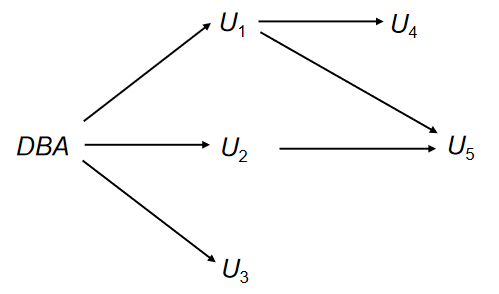
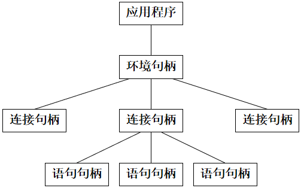

# Advanced SQL

## SQL Data Types and Schemas

SQL 中的类型包括内置类型和用户自定义类型，用户自定义类型可以通过 `CREATE TYPE` 语句创建。

???+ example

    ```sql
    Create type person_name as varchar (20);
    Create table student 
        (sno char(10) primary key, 
        sname person_name, 
        ssex char(1), 
        birthday date);
    Drop type person_name;
    ```

我们还可以创建新的定义域（domain），domain 和 type 的区别在于 domain 可以包含约束条件。

???+ example

    ```sql
    Create domain person_name as varchar(20) not null;
    Create table student 
        (sno char(10) primary key, 
        sname person_name, 
        ssex char(1), 
        birthday date);
    Drop domain person_name;
    ```
    
SQL 中还有专门用于存储大对象的类型（large-object type）

- blob: binary large object -- object is a large collection of uninterpreted binary data
- clob: character large object -- object is a large collection of character data

!!! info
    <figure>
    
    </figure>

    - instance 指内存中可供操作的一个数据库实例，是外界与数据库系统交互的接口。
    - schema 是指数据库中的所有表、视图、索引等对象的集合，包含了数据的组织方式和约束条件。
    - table、view 是数据库中存储数据的基本单位。

## Integrity Constraints

Integrity constraints guard against accidental damage to the database, by ensuring that authorized changes to the database do not result in a loss of data consistency. 

一致性约束保证了数据库不会已授权的修改导致数据一致性的丢失。

- 一致性约束包括实体完整性、参照完整性和用户定义的完整性约束。
- 完整性约束由 DBMS 维护，数据库实例（instance）的状态必须满足完整性约束。

我们常见的在单个 relation 上的完整性约束有：

- not null
- primary key
- unique
- check(P)，其中 P 是一个谓词，用于检查插入或更新的数据是否满足某种条件。

!!! example "domain constraints"

    ```sql
    create domain hourly_wage numeric(5, 2) 
    constraint value_test check(value > = 4.00)
    ```

    这里的 `constraint value-test` 是可选的，但是可以帮助我们明确约束的名称。

### Referential Integrity

!!! note "参照完整性的形式化定义"

    Let $r_1(R_1)$ and $r_2(R_2)$ be the relations with primary keys $K_1$ and $K_2$, respectively. 

    The subset $\alpha$ of $R_2$ is a **foreign key** referencing $K_1$ in relation $r_1$, if for every $t_2$ in $r_2$ there must be a tuple $t_1$ in $r_1$ such that $t_1[K_1] = t_2[\alpha]$. 

    即 $R_2$ 中属性 $\alpha$ 的所有值必须在 $R_1$ 中的 $K_1$ 属性中有对应的值。

    Referential integrity constraint also called **subset dependency**, since its can be written as 
    $$ \Pi_{\alpha}(r_2) \subseteq \Pi_{K_1}(r_1) $$

    - 参照关系中外码的值必须在被参照关系中实际存在，或这个外码的值为 null。

当我们对一个表进行修改时，必须始终保证参照一致完整性
$$ \Pi_{\alpha}(r_2) \subseteq \Pi_{K_1}(r_1) $$ 
其中 $r_2$ 中的属性 $\alpha$ 是一个外码，$K_1$ 是主码。

- Insert: 

    If a tuple $t_2$ is inserted into $r_2$, the system must ensure that there is a tuple $t_1$ in $r_1$ such that $t_1[K] = t_2[\alpha]$, i.e., 
    $$ t_2[\alpha] \in \Pi_{K_1}(r_1) $$

- Delete: 

    当删除 $r_1$ 中的一个 tuple $t_1$ 时，系统必须查找 $r_2$ 中是否有存在 tuple 的的一个集合，使得它们的 $\alpha$ 属性值等于 $t_1[K_1]$，即 $\sigma_{\alpha = t_1[K_1]}(r_2)$。

    如果找到的这个元组集合不为空，那么

    - 要么这个删除命令被当作一个错误而拒绝执行
    - 要么这些指向 $t_1$ 的元组也一起被删除（级联删除）

- Update:

    如果关系 $r_2$ 中的元组 $t_2$ 被更新了，并且这个更新改变了外键 $\alpha$ 的值，那么会经历一个类似于 insert 操作的检查，系统必须保证 $t_2[\alpha]$ 的新值在 $r_1$ 中有对应的值，即 $t_2'[\alpha] \in \Pi_{K_1}(r_1)$。

    如果关系 $r_1$ 中的元组 $t_1$ 被更新了，并且这个更新改变了主键 $K_1$ 的值，那么会经历一个类似于 delete 操作的检查，

    - 要么这个更新被当作一个错误而拒绝执行
    - 要么这些指向 $t_1$ 的元组也一起被更新（级联更新）

### Cascading Actions in SQL 

我们在设置外键时还可以使用 `on delete cascade` 和 `on update cascade` 语句来指定删除和更新时的操作。例如

```sql
CREATE TABLE account(
    ...
    foreign key (branch_name) references branch 
    [on delete cascade]
    [on update cascade]
);
```

- 如果一个外键依赖链横跨多个表，当我们指定 `cascade` 时，删除或更新操作会沿着依赖链一直传递下去
- 但是，如果级联更新或删除会导致违反完整性约束，并且它不能被更深的级联操作解决，那么系统会拒绝这个操作。

由于 null 值不会违反参照完整性，所以我们也可以在外键上指定 `on delete set null` 或 `on update set null` 来设置外键的值为 null。

**参照一致性约束只在 transaction 的末尾检查**，这意味着级联操作的中间步骤允许违反参照完整性，只要这一系列操作执行完毕后，数据库的状态满足参照完整性约束即可。

### Assertions

An **assertion** is a predicate expressing a condition that we wish the database always to satisfy. --- **for complex check condition** on several relations! 

SQL 中 assertion 语句的格式如下：
    
```sql
CREATE ASSERTION assertion_name 
    check (condition);
```

当一个 assertion 被创建后，DBMS 会在每次对数据库进行修改时检查这个 assertion 是否被满足。

- 由于反复检查会带来很大的额外开销，因此使用 assertion 时应该谨慎。

!!! example
    if we require *“the sum of all loan amounts for each branch must be less than the sum of all account balances at the branch”.* 

    但是 SQL 并不支持类似于 for all X，P(X) 的语法，所以我们需要把它转变为 not exists X, such that not P(X) 的形式。因为
    $$ \forall X, P(X) \equiv \neg \exists X, \neg P(X) $$

    于是上面这个 assertion 可以写成

    ```sql
    CREATE ASSERTION sum-constraint CHECK 
        (not exists 
        (select * from branch B 
        where (select sum(amount) from loan 
                where loan.branch-name = B.branch-name) 
                > (select sum(balance) from account 
                where account.branch-name = B.branch-name)))
    ```

    当 `check()` 中的条件为 false 时，DBMS 会拒绝这个修改操作。

### Triggers

A trigger is a statement that is executed **automatically** by the system **as a side-effect of a modification** to the database.

To design a trigger mechanism, we must: 

- Specify the *conditions* under which the trigger is to be executed. 
- Specify the *actions* to be taken when the trigger executes. 

```sql
CREATE TRIGGER trigger_name
    {BEFORE | AFTER} {INSERT | DELETE | UPDATE [OF column_name]}
    ON table_name
    FOR EACH {ROW | STATEMENT}
    EXECUTE PROCEDURE function_name;
```

???+ example

    <figure>
        
    </figure>

    <figure>
        
    </figure>

触发 trigger 的事件可以是插入、删除和更新，由 update 语句触发的 trigger 可以指定由某个特定属性的更新触发。

```sql
Create trigger overdraft-trigger 
    after update of balance on account …
```

!!! note "Statement Level Triggers"
    Instead of executing a separate action for each affected row, a single action can be executed for all rows affected by a transaction. 

    - Use **for each statement** instead of *for each row* 
    - Use **referencing old table** or *referencing new table* to refer to temporary tables  (called transition tables) containing the affected rows 
    - Can be more efficient when dealing with SQL statements that update a large number of rows 

    我们可以考虑下面这个使用语句级触发器的例子。假设我们有 account 和 account_log 两个表，我们希望当账户余额变化时相应的记录日志也会更新。

    两个表的结构如下：

    ```sql
    CREATE TABLE account (
        account_number INTEGER PRIMARY KEY,
        balance DECIMAL(10, 2)
    );

    CREATE TABLE account_log (
        account_number INTEGER,
        old_balance DECIMAL(10, 2),
        new_balance DECIMAL(10, 2),
        update_time TIMESTAMP
    );
    ```

    我们可以设置一个语句级触发器，每次 account 表被更新时，account_log 表也会被更新。

    ```sql
    CREATE TRIGGER account_update_trigger
        AFTER UPDATE OF balance ON account    
        REFERENCING OLD TABLE AS old_account
                    NEW TABLE AS new_account
        FOR EACH STATEMENT
        BEGIN
            INSERT INTO account_log(account_number, old_balance, new_balance, update_time)
            SELECT old.account_number, old.balance, new.balance, CURRENT_TIMESTAMP
            FROM old_account old, new_account new
            WHERE old.account_number = new.account_number;
        END;
    ```

    这个触发器会在 account 表的 balance 属性被更新后，会把所有被修改的 account 记录插入到 account_log 表中。这样就可以一次性记录批量的更新，而不需要为每一个更新操作都执行一次插入操作。

    - Statement Level Triggers 在一次性对多个账户修改余额时，只会触发一次更新日志的操作
    - Row Level Triggers 在一次性对多个账户修改余额时，每一个账户都会单独触发一次更新日志的操作

触发器在早年被用于以下任务：

- 维持汇总数据（如各个部门的总工资）
- 通过记录对特定关系的改变（称为 change 或 deltta relation）来复制数据库，并且具有一个单独的进程来把更改应用到副本中

There are better ways of doing these now: 

- Databases today provide built in  materialized view  facilities to maintain summary data; 
- Databases provide built-in support for replication. 

!!! tip "比较 check、assertion 和 trigger"
    - Check: 用于检查单个 relation 的完整性约束
    
        - 局限于单个表的单个列或多个列，不能执行复杂的逻辑检查，执行速度较快

    - Assertion: 用于检查多个 relation 的完整性约束

        - 可以在数据库层面定义更复杂的跨表约束，适用于较复杂的业务规则
        - 但大多数数据库系统不完全支持 ASSERTION，并且性能开销较大，因为它需要对整个数据库的状态进行检查。

    - Trigger: 在对数据库执行插入、更新或删除操作时自动触发的操作

        - 允许我们在特定条件下执行一段SQL代码，例如，验证数据、修改数据或记录日志。
        - 灵活性极高，可以在任何数据库操作时运行自定义的逻辑
        - 但性能开销较大，因为它需要在每次数据库操作时执行额外的代码。在某些场景下，触发器可能导致递归调用（例如触发器本身触发其他触发器），需要小心管理。

## Authorization

### Security

Security 防止恶意尝试窃取或修改数据。包括以下几个方面

- **Database System Level**: 
    - Authentication and authorization mechanisms allow specific users access only to required data.
- **Operating System Level**: 
    - Operating system super-users can do anything they want to the database! Good operating system level security is required.
- **Network Level**: Must use encryption to prevent:
    - Eavesdropping (unauthorized reading of messages)
    - Masquerading (pretending to be an authorized user or sending messages supposedly from authorized users)
- **Physical Level**: 
    - Physical access to computers allows destruction of data by intruders; traditional lock-and-key security is needed.
    - Computers must also be protected from floods, fire, etc. -- (Recovery)
- **Human Level**: 
    - Users must be screened to ensure that authorized users do not give access to intruders.      
    - Users should be trained on password selection and secrecy.

对数据库的授权可以分为以下几种形式：

- **Read Authorization**: Allows reading, but not modification of data.
- **Insert Authorization**: Allows insertion of new data, but not modification of existing data.
- **Update Authorization**: Allows modification, but not deletion of data.
- **Delete Authorization**: Allows deletion of data.

对数据库 schema 进行修改的授权形式包括：

- **Index Authorization**: Allows creation and deletion of indices.
- **Resources Authorization**: Allows creation of new relations.
- **Alteration Authorization**: Allows addition or modifying of attributes in a relation.
- **Drop Authorization**: Allows deletion of relations.

!!! note "Authorization and Views"
    用户可以被授权访问视图，而不被授权访问视图中的基本表，这不仅可以简化系统的使用，还可以通过只允许用户访问他们工作所需的数据来增强安全性。

    A combination of relational-level security and view-level security can be used to limit a user's access to precisely the data that user needs.

??? example "View Example"
    Suppose a bank clerk needs to know the names of the customers of each branch, but is not authorized to see specific loan information.

    Approach: Deny direct access to the loan relation, but grant access to the view cust-loan, which consists only of the names of customers and the branches at which they have a loan. The cust-loan view is defined in SQL as follows:

    ```sql
    CREATE VIEW cust_loan AS
    SELECT branchname, customer_name 
    FROM borrower, loan 
    WHERE borrower.loan_number = loan.loan_number 
    ```

    现在，银行职员可以通过 cust_loan 视图查看客户名字和他们的贷款分行，而不需要（也不能）直接访问 loan 表。

    Creation of view does not require resources authorization since no real relation is being created.

    The creator of a view gets only those privileges that provide no additional authorization beyond that he already had.

### Granting of Privileges

从一个用户到另一个用户的权限传递可以通过授权图来表示：

<figure markdown="span">
    {width=60%}
</figure>

- 图中的每个节点都表示用于，根节点是 DBA，即数据库管理员。
- 两个节点之间的有向边表示一个用户向另一个用户授予权限，

!!! tip
    - 授权图中的所有边都必须是以数据库管理员为起始的某条路径的一部分
    - 如果管理员撤销了对 $U_1$ 的授权，那么
        - 也必须对 $U_4$ 撤销授权，因为 $U_4$ 依赖于 $U_1$ 
        - $U_5$ 不需要被撤销授权，因为此时还存在一条从 DBA 开始，经过 $U_2$ 到 $U_5$ 的路径
    - 不能存在不来自于 DBA 的授权环路
        - 例如 DBA 授予 $U_7$ 权限，$U_7$ 授予 $U_8$ 权限，$U_8$ 又授予 $U_7$ 权限，然后 DBA 又撤销了对 $U_7$ 的授权
        - 那么就必须撤销从 $U_7$ 到 $U_8$ 的授权以及从 $U_8$ 到 $U_7$ 的授权，因为此时已经不存在从 DBA 到 $U_7$ 和 $U_8$ 的路径了

### Security Specification

The grant statement is used to confer authorization

```sql
GRANT <privilege list> ON <table | view> TO <user list>;
```

`<user list>` 可以是：

- user_ids，向特定的某个用户授予权限
- public，表示允许所有用户拥有这些权限
- role，表示允许这个角色的所有用户拥有这些权限

授予对某个视图的权限不会让用户得到对视图中的基本表的权限。

权限的授予者必须拥有这个将要授予其他用户的权限，或者授予者本身就是数据库管理员。

!!! note "SQL 中的权限"
    - `SELECT`: 允许用户查询表中的数据，或者通过视图查询数据
    - `INSERT`: 允许用户向表中插入数据
    - `UPDATE`: 允许用户通过 SQL 更新语句修改表中的数据
    - `DELETE`: 允许用户删除表中的数据
    - `REFERENCES`: 允许用户在创建关系时声明外键
    - `ALTER`: 允许用户修改表的结构
    - `ALL PRIVILEGES`: 授予用户所有权限
    - `ALL`: 相当于 `ALL PRIVILEGES` 的简写
    - `WITH GRANT OPTION`: 允许用户将自己拥有的权限授予其他用户

        - 例如 `GRANT SELECT ON branch TO user1 WITH GRANT OPTION` 表示授予 user1 对 branch 表的查询权限，并且 user1 可以将这个权限授予其他用户。

### Roles

> permiting common privileges for a class of users can be specified just once, by creating a corresponding "role".

角色可以像用户一样被授权，也可以被撤回权限；角色可以被赋予给某些用户，甚至可以被赋予给其他角色。

!!! example

    ```sql
    Create role teller; 
    Create role manager; 

    Grant select on branch to teller; 
    Grant update (balance) on account to teller; 
    Grant all privileges on account to manager; 

    Grant teller to manager; 
    Grant teller to alice, bob; 
    Grant manager to avi;
    ```

### Revoking Authorization

我们可以使用 revoke 语句来撤销对某个用户的授权

```sql
REVOKE <privilege list> ON <table | view> FROM <user list> [restrict | cascade];
```

当我们撤销某个用户的权限时，可能导致其他用户的权限也被撤销，即级联撤销。

- `restrict` 只有当撤销这个用户的权限不会导致其他用户的权限被撤销时，才执行撤销操作
- `cascade` 无论如何都会执行撤销操作，即使这会导致其他用户的权限被撤销

!!! info "Limitations of SQL Authorization"
    SQL 不支持对于元组级别的权限控制，例如我们不能通过授权来控制学生只能查看自己的成绩。

    随着 Web 对数据库访问的增长，对数据库的访问逐渐从数据库内部转向了 Web 应用程序。在应用程序中，终端用户没有自己的数据库用户 id，它们都会被映射到一个共享的数据库用户 id 上。

    在这种情况下，数据库系统不负责对终端用户进行更细粒度的权限控制，由应用程序来控制用户的访问权限（例如元组级别的权限控制）。

### Audit Trails

An audit trail is a log of all changes (inserts/deletes/updates) to the database along with information such as which user performed the change, and when the change was performed. 

Used to track erroneous/fraudulent updates. 

Can be implemented using triggers, but many database systems provide direct support. 

例如，在 Oracle 中，我们可以使用 `AUDIT` 和 `NOAUDIT` 语句来开启和关闭审计功能。

**语句审计**：

比如 `audit table by scott by access whenever successful` 表示审计用户 scott 对 table 表的所有操作，只有当操作成功时才记录审计信息。

格式为：

```sql
AUDIT <st-opt> [BY <users>] [BY SESSION | ACCESS]
    [WHENEVER SUCCESSFUL | WHENEVER NOT SUCCESSFUL];
```

- 当 `BY <users>` 没有指定时，会对所有用户审计
- `BY SESSION` 表示每次会话期间，相同类型的需审计的 SQL 语句仅记录一次
- 常用的 `<St-opt>` 有：table, view, role, index 等
- 使用 `NOAUDIT` 关闭审计功能（其余部分与 `AUDIT` 语句相同）

**对象（实体）审计**：

例如 `AUDIT delete, update on student` 表示审计所有用户对 student 表的 delete 和 update 操作

格式为：

```sql
AUDIT <obj-opt> ON <obj> | DEFAULT [BY SESSION | BY ACCESS]
    [WHENEVER SUCCESSFUL | WHENEVER NOT SUCCESSFUL];
```

- 实体审计对所有的用户起作用
- `ON <obj>` 指出审计对象：表名、视图名。 
- `ON DEFAULT` 表示对其后创建的所有对象起作用。 
- 取消审计：`NOAUDIT`

审计结果记录在数据字典表: sys.aud$ 中，也可从 dba_audit_trail, dba_audit_statement, dba_audit_object 中获得有关情况。这些数据字典表需在 DBA 用户（system）下才可见。

## Embedded SQL

SQL 标准定义了在 Pascal、PL/I、Fortran、C 和 Cobol 等多种编程语言中嵌入 SQL 的方式。

嵌入了 SQL 查询的语言被称为宿主语言（host language），宿主语言所允许的 SQL 结构构成了嵌入式 SQL。

通常使用 `EXEC SQL` 关键字来标识 SQL 语句。

```sql
EXEC SQL <embedded SQL statement> END_EXEC;
```

但在不同语言中的嵌入式 SQL 语法略有不同，比如 Java 使用 `#SQL{...}` 来标识 SQL 语句。

???+ example
    **单行查询：**

    ```c
    EXEC SQL BEGIN DECLARE SECTION; 
    char V_an[20], bn[20]; 
    float  bal; 
    EXEC SQL END DECLARE SECTION; 
    ...
    scanf("%s", V_an);   // 读入账号，然后据此在下面的语句获得bn, bal的值 
    EXEC SQL SELECT branch_name, balance INTO :bn, :bal FROM 
    account WHERE account_number = :V_an; 
    END_EXEC
    printf("%s, %s, %f", V_an, bn, bal);
    ...
    ```

    其中 `:V_an`、`:bn` 和 `:bal` 是宿主语言变量，可在宿主语言程序中赋值，从而将值带入 SQL。

    - 宿主变量在宿主语言中使用时不加`:`号。

    ---

    **多行查询：**
    
    在嵌入式 SQL 中，可以使用 `EXEC SQL DECLARE CURSOR` 语句声明一个游标（cursor），然后使用 `EXEC SQL OPEN`、`EXEC SQL FETCH` 和 `EXEC SQL CLOSE` 语句来操作游标。

    假设现在我们拥有 account 、depositor、customer 三个表，我们希望找到余额超过某个数值的账户的客户的名字和所在城市。

    - Step1: Specify the query in SQL and declare a cursor for it
    
        首先声明一个游标，然后使用 `SELECT` 语句来指定查询的结果集。

        ```sql
        EXEC SQL 
        DECLARE c CURSOR FOR 
        SELECT customer_name, customer_city 
        FROM depositor D, customer B, account A 
        WHERE D.customer_name = B.customer_name 
                and D.account_number = A.account_number 
                and A.balance > :v_amount 
        END_EXEC 
        ```

    - Step 2: 使用 OPEN 语句执行查询并打开游标

        ```sql
        EXEC SQL OPEN c END_EXEC;
        ```

    - Step 3: 使用 FETCH 语句从查询到的元组中为宿主变量赋值

        ```sql
        EXEC SQL FETCH c INTO :cn, :ccity END_EXEC;
        ```

        我们可以反复使用 FETCH 语句来获取查询结果集中的所有元组，直到没有更多的元组为止。

    - Step 4: 使用 CLOSE 语句关闭游标并释放资源

        ```sql
        EXEC SQL CLOSE c END_EXEC;
        ```

我们还可以用嵌入式 SQL 来执行更新操作，例如单行的修改

```sql
// 首先声明用于存储用户输入的账号和存款额的变量
Exec SQL BEGIN DECLARE SECTION; 
    char an[20]; 
    float bal; 
Exec SQL END DECLARE SECTION; 
...
// 读入账号及要增加的存款额 
scanf("%s, %d", an, &bal);   
// 执行更新操作
EXEC SQL update account set balance = balance + :bal 
where account_number = :an; 
...
```

也可以通过声明游标（cursor）来对多行数据进行修改：

```sql
// 声明宿主变量
EXEC SQL BEGIN DECLARE SECTION;
    char an[20];  // account number
    float bal;    // balance
EXEC SQL END DECLARE SECTION;

// 声明游标
EXEC SQL DECLARE csr CURSOR FOR
SELECT *
FROM account
WHERE branch_name = 'Perryridge'
FOR UPDATE OF balance;

// 打开游标
EXEC SQL OPEN csr;

// 获取和更新数据
while (1) {
    EXEC SQL FETCH csr INTO :an, :bal;
    if (sqlca.sqlcode != 0) {  // 检查是否成功获取数据
        break;
    }
    // 由宿主语句对an, bn, bal中的数据进行相关处理(如打印) 

    // 更新当前游标位置的记录
    EXEC SQL UPDATE account
    SET balance = balance + 100
    WHERE CURRENT OF csr;
}

// 关闭游标
EXEC SQL CLOSE csr;
```

## Dynamic SQL

动态 SQL（Dynamic SQL）是指在程序运行时动态构造和执行 SQL 语句。

```sql
char *sqlprog = "update account 
                set balance = balance * 1.05 
                where account_number = ?";
EXEC SQL PREPARE dynprog  FROM :sqlprog; 
char v_account [10] = "A_101"; 
...
EXEC SQL EXECUTE dynprog USING :v_account
```

上面的动态 SQL 程序中包含了一个占位符 `?`，在执行时会被 `USING :v_account` 语句替换为 `v_account` 变量的值。

## ODBC and JDBC

开放数据库互连（Open Database Connectivity，ODBC）是应用程序与数据库服务器通信的一种标准

- 通过 API 来实现打开与数据库的连接、发送查询、获取查询结果等操作
- GUI、电子表格等应用程序可以通过 ODBC 与数据库进行交互

!!! note "Embedded SQL vs. ODBC"
    - Embedded SQL 使用专门为 DBMS 设计的预编译器
    - ODBC 通过 API 提供数据库与应用程序进行连接的标准途径
        - 不需要特定的 DBMS
        - 不需要预编译

ODBC提供了一个公共的、与具体数据库无关的应用程序设计接口API 。它为开发者提供单一的编程接口，这样同一个应用程序就可以访问不同的数据库服务器。

ODBC接口定义了三种句柄类型：环境句柄、连接句柄和语句句柄。

<figure markdown="span">
    {width=60%}
</figure>

- ODBC 程序首先分配一个 SQL 环境，然后分配一个数据库连接句柄。
- 通过 SQLConnect 函数连接到数据库，其中 SQLConnect 需要的参数有
    - 连接句柄
    - 需要连接的服务器
    - 用户名和密码

??? exmaple

    ```c
    int ODBCexample()   // 程序结构 
        { 
        RETCODE error; 
        HENV env;   /* environment */ 
        HDBC conn;   /* database connection */ 
        SQLAllocEnv(&env); 
        SQLAllocConnect(env, &conn);   /* 建立连接句柄 */ 
        SQLConnect (conn, "MySQLServer", SQL_NTS, "user", 
                        SQL_NTS, "password", SQL_NTS);  
                    /* 建立用户user与数据源的连接，SQL_NTS表示前参量以null结尾 */ 

            char branchname[80]; 
            float balance; 
            int lenOut1, lenOut2; 
            HSTMT stmt; 
            /* 为该连接建立数据区，将来存放查询结果 */
            SQLAllocStmt(conn, &stmt);   
            /* 装配SQL语句 */ 
            char * sqlquery = "select branch_name, sum (balance) from account group by branch_name";   
            /* 执行sql语句,查询结果存放到 数据区stmt ，同时sql语句执行状态的返回值送变量error*/ 
            error = SQLExecDirect(stmt, sqlquery, SQL_NTS); 
            
            if (error == SQL_SUCCESS) { 
            SQLBindCol(stmt, 1, SQL_C_CHAR, branchname, 80, &lenOut1); 
            SQLBindCol(stmt, 2, SQL_C_FLOAT, &balance, 0, &lenOut2); 
            /* 对 stmt 中的返回结果数据加以分离，并与相应变量绑定。第 1 项数据转换为 C 的字符类型，
            送变量 branchname(最大长度为80)，lenOut1 为实际字符串长度（若 ＝- 1代表 null），
            第 2 项数据转换为 C 的浮点类型送变量 balance 中 */ 

            while (SQLFetch(stmt) >= SQL_SUCCESS) { /* 逐行从数据区 stmt 中取数据，放到绑定变量中 */ 
                printf("%s  %.2f\n", branchname, balance); 
                /* 对取出的数据进行处理 */ 
                } 
            } 

            SQLDisconnect(conn); 
            SQLFreeConnect(conn); 
            SQLFreeEnv(env); 
        }
    ```

JDBC(Java Database Connectivity) 是 Java 语言访问数据库的标准接口，他支持

- JDBC 支持各种特性，包括查询和更新数据，以及检索查询结果。
- JDBC 还支持元数据检索，例如查询数据库中存在的关系以及关系属性的名称和类型。
