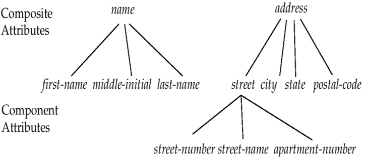
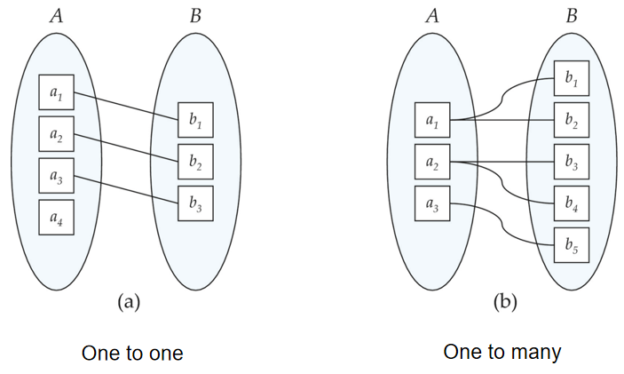
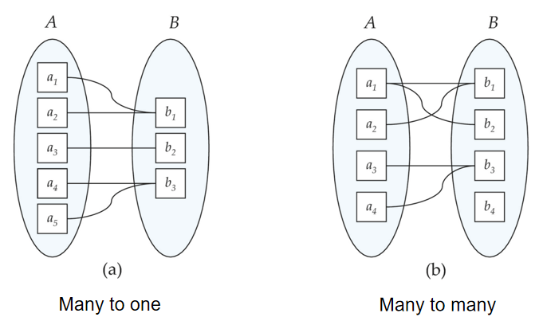
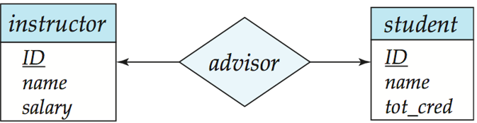
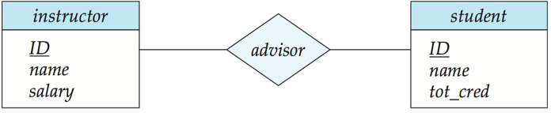
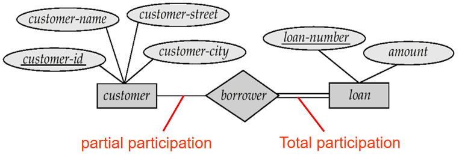
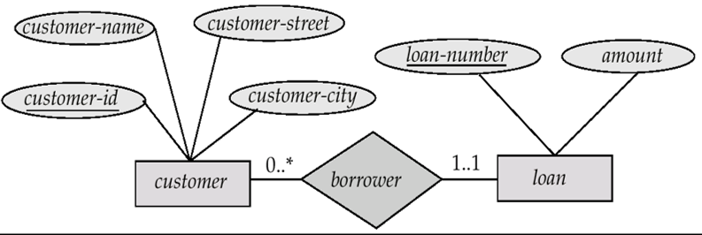

# Entity-Relationship Model

## Entity Sets

现实世界可以被建模为

- A collection of **entities (实体)**

    - An entity is an object that exists and is distinguishable from other objects. 

        实体可以是具体的某个事物，也可以是一个抽象的概念

    - Entities have **attributes (属性)**
    - An **entity set** is a set of entities of the same type that share the same properties.

        例如学生、公司、树、用户等不同种类的实体各自构成的集合。一个实体集中包含多个同类实体

- **Relationships (联系)** among entities 

### Attributes

An entity is represented by a set of attributes, that is descriptive properties possessed by all members of an entity set.

Domain (域, value set) –– the set of permitted values for each attribute.

属性类别包括：

- Simple and composite attributes 简单和复合属性

    - 例如 age 不可以再分解，是简单属性，而 name 可以分解为 first name 和 last name，是复合属性

- Single-valued and multi-valued attributes 单值和多值属性

    - 例如一个人可以拥有多个 phone number，是多值属性

- Derived attributes 派生属性

    - 例如 age 可以通过 birthdate 计算得到
    - 与之对应的是 base attribute（基属性）或称 stored attribute （存储属性）

??? example
    <figure markdown="span">
        {width=75%}
    </figure>

## Relationship Sets

- A relationship is an association among several entities (是二个或多个不同类实体之间的关联). 
- A relationship set is a set of relationship of the same type.
- 一个联系集包含多个同类联系 (或联系实例, relationship instance)，表示两个或多个实体集之间的关联

形式化地来说，一个联系集是由若干个联系实例组成的集合，每个联系实例都是一个实体集中的属性值的集合。
$$ \\{ (e_1, e_2, \cdots e_n) | e_1 \in E_1, e_2 \in E_2, \cdots e_n \in E_n \\} $$
其中 $E_1, E_2, \cdots E_n$ 是实体集，$e_1, e_2, \cdots e_n$ 是实体集中的实体，$(e_1, e_2, \cdots e_n)$ 是一个联系实例。

### Degree of a Relationship Set

联系集的度是指联系实例中包含的实体集的个数。

- Relationship sets that involve two entity sets are binary (or degree two). 
- Relationship sets may involve more than two entity sets.

    比如在一个三元联系集（ternary relationship set）包含三个实体集，其中每个联系实例包含三个实体。

通常而言大于二元的联系集可以通过多个二元联系集来表示，因此大多数联系集都是二元的。

### Mapping Cardinalities

映射基数描述了实体集之间联系的约束，表示的是一个联系集中，一个实体可以与其他类别实体相联系的数目，数目是指最多一个还是可以是多个。

> Express the number of entities to which another entity can be associated via a relationship set. 

<figure markdown="span">
    {align=left width=45%}
    {align=right width=45%}
</figure>

!!! example
    For a binary relationship set the mapping cardinality must be one of the following types:

    - One to one (1 : 1)，如：就任总统（总统，国家） 
    - One to many (1 : n)，如：分班情况（班级，学生） 
    - Many to one (n : 1)，如：就医（病人，医生） 
    - Many to many (n : m)，如：选课（学生，课程）

## Keys

### Keys for Entity Sets

- A **super key** of an entity set is a set of one or more attributes whose values **uniquely determine each entity**.
- A **candidate key** of an entity set is **a minimal super key**.
- Although several candidate keys may exist, one of the candidate keys is selected to be the **primary key.** 

    所有的候选键中只能选出*一个*作为主键

### Keys for Relationship Sets

- The combination of primary keys of the participating entity sets forms a super key of a relationship set

    参与一个联系集的各实体集的主码的组合，构成该联系集的超码

    例如 (customer-id, loan-number) 是 borrower 关系集的超码，其中 customer-id 是 customer 实体集的主码，loan-number 是 loan 实体集的主码

- Must consider the mapping cardinality of the relationship set when deciding what are the candidate keys (1:1, 1:n, m:n).
- Need to consider semantics of relationship set in selecting the primary key in case of more than one candidate key

    在为联系集选择主码时，需要考虑联系集的语义，例如我们希望联系集的主码的属性不能为 null，也不应该经常变化

## E-R Diagram

E-R 图是用来表示实体集、联系集和联系集的映射基数的图形化表示。一般来说，

- 矩形表示实体集
- 菱形表示联系集
- 椭圆表示属性
    - 多重属性用双椭圆表示
    - 派生属性用虚线椭圆表示
- 实体集和对应的属性之间用实线连接，实体集和联系集之间也要用实线连接
- 属性中的主码用下划线标记

{align=right width=15%}

<figure markdown="span">
    {width=70%}
</figure>

此外我们还可以用如右图的画法来表示一个实体集及其属性

- 主键用下划线标记
- 复合属性和分量属性通过缩进来表示
- 多值属性用花括号包裹
- 派生属性在属性名后面小括号（圆括号）标记

!!! note
    Entity sets of a relationship need not be distinct, e.g., Recursive relationship set (自环联系集). 

    Role: the function that an entity plays in a relationship, e.g., the labels “manager” and “worker” are called roles; they specify how employee entities interact via the works-for relationship set. 

    Role labels are optional, and are used to clarify semantics of the relationship. 
    
    <figure markdown="span">
        {width=60%}
    </figure>

### Express the Cardinality Constraints

我们可以通过不同的连线方式来表示联系集的映射基数约束，通常来说，一个由联系集指向实体集的箭头表示 one，直接用直线把实体集和联系集连接起来则表示 many。

!!! example
    === "One-to-One"
        这里每一个教授至多能指导一个学生，并且每个学生至多被一个教授指导。

        <figure markdown="span">
            {width=60%}
        </figure>

    === "One-to-Many"
        这里每个教授都能指导若干个学生（包括 0 个），而每个学生至多被一个教授指导。

        <figure markdown="span">
            {width=60%}
        </figure>

    === "Many-to-One"
        这里每个教授都至多能指导一个学生，而每个学生都能被若干个教授指导（包括 0 个）。

        <figure markdown="span">
            {width=60%}
        </figure>

    === "Many-to-Many"
        这里每个教授都能指导若干个学生（包括 0 个），而每个学生也能被若干个教授指导（包括 0 个）。

        <figure markdown="span">
            {width=60%}
        </figure>

### Participation of an Entity Set in a Relationship Set

- **Total participation (全参与)** (indicated by **double line**): 

    every entity in the entity set participates in at least one relationship in the relationship set. 

    - 例如 loan 实体集必须全参与 borrower 联系集，也就是说每个贷款必须有一个借款人

- **Partial participation (部分参与)**: 

    some entities may not participate in any relationship in the relationship set.

    - 例如 customer 实体集部分参与 borrower 联系集，也就是说有些客户没有贷款（例如只存但不借）

**映射基数约束(Mapping cardinality constraints)**，限定了一个实体与发生关联的另一端实体可能关联的数目上限。

全参与和部分参与约束，则反映了一个实体参与关联的数目下限：0 次，还是至少 1 次。

<figure markdown="span">
    {width=50%}
</figure>

上图中单实线表示部分参与，双实线表示全参与。

<figure markdown="span">
    {width=50%}
</figure>

我们还可以用另一种方式来表示全参与和部分参与。

这里我们在实体集和联系集之间的连线上用 "0..*" 表示至少有 0 个参与，至多无上限个参与（部分参与）；而用 "1..1" 表示至少有 1 个参与，至多有 1 个参与（全参与），即必须有且只能有一个参与。

!!! info "Binary vs. Non-Binary Relationships"
    Some relationships that appear to be non-binary may be better represented using binary relationships

    - 例如一个三元关系集 parent，每个关系都涉及到三个实体：child, father, mother。就可以用两个二元关系集 father 和 mother 来替代 parent 关系集。

        parents(he, she, child) $\Rightarrow$ father(he, child), mother(she, child)

    - 但也有一些关系不适合用二元关系来表示，例如一个三元关系集 works-on(employee, department, job)

    总的来说，任何一个非二元关系都可以通过添加*人造实体集*来把它变成若干个二元关系

    <figure markdown="span">
        {width=60%}
    </figure>

## Weak Entity Sets

- An entity set that does not have a primary key is referred to as a weak entity set.

    没有主键的实体集称为弱实体集（weak entity set），它依赖于一个强实体集来确定其唯一性。

- The existence of a weak entity set depends on the existence of a identifying entity set or owner entity set

    弱实体集所依赖的强实体集称为标识实体集或属主实体集，它们之间的联系称为标识性联系（identifying relationship）

    - It must relate to the identifying entity set via a total, one-to-many relationship set from the identifying to the weak entity set
    - Identifying relationship depicted using a double diamond，
    - 弱实体集没有足够属性来作为主键，因此必须依赖于一个强实体集来确定其唯一性
- The **discriminator** (or **partial key**) of a weak entity set is the set of attributes that distinguishes among all the entities of a weak entity set.
- The primary key of a weak entity set is formed by the primary key of the strong entity set on which the weak entity set is existence dependent, plus the weak entity set’s discriminator.
    - 弱实体集的标识通常由两个部分组成：强实体集的主码和弱实体集的标识符

用虚下划线标记弱实体集的标识符，用虚线箭头表示弱实体集和强实体集之间的联系。用**双菱形**表示弱实体集和它所依赖的强实体集之间的**联系集**

!!! note
    - 强实体集的主键不会显式地地保存在弱实体集中，因为它已经通过联系集与弱实体集关联了。
    - 如果我们把强实体集的主键直接保存在弱实体集中，那么这个弱实体集就会成为一个强实体集（应为此时就可以用这个主键来明确地标识自己）。这样一来它和自己所依赖的强实体集之间的联系集就会重复地保存了相同的信息。

??? example
    <figure markdown="span">
        {width=80%}
    </figure>

## Extended E-R Features 

我们可以把实体集分为不同的层级：

- **Specialization (特化)**：the **top-down process** of identifying lower-level, more specific entity subtypes from a higher-level entity type.

    - 较低层次的实体集称为子类型，较高层次的实体集称为父类型。
    - 底层级的实体集会“继承”父类型的属性，还可以拥有自己的属性。（可以类比于 OOP 中的继承）

- **Generalization (泛化)**：a **bottom-up process** – combine a number of entity sets that share the same features into a higher-level entity set.

    - 通过泛化，我们可以把多个实体集合并为一个更高层次的实体集，这个实体集包含了合并前所有实体集的共同属性。

> 某种程度上，泛化与特化是互逆的过程，它们在 E-R 图中可以用相同的符号表示。

### Design Constraints on a Specialization / Generalization

Constraint on which entities can be members of a given lower-level entity set. 在特化和泛化中，我们可以定义约束条件来限制哪些实体可以成为一个给定的低层次实体集的成员。

- 约束可以是根据某些条件来定义的

    例如我们把所有大于 65 岁的客户都定义为 senior-customer，而 senior-customer 是 customer 的子类型。

- 约束也可以是用户自定义的

    例如用户可以自定义地把某些 employee 归类到不同的 team 中

Constraint on whether or not entities may belong to more than one lower-level entity set within a single generalization. 可以定义约束条件来限制一个实体是否可以属于多个子类型。

- Disjoint (不相交)：
    - 一个实体只能属于一个低层的实体集 
    - Noted in E-R diagram by writing disjoint next to the ISA triangle.
- Overlapping (可重叠)
    - 一个实体可以同时属于多个低层的实体集

    <figure markdown="span">
        {width=60%}
    </figure>

我们还可以定义完全性约束（total completeness constraint）：specifies whether or not an entity in the higher-level entity set **must belong to at least one of the lower-level entity sets** within a generalization.

即一个高层次实体集中的实体是否必须属于某一个低层次实体集。

- Total: an entity must belong to one of the lower-level entity sets. 
- Partial: an entity need not belong to one of the lower-level entity sets.

<figure markdown="span">
    {width=60%}
</figure>

### Aggregation

考虑我们之前见到的一个例子：我们拥有一个三元联系集 works-on(employee, branch, job)，如果我们想要记录每个任务的经理，我们可以简单粗暴地直接添加一个 manager 实体集和 manages 联系集。

<figure markdown="span">
    {width=50%}
</figure>

但是这样我们会发现存在一些问题：works-on 和 manages 之间存在重复的信息。所有 manages 联系实例都对应着一个 works-on 联系实例，但未必所有 works-on 联系实例都对应着一个 manages 联系实例，因此我们也不能删去 works-on 联系集。

于是现在我们就可以通过聚合（aggregation）来解决这个信息冗余的问题

- Treat relationship as an abstract entity. 

    把联系集看作一个抽象实体集，这样我们就可以把 works-on 联系集和这三个实体集（employee, branch, job）聚合成一个新的实体集，再让这个新的实体集和 manager 实体集之间建立联系。

- Allows relationships between relationships. 
- Abstraction of relationship into new entity.

<figure markdown="span">
    {width=50%}
</figure>

这样一来我们就在不引入冗余的情况下，记录了每个任务的经理。

- An employee works on a particular job at a particular branch. 
- An employee, branch, job combination **may** have an associated manager.

??? info "Symbols in E-R Notation"
    <figure markdown="span">
        {width=60%}
    </figure>

    <figure markdown="span">
        {width=60%}
    </figure>

    <figure markdown="span">
        {width=60%}
    </figure>

    <figure markdown="span">
        {width=60%}
    </figure>

## Design of an E-R Database Schema 

- **Requirement analysis** 需求分析
    - What data, applications, and operations needed. 
- **Conceptual database design** 概念数据库设计
    - A high-level description of data, constraints using E-R model or a similar high level data model. 
- **Logical database design** 逻辑数据库设计
    - Convert the conceptual design into DB schema --- tables 
    - Schema refinement: Normalization of relations --- Check relational schema for redundancies and related anomalies. 
- **Physical database design** 物理数据库设计
    - Indexing, clustering and database tuning. 

### E-R Design Decisions

1. Use an attribute or entity set to represent an object?
    - 若我们只对一个对象的名字及单值感兴趣，则可作为属性，如性别；若一个对象除名字外，本身还有其他属性需描述，则该对象应定义为实体集，如电话, 部门。
    - 一个对象不能同时作为实体和属性。
    - 一个实体集不能与另一实体集的属性相关联，只能实体与实体相联系。
2. Use it as an entity set or a relationship set?
    - 用联系集表示两个实体对象之间的 action
3. Use it as an attribute of an entity or a relationship?
4. The use of a ternary or n-ary relationship versus a pair of binary relationships.
5. The use of a strong or weak entity set.
6. The use of specialization/generalization – contributes to modularity in the design (有助于模块化).
7. The use of aggregation – can group a part of E-R diagram into a single entity set,  and  treat it as a single unit without concern for the details of its internal structure.

## Reduction of an E-R Schema to Tables 

- A database which conforms to an E-R diagram can be represented by a collection of tables.
- For each entity set and relationship set, there is a unique table which is assigned the name of the corresponding entity set or relationship set.

    - 每个实体集和联系集都对应一个表，表的名字就是实体集或联系集的名字。

### Entity Set with Composite Attributes

- Composite attributes are flattened out by creating a separate attribute for each component attribute.

    - 例如 name 可以拆分为 first-name 和 last-name，那么我们在创建表时就直接创建 first-name 和 last-name 两个属性，如
    customer(<u>customer-id</u>, first-name, last-name, cust-street, cust-city)

### Multivalued Attributes

- A multivalued attribute M of an entity E is represented by a separate table EM

    - 例如一个学生可以有多个电话号码，那么我们就可以创建一个表 student-phone(student-id, phone-number)

### Representing Weak Entity Sets

- A weak entity set becomes a table that includes a column for the primary key of the identifying strong entity set.

    - 例如一个弱实体集 payment，它依赖于实体集 loan，那么我们就可以创建一个表 payment(loan-number, payment-number, payment-date, payment-amount)，其中第一个属性 loan-number 就是 loan 实体集的主码

### Representing Relationship Sets as Tables

- A relationship set is represented as a table with columns for the primary keys of the two participating entity sets, (which are foreign keys here) and any descriptive attributes of the relationship set itself.

    - 例如联系集 depositor(customer-id, account-number, access-date) 中前两个属性分别是 customer 和 account 实体集的主码，最后一个属性是联系集自己的属性

### Redundancy of Tables

- Many-to-one and one-to-many relationship sets that are total on the many-side can be represented by adding an extra attribute to the “many” side, containing the primary key of the one side (对1:n联系，可将“联系”所对应的表，合并到对应“多”端实体的表中). 

    - 例如 account(account-number, balance) 和 account-branch(account-number, branch-name)，由于一个分行可以拥有多个账户，因此我们可以把 account-branch 表合并到 account 表中，于是就得到了 account(account-number, branch-name, balance)

- If participation is partial on the many side, replacing a table by an extra attribute in the relation corresponding to the “many” side could result in null values.

    - 例如 cust-banker(customer-id, employee-id, type); 但有的 customer 没有 banker（银行员工）, 则合并之后得：
	customer(customer-id, cust-name, cust-street, cust-city, banker-id, type) ，customer 有些元组的 banker-id、type 为 null。

### Representing Specialization as Tables

对于特化，有两种方法来表示：

**Method 1**

- Form a table for the higher level entity. 
- Form a table for each lower level entity set, including primary key of higher level entity set and local attributes.

<figure markdown="span">
    {width=70%}
</figure>

这样的缺点在于，当我们想要访问一个 employee 的所有信息时，我们需要同时访问两个表

**Method 2**

- Form a table for each entity set with all local and inherited attributes.
- 如果特化是全参与的，那么我们可以把上层的实体集定义为一个视图，这样我们就可以通过视图来访问所需的信息

这么做的缺点在于，一些属性会被重复地保存在不同的表中，这样会增加数据的冗余

<figure markdown="span">
    {width=70%}
</figure>