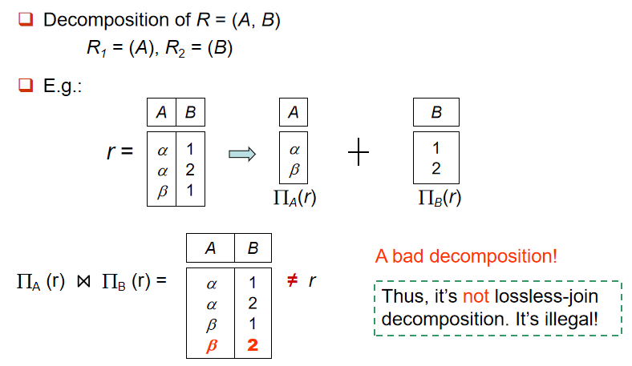
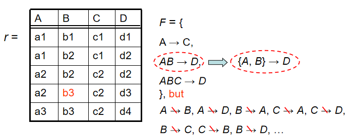
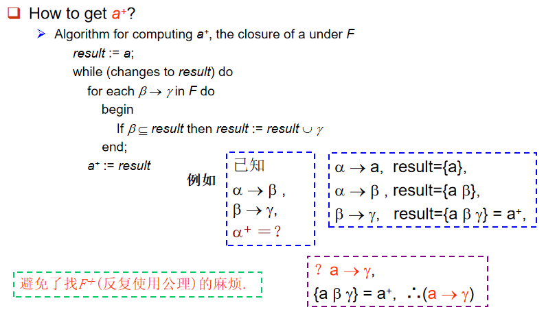
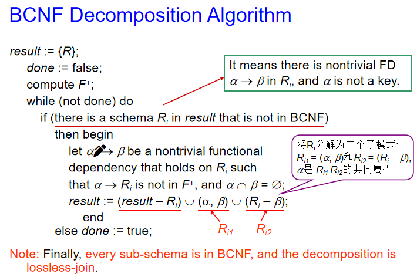
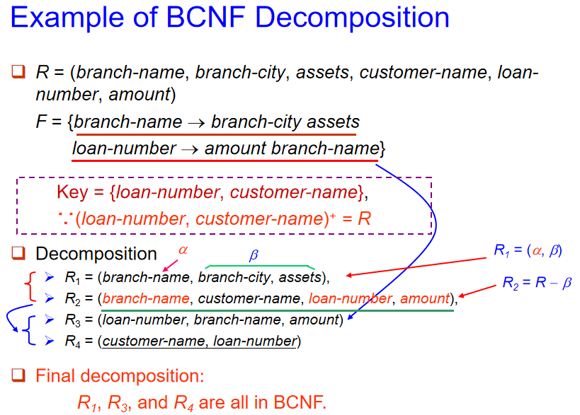

# Relational Database Design

## First Normal Form 

- Domain is **atomic** if its elements are considered to be indivisible units.
    - 如果一个域的元素是不可分割的单位，那么这个域就是原子域。
    - 例如：
        - `age` 是原子域，因为年龄不可以再被分割（只精确到年的情况）
        - `name` `address` 不是原子域，因为它们可以被分割为姓和名，或者城市、街道和门牌号等
- A relational schema R is in **first normal form** (1NF) if the domains of all attributes of R are atomic.
    - 在关系型数据库中，要求所有的关系都必须是满足第一范式的

## Pitfalls in Relational Database Design 

我们需要为关系数据库设计一个好的 schema，如果没有设计好，就会出现冗余存储、插入/删除/更新异常等情况，从而导致表示特定信息的能力下降。

设计的不好的 schema 通常会有以下特点：

1. **冗余数据**：同一信息在多个地方重复存储
    - 同一信息在多个地方重复存储
2. **更新异常**：当数据需要更新时，更新操作必须在多个位置进行，否则可能会导致不一致的数据
3. **删除异常**：删除某条记录时，会意外地删除其他重要数据，导致数据丢失或丢失重要信息。
    - 如果没有正确的外键约束或表设计，删除一条记录可能会影响到与之关联的其他数据，导致不可恢复的数据丢失
4. **插入异常**：在插入新数据时，必须插入不必要的信息或者违反数据库的规范性
5. **数据依赖不明确**：数据之间的依赖关系没有正确表达，导致无法通过合理的查询或者维护来实现数据完整性
6. **违反规范化原则**
    - 按照第一范式（1NF）、第二范式（2NF）和第三范式（3NF）等进行数据库设计
    - 导致数据重复、维护困难、性能降低
7. **表字段命名不规范或不一致**
    - 字段的命名不统一，缺乏描述性，使得表的含义难以理解
    - 例如字段命名没有遵循统一规则，`user_name`、`username`、`userEmail`不同命名风格混杂在一起

### Decomposition

Decomposition 指的是将一个关系分解成多个关系，例如将 $r(ABCD)$ 分解为 $r_1(AB)$ 和 $r_2(BCD)$ 

- 分解前的 schema $R$ 的所有属性都应该出现在分解后的属性 $(R_1,R_2)$ 中，例如
    $$ R = R_1 \cup R_2 $$ 
- **无损连接分解(Lossless-join decomposition)** 指的是对于 schema $R$ 上所有可能的关系 $r$，都有
    $$ r = \Pi_{R_1} ( r ) \bowtie \Pi_{R_2} ( r ) $$

    - 无损连接分解的要求是可以通过子关系的自然连接恢复原关系

??? example "Non Lossless-Join Decomposition"
    <figure markdown="span">
        {width=75%}
    </figure>

    这里的满足了$ R = R_1 \cup R_2 $，但 $\Pi_{R_1}(r) \bowtie \Pi_{R_2}(r) \neq r$

## Functional Dependencies 

!!! definition 
    Let $R$ be a relation schema, $\alpha$ and $\beta$ be attributes of $R$.

    The functional dependency 
    $\alpha \to \beta$ holds on $R$ if and only if for any legal relations $r(R)$, whenever any two tuples $t_1$ and $t_2$ of $r$ agree on the attributes $\alpha$, they also agree on the attributes $\beta$, i.e.,

    $$ t_1[\alpha] = t_2[\alpha] \to t_1[\beta] = t_2[\beta] $$

也就是说，当我们知道属性 $\alpha$ 的值时，就可以唯一确定属性 $\beta$ 的值，此时我们称

- $\beta$ is functionally dependent on $\alpha$, $\alpha$ functionally determines $\beta$.

    $\beta$ 函数依赖于 $\alpha$, $\alpha$ 函数决定 $\beta$

函数依赖也是完整性约束的一种，它表示特定属性的值之间的关系，可以用判断 schema 的规范化程度，并作为改进设计的参考。

!!! note "Functional dependency vs. Key"
    - A functional dependency is a generalization of the notion of a key. 
    - $K$ is a superkey for the relation schema $R$ if and only if $K \to R$. 
    - $K$ is a candidate key for $R$ if and only if 
        - $K \to R$
        - no $\alpha \subset K, \alpha \to R$

            即不存在 $K$ 的真子集 $\alpha$，使之满足 $\alpha \to R$

### The Use of Functional Dependencies

We use functional dependencies to: 

1. Test relations to see if they are legal under a given set of functional dependencies $F$
    - 如果一个关系 $r$ 在函数依赖集 $F$ 的所有要求下都是合法的，那么就称 $r$ 满足 $F$

    <figure markdown="span">
        {width=75%}
    </figure>

2. Specify constraints (F) on the set of legal relations --- schema
    - 如果所有的合法关系 $r(R)$ 都满足 $F$，那么就称 $F$ 在 $R$ 上成立

    !!! note 
        - 容易判别一个 $r$ 是否满足给定的F;
        - 不易判别 $F$ 是否在 $R$ 上成立。不能仅由某个 $r$ 推断出 $F$。
        - $R$ 上的函数依赖集 $F$, 通常由定义 $R$ 的语义决定

### Trivial and Non-Trivial Dependency

A functional dependency is trivial (平凡的) if it is satisfied by all relations

- 比如说 $A \to A$ 和 $AB \to A$ 就都是平凡的函数依赖

更一般的来说，如果 $\beta \subseteq \alpha$，那么 $\alpha \to \beta$ 就是平凡的函数依赖，否则就是不平凡的函数依赖

- Trivial：$\alpha \to \beta$, if $\beta \subseteq \alpha$
- Non-Trivial：$\alpha \to \beta$, if $\beta \not\subseteq \alpha$

### Closure of a Set of Functional Dependencies

当我们拥有一个函数依赖的集合 $F$ 时，我们可以从 $F$ 中推导出更多的函数依赖。

- 例如：如果 $F$ 中有 $A \to B$ 和 $B \to C$，那么我们可以推导出 $A \to C$

!!! definition "函数依赖集的闭包"
    The closure of a set of functional dependencies $F$ is the set of all functional dependencies that can be inferred from $F$ using Armstrong's axioms.

    - 函数依赖集 $F$ 的闭包指的是所有可以从 $F$ 中推导出的函数依赖的集合，记作 $F^+$。

!!! note "Armstrong's Axioms"
    - 自反律（reflexivity）: If $\beta \subseteq \alpha$, then $\alpha \to \beta$ is in $F^+$.
    - 增补律（Augmentation）: If $\alpha \to \beta$ is in $F^+$, then $\alpha A \to \beta A$ is in $F^+$ for any attribute $A$.
    - 传递律（Transitivity）: If $\alpha \to \beta$ and $\beta \to \gamma$ are in $F^+$, then $\alpha \to \gamma$ is in $F^+$.

利用上面这三条公理，我们可以保证

- Sound（保真的）：从 $F$ 中推导出来一定都是 $F^+$ 中的函数依赖
- Complete（完备的）：$F^+$ 中的每一个函数依赖都可以从 $F$ 中推导出来

我们还可以对 Armstrong 公理进行补充，得到下面的补充定律：

- 合并律（union）：
    - 如果 $X \to Y,\quad X \to Z$，那么就有 $X \to YZ$
- 分解律（decomposition）：
    - 如果 $X \to YZ$，那么  $X \to Y$ 并且 $X \to Z$
- 伪传递律（pseudotransitivity）：
    - 如果 $X \to Y,\quad ZY \to W$，那么 $XZ \to W$

!!! question "如何计算 $F$ 的闭包 $F^+$？"
    首先令 $F^+ = F$，然后重复以下步骤，直到 $F^+$ 不再发生变化：

    1. 对于 $F^+$ 中的每一个函数依赖 $f$，
        - 对 $f$ 应用自反律和增补律
        - 把新得到的函数依赖添加进 $F^+$ 中
    2. 对于 $F^+$ 中的每一对函数依赖 $f_1$ 和 $f_2$
        - 对 $f_1$ 和 $f_2$ 应用传递律
        - 把新得到的函数依赖添加进 $F^+$ 中

### Closure of Attribute Sets

如何知道属性 $A$ 是不是 $R$ 的一个 superkey？

- 首先找到 $F^+$，然后对于其中所有的 $A \to B_i$，查看是否满足 $\{ B_1, B_2, \cdots \} = R$。但是这个方法的缺点在于计算 $F^+$ 相当困难
- 或者我们也可以改变方法，去寻找 $A$ 的属性闭包

!!! definition
    对于一个属性集 $A$，我们把在 $F$ 下直接和间接由 $A$ 决定的属性集合称为它的闭包，记作 $A^+$

    $$ A^+ = \{ B| (A \to B) \in F \} $$

于是现在我们可以利用 $A$ 的闭包来判断它是否是 $R$ 的一个 superkey：如果 $A^+ = R$，那么 $A$ 就是 $R$ 的一个 superkey，反之则不是。

!!! note "How to get $A^+$"
    <figure markdown="span">
        {width=75%}
    </figure>

There are three kind uses of the atrribute set closure algorithm:

- Testing for a superkey --- ($A \to R?$)
    - $A^+$ 是否包含 $R$ 的所有属性，即是否有 $R \subseteq A^+$
- Testing functional dependencies
    - 如果我们想知道 $X \to Y$ 是否在 $F^+$ 中，只需要查看是否满足 $Y \subseteq X^+$
- Computing closure of F
    - 我们只需要每个计算属性集 $X$ 的闭包 $X^+$，对于每个属性 $Y \subseteq X^+$，$X \to Y$ 都在 $F^+$中，所有的 $X \to Y$ 就构成了 $F^+$

### Canonical Cover (正则覆盖) 

DBMS should always check to ensure not violate any Functional Dependency (FD) in $F$.

- 但如果 $F$ 特别大，那么对它的检查就会带来大量的开销，我们需要化简函数依赖集合

!!! definition
    一个函数依赖集 $F$ 的正则覆盖（canonical cover）是指 $F$ 的最小超集，记作 $F_c$。它满足以下条件：

    - $F$ 的所有函数依赖都可以从 $F_c$ 中得到
    - $F_c$ 中没有冗余的函数依赖，其中的函数依赖也没有任何冗余部分。例如 $F_c$ 中的所有函数依赖都不含无关属性（extraneous attribute）
    - $F_c$ 中所有函数依赖的左侧都是唯一的
        - 例如 $X \to Y_1,\  X \to Y_2$ 应当被写为 $X \to Y_1 Y_2$

!!! tip
    正则覆盖 $F_c$ 是函数依赖集 $F$ 的最小化。得到 $F_c$ 的关键步骤是消去现有函数依赖中的 extraneous（无关的、多余的）属性，从而排除相应的函数依赖，使函数依赖集最小化。

要得到 $F_c$，我们要做的就是删除 $F$ 中的多余属性。多余属性有三种情况：

1. 有一条 FD 可以从其他 FD 推导得到
    - 例如 
        $$ F = \{ A \to B,\ A \to C,\ B \to C \}$$
        中 $A \to C$ 可以由其他两条 FD 推导得到，是多余的，因此 
        
        $$F_c = \{ A \to B,\ B \to C \}$$

2. FD 的左半边部分存在冗余
    - 例如 
        $$ F=\{ A \to B, B \to C, AC \to D \} $$
        
        中可以由前两个 FD 推导出 $A \to C$，于是 $AC \to D$ 里的 $C$ 就是多余的

        $$ F_c = \{ A \to B,\ B \to C,\ A \to D\} $$

3. FD 的右半边部分存在冗余
    - 例如
        $$ F=\{ A \to B, B \to C, A \to CD \} $$
        
        中可以由前两个 FD 推导出 $A \to C$，于是 $A \to CD$ 里的 $C$ 就没有必要存在。

        $$ F_c = \{ A \to B,\ B \to C,\ A \to D\} $$ 

#### Extraneous Attributes

对于一个函数依赖 $\alpha \to \beta$，我们可以通过以下方式来寻找和去除无关属性

- 如果一个属性 $A \in \alpha$，并且 $F$ 可以从 $F' = (F - \{\alpha \to \beta\}) \cup \{(\alpha - A) \to \beta\}$ 中逻辑推断得到，那么就称 $A$ 是多余属性。

    也就是说，如果把属性 $A$ 去掉之后仍能推导出相同的约束，那么 $A$ 就是多余的

!!! example
    - 对于 $\alpha = \{A\alpha'\}$，$\{A\alpha'\} \to \beta$。若 $F$ 蕴涵 $\alpha' \to \beta$，则 $\{ A \alpha' \} \to \beta$ 多余，即 $A$ 多余。
    - 给定 $F = \{A \to C, AB \to C\}$

        因为 $F = \{A \to C, AB \to C\}$ 逻辑上蕴涵了 $A \to C$，所以 $B$ 在 $AB \to C$ 中是多余的，因此

        $F' = \{A \to C, A \to C\} = \{A \to C\}$

- 如果一个属性 $A \in \beta$，并且 $F$ 可以从 $F' = (F - \{\alpha \to \beta \}) \cup \{ \alpha \to (\beta - A) \}$ 中逻辑推断得到，那么就称 $A$ 是多余属性。

!!! example
    - 对于 $\beta = \{A \beta'\}$, $\alpha \to \{A\beta'\}$，我们有 $\{ \alpha \to A, \alpha \to \beta \}$。
        
        若 $F'$ 蕴涵 $\alpha \to A$，则 $\alpha \to A$ 多余（即可用 $F'$ 代替 $F$）。

    - 给定 $F = \{A \to C, AB \to CD\}$

        由于 $AB \to CD \to \{AB \to C, AB \to D\}$，且 $AB \to C$ 可以从 $F' = \{A \to C, AB \to D\}$ 推导出，

        因此 $C$ 在 $AB \to CD$ 中是多余的。

!!! question "如何知道一个属性是否是多余的？"
    To test if attribute $A \in \alpha$ is extraneous in $\alpha$:

    - 计算 $(\alpha - A)^+$，即 $(\alpha')^+$
    - 查看 $(\alpha - A)^+$ 是否包含 $\beta$，如果是，那么 $A$ 就是多余的
    - 也就是说如果可以证明 $F$ 蕴含 $\beta \in (\alpha')^+$，即 $\alpha' \to \beta$，那么 $A$ 就是多余的，可以删去

    To test if attribute $A \in \beta$ is extraneous in $\beta$:

    - 仅使用 $F'$ 中的依赖来计算 $\alpha^+$，其中
        $$ F' = (F - \\{\alpha \to \beta \\}) \cup \\{ \alpha \to (\beta - A) \\} $$
    - 查看 $\alpha^+$ 是否包含 $A$，如果是，那么 $A$ 就是多余的
    - 也就是说如果可以证明 $F'$ 蕴含 $A \in \alpha^+$，即 $\alpha \to A$，那么 $A$ 就是多余的，可以删去

!!! tip
    总的来说，如果我们怀疑一个属性是多余的，那么我们可以把包含这个属性的 FD 从 $F$ 中去掉，然后再加上去掉多余属性后的 FD，从而得到新的函数依赖集 $F'$，如果 $F'$ 与 $F$ 等价，那么这个属性就确实是多余的。

#### Computing Canonical Cover

当我们想要得到一个函数依赖集 $F$ 的正则覆盖时，我们可以重复以下步骤，直到 $F$ 不再变化为止：

- 在 $F$ 中使用合并规则，例如把 $\alpha_1 \to \beta_1$ 和 $\alpha_1 \to \beta_2$ 的替换为 $\alpha_1 \to \beta_1\beta_2$
- 寻找一个在 $\alpha$ 或 $\beta$ 中具有多余属性的函数依赖 $\alpha \to \beta$
- 如果找到了多余属性，就把它从 $\alpha \to \beta$ 删去

> **注意**：当某些多余属性被删除后，合并规则可能可以应用在新的函数依赖上，因此需要重新应用合并规则。

## Decomposition 

!!! note "Goals of Normalization"
    我们总是希望一个特定的关系 $R$ 具有一个“好”的形式，例如没有冗余、没有插入/删除/更新异常等。

    当我们遇见到一个关系不满足这些条件时，我们就需要把它分解为一组关系 $\{ R_1, R_2,\cdots, R_n \}$，使得

    - The decomposition is a **lossless-join decomposition** (无损连接分解). 
    - The decomposition is **dependency preservation** (依赖保持). 
    - Each relation $R_i$ is in a good form --- BCNF or 3NF.

### Desirable properties of decomposition

- 原关系的属性必须出现在某个子关系的属性中，$R = R_1 \cup R_2$
- 分解是无损连接分解。对于模式（schema）$R$ 所有可能的关系 $r$，都有 $r = \Pi_{R_1}(r) \bowtie \Pi_{R_2}(r)$

    !!! tip
        将 $R$ 分为 $R_1, R_2$ 的分解是无损分解，当且仅当下面的依赖中至少有一个处于 $F^+$ 中

        - $\{ R_1 \cap R_2 \} \to R_1$
        - $\{ R_1 \cap R_2 \} \to R_2$

        无损连接分解的条件： 分解后的二个子模式的共同属性必须是 $R_1$ 或 $R_2$ 的码（适用于一分为二的分解）

- 分解后的子关系必须保持依赖（dependency preservation）
    - 为了在更新高效地进行检查（确保不会为违反任何 FD），我们需要允许在子关系 $R_i$ 中分别进行检查，而无需把它们连接起来再进行检查
    - $F$ 对于 $R_i$ 的限制是：$F_i \subseteq F^+$，并且 $F_i$ 只包含 $R_i$ 的属性
    - $(F_1 \cup F_2 \cup \cdots \cup F_n)^+ = F^+$，其中 $F_i$ 是 $F^+$ 中只包含 $R_i$ 的属性的函数依赖集
- 子关系中没有冗余：子关系 $R_i$ 要么属于 Boyce-Codd 范式（BCNF），要么属于第三范式（3NF）

!!! info "判断是否实现了依赖保持"
    - 对于 $F$ 中的某个依赖 $\alpha \to \beta$，查看是否能有某个 $R_i$ 能保持函数依赖 $\alpha \to \beta$
    - 如果对于 $F$ 中的 $\alpha \to \beta$ 都能有一个 $R_i$ 保持函数依赖，那么这个分解就是保持依赖的。

## Boyce-Codd Normal Form

!!! definition "BCNF"
    一个关系模式 $R$ 相对于函数依赖集 $F$ 满足 BCNF，如果 $F^+$ 中的所有形如 $\alpha \to \beta$ 的函数依赖，其中 $\alpha \subseteq R$，$\beta \subseteq R$，至少满足以下条件之一：

    - $\alpha \to \beta$ 是平凡的（即 $\beta \subseteq \alpha$）
    - $\alpha$ 是 $R$ 的超键（即 $R \subseteq \alpha^+$，或 $\alpha \to R$）

!!! example
    $R = (A,B,C),\ F = \{ A \to B,\ B \to C \}$，key = $\{ A \}$

    这里的 $R$ 不满足 BCNF，因为 $B \to C$ 处在 $F^+$ 中，并且它不是平凡的，它左侧的 $B$ 也不是超键。

    但是如果把 $R$ 分解为 $R_1(A,B),\ R_2(B,C)$，那么

    - 此时 $R_1$ 和 $R_2$ 都满足 BCNF
    - 可以验证无损分解和依赖保持都是成立的

### Testing for BCNF

要检查一个非平凡依赖 $\alpha \to \beta$ 是否违反BCNF：

- 计算 $\alpha^+$（属性 $\alpha$ 的闭包）
- 验证 $\alpha^+$ 是否包含关系 $R$ 的所有属性，即 $\alpha$ 是否是 $R$ 的超键

我们还可以对上述的测试方法进行简化：要检查关系模式 $R$ 是否满足 BCNF，只需检查给定依赖集合 $F$ 中的依赖是否违反 BCNF，而不必检查 $F^+$ 中的所有依赖

- 如果 $F$ 中没有依赖违反 BCNF，那么 $F^+$ 中的依赖也不会违反 BCNF

> 因为 $F^+$ 是由 Armstrong 的 3 个公理从 $F$ 推出的，而任何公理都不会使函数依赖 (FD) 左边变小（拆分），故如果 $F$ 中没有违反 BCNF 的 FD（即左边是 superkey），则 $F^+$ 中也不会。

但是如果我们仅使用 $F$ 来测试 $R$ 分解得到的子关系 $R_i$ 是否满足 BCNF，就会出现错误

例如考虑一个关系模式 $R(A, B, C, D)$ 和函数依赖 $F = \{A \to B, B \to C\}$

- 将 $R$ 分解为 $R_1(A, B)$ 和 $R_2(A, C, D)$
- $F$ 中没有仅包含 $(A, C, D)$ 属性的函数依赖，因此也就没有 FD 会违反 BCNF，我们可能误认为 $R_2$ 满足 BCNF
- 但实际上 $A \to C$ 处在 $F^+$ 中，这表明 $R_2$ 不满足 BCNF

!!! note
    可在 $F$ 下判别 $R$ 是否违反 BCNF, 但必须在 $F^+$ 下判别 $R$ 的分解式是否违反 BCNF

### BCNF Decomposition Algorithm

```
result := {R}; 
    done := false; 
    compute F+; 
    while (not done) do 
        if (there is a schema Ri in result that is not in BCNF) 
        then begin 
            let α → β be a nontrivial functional 
            dependency that holds on Ri such 
            that α → Ri is not in F+, and α ∩ β = ∅; 
            result := (result – Ri) ∪ (α, β) ∪ (Ri – β); 
            end
        else done := true; 
```

> 经过上述的算法之后，所有的子模式都满足 BCNF，并且分解是无损连接的

??? note
    <figure markdown="span">
        {width=75%}
    </figure>

    - 首先在 $R_i$ 中找到一个函数依赖 $\alpha \to \beta$，其中 $\alpha$ 与 $\beta$ 没有交集，且 $\alpha$ 不是超键。
    - 然后将 $R_i$ 分解为 $\alpha, \beta$ 和 $R_i - \beta$，这两个分解结果的共同属性是 $\alpha$。

??? example
    <figure markdown="span">
        {width=75%}
    </figure>

    - 首先把 $R$ 分解成 $R_1, R_2$
    - 发现 $R_2$ 不满足 BCNF，因此再把 $R_2$ 分解成 $R_3, R_4$
    - 最后的分解结果就是 $R_1, R_3, R_4$，它们都满足 BCNF

!!! tip "BCNF and Dependency Preservation"
    - 一个满足 BCNF 的分解无法保证始终满足依赖保持
    - 换句话说，我们无法做到始终同时保证以下三个设计目标
        - Lossless join 
        - BCNF 
        - Dependency preservation 

## Third Normal Form 

当我们将关系模式分解成 BCNF 时，可能会导致依赖保持的丢失，但很多时候我们需要保持依赖以在更新时进行高效的检查。

这个问题的解决方法是定义一个更弱的的范式，称为第三范式（3NF），它允许某些函数依赖不满足 BCNF，但仍然保持依赖。

- 允许一定程度的冗余（以及冗余带来的问题）
- 但分解后的子关系模式是依赖保持的
- 3NF 的分解总是无损连接、依赖保持的

!!! definition
    关系模式 $R$ 在函数依赖集 $F$ 下满足第三范式（3NF），如果对于 $F^+$ 中所有形如 $\alpha \rightarrow \beta$ 的函数依赖，至少满足以下条件之一：

    - $\alpha \to \beta$ 是平凡的（即 $\beta \subseteq \alpha$）
    - $\alpha$ 是 $R$ 的超键（即 $R \subseteq \alpha^+$，$\alpha \to R$）
    - $\beta - \alpha$ 中的每一个属性都被包含在 $R$ 的候选键之中（即 $\forall A \in (\beta - \alpha)$，$A$ 是主属性。若此时还有 $\alpha \cap \beta = \emptyset$，则 $A = \beta$ 是主属性）

    我们可以注意到：

    - 如果一个关系满足 BCNF，那么它也一定满足 3NF（因为 BCNF 的定义要求满足前面两条约束之一）；但反之则不成立。
    - 第三范式是能满足依赖保持的对 BCNF 的放松

    > 国内其他教材关于3NF的定义: 不存在非主属性对码的部分依赖和传递依赖. 该定义实际是说, 当 $\beta$ 为非主属性时, $\alpha$ 必须是码; 但当 $\beta$ 为主属性时, 则 $\alpha$ 无限制. 国内外这二种定义本质上是一致的.

!!! example
    $R = (J,K,L),\ F = \{ JK \to L,\ L \to K \}$

    我们可以注意到有两个候选键：$JK,\ JL$

    因此 $R$ 满足 3NF，因为 $JK$ 是一个超键，而 $\{K\} - \{L\} = K$ 是一个候选键。

    但 $R$ 不满足 BCNF，因为 $L \to K$ 不是平凡的函数依赖，$L$ 也不是超键。

    假设 $J$ 是学生，$K$ 是课程，$L$ 是老师。那么这个例子说明一门有多个教师，一个教师上一门课, 一个学生选多门课, 一门课有多个学生选。

    |$J$|$L$|$K$|
    |--|--|--|
    |$j_1$|$l_1$|$k_1$|
    |$j_2$|$l_1$|$k_1$|
    |$j_3$|$l_1$|$k_1$|
    |$null$|$l_2$|$k_2$|

    A schema that is in 3NF but not in BCNF has the problems of repetition of information (e.g., the relationship l1, k1), and may need to use null values (e.g., to represent the relationship l2, k2, where there is no corresponding value for J).

### Testing for 3NF

- 只需要检查 $F$ 中的函数依赖是否违反 3NF，而不必检查 $F^+$ 中的所有函数依赖
- 使用属性闭包来检查 $\alpha \to \beta$ 中的 $\alpha$ 是否是超键
    - 如果 $\alpha$ 是超键，那么 $\alpha^+$ 就包含 $R$ 的所有属性
- 如果 $\alpha$ 不是超键，那么我们需要检查 $\beta$ 中的每一个属性是否是主属性（是否是 $R$ 的候选键的一部分）
    - 这个测试比较昂贵，因为涉及到计算所有的候选键
    - 验证一个关系是否满足 3NF 的已经被证明是一个 NP 困难问题
    - 将关系模式分解为 3NF 可以在多项式时间内完成

### 3NF Decomposition Algorithm

3NF 分解算法是一种可以在多项式时间内完成的算法，它可以将一个关系模式分解为满足 3NF 的子关系模式。

1. 找到函数依赖集 $F$ 的正则覆盖 $F_c$
2. 对于 $F_c$ 中的每一个函数依赖 $\alpha \to \beta$，将其分解为 
    - $R_i = \{ \alpha, \beta \}$，并将其添加到结果中
3. 如果没有任何一个模式 $R_j$ 包含原模式 $R$ 的候选键，那么就添加包含任意一个候选键的关系模式

经过上述步骤后的分解结果就满足 3NF，并且是无损连接、依赖保持的。

```
Let Fc be a canonical cover for F;
i := 0;
for each functional dependency α → β in Fc do
    if none of the schemas Rj, 1 ≤ j ≤ i contains αβ
        then begin
            i := i + 1;
            Ri := (α, β)
        end
if none of the schemas Rj, 1 ≤ j ≤ i contains a candidate key for R
    then begin
        i := i + 1;
        Ri := any candidate key for R;
    end
return (R1, R2, ..., Ri)
```

- 第二步可以保证依赖保持，因为 $F_c$ 中的每一个函数依赖都能在分解后的子关系中找到
- 第三步可以保证无损连接，因为它可以保证至少在一个子关系 $R_i$ 中存在 $R$ 的候选键
- 经过上述的算法之后，所有的子模式都满足 3NF，并且分解是无损连接的

!!! example "3NF 分解"
    假设原关系模式为

    ```
    Banker-info-schema = (branch-name, customer-name, 
				          banker-name, office-number) 
    ```

    函数依赖集为
    
    ```
    F = {banker-name → branch-name office-number, 
		 customer-name branch-name → banker-name}
    ```

    于是我们知道候选键为 `{customer-name, banker-name}`

    接下来我们可以根据 3NF 分解算法对上述关系模式进行分解：

    - 首先我们需要找到函数依赖集 $F$ 的正则覆盖 $F_c$，我们发现 $F$ 的正则覆盖就是它本身
    - 接着对每一个函数依赖创建一个关系模式，得到

        ```
        Banker-office-schema = (banker-name, branch-name, office-number)
        Banker-schema = (customer-name, branch-name, banker-name)
        ```

    - 然后检查是否有任何一个模式包含原模式 $R$ 的候选键。我们发现 `Banker-schema` 中包含了 `Banker-info-schema` 的候选键 `(customer-name, branch-name)`，因此我们不需要再新创建一个包含候选键的子关系模式。
    - 最后检查这两个关系是否存在冗余：发现没有冗余。

    于是我们最终分解得到的两个子关系模式为

    ```
    Banker-office-schema = (banker-name, branch-name, office-number)
    Banker-schema = (customer-name, branch-name, banker-name)
    ```

    这个分解具有无损连接和依赖保持的性质，并且所有的子模式都满足 3NF。

!!! info "BCNF与3NF的实际应用"
    3NF 是大多数数据库设计的标准范式，适用于日常开发和应用

    - **常见的设计实践**：3NF 广泛应用于大多数数据库设计中，尤其是在企业级应用、传统的关系数据库（如 MySQL、PostgreSQL）中，能够有效去除冗余数据，减少数据异常问题。
    - **优化查询性能**：由于 3NF 关系的属性已通过规范化处理，查询的执行效率通常较好，尤其是在涉及大量数据更新的操作时，3NF 的设计帮助保持数据一致性和完整性。
    - **适用场景**：如果数据库系统需要容忍一些小的冗余，或者系统对处理数据时的性能要求较高，3NF 通常已经足够，满足实际需求。

    BCNF 的实际应用在对数据一致性和无冗余的要求更高时才需要考虑，通常用于高度复杂的数据模型，或者那些依赖关系非常复杂的系统。

    - **复杂的数据结构**：BCNF 适用于复杂的应用场景，尤其是当数据库中存在许多业务规则或者依赖关系较为复杂时。通过 BCNF 可以更严格地消除冗余，保证数据的高度规范化。
    - **减少异常和冗余**：在高度规范化的情况下，BCNF 帮助彻底消除冗余、避免不必要的更新异常，特别是涉及多种关系和复杂依赖的场合，BCNF 能够提供更高的数据一致性和准确性。
    - **适用场景**：适用于对数据一致性要求极高的场景，如金融系统、航空公司系统等。这些系统通常涉及复杂的数据关系，需要更加严格的规范化来确保数据的完整性和一致性。

## Multivalued Dependencies 

有些满足 BCNF 的数据库模式并不能充分地进行规范化。例如考虑 class(course, teacher, book)，此时一门课可能有多个老师，并且一门课也可以有多本参考书，这时候 teacher 和 book 就是多值属性，并且它们之间是相互独立的。

!!! definition "多值依赖"
    Let $R$ be a relation schema and let $\alpha \subseteq R,\ \beta \subseteq R$，the multivalued dependency
    $$ \alpha \to\to \beta $$
    holds on $R$, if in any legal relation $r(R)$, for **all pairs** of tuples $t_1$ and $t_2$ in $r$ such that $t_1[\alpha] = t_2[\alpha]$, there exist tuples $t_3$ and $t_4$ in $r$ such that:

    $$ \begin{aligned}
    & t_1[\alpha] = t_2[\alpha] = t_3[\alpha] = t_4[\alpha] \\
    & t_3[\beta] = t_1[\beta] \\
    & t_4[\beta] = t_2[\beta] \\
    & t_3[R-\alpha-\beta] = t_2[R-\alpha-\beta] \\
    & t_4[R-\alpha-\beta] = t_1[R-\alpha-\beta]
    \end{aligned} $$

    令 $R-\alpha-\beta=Z$，后两个式子就可以被简写为 $t_3[Z] = t_1[Z]$ 和 $t_4[Z] = t_2[Z]$。

    - 如果 $\beta \subseteq \alpha$ 或 $\alpha \cup \beta = R$，那么 $\alpha \to\to \beta$ 就是平凡的多值依赖。

!!! example
    Let R be a relation schema with a set of attributes that are partitioned into 3 nonempty subsets. 
    $$ Y,Z,W $$
    We say that $Y \to\to Z$ ($Y$ multi-determines $Z$) if and only if for all possible relations $r(R)$ 

    如果存在元组 $(y_1, z_1, w_1) \in r$ 和 $(y_1, z_2, w_2) \in r$，那么

    就存在元组 $ (y_1, z_1, w_2) \in r$ and $ (y_1, z_2, w_1) \in r$

    > Note that since the behavior of $Z$ and $W$ are identical, it follows that $Y \to\to Z$ if $Y \to\to W$. 

!!! note
    换句话说，多值依赖$ \alpha \to\to \beta $ 指的是一个属性 $\alpha$ 的值可以决定另一个属性 $\beta$ 的一组值（把 $\beta$ 的值限定在某个范围内），但 $\alpha$ 和 $\beta$ 之间并没有直接的函数依赖关系，同时它们也不具有传递性。

    与此同时，$\beta$ 的这一组值是独立于其他属性 $R - \alpha - \beta$ 的。

现在回到开始时的例子：一门课可以由多个老师教授，也可以有多本参考书，并且这门课程由哪些老师教授和这门课程的参考书是哪些是相互独立的。

于是在这里我们就有 course $\to\to$ teacher 和 course $\to\to$ book。

|course|teacher|book|
|--|--|--|
|course1|teacher1|book1|
|course1|teacher1|book2|
|course1|teacher2|book1|
|course1|teacher2|book2|

从上面这表中我们可以看到，老师和书籍的各种排列组合都出现了一次，这就是多值依赖会导致的数据冗余问题。

一般而言，我们可以通过把上面的表分解为两个表来消除多值依赖造成的冗余：（course, teacher）和（course, book）。

## Fourth Normal Form 

!!! definition "4NF"
    我们称一个关系模式在函数和多值依赖集 $D$ 下满足第四范式（4NF），如果

    对于 $D^+$ 中所有形如 $\alpha \to\to \beta$ 的多值依赖（其中$\alpha \subseteq R,\beta \subseteq R$），都至少满足以下条件之一：

    - $\alpha \to\to \beta$ 是平凡的（即 $\beta \subseteq \alpha$ 或 $\alpha \cup \beta = R$）
    - $\alpha$ 是 $R$ 的超键（即 $R \subseteq \alpha^+$，$\alpha \to R$） 

    这里的 $D^+$ 指的是可以从 $D$ 中推导出的所有函数依赖和多值依赖的集合。

!!! note
    - 并且我们也可以很容易知道，如果 $\alpha \to \beta$，那么也一定有 $\alpha \to\to \beta$（此时相当于 $\beta$ 被限定的范围中只有一个值）。
    - 如果一个关系满足 4NF，那么它也一定满足 BCNF 和 3NF

还是上面的课程、老师和书籍的例子：

|course|teacher|book|
|--|--|--|
|course1|teacher1|book1|
|course1|teacher1|book2|
|course1|teacher2|book1|
|course1|teacher2|book2|

这个关系中存在两个多值依赖：

- course $\to\to$ teacher
- course $\to\to$ book

但是 course 显然并不是这个关系的超键（它不能唯一确定 teacher 和 book 的值），因此没有满足 4NF，我们可以把违反 4NF 的关系分解为满足 4NF 的子关系：

- $R_1$ = (course, teacher) = {course} $\cup$ {teacher}
- $R_2$ = (course, book) = {course} $\cup$ {book}

### Requirement for decomposition

Assume $R$ is decomposed into $R_1, R_2, \ldots, R_n$, each $R_i$ is required to conform to 4NF.

函数与多值依赖集 $D$ 对于子关系 $R_i$ 的约束 $D_i$ 由以下内容组成

- All functional dependencies in $D^+$ that include only attributes of $R_i$. 

    $D$ 对 $R_i$ 的约束是 $D^+$ 中所有只包含 $R_i$ 属性的函数依赖

- All multivalued dependencies of the form 
    $$ \alpha \to\to (\beta \cap R_i) $$ 
    where $\alpha \subseteq R_i$ and $\alpha \to\to \beta$ is in $D^+$.

    相当于多值依赖的右侧会被“截断”，只保留 $R_i$ 中的属性

### 4NF Decomposition Algorithm

```
result := {R}; 
done := false; 
compute D+; 
Let Di denote the restriction of D+ to Ri 
    while (not done) 
	    if (there is a schema Ri in result that is not in 4NF) then 
	        begin
            寻找 Ri 中一个非平凡的多值依赖 α →→ β，它满足 
                - α → Ri ∉ Di（α 不是 Ri 的超键）
                - α ∩ β = ∅

            // 把 Ri 分解为三个部分
            result := (result - Ri) ∪ (α, β) ∪ (Ri - β); 
		    end 
        // 此时 result 中的每个模式都满足 4NF
	    else done:= true; 
```

1. 首先求出函数和多值依赖集 $D$ 的闭包 $D^+$
2. 寻找 $D_i$ 中的一个非平凡的多值依赖 $\alpha \to\to \beta$，它满足：
    - $\alpha \to R_i \notin D_i$（即 $\alpha$ 不是 $R_i$ 的超键）
    - $\alpha \cap \beta = \emptyset$（即 $\alpha$ 和 $\beta$ 没有交集）
3. 将 $R_i$ 分解为 $\alpha, \beta$ 和 $R_i - \beta$，并将这两个分解结果添加到结果中
4. 重复步骤 2、3，直到所有的子关系模式都满足 4NF


!!! example "4NF 分解"
    $R =(A,B,C,G,H,I)$

    $F = \{ A \to\to B,\ B \to\to HI,\ CG \to\to H \}$

    这里的 $R$ 不满足 4NF，因为存在 $A \to\to B$ 并且 $A$ 不是 $R$ 的超键。

    可以按照以下的步骤进行分解：

    1. $R_1 = (A,B),\ R_2 = (A,C,G,H,I)$
        - $R_1$ 满足 4NF，$R_2$ 不满足，对 $R_2$ 继续分解
    2. $R_3 = (C,G,H),\ R_4 = (A,C,G,I)$
        - $R_3$ 满足 4NF，$R_4$ 不满足，对 $R_4$ 继续分解
    3. $R_5 = (A,I),\ R_6 = (A,C,G)$
        - $R_5,\ R_6$ 都满足 4NF，分解完毕

    因此最终我们的分解结果是：$R_1,\ R_3,\ R_5,\ R_6$，这几个关系都满足 4NF，并且这个分解是无损连接的。
