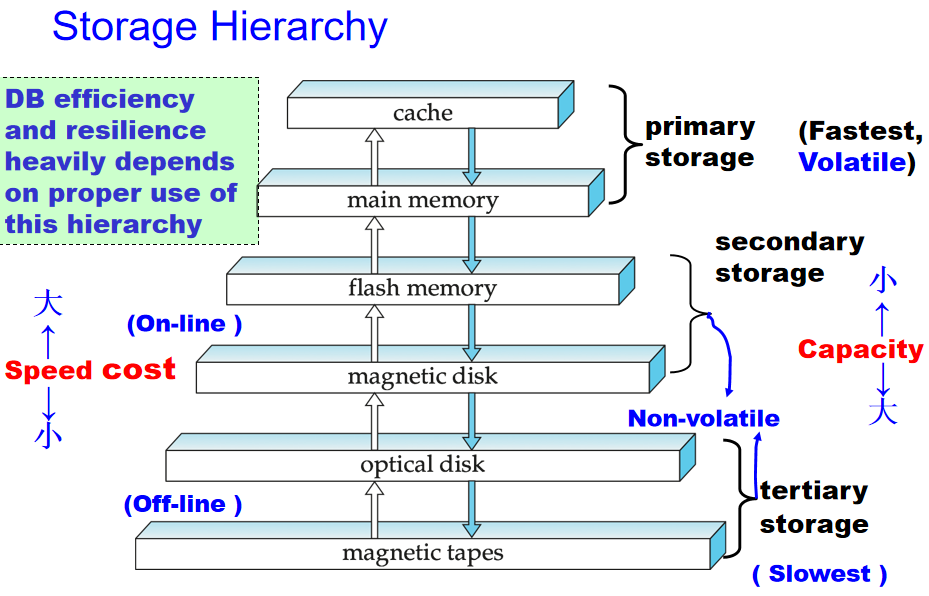
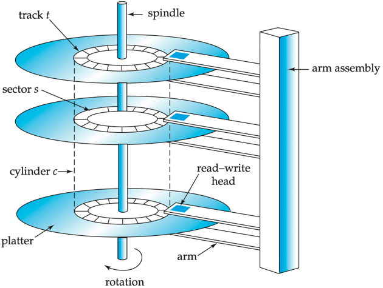
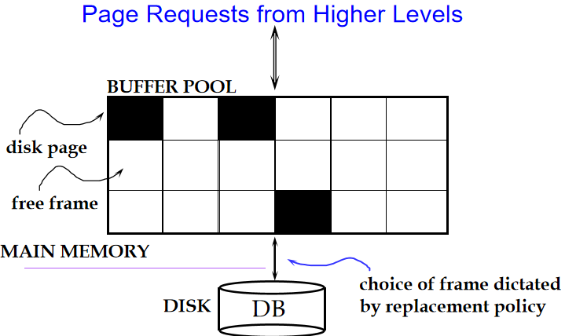
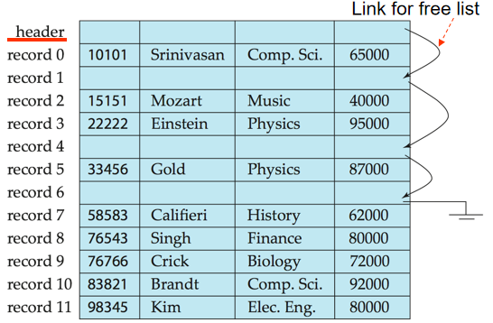
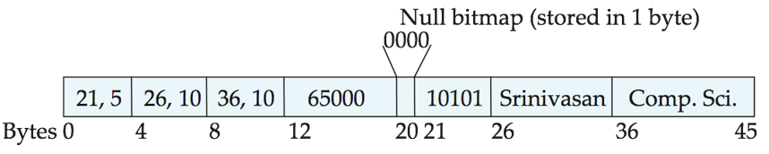
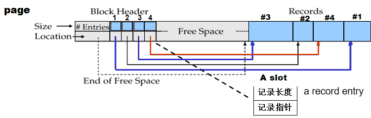
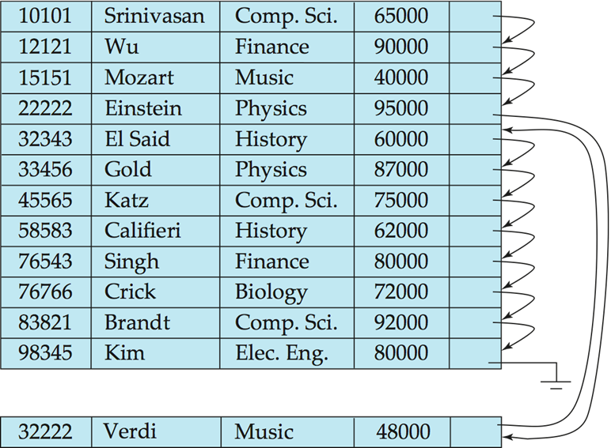
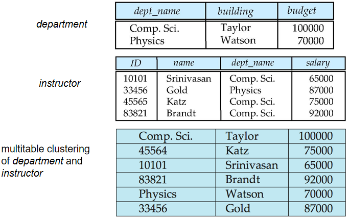
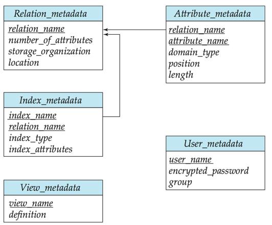

# Storage and File Structure

> 这一节中的许多内容都可以在[计组笔记](../COD/chap-6.md)中找到对应之处

## Overview of Physical Storage Media

在数据库的物理层面上，文件被保存在存储空间中（例如.mdf、.idf、.ora、.dbf 等）

不同的存储介质可以通过以下的标准进行区分：

- 数据的访问速度
- 存储每个单位数据的开销
- 可靠性
    - 在断电或系统崩溃等情况下的数据丢失
    - 存储设备发生了物理错误（使用 RAID）

Storages classified by *reliability*: 

- Volatile storage: 断电后内容会丢失, e.g., DDR2, SDR. 
- Non-volatile storage(非易失性存储器): 断电后内容会被保持
    - Includes secondary and tertiary storage, as well as batter-backed up main-memory. 

Storages classified by *speed*: 

- Cache 
- Main-memory 
- Flash memory
- Magnetic-disk 
- Optical storage 
- Tape storage

### Storage Hierarchy

<figure markdown="span">
    {width=75%}
</figure>

- **Primary storage**: Fastest media but volatile (cache, main memory). 
- **Secondary storage** (辅助存储器，联机存储器): next level in hierarchy, non-volatile, moderately fast access time 
    - Also called on-line storage 
    - E.g., flash memory, magnetic disks 
- **Tertiary storage** (三级存储器，脱机存储器): lowest level in hierarchy, non-volatile, slow access time 
    - also called off-line storage 
    - E.g., magnetic tape, optical storage 

### Physical Storage Media

**Cache**:

- **Fastest** and most **costly** form of storage, volatile, and  managed by the computer system hardware. 
- **Speed**: $\leqslant$ 0.5 nanoseconds (**ns** for short, 1 ns = $10^{–9}$ seconds);
- **size**: ~ KB ~ MB 

**Main memory**:

- **Fast access** (10 to 100 ns) 
- **Capacities**: Generally too small (or too expensive) to store the entire database 
    - Capacities of up to a few Gigabytes (1GB = $10^9$) widely used currently 
    - Capacities have gone up and per-byte costs have decreased steadily and rapidly (roughly factor of 2 every 2 to 3 years) 
- **Volatile**: contents of main memory are usually lost if a power failure or system crash occurs.

**Flash memory（快闪存储器，闪存）**:

- Also known as **EEPROM** (Electrically Erasable Programmable Read-Only Memory，电可擦可编程只读存储器) 
- **Non-volatile**: Data survives when power failure
- **Write/Erase**
    - 一个位置只能写入一次数据，但是可以擦除后覆写
    - 只支持有限次写入/擦除操作（$10^4$ to $10^5$ 次）
    - 擦除时只能一次擦除整个内存
- **Performance**: 
    - Reads are roughly as fast as main memory (< 100ns)
    - But writes are slow (~ 10µs), erase is slower
- **Cost**: per unit of storage roughly similar to main memory

**Magnetic-disk**:

- **Storage**: Data is stored on spinning disk, and read/written magnetically
- Primary medium for the long-term storage of data, typically stores entire database
- 要访问数据时必须把它从磁盘中转移到内存里，然后再写回到磁盘中。

    与内存相比访问速度非常非常慢（耗时可以达到 10 万倍）

- **Direct-access**: 可以按任意顺序直接访问磁盘上任意位置的数据

> 这些知识点感觉都好老...

## Magnetic Disks

<figure markdown="span">
    {width=55%}
</figure>

- 每个磁盘表面附近都有一个磁头，用于读取和写入数据（Read-write head）
    - 用于读/写磁性编码的数据
- 磁盘（platter）表面会被分为很多个轨道（track），例如超过 50K 个
- 每个轨道都会被分为很多个扇区（sector），例如 512 字节一个扇区
    - 扇区是进行数据读写的最小单位
    - 内层轨道可能有 500 到 1000 个扇区，外层轨道可能有 1000 到 2000 个扇区

要读/写扇区上的数据时

- 磁臂（disk arm）移动到正确的轨道上
- 盘片开始旋转，当对应扇区经过磁头时，磁头就可以读取或写入数据
- 有时会让多个盘片共享同一个旋转轴，然后让这些盘片对应的磁头装载在同一个磁臂上，以提高读写速度

磁盘控制器（disk controller）：计算机系统与磁盘驱动硬件之间的接口

- 接受来自于高层次的读/写扇区命令
- 负责执行相应操作，如把磁臂移动到正确的轨道上，然后读/写数据
- 计算校验和并把它附加到每个扇区上，以确保数据被正确读取
    - 如果数据被破坏，那么计算出的校验和大概率与原来的校验和不一致
- 坏扇区的重映射
    - 将该扇区从逻辑上映射到预留的物理扇区
    - 并且重映射被记录在磁盘或其他非易失性存储器中

### Performance

磁盘的访问时间（access time）是指从发出读/写命令到数据开始被传递的时间

Access time = seek time（寻道时间）+ rotational latency（旋转等待时间）

- Seek time：磁臂移动到正确的轨道所用的时间
- Rotational latency time：磁盘旋转到正确的扇区所用的时间
    - 平均来说，旋转等待时间是一次完整旋转耗时的 1/2
- Data-transfer rate（数据传输速率）：每秒钟可以传输多少字节的数据
    - 取决于计算机和磁盘之间的连接速度
- Mean time to failure (MTTF, 平均故障时间):
    - 指的是磁盘在发生故障之前的能连续工作的平均时间

### Optimization of Disk-Block Access

**Block**: 单个轨道上的连续扇区序列

- 数据在磁盘和主存之间传递以块为单位
- 大小从 512 字节到几千字节不等
    - 使用较小的块会导致更多的传输次数
    - 使用较大的块可能因为数据不连续而浪费空间

**Disk-arm-scheduling algorithms**(磁盘臂调度算法)

- 目标：对磁盘的访问次序进行优化，以最小化磁臂的移动次数
- Elevator algorithm (电梯算法):
    - 把磁臂不断向一个方向移动（从外圈向内圈移动，或反之），不断处理这个方向上的下一个请求
    - 直到这个方向上没有更多请求后，再改变磁盘移动方向重复上述过程

**File organization**

- 目标：将组织块的方式与访问数据的方式相对应，从而优化块的访问时间
- 例如把相关信息存储在同一个或相邻的柱面中
- 但随着数据的插入和删除，可能会导致空闲空间碎片化，导致新插入的数据被分散到各个位置，导致访问这些数据的时间变长
    - 可以利用一些磁盘整理工具来把这些数据重新组织到一起

**Nonvolatile write buffers（非易失性写缓冲区）**

- 作用：通过把块写入非易失性 RAM 缓冲区来加速磁盘写入操作
- Non-volatile RAM: 由电池供电的 RAM 或闪存
    - 即使断电后数据也能保留，在通电后把数据写入磁盘
- 在磁盘没有其他请求或者请求等待了一段时间后，控制器会把数据写回到磁盘中

**Log disk（日志磁盘）**

- 一个专门用于写入块的更新日志的磁盘
    - 由于不需要寻道，写入速度非常快
    - 也不需要特殊的硬件（如非易失性 RAM）
- 文件系统通常会对写磁盘操作进行重排列以提高性能
    - 文件日志系统会确保数据以安全顺序写进非易失性 RAM 或日志磁盘中
    - 如果没有使用日志，那么在系统崩溃后可能会导致数据不一致

## RAID

RAID 0-6 的内容和[计组笔记](../COD/chap-6.md#redundant-arrays-of-inexpensive-disks)中关于 RAID 的内容是一致的，这里就不记了。

!!! abstract "Choice of RAID Level "
    选择 RAID 级别时需要考虑以下几个方面：
    
    - 成本
    - 性能：每秒 I/O 操作的数量，以及进行正常操作时的带宽
    - 故障期间性能
    - 故障磁盘重建期间的性能：包括重建故障磁盘所需的时间

    关于使用何种 RAID 级别

    - RAID 0：仅在数据安全不那么重要时使用，例如可以从其他来源快速恢复数据
    - RAID 2 and 4：被 RAID 3 和 5 上位替代了，不使用
    - RAID 3：由于比特级条带化要求对单个块的读取都要访问所有的磁盘，因此性能较差（有不必要的磁臂移动），而块级条带化的 RAID 5 避免了这个问题，因此常选择 RAID 5
    - RAID 6：由于 RAID 1 和 RAID 5 已经提供了几乎所有应用场景下足够的安全性，很少被考虑使用
    
    因此被考虑使用的基本上只有 RAID 1 和 RAID 5。

    - RAID 1 提供的写入性能比 RAID 5 更好
        - RAID 5 再写入单个块时需要至少 2 次块读取和 2 次块写入的操作
        - RAID 1 则只需要 2 次块写入操作
    - RAID 1 的存储成本比 RAID 5 更大，
        - RAID 1 需要 2 倍的存储空间来存储数据
        - RAID 5 只需要 N+1 个磁盘来存储 N 个磁盘的数据
        - 但由于磁盘技术的快速发展，单位数据存储成本已经大幅下降，因此选择使用 RAID 1 的情况也并不少见

### Hardware Issues

- **Software RAID**: RAID 依赖于软件实现，不需要额外的硬件支持
- **Hardware RAID**: RAID 通过特殊的硬件实现
- **Latent failures**: 先前被成功写入的数据被损坏
- **Data scrubbing（数据清理）**：持续检测潜在错误，并在发现错误后从副本/校验中恢复数据
- **Hot swapping (热插拔)**: 在系统运行时就可更换磁盘，无需断电
- **spare disks（备用磁盘）**: 在其他磁盘发生故障时自动接管其工作

## Storage Access

数据库文件在逻辑上被划分为定长的存储单元，称为块（block）。块是数据存储分配和传输的基本单位。

- 主存会使用 buffer 来保存磁盘中的数据块，以此来加速数据的访问
- 数据库系统希望最小化磁盘与主存之间数据块的传输次数

<figure markdown="span">
    {width=65%}
</figure>

缓冲池（buffer pool）是主存中用于保存磁盘块的区域

- 缓冲池中保存着磁盘页（disk page），即上图中黑色方块
- 来自于更高层次的访问请求会被转换为对缓冲池的访问请求
- 数据必须处在 RAM 中才能被 DBMS 操作
- 会维护一个内容为 < frame#, page_id > 组成的对的表格

!!! note
    - Page: a unit of data
    - Block: a unit of disk space
    - Frame: a unit of buffer pool
    
    in practice, block $\approx$ page

### Buffer Manager

应用程序在它们需要一个磁盘中的块时，会调用缓冲池管理器（buffer manager）

- 如果这个块已经在 buffer 中了，那么这个程序会得到这个块在主存中的地址
- 如果这个块不在 buffer 中，那么缓冲池管理器会把它从磁盘中读入到 buffer 中
    - 缓冲池管理器会为这个新的块分配一个 frame
    - 如果缓冲池已经满了，那么缓冲池管理器会选择一个块进行替换
        - 选择的块会被写回到磁盘中（如果它被修改过）
        - 然后把新的块读入到这个 frame 中
    - 如果缓冲池中有空闲的 frame，那么就直接把新的块读入到这个 frame 中
    - 最后返回这个块在主存中的地址

!!! info "一些其他概念"
    - Pinned block（固定块）: 被锁定在缓冲池中的块，不能被替换。例如这个块正在被使用，不能被替换。
    - Toss-immediate strategy：当一个块被使用后，就立即把它从缓冲池中替换掉
    - 有些缓冲池中的页面会被多个事务使用，我们需要使用一个固定计数（pin count）记录使用这个页的事务数量，当 pin count 为 0 时，才可以替换这个页面

### Buffer-Replacement Policies

**LRU strategy** (Least Recently Used, 最近最少使用策略)

- 在重复扫描数据等访问模式中可能表现不佳
    - 例如我们要不断循环扫描 5 个 block，但是 buffer 里只能装 4 个 block
    - 这么一来刚刚被替换出去的 block 实际上就是我们马上就要用到的 block

**MRU strategy** (Most recently used, 最近最常用策略):

- 系统会固定正在处理的块，这个块处理完毕后就会被解锁（unpin），我们总是替换掉刚刚处理完的块
- 在特定的数据访问模式中有效

有时我们会使用一个混合的策略来替换块，把现有的替换策略与查询优化器提供的替换策略相结合。

## File Organization

数据库被存储为文件的集合（collection）

- 每个文件都由一系列记录（record）组成
- 每个记录都由一系列字段（field）组成
- 记录有两种类型：fixed-length record 和 variable-length record
    - fixed-length record: 每个字段的长度都是固定的，例如 4 字节
    - variable-length record: 每个字段的长度都是可变的，例如字符串类型的字段

### Fixed-Length Records

优势：一个很简单直观的存储方式

- 第 $i$ 条记录从第 $n \times (i-1)$ 个字节开始被存储，其中 $n$ 是每条记录的长度
- 对记录的访问很简单，但记录可能会跨块存储

在删除记录 $i$ 时有不同的处理方式：

1. 把第 $i+1,\ldots,n$ 条记录都向前移动一位到第 $i,\ldots,n-1$ 条记录的位置上
2. 把第 $n$ 条记录移到第 $i$ 条记录的位置上
3. 不移动任何其他记录，使用 free list（空闲列表）来记录所有空闲的记录位置

<figure markdown="span">
    {width=75%}
</figure>

!!! info "Free list"
    - 在文件头保存第一个被删除的（空闲的）记录的地址（也还有其他的信息）
    - 每一个空闲记录会记录下一个空闲记录的位置，从而形成一个列表
    - 好处在于能够更高效地利用空间，而不需要移动其他记录

### Variable-Length Records

文件中可能拥有多种不同类型的记录，因此需要使用不同的存储方式和不同的长度来存储这些记录

- 记录的各种属性按照顺序存储在一起
- 变长属性会使用固定大小来表示（offset，length），实际的数据会被保存在所有定长属性之后
- 空值（null value）会使用空值位图（null-value bitmap）来表示

<figure markdown="span">
    {width=70%}
</figure>

> 比如上图中的 (21, 5) 表示从第 21 个字节开始存储记录，长度为 5 个字节

#### Slotted Page Structure

<figure markdown="span">
    {width=80%}
</figure>

!!! info
    slotted page 是数据库中页的常见组织形式

    - 优点是可以存储可变长的 record
    - 其核心是通过 slot 数组中存储的偏移值来查找 page 中的某个 record 具体内容是什么。即可以通过 page 号和 slot 号就可以查询磁盘上任意一个 record 的内容。

slotted page 主要由三个部分组成

- header
- slot array
- 存储在 page 中的各个 record

Slotted page header 包含各种元数据：

- 记录条目的数量
- block 中空闲空间的结束位置
- 每个 record 的位置和大小

slot array 中的每个 slot 都包含着两个关键信息：记录长度与指向记录的指针

!!! note
    - 记录可以在 page 中移动，以保证记录之间没有空闲的空间（即页内没有碎片），在删除一个记录时会移动其他记录来保证这一性质
    - 记录的索引不会直接指向记录本身，而是会指向 header 中这个 record entry 对应的 slot（间接指针，先访问对应的 slot，再通过 slot 中的偏移量来访问记录内容）
        - 这样做的好处是当我们移动记录时，只需要更新对应 slot 中的偏移量，而不需要更新所有指向这个记录的指针

## Organization of Records in Files

当我们新插入一个记录时，需要知道插入到哪里，怎么插入。

- **Heap file (堆文件, 流水文件)**: a record can be placed anywhere in the file where there is space 

    有足够的空间就直接插入

- **Sequential file (顺序文件)**: store records in sequential order, based on the value of a search key of each record

    对所有的记录维护一个次序，按照次序插入新记录

- **Hashing file (散列文件)**: a hash function computed on some attribute of each record; the result specifies in which block of the file the record should be placed 

    根据记录内容计算哈希值，然后找到对应的位置插入

- **Clustering file organization (聚集文件组织)**: records of several different relations can be stored in the same file 

    动机来自于把相关的记录保存在同一个块中，以最小化 I/O 操作

### Sequential File Organization

适用于需要对整个文件进行顺序处理的应用程序，文件中的记录会按照搜索键（search key）排序。

- **Deletion**: use pointer chains
- **Insertion**: locate the position where the record is to be inserted
    - 如果有空闲位置，就把新数据插入到那里
    - 如果没有，那么就把新记录插入到 overflow block 中
    - 两种情况都需要更新 pointer chain
- 需要定期对文件进行重新排序来保持次序

<figure markdown="span">
    {width=65%}
</figure>

### Multitable Clustering File Organization

Store several relations in one file using a multitable clustering file organization

!!! example
    例如对于“老师”和“部门”这两个常常一起访问的 table，我们可以把它们放在一起。但这么做的缺点在于，如果我们只想要访问它们其中之一，就必须把整个文件都读入到内存中，造成不必要的 I/O 操作。

    <figure markdown="span">
        {width=75%}
    </figure>

## Data-Dictionary Storage

**Data dictionary** (also called system **catalog**) stores metadata: 

元数据（matadata）也是数据，它记录了整个数据库的结构、内容、存储方式等信息，我们也要把它们保存下来

- Information about relations
- User and accounting information, including passwords
- Statistical and descriptive data
- Physical file organization information
- Information about indices

<figure markdown="span">
    {width=75%}
</figure>
