# Indexing and Hashing

## Basic Concepts

索引是数据库系统用来加速目标数据的一种机制。索引文件通常由如下的结构构成（称为 index entry，索引项）：

<figure markdown="span">
    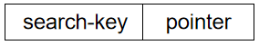{width=65%}
</figure>

- Search Key：索引项的关键字，通常是表中某一个或某几个属性的值。
- Pointer：指向数据文件中记录的指针

索引文件中的索引该如何组织取决于索引的类型。索引的类型有：

- Ordered indices (顺序索引): 
    
    search keys (index entries) are stored in sorted order

- Hash indices (哈希索引): 

    search keys (index entries) are distributed uniformly across "buckets" using a "hash function"

## Ordered Indices

在有序索引中，索引项按照搜索键的值顺序存储。

- **顺序排序文件**（sequentially ordered file）: 记录按照搜索键的顺序存储在文件中。
- **主索引**（primary index）: 搜索键等于顺序排序文件的搜索键的索引。换句话说，与对应的数据文件本身的排列顺序相同的索引称为主索引。
    - 也称为 clustering index（聚集索引）
    - 主索引的搜索键通常是主码，但并非一定是主码。
    - **索引顺序文件**（index-sequential file）: 带有主索引的顺序排序文件
- **辅助索引**（secondary index）: 搜索键不等于顺序排序文件的搜索键的索引。
    - 也称为 non-clustering index（非聚集索引）

### Dense Index

稠密索引（dense index）：文件中每一个搜索键的值都有一个对应的索引项。

!!! example
    例如 ID 就是常见的稠密索引。

    <figure markdown="span">
        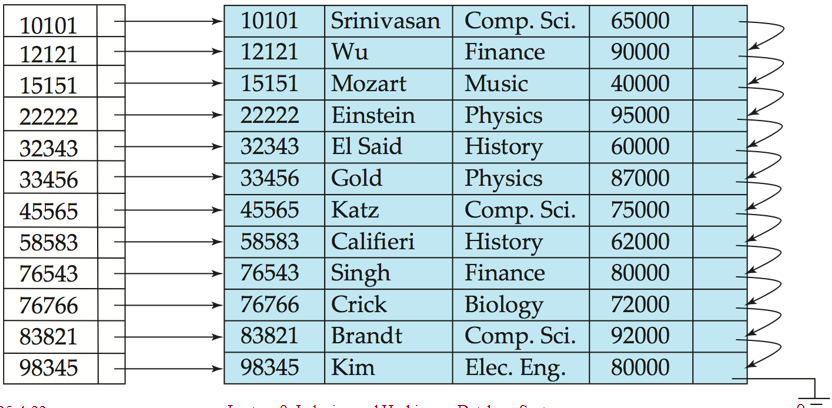{width=65%}
    </figure>

### Sparse Index

稀疏索引（sparse index）：文件中只有部分搜索键的值有索引项。

通常来说，一个数据块对应一个索引项，一个块中包含多个有序的数据记录。

> 稀疏索引仅适用于数据文件记录按照搜索键进行顺序排列的情况。

要定位搜索键值为 K 的记录，可以按照如下的搜索方法

1. 找到带有搜索键值小于 K 的最大的索引项
2. 从这个索引指向的记录开始，按顺序依次查找

!!! example
    <figure markdown="span">
        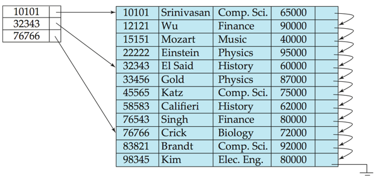{width=65%}
    </figure>

    当我们想要寻找 ID 为 76543 的记录时，我们可以先找到索引项 32343，然后从数据项 32343 开始向后顺序查找，直到找到 76543。

!!! note 
    相对于稠密索引，稀疏索引的特点是：

    - 所需空间更少，插入和删除的开销更小
    - 定位记录的速度比稠密索引更慢

    Sparse index 只能用于顺序文件, 而 dense index 可以用于顺序和非顺序文件，如构成索引无序文件。

### Secondary Index

我们常需要查找某个字段中满足特定条件的所有记录，而这个字段并不是主索引的搜索键。

- 例如在按账户号码排序的账户数据库中，我们可能希望找到所有存款额在某个特定范围内的账户。
- 这时我们可以为每个搜索键值创建一个辅助索引项，这个索引项指向包含着所有满足条件的记录的 bucket

<figure markdown="span">
    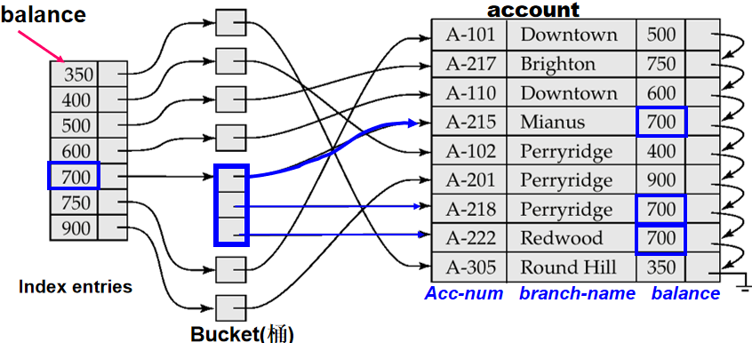{width=65%}
</figure>

!!! tip
    - 辅助索引不能使用稀疏索引，并且每条记录都必须被某个指针指向
    - search-key 中常常会存在重复项，例如上图中的 700，而 index entry 中是不能有重复的，为此我们会采用 bucket 的结构来存储这些重复项。

### Multilevel Index

当一个主索引过大时，直接访问它就会变得十分昂贵

- 例如 1,000,000 条记录 / 每块 10 条记录 = 100,000 块 = 100,000 个索引项（稀疏索引项的数量）

    如果索引文件中每个数据块能包含 100 个索引项，那么我们就需要大小为 1000 块的稀疏索引文件。

- 即使使用二分查找，我们也需要 $\log_2(1000) \approx 9$ 次 I/O 操作才能找到目标索引项。

为了减少读取索引而导致的读盘读取操作数，我们可以把磁盘上的主索引也看做一个文件，为它建立一个稀疏索引。

- Outer index –  a sparse index of primary index
- Inner index –  the primary index file

在这种情况下，如果外层索引仍然过大，我们可以再给它建立一个稀疏索引。同理可以推导到更多层的索引，这样就建立了一个多级索引（multilevel index）。

- 这样多层的索引就构成了一个树形结构
- 在对文件进行插入或删除时，所有层次上的索引都必须更新

<figure markdown="span">
    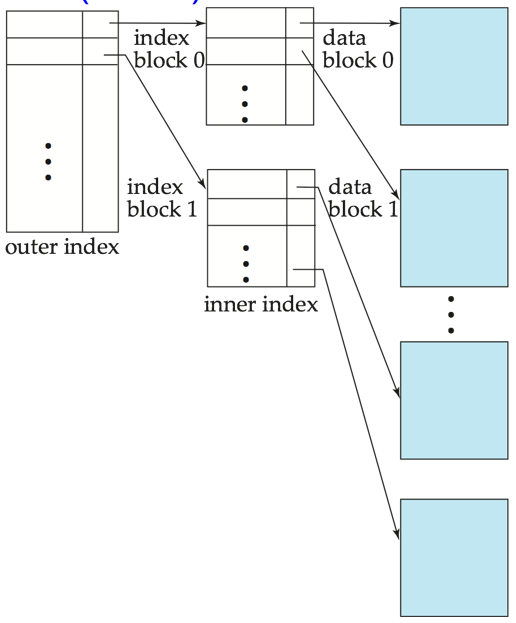{width=55%}
</figure>

??? info "多级索引技术可应用于聚集索引和非聚集索引"
    <figure markdown="span">
        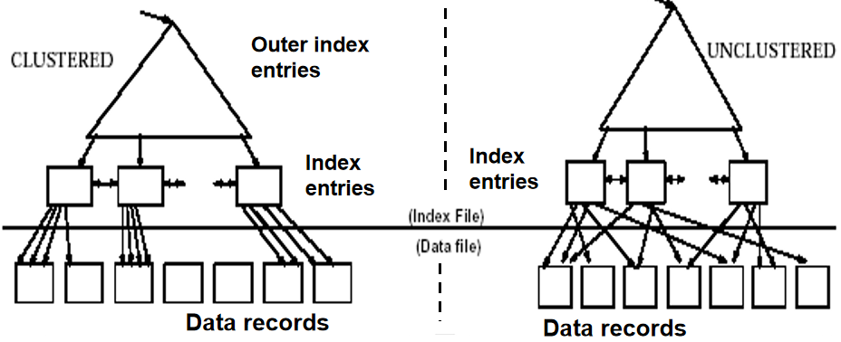{width=75%}
    </figure>

### Index Deletion

删除数据库中的记录时，索引项也需要进行相应的更新。

1. 系统在数据文件中找到对应的记录，然后删除它
2. 更新索引文件

**情况 1：稠密索引**

- 如果被删除的记录是唯一具有这个特定搜索键值的记录，那么就把对应的索引项也删除掉。（单记录, 即 search-key 有唯一性）
- 否则（该索引项指向多条记录，即 search-key 无唯一性）
    - （使用辅助索引）如果有多条指针指向这些有相同 search key 的记录，那么就从索引项中删除指向被删除的记录的指针
    - （使用主索引）如果被删除的的记录是指针指向的第一条记录，就把指针指向下一条记录
        - 否则就不需要对索引进行任何修改

**情况 2：稀疏索引**

- 如果被删除的记录的搜索键值没有出现在索引中，就不需要对索引做任何操作
- 否则，如果索引文件中存在这个搜索键值的索引项，就用数据文件中的下一个搜索键值来替换它
    - 如果下一个搜索键值已经有索引项了，那就直接把被删除的记录对应的索引项删掉

!!! tip
    对于多级索引，我们可以由底层逐级向上层扩展，每一层的处理过程与上述单层索引的两种情况类似。

### Index Insertion

我们首先要利用索引找到插入位置，在数据文件中插入记录，然后分别根据情况来修改索引。单级索引的操作如下：

**稠密索引**：每个数据项都有对应的索引项

- 如果新插入的记录的搜索键值在索引中不存在，则新增一个索引项，它包含这个 search-key 和指向新记录的指针
- 如果新记录的 search-key 已经存在于索引中
    - 如果索引项可以使用多条指针，那么就在索引项中新增一条指向新记录的指针
    - 否则，就不需要对索引项做任何操作

**稀疏索引**：每个块都有一个对应的索引项

- 如果有一个新的块被创建，那么就把新块中第一个出现的搜索键值插入到索引中
- 如果新记录在它所在的块中拥有最小的搜索键值，那么就更新索引项
- 否则，就不需要对索引进行修改

!!! tip
    多级索引的插入操作相当于在单级索引的基础上继续进行拓展：从底层向上层扩展，每一层的处理过程与上述单层索引的两种情况类似。

## B+ Tree Index Files

> 数据库这门课中的 B+ 树与 ADS 中所学的 B+ 树有所不同，需要注意区分。

### Structure

!!! property "B+ 树索引"
    **顺序索引文件的缺点：**

    - 随着文件增大，由于会创建许多溢出块，性能会下降
    - 需要定期重组整个文件以保持性能

    **B+ 树索引的优点：**

    - 在插入和删除时，文件会自动通过较小的、局部的改变来重组索引结构
    - 不需要对整个索引文件进行重组来保持性能

    **B+ 树索引的缺点：**

    - 插入和删除需要一些额外开销，需要更多的空间

    但总体而言，B+ 树索引的优点远大于缺点，因此被广泛运用

!!! definition "B+ 树"
    B+ 树是满足以下条件的根树（rooted tree）：

    - 从根节点到所有叶节点的路径长度相同（平衡树）
    - 每个不是根或叶的节点都有 $\lceil \frac{n}{2} \rceil$ 到 $n$ 个子节点（$n$ 为节点的阶数）
    - 叶节点有 $\lceil \frac{n-1}{2} \rceil$ 到 $n-1$ 个键值

    特殊情况：

    - 如果根节点不是叶节点，那么它至少有两个子节点
    - 如果根节点是叶节点（即树中只有一个节点），那么它有 $0$ 到 $n-1$ 个键值

??? example 
    <figure markdown="span">
        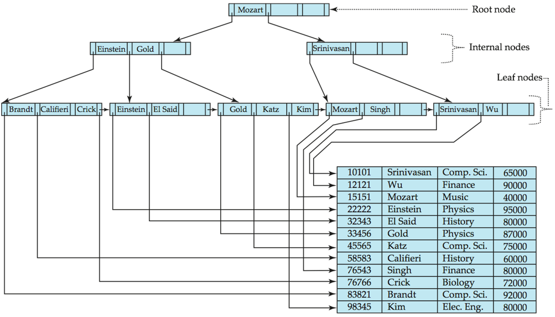{width=75%}
    </figure>

#### Node Structure

<figure markdown="span">
    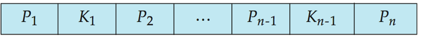{width=75%}
</figure>

B+ 树的节点通常可以表示为上图中的形式：

- $K_i$ 是搜索键的值
- $P_i$ 是指向子节点的指针（非叶子节点）或者指向记录或 bucket 的指针（叶子节点）
    - 叶子节点的最右侧指针 $P_n$ 指向下一个叶子节点

假设没有重复的搜索键值，那么就有下面的关系：

$$ K_1 < K_2 < ... < K_{n-1} $$

我们可以把 B+ 树的节点表示分为两类：叶子节点和非叶子节点

!!! property "叶子节点"
    - 对于 $i = 1, 2, ..., n-1$，$P_i$ 要么指向搜索键值为 $K_i$ 的记录，要么指向一个装有指针的 bucket，bucket 里面的每个指针所指向的记录都有相同的搜索键值 $K_i$。
        - 只有当搜索键不构成主键时我们才需要指针桶，例如稠密索引的每个搜索键都出现在叶子节点中。
    - 如果 $L_i, L_j$ 是两个叶子节点并且 $i < j$，那么 $L_i$ 的所有搜索键值都小于 $L_j$ 的搜索键值。
        - 具体来说，叶节点间的 search-key 不重叠, 且所有左节点中的 search-key 值一定小于右节点中的 search-key 值。
    - 每个叶子节点所具有的搜索键数量必须在 $\lceil \frac{m-1}{2} \rceil$ 到 $m-1$ 之间。
        - 例如 $m=5$ 时，叶子节点中搜索键的数量可以是 2, 3 或 4。
    - $P_n$ 会指向按 search-key 排序的下一个叶子节点，这便于我们对文件的顺序处理。

!!! property "非叶子节点"
    - 指针（子树）的数量在 $\lceil \frac{m}{2} \rceil$ 到 $m$ 之间。我们定义扇出数（fanout）为节点中指针的数量。
    - 非叶子结点在叶子节点上形成了一个多级的稀疏索引，对于拥有 $n$ 个指针的非叶子结点而言：
        - $P_1$ 所指的子树中的所有 search-keys 皆小于 $K_1$
        - 对于 $2 \leqslant i \leqslant n-1$，$P_i$ 所指的子树中的所有 search-keys 皆大于等于 $K_{i-1}$ 且小于 $K_i$ （即 $K_{i-1} \leqslant keys < K_i$）
        - $P_n$ 所指的子树中的所有 search-keys 皆大于等于 $K_{n-1}$

我们可以观察到 B+ 树的一些其他特点：

- 由于 B+ 树的内部结点是通过指针进行连接的，“逻辑上”相近的结点不需要在“物理上”也相近
- B+ 树的非叶节点构成了多层的稀疏索引
- B+ 树包含的层级数量相对较少（与主文件的大小成对数关系），因此可以高效地搜索
- 对主文件的插入和删除可以高效地处理，对索引的重构也可以在对数时间内完成

### Queries（Search）

查询 B+ 树中某个搜索键值 $V$ 的过程如下：

```
C=root
While C is not a leaf node {
    Let i be least value s.t. V ≤ K_i.
    If no such exists, set C = last non-null pointer in C 
    Else { 
        if ( V = K_i ) Set C = P_{i+1}  
        else set C = P_i
    }
}
Let i be least value s.t. Ki = V
If there is such a value i, follow pointer Pi to the desired record.
Else no record with search-key value k exists.
```

- 从根节点开始，在每一层中找到第一个大于等于 $V$ 的搜索键值
    - 如果找到了，就进入对应的子节点
    - 否则进入最后一个非空指针所指向的子节点
- 按上述方法逐层向下寻找，直到到达相应的叶子节点
    - 如果在叶子节点中找到了与 $V$ 相等的搜索键值，就根据对应的指针访问相应的记录
    - 否则就说明没有搜索键值与 $V$ 相同的记录

对于有重复的搜索键值

- 在叶节点和中间节点中，我们不能严格保证 $K_1 < K_2 < ... < K_{n-1}$，但我们可以保证 $K_1 \leqslant K_2 \leqslant ... \leqslant K_{n-1}$。
- $P_i$ 指向的子树中的 search-key 值都 $\leqslant K_i$，但未必 $< K_i$。
- 我们需要对上述的查询算法进行一些修改：
    - 即使当 $V = K_i$ 时，我们也需要继续遍历 $P_i$ 所指向的子树
    - 当我们到达一个叶子节点 $C$ 时，我们要检查 $C$ 中的搜索键值是否都小于 $V$
    - 如果是，那就去 $C$ 的右兄弟节点中继续查找

!!! note 
    - 如果文件中有 $K$ 个搜索键值，那么 B+ 树的高度不会超过 $\lceil \log_{\lceil n/2 \rceil} (K) \rceil$。
        - 例如有一百万个搜索键值，且 $n=100$，那么树就有 $\lceil \log_{50} (1000000) \rceil = 4$ 层，即我们只需要 4 次访问磁盘的操作（访问 4 次节点，假设每个节点都保存在磁盘中）。
        - 与之相比，如果使用二叉树，那么我们就需要访问 20 次节点，耗时的差异是非常显著的。
    - 结点的大小通常与磁盘块相同，一般是 4KB

### Insertion

1. 找到搜索键值 $V$ 应该插入的叶子节点的位置
2. 检查这个搜索键值是否已经存在
    - 如果已经存在
        - 直接把新记录添加到文件中
        - 如果需要，就向 bucket 中添加新的指针
    - 如果不存在
        - 向主文件中添加记录（如果需要的话，还要创建一个新的 bucket）
        - 如果叶子节点中还有空间，就把 {搜索键值，指针} 这个索引项插入到叶子节点中
        - 否则就在插入新条目后把叶子节点分裂，以保证 B+ 树的性质
3. 分裂叶子节点
    - 将叶子节点中的 $n$ 个 {搜索键值，指针} 对（包括新插入的对）按照顺序排列
    - 把前 $\lceil n/2 \rceil$ 个 {搜索键值，指针} 对放在原来的叶子节点中，剩下的放在新的叶子节点中
    - 假设新的节点为 $p$，$k$ 为 $p$ 中最小的键值，在被分裂的节点的父节点中插入 $\{k，p\}$（即更新上层节点）
    - 如果此时父节点已满，那么再把父节点分裂，以此类推向上传播
4. 向上传播
    - 分裂的过程会不断向上传播，直到遇见一个未满的节点为止
    - 在最坏的情况中，根节点会被分裂，这会导致树的高度增加 1

??? example "Example of B+ Tree Insertion"
    <figure markdown="span">
        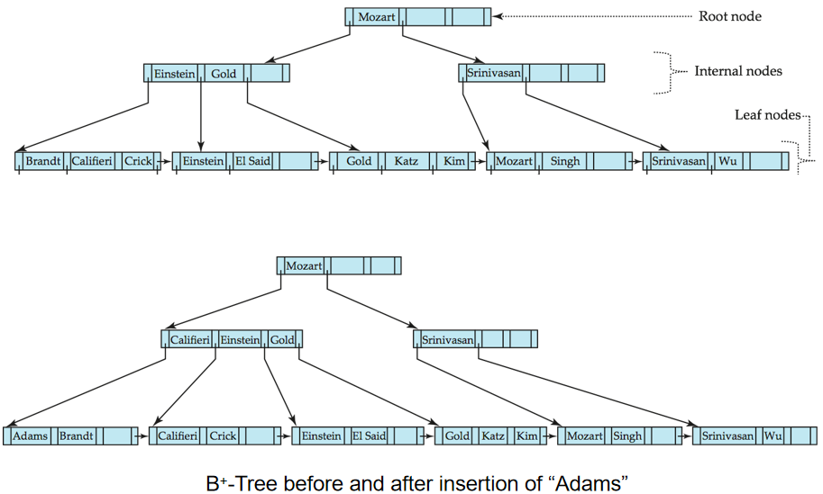{width=75%}
    </figure>

    <figure markdown="span">
        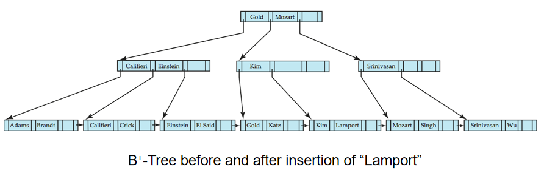{width=75%}
    </figure>

### Deletion

1. 找到要删除的记录
    - 把记录从主文件中删除
    - 如果它在 bucket 里，那么就把它从 bucket 中删除
2. 从叶节点中删除数据 
    - 如果没有 bucket 或者 bucket 是空的，就把 {搜索键值，指针} 对从叶子节点中删除
3. 合并节点
    - 如果由于删除而导致节点的 entry 数量过少，并且该节点与它兄弟节点的 entry 可以合并为一个节点，那么就需要把这个节点与它的兄弟合并：
        - 把两个节点中所有的搜索键值都转移到一个节点中（通常是左侧节点），然后删除另一个节点
        - 从父节点中删除 {$K_{i-1}$，$P_i$} 对，其中 $P_i$ 是指向被删除的节点的指针，递归地向上执行这个过程
4. 重新分配指针
    - 如果由于删除而导致节点的 entry 数量过少，但该节点与它兄弟节点的 entry 不能合并为一个节点，那么对指针的内容进行重新分配：
        - 该节点和兄弟节点之间的指针需要重新分配，使得两者都具有高于最小 entry 数的指针数量
        - 更新父结点中相应的搜索键值
5. 级联删除
    - 删除操作导致的节点合并可能需要向上级联传播，直到遇见一个有 $\lceil n/2 \rceil$ 个或更多个指针的节点为止
6. 删除根节点
    - 如果在删除与合并操作后，根节点只有一个指针（根节点只有一个子节点），那么就把原来的根节点删除，唯一的子节点成为新的根节点，树的高度减少 1

??? example "Example of B+ Tree Insertion"
    <figure markdown="span">
        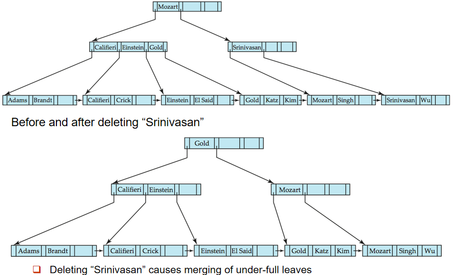{width=75%}
    </figure>

    删除 "Srinivasan"后，首先合并节点，然后发现合并后的父节点此时只有一个子结点，于是父结点从左边的兄弟那里取了一个叶结点过来。这个过程中包括根节点在内的多个节点的 key 都发生了变化

    <figure markdown="span">
        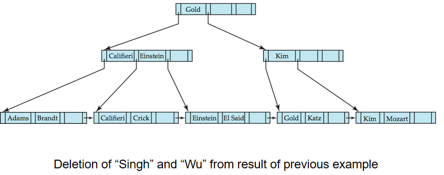{width=75%}
    </figure>

    当我们把 "Singh" 和 "Wu" 都删除之后，"Kim" 就会转移到右边的叶子节点中，相当于最右边的叶子节点从它的左兄弟那里借了一个值过来。并且他们的父节点的搜索键值也会进行相应的更新。

### B Tree Index Files

- B 树和 B+ 树很类似，但 B 树只允许一个搜索键值出现一次，从而实现消除搜索键的冗余存储。
- B 树的非叶子节点的搜索键不会出现在其他节点中
    - 也就是说 B 树不仅使用叶子节点来存储数据，还使用非叶子结点来存储数据
    - 因此非叶子结点也需要一些额外的指针字段，这些指针指向对应的记录或 bucket

!!! tip
    - B+ 树仅使用叶子节点来存储数据，非叶子节点仅用于索引
    - B 树使用非叶子节点来存储数据，非叶子节点在用于索引的同时也用于存储数据

    <figure markdown="span">
        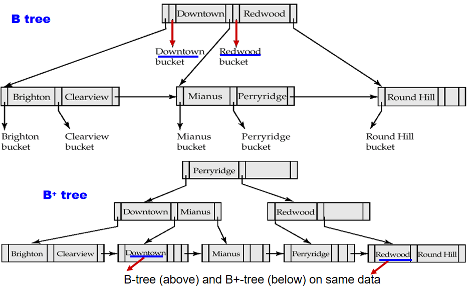{width=65%}
    </figure>

**B 树索引的优点：**

- 相对于 B+ 树而言，使用更少的节点（因为不会重复存储搜索键值）
- 有时候可以在到达叶结点之前就找到想要的搜索键值

**B 树索引的缺点：**

- 只有一小部分的搜索键值可以提前找到
- 非叶子结点会更大，因此扇出数（fan-out）会更小，树的高度会比 B+ 树更大
- 插入和删除操作比 B+ 树更复杂
- 实现起来比 B+ 树更困难

通常而言，B 树劣大于优，B+ 树更常用。

## Static Hashing

静态哈希是文件的一种组织方法，它使用一个哈希函数把搜索键值映射到一个桶中。静态的意思是桶的数量在创建时就已经固定了，后续不会再变化。

- 桶是包含一个或多个记录的存储单位，通常一个桶对应一个磁盘块
- 我们可以直接使用哈希函数来从记录的搜索键值找到对应的桶
    - 哈希函数 $h$ 会把搜索键值 $K$ 映射到对应的桶的地址 $B$，即 $B = h(K)$
- 不同的搜索键值可能会映射到同一个桶，这时候就需要顺序搜索整个桶中的记录

!!! example
    <figure markdown="span">
        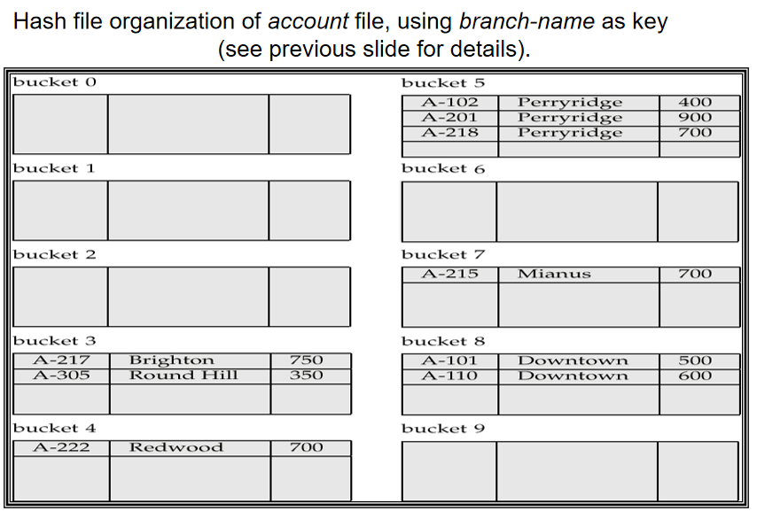{width=65%}
    </figure>

### Bucket Overflows

桶溢出可能是因为：

- 桶的数量不足
- 记录分布不均匀，可能由以下原因导致
    - 多个记录拥有相同的搜索键值
    - 哈希函数的设计不合理，产生了非均匀的键值分布

尽管我们可以通过各种优化方式来减少桶溢出的概率，但我们总是无法消除这个问题。为了处理这个问题，我们可以使用溢出桶（overflow bucket）来存储溢出的记录。

- 溢出桶是用于存放溢出记录的桶，通常以链表的形式存储

<figure markdown="span">
    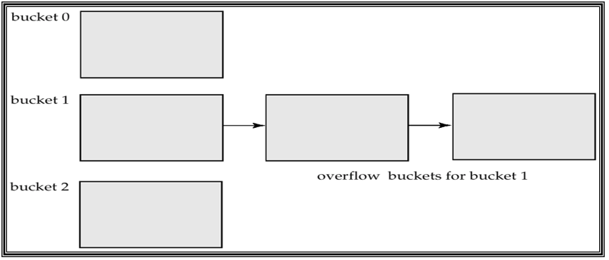{width=60%}
</figure>

### Hash Index

- 哈希不仅可以用于文件组织，也可以用于索引结构的创建。哈希索引会把搜索键和对应的记录指针一起组织到一个哈希文件结构中。
- 严格来说，哈希索引总是作为辅助索引出现
    - 如果文件本身就是通过哈希组织起来的，那么使用与之独立且搜索键相同的主哈希索引就是没有必要的。
    - 但通常来说，术语“哈希索引”既可以代指辅助哈希索引，也可以表示用哈希组织的文件结构。
- 哈希索引也有自己的劣势
    - 哈希索引只能用于 equality search（等值查询），而不能用于 range search（范围查询）
    - 如果分配的桶数量不足，那么很容易导致桶溢出问题
    - 如果为了为了未来的预期而使用更多的桶，那么在最开始时就会浪费大量的空间

<figure markdown="span">
    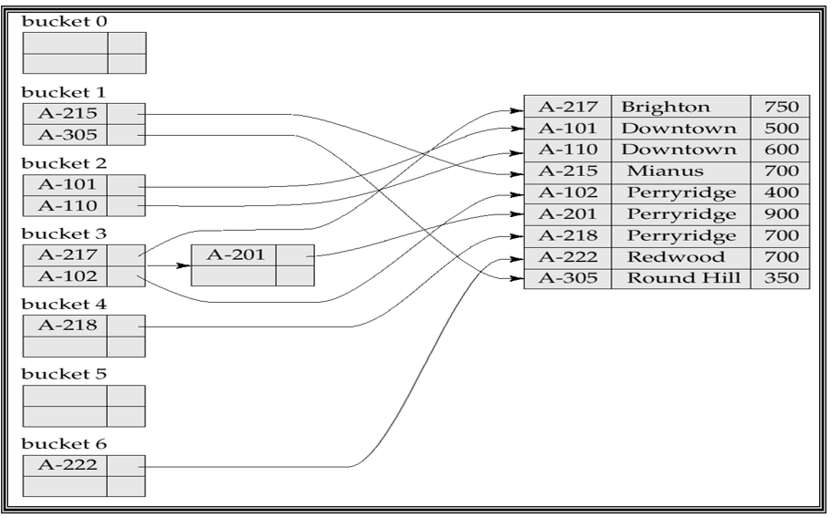{width=60%}
</figure>

## Dynamic Hashing

动态哈希是对静态哈希的改进，它允许在数据量增大时动态地调整桶的数量，并且保证哈希值的均匀分布，从而避免冲突过多或空间浪费。

常见的动态哈希方法包括扩展哈希（extendible hashing）和线性哈希（linear hashing）。

- 扩展哈希
    - 一种基于目录（Directory）的动态哈希方法
    - 每个桶（Bucket）可以容纳多个元素，当桶溢出时，目录会扩展，桶会被分裂
    - 目录本身是可扩展的，当哈希表的负载因子过大时，扩展目录的大小，并将数据重新分配到新的桶中
- 线性哈希
    - 一种基于线性扩展的动态哈希方法
    - 线性哈希表会在每次插入时检查负载因子，并在达到阈值时扩展哈希表的大小
    - 每次只分裂一个桶，随着数据量的增加，表会逐渐扩大，避免了一次性重新计算所有哈希值的开销

### Extendable hashing

在拓展哈希中，哈希函数会生成一个大范围的数值，通常是有 $b$ 位的整数，其中 $b = 32$。

- 我们总是只使用这个数值的前 $i$ 位来作为桶的地址，$0 \leqslant i \leqslant 32$。$i$ 是一个动态变化的值，随着数据量的增加而增加。（$i$ 称为全局深度）
- 桶地址表的大小为 $2^i$，最开始时 $i=0$，只有一个桶。（在这里，$b$ 表示的是哈希值的位数，$2^b$ 表示桶地址表的大小的上限）
- 当数据库增大时，$i$ 会随之增大，从而可以容纳更多的条目。
    - 由于多个 entry 可能处于同一个桶中，因此实际使用到的桶的数量会小于 $2^i$。
- 每个桶 $j$ 都对应一个值 $i_j$（称为局部深度），桶里所有 entry 对应的哈希值的前 $i_j$ 位都与桶 $j$ 的地址相同。

<figure markdown="span">
    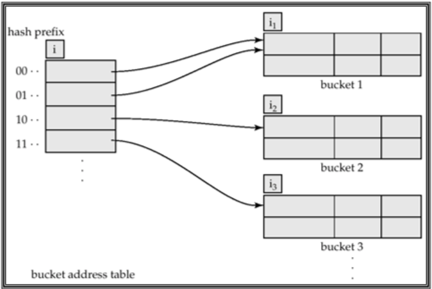{width=60%}
</figure>

如果我们想要**查询**一个搜索键值为 $K_j$ 的记录：

1. 计算哈希值 $h(K_j) = X$（比如结果是一个二进制数字）
2. 使用 $X$ 的前 $i$ 位作为桶地址表的索引，根据表中的指针找到对应的桶

如果我们想要一个**插入**键值为 $K_j$ 的记录

1. 按上面的步骤找到对应的桶 $j$
2. 如果桶 $j$ 中有足够空间，就把记录插入桶中
3. 如果空间不足，就必须把桶分裂并重新尝试插入
    - 在某些情况下我们也可以采用溢出桶

**插入**搜索键值为 $K_j$ 的记录时，我们可能需要**分裂桶** $j$，分裂的步骤如下：

- 如果 $i > i_j$（此时桶地址表中有多个指针指向 $j$）
    - 分配一个新的桶 $z$，把桶 $j$ 的局部深度 $i'_j$ 和新桶 $z$ 的局部深度 $i_z$ 都设置为 $i_j + 1$
    - 把桶地址表中指向 $j$ 的后半部分 entry 改为指向 $z$（根据第 $i'_j$ 位的值来决定它们放在 $j$ 还是 $z$ 中）
    - 把桶 $j$ 中的所有记录移除，把它们重新插入（让这些记录分配到 $j$ 或 $z$ 中）
    - 此时再重新计算需要插入的数据项 $K_j$ 对应的桶，并插入（如果此时它对应的桶还是满的，就需要再次分裂）
- 如果 $i = i_j$（此时桶地址表中只有一个指针指向 $j$）
    - $i$ 递增 1，并把桶地址表的大小翻倍
    - 把表中的每一个 entry 替换为两个指向同一个桶的 entry
    - 重新计算 $K_j$ 的桶地址表条目，现在就变为了 $i > i_j$ 的情况
- 如果在分裂桶时，发现 $i_j = i = b$（桶地址表大小即已经达到上限），那么就可以开始创建溢出桶而非进一步扩大桶地址表的大小

当我们想要**删除**一个值时

- 定位这个记录，并把它从桶中移除
- 如果此时桶变空了，那么就可以把这个桶删除（并且对桶地址表进行适当的更新）
- 也可以把桶进行合并
    - 仅当两个桶的局部深度 $i_j$ 相同，并且它们哈希值的前 $i_j - 1$ 位也都相同时才可以合并
- 必要时也可以把桶地址表的大小缩小
    - 但减小桶地址表的大小是一个昂贵的操作，仅当桶的数目远小于桶地址表的大小时才需要这么做

!!! tip
    光是看上面的描述可能会云里雾里，因此我们可以结合下面这个具体的例子来看。👇

???+ example
    <figure markdown="span">
        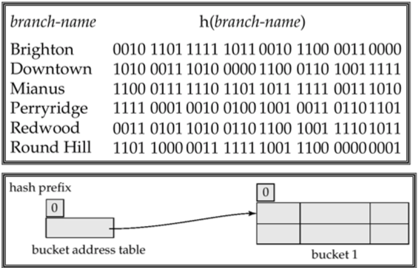{width=65%}
    </figure>

    我们使用 branch-name 来计算哈希值，每个桶的容量为 2。最开始时 $i=0$，只有一个桶。

    <figure markdown="span">
        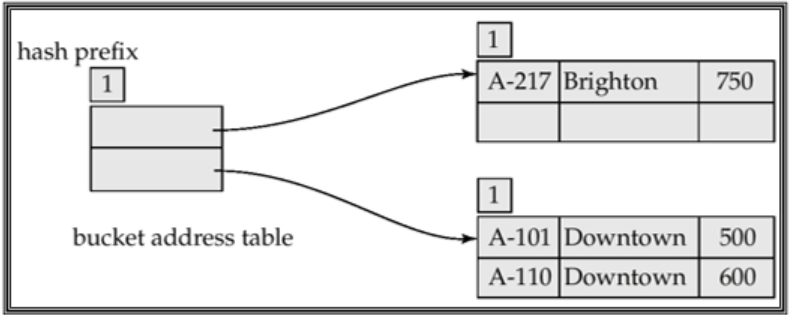{width=65%}
    </figure>

    插入了一个 Brighton 和两个 Downtown 之后，桶地址表扩大了，哈希结构变成了如上图所示的情况

    - 使用两个桶，两个桶的局部深度都是 1，表示他们根据哈希值的首位是 0 还是 1 来决定记录存储到哪个桶中

    <figure markdown="span">
        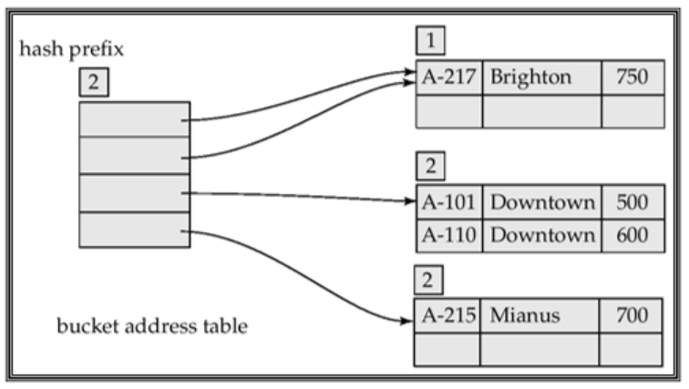{width=65%}
    </figure>

    插入一条 Mianus 记录

    - 由于 Downtown 和 Mianus 的哈希值的第一位都是 1，都属于同一个桶，但是现在这个桶已经满了，无法插入，因此需要分裂
    - 分裂后，他们的局部深度现在都是 2，即使用哈希值的前两位来判断记录应当归属于哪一个桶
    - 这次操作后，需要把桶地址表的大小翻倍（$i$ 递增 1），此时桶地址表中会有两个条目指向 Brighton 所在的桶

    <figure markdown="span">
        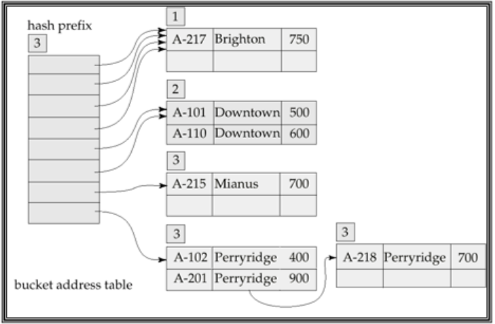{width=65%}
    </figure>

    再插入三个 Perryridge 记录之后，又发生了桶分裂，$i$ 变为了 3
    
    - 我们发现一个桶无法装下三个 Perryridge 记录，而它们的哈希值始终相同，再怎么扩大桶地址表也无济于事，此时我们就要开始使用溢出桶
    - 现在就有四个条目指向 Brighton，两个条目指向 Downtown，一个条目指向 Mianus，一个条目指向 Perryridge

    <figure markdown="span">
        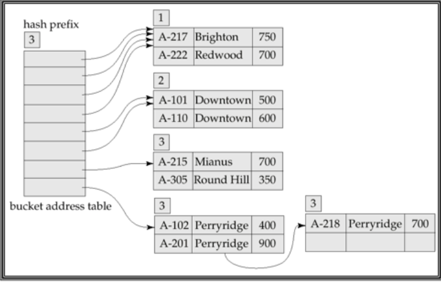{width=65%}
    </figure>

    最后我们再插入记录 Redwood 和 Round Hill，这两次插入都不需要分裂桶，因此桶地址表中的指针不需要进行任何改变

!!! summary "Comparison of Ordered Indexing and Hashing"
    在选择索引方式时，我们需要考虑以下几个因素：

    - 周期性重组文件结构的开销
        - 有时候我们需要定期重组索引以保证索引的高效性
    - 插入和删除的相对频率
        - 如果插入和删除的频率较高，那么我们需要选择一个插入和删除更高效的索引方式
    - 权衡平均访问时间和最坏访问时间
    - 预期的查询类型
        - 在使用明确的键值进行查询时，哈希索引会更高效（精确查询）
        - 但如果我们常需要对一个范围内的键值进行查询，那么有序索引会更高效（范围查询）

## Write-optimized Indexs 

### Log Structured Merge (LSM) Tree

!!! info "LSM Tree"
    LSM 树（Log-Structured Merge Tree）是一种用于高效地处理写密集型数据存储的树形数据结构，特别适用于需要高频率插入和较少查询的场景。
    
    LSM Tree 旨在优化磁盘的写操作性能，尤其是在写入操作频繁的场景中。传统的 B 树在执行写入操作时，可能会频繁发生磁盘 I/O 操作，这会影响性能。而 LSM Tree 通过将多个写操作合并后批量写入磁盘，从而大大减少了磁盘的 I/O 操作，提高了写入性能。

- LSM 树的写入会首先发生在内存中，数据会被写入到内存中的一个数据结构中（通常是一个平衡树或跳表），称为 MemTable。
- 当 MemTable 达到一定大小时，它会被转化为一个不可变的文件结构，通常是 SSTable（Sorted String Table），然后写入到磁盘中
- 随着磁盘中的 SSTable 数量的增加，LSM Tree 会定期（或同样大小的 SSTable 数量到达一个阈值时，比如 $k$ 个）将多个 SSTable 合并成一个更大的 SSTable，这个过程称为合并（Merge）。

!!! example
    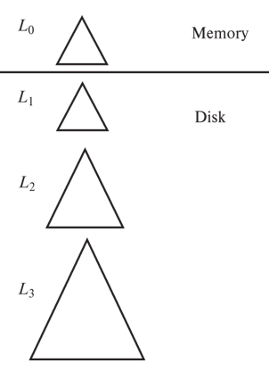{align=right width=25%}

    在右图中，我们使用 $L_0, L_1$ 等来表示不同大小和层级的 LSM 树。

    - 记录首先会被插入到内存中的 $L_0$ 树中
    - 当内存中的 $L_0$ 树达到一定大小时，它移动到磁盘中，称为 $L_1$ 树
    - 当 $L_1$ 树的数量超过某个阈值时（比如 $k$ 棵），它们就会被合并为 $L_2$ 树，以此类推得到更多的层级
        - 有 $k$ 棵 $L_i$ 树时，它们会被合并成一棵更大的树 $L_{i+1}$，因此每个层级的树的大小是前一个层级的 $k$ 倍

**LSM 树的优点**：

- 插入只需要顺序的 I/O 操作
- 叶子节点总是满的，避免了空间的浪费
- 与普通的 B+ 树相比，插入的每条记录所需的 I/O 操作更少

**LSM 树的缺点**：

- 查询时需要搜索多棵树
- 每个层级的内容会被多次拷贝

!!! info "Stepped-Merge Index"
    - LSM 树的一个变种，每层都有多棵树，使用了分层的合并策略
    - 相较于 LSM 树，写操作的开销更小
    - 但在查询时需要搜索更多树，查询性能较差

!!! note "Deletion of LSM Tree"
    - 删除操作会在内存中的 MemTable 中进行
        - 如果对应的记录还在内存里的 MemTable 中，直接把这个记录用一个“删除标记”覆盖掉
        - 如果已经被写入了磁盘中，LSM Tree 会在 MemTable 插入一个特殊的“删除标记”记录，后续会一同被写入到磁盘中，表示该记录已被删除
    - 查找操作会同时找到原始记录和删除标记，如果某条记录存在相应的删除标记，那么就认为该记录已被删除，查询时不会返回它
    - 当树需要合并时，如果有原始记录和删除标记相匹配，那么两者都会被去除而不会参与合并
    - 更新操作可以通过插入 + 删除的方式来实现：新的记录会被插入到 MemTable 中，而旧的记录会被标记为删除

### Buffer Tree

Buffer Tree 是 LSM Tree 的替代方案，它是 B+ 树的一种变体：

- B+ 树的每个中间节点都使用一个缓冲区，进行插入时先把数据存入这个缓冲区里，缓冲区满了再转移到下一层节点的缓冲区里
- 由于 B+ 树的每个节点都存储在磁盘上，因此在插入时可以减少访问 B+ 树结点的次数，从而有效减少磁盘 I/O 操作
    - 普通的 B+ 树在每次插入时都要从根节点到叶结点依次访问一遍
    - 而 Buffer Tree 通过缓冲，可以让多次插入合并到同一次磁盘访问里

<figure markdown="span">
    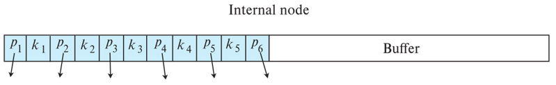{width=75%}
</figure>

**优点：**

- 查询的开销较小
- 可以与任意树索引结构结合使用

**缺点：**

- 相较于 LSM Tree，Buffer Tree 需要更多的随机 I/O 操作

## Index Definition in SQL

当我们在 SQL 中创建一个索引后，在此之后当我们使用 SELECT 语句时，数据库会自动使用索引来加速查询。

### Create Index

基本语法：

```sql
CREATE INDEX <index_name> ON <table_name> (column1, column2, ...);
```

例如：

```sql
-- 创建单列索引
CREATE INDEX idx_name ON employees (name);

-- 创建多列索引
CREATE INDEX idx_name_age ON employees (name, age);
```

我们也可以通过 `create unique index` 来间接地指定并强制约束条件，使搜索键成为候选键

> Use `create unique index` to indirectly specify and enforce the condition that the search key is a candidate key.

```sql
CREATE UNIQUE INDEX <index_name> ON <table_name> (column1, column2, ...);
```

例如

```SQL
-- 在 account 表上创建一个唯一索引，确保每个 account_id 是唯一的
CREATE UNIQUE INDEX idx_account_id ON account (account_id);
```

### Use Index

在此之后，当我们使用如下的查询语句时，数据库会自动使用索引来加速查询：

```sql
SELECT * FROM employees WHERE name = 'John Doe';
SELECT * FROM employees WHERE name = 'John Doe' AND age = 30;
```

### Drop Index

我们可以直接使用 drop index 来删除索引：

```sql
DROP INDEX <index_name>;
```

## Multiple-Key Access

当我们需要以多种条件进行查询时，使用多重索引（multiple indexes）会比使用两个单独的索引更高效。

例如当我们想要使用下面的查询语句时：

```sql
SELECT account_id
FROM account 
WHERE branch_name = 'Perryridge' AND balance > 1000;
```

建立一个多重索引会比建立两个单独的索引更高效：

```sql
-- 多重索引会更高效
CREATE INDEX idx_branch_balance ON account (branch_name, balance);

-- 两个单独的索引会相对而言更低效
CREATE INDEX idx_branch_name ON account (branch_name);
CREATE INDEX idx_balance ON account (balance);
```

### Grid Files

网格文件（Grid Files）是一种用于多维数据的索引结构，特别适用于需要在多个维度上进行查询的场景。网格文件将数据划分为多个网格单元，每个网格单元对应一个数据块。

- 网格文件有一个网格数组，并且每个搜索键属性都有对应的线性刻度值
- 网格数组的维度数量等于搜索键属性的数量
- 网格数组中多个小单元可以指向同一个桶（bucket）
- 当我们想要根据搜索键值找到对应的桶时，需要首先根据线性刻度找到该值所在单元格的行和列，然后沿着指针找到对应的桶

<figure markdown="span">
    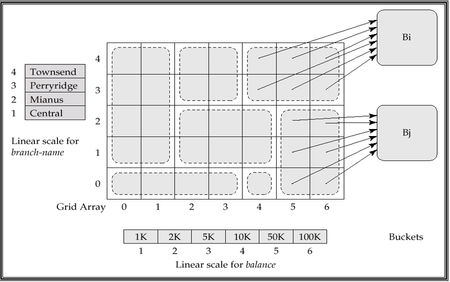{width=55%}
</figure>

在插入时，如果此时桶已满，并且不止一个单元格（cell）指向这个桶，那么可以创建一个新的桶

- 这一思想和扩展哈希很类似，但它用于更多的维度
- 如果只有一个单元格指向这个桶，那么要么使用一个溢出桶，要么就要增大网格的大小

必须选择合适的线性刻度，以保证记录均匀地分布在不同的单元格中

### Bitmap Index

位图索引是一种用于高效查询的索引结构，特别适用于低基数（low cardinality）列的查询。每个属性都会使用若干个位图，每个位图对应一个搜索键值，位图的第 $i$ 位表示数据表中的第 $i$ 行记录是否属于该搜索键值。

- 位图索引通常用于低基数列，例如性别、国家等，适合于范围查询和连接操作
- 在最简单的位图索引形式中，每个属性值都对应一个位图
    - 如果第 $i$ 行记录的属性值等于该属性值，那么位图的第 $i$ 位就会被设置为 1，否则为 0
    
!!! example
    例如下图中 m 对应的位图内容是 `10010` 表示第 0 和第 3 条记录中性别的属性值为 m（男性）

    <figure markdown="span">
        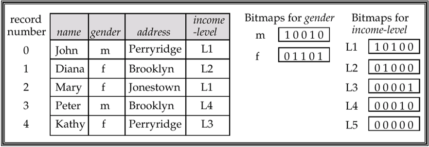{width=65%}
    </figure>
