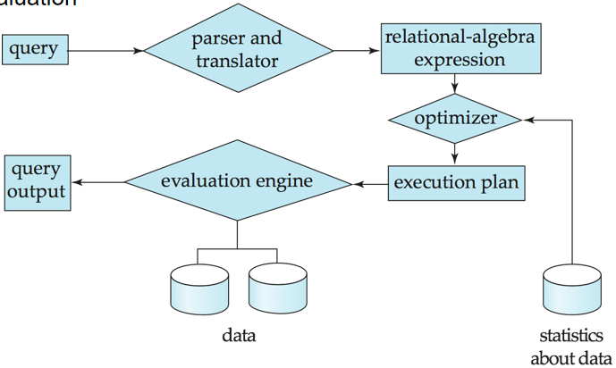
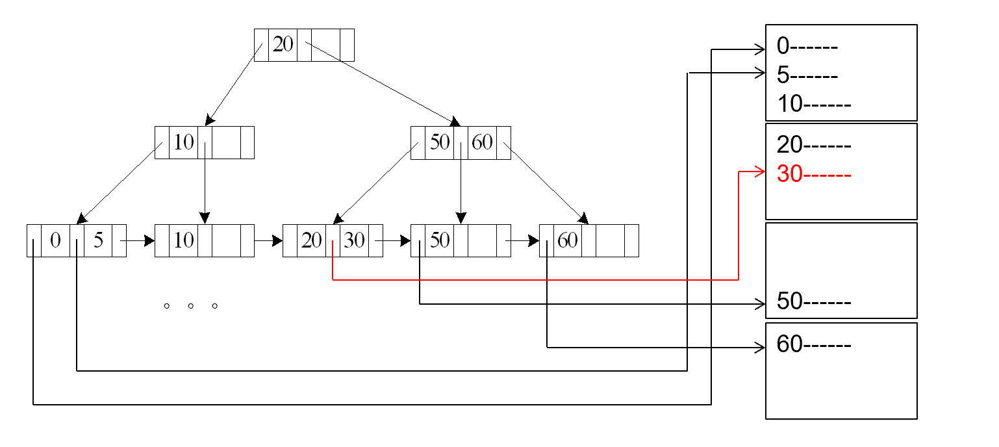
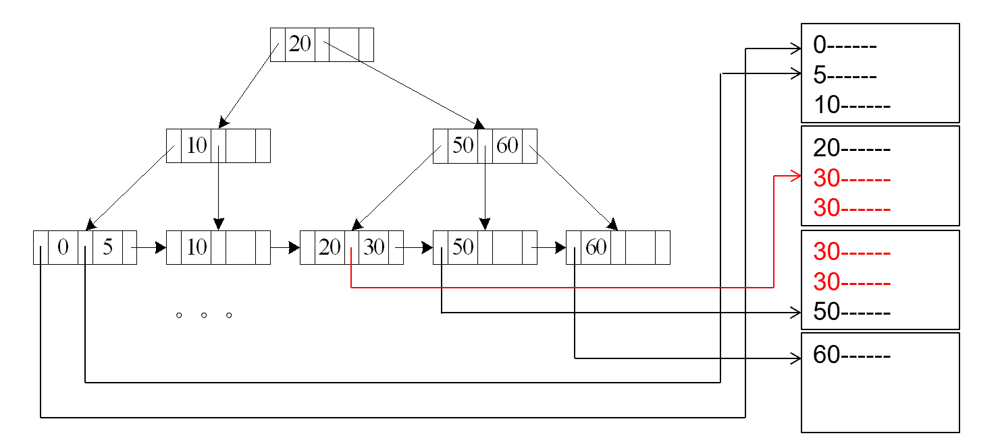
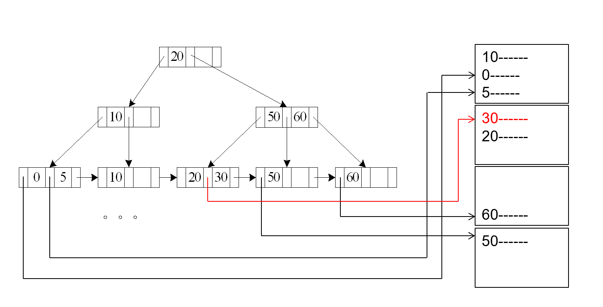
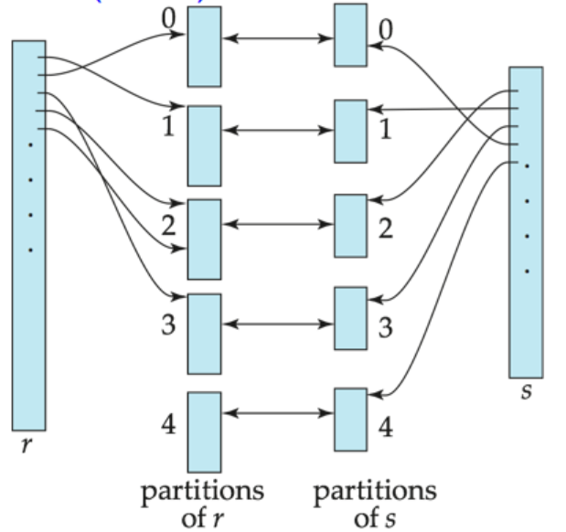

# Query Processing

!!! info Overview 

    在数据库系统中进行查询会有以下几个基本步骤：

    1. **Parsing and translation**: 解析 SQL 语句，将查询语句转换为关系代数表达式
    2. **Optimization**: 一个查询语句可能对应多个等价的关系代数表达式，并且对于每一个操作算子（如连接、投影等）可能会有不同的实现方式，我们希望选择最优（如开销最小、速度最快）的执行计划
    3. **Evaluation**：执行查询计划，返回结果

    <figure markdown="span">
        {width=70%}
    </figure>

## Measures of Query Cost

Cost is generally measured as total elapsed time for answering query.

影响一次查询耗时的因素可能有很多，我们一般主要关注 Disk Access、CPU Time 和 Network Time。其中 Disk Access 是主导因素，我们主要考虑以下三个角度：

- number of seek operations
- number of blocks read × average block read cost
- number of blocks written × average block write cost
    - 一般而言 write cost 会比 read cost 大很多，因为我们在写入内存之后还需要再把数据读出来，以保证数据的正确性和一致性。

为了简便起见，我们只考虑磁盘与内存之间数据块传输（transfer）的次数，以及磁盘寻址（seek）的次数

- $t_T$：time to transfer one block
- $t_S$：time for one seek

例如我们要传输 b 个块，并需要 s 次寻址，那么总的时间为：$T = b \cdot t_T + s \cdot t_S$

!!! tip
    - 为了简洁期间，我们没有考虑 CPU 的时间开销，但在实际的系统中，我们也需要把这一部分考虑进去
    - 在后面的公式中，把最终结果写入磁盘的开销都没有被考虑进去

!!! note "内存缓冲区对查询成本的影响"
    查询的成本很大程度依赖于主存的缓冲区大小：

    - 内存越大，需要访问磁盘的次数就越少
    - 操作系统中会有其他进程并行执行，因此在实际执行前很难确定缓冲区中实际可用的内存大小
    - 通常我们会同时考虑最坏情况的缓冲区大小（假设我们只有操作所需的最小内存空间可用）和最佳情况的缓冲区大小
    - 操作所需要访问的数据可能已经处于内存的缓冲区中了，这可以避免磁盘 I/O 操作，但在估算成本时我们很难将其考虑在内

## Selection Operation 

### Basic algorithms

**File scan**: 简单粗暴地逐行扫描文件，检查每一行是否满足条件，**通常不使用索引**。下面介绍的 A1 和 A2 算法都基于文件扫描。

- **A1 - Linear Search**: 依次扫描每一个文件块并测试所有记录，检查他们是否满足选择条件。
    - Cost estimate = $b_r$ block transfers + 1 seek
        - $b_r$ 是包含关系 $r$ 中记录的数据块数量
    - 如果选择条件是基于键属性的，那么当我们找到这个记录之后就可以停止扫描
        - 平均开销是扫描扫描一半的块：cost estimate = $(b_r/2)$ block transfers + 1 seek
    - 线性搜索可以用于任何选择条件、在文件中以任何排序方式的记录，无需考虑是否存在索引

- **A2 - Binary Search**: 适用于有序文件，并且要求选择条件是一个等值比较（equality comparison）。
    - 我们需要假设保存这个关系的文件是连续的
    - Cost estimate = $\lceil \log_2 (b_r) \rceil$ block transfers + $\lceil \log_2 (b_r) \rceil$ seeks
        - 每一次传输一个块都需要进行一次寻址
        - time cost = $\lceil \log_2 (b_r) \rceil \times (t_T + t_S)$
    - 如果选择不是基于键属性的，那么满足给定选择条件的记录可能有很多条，我们还需要传输包含这些记录的数据块，有 $b_s$ 块，因此总的块传输数量为

        block transfer = $\lceil \log_2 (b_r) \rceil + (\lceil sc(A, r) / f_r \rceil - 1)$

        其中 $sc(A, r)$ 是满足选择条件的记录数，$f_r$ 是每个块中记录的数量。

        即完整的传输成本 = 定位第一个满足条件的块并传输 + 传输剩余所有满足条件的块（此时第一个块已经被传输好了，因此要减一）

!!! note
    二分搜索通常不适用于数据库中的查找

    - 数据通常不是连续存储的
    - 需要存在可用的索引（记录本身是无需的集合，不能直接执行二分搜索）
    - 二分搜索比索引搜索需要更多的寻址操作

### Selections Using Indices and equality

**Index scan**: 使用索引的搜索算法，并且要求选择条件必须基于索引的 search key。

- **A3 - primary index, equality on key**
    - 要求在关系的键属性上建立了主索引，并且根据键值的等值条件查询，获取单个记录
    - cost = $(h_i + 1) \times (t_T + t_S)$
        - $h_i$ 是索引树的高度，即有多少层索引
        - 我们需要对索引项进行 $h_i$ 次读取操作，最后还需要一次额外的读取操作来访问包含目标记录的数据块

    <figure markdown="span">
        {width=70%}
    </figure>

- **A4 - primary index, equality on non-key**
    - 适用于主索引，基于非键属性的等值条件查询，获取多个记录
    - 需要记录被保存在连续的块中，假设有 $b$ 个块包含有满足条件的记录
    - cost = $h_i \times (t_T + t_S) + t_S + b \times t_T$
        - $h_i$ 是索引树的高度，即有多少层索引
        - $b$ 是满足条件的记录所在的块数
        - $h_i \times (t_T + t_S)$ 表示通过索引找到第一个匹配的索引项，$t_S$ 表示把磁头定位到第一个匹配的块，$b \times t_T$ 表示传输所有满足条件的块

    <figure markdown="span">
        {width=70%}
    </figure>

- **A5 - secondary index, equality on non-key**

    > 使用辅助索引意味着索引的排列顺序和文件实际的存放顺序不一致（从下图中可以看到这一点）

    - 如果搜索键是候选键（检索单条记录），那么

        cost = $(h_i + 1) \times (t_T + t_S)$

    <figure markdown="span">
        {width=70%}
    </figure>

    - 如果搜索键不是候选键（检索多条记录），那么匹配条件的记录可能位于不同的数据块中

        cost = $(h_i + m + n) \times (t_T + t_S)$

        - 我们使用索引得到的是若干个含有指向目标数据块的指针的块，$m$ 是这些放有指针的块的数量，$n$ 是磁盘中与搜索条件匹配的记录的总数目
        - 这种情况的开销可能非常大，甚至比线性扫描更糟糕

    <figure markdown="span">
        {width=70%}
    </figure>

### Selections Involving Comparisons

与选择操作有关的比较运算符有 `> >= < <= <>`，可以通过线性搜索（记录文件较小时可以考虑使用）、二分搜索，或者以下的几种方法实现：

- **A6 - primary index, comparison**
    - $\sigma_{A \geqslant v}(r)$：先使用索引找到第一个满足 $A \geqslant v$ 的记录，然后那里开始**顺序扫描后续记录**
        - cost = $h_i \times (t_T + t_S) + t_S + b \times t_T$
    - $\sigma_{A \leqslant v}(r)$：直接从头开始**扫描关系中的记录**，直到遇见第一个满足 $A > v$ 的记录为止，不需要使用索引
        - cost = $t_S + b \times t_T$

- **A7 - secondary index, comparison**
    - $\sigma_{A \geqslant v}(r)$：先使用索引找到第一个满足 $A \geqslant v$ 的**索引项**，然后那里开始顺序扫描索引项，使用指针依次访问记录
    - $\sigma_{A \leqslant v}(r)$：直接从索引树的第一个叶子节点开始**扫描索引项**，依次访问各个记录，直到遇见第一个满足 $A > v$ 的索引项位置
    - 在上述两种情况下，由于我们需要使用指针，因此访问每个记录都需要一次单独的 I/O 操作（访问和传输），直接使用线性扫描的开销甚至可能比它较小

!!! tip
    注意这里使用主索引时扫描的是记录，而使用辅助索引时扫描的是索引项。

### Implementation of Complex Selections

这种情况下，选择操作需要考虑多个条件，即结果是多个条件的合取 $\sigma_{\theta_1 \wedge \cdots \wedge \theta_n}(r)$

- **A8 - conjunctive selection using one index**
    - 选择一个 $\theta_i$，并且从算法 A1-7 中选择一个，先执行代价最小的一个 $\sigma(\theta_i)$
    - 把第一步得到的结果从内存缓冲区中取出，对这个结果应用其他选择条件 $\theta$，以此类推

- **A9 - conjunctive selection using composite index**
    - 如果存在可用的组合索引（多键索引）的话，就直接使用它来同时处理多个条件
    - 使用多键索引一次性查询多个条件，比对每个条件分别单独使用索引更高效

- **A10 - conjunctive selection by intersection of identifiers**
    - 需要索引项有指向记录的指针
    - 单独对每个索引进行查询，然后查看结果的交集
- **A10 - disjunctive selection by union of identifiers**
    - $\sigma_{\theta_1 \vee \cdots \vee \theta_n}(r)$
    - 每个选择条件都有可用的索引时才可以应用，否则只能直接使用线性扫描
    - 对每个条件分别使用对应的索引，会得到的指向记录的指针，对这些指针取并集
    - 最后利用指针从文件中读取数据

- 否定条件的选择形式为 $\sigma_{\neg \theta}(r)$
    - 通常对文件使用线性扫描
    - 如果只有很少的记录满足条件 $\neg \theta$，并且有可以高效应用于 $\theta$ 的索引
        - 那么就先用索引找到满足 $\theta$ 的记录，然后通过计算补集得到满足 $\neg \theta$ 的记录

## Sorting 

!!! info
    - 当一个关系可以放在内存中时，我们可以对它使用快速排序等排序方法
    - 但当关系的太大以至于无法完整放入内存时，我们就需要使用外部归并排序（external merge sort）

    > 关于外部排序的具体细节可以参考我的[ADS笔记](../ADS/lec-15.md)中关于外部排序的部分，在下面的内容就不会对算法的具体细节做太多展开。

假设内存大小为 $M$ 个 page（每次可以对 $M$ 个块进行排序），外部归并排序的操作如下：

1. 创建若干个有序的 runs（可译为顺串，或段）
    - 初始化 $i$ 为 0
    - 重复以下步骤直到整个关系处理完毕
        - 读取关系的 $M$ 个数据块到内存中
        - 在内存中对这些数据块排序
        - 将排序后的数据写入顺串 $R_i$ 中（这里需要把数据写回磁盘），令 $i$ 递增 1
    - 记最后 $i$ 的大小为 $N$
2. 合并顺串（N-路合并）
    
    这里我们假设 $N < M$，即顺串的数量小于内存可以容纳的数据块的个数

    - 使用内存中的 $N$ 个块作为输入缓冲区，一个块作为输出缓冲区。从每个顺串（run）中读取第一个数据块到各自的缓冲区中。
    - 重复执行以下步骤：
        1. 根据排序的次序从所有的缓冲页中选择第一块记录（如按升序或降序排列）
        2. 把这个记录块写入输出缓冲区中（输出缓冲区满时写入磁盘中）
        3. 把这个记录从输入缓冲区页中删除
            - 如果此时这个输入缓冲区空了，那么就从它对应的顺串中读取下一块数据
    - 直到所有的输入缓冲区都为空时此程序停止

如果 $N \geqslant M$，那么就需要多次合并传递（pass）的过程：

- 在每一次传递过程中，所有连续的 $M-1$ 个顺串都会被合并为 $1$ 个（过程中需要留一个位置作为输出缓冲区）
- 每次传递都会使得顺串的数量变为原来的 $\dfrac{1}{M-1}$，并且使得顺串的长度变为原来的 $M-1$ 倍
    - 例如 $M=11$ 时，如果有 90 个顺串，那么经过一次 pass 后就只有 9 个顺串了，并且每个顺串都是初始顺串的 10 倍长（假设原先的所有顺串都有相同的长度）
- 我们需要重复上述步骤直到只剩下一个顺串

!!! example 
    <figure markdown="span">
        {width=50%}
    </figure>

!!! note
    1. 总共需要 $\left\lceil \log_{M-1}(\dfrac{b_r}{M}) \right\rceil$ 次合并传递的过程，其中 $b_r$ 是数据块的个数
    2. **块传递次数**：创建初始顺串和每次合并传递都需要 $2b_r$ 次块传递操作：把数据从磁盘中读入内存（一次读取），再把结果写回磁盘形成有序顺串（一次写入）
        - 最后一次合并传递操作是例外，因为最终的结果可能会直接传递给下一个操作，而不需要写回磁盘
        - 因此外部所需的数据块传递次数为 
            $$ b_r \times \left(2 \left\lceil \log_{M-1}(\dfrac{b_r}{M}) \right\rceil + 1 \right) $$
    3. **寻道次数**：
        - 在创建顺串时，每个顺串都需要一次寻道来读取数据，以及一次寻道来写回数据
            - 由于共有 $\lceil b_r / M\rceil$ 个顺串，因此需要 $2\lceil b_r / M \rceil$ 次寻道
        - 在合并时，我们假设缓冲区大小为 $b_b$（即一次能读/写 $b_b$ 个块）
            - 那么每次合并传递都需要 $2\lceil b_r/b_b \rceil$ 次寻道（最后一次合并传递不需要写回，因此可以少计算一次寻道）
        - 因此总共的寻道次数是
            $$ 2\lceil b_r / M\rceil + \lceil b_r/b_b \rceil (2 \lceil \log_{M-1}(b_r / M) \rceil - 1) $$

## Join Operation 

连接操作几乎可以认为是关系数据库中最重要的操作，它可以把两个关系中满足特定条件的元组组合起来得到新的关系。

实现连接操作的算法有以下几种：

- Nested-loop join
- Block nested-loop join
- Indexed nested-loop join
- Merge-join
- Hash-join

### Nested-loop join

嵌套循环连接是最简单的连接算法：

- 对于外部关系中的每个元组，遍历内部关系中的所有元组，检查它们是否满足连接条件
- 如果满足条件，就将这两个元组连接起来，形成一个新的元组，并将其添加到结果中

> 我们应当让元组数量较少的关系作为外部关系（后面的几种连接方式也一样），这样可以减少内存的使用和 I/O 操作的次数。

```python
for each tuple t_r in r do begin
    for each tuple t_s in s do begin
        test pair (t_r, t_s) to see if they satisfy the join condition θ
        if they do, add t_r • t_s to the result
    end
end
```

- 其中 r 被称为外部关系（outer relation），s 被称为内部关系（inner relation）
- 这一算法不需要索引就可使用，适用于任何类型的连接条件
- 开销巨大，因为需要检查两个关系中的所有可能的元组对

!!! tip "开销分析"
    在最坏的情况下，如果内存只足够装下每个关系的一个块，那么

    - 块传输次数：$n_r \times b_s + b_r$
        - 外部关系 r 中的所有块都需要读取一次（共 $b_r$ 块）
        - 外部关系 r 中的每个元组（共 $n_r$ 个）都需要遍历一次内部关系 s 的所有块（共 $b_s$ 块）
    - 寻道次数：$n_r + b_r$
        - 每个外部元组都需要重新定位一次内部关系的起始位置（共 $n_r$ 次）
        - 每个外部关系的每个块都需要一次寻道 $b_r$

    如果较小的关系可以完整放入内存中，那么应该把它用作内部关系：

    - 此时的块传递次数将会降为 $b_r + b_s$，寻道次数降为 2 次（两个关系各需要一次寻道）


### Block nested-loop join

块嵌套循环连接是嵌套循环连接的一个变体，它寻找的是数据块对而非是元组对

- 为外部关系 r 中的每个数据块，遍历内部关系 s 中的所有数据块
- 对每个外部关系块中的每个元组，遍历内部关系块中的每个元组，检查它们是否满足连接条件

```python
for each block B_r of r do begin
  for each block B_s of s do begin
    for each tuple t_r in B_r do begin
      for each tuple t_s in B_s do begin
        Check if (t_r, t_s) satisfy the join condition 
        if they do, add t_r • t_s to the result.
      end
    end
  end
end
```

!!! tip "开销分析"
    在最坏的情况下，需要

    - 块传输次数：$b_r \times b_s + b_r$
    - 寻道次数：$2 \times b_r$

    在最理想的情况下，需要

    - 块传输次数：$b_s + b_r$
    - 寻道次数：2

在块嵌套循环中，我们通过以块为单位处理显著减少了对内部关系的重复访问，将 $n_r$ 改进为了 $b_r$（一般而言 $n_r >> b_r$）

!!! note "块嵌套循环的改进"
    假设内存可以容纳 $M$ 个块，那么我们使用 $M-2$ 个来存储外部关系，$1$ 个用于读取内部关系，$1$ 个用作输出缓冲区。

    - 我们可以一次性读取 $M-2$ 个外部关系的块到内存中，并且一次性将 $M-2$ 个外部关系块与内部关系进行连接操作
    - 因此内部关系只需要被扫描 $\lceil b_r / (M-2) \rceil$ 轮，而不是 $b_r$ 轮

    此时的开销就变为了

    - 块传输次数：$\lceil b_r / (M-2) \rceil \times b_s + b_r$
    - 寻道次数：$2 \times \lceil b_r / (M-2) \rceil$

!!! extra
    我们还可以进行进一步的优化：

    - 如果进行的是等值连接，并且连接属性是内部关系的键，那么可以在第一次匹配时就终止内部循环（因为这个元组是唯一的）
    - 我们可以交替地正向和反向扫描内部循环，以充分利用缓冲区中的块（同时利用 LRU 替换策略）
    - 如果内部关系拥有索引，我们可以用它来加速查找

### Indexed nested-loop join

当内部关系在连接属性上有索引时，我们就可以使用索引嵌套循环连接。

满足下面这两个条件时，我们就可以使用索引来替代文件扫描：

- 连接是等值连接或自然连接
- 在内部关系的连接属性上有可用的索引
    - 必要时我们可以为了此次连接创建一个索引

算法可以被概括为

```python
for each tuple tr in the outer relation r:
  use the index to look up tuples in s 
    that satisfy the join condition with tuple t_r
```

!!! tip "开销分析"
    在最坏的情况下，我们只有一页缓冲区，每个外部关系 r 的中的元组都需要使用索引来查找 s 中对应的元组
    
    - 开销为：$ b_r \times (t_T + t_S) + n_r \times c $
        - 其中 $c$ 是遍历索引并获取 $s$ 中所有与条件相匹配的的元组的成本
        - 我们可以把 $c$ 估计为在连接条件上对 s 进行单个选择操作的成本
    - 如果两个关系都有索引，就把元素数量较少的作为外关系

### Merge-join

归并连接实际上就是先对两个关系在连接属性上进行排序，然后通过归并操作把两者连接起来。

- 仅适用于等值连接或自然连接
- 每个块只需读取一次（假设给定一个值后，对应的所有元组都能放入内存中）
    
算法的步骤如下：

1. 把两个关系按照连接属性进行排序（假如尚未排序的话）
2. 合并两个排序好的关系，以此来连接它们
    - 连接操作类似于归并排序算法的归并操作，区别主要在于我们只需要把连接属性相同的元组对保留下来，生成连接结果；其余的元组对则被丢弃

!!! tip "开销分析"
    - 块传输次数：$b_r + b_s$
    - 寻道次数：$\lceil b_r / b_b \rceil + \lceil b_s / b_b \rceil$
    - 还需要加上对关系进行排序的开销

!!! extra "混合归并连接"
    混合合并连接（Hybrid merge-join）是排序合并连接的一个变种，满足以下条件时我们可以使用
    
    - 一个关系已按连接属性排序
    - 另一个关系在连接属性上有辅助的 B+ 树索引

    算法的步骤如下：

    1. 按顺序扫描排序好的关系，将每个元组与 B+ 树叶子节点上的元组合并（merge）起来
    2. 将上一步的结果按未排序关系的物理地址排序
    3. 按物理地址顺序扫描未排序的关系，并与之前的结果合并，把地址替换为实际元组

### Hash-join

哈希连接利用的是哈希函数会把具有相同连接属性值的元组分到同一个桶中的原理进行连接

- 适用于等值连接或自然连接
- 我们只需要检查同一个桶中的元组是否可以连接上即可

!!! info "哈希连接的大致思路"
    1. 对 $r$ 和 $s$ 中的元组使用同一个哈希函数 $h$ 进行映射，如果计算出的哈希值是 $i$，就把这个元组归入分区 $r_i$ 或分区 $s_i$ 中
        - 显然，$r_i$ 中的元组只需要与 $s_i$ 中的元组比较即可，因为有可能和它们连接起来的元组一定会在 $s_i$ 中
    2. Build：选择两个 relation 中较小的那一个（例如 $s$）作为**构建关系（build relation）**或**构建输入（build input）**
        - 把 $s_i$ 中的元组载入内存中，并使用一个哈希函数为 $s_i$ 上的每个元组在相同的属性上**建立哈希索引**
        - 建立哈希索引的哈希函数 $h'$ 应当与用于分区的哈希函数 $h$ 不同
    2. Probe：另一个 relation（例如 $r$）被称为**探测关系（probe relation）**或**探测输入（probe input）**
        - 从 $r_i$ 中读取元组，并使用哈希函数 $h'$ 来查找 $s_i$ 中与其相匹配的元组
        - 把所有匹配的元组连接起来，形成新的元组，并将其添加到结果中

<figure markdown="span">
    {width=55%}
</figure>

!!! note
    - 我们需要选择合适的 $n$ 和哈希函数 $h$，使得所有的 $s_i$ 都一定能放入内存中
    - 通常 $n = \lceil b_s / M \rceil \times f$

        其中 $f$ 为修正因子，通常大约为 1.2

    如果发现分区数 $n$ 大于内存可用页数 $M$，那么就需要使用**递归分区**

    - 先使用一个把关系划分为 $M-1$ 份的哈希函数
    - 再使用一个不同的哈希函数对这 $M-1$ 个分区再细分
    - 重复上述操作直到每一个小分区都可以装入内存中位置

    !!! tip
        一般而言递归分区很少需要被使用，例如：块大小为 4KB，内存大小为 12 MB，关系大小为 36GB 时
        
        - 为了方便计算，$1GB = 10^3 MB = 10^6 KB = 10^9 B$
        - $M = 12MB\ / \ 4KB = 3 \times 10^3$ 块
        - $b_s = 36GB\ / \ 4KB = 9 \times 10^6$ 块
        - $n = \lceil b_s / M \rceil = \lceil 9 \times 10^6 \ / \ 3 \times 10^3 \rceil = 3000$
        - $M = n$，因此不需要递归分区

!!! tip "开销分析"
    开销包括三个部分：

    1. partitioning（分区）
    2. building（构建）
    3. probing（探测）

    当内存足够、**不使用递归分区**时

    - 块传输次数：

        $$ 3(b_r + b_s) + 4 \times n_h $$

        - 分区时，对两个关系 $r$ 和 $s$ 都需要进行 *读取—哈希—写回* 的操作，因此需要 $2(b_r + b_s)$ 次块传输
        - 构建和探测阶段个需要读取每个分区一次，因此需要额外的 $b_r + b_s$ 次块传输
        - 由于各个分区中的数据块往往不是满的，因此所有分区所使用的总数据块数量会多于 $b_r + b_s$，构建和探测时都会至多遇见额外的 $2n_h$ 次块传输，其中 $n_h$ 是分区的数量

    - 寻道次数：
    
        $$ 2 \times (\lceil b_r / b_b \rceil + \lceil b_s / b_b \rceil) + 2 \times n_h $$

        - 输入和输出缓冲区有 $b_b$ 个块，因此分区共需要 $2(\lceil b_r / b_b \rceil + \lceil b_s / b_b \rceil)$ 次寻道
        - 在构建和探测时，对于每个关系的 $n_h$ 个分区都需要一次寻道，共需要 $2 \times n_h$ 次

    当我们需要**使用递归分区**时

    - 划分次数由 $s$（构建关系）的大小决定，进行 $\lceil \log_{M-1} (b_s) - 1 \rceil$ 次划分
    - 块传输次数：
    
        $$ 2(b_r + b_s) \times \lceil \log_{M-1} (b_s) - 1 \rceil + b_r + b_s $$

        - 每次分区都需要 $2(b_r + b_s)$ 次块传输，因此进行递归分区共需要 $2(b_r + b_s) \times \lceil \log_{M-1} (b_s) - 1 \rceil$ 次块传递
        - 进行构建和探测时，每个分区都需要读取一次，需要 $b_r + b_s$ 次块传输

    - 寻道次数：
    
        $$ 2 \times (\lceil b_r / b_b \rceil + \lceil b_s / b_b \rceil) \times \lceil \log_{M-1} (b_s) - 1 \rceil $$

        - 每次分区都需要 $2(\lceil b_r / b_b \rceil + \lceil b_s / b_b \rceil)$ 次寻道，进行递归分区共需要 $2(\lceil b_r / b_b \rceil + \lceil b_s / b_b \rceil) \times \lceil \log_{M-1} (b_s) - 1 \rceil$ 次寻道
        - 构建和探测时仅需要少量次数的寻道，我们在这里忽略这一部分

    最理想的情况是主存容量足够大，整个构建关系都可以放入主存中，不需要划分，此时开销就降为 $b_r + b_s$ 次块传输和 $2$ 次寻道。

## Other Operations

### Duplicate elimination

消除重复可以通过排序或哈希实现

- 排序：
    - 首先对关系 $r$ 排序，重复的元组会彼此相邻
    - 当我们进行外部排序的归并操作时，重复的元组不会再次被保留
    - 成本 = 排序的成本（如果关系已经是有序的，就忽略此项）+ 扫描的成本（1 次寻道加上 $b_r$ 次块传输）
- 哈希：
    - 重复的元组会被分配到同一个桶中
    - 我们可以在每个桶中分别检测并删除重复项

### Projection

- 先对每个元组执行一次属性投影
- 然后再对投影结果执行一次重复消除操作

如果我们只投影少量属性，那么投影结果很可能远小于原始关系，先投影再做其他操作可以加速程序运行。

### Aggregation

聚合操作的实现方式与重复消除类似

- 我们可以使用排序或哈希把元组进行分组，然后对每一组应用聚合函数
- 当我们在生成顺串和进行中间的归并操作时，可以保留一些可能会使用到的聚合函数中间值
    - 例如对于 count，min，max，sum 等聚合函数，我们可以不断更新元组的最大/小值、数目和总和等
    - 对于 avg，我们可以跟踪 sum 和 count，最后再通过 sum / count 来计算结果

### Set operations

集合操作（$\cup \ \cap \ -$）可以通过排序后的归并连接的变体或者哈希连接的变体来实现

**基于排序后的归并连接**：

1. 对两个关系按照相同的搜索键排序
2. 同时扫描两个排序后的关系，执行类似于归并连接的操作
3. 根据集合操作做不同处理
    - 并集（$\cup$）：输出两个关系中的所有元组，但重复元组只输出一次
    - 交集（$\cap$）：只输出同时出现在两个关系中的元组
    - 差集（$-$）：只输出在第一个关系中出现但不在第二个关系中出现的元组

**基于哈希连接**：

1. 使用相同的哈希函数对两个关系进行划分，得到 $r_1, \cdots, r_n$ 和 $s_1, \cdots, s_n$
2. 对每一个划分结果 $i$，执行下述操作（左操作数为 $r$，右操作数为 $s$）：
    - 把 $r_i$ 加载到内存中后，使用另一个哈希函数为它构建一个内存中的哈希索引
    - 根据集合操作做不同处理
        - 并集（$\cup$）：若 $s_i$ 中的某个元组不在哈希索引里，把它添加到哈希索引中，最后输出哈希索引中的所有元组
        - 交集（$\cap$）：只有 $s_i$ 中的某个元组处于哈希索引中时，才把它输出 
        - 差集（$-$）：对于 $s_i$ 中的每个元组，如果它已经处在哈希索引中了，就把它从索引中删除，最后输出哈希索引中的所有元组

### Outer Join

外连接可以通过以下两种方式计算：

- 先计算内连接，然后在未参与元组的空缺属性中填充 null
- 修改连接算法

修改**归并连接**来计算外连接 $r \rtimes s$

- 在 $r \rtimes s$ 中，非参与元组指的是属于 $r - \Pi_R (r \bowtie s)$ 中的元组
- 修改算法内容：在归并过程中，对于来自 $r$ 的每个元组 $t_r$，如果它在 $s$ 中没有匹配的元组（即它是未参与元组），则在 $t_r$ 的空缺属性上填充 null，然后输出这个元组

修改**哈希连接**来计算外连接 $r \rtimes s$

- 如果 $r$ 是探测关系，那么就把未匹配上的 $r$ 中的元组填充 null 并输出
- 如果 $r$ 是构建关系，那么就在探测阶段跟踪 $r$ 的哪些元组匹配上了 $s$ 中的元组。在探测结束时，未成功匹配的 $r$ 中的元组填充 null 后再输出

> 右外连接 $\ltimes$ 和全外连接 ⟗ 的计算方法类似
