# 数据可视化导论

!!! abstract

    “数据可视化导论”课程相关笔记

    - 老师：巫英才
    - 参考书籍：*数据可视化的基本原理与方法*
    - 课程网站：[https://vis-course.projects.zjuidg.org](https://vis-course.projects.zjuidg.org)

!!! info "分数构成"
    - 线上客观题考核：30%
    - 两次平时作业：5% + 10%
    - 课程大作业：50%
    - 出勤：5%
    
## 数据

### 数据的属性

属性在不同领域中可能有不同的称呼，例如

- 数学：维度
- 机器学期：特征
- 统计学：变量

属性可以大致分为两类

- **类别属性**：也称为状态，可以理解为“某种东西的名称”
    - 如形状、颜色等，仅用于区分不同对象，不蕴含序列的信息，也不能具备运算的功能

- **序数属性**：若属性能提供对象之间的比较信息，就将其称为序数属性
    - 虽然序数属性能够进行比较，但未必能进行运算，例如我们不能说特大号衣服减去大号衣服等于小号衣服

- **数值属性**：如果一个序数属性在算术运算下具有意义，就可将其称为数值属性
    - 数值属性包括离散型（只能用整数单位表示）和连续型（需计量或测量获得）两种类型

### 相异性矩阵

相异性矩阵：一个下三角矩阵，第 $i$ 行、第 $j$ 列的元素表示第 $i$ 个对象和第 $j$ 个对象之间的相异性。主对角线上的元素为 0，表示对象与自身的相异性为 0。

$$ \begin{bmatrix}
& 0 \\\\
& d(2,1) & 0 \\\\
& d(3,1) & d(3,2) & 0 \\
& \vdots & \vdots & \vdots\\
& d(n,1) & d(n,2) & d(n,3) & \cdots & 0 \\
\end{bmatrix} $$

这里的 $d(i,j)$ 表示第 $i$ 个对象和第 $j$ 个对象之间的相异性（距离）。

对于类别属性，可以用失配比来表示它们之间的差异

- 失配比：两个对象值不相等的属性的数量占所有属性的比例
    $$ d(i,j) = \frac{p-m}{p} $$

!!! example

    ||A|B|C|D|
    |--|--|--|--|--|
    |data1|true|true|false|false|
    |data2|true|false|true|false|

    这里的两个数据的失配比为 $\dfrac{2}{4} = 0.5$

有时候我们干脆就不希望考虑进两个对象中都不存在（都为假）的属性，那么此时我们可以使用 Jaccard 相似系数来表示它们之间的相异性

<figure markdown="span">
    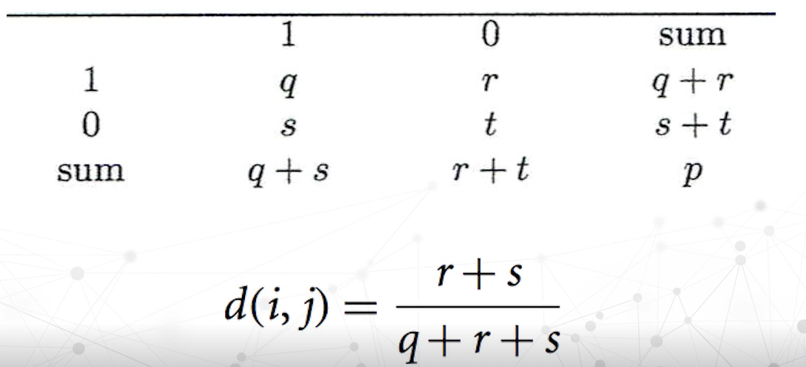{width=65%}
</figure>

于是上面这个例子的 Jaccard 距离就为 $\dfrac{2}{3} = 0.66$

如果需要比较的属性是数据

- 欧氏距离：即两点间的距离公式
    $$ d_{Euc} = \sqrt{\sum_{i=1}^{d} |P_i - Q_i|^2} $$
- 曼哈顿距离：各属性差值的绝对值之和
    $$ d_{CB} = \sum_{i=1}^{d} |P_i - Q_i| $$
- 闵可夫斯基距离：可以把上面的两种距离用统一的公式来表示
    $$ d_{Mk} = \sqrt[P]{ \sum_{i=1}^{d} |P_i - Q_i|^p } $$
    其中 $p$ 是一个正整数，$p=2$ 时为欧氏距离，$p=1$ 时为曼哈顿距离。

### 数据科学

获取数据时可能由于人工失误、机器故障等原因导致数据质量不佳。

- 准确性：数据的值是否正确
- 完整性
- 一致性：数据单位等是否一致
- 时效性
- 真实性
- 可解释性：数据是否存在语义上的解释

数据清洗：纠正数据中的错误和不一致，提高数据质量

- 数据库的完整性约束有助于帮助我们发现数据质量问题
- 但这些约束依赖于我们事先定义好的问题，对于潜在的、未知的问题，有时我们可以通过排序、分组、生成视图（例如节点链接图、矩阵视图）等可视化方法来发现数据质量问题

### 可视化

按信息复杂程度，可视化方法可分为*原始数据可视化*、*统计结果可视化*、*多协同视图*三类

- 数据轨迹：*单变量数据*呈现方法，将自变量与因变量在图中用点呈现
    - 展示数据分布、走势和离群异常点
- 柱状图、饼状图、直方图、
- 等高线图：把相等数值所在位置用曲线连接起来
- 走势图、散点图/散点图矩阵
- 热力图：用于有三个维度的数据，把第三个维度的数值用颜色表示出来
    - 例如用热力图表示西湖周边出行人数
- 箱线图：
    <figure markdown="span">
        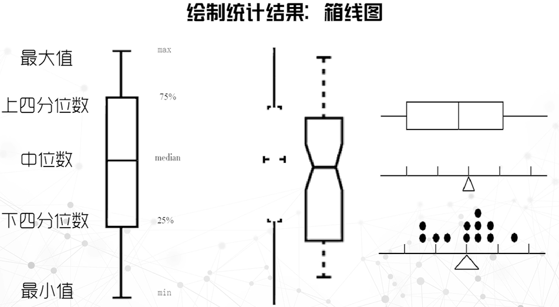{width=65%}
    </figure>    

多协同视图就是把多个视图组合在一起，每个视图展示数据某个维度的属性，形成一个多维数据的可视化界面

数据挖掘：从大型数据库、网络等发现和提取、模式特征、知识
    
- 挖掘非常规的或以前未知的信息

<figure markdown="span">
    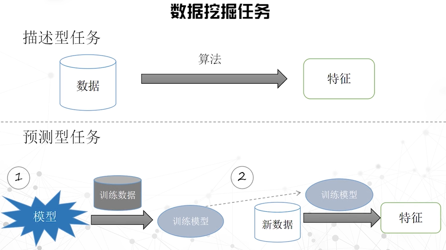{width=65%}
</figure>

- 描述型任务
    - 概念描述
    - 关联描述
    - 聚类
    - 异常分析
- 预测型任务
    - 分类：寻找一个模型或算法来实现对数据的分类
    - 演化分析：建立模型来表示数据在时间和空间中的变化规律，用于预测未知对象的时空行为

## 数据可视化基础

!!! note "格式塔(Gestalt)原则"

    > 格式塔原则认为结构比元素重要，视觉形象首先作为统一的整体被认知

    **特性**：

    - 接近性（proximity）：相互接近的对象容易被视为一组

        <figure markdown="span">
            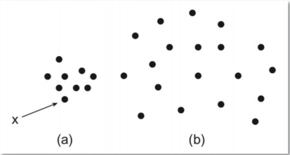{width=55%}
        </figure>

    - 相似性（similarity）：形状、颜色等相似的对象会被视为一组

        <figure markdown="span">
            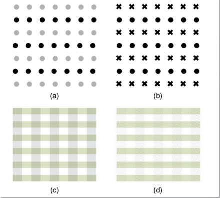{width=55%}
        </figure>

    - 连续性（continuity）：人脑更倾向于把对象视为连续的

        <figure markdown="span">
            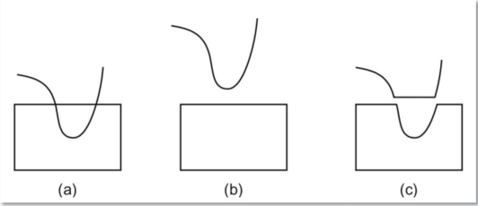{width=55%}
        </figure>

    - 闭合性（closure）

        <figure markdown="span">
            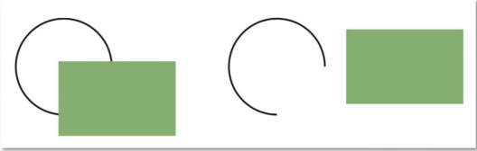{width=55%}
        </figure>

    - 简单性（simplicity）：人脑倾向于把对象识别为最简单的模式

        <figure markdown="span">
            {width=55%}
        </figure>

    **原则**：

    - 共势原则(common fate)

        <figure markdown="span">
            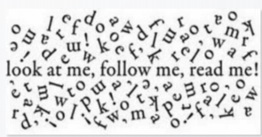{width=55%}
        </figure>

    - 好图原则(pragnanz)

        <figure markdown="span">
            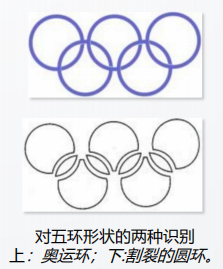{width=55%}
        </figure>

    - 对称原则(symmetry)

        <figure markdown="span">
            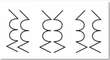{width=55%}
        </figure>

    - 经验原则(past experience)

        <figure markdown="span">
            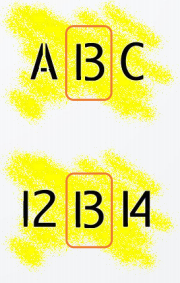{width=55%}
        </figure>

### 视觉编码原则

数据类型：

- 连续型（量化型）
    - 定距型（interval）：数值之间的差异有意义，但比值没有意义，且没有绝对零点

        例如日期、地点

    - 定比型（ratio）：数值之间的差异和比值都有意义，且有绝对零点

        例如长度、质量、温度（开尔文温标）

- 序数型

    - 小、中、大

- 类别型（定类 nominal）

#### 视觉编码

以点、线、面、体为基本元素，使用颜色、形状、大小、方向等视觉属性（通道）对数据进行编码

- Marks：点、线、面、体等几何元素
- Channels：颜色、形状、大小、方向、长度、角度等视觉属性
- Encoding：将数据映射到视觉属性的过程

<figure markdown="span">
    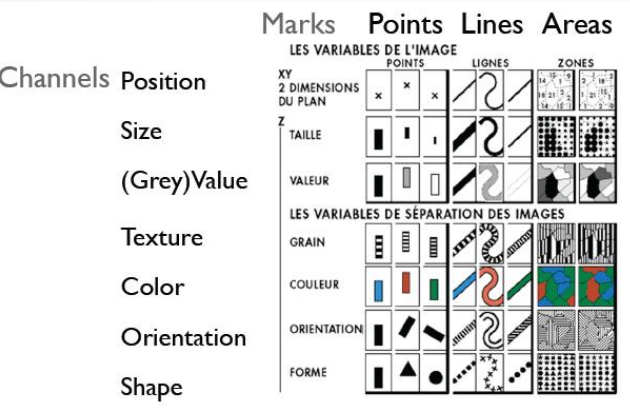{width=65%}
</figure>

不同的通道在表示不同类型的数据时具有不同的有效性

<figure markdown="span">
    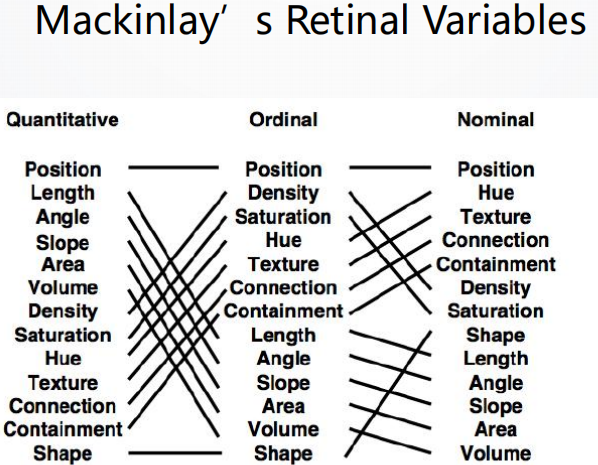{width=65%}
</figure>

#### popout

当我们让某个（某些）元素与其他的元素在视觉上有明显的区别时，这个元素就会从其他元素中突出处理，我们称之为 popout

这在很多视觉通道上都有效果，例如颜色、形状、方向、大小等，但并非所有的通道都能有比较显著的效果

<figure markdown="span">
    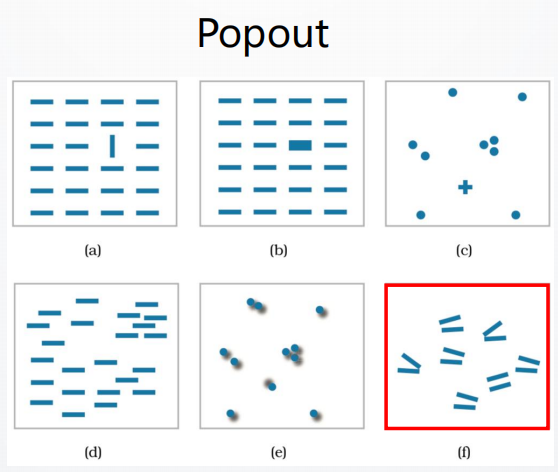{width=65%}
</figure>

#### grouping

当我们让某些元素在视觉上有明显的区别时，这些元素就会被分为一组，我们称之为 grouping

- containment：包含
- connection：连接
- proximity：接近
- similarity：相似性

<figure markdown="span">
    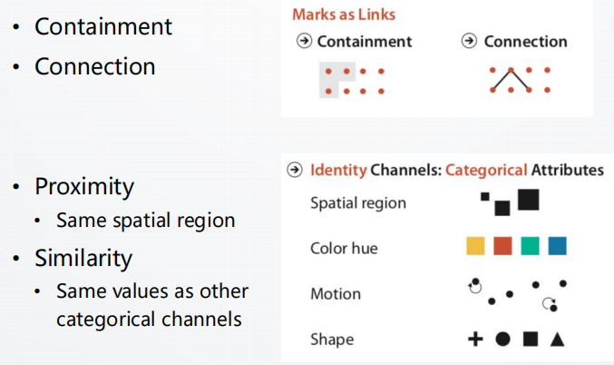{width=65%}
</figure>

#### color

- 在小区域中颜色难以辨认，而在大区域中明亮的颜色看起来会显得更大。因此我们应该在小区域中使用明亮、饱和度高的颜色，在大区域使用低饱和度的颜色（如粉色）
- 当色彩数量较少时，它才适合用于分类数据的可视化，因此我们在表示分类数据时使用的色彩不应超过 8 种
- 亮度和饱和度在认知中有隐式的有序关系，可以用于排序数据（例如不同数值的数据使用不同的亮度或饱和度来表示）

### 视觉分析模型

<figure markdown="span">
    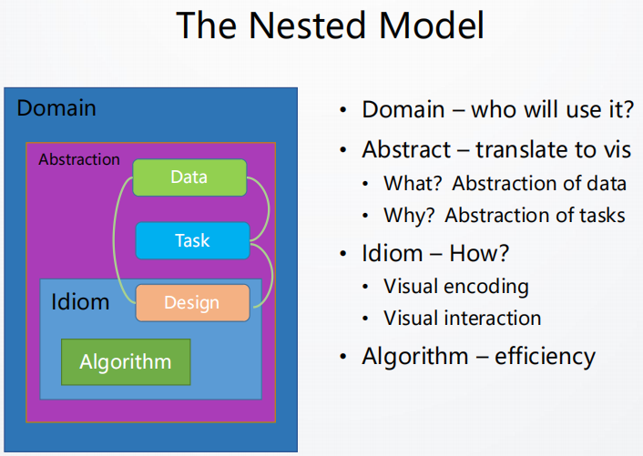{width=65%}
</figure>

<figure markdown="span">
    {width=65%}
</figure>

