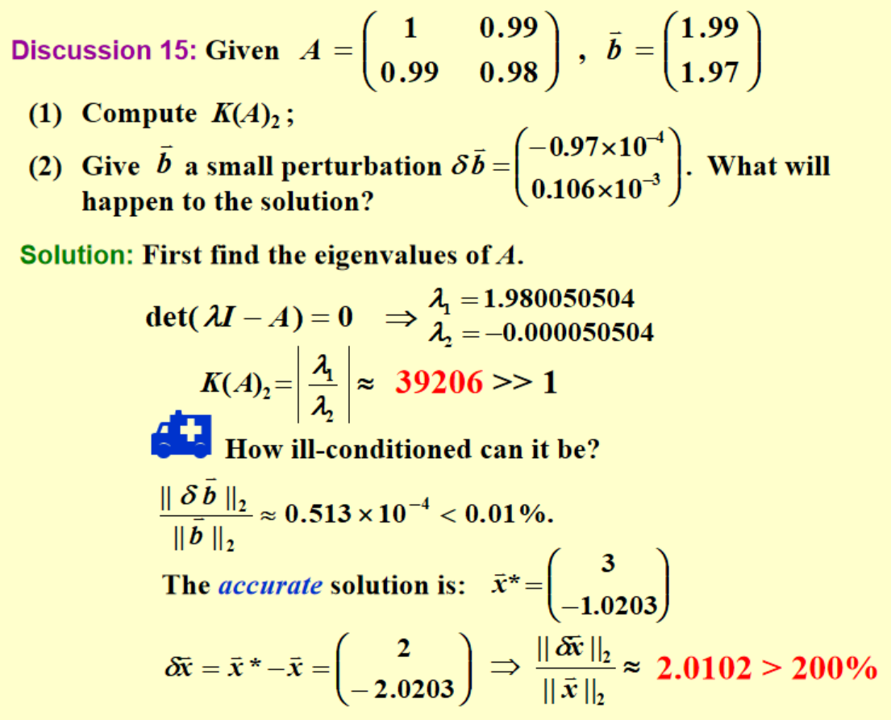

# Chap 7: Iterative Techniques in Matrix Algebra

假设我们要求解线性方程组 $A\vec{x} = \vec{b}$，其中 $A$ 是一个大型稀疏矩阵。直接方法（如高斯消去法）在这种情况下可能效率低下且耗费大量内存。

思路：我们可以通过迭代方法来近似求解该方程，思路类似于用定点迭代法求解方程，我们可以把方程 $A\vec{x} = \vec{b}$ 重写为以下的形式：
$$ \vec{x} = T\vec{x} + \vec{c} $$ 
因此我们就可以通过式子 $\vec{x}^{(k+1)} = T\vec{x}^{(k)} + \vec{c}$ 来迭代求解 $\vec{x}$ 的近似值。

## Norms of Vectors and Matrices

### Vector Norms

!!! definition "向量范数"
    $\mathbf{R}^n$ 上的向量范数是一个函数 $||\cdot||: \mathbf{R}^n \rightarrow \mathbf{R}$，满足以下性质：

    1. 非负性（正定性）：$||\vec{x}|| \geq 0;\ ||\vec{x}|| = 0 \iff \vec{x} = \vec{0} \quad (\vec{x} \in \mathbf{R}^n)$
    2. 齐次性：$||\alpha \vec{x}|| = |\alpha| \cdot ||\vec{x}|| \quad (\alpha \in \mathbf{R},\ \vec{x} \in \mathbf{R}^n)$
    3. 三角不等式：$||\vec{x} + \vec{y}|| \leq ||\vec{x}|| + ||\vec{y}|| \quad (\vec{x}, \vec{y} \in \mathbf{R}^n)$

!!! note "常见的向量范数"
    - **1-范数**：$||\vec{x}||_1 = \sum_{i=1}^{n} |x_i|$
    - **2-范数**（欧几里得范数）：$||\vec{x}||_2 = \sqrt{\left( \sum\limits_{i=1}^{n} |x_i|^2 \right)}$
    - **$p$-范数**：$||\vec{x}||_p = \left( \sum\limits_{i=1}^{n} |x_i|^p \right)^{\frac{1}{p}} \quad (p \geq 1)$
    - **无穷范数**：$||\vec{x}||_\infty = \max\limits_{1 \leq i \leq n} |x_i|$
        - 可以视为 $p \to \infty$ 条件下的 $p$-范数

!!! definition "向量的收敛性"
    我们称 $\mathbf{R}^n$ 上的向量序列 $\{\vec{x}^{(k)}\}_{k=1}^{+\infty}$ 依照范数 $||\cdot||$ 收敛于 $\vec{x} \in \mathbf{R}^n$，当且仅当对于任意的 $\varepsilon > 0$，存在正整数 $N$，使得当 $k > N$ 时，有
    $$ ||\vec{x}^{(k)} - \vec{x}|| < \varepsilon $$

!!! theorem 
    对于无穷范数 $||\cdot||_\infty$，向量序列 $\{\vec{x}^{(k)}\}_{k=1}^{+\infty}$ 收敛于 $\vec{x} \in \mathbf{R}^n$ 的充分必要条件是对于每个分量 $i = 1, 2, \ldots, n$，数列 $\{x_i^{(k)}\}_{k=1}^{+\infty}$ 收敛于 $x_i$。

    即
    $$ \lim_{k \to +\infty} \vec{x}^{(k)} = \vec{x} \iff \lim_{k \to +\infty} x_i^{(k)} = x_i,\quad i = 1, 2, \ldots, n $$

!!! definition "向量范数的等价性"
    在 $\mathbf{R}^n$ 上的两个向量范数 $||\cdot||_\alpha$ 和 $||\cdot||_\beta$ 称为等价的，如果存在正常数 $c_1, c_2 > 0$，使得对于任意 $\vec{x} \in \mathbf{R}^n$，都有
    $$ c_1 ||\vec{x}|| _ \alpha \leq ||\vec{x}|| _ \beta \leq c_2 ||\vec{x}|| _ \alpha $$

!!! theorem "向量范数的等价性定理"
    事实上，$\mathbf{R}^n$ 上的任意两个向量范数都是等价的。

??? example "$||\cdot||_2$ 和 $||\cdot||_\infty$ 是等价的"
    假设 $\vec{x}$ 中最大的一个分量为 $|x_m| = \max_{1 \leq i \leq n} |x_i|$，那么
    $$ ||\vec{x}||_\infty = |x_m| $$
        
    我们知道
    $$ ||\vec{x}||_2 = \sqrt{\sum_{i=1}^{n} |x_i|^2} \geq ||\sqrt{|x_m|^2}|| = |x_m| = ||\vec{x}||_\infty $$

    并且我们还有
    $$ ||\vec{x}||_2 = \sqrt{\sum_{i=1}^{n} |x_i|^2} \leq \sqrt{\sum_{i=1}^{n} |x_m|^2} = \sqrt{n|x_m|^2} = \sqrt{n} ||\vec{x}||_\infty $$

    所以 $||\vec{x}|| _ \infty \leq ||\vec{x}||_2 \leq \sqrt{n} ||\vec{x}|| _ \infty$，即 $c_1 = 1,\ c_2 = \sqrt{n}$，从而 $||\cdot||_2$ 和 $||\cdot|| _ \infty$ 是等价的。

### Matrix Norms

!!! definition "矩阵范数"
    在 $\mathbf{R}^{n \times n}$ 上的矩阵范数是一个实值函数 $||\cdot||: \mathbf{R}^{n \times n} \rightarrow \mathbf{R}$，满足以下性质：

    1. **非负性（正定性）**：$||A|| \geq 0;\ ||A|| = 0 \iff A = 0$
    2. **齐次性**：$||\alpha A|| = |\alpha| \cdot ||A|| \quad (\alpha \in \mathbf{R})$
    3. **三角不等式**：$||A + B|| \leq ||A|| + ||B||$
    4. **一致性**：$||AB|| \leq ||A|| \cdot ||B||$

    我们通过矩阵范数定义两个矩阵之间的**距离**：$d(A, B) = ||A - B||$。

!!! note "常见的矩阵范数"
    - **Frobenius 范数**：
        $$ ||A|| _ F = \sqrt{\sum _ {i=1}^{n} \sum _ {j=1}^{n} |a _ {ij}|^2} $$

        即所有元素的平方和的平方根。

    - **自然范数**：（也称为算子范数）
        $$ ||A|| _ p = \max _ {||\vec{x}|| _ p \neq 0} \frac{||A\vec{x}|| _ p}{||\vec{x}|| _ p} $$

        如此定义的矩阵范数称为与向量范数 $||\cdot||_p$ 相关的自然矩阵范数。（也称为 $p$-范数）

        1. 1-范数：
            $$ ||A|| _ 1 = \max _ {1 \leq j \leq n} \sum _ {i=1}^{n} |a _ {ij}| $$
            即矩阵各列元素绝对值之和的最大值。
        2. 无穷范数：
            $$ ||A|| _ \infty = \max _ {1 \leq i \leq n} \sum _ {j=1}^{n} |a _ {ij}| $$
            即矩阵各行元素绝对值之和的最大值。
        3. 2-范数（spectral norm）：
            $$ ||A|| _ 2 = \sqrt{\lambda _ {\max}(A^TA)} $$
            其中 $\lambda _ {\max}(A^TA)$ 是矩阵 $A^TA$ 的最大特征值。

!!! tip "推论"
    根据 $p$-范数的定义，对于任意向量 $\vec{z} \neq 0$ 和矩阵 $A$ 以及任意一个自然范数 $||\cdot||$，都有
    $$ \frac{||A\vec{z}||}{||\vec{z}||} \leq ||A|| $$
    即
    $$ ||A\vec{z}|| \leq ||A|| \cdot ||\vec{z}|| $$

## Eigenvalues and Eigenvectors

### Spectral Radius

!!! definition "谱半径"
    矩阵 $A \in \mathbf{R}^{n \times n}$ 的**谱半径**定义为其所有特征值的模的最大值，即
    $$ \rho(A) = \max_{1 \leq i \leq n} |\lambda_i| $$
    其中 $\lambda_1, \lambda_2, \ldots, \lambda_n$ 是矩阵 $A$ 的全部特征值。

!!! theorem 
    对于任意矩阵 $A \in \mathbf{R}^{n \times n}$ 和任意自然范数，都有
    $$ \rho(A) \leqslant ||A|| $$

    ??? proof
        对于任意特征值 $\lambda_i$ 及其对应的特征向量 $\vec{x}_i$，有
        $$ |\lambda _ i| \cdot ||\vec{x} _ i|| = ||\lambda _ i \vec{x} _ i|| = ||A \vec{x} _ i|| \leqslant ||A|| \cdot ||\vec{x} _ i|| $$
        因此
        $$ |\lambda _ i| \leqslant ||A|| $$
        由于上述不等式对任意 $i = 1, 2, \ldots, n$ 都成立，所以
        $$ \rho(A) = \max _ {1 \leq i \leq n} |\lambda _ i| \leqslant ||A|| $$

!!! definition "矩阵的收敛"
    若对于任意的 $i, j = 0, 1, \cdots, n$，我们都有
    $$ \lim_{k \to +\infty} (A^k)_{ij} = 0 $$
    则称矩阵 $A$ 是收敛的。

## Iterative Techniques for Solving Linear Systems

当线性方程组的维度不高时，我们可以直接使用高斯消元法计算其解；但当线性方程组的维度较高时，直接方法的计算量和存储需求会急剧增加，此时我们可以使用迭代方法来近似求解该线性方程组。

### Jacobi Iterative Method

对于线性方程组
$$ \begin{cases}
a_{11}x_1 + a_{12}x_2 + \dots + a_{1n}x_n = b_1 \\\\ 
a_{21}x_1 + a_{22}x_2 + \dots + a_{2n}x_n = b_2 \\\\ 
\dots \\\\ 
a_{n1}x_1 + a_{n2}x_2 + \dots + a_{nn}x_n = b_n
\end{cases}$$

当 $a_{ii} \ne 0$ 时，不难得到：
$$ \begin{cases}
x_1 = \dfrac{1}{a_{11}}(-a_{12}x_2 - \dots - a_{1n}x_n + b_1) \\\\\\\\ 
x_2 = \dfrac{1}{a_{22}}(-a_{21}x_1 - \dots - a_{2n}x_n + b_1) \\\\
\cdots \\\\
x_n = \dfrac{1}{a_{nn}}(-a_{n1}x_1 - \dots - a_{1n, n-1}x_{n-1} + b_n) 
\end{cases} $$

<figure markdown="span">
    {width=45%}
</figure>

如上图所示，我们把矩阵 $A \in \mathbf{R}^{n \times n}$ 分解为 $A = D - L - U$，其中 $D$ 是 $A$ 的对角矩阵部分，$-L$ 是 $A$ 的严格下三角部分，$-U$ 是 $A$ 的严格上三角部分。

那么方程组 $A\vec{x} = \vec{b}$ 可以写成
$$ \begin{aligned}
A\vec{x} = \vec{b} &\iff (D - L - U)\vec{x} = \vec{b} \\\\
&\iff D\vec{x} = (L + U)\vec{x} + \vec{b} \\\\
&\iff \vec{x} = D^{-1}(L + U)\vec{x} + D^{-1}\vec{b}
\end{aligned} $$

为公式的简洁起见，我们引入两个记号
$$ T_j = D^{-1}(L + U), \quad \vec{c}_j = D^{-1}\vec{b} $$

于是，线性方程组 $A\vec{x} = \vec{b}$ 可以写成迭代形式：
$$ \vec{x} = T_j \vec{x} + \vec{c}_j $$

!!! tip
    所有的对角元取倒数就可以得到对角矩阵的逆矩阵

!!! note "Jacobi 迭代法的伪代码"
    <figure markdown="span">
        {width=75%}
    </figure>

### Gauss-Seidel Iterative Method

不难知道，在 Jacobi 迭代法中，第 $k+1$ 次迭代计算 $\vec{x}^{(k+1)}$ 的每个分量时，均使用了上一次迭代 $\vec{x}^{(k)}$ 中的所有分量值。也即是说我们必须要等到第 $k$ 次迭代完全结束后，才能进行第 $k+1$ 次迭代，效率较低。

我们可以改用 Gauss-Seidel 迭代法来提高效率。在 Gauss-Seidel 迭代法中，第 $k+1$ 次迭代计算 $\vec{x}^{(k+1)}$ 的每个分量时，使用了已经计算出的 $\vec{x}^{(k+1)}$ 中的分量值以及 $\vec{x}^{(k)}$ 中的分量值。

首先观察线性方程组的解：

$$ \begin{aligned}
x_2^{(k)} &= \dfrac{1}{a_{22}}(\textcolor{red}{-a_{21}x_1^{(k)}} - a_{23}x_3^{(k-1)} - a_{24}x_4^{(k-1)} - \dots - a_{2n}x_n^{k-1} + b_2) \\
x_3^{(k)} &= \dfrac{1}{a_{33}}(\textcolor{red}{-a_{31}x_1^{(k)} - a_{32}x_2^{(k)}} - a_{34}x_4^{(k-1)} - \dots - a_{3n}x_n^{k-1} + b_3) \\
\dots \\
x_n^{(k)} &= \dfrac{1}{a_{nn}}(\textcolor{red}{-a_{n1}x_1^{(k)} -a_{n2}x_2^{(k)} -a_{n3}x_3^{(k)} - \dots - a_{n, n-1}x_{n-1}^{k}} + b_n)
\end{aligned} $$

也就是说，我们可以使用式子
$$ x_i^{(k)} = \dfrac{1}{a_{ii}} \left( -\sum_{j=1}^{i-1} a_{ij} x_j^{(k)} - \sum_{j=i+1}^{n} a_{ij} x_j^{(k-1)} + b_i \right),\quad i = 1, 2, \ldots, n $$

即使用当前迭代的已经得到的前 $i-1$ 个分量值以及上一次迭代的后 $n-i$ 个分量值来计算当前迭代的第 $i$ 个分量值。

将其用矩阵形式表达，即为：
$$ \begin{aligned}
& \vec{x}^{(k)} = D^{-1} (L\vec{x}^{(k)} + U\vec{x}^{(k-1)}) + D^{-1} \vec{b} \\\\
\iff & (D - L)\vec{x}^{(k)} = U\vec{x}^{(k-1)} + \vec{b} \\\\
\iff & \vec{x}^{(k)} = (D - L)^{-1} U\vec{x}^{(k-1)} + (D - L)^{-1} \vec{b}
\end{aligned} $$

类似地，我们引入两个记号
$$ T_g = (D - L)^{-1} U, \quad \vec{c}_g = (D - L)^{-1} \vec{b} $$

因此该迭代法的递推公式就为
$$ \vec{x}^{(k)} = T_g \vec{x}^{(k-1)} + \vec{c}_g $$

!!! note "Gauss-Seidel 迭代法的伪代码"
    <figure markdown="span">
        {width=75%}
    </figure>

!!! tip
    上述两个迭代方法并不总是能保证收敛，并且存在其中一种迭代法成功，另一种迭代法失败的情况。

### Convergence of Iterative Method

接下来我们来考虑迭代法 $\vec{x}^{(k+1)} = T\vec{x}^{(k)} + \vec{c}$ 的收敛性问题。

!!! theorem
    以下命题是等价的：

    - $A$ 是一个收敛矩阵
    - 对于**某些**自然范数，有 $\lim\limits_{k \to +\infty} ||A^k|| = 0$
    - 对于**所有的**自然范数，有 $\lim\limits_{k \to +\infty} ||A^k|| = 0$
    - 谱半径 $\rho(A) < 1$
    - 对于所有的向量 $\vec{x} \in \mathbf{R}^n$，都有 $\lim\limits_{k \to +\infty} A^k \vec{x} = \vec{0}$

!!! note 
    考虑迭代 $k$ 次后的误差
    $$ \begin{aligned}
    \vec{e}^{(k)} &= \vec{x}^{(k)} - \vec{x}^ * \\\\
    &= T\vec{x}^{(k-1)} + \vec{c} - (T\vec{x}^ * + \vec{c}) \\\\
    &= T(\vec{x}^{(k-1)} - \vec{x}^ * ) \\\\
    &= T\vec{e}^{(k-1)} \\\\
    \end{aligned} $$

    根据上述递推式，我们可以得到 $\vec{e}^{(k)} = T^k \vec{e}^{(0)}$，因此
    $$ ||\vec{e}^{(k)}|| \leqslant ||T||^k \cdot ||\vec{e}^{(0)}|| $$

    - 充分条件：如果存在某个自然范数使得 $||T|| < 1$，则 $\lim\limits_{k \to +\infty} ||\vec{e}^{(k)}|| = 0$，即迭代收敛。
    - 必要条件：如果迭代收敛，则 $\lim\limits_{k \to +\infty} ||\vec{e}^{(k)}|| = 0$，即 $\lim\limits_{k \to +\infty} ||T^k|| = 0$，根据上一个定理可知，$\rho(T) < 1$。

!!! theorem
    对于任意 $\vec{x}^{(0)}$，由迭代 $\vec{x}^{(k+1)} = T\vec{x}^{(k)} + \vec{c}$ 定义的序列 $\{\vec{x}^{(k)}\}$ 会收敛到方程 $\vec{x} = T\vec{x} + \vec{c}$ 的唯一解，当且仅当谱半径 $\rho(T) < 1$。

    ??? proof
        - 假设 $\rho(T) < 1$，那么就有
            $$ \begin{aligned}
            \vec{x}^{(k)} &= T\vec{x}^{(k-1)} + \vec{c} = T(T\vec{x}^{(k-2)} + \vec{c}) + \vec{c} \\\\
            &= T^2 \vec{x^{(k-2)}} + (T + I)\vec{c} \\\\
            &= \dots \\\\
            &= \cancel{} + (\textcolor{red}{T^{k-1} + \dots + T + I})\vec{c} 
            \end{aligned} $$

            因为当 $\rho(T) < 1$ 时，$(I - T)^{-1} = \sum\limits_{j=0}^{+\infty} T^j$ 收敛，所以
            $$ \lim_{k \to +\infty} \vec{x}^{(k)} = \lim_{k \to +\infty} T^k \vec{x}^{(0)} + \lim_{k \to +\infty}(I - T)^{-1} \vec{c} = (I - T)^{-1} \vec{c} $$

            这里，因为 $\lim_{k \to +\infty} T^k \vec{x}^{(0)} = \vec{0}$，所以 $\vec{x}^{(k)}$ 收敛到 $(I - T)^{-1} \vec{c}$。

        - 反之，假设迭代收敛到某个 $\vec{x}^*$，即绝对误差 $\lim\limits_{k \to +\infty} \vec{e}^{(k)} = 0$，那么根据上面的结论，我们有
            $$ \begin{aligned}
            \lim_{k \to +\infty} \vec{e}^{(k)} = \vec{0} &\iff \lim_{k \to +\infty} T^k \vec{e}^{(0)} = \vec{0} \quad \text{for any } \vec{e}^{(0)} \\\\
            &\iff \lim_{k \to +\infty} ||T^k|| = 0 \\\\
            &\iff \rho(T) < 1
            \end{aligned} $$

!!! theorem
    如果对于任意的自然矩阵范式 $||\cdot||$，都有 $||T|| < 1$，并且给定向量 $\vec{c}$，则由迭代 $\vec{x}^{(k)} = T\vec{x}^{(k-1)} + \vec{c}$ 定义的序列 $\{\vec{x}^{(k)}\}_{k=0}^{+\infty}$ 对任意初始向量 $\vec{x}^{(0)}$ 都收敛到方程 $\vec{x} = T\vec{x} + \vec{c}$ 的唯一解 $\vec{x}^*$，并且有以下的误差界：

    1. $||\vec{x}^* - \vec{x}^{(k)}|| \leqslant ||T||^k ||\vec{x}^{(0)} - \vec{x}^*||$
    2. $||\vec{x}^* - \vec{x}^{(k)}|| \leqslant \dfrac{||T||^k}{1 - ||T||} ||\vec{x}^{(1)} - \vec{x}^{(0)}||$

    上面的第一条是在说，谱半径 $\rho(T)$ 越小，迭代收敛得越快；第二条则是告知了我们，若想达到某个精度，则至少需要迭代的次数 $k$。

!!! theorem
    如果 $A$ 是一个严格对角占优矩阵，那么对于任意选择的初始近似解 $\vec{x^{(0)}}$，无论使用雅可比方法还是高斯-塞德尔方法，都可以让序列 $\{ \vec{x^{(k)}} \}_{k=0}^\infty$ 收敛到 $A\vec{x} = \vec{b}$ 的唯一解。

    !!! tip
        大致的证明思路是，证明对于任意的 $|\lambda| \geq 1$，都有 $|\lambda I - T| \neq 0$（行列式不为零），从而说明 $T$ 的所有特征值的模都小于 1，即 $\rho(T) < 1$，从而根据前面的定理可知迭代收敛。

### Relaxation Methods

!!! note "残差向量"
    假设 $\tilde{\vec{x}} \in \mathbb{R}^n$ 是线性方程组 $A \vec{x} = \vec{b}$ 的近似解，那么关于该线性方程组的 $\tilde{\vec{x}}$ 的**残差向量**(residual vector)为 $\vec{r} = \vec{b} - A \tilde{\vec{x}}$

我们可以从残差向量的角度来观察 Guass-Seidel 迭代法：
$$ \begin{aligned}
x_i^{(k)} & = \dfrac{1}{a_{ii}} \Big[ b_i - \sum_{j=1}^{i-1} a_{ij} x_i^{(k)} - \sum_{j=i+1}^n a_{ij} x_j^{(k-1)} \Big] \\\\
& = x_i^{(k-1)} + \dfrac{r_i^{(k)}}{a_{ii}}
\end{aligned} $$

其中 $r_i^{(k)} = b_i - \sum\limits_{j < i} a_{ij} x_j^{(k)} - \sum\limits_{j \ge i} a_{ij} x_j^{(k-1)}$ 为第 $k$ 次迭代时的第 $i$ 个残差分量。

我们可以添加一个参数 $\omega$ 来控制每次迭代的步长并且减少残差向量的范数大小，从而得到**松弛法**(relaxation method)：
$$ x_i^{(k)} = x_i^{(k-1)} + \omega \dfrac{r_i^{(k)}}{a_{ii}} $$

根据 $\omega$ 的取值不同，松弛法可以分为以下三种情况：

1. $0 < \omega < 1$：**欠松弛法**(under-relaxation methods)，可使由 Gauss-Seidel 方法不能收敛的方程组收敛
2. $\omega = 1$：即退化为 Gauss-Seidel 方法
3. $\omega > 1$：**逐次超松弛法**(Successive Over-Relaxation methods, **SOR**)，可加快 Gauss-Seidel 方法的收敛速度
    - 通常能加快收敛，这会使得迭代步长增大，更快逼近真实解

引入松弛因子 $\omega$ 后，迭代形式变为
$$ \begin{aligned}
\vec{x} _ i^{(k)} &= \vec{x} _ i^{(k-1)} + \omega \frac{r _ i^{(k)}}{a _ {ii}} \\\\
&= \vec{x} _ i^{(k-1)} + \frac{\omega}{a _ {ii}} \left( b _ i - \sum _ {j=1}^{i-1} a _ {ij} x _ j^{(k)} - \sum _ {j=i}^{n} a _ {ij} x _ j^{(k-1)} \right) \\\\
&= (1 - \omega) \vec{x} _ i^{(k-1)} + \frac{\omega}{a _ {ii}} \left( - \sum _ {j=1}^{i-1} a _ {ij} x _ j^{(k)} - \sum _ {j=i+1}^{n} a _ {ij} x _ j^{(k-1)} + b _ i \right)
\end{aligned} $$

所以写成矩阵形式就得到
$$ \begin{aligned}
\vec{x}^{(k)} &= (1 - \omega) \vec{x}^{(k-1)} + \omega D^{-1} [L \vec{x^{(k)}} + U \vec{x^{(k-1)}} + \vec{b}] \\\\
&= (D - \omega L)^{-1} [(1 - \omega) D + \omega U] \vec{x}^{(k-1)} + \omega (D - \omega L)^{-1} \vec{b}
\end{aligned} $$

同样引入记号
$$ T_\omega = (D - \omega L)^{-1} [(1 - \omega) D + \omega U], \quad \vec{c}_\omega = \omega (D - \omega L)^{-1} \vec{b} $$

即可得到
$$ \vec{x}^{(k)} = T_\omega \vec{x}^{(k-1)} + \vec{c}_\omega $$

!!! theorem "几个定理"
    - **Kahan 定理**：若 $a_{ii} \ne 0\ (i = 1, 2, \dots, n)$，那么 $\rho(T_\omega) \ge |\omega - 1|$，这也就意味着 SOR 方法仅在 $0 < \omega < 2$ 时收敛。
    - **Ostrowski-Reich 定理**：若 $A$ 是**正定矩阵**且 $0 < \omega < 2$，那么 SOR 方法对于任意初始近似解均能收敛。
    - 如果 $A$ 是**正定**的**三对角矩阵**，那么 $\rho(T_g) = |\rho(T_j)|^2 < 1$，且 SOR 方法中 $\omega$ 的最优选择是 $\omega = \dfrac{2}{1 + \sqrt{1 - |[\rho(T_j)]^2|}}$，此时 $\rho(T_\omega) = \omega - 1$。

!!! note "SOR 迭代法的伪代码"
    <figure markdown="span">
        {width=75%}
    </figure>

!!! example "一个例题"
    <figure markdown="span">
        {width=75%}
    </figure>

## Error Bounds and Iterative Refinement

!!! note "目标"
    这一小节研究 $A$ 和 $\vec{b}$ 的误差会如何影响 $A\vec{x} = \vec{b}$ 的解 $\vec{x}$。

- 假设 $A$ 是准确的，但 $\vec{b}$ 有误差 $\delta \vec{b}$，那么带有误差的解可以写作 $\vec{x} + \delta \vec{x}$，可以得到
    $$ A(\vec{x} + \delta \vec{x}) = \vec{b} + \delta \vec{b} $$
    $$ \implies \frac{\|\delta \vec{x}\|}{\|\vec{x}\|} \leqslant \|A\| \cdot \|A^{-1}\| \cdot \frac{\|\delta \vec{b}\|}{\|\vec{b}\|} $$

    其中 $\|A\| \cdot \|A^{-1}\|$ 是相对放大因子（relative amplification factor），也称为**条件数**(condition number)。

    ??? tip
        由 $\vec{b} = A\vec{x}$ 可知 $\|\vec{b}\| \leqslant \|A\| \cdot \|\vec{x}\|$，所以
        $$ \frac{1}{\|\vec{x}\|} \leqslant \frac{\|A\|}{\|\vec{b}\|} $$

        同时我们还知道
        $$ A \delta \vec{x} = \delta \vec{b} \implies \delta \vec{x} = A^{-1} \delta \vec{b} \implies \|\delta \vec{x}\| \leqslant \|A^{-1}\| \cdot \|\delta \vec{b}\| $$
        
        进而可以得到
        $$ \frac{\|\delta \vec{x}\|}{\|\vec{x}\|} \leqslant \|A\| \cdot \|A^{-1}\| \cdot \frac{\|\delta \vec{b}\|}{\|\vec{b}\|} $$

!!! theorem
    如果矩阵 $B$ 在某些自然范数上满足 $\| B \| < 1$，那么：

    - $I \pm B$ 是非奇异的
    - $\| (I \pm B)^{-1} \| \le \dfrac{1}{1 - \| B \|}$

- 假设 $\vec{b}$ 是准确的，但 $A$ 有误差 $\delta A$，那么带有误差的解可以写作 $\vec{x} + \delta \vec{x}$，可以得到
$$ (A + \delta A)(\vec{x} + \delta \vec{x}) = \vec{b} $$

    我们可以推导得到
    $$ \begin{aligned}
    \frac{\|\delta \vec{x}\|}{\|\vec{x}\|} &\leqslant \frac{\|A^{-1}\| \cdot \|\delta A\|}{1 - \|A\| \cdot \|A^{-1}\|} \\\\ 
    &= \frac{\|A^{-1}\| \cdot \|A\| \cdot \frac{\|\delta A\|}{\| A \|}}{1 - \|A^{-1}\| \cdot \|A\| \cdot \frac{\|\delta A\|}{\| A \|}}
    \end{aligned} $$

我们可以发现在上述误差分析的式子中都出现了 $\|A\| \cdot \|A^{-1}\|$，它是误差放大的关键因子，被称为矩阵 $A$ 的**条件数**(condition number)，记作 $K(A)$。条件数越大，说明该线性方程组对数据误差越敏感，越难得到精确的数值解。

- 如果 $K(A)$ 接近1，那么矩阵 $A$ 是**良态的**(well-conditioned)
- 如果 $K(A)$ 比远大于1，那么矩阵 $A$ 是**病态的**(ill-conditioned)

!!! theorem
    假设 $A$ 是非奇异的，且 $\| \delta A \| < \dfrac{1}{\| A^{-1} \|}$。那么 $(A + \delta A) (\vec{x} + \delta \vec{x}) = \vec{b} + \delta \vec{b}$ 的解 $\vec{x} + \delta \vec{x}$ 近似于 $A \vec{x} = \vec{b}$ 的解 $\vec{x}$，相对误差为：

    $$ \dfrac{\| \delta \vec{x} \|}{\| \vec{x} \|} \le \dfrac{K(A)}{1 - K(A) \frac{\| \delta A\|}{\| A \|}} \Big(\dfrac{\| \delta A \|}{\| A \|} + \dfrac{\| \delta \vec{b} \|}{\| \vec{b} \|} \Big) $$

!!! note
    > 条件数 $K(A)_i$ 的下标 $i$ 表示所使用的自然矩阵范数类型（比如 $i=2$ 表示 2-范数）

    - 如果 $A$ 是**对称的**，那么 $K(A)_2 = \dfrac{\max |\lambda|}{\min |\lambda|}$
    - 对于所有自然范数 $\| \cdot \|_p$，都有 $K(A)_p \ge 1$
    - 对于任意的 $\alpha \in R, K(\alpha A) = K(A)$
    - 如果 $A$ 是正交的（即 $A^{-1} = A^T$），那么 $K(A)_2 = 1$
    - 对于所有的正交矩阵 $R$，都有 $K(RA)_2 = K(AR)_2 = K(A)_2$

!!! example
    <figure markdown="span">
        {width=75%}
    </figure>

### Iterative Refinement

!!! theorem
    假设 $\vec{x}^*$ 是 $A \vec{x} = \vec{b}$ 的近似解，$A$ 是一个非奇异矩阵，$\vec{r} = \vec{b} - A\vec{x}$ 是 $\vec{x}^*$ 的残差向量。那么对于任意自然范数，$\| \vec{x} - \vec{x}^* \| \le \| \vec{r} \| \cdot \| A^{-1} \|$。且如果 $\vec{x} \ne \vec{0}, \vec{b} \ne \vec{0}$，那么：
    $$
    \dfrac{\| \vec{x} - \vec{x}^* \|}{\| \vec{x} \|} \le K(A) \dfrac{\| \vec{r} \|}{\| \vec{b} \|}
    $$

**迭代改进**(iterative refinement)是一种提高线性方程组数值解精度的方法。其基本思想是：通过计算当前近似解的残差向量，然后解一个新的线性方程组来得到误差的近似值，最后将该误差近似值加到当前近似解上，从而得到一个更精确的近似解。

它的计算步骤如下：

1. $A \vec{x} = \vec{b} \Rightarrow$ 得到近似解 $\vec{x}_1$
2. $\vec{r}_1 = \vec{b} - A \vec{x}_1$
3. $A \vec{d}_1 = \vec{r}_1 \Rightarrow$ 求解新的线性方程组得到误差近似值 $\vec{d}_1$
    - 如果 $\vec{d}_1$ 是精确的，那么根据 $\vec{x}_2 = \vec{x}_1 + A^{-1} (\vec{b} - A\vec{x}_1) = A^{-1} \vec{b}$，$\vec{x}_2$ 也是精确的。
4. $\vec{x}_2 = \vec{x}_1 + \vec{d}_1$
    - 此后可以重复步骤 2-4 来进一步提高解的精度。

!!! note "迭代改进的伪代码"
    <figure markdown="span">
        {width=75%}
    </figure>
