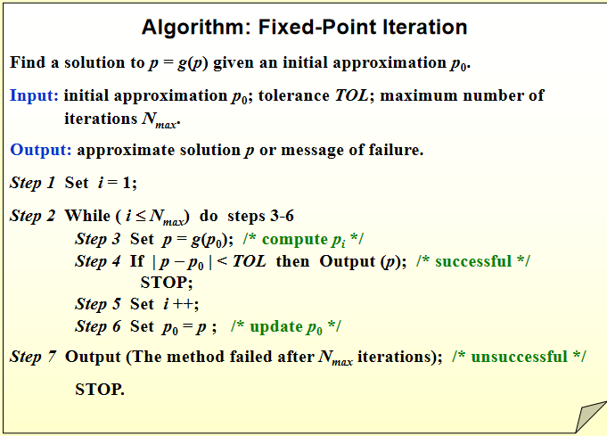
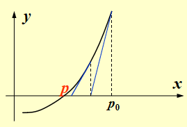
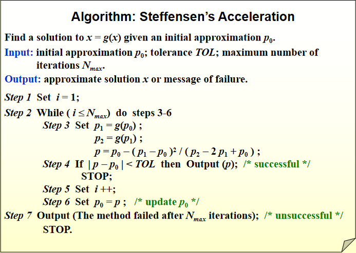

# Solutions of Equations in One Variable

## The Bisection Method

!!! theorem "介值定理"
    如果函数 $f(x)$ 在区间 $[a,b]$ 上连续（$f \in C[a,b]$），且 $K$ 的值介于 $f(a)$ 和 $f(b)$ 之间，则存在 $p \in [a,b]$ 使得 $f(p) = K$。特别地，如果 $f(a)f(b) < 0$，则存在 $p \in (a,b)$ 使得 $f(p) = 0$。

我们要寻找方程 $f(x) = 0$ 在区间 $[a,b]$ 上的根，假设 $f(a)f(b) < 0$。根据介值定理，我们可以不断使用二分法来缩小根所在的区间，直到达到所需的精度，但是这种方法收敛较慢。

!!! theorem 
    假设 $f \in C[a,b]$ 且 $f(a)f(b) < 0$，使用二分法估计方程 $f(x) = 0$ 在区间 $[a,b]$ 上的根 $p$ 时，会产生一个数列 $\{p_n\}$，其中
    $$ |p_n - p| \leqslant \frac{b-a}{2^n},\quad n \geqslant 1 $$

<figure markdown="span">
    {width=75%}
</figure>

!!! tip 
    迭代时令 $p = a + (b - a) / 2$ 而非 $p = (a+b)/2 $ 是为了避免溢出或两数相加时精度损失（比如一正一负两数相加后有效数字变少）。

- **优点**：
    - 简单，只要求函数在区间上连续
    - 可以保证收敛
- **缺点**：
    - 收敛较慢
    - 无法找到多重根和复根

## Fixed-Point Iteration

如果一个变量满足 $x = g(x)$，则称 $x$ 为 $g(x)$ 的不动点。寻找方程 $f(x) = 0$ 的根可以转化为寻找 $x = g(x)$ 的不动点。

~  我们可以通过 $p_n = g(p_{n-1})$ 来构造一个数列 $\{p_n\}$，如果这个数列收敛于 $p$($\lim\limits_{n \to \infty} p_n = p$)，并且这个函数是连续的，那么
$$ p = \lim_{n \to \infty} p_n = \lim_{n \to \infty} g(p_{n-1}) = g\left(\lim_{n \to \infty} p_{n-1}\right) = g(p) $$
我们称这种方法为不动点迭代法。

!!! definition "不动点迭代法"
    设 $g \in C[a, b]$，且对于所有的 $x \in [a, b]$，都有 $g(x) \in [a, b]$。并且假设 $g$ 在 $(a, b)$ 上的导数 $g'$ 始终满足 $|g'(x)| \leq k$，其中 $0 < k < 1$。
    
    那么对于任意的初始值 $p_0 \in [a, b]$，由 $p_n = g(p_{n-1})$，$n \geq 1$ 定义的数列 $\{p_n\}$ 收敛于 $[a, b]$ 上唯一的不动点 $p$。

    ??? proof
        - 证明存在不动点：

            不妨假设 $f(x) = g(x) - x$，且 $a \leqslant g(x) \leqslant b$，则 $f(a) = g(a) - a \geqslant 0$，$f(b) = g(b) - b \leqslant 0$。
                
            根据介值定理，存在 $p \in [a, b]$ 使得 $f(p) = 0$，即 $g(p) = p$，因此 $g$ 在 $[a, b]$ 上至少有一个不动点。

        - 证明不动点唯一：

            反证法，假设 $g$ 在 $[a, b]$ 上有两个不动点 $p$ 和 $q$，且 $p \neq q$。根据拉格朗日中值定理，存在 $\xi$ 在 $p$ 和 $q$ 之间，使得

            $$ g(p) - g(q) = g'(\xi)(p - q) $$

            即

            $$ (1 - g'(\xi))(p - q) = 0 $$

            由于 $p \neq q$，所以 $1 - g'(\xi) = 0$，即 $g'(\xi) = 1$。这与 $|g'(x)| \leqslant k < 1$ 矛盾，因此 $g$ 在 $[a, b]$ 上只有一个不动点。

        - 证明收敛性：

            $$ \begin{aligned}
            |p_n - p| &= |g(p_{n-1}) - g(p)| = |g'(\xi)||p_{n-1} - p| \leqslant k|p_{n-1} - p| \\
            &\leqslant k^2|p_{n-2} - p| \leqslant \cdots \leqslant k^n|p_0 - p|, \quad n \geqslant 1
            \end{aligned} $$

            由于 $0 < k < 1$，所以 $\lim\limits_{n \to \infty} k^n = 0$，因此 $\lim\limits_{n \to \infty} |p_n - p| = 0$，即 $\lim\limits_{n \to \infty} p_n = p$。

<figure markdown="span">
    {width=75%}
</figure>

!!! example
    <figure markdown="span">
        {width=75%}
    </figure>

## Newton’s Method (Newton-Raphson Method)

设 $p_0 \in [a, b]$ 是方程 $f(x) = 0$ 的一个近似根，$f$ 在 $[a, b]$ 上连续且可导，并且 $f'(x) \neq 0$。

考虑泰勒展开
$$ f(x) = f(p_0) + f'(p_0)(x - p_0) + \frac{f''(\xi)}{2}(x - p_0)^2 $$
其中 $\xi$ 在 $p_0$ 和 $x$ 之间。

假设 $|p - p_0|$ 很小，那么 $(p - p_0)^2$ 更小，可以忽略高阶项，那么就有
$$ 0 = f(p) \approx f(p_0) + f'(p_0)(p - p_0) $$
$$ \Rightarrow p \approx p_0 - \frac{f(p_0)}{f'(p_0)} $$
于是我们可以按照这个方式生成一个数列
$$ p_n = p_{n-1} - \frac{f(p_{n-1})}{f'(p_{n-1})},\quad n \geqslant 1 $$

!!! theorem "Newton 迭代法"
    设 $f \in C^2[a, b]$，如果存在 $p \in [a, b]$，使得 $f(p) = 0$ 且 $f'(p) \neq 0$，那么存在一个 $\delta > 0$，使得对于任意的初始值 $p_0 \in [p - \delta, p + \delta]$，由上述迭代公式定义的数列 $\{p_n\}$ 收敛于 $p$。

    <figure markdown="span">
        {width=75%}
    </figure>

    ??? proof

        牛顿迭代法相当于 $g(x) = x - \frac{f(x)}{f'(x)}$ 的不动点迭代法。

        - 由于 $f'$ 连续且 $f'(p) \neq 0$，在 $p$ 的邻域内，$f'(x)$ 不为零，因此 $g(x)$ 在该邻域内连续。
        - $$ g'(x) = 1 - \frac{f''(x)f'(x) - f(x)f''(x)}{(f'(x))^2} = \frac{f(x)f''(x)}{(f'(x))^2} $$

            因为 $f(p) = 0$，所以 $g'(p) = 0$。由于 $g'$ 连续，在 $p$ 的某个邻域内，$|g'(x)| \leqslant k < 1$。

        因此我们知道牛顿迭代法一定会收敛与唯一的不动点 $p$。同时我们还有
        $$ |g(x) - p| = |g(x) - g(p)| = |g'(\xi)||x - p| \leqslant k|x - p| < |x - p| < \delta $$
        因此 $g(x) \in [p - \delta, p + \delta]$。

!!! tip
    牛顿迭代法虽然能保证收敛，但所需的迭代次数受初始值 $p_0$ 的影响较大，因此选择一个合适的初始值非常重要的。

## Error Analysis for Iterative Methods

!!! definition
    若数列 $\{p_n\}$ 收敛于 $p$，且存在正常数 $\alpha,\ \lambda$，使得 
    $$ \lim_{n \to \infty} \frac{|p_{n+1} - p|}{|p_n - p|^\alpha} = \lambda $$
    则称 $\{p_n\}$ 以阶数 $\alpha$ 收敛于 $p$，$\lambda$ 称为收敛的误差常数。

    > $\alpha$ 越大，收敛越快；$\lambda$ 越小，收敛越快。

    - 当 $\alpha = 1$ 时，称为线性收敛；
    - 当 $\alpha = 2$ 时，称为二次收敛；

对于我们先前的迭代方法，
$$ \lim_{n \to \infty} \frac{|p_{n+1} - p|}{|p_n - p|} =  \lim_{n \to \infty} \frac{g'(\xi_n)|p_n - p|}{|p_n - p|} = |g'(p)|$$
至少是线性收敛的

!!! note "牛顿迭代法的收敛速度"
    考虑泰勒展开，我们有
    $$ 0 = f(p) = f(p_n) + f'(p_n)(p - p_n) + \frac{f''(\xi_n)}{2}(p - p_n)^2 $$
    $$ \Rightarrow p = p_n  - \frac{f(p_n)}{f'(p_n)} - \frac{f''(\xi_n)}{2f'(p_n)}(p - p_n)^2 $$
    注意到前两项就是我们的迭代公式，因此有
    $$ \frac{|p_{n+1} - p|}{|p_n - p|^2} = \left|\frac{f''(\xi_n)}{2f'(p_n)}\right| $$
    因此只要 $f'(p) \neq 0$（没有重根），那么牛顿迭代法至少是二次收敛的。

!!! theorem
    设 $p$ 是 $g(x)$ 的不动点，如果存在常数 $\alpha \geqslant 2$ 使得 $g \in C^\alpha[a, b]$ 且 $g'(p) = g''(p) = \cdots = g^{(\alpha - 1)}(p) = 0$，$g^{(\alpha)}(p) \neq 0$，那么数列 $\{p_n\}$ 以阶数 $\alpha$ 收敛于 $p$

    推导为：
    $$ p_{n+1} = g(p_n) = g(p) + g'(p)(p_n - p) + \cdots + \frac{g^{(\alpha)}(\xi_n)}{\alpha!}(p_n - p)^\alpha $$
    其中误差常数为 $\lambda = \left|\dfrac{g^{(\alpha)}(p)}{\alpha!}\right|$。

如果是重根，那么牛顿迭代法的收敛速度将会大大降低：

设 $p$ 是 $f(x)$ 的一个 $m$ 重根，即 
$$ f(p) = f'(p) = \cdots = f^{(m-1)}(p) = 0 ,\ f^{(m)}(p) \neq 0 $$
那么我们可以把 $f(x)$ 写成
$$ f(x) = (x - p)^m h(x) $$
其中 $h(p) \neq 0$。

于是普通的牛顿迭代法 $ p_n = p_{n-1} - \dfrac{f(p_{n-1})}{f'(p_{n-1})} $ 变为
$$ g'(p) = |1 - \frac{f'(p)^2 - f(p) f''(p)}{f'(p)^2}| = 1 - \frac{1}{m} < 1 $$

虽然依旧收敛，但是不再是二次收敛了

我们可以把 $f$ 的重根转变为其他函数的单根来提高收敛速度：

!!! note "modified Newton's Method"
    令 $\mu(x) = \dfrac{f(x)}{f'(x)}$，则此时 $f$ 的重根 $p$ 变为 $\mu$ 的单根，因此可以使用牛顿迭代法来求解 $\mu(x) = 0$，即

    $$ g(x) = x - \frac{\mu(x)}{\mu'(x)} = x - \frac{f(x)f'(x)}{(f'(x))^2 - f(x)f''(x)} $$

    - 上面这个式子是二次收敛的
    - 但是还需要额外计算 $f''(x)$，且上式中分母的值可能非常接近零

## Accelerating Convergence

!!! definition "差分"
    对于一个数列 $\{p_n\}$，我们定义它的

    - 一阶前向差分：$\Delta p_n = p_{n+1} - p_n$
    - 二阶前向差分：$\Delta^2 p_n = \Delta (\Delta p_n) = p_{n+2} - 2p_{n+1} + p_n$
    - 更高阶的差分递归定义：$\Delta^k p_n = \Delta(\Delta^{k-1} p_n)$

!!! definition "Aitken's $\Delta^2$ Method"
    设数列 $\{p_n\}$ 以线性收敛于 $p$，且对于足够大的 $n$ 有 $(p_n - p)(p_{n+1} - p) > 0$（即差分保持同号，也称数列 $\{p_n\}$ 单调收敛于 $p$。

    那么我们定义一个新的数列 $\{\hat{p}_n\}$，其中

    $$ \hat{p}_n = p_n - \frac{(\Delta p_n)^2}{\Delta^2 p_n} = p_n - \frac{(p_{n+1} - p_n)^2}{p_{n+2} - 2p_{n+1} + p_n} $$

    这个数列也收敛于 $p$，且收敛速度更快。
    $$ \lim_{n \to \infty} \frac{\hat{p}_{n} - p}{p_n - p} = 0 $$

!!! info "Steffensen 方法"
    <figure markdown="span">
        {width=75%}
    </figure>

    - 若 $g(x)$ 在不动点 $p$ 处满足 $g'(p) \neq 1$，则 Steffensen 方法是局部二次收敛的
    - Steffensen 方法将 Aitken 与不动点迭代结合

