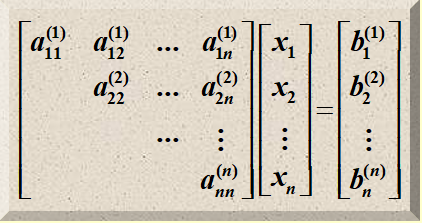
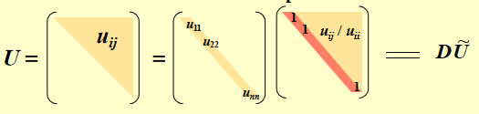
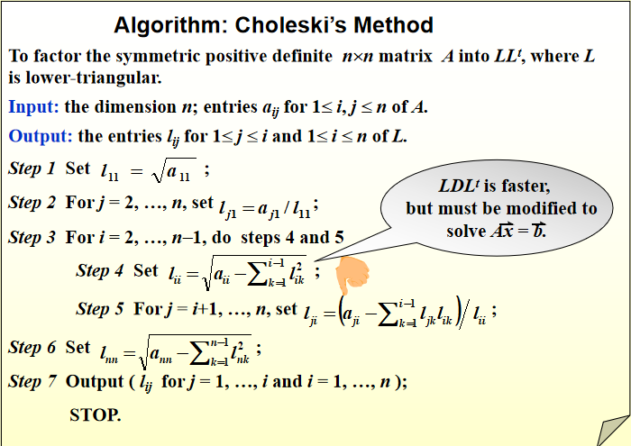
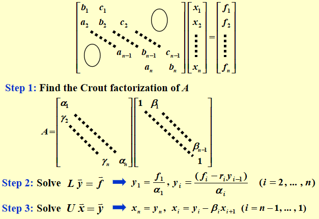

# Direct Methods for Solving Linear Systems

## Linear Systems of Equations

解一个线性方程组的最简单直接的方式就是使用高斯消元法来把矩阵化为上三角矩阵，然后再用回代法来求解。

<figure markdown="span">
    {width=75%}
</figure>

$$ x_n = \frac{b_n^{(n)}}{a_{nn}^{(n)}} $$

$$ x_i = \frac{b_i^{(i)} - \sum\limits_{j=i+1}^{n} a_{ij}^{(i)} x_j}{a_{ii}^{(i)}} \quad i=n-1,n-2,\ldots,1 $$

!!! note
    对于较大的 $n$，高斯消元+回代法所需的乘除法数量大约为 $\dfrac{n^3}{3}$

    - 高斯消元：$$ \sum_{k=1}^{n-1} (n-k)(n-k+2) = \frac{n^3}{3} + \frac{n^2}{2} -\frac{5}{6}n $$
    - 回代：$$ 1 + \sum_{i=1}^{n-1} (n-i+1) = \frac{n^2}{2} + \frac{n}{2} $$

## Pivoting Strategies

由于计算机天然的精度问题，在矩阵主元较小时使用高斯消元法会导致数值不稳定，因此需要使用主元化策略来提高数值稳定性。

??? example
    考虑如下线性方程组（使用 4 位有效数字的舍入计算）：

    $$
    \begin{cases}
        30.00 x_1 + 591400 x_2 = 591700 \\
        5.291 x_1 - 6.130 x_2 = 46.78
    \end{cases}
    $$

    这个方程组的精确解是 $x_1 = 10.00,\ x_2 = 1.000$（保留 4 位有效数字）

    在第一步消元时，使用 $a_{11} = 30.00$ 作为主元，它相较于这一行中的其他系数很小，因此会导致数值不稳定。（全程使用 4 位有效数字的舍入计算）

    $$ m = \frac{5.291}{30.00} = 0.1764 $$

    $$ 591400 \times 0.1764 = 104322.96 \approx 104300 $$

    $$ a_{22}^{(2)} = -6.130 - 104300 \approx -104300 $$

    $$ 591700 \times 0.1764 = 104375.88 \approx 104400 $$

    $$ b_2^{(2)} = 46.78 - 104400 \approx -104400 $$
    
    $$ x_2 = \frac{-104400}{-104300} \approx 1.001 $$
    
    $$ x_1 = \frac{591700 - 591400 \times 1.001}{30.00} \approx \frac{591700 - 592000}{30.00} = \frac{-300.0}{30.00} \approx -10.00 $$

    于是最终的结果为 $x_1 \approx -10.00,\ x_2 \approx 1.001$，可以看到 $x_1$ 的值与精确解相差甚远。（相对误差达到了 200%）

### Partial Pivoting

所谓部分选主元策略就是在每一步消元前，选择当前列中绝对值最大的元素作为主元，并将该行交换到当前行。形式化地来说，就是寻找一个最大的 $p \geqslant k$，使得 $|a_{pk}^{(k)}| = \max\limits_{k \leqslant i \leqslant n} |a_{ik}^{(k)}|$，然后交换第 $k$ 行和第 $p$ 行。

### Scaled Partial Pivoting (scaled-column pivoting)

缩放部分选主元是高斯消元法（以及 LU 分解）中用于选择稳定主元的常用策略。

一般的部分选主元策略是选择当前列中绝对值最大的元素作为主元，但是行与行之间的量级差异可能会很大，这样就会导致选出的主元并不是真正意义上的“最大”，从而影响数值稳定性。

!!! example
    例如第一行元素的量级大约是 $10^5$，而第二行元素的量级大约是 $10^1$，如果直接使用部分选主元策略，那么就会直接选择第一行的元素作为主元，但实际上它可能远不如第二行的元素稳定，可能会导致后续消元出现极小的主元，放大了舍入误差。

缩放部分选主元的核心思路是为每一行都计算一个缩放因子 $s_i = \max\limits_{1 \leqslant j \leqslant n} |a_{ij}|$，然后在每一步消元时，选择当前列中经过缩放后最大的元素（$|a_{ik}^{(k)}| / s_i$ 最大的元素）作为主元。

操作步骤如下：

1. 计算每一行的缩放因子 
    $$ s_i = \max\limits_{1 \leqslant j \leqslant n} |a_{ij}|$$
2. 在第 $k$ 步消元前，寻找一个最大的 $p \geqslant k$，使得 
    $$ \frac{|a_{pk}^{(k)}|}{s_p} = \max\limits_{k \leqslant i \leqslant n} \frac{|a_{ik}^{(k)}|}{s_i} $$
3. 交换第 $k$ 行和第 $p$ 行

> 我们可以事先计算好每一行的缩放因子 $s_i$，然后在每一步消元时直接使用它们来选择主元，而不需要每一次都单独计算。

### Complete Pivoting

完全选主元策略是每一步消元前，在剩余的整个子矩阵中直接选择绝对值最大的元素作为主元，并将该行和该列交换到当前行和当前列。

!!! tip
    partial 和 complete 的区别在于我们寻找主元是只在当前列中寻找，还是在整个剩余子矩阵中寻找。

!!! summary "Amount of Computation"
    - **Partial Pivoting**: $O(n^2)$ 次额外的比较
    - **Scaled Partial Pivoting**: $O(n^2)$ 次额外的比较和 $O(n^2)$ 次额外的除法
    - **Complete Pivoting**: $O(n^3/3)$ 次额外的比较

    > 如果 scaled partial pivoting 在每一次行交换时都重新计算缩放因子，那么它的计算量会变成 $O(n^3/3)$ 次比较和 $O(n^2)$ 次除法，这就失去了它的优势。

## Matrix Factorization

考虑一般的高斯消元法，记 $m_{i1} = \dfrac{a_{i1}}{a_{11}}\ (a_{11} \neq 0)$

令矩阵（空白位置为 0）

$$ L_1 = 
\begin{bmatrix}
    1 & & &\\
    -m_{21} & 1 & & \\
    \vdots & & \ddots \\
    -m_{n1} & & & 1 \\
\end{bmatrix}
$$

把它和需要进行高斯消元的增广矩阵 $[A^{(1)} \ \vec{b}^{(1)}]$ 进行矩阵乘法，那么我们就有

$$ L_1 [A^{(1)} \ \vec{b}^{(1)}] = \begin{bmatrix}
    a_{11}^{(1)} & \cdots & b_1^{(1)} &\\
    & A^{(2)} & \vec{b}^{(2)} \\
\end{bmatrix}
$$

实际上就是进行了单列的高斯消元，同理在第 $n-1$ 步我们可以得到

$$
L_{n-1}L_{n-2}\cdots L_1 \begin{bmatrix} A & \vec{b} \end{bmatrix} = 
\begin{bmatrix} 
    a_{11}^{(1)} & a_{12}^{(1)} & \cdots & a_{1n}^{(1)} & b_1^{(1)} \\ 
    & a_{22}^{(2)} & \cdots & a_{2n}^{(2)} & b_2^{(2)} \\ 
    & & \ddots & \vdots & \vdots \\ 
    & & & a_{nn}^{(n)} & b_n^{(n)} 
\end{bmatrix}$$

其中

$$
L_k = \begin{bmatrix} 
1 & & & & & & \\ 
& \ddots & & & & & \\ 
& & 1 & & & & \\ 
& & & 1 & & & \\ 
& & & -m_{k+1,k} & 1 & & \\ 
& & & \vdots & & \ddots & \\ 
& & & -m_{n,k} & & & 1 
\end{bmatrix}$$

而经过推导我们可以知道

$$
L_k^{-1} = \begin{bmatrix} 
1 & & & & & & \\ 
& \ddots & & & & & \\ 
& & 1 & & & & \\ 
& & & 1 & & & \\ 
& & & m_{k+1,k} & 1 & & \\ 
& & & \vdots & & \ddots & \\ 
& & & m_{n,k} & & & 1 
\end{bmatrix}
$$

我们定义单位下三角矩阵 $L$（对角线上所有元素都是 1）

$$ L = L_1^{-1} L_2^{-1} \cdots L_{n-1}^{-1} = 
\begin{bmatrix} 
1 & & & & & & \\ 
m_{2,1} & \ddots & & & & & \\ 
m_{3,1} & m_{3,2} & 1 & & & & \\ 
\vdots & \vdots & \vdots & \ddots \\
m_{n,1} & m_{n,2} & m_{n,3} & \cdots & & 1 
\end{bmatrix}
$$

再令

$$ U = 
\begin{bmatrix} 
a_{11}^{(1)} & a_{12}^{(1)} & \cdots & a_{1n}^{(1)} & \\ 
& a_{22}^{(1)} & \cdots & a_{1n}^{(1)} & \\  
& & \ddots & \vdots \\
& & & 1 
\end{bmatrix}
$$ 

我们就成功把方针 $A$ 分解了，这称为方针 LU 分解

$$ A = LU $$

> L 表示下三角矩阵（Lower Triangular Matrix），U 表示上三角矩阵（Upper Triangular Matrix）

!!! theorem
    如果可以对线性方程组 $A \vec{x} = \vec{b}$ 进行高斯消元而不需要行交换，那么矩阵 $A$ 可以分解为一个下三角矩阵 $L$ 和一个上三角矩阵 $U$ 的乘积。
    
    若还满足 $L$ 是​​单位下三角矩阵​​（对角线元素为1 ），则这种分解是唯一的。

??? proof
    若分解不唯一，那么存在两种分解
    $$ A = L_1 U_1 = L_2 U_2 $$
    两边先左乘 $L_1^{-1}$ 再右乘 $U_2^{-1}$ 得
    $$ U_1 U_2^{-1} = L_1^{-1} L_2 $$
    因为 $U_1, U_2$ 都是上三角矩阵，因此 $U_1 U_2^{-1}$ 也为上三角矩阵，同理 $L_1^{-1} L_2$ 为下三角矩阵

    一个矩阵同时是上三角和下三角​​，当且仅当它是​​对角矩阵​​，由于 $L_1, L_2$ 是单位下三角矩阵，因此这个乘积只能是单位矩阵 $I$

    于是有
    $$ U_1 U_2^{-1} = I \, \Longrightarrow \, U_1 = U_2 $$
    将 $U_1 = U_2$ 带入 $A = L_1 U_1 = L_2 U_2$ 可得 $L_1 = L_2$
    因此这个分解是唯一的

!!! note
    当 $U$ 是单位上三角矩阵时的分解称为 Crout 分解。Crout 分解可通过对矩阵 $A$ 的转置 $A^T$ 做 LU 分解得到。

    即 $A^T = LU$，那么 $A$ 的 Crout 分解就是 $A = U^T L^T$

## Special Types of Matrices

### Strictly Diagonally Dominant Matrix

!!! definition "严格对角占优矩阵"
    对于 $n \times n$ 矩阵 $A = [a_{ij}]$，若​​每个主对角线元素的绝对值严格大于所在行其他元素绝对值之和​​，即
    $$ |a_{ii}| > \sum_{j=1, j \neq i}^{n} |a_{ij}| \quad i=1,2,\ldots,n $$
    则称 $A$ 为严格对角占优矩阵（Strictly Diagonally Dominant Matrix）

!!! theorem
    严格对角占优矩阵 A是​​非奇异​​的（即行列式 $\text{det}(A) \neq 0$，矩阵可逆）。

    此外，对 $A$ 做高斯消元时​​无需行或列交换​​，且计算过程中舍入误差的增长是​​稳定​​的

??? proof
    - 非奇异性（反证法）

        假设 $A$ 是奇异的，那么存在非零向量 $\vec{x} = [x_1, x_2, \ldots, x_n]^T$ 使得 $A \vec{x} = \vec{0}$

        设 $|x_k| = \max\limits_{1 \leqslant i \leqslant n} |x_i| > 0$（$|\vec{x}|$ 中绝对值最大的分量），则 $A \vec{x} = \vec{0}$ 的第 $k$ 个方程为
        $$ a_{k1} x_1 + a_{k2} x_2 + \cdots + a_{kk} x_k + \cdots + a_{kn} x_n = 0 $$
        移项，得
        $$ a_{kk} x_k = - \sum_{j=1, j \neq k}^{n} a_{kj} x_j $$
        两边取绝对值，利用严格对角占优的性质，有

        $$ \begin{aligned}
        |a_{kk}| |x_k| &= \left| \sum_{j=1, j \neq k}^{n} a_{kj} x_j \right| \\
        &\leqslant \sum_{j=1, j \neq k}^{n} |a_{kj}| |x_j| \\
        &\leqslant \sum_{j=1, j \neq k}^{n} |a_{kj}| |x_k| 
        \end{aligned} $$

        两边除以 $|x_k|$（$|x_k| > 0$），得
        $$ |a_{kk}| \leqslant \sum_{j=1, j \neq k}^{n} |a_{kj}| $$
        这与严格对角占优的定义矛盾，因此 $A$ 非奇异。

    - 高斯消元无需行/列交换（数学归纳法）

        需证明：高斯消元过程中生成的各阶矩阵 $A^{(2)},\ A^{(3)},\ldots,A^{(n)}$ 都是严格对角占优矩阵。

        - 当 $k=1$ 时，$A^{(1)} = [a_{11}]$ 显然是严格对角占优矩阵。
        - 假设 $A^{(k)}$ 是严格对角占优矩阵，需证明 $A^{(k+1)}$ 也是严格对角占优矩阵。

            计算乘数 $m_{ik} = \dfrac{a_{ik}^{(k)}}{a_{kk}^{(k)}}, (i > k)$ 并更新第 $k+1$ 行的主对角线元素

            $$ a_{k+1,k+1}^{(k+1)} = a_{k+1,k+1}^{(k)} - m_{k+1,k} \cdot a_{k,k+1}^{(k)} = a_{k+1,k+1}^{(k)} - \frac{a_{k+1,k}^{(k)} a_{k,k+1}^{(k)}}{a_{kk}^{(k)}} $$

            利用归纳假设的严格对角占优性，可得 $|a_{kk}^{(k)}| > |a_{k,k+1}^{(k)}|$，因此

            $$ \left| \frac{a_{k+1,k}^{(k)} a_{k,k+1}^{(k)}}{a_{kk}^{(k)}} \right| < |a_{k+1,k}^{(k)}| $$
            
            于是

            $$ |a_{k+1,k+1}^{(k+1)}| > |a_{k+1,k+1}^{(k)}| - |a_{k+1,k}^{(k)}| $$

            又因为 $A^{(k)}$ 是严格对角占优矩阵，所以
            $$ |a_{k+1,k+1}^{(k)}| > \sum_{j=1, j \neq k+1}^{n} |a_{k+1,j}^{(k)}| $$
            因此
            $$ |a_{k+1,k+1}^{(k+1)}| > \sum_{j=1, j \neq k+1}^{n} |a_{k+1,j}^{(k)}| - |a_{k+1,k}^{(k)}| = \sum_{j=1, j \neq k+1}^{n} |a_{k+1,j}^{(k+1)}| $$
            这说明 $A^{(k+1)}$ 的第 $k+1$ 行满足严格对角占优性，而其他行在高斯消元过程中并未改变，因此 $A^{(k+1)}$ 也是严格对角占优矩阵。

### Choleski’s Method for Positive Definite Matrix

!!! definition "正定矩阵"
    若 $n$ 阶矩阵 $A$ 是对称的且对于任意的非零 $n$ 维向量 $\vec{x}$ 都满足
    $$ \vec{x}^T A \vec{x} > 0 $$
    则称 $A$ 为正定矩阵（Positive Definite Matrix）

!!! property "正定矩阵的性质"
    - 正定矩阵的逆也是正定的，并且所有的对角元均为正（$a_{ii} > 0$）
    - 元素的绝对值满足 $\max |a_{ij}| \leqslant \max |a_{ii}|$，且 $|a_{ij}| < \sqrt{a_{ii} a_{jj}}$
    - 正定矩阵的各阶顺序主子式均为正（前 $k$ 行前 $k$ 列组成的 $k$ 阶子矩阵 $A_k$ 的行列式均为正）

考虑对正定矩阵的 LU 分解，上三角因子 $U$ 的对角线元素均不为零，因此可以将 $U$ 分解为一个单位上三角矩阵和一个对角矩阵的乘积

$$ U = D \tilde{U} $$

<figure markdown="span">
    {width=75%}
</figure>

由于 $A$ 是对称矩阵，因此下三角因子 $L = \tilde{U}^T D$，于是
$$ A = L D \tilde{U} = L D L^T $$
这称为 $LDL^T$ 分解，其中 $L$ 是单位下三角矩阵，$D$ 是对角元全为正的对角矩阵。

我们还可以定义 $D$ 的平方根为 
$$ D^{1/2} = \text{diag}(\sqrt{d_{11}}, \sqrt{d_{22}}, \ldots, \sqrt{d_{nn}}) $$
那么我们可以构造一个新的下三角矩阵 $\tilde{L} = L D^{1/2}$，于是就有
$$ A = \tilde{L} \tilde{L}^T $$
这就是 $LL^T$ 分解，也称为 Choleski 分解，其中 $\tilde{L}$ 是下三角矩阵且对角元均非零。

!!! info "Choleski’s Method"
    <figure markdown="span">
        {width=75%}
    </figure>

### Crout Reduction for Tridiagonal Linear System

对于 $n \times n$ 的三对角矩阵 $A$（主对角线元素为 $b_1 \sim b_n$，上对角线元素为 $c_1 \sim c_{n-1}$，下对角线元素为 $a_2 \sim a_n$），以及线性系统 $Ax = f$，我们可以使用 Crout 分解将其唯一拆分为下三角矩阵 $L$ 和单位上三角矩阵 $U$ 的乘积

分解后，原系统就转换为两个易于求解的三角方程组：

1. 解下三角系统 $L \vec{y} = \vec{f}$

    $$ y_1 = \frac{f_1}{\alpha_1},\ y_i = \frac{f_i - r_i y_{i-1}}{\alpha_i},\ (i = 2,3,\ldots,n) $$

2. 解单位上三角系统 $U \vec{x} = \vec{y}$

    $$ x_n = y_n,\ x_i = y_i - \beta_i x_{i+1},\ (i = n-1,n-2,\ldots,1) $$

<figure markdown="span">
    {width=75%}
</figure>

!!! theorem
    如果 $A$ 是三对角矩阵，并且是对角占优的，如果还满足 
    $$ |b_1| > |c_1| > 0, \ |b_n| > |a_n| > 0, \ a_i \neq 0, \ c_i \neq 0 $$
    那么 $A$ 是非奇异的（可逆），并且上面这个线性系统 $A \vec{x} = \vec{f}$ 有唯一解。

!!! note
    - 如果矩阵 $A$ 是严格对角占优的，则不需要所有下对角线元素 $a_i$、主对角元 $b_i$、上对角线元素 $c_i$ 均非零。
    - 这种方法具有一定程度上的稳定性，在这个过程中得到的所有数值都会被原始数值所界定
    - 这种方法的计算量为 $O(n)$，远小于一般的 $O(n^3)$
