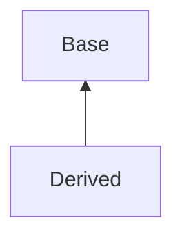

# 面向对象程序设计

!!! abstract

    “面向对象程序设计”课程相关笔记

    - 教材：无
    - 老师：许威威
    
!!! INFO
    - 出于各种原因，笔者不太适应许威威老师的上课方式，本课程笔记主要来自于翁恺老师和陈翔老师的智云录播
    - 这里只记录一些个人认为比较需要注意或是很琐碎容易忘记的知识点，关于更详细的学习笔记可以参考我的 [C++ 学习笔记](../PL/index.md)
    - 关于 C++ 和 OOP 的内容，已经有很多学长记录了笔记更丰富更有水平的笔记，感兴趣的同学也可以参考他们的笔记

!!! quote "更多更好的参考笔记和资料"
    - 图灵班课程学习指南：[面向对象程序设计](https://zju-turing.github.io/TuringCourses/major_basic/object_oriented_programming/)
    - [咸鱼暄的各种 C++ 笔记](https://xuan-insr.github.io/cpp/cpp_restart/)
    - [Isshiki 修的 OOP 笔记](https://www.yuque.com/isshikixiu/codes/wk_oop)
    - [金鱼马老师的 C/C++ 沉思录](https://www.zhihu.com/column/c_1561843704159232000)
    - [箱子的 OOP 无痛指南（不知道是不是真的无痛）](https://tree.45gfg9.net/lcppthw/01-bootstrap/)

## 关于变量

### 引用

- 引用本质上是一个现有变量的别名，对引用的任何操作都会直接作用于原变量
- 引用的内部实现就是指针，但外部的表现和普通的变量一样
- 引用必须在定义时初始化，且在声明之后不可再绑定到其他变量

    ```cpp
    Type &ref = var1; // ref 是 var 的引用
    ref = var2;       // var1 的值被修改为 var2，不会使 ref 指向 var2 
    ```

- 引用可以作为函数参数，按引用传递可以避免拷贝，提高效率

    - 不需要在函数中修改参数的值，可以使用 `const` 修饰参数，防止修改

        ```cpp
        void f(const int &x) {
            // x = 1; // error
        }
        ```

- 用一个引用来初始化另一个引用实际上是让两个引用指向同一个变量

    ```cpp
    int a = 1;
    int &b = a; // b 是 a 的引用
    int &c = b; // c 也是 a 的引用
    ```

- 存在 `int*&`（对指针的引用），但不存在 `int&*`（指向引用的指针）

### 动态内存分配

- `new`：在堆上分配内存，返回指向该内存的指针

    - `T* p = new T[n]` 先分配 n 个 T 类型的内存，然后创建 n 个 T 类型的对象，返回指向第一个对象的指针赋给 p

- `delete p`：释放 p 指向的内存

    - 不会使 p 变为 nullptr，如果在 delete 之后再进行一次 delete，会导致未定义行为

- `delete[] p`：释放 p 指向的数组内存

    - new 一个数组的时候会记录数组的大小，delete[] 会根据这个大小释放内存
    - 释放数组时，必顿使用 `delete[]`，否则只会释放第一个元素的内存，其他元素的内存不会被释放


## 关于容器

在 C++ 中，容器都在 STL（Standard Template Library）中，STL 是 C++ 标准库的一部分，提供了一系列的容器、算法和函数对象。

### vector

Constructor 

- `vector<T> v`：创建一个空的 vector，元素类型为 T
- `vector<T> v(n)`：创建一个大小为 n 的 vector，元素类型为 T
- `vector<T> v(n, x)`：创建一个大小为 n 的 vector，元素类型为 T，每个元素的值都是 x
- `vector<T> v(v2)`：创建一个 vector，内容和 v2 一样

Simple Methods

- `v.size()`：返回 vector 中元素的个数
- `v.capacity()`：返回 vector 中能容纳的元素的个数
- `v.empty()`：判断 vector 是否为空
- `==, !=, <, <=, >, >=`：比较两个 vector 是否相等
- `v.swap(v2)`：交换两个 vector 的内容

Add / Remove / Find Elements

- `v.clear()`：清空 vector 中的元素
- `v.push_back(x)`：在 vector 的末尾添加一个元素 x
- `v.pop_back()`：删除 vector 的最后一个元素
- `v.insert(pos, x)`：在 vector 的第 pos 个位置插入一个元素 x，之后的元素都后移，返回指向新元素的迭代器
- `v.erase(pos)`：删除 vector 中第 pos 个元素，之后的元素都前移，返回指向下一个元素的迭代器
- `v.erase(first, last)`：删除 vector 中 [first, last) 区间的元素，返回指向下一个元素的迭代器
- `v.find(x)`：在 vector 中查找元素 x，返回指向元素的迭代器，如果没有找到则返回 `v.end()`

### list

是一个双向链表，支持快速的插入和删除操作，当我们需要在中间插入或删除元素时，list 是一个比较好的选择。

Constructor

- `list<T> l`：创建一个空的 list，元素类型为 T
- `list<T> l(n)`：创建一个大小为 n 的 list，元素类型为 T
- `list<T> l(n, x)`：创建一个大小为 n 的 list，元素类型为 T，每个元素的值都是 x
- `list<T> l(l2)`：创建一个 list，内容和 l2 一样

Simple Methods

- `l.size()`：返回 list 中元素的个数（注意：list 没有 capacity）
- `l.empty()`：判断 list 是否为空
- `l.swap(l2)`：交换两个 list 的内容

Add / Remove / Find Elements

- `l.clear()`：清空 list 中的元素
- `l.push_back(x)`：在 list 的末尾添加一个元素 x
- `l.pop_back()`：删除 list 的最后一个元素
- `l.push_front(x)`：在 list 的开头添加一个元素 x
- `l.pop_front()`：删除 list 的第一个元素

## 关于变量


## 关于函数

### inline 函数

- 类似于一个宏，编译器会在调用处直接展开函数体，而不是真正的调用函数

    ```cpp
    inline f(int x) {
        return x + 1;
    }

    int a = f(1);
    // 编译器会将上面的代码展开为 int a = 1 + 1;
    ```

- inline 函数的定义也相当于声明，可以在头文件中定义。并且不会因为被多个文件引用而出现重复定义的错误
- 在类内部定义的成员函数默认是 inline 的

## 关于类

- C++ 中 class 和 struct 的区别仅在于默认的访问权限不同，class 默认是 private，struct 默认是 public
- 直接在类的内部定义成员函数时，函数默认是 inline
-访问权限有三种：
    - public：可以被任何人访问
    - protected：可以在类的内部和子类中访问
    - private：只能在类的内部访问
        - 访问权限是以类为单位的，而不是对象，即一个对象可以访问同一个类的另一个对象的 private 成员

### 构造函数

- 默认构造函数（default constructor）：没有参数的构造函数
- 拷贝构造函数（copy constructor）：用一个对象初始化另一个对象
    - 声明为 `ClassName(const ClassName &obj)`，通常是 `const` 引用
    - 如果没有定义拷贝构造函数，编译器会自动生成一个默认的拷贝构造函数
    - 发生拷贝构造时会调用，例如 `ClassName obj2 = obj1;`，在函数按值传递参数、按值返回时也会调用（暂时不考虑 copy elision）
- 当我们没有定义构造函数时，编译器会自动生成一个默认构造函数；当我们定义了任意一个构造函数时，编译器就不会再生成默认构造函数，即使此时并不存在默认构造函数

### 析构函数

- 析构函数没有任何参数，也没有返回值
- 在对象被销毁（或超出作用域）时自动调用
- 用于释放对象占用的资源，例如释放动态分配的内存、关闭文件等
- 如果没有定义析构函数，编译器会自动生成一个默认的析构函数
- 涉及到继承时，析构函数应该是虚函数

### 静态成员变量/函数

| type                    | meaning                                            |
|-------------------------|----------------------------------------------------|
| static free function    | internal linkage(deprecated)                       |
| static global variables | internal linkage(deprecated)                       |
| static local variables  | persistent storage                                 |
| static member variables | shared by instances                                |
| static member functions | shared by instances, can only access static member |

```CPP
class A {
public:
    static int a;
    int b;
};

int A::a = 0;
A obj;
```

- 静态成员变量从属于这一个类，而不是单独属于某个对象
- 静态成员变量被这个类的所有对象共享（只有一份内存），并且在对象被创建之前就已经存在了
- 上面的例子中 `A::a` 和 `obj.a` 访问的都是同一个变量

!!! warning 
    当我们想要初始化一个静态成员变量时，必须在类的外部进行初始化，不能在类的内部进行初始化。例如

    ```CPP
    int A::a = 0;
    ```

- 静态成员函数也是属于类的，而不是属于对象的，可以直接通过类名调用，也可以通过对象调用
- 静态成员函数不能访问非静态成员变量，也不能调用非静态成员函数
- 静态成员函数不会隐式地包含 this 指针

### 常量成员变量/函数

- 常量成员变量必须在成员初始化列表中初始化，不能在构造函数中初始化（构造函数体开始执行时它已经是 const 的了）
- 常量成员函数不能修改成员变量，也不能调用非常量成员函数
    - 当一个函数不会修改对象的状态时，应该将其声明为常量成员函数（如 getter 函数）

    ```cpp
    class A {
        int m_a;
    public:
        int getA() const { // 设为 const
            return m_a;
        }
        void setA(int a) {// 不能设为 const
            m_a = a;
        }
    };
    ```

### 继承

- 不添加标识符时，默认继承方式是 private
- 构造函数、析构函数、重载运算符、友元不会被继承
- 初始化的顺序为
    - 按照继承的顺序初始化基类（出现在冒号`:`后面的顺序）
    - 柑橘生命顺序初始化成员变量
    - 执行构造函数函数体

### 多态

- up-cast（造型，向上转型）：把一个派生类的对象视作一个基类的对象，这是安全的

> It is to say: Students are human beings. You are students, so you are human being.



#### 虚函数

- 通过在函数返回值前加上 `virtual` 关键字来声明
- 一个类有虚函数时，这个类所占据的内存空间的第一部分将会是一个虚函数表（vtable），里面存放了指向该类虚函数的指针

    - 虚函数表是在编译时就确定的，每个类只有一个虚函数表，不会因为对象的不同而改变
    - 虚函数表也会作为类的一部分占据内存空间，会增加内存开销

- 虚函数被继承后无需使用 virtual 关键字也是虚函数，若想要覆盖基类虚函数的实现，可以使用 `override` 关键字

    ```cpp
    class Base {
    public:
        virtual void func() {
            cout << "Base::func()" << endl;
        }
    };

    class Derived : public Base {
    public:
        void func() override {
            cout << "Derived::func()" << endl;
        }
    };
    ```

- 如果一个类中存在没有被实现的虚函数（纯虚函数），则这个类是抽象类，不能被实例化

    - 抽象类需要被继承，并且子类必须实现这个纯虚函数才能实例化

    ```cpp
    class Base {
    public:
        virtual void func() = 0; // = 0 表示纯虚函数
    };
    ```

- 当我们使用继承时，必须要让析构函数成为 virtual 的

    - 否则

    ```cpp
    Base* b = new Derived();
    delete b;
    ```

    将会调用 `Base::~Base()` 而不是 `Derived::~Derived()`，属于 Derived 的部分将不会被释放

- 构造函数不能是 virtual 的，因为此时对象还没有被构造，虚表也不存在

    - 假设构造函数是虚函数，那么调用构造函数就必须使用到虚表，但在这个对象被构造之前并不会占有内存空间，也就没有虚表，从而产生了矛盾

!!! example 

    ```cpp
    #include <iostream>
    using std::cout;
    using std::endl;

    class A {
    public:
        A() { f(); }
        virtual void f() { cout << "A::f()" << endl; }
    };

    class B : public A {
    public:
        B() { f(); }
        virtual void f() { cout << "B::f()" << endl; }
    };


    int main() {
        B b;
        return 0;
    }
    ```

    - 创建一个 B 类对象时，会首先构造父类 A 的那一部分。
    - 调用 A 的构造函数时，会调用虚函数 `f()`，此时虚表中存放的是 `A::f()`，所以会输出 `A::f()`
    - 然后调用 B 的构造函数，此时虚表被更新，存放的是 `B::f()`，所以会输出 `B::f()`
    - 所以输出结果是

    ```cpp
    A::f()
    B::f()
    ```

#### 静态/动态绑定

- 静态绑定：编译时就能明确确定需要调用的函数
    static / early binding: call the function as the code
- 动态绑定：在运行时根据对象的实际类型来调用相应的函数，而不是根据指针或引用的类型
    dynamic / late bindin: call the function of the object
    - 出现多态，编译器并不知道具体调用的是哪个类的方法
    - 在 C++ 中，只有通过指针/引用调用 virtual function 时才会发生动态绑定

```cpp
Base *p = new Derived();
p->func(); 
// 是 virtual 时，调用 Derived::func()，否则调用 Base::func()
```

!!! example 

    ```cpp
    class Shape {
    public:
        void render() { cout << "Shape" << endl; }
    };

    class Circle : public Shape {
    public:
        void render() { cout << "Circle" << endl; }
    };

    void render(Shape *p) {
        p->render(); // p 是多态变量
    }

    int main() {
        Shape s; Circle c;
        s.render(); // 静态绑定 输出 Shape
        c.render(); // 静态绑定 输出 Circle
        render(&s); // 静态绑定 输出 Shape
        render(&c); // 静态绑定 输出 Shape
    }
    ```

    若把两个类的 `render` 函数声明为 `virtual`，则后两次调用 render 函数将会发生动态绑定，输出结果变为

    ```
    Shape
    Circle
    Shape
    Circle
    ```

!!! tip 
    在成员函数内部调用一个 virtual 函数，也有可能发生动态绑定
    - 因为调用另一个成员函数实际上是通过指针 this 做到的

### 友元

- 使用 `friend` 关键字声明友元函数或友元类
- 友元函数 / 友元类可以访问类的私有成员
- 友元关系不能被继承，即基类的友元函数不能访问派生类的私有成员；同理，派生类的友元函数也不能访问基类的私有成员
- 类之间的关系不具有对称性和传递性：
    - 不具有对称性：如果 A 是 B 的友元，那么 B 不一定是 A 的友元
        - A 可以访问 B 的私有成员，但 B 不能访问 A 的私有成员
    - 不具有传递性：如果 A 是 B 的友元，B 是 C 的友元，那么 A 不一定是 C 的友元

## 关于重载

### 函数重载

- 具有相同函数名，但参数列表不同的函数（即函数签名不同）
- 返回值不同不能作为重载的条件
- 重载函数在类中可以有不同的访问权限，但不能只有访问权限不同

    ```cpp
    class A {
    public:
        void f(int x) { cout << "public" << endl; }
    private:
        void f(double x) { cout << "private" << endl; }
    };
    ```

- 调用重载函数时，编译器会根据参数列表选择合适的函数，但也有可能出现模糊重载解析的情况

### 运算符重载

- 只能重载 C++ 已有的运算符，不能新建运算符
- 不会改变运算符的优先级和结合性
- 不可改变运算符的操作数个数
- 重载运算符至少有一个操作数是用户定义的类型（class 或 enum）
- 可以重载的运算符

    ```cpp
    = - * / % ^ & | ~                 // 加减乘除、取模、按位运算
    = += -= *= /= %= ^= &= |= <<= >>= // 赋值运算
    == != < > <= >=                   // 关系运算
    ! && || ++ --                     // 逻辑运算、自增自减
    [] () -> ->*                      // 下标、函数调用、成员访问
    new delete new[] delete[]         // 内存分配、释放
    ```

- 不可重载的运算符

    ```cpp
    . .* :: ?: sizeof typeid          // 成员访问、作用域解析、条件运算、大小、类型信息
    static_cast dynamic_cast const_cast reinterpret_cast // 四种类型转换
    ```

!!! info "关于 `->` `->*` `.` `.*` 运算符"
    - `p1->x` 与 `(*p1).x` 等价
        - `p1` 是一个指向类的指针，`x` 是类的一个成员变量/函数
    - `p1->*p2` 与 `(*p1).*p2` 等价
        - `p1` 是一个指向类的指针，`p2` 是一个指向类成员变量/函数的指针

    > 感觉好复杂，估计也不会真的会用到（×）

    !!! example 

        ```cpp
        #include <iostream>
        
        struct S
        {
            S(int n): mi(n) {}
            mutable int mi;
            int f(int n) { return mi + n; }
        };
        
        struct D: public S
        {
            D(int n): S(n) {}
        };
        
        int main()
        {
            int S::* pmi = &S::mi;      // 声明一个指向 S::mi 的指针
            int (S::* pf)(int) = &S::f; // 声明一个指向 S::f 的指针
        
            const S s(7);
        //  s.*pmi = 10; // 错误：无法通过 mutable 进行修改
            std::cout << s.*pmi << '\n';// 通过 .* 访问成员变量
        
            D d(7); // 基类的指针可以在派生类对象上工作
            D* pd = &d;
            std::cout << (d.*pf)(7) << ' '
                    << (pd->*pf)(8) << '\n';
        }
        ```

        输出结果为
        
        ```
        7
        14 15
        ```

- 双目运算符的左操作数是对象本身，右操作数是函数的参数
- 全局运算符需要访问私有成员时，要设置为友元

运算符重载方式的选择

- 单目运算符应该成为成员
- `=`、`[]`、`()`、`->`、`->*` 必须是成员
- 赋值运算符应该是成员
- 其他的双目运算符应该是非成员

参数的传递

- 若不会修改参数的值，应该传递 const 引用
- 如果不会修改类的状态，应该把成员函数声明为 const

运算符及其对应的函数原型（用 `@` 表示任意运算符）

- `+` `-` `*` `/` `%` `^` `&` `|` `~`

    ```cpp
    const T operator @ (const T &l, const T &r);
    ```

- `!` `&&` `||` `<` `<=` `==` `>=` `>`

    ```cpp
    bool operator @ (const T &l, const T &r);
    ```

- `+=` `-=` `*=` `/=` `%=` `^=` `&=` `|=` `<<=` `>>=`

    ```cpp
    T& operator @= (const T &l, const T &r);
    ```

- `[]`

    ```cpp
    E& T::operator [] (int index); // 参数也可以是 size_t 等其他类型
    ```

- `++` `--`

    ```cpp
    const T& operator ++ ();      // prefix ++
    const T operator ++ (int);    // postfix ++, int 用于区分前缀和后缀, 并无实际意义
    const T& operator -- ();      // prefix --
    const T operator -- (int);    // postfix --
    ```

- 流运算符重载 `<<` `>>`

    ```cpp
    ostream& operator << (ostream &os, const T &obj); // 返回 os
    istream& operator >> (istream &is, T &obj);       // 返回 is
    ```

- 类型转换运算符重载
    - 没有参数和返回类型，但可以有返回值

    ```cpp
    operator Type() const; // 将类转换为 Type 类型
    ```

- `->()`

    ```cpp
    R* T::operator ->() const; // 返回一个指针
    ```

    - 返回类型必须支持 `->` 运算符
    - `owner->func()` 的语义实际上是 `(owner.operator->())->func()`，而 `(owner.operator->())` 返回的是一个指针 `ptr`，最终得到的是 `ptr->func()`

!!! example

    ```cpp
    #include <iostream>

    class Score {
        int score;
    public:
        Score(int s) : score(s) {}
        operator int () { return score; }
    };

    int main() {
        Score s{100};
        int n = s; // 调用 operator int()
        std::cout << n << std::endl; // 输出 100
    }
    ```

!!! tip "实现两个类之间的转换"

    如果我们想要实现两个类之间的转换，如 `A` 类转换为 `B` 类，有两种方法

    - 在 `B` 类中定义一个接受 `A` 类对象作为参数的的构造函数 `B(A a)`
    - 在 `A` 类中定义一个转换运算符 `operator B()`，使得 `A` 类对象可以隐式转换为 `B` 类对象

    但是不能两者兼有，否则编译器会不知道该使用哪一个（二义性）

## 其他

### 模板

- 在类模板中定义成员函数时不需要加 `template` 关键字，但在类模板外部定义时需要使用

    ```cpp
    template <class T>
    class A {
    public:
        void func1(T x) { ... }
        void func2(T x);
    };

    template <class T>
    void A<T>::func2(T x) { ... }
    ```

- 模板参数可以有默认值，也可以是常量表达式

    ```cpp
    template <class T=int, int size=100>
    class FixedVector {
        T elements[size];
    }

    FixedVector<> v;            // T=int,    size=100
    FixedVector<double> v;      // T=double, size=100
    FixedVector<float, 200> v;  // T=float,  size=100
    ```

- 类模板的继承
    - 类模板可以继承自普通类

    ```cpp
    template <class T>
    class A : public B { ... }
    ```

    - 类模板可以继承自类模板

    ```cpp
    template <class T>
    class A: public B<T> { ... }
    ```

    - 普通类继承自模板类（注意不是类模板，是实例化后的类）

    ```cpp
    class A: public B<int> { ... }
    ```

### 异常

- 通过 throw 抛出异常，但 throw 可以抛出任何类型（例如自己定义的类等）
- 通常会通过 throw 抛出异常类实例
- try-catch 语句

    ```cpp
    try { ... } // try 的块中有 throw 语句
    catch (SomeError& e) { ... }
    catch (AnotherError) { ... } // 不使用异常的具体内容
    catch (...) { ... } // 注意这里括号内的 ... 表示接受任意类型的异常
    ```

    - 也可以在 catch 块中继续使用 `throw;` 来吧当前处理的异常重新抛出去，从而实现异常的向上传递

- 标准库异常
    - `bad_alloc` `bad_cast` `bad_typeid` `bad_exception`
    - runtime_error: `overflow_error` `range_error`
    - logic_error: `domain_error` `length_error` `out_of_range` `invalid_argument`

- 使用 `new` 时出现异常
    - `A* p = new A();`
    - 首先为 p 申请一块内存，然后调用 A 的构造函数，但如果在调用构造函数的过程中出现了异常，这一块内存并不会被自动释放，导致内存泄漏
    - 如果在分配内存的过程中失败，并不会像 C 中的 malloc 一样返回 0，会抛出 `bad_alloc` 异常

函数的异常声明

- 在函数参数列表之后、函数题之前，用于声明当前函数可能会抛出哪些异常（暗示函数内部将会自行处理这些异常）

    ```
    // 有时也会在 throw 之前加上一个冒号 :
    void func(int a) throw (SomeError, AnotherError) { ... }
    ```

    - `throw()` 表示不抛出任何异常，C++11 写为 `noexcept`

- 若在运行过程中抛出了非预期的异常，会抛出 unexpected 异常
    - 出现 unexpected 异常时会调用 `std::unexpected()` 函数
    - 可以通过 `std::set_unexpected(handle)` 函数设置一个新的 unexpected 处理函数（handle 可以是自己定义的函数）

    ```cpp
    #include <exception>
    void my_handle() {
        std::cout << "unexpected exception!\n";
        exit(1);
    }
    void f() throw(X, Y){
        throw Z();
    }
    int main() {
        std::set_unexpected(my_handle);
        try {
            f();
        } catch (...) {
            std::cout << "caught it!\n"; 
        }
        return 0;
    }
    // 最终的输出是 unexpected exception!
    ```

- 如果函数没有进行任何异常声明，则表示可能抛出异常，也可能不抛出异常

!!! note
    抛出一个子类异常时，同样会被希望捕获父类异常的 catch 语句所捕获。
    
    例如 std::out_of_range 是 std::logic_error 的子类，所以当我们抛出 std::out_of_range 异常时，可以被 std::logic_error 的 catch 语句捕获，因此下面的代码会输出 `caught logic_error!`

    ```cpp
    try {
        throw std::out_of_range("out of range");
    } catch (std::logic_error& e) { // 在这里就被捕获了
        std::cout << "caught logic_error!\n" << std::endl;
    } catch (std::out_of_range& e) {
        std::cout << "caught exception!\n" << std::endl;
    }
    ```

    因此，我们最好将子类异常的 catch 语句放在父类异常的 catch 语句之前。

### 流

- `<iostream>`: `cin`, `cout`, `cerr`, `clog`
- `<fstream>`: `ifstream`, `ofstream`
- `<sstream>`: `istringstream`, `ostringstream`

#### ostream 

- `while ((ch = cin.get()) != EOF)`
- `istream& get(char& ch)`
- `istream& get(char *buf, int limit, char delim = '\n')`
- `istream& getline(char *buf, int limit, char delim = '\n')`
    - 通常使用自由函数版本，例如 `getline(cin, str)`
- `istream& ignore(int limit = 1, int delim = EOF)`
- `int gcount()` 返回最后一次读取的字符数
- `istream& putback(char ch)` 将字符放回流中
- `istream& peek()` 返回下一个字符但不从流中取出

#### ostream

- `ostream& write(const char *buf, int size)`
- `ostream& flush()` 刷新缓冲区

#### manipulators

| Manipulator       | effect                       | type |
|-------------------|------------------------------|------|
| dec, hex, oct     | set numberic conversion      | I,O  |
| endl              | insert new line and flush    | O    |
| flush             | flush stream                 | O    |
| setw(int)         | set field width              | I,O  |
| setfill(char)     | change fill character        | I,O  |
| setbase(int)      | set number base              | O    |
| ws                | skip whitespace              | I    |
| setprecision(int) | set floating point precision | O    |

其他的操作符

- std::left, std::right, std::internal 左、右、居中对齐，一般与 setw() 一起使用
- std::boolalpha 用 cout 输出 bool 类型时为 true/false，而非 1/0
- std::showbase 显示数值的基数（0x, 0, 0b）
- std::uppercase, std::nouppercase 大写、小写

#### 流状态

- eof 文件尾，fail 格式错误，bad 文件损坏/数据丢失，good 正常
- 可使用 clear() 函数清除流状态
- 可以使用 `stream.fail()` 来判断流是否处于 fail 状态，good(), bad(), eof() 同理

#### 文件流

在打开文件时可以指定模式 flag

- ios::app 以追加模式打开文件
- ios::ate 打开文件后定位到文件末尾
- ios::binary 以二进制模式打开文件
- ios::in 读，ios::out 写，ios::binary 二进制
- ios::nocreate 文件已存在时不创建，ios::noreplace 文件已存在时不覆盖

- 示例

    ```cpp
    ofstream fout("file.txt", ios::out | ios::app);
    fout << "Hello" << endl;
    fout.close();

    ifstream fin("file.txt");

    ifstream input;
    input.open("file.txt", ios::in);
    ```

### cast

- static_cast 用于在相关类型之间进行强制类型转换

    - 基本类型之间的转换（如 int 到 double）
    - 类层次结构中，父类指针/引用和子类指针/引用之间的转换
    - 将 void 指针转换为目标类型指针

- dynamic_cast 主要用于多态类型的转换，可以在运行时检查类型安全。常用于将父类指针/引用转换为子类指针/引用（down-cast）

    - 如果转换失败，返回 nullptr（指针）或抛出异常（引用）

- const_cast 用于去除 const、volatile 属性.

    - 例如可以去除 const 限定符，使得可以修改 const 对象

- reinterpret_cast 用于进行低级别的、几乎没有类型检查的转换。它进行的转换非常危险，因为可能破坏数据的完整性

    - 通常用于指针之间的转换，不会进行类型检查
