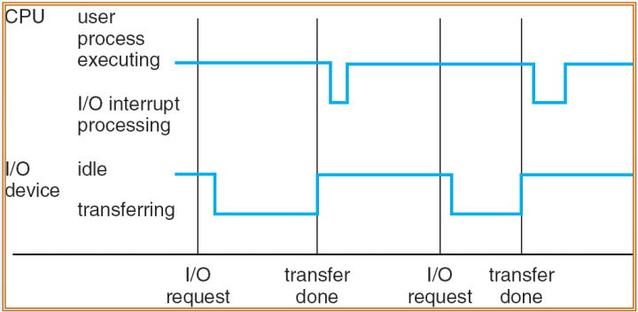
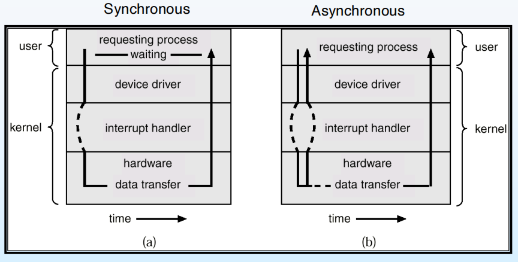

# Introduction

## Computer System Structure

计算机系统可以被分为四个部分：

- 硬件（Hardware）：计算机的物理部分
    - 包括处理器、内存、存储设备和输入输出设备等。
- 操作系统（Operating System, OS）：管理硬件资源的软件
    - 即控制和协调各种应用程序和用户之间对硬件的使用
- 系统与应用程序（System and Application Programs）：提供特定功能的软件
    - 定义了如何使用系统资源来解决实际问题
    - 系统程序包括编译器、数据库管理系统等
    - 应用程序包括文字处理、电子表格等
- 用户（Users）：
    - 包括使用计算机系统的个人、其他的计算机或其他机器

## Computer System Organization

- 计算机中可以有一个或多个 CPU，设备控制器通过总线与 CPU 连接，共享内存
- I/O 设备可以与 CPU 并行执行，每个设备控制器都负责管理某种特定的设备类型
    - 每个设备控制器都有自己的一个局部缓冲区，用于存储设备与 CPU 之间传输的数据
- 设备控制器通过中断向 CPU 通知其状态变化
- 中断机制通过中断向量将控制权转移到相应的中断服务程序，这个中断向量包含所有服务程序的地址
    - 中断体系结构必须保存被中断指令的地址
    - 在处理中断时，需要禁止其他中断的到来，以防止丢失当前正在处理的中断
- 陷阱（trap）是由错误或用户请求引起的软件中断（后者通常称为系统调用）
- 操作系统是中断驱动的

### Interrupt Handling

操作系统通过保存寄存器和程序计数器的状态来保存 CPU 的状态，可以通过**轮询（polling）**或**向量中断系统（vectored interrupt system）**来确定发生了哪种类型的中断。

- 每种类型的中断都有一段单独的代码来确定应该采取什么行动。

<figure markdown="span">
    {width=75%}
</figure>

## I/O Structure

I/O 结构有两种：

1. 当 I/O 开始后，直到 I/O 结束，控制权才返回给用户程序
    - 这种方式称为**同步 I/O**，用户程序在等待 I/O 完成时处于阻塞状态
    - 同一时间内至多有一个 I/O 操作在进行
2. 当 I/O 开始后，无需等待 I/O 结束，控制权立即返回给用户程序
    - 这种方式称为**异步 I/O**，用户程序在等待 I/O 完成时可以继续执行
    -  用户程序可通过 system call 请求操作系统等待 I/O 完成，而自身先执行其他任务，后续再通过 system call 检查 I/O 是否完成
    - 使用 Device-status table 来跟踪每一个 I/O 设备的状态（设备类型、地址、状态等），当 I/O 设备完成操作后，操作系统通过中断通知 CPU
    - 同一时间内可以有多个 I/O 操作在进行

<figure markdown="span">
    {width=75%}
</figure>

!!! info "DMA Structure"

    - 直接内存访问（Direct Memory Access, DMA）是一种允许 I/O 设备直接与内存交换数据的技术，而无需通过 CPU
    - DMA 控制器负责管理数据传输，CPU 只需在传输开始和结束时进行干预（一个数据块仅产生​​一次中断，而不是每个字节都产生中断）
    - 对于高速网卡等高度 I/O 设备而言，DMA 可以显著提高系统性能，特别是在处理大量数据传输时

## Operating System Structure

### Multiprogramming

CPU 如果只进行单一任务的处理，当该任务需要等待 I/O 操作完成时，CPU 会处于空闲状态，导致资源浪费。为了解决这个问题，引入了**多道程序设计（Multiprogramming）**的概念。

- 仅将系统中的部分任务加载到内存中，再通过调度程序选择一个任务来执行（job scheduling）
- 当该任务需要等待 I/O 操作完成时，调度程序会让 OS 切换到另一个任务来执行，保证 CPU 的利用率

### Time-Sharing

- 相当于 multiprogramming 的逻辑扩展：CPU 以极高的频率在多个任务之间切换，使得每个用户（user，此处理解为使用 OS 的程序）都感觉自己独占了计算机系统
- 让计算机使用者认为自己在同时使用多个程序（interactive）。
- 使用虚拟内存计数让进程在不完全驻留内存的情况下运行（通过内存和外存的协作模拟“大内存”）

## Process Management

- 进程是正在运行的程序，程序是静态的（passive），进程是动态的（active）
- 进程包括程序代码和当前活动（如寄存器内容、内存分配等）
- 单线程进程只有一个程序计数器（Program Counter, PC），用于记录下一条将要执行的指令地址
    - 多线程进程有多个程序计数器，每个线程有自己的 PC 和寄存器集
- 通常，系统中包括用户进程和操作系统进程
- 可以通过 CPU 多路复用（CPU multiplexing）来实现多个进程共享 CPU（快速切换 CPU 执行权），让系统用户感知到多个任务同时进行，实质上是 CPU 分时复用

## Memory Management

内存管理的核心是决定“哪些内容何时留在内存中”，从而实现

- 提升 CPU 利用率，让 CPU 始终有可执行的进程/指令
- 优化用户响应，让交互类任务能从内存中快速获取资源，减少等待时间

为了达成以上目的，需要做的是：

- ​​资源追踪​​：记录内存中哪些区域正在被哪个进程/程序占用
- 换入/换出决策​​：判断哪些进程（或其部分数据）需要从外存（如硬盘）加载到内存，哪些已加载的内容需换出到外存
- 动态分配与释放​​：按进程运行需求分配内存空间（如进程启动时分配内存块），并在进程结束后回收内存

## Storage Management

- 操作系统会将物理介质上的存储抽象为统一、逻辑化的视图：将各种物理介质统一抽象为**文件（file）**，并通过**目录（directory）**来组织和管理这些文件。
- 文件系统（file system）是存储管理的核心模块
    - 将文件以目录树的形式组织起来
    - 负责判定哪些实体（如用户、进程）有权访问哪些文件
