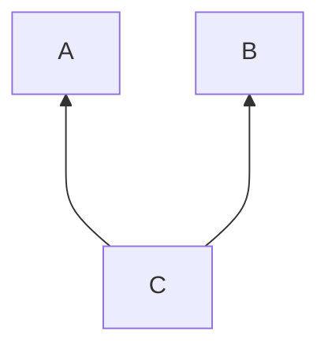
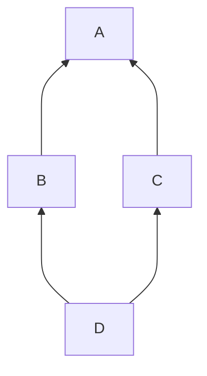

# C++ 笔记

!!! quote "写在前面的话"
    虽然之前已经在一定程度上了解并使用 C++ 了，但还未系统地学习过，这个页面主要用于记录我在学习 C++ 过程中的遇见的值得记忆和有意思的知识点（至少我是这么认为的）。

    笔记主要来自于我在学习 [www.learncpp.com](https://www.learncpp.com/) 和《C++ primer》过程中的一些总结，同时也会参考一些其他来自互联网的资料。

    - 笔记的初衷是在我本人遗忘某个知识点时可以快速地查阅，因此可能会有一些我认为是常识的内容没有记录在这里。
    - 写笔记的过程就是不停往里加新东西，因此显得比较杂乱无章，也许将来某一天会把这些知识点系统性地整理一遍（会，会吗？）。

## 变量

### 初始化

C++中有 5 种常见的初始化形式：
```CPP
int a;         // default-initialization     (no initializer)

// Traditional initialization forms:
int b = 5;     // copy-initialization        (initial value after equals sign)
int c ( 6 );   // direct-initialization      (initial value in parenthesis)

// Modern initialization forms (preferred):
int d { 7 };   // direct-list-initialization (initial value in braces)
int e {};      // value-initialization       (empty braces)
```
在第 4 种初始化方法中，`{}`被称为初始化器，它可以防止窄化（narrowing）的发生，是一种更加安全的初始化方法。
```CPP
int x = 5.3;   // x = 5
int y { 5.3 }; // error: narrowing conversion of '5.3' from 'double' to 'int' inside { } [-Wnarrowing]
```
除此之外，列表初始化也可以写成`int x = {5};`的形式，称为复制列表初始化（copy list initialization），但这种方法比较少见。

!!! note "何时使用`{ 0 }`和`{}`进行初始化？"
    - 当我们希望初始化一个变量的值为 0 时，应该使用`{ 0 }`，如

        ```CPP
        int x { 0 };
        std::cout << x;
        ```

    - 当变量的初始化值是临时存在的，并且将要被替换时，应该使用`{}`，如

        ```CPP
        int x {};
        std::cin >> x;
        ```

!!! note "未被使用的初始化变量"
    当我们初始化一个变量但未使用时，编译器会发出警告

    ```cpp
    int main() {
        int x { 5 };
        return 0;
    }
    ```

    一般而言我们可以通过直接删除掉或注释掉这个变量的声明来消除警告，但如果我们只是当前用不到这个变量，在将来可能会用到，我们可以通过在变量名前加上`[[maybe_unused]]`来消除警告。

    ```CPP
    [[maybe_unused]] int x { 5 };
    ```

    - 此外，编译器在编译后可能会优化程序中的这些变量，因此通常来说它们不会影响性能。

### constexpr

编译器在编译时可能会对程序中一些常量进行优化，例如

```cpp
const int x { 5 };
std::cout << x;
```

就可能会被编译器直接优化为

```cpp
std::cout << 5;
```

要实现上面这个程序在编译层面的**优化**，就需要编译器在**编译时**就得知这个变量是一个常量，并且知道这个常量的值是多少。但是对于上面的这个例子而言，编译器可能优化，也可能不优化，因为它通常并不能确定能否实现**编译时优化**（compile-time optimization）。

如果我们希望编译器总能在编译时优化这个常量，我们可以使用 `constexpr` 关键字提示编译器这个变量是一个在编译时就可以确定值的常量，格式为

```cpp
constexpr int x { expr };
```

其中 `expr` 是一个在编译时就可计算出结果的表达式，称为常量表达式（constant expression）。

!!! info "常量表达式"
    通常而言，常量表达式包含以下内容：（较常见的内容）

    - 字面值常量（literal constants）

        例如 `5`、`3.14`、`'a'`、`"hello"` 等

    - 以常量表达式作为操作数的运算符

        例如 `5 + 3`、`2 * sizeof(int)` 等

    - `constexpr` 变量

    - 被常量表达式初始化的常量整形变量

        例如 `constexpr int x { 5 };`，这是一个来自于历史原因的例外——在现代 C++ 中，constexpr variable 是更优选

    - constexpr function calls with constant expression arguments 

        调用常量表达式作为参数的 constexpr 函数

    以下内容不能作为常量表达式被使用

    - Non-const variables 
    
        非常量变量

    - 操作数不是常量表达式的运算符
    - Const non-integral variables 
    
        非整型的常量变量（即使它是被一个 constexpr variable 初始化的）

    - 调用 non-constexpr 函数的函数（即使函数的返回值是常量表达式）
    - 函数的参数（即使是 constexpr 函数）
    - 运算符 `new`，`delete`，`throw`，`typeid`，`operator,`（逗号运算符）

    包含以上任意一个的表达式都是运行时表达式（runtime expression）。

!!! note "const vs. constexpr"
    - `const` 意味着变量的值在被初始化后不可改变。initializer 的值可以在编译时已知或运行时已知，这个变量在运行时才可被计算出来。
    - `constexpr` 意味个变量可以在常量表达式中使用，它的值在编译时就已知，initializer 的值必须在编译时就已知，这个变量可在编译时或运行时被计算出来。

!!! extra
    一个常量表达式可以在编译时求值，但编译器不一定会这么做。编译器可能会选择在运行时求值，这样可以减少编译时间。

    - **编译器只在需要常量表达式时才被要求在编译时计算常量表达式的值**，也就是说，在不刚需常量表达式的语句中，编译器可以选择在编译时还是在运行时计算常量表达式的值。

    例如

    ```cpp
    const int x { 3 + 4 };
    int y { 3 + 4 }; 
    ```

    上面的 `x` 是一个常量变量，它的初始值必须在编译时就确定，因此编译器一定会在编译时就计算 `3 + 4` 的值。而 `y` 是一个非常量变量，编译器可以选择在编译时计算 `3 + 4` 的值，也可以选择在运行时计算。

### constexpr 函数

constexpr 函数是可以在常量表达式中调用的函数。当 constexpr 函数需要在编译时就计算出结果时（例如它的返回值是一个 constexpr variable 的 initializer），它必须在编译时就运行；否则，它可以在程序编译时或运行时运行。

```cpp
#include <iostream>

int max(int x, int y) // this is a non-constexpr function
{
    if (x > y)
        return x;
    else
        return y;
}

constexpr int cmax(int x, int y) // this is a constexpr function
{
    if (x > y)
        return x;
    else
        return y;
}

int main()
{
    int m1 { max(5, 6) };            // ok
    const int m2 { max(5, 6) };      // ok
    constexpr int m3 { max(5, 6) };  // compile error: max(5, 6) not a constant expression

    int m1 { cmax(5, 6) };           // ok: may evaluate at compile-time or runtime
    const int m2 { cmax(5, 6) };     // ok: may evaluate at compile-time or runtime
    constexpr int m3 { cmax(5, 6) }; // okay: must evaluate at compile-time

    return 0;
}
```

### 多文件程序与全局变量

- 非 const 的全局变量被认为是 `extern` 的，即它可以被其他文件访问。如果我们在一个文件中定义了一个全局变量，而在另一个文件中使用这个全局变量，我们需要在使用的文件中前向声明这个全局变量。
- const 的全局变量会被默认是 `static` 的，即它只能被当前的文件访问和使用。如果我们希望在另一个文件中使用这个 const 全局变量，我们需要在定义的文件中使用 `extern` 关键字来定义这个 const 全局变量，同时在使用它的文件中前向声明这个 const 全局变量。

```cpp title="main.cpp"
#include <iostream>

extern int g_x;       // this extern is a forward declaration of a variable named g_x that is defined somewhere else
extern const int g_y; // this extern is a forward declaration of a const variable named g_y that is defined somewhere else

int main()
{
    std::cout << g_x << ' ' << g_y << '\n'; // prints 2 3

    return 0;
}
```

```cpp title="a.cpp"
// global variable definitions
int g_x { 2 };              // non-constant globals have external linkage by default
extern const int g_y { 3 }; // this extern gives g_y external linkage
```

!!! abstract 
    ```cpp
    // Global variable forward declarations (extern w/ no initializer):
    extern int g_y;                 // forward declaration for non-constant global variable
    extern const int g_y;           // forward declaration for const global variable
    extern constexpr int g_y;       // not allowed: constexpr variables can't be forward declared

    // External global variable definitions (no extern)
    int g_x;                        // defines non-initialized external global variable (zero initialized by default)
    int g_x { 1 };                  // defines initialized external global variable

    // External const global variable definitions (extern w/ initializer)
    extern const int g_x { 2 };     // defines initialized const external global variable
    extern constexpr int g_x { 3 }; // defines initialized constexpr external global variable
    ```

## std::string

传统的 C 风格字符串是一个字符数组，以空字符 `'\0'` 结尾，它在一些情况下使用并不方便（例如不能通过赋值来为字符串分配新的值）。为此 C++17 引入了两种额外的字符串类型：`std::string`（需要 `#include <string>`） 和 `std::string_view`需要 `#include <string_view>`）。它们并不是 fundamental type 而是 class type，因此它们有一些额外的功能。

`std::string` 可以通过赋值语句来更新字符串的值，也可以储存不同大小的字符串

```cpp
std::string name1 { "Chihaya" };
name1 = "Nagasaki";
```

在上面的例子中，我们使用长度为 8 的 C 风格字符串 `"Chihaya"` 初始化了 `name1`（包括空字符 `'\0'`），但 `std::string` 也可以使用其他的 `std::string` 对象来初始化或赋值

!!! info 
    如果 `std::string` 没有足够的内存来存储字符串，它将使用动态内存分配来请求额外的内存空间存储字符串。这意味着 `std::string` 可以存储任意长度的字符串，只要系统内存足够，但也意味着 `std::string` 的操作可能会比 C 风格字符串慢。

### 输入字符串

当我们直接使用 `std::cin` 来输入字符串时，它会在遇到空白字符（空格、制表符、换行符等）时停止输入，因此我们无法输入包含空白字符的字符串。

对于这种情况，我们可以使用 `std::getline()` 来读取整行的输入。`std::getline()` 需要两个参数：第一个是 `std::cin`，第二个是一个 `std::string` 对象，它会读取整行的输入并存储到这个 `std::string` 对象中。

```cpp
std::string name{};
std::getline(std::cin >> std::ws, name);
```

上面这个程序会把整行的输入 `Nagasaki Soyo` 都存储到 `name` 中，而如果直接用 `std::cin` 的话，只会存储 `Nagasaki`。  

!!! question "`std::ws` 是啥"
    `std::ws` 是一个操纵符（manipulator），它会告诉 `std::cin` 忽略输入流中的前导空白字符（空格、制表符、换行符等）。
    
    在上面的例子中，我们使用 `std::ws` 来忽略 `std::cin` 中的前导空白字符，这样可以保证 `std::getline()` 不会读取到有效信息之前的空白字符，直到遇到换行符为止才会停止读取。

### std::string 的长度

`std::string` 是一个类类型，我们可以直接调用它的成员函数 `length()` 来获取字符串的长度，比如 

```cpp
std::string name { "Chihaya" };
name.length(); // 7
```

尽管 `std::string` 要求以 null 字符结尾（从 C++11 开始），但 `length()` 并不会把 null 终止字符计算在内。

!!! tip
    `std::string::length()` 返回的是一个无符号整数值（很可能是 `size_t`），因此如果我们想要把字符串的长度分配给一个 `int` 变量，最好使用 `static_cast` 来避免编译器出现有关有符号/无符号转换警告。

!!! extra "获取字符串长度的其他方法"

    在 C++20 中，我们还可以使用 `std::ssize()` 函数来用一个大的有符号整数来获取 `std::string` 的长度（通常为 `std::ptrdiff_t`）

    由于 `std::ptrdiff_t` 可能大于 `int`，因此如果我们要用一个 `int` 变量来保存长度，也要使用 `static_cast` 来避免警告。

    ```cpp
    int len { static_cast<int>(std::ssize(name)) };
    ```

### 函数与 std::string

由于 `std::string` 的初始化成本很高，当我们把 `std::string` 作为函数的参数时，我们应该尽量避免使用按值传递，因为这会导致函数参数的拷贝初始化，在大部分情况下，我们应该使用引用传递或是改用 `std::string_view` 作为参数。

类似地，在大多数情况下，我们也应该避免在函数中按值返回 `std::string`，因为这同样会产生一个昂贵的副本。

### Literals for std::string

默认情况下，`"Hello"` 会被认为是一个 C 风格字符串，它的类型是 `const char[6]`，是一个字面量常量（literal constant）。

如果我们想要创建一个 `std::string` 类型的字面量，我们可以在双引号后添加一个 `s` 后缀，其中 `s` 必须小写，例如 `"Hello"s`。

- `s` 后缀在命名空间 `std::literals::string_literals` 中定义，我们可以使用 `using namespace std::literals::string_literals;` 来使用它。因为这个命名空间中的定义几乎不会和任何其他代码发生冲突，因此我们直接 `using` 是安全的。

!!! note 
    `"Hello"s` 会被解析为 `std::string { "Hello", 5 }`，它创建一个临时的使用 C 风格字符串字面量来初始化的 `std::string` 对象（长度为 5，不包括隐式 null 终止符）。 

## std::string_view

我们上面提到过 `std::string` 进行初始化（或复制）的开销很大，例如下面的例子中，为了输出一个字符串，我们不得不制作了 `"Hello, world!"` 的两个副本：一个是在 `main()` 中初始化 `std::string` 对象 `s`，另一个是在 `printString()` 中初始化参数 `str`。

```cpp
#include <iostream>
#include <string>

void printString(std::string str) // str makes a copy of its initializer
{
    std::cout << str << '\n';
}

int main()
{
    std::string s{ "Hello, world!" }; // s makes a copy of its initializer
    printString(s);

    return 0;
}
```

为了避免初始化带来的开销，我们可以使用 `std::string_view` 来对一个**现有**字符串（C 风格字符串、`std::string` 对象或另一个 `std::string_view` 对象）的只读访问——可以访问和使用字符串的内容，但不能修改它。

!!! tip "如何理解 `std::string_view`"
    “view” 的含义可以理解为它只是一个指向现有字符串的“视图”——比起直接制作一个完全相同的物体，我们拍一张照片带走以便于后续的观看显然更方便也更经济。

在下面的例子中我们在函数的参数声明中使用 `std::string_view` 来代替 `std::string`，从而避免了初始化 `std::string` 带来的开销。

```cpp
#include <iostream>
#include <string>
#include <string_view>

void printSV(std::string_view str)
{
    std::cout << str << '\n';
}

int main()
{
    printSV("Hello, world!"); // call with C-style string literal

    std::string s2{ "Hello, world!" };
    printSV(s2); // call with std::string

    std::string_view s3 { s2 };
    printSV(s3); // call with std::string_view

    return 0;
}
```

我们还可以从上面的例子中得知一些关于 `std::string_view` 的特点：

- `std::string_view` 可以用许多不同类型的字符串进行初始化，包括C 风格字符串、`std::string` 对象或另一个 `std::string_view` 对象。
- 当函数使用 `std::string_view` 作为参数时，我们可以直接传递 C 风格字符串、`std::string` 对象或另一个 `std::string_view` 对象，在传参过程中 C 风格字符串和 `std::string` 将会被隐式转换为 `std::string_view`。

### 赋值

对 `std::string_view` 对象的赋值只会改变它查看的字符串，而不会改变原先查看字符串的任何内容。

```cpp
std::string name { "Alex" };
std::string_view sv { name };
std::cout << sv << '\n';    // prints Alex

sv = "John";
std::cout << sv << '\n';    // prints John

std::cout << name << '\n';  // prints Alex
```

上面的例子中，`sv = "John"` 会使 `sv` 转向查看字符串 `"John"`，但不会改变 `name` 的值。

### Literals for std::string_view

`std::string_view` 的字面量后缀是 `sv`，例如 `"Hello"sv`。它的定义在命名空间 `std::literals::string_view_literals` 中，我们也可以直接使用 `using namespace std::literals::string_view_literals;` 来使用它，原因和 `std::string` 的字面量后缀一样。

### viewer

`std::string_view` 在它的整个生命周期中都依赖于它所查看的字符串的存在，如果这个字符串被销毁了，那么 `std::string_view` 将会指向一个无效的内存地址，这会导致未定义行为。

!!! note "dangling view"
    当 `std::string_view` 指向一个已经被销毁的字符串时，我们称这个 `std::string_view` 为悬空视图（dangling view）。

    - 可以和悬空指针类比

    例如在下面几种情况中，`sv` 都会成为一个悬空视图：

    === "case 1"

        ```cpp title="case 1"
        int main()
        {
            std::string_view sv{};

            {
                std::string s{ "Hello, world!" };
                sv = s;
            } // s is destroyed here, so sv is now viewing an invalid string

            std::cout << sv << '\n'; // undefined behavior

            return 0;
        }
        ```

        在第一种情况中，我们使用局部变量 `s` 初始化了 `sv`，但当 `s` 超出作用域时，它会被销毁，因此 `sv` 将会成为一个悬空视图。

    === "case 2"

        ```cpp title="case 2"
        std::string getName()
        {
            std::string s { "Alex" };
            return s;
        }

        int main()
        {
        std::string_view name { getName() }; // name initialized with return value of function
        std::cout << name << '\n'; // undefined behavior

        return 0;
        }
        ```

        在第二种情况中，函数的返回值会存储在一个临时变量中，这个临时变量会被用于初始化 `name`，但这个初始化语句结束后，这个临时变量就会被销毁，因此 `name` 将会成为一个悬空视图。

    === "case 3"

        ```cpp title="case 3"
        using namespace std::string_literals;
        std::string_view name { "Alex"s }; // "Alex"s creates a temporary std::string
        std::cout << name << '\n'; // undefined behavior
        ```

        这种情况比较特别：`"Alex"s` 会创建一个临时的 `std::string` 对象，这个对象会被用于初始化 `name`，但这个初始化语句结束后，这个临时变量就会被销毁， `name` 就成为一个悬空视图了。

!!! warning    
    - 不要使用 `std::string` 字面量来初始化一个 `std::string_view`。
    - 使用 C 风格字符串字面量或者 `std::string_view` 字面量来初始化 `std::string_view` 是安全的，因为它们在整个程序的生命周期中都是有效的。
    - 只要我们能够保证 C 风格字符串对象、`std::string` 对象或者 `std::string_view` 对象在 `std::string_view` 的整个生命周期中都是有效的，那么我们就可以使用它们来初始化 `std::string_view`。

当 `std::string_view` 所指向的字符串对象被修改时，会导致未定义的行为

```cpp
std::string s { "Hello, world!" };
std::string_view sv { s }; // sv is now viewing s

s = "Hello, a!";    // modifies s, which invalidates sv (s is still valid)
std::cout << sv << '\n';   // undefined behavior
```

上面的例子中，可能出现两种情况：

- 当 `s` 重新分配内存以存储新的字符串数据时，它会把原先的内存释放掉，这会导致 `sv` 指向的内存地址无效
- 当 `s` 仍然使用原先的内存地址来存储新的字符串数据时，`s` 会用新的字符串数据覆盖原先的字符串数据，`std::string_view` 会查看新的字符串

    - 如果新字符串比原先的字符串长，那么 `std::string_view` 查看到的是新字符串的子串
    - 如果新字符串比原先的字符串短，那么 `std::string_view` 查看到的是新字符串加上一些随机的垃圾字符

!!! tip "`std::string_view` 未必以 `'\0'` 结尾"
    由于 `std::string_view` 可以查看一个字符串的子串，因此它的结尾不一定是 `'\0'`，这意味着在绝大多数情况下我们不能把 `std::string_view` 当作 C 风格字符串来使用。当我们需要一个以 `'\0'` 结尾的字符串时，我们应该使用 `std::string`。

!!! abstract
    - `std::string`

        - 初始化和复制 `std::string` 的成本很高，应尽量避免
        - 尽可能避免按值传递 `std::string`，应该使用引用传递或 `std::string_view`
        - 对 `std::string` 的任何修改都会使得对应的 `std::string_view` 称为悬空视图
        - 可以按值返回一个本地的 `std::string` 对象

    - `std::string_view`

        - `std::string_view` 是一个只读的字符串视图
        - 由于 C 风格字符串在整个程序的生命周期中都是有效的，因此总可以使用 C 风格字符串来初始化 `std::string_view`
        - 使用一个已经无效了的（dangling） `std::string_view` 会导致未定义行为

---

## 类型

### 类型转换

C++ 标准定义了将不同的基本类型（以及某些情况下的复合类型）转换为其他类型的规则，称为标准类型转换（standard type conversions）。标准转换可大致分为 4 类，

- Numeric promotions
- Numeric conversions
- Arithmetic conversions
- Other conversions

#### Numeric promotions

numeric promotion 指的是将*较小（或称较窄）*的整数类型转换为*较大（或称较宽）*的整数类型，在转换的过程中不会出现数据的丢失。

numeric promotion 包括两大类：

1. 浮点数提升（floating-point promotion）

    将 `float` 类型转换为 `double` 类型

2. 整型提升（integer promotion）

    常见的整型提升包括

    - 有符号的 `char` 或有符号的 `short` 转换为 `int`
    - 如果 `int` 能保存 `unsigned char`、`char8_t`、`unsigned short` 的整个范围，那么就转换为 `int`，否则转换为 `unsigned int`
    - `bool` 可以被转换为 `int`，其中 `true` 转换为 `1`，`false` 转换为 `0`

!!! tip
    一些类型转换并不被认为是 numeric promotion，而被认为是 numeric conversion，例如 `char` 到 `short`，因为 `int` 到 `long` 在大多数系统中都是相同大小的。

#### Numeric conversions

数值转换（numeric conversion）有五种基本类型

1. 将一种整型数据转换为任何其他的整型数据（不包括整型提升）

    ```cpp
    short s = 3;        // convert int to short
    long l = 3;         // convert int to long
    char ch = s;        // convert short to char
    unsigned int u = 3; // convert int to unsigned int
    ```

2. 将一种浮点类型数据转换为任意其他的浮点类型（不包括浮点提升）

    ```cpp
    float f = 3.0;        // convert double to float
    long double ld = 3.0; // convert double to long double
    ```

3. 将一种浮点类型转换为任意整型

    ```cpp
    int i = 3.14; // convert double to int
    ```

4. 将一种整型转换为浮点类型

    ```cpp
    double d = 3; // convert int to double
    ```

5. 将整型或浮点类型转换为 bool

    ```cpp
    bool b1 = 3;    // convert int to bool
    bool b2 = 3.14; // convert double to bool
    ```

#### Arithmetic conversions

以下运算符要求它的操作数具有相同的类型，当操作数的类型不同时，会发生隐式类型转换，称为算术转换（arithmetic conversion）。

- 二元算数运算符 `+`、`-`、`*`、`/`、`%`
- 二元关系运算符 `==`、`!=`、`<`、`>`、`<=`、`>=`
- 二进制按位算术运算符 `&`、`|`、`^`
- 条件运算符 `? :`

    条件运算符的第一个参数会被认为是布尔类型，因此不要求它与后两个参数类型相同。

!!! note 
    重载运算符不受通常的算术转换规则的约束。

算术转换的规则较为复杂，因此我们这里只介绍化简过后的规则。

编译器会对各种类型进行一个排名

- long double
- double
- float
- long long
- long
- int
- short

它会参考以下的规则来决定如何进行算术转换

1. 将两种类型进行简单转换

    - 如果一个是整型另一个是浮点型，那么整型将会被转换为浮点型
    - 如果两种类型同为整型或同为浮点型，那么会先进行数值提升（numeric promotion）

2. 将两种类型变为相同的类型

    - 如果此时两种类型一个是有符号的，另一个是无符号的，则参考下面的特殊规则
    - 否则，排名较低的操作数将会转换为排名较高的操作数的类型

!!! note "无符号数与有符号数的转换"
    - 如果无符号操作数的排名大于等于有符号操作数的排名，那么有符号操作数将会被转换为无符号操作数的类型。
    - 如果有符号操作数的类型可以表示无符号操作数类型中的所有值，则无符号操作数将会被转换为有符号操作数的类型。
    - 否则，两个操作数都转换为有符号操作数相应的无符号类型。

### 类型别名

在 C 中，我们使用 `typedef` 来为一个类型定义一个别名，而在 C++ 中，我们可以使用 `using` 关键字来定义类型别名。

```cpp
typedef int score;
using score = int;
```

这两种方法是等价的，但 `using` 更好用的地方在于我们不仅不容易出现在使用 `typedef` 时类型和类型的新名字的顺序相反的错误（`typedef score int;`），而且对于一些复杂的类型别名，`using` 更加直观。

比如下面的例子中，如果我们使用 `typedef` 时，就会得到一个相当丑陋并且难以理解的别名，而使用 `using` 就直观多了

```cpp
typedef int (*FcnType)(double, char); // FcnType hard to find
using FcnType = int(*)(double, char); // FcnType easier to find
```

### 类型推导

类型推导（type deduction，type inference）是指编译器根据变量的初始化表达式来推导变量的类型。我们可以是同 `auto` 关键字进行类型推导。

```cpp
auto d { 5.0 };   // 5.0 is a double literal, so d will be deduced as a double
auto i { 1 + 2 }; // 1 + 2 evaluates to an int, so i will be deduced as an int
auto x { i };     // i is an int, so x will be deduced as an int
auto y { 3.5f };  // 3.5f is a float literal, so y will be deduced as a float
```

因为函数调用也可用于变量的初始化，所以我们也可以使用 `auto` 来推导变量类型为函数的返回类型（函数返回类型不能为 `void`）。

```cpp
int add(int x, int y) {
    return x + y;
}

int main() {
    auto sum { add(5, 6) }; // add() returns an int, so sum's type will be deduced as an int
}
```

#### 类型推导会删除 const

在大多数情况下，类型推导会删除（drop）推导类型中的 `const` 。例如：

```cpp
const int a { 5 }; // a has type const int
auto b { a };      // b has type int (const dropped)
```

如果我们想让 `b` 也是 `const int` 类型，我们可以使用 `const auto` 

```cpp
const auto b { a }; // b has type const int (const dropped but reapplied)
```

由于 `constexpr` 并不是类型系统的一部分，因此它不能进行类型推导。但值得一提的是 `constexpr` 是隐式的 `const`，也同样会在推导时把 `const` 删除。

```cpp
constexpr double a { 3.4 };  // a has type const double (constexpr not part of type, const is implicit)

auto b { a };                // b has type double (const dropped)
const auto c { a };          // c has type const double (const dropped but reapplied)
constexpr auto d { a };      // d has type const double (const dropped but implicitly reapplied by constexpr)
```


---


## 命名空间

我们可以通过 `namespace` 关键字来创建命名空间，命名空间可以包含变量、函数、类等。通常来说，**命名空间的名称以大写字母为开头**

```cpp
namespace NamespaceIdentifier
{
    // content of namespace here
}
```

- 只有声明和定义可以出现在命名空间中，而不能包含赋值语句、函数调用等
- 命名空间里的函数定义可以包含函数所执行的语句
- 命名空间可以嵌套

### 作用域解析运算符

`::` 被称为作用域解析运算符（scope resolution operator），它可以用于访问命名空间中的变量、函数等。

- `::` 的左侧是命名空间的名称，右侧是命名空间中的变量或函数
- 假如 `::` 左侧为空，则假定解析的是全局命名空间

!!! warning "不要使用 `using namespace std` 😡👊"
    使用 `using namespace std` 可能会导致命名空间 `std` 中定义的变量和函数与我们自己定义的变量和函数发生冲突，因此不推荐使用。

### 命名空间的标识符解析

如果我们在一个命名空间中使用标识符（变量或函数的名称）时没有提供解析范围，编译器会先尝试在本地命名空间中寻找匹配的标识符，如果没有找到则逐一向上查找直到找到匹配的标识符，或到达全局命名空间。

我们知道，在 `::` 左侧为空时，假定解析的是全局命名空间，虽然这在多数情况下是多余的，因为全局命名空间是默认的，但在某些情况下，我们可能需要使用 `::` 来明确指出我们要访问的是全局命名空间中的变量或函数。

```cpp
#include <iostream>

void print() // this print() lives in the global namespace
{
	std::cout << " there\n";
}

namespace Foo
{
	void print() // this print() lives in the Foo namespace
	{
		std::cout << "Hello";
	}

	void printHelloThere()
	{
		print();   // calls print() in Foo namespace
		::print(); // calls print() in global namespace
	}
}

int main()
{
	Foo::printHelloThere();

	return 0;
}
```

### 命名空间中的前向声明

当我们使用一个命名空间中的函数时，也需要进行前向声明，通常而言我们可以直接 `#include` 命名空间所在的 `.h` 文件


```cpp title="add.h"
#ifndef ADD_H
#define ADD_H

namespace BasicMath
{
    // function add() is part of namespace BasicMath
    int add(int x, int y);
}

#endif
```

```cpp title="add.cpp"
#include "add.h"

namespace BasicMath
{
    // define the function add() inside namespace BasicMath
    int add(int x, int y)
    {
        return x + y;
    }
}
```

```cpp title="main.cpp"
#include "add.h" // for BasicMath::add()

#include <iostream>

int main()
{
    std::cout << BasicMath::add(4, 3) << '\n';

    return 0;
}
```

编译时使用 `g++/clang main.cpp add.cpp -o main`

### 嵌套命名空间

命名空间可以在另一个命名空间中定义，例如

```cpp title="C++17 之前"
namespace Foo
{
    namespace Goo // Goo is a namespace inside the Foo namespace
    {
        int add(int x, int y)
        {
            return x + y;
        }
    }
}
```

从 C++17 开始，我们也可以这样定义：

``` cpp title="C++17 及之后"
namespace Foo::Goo // Goo is a namespace inside the Foo namespace (C++17 style)
{
    int add(int x, int y)
    {
        return x + y;
    }
}
```

### 命名空间别名（namespace alias）

由于使用嵌套命名空间中的变量或者函数会很冗长，因此我们可以选择创建一个命名空间别名来简化代码。

```cpp
#include <iostream>

namespace Foo::Goo
{
    int add(int x, int y)
    {
        return x + y;
    }
}

int main()
{
    namespace Active = Foo::Goo; // active now refers to Foo::Goo

    std::cout << Active::add(1, 2) << '\n'; // This is really Foo::Goo::add()

    return 0;
} // The Active alias ends here
```

!!! info "命名空间的使用"
    向大众分发的代码应该使用命名空间，以避免其与其他代码发生冲突，通常一个顶级命名空间就足够了（例如 `MyProject`）。
    
    这么做还有一个优点：在绝大多数代码编辑器中键入命名空间的名称之后，再输入 `::` 编辑器就会自动显示该命名空间中的所有函数和变量作为补全的候选项。

### 未命名（匿名）命名空间

**未命名命名空间**（也称为**匿名命名空间**）是没有名称定义的命名空间，如下所示：

```cpp
#include <iostream>

namespace // unnamed namespace
{
    void doSomething() // can only be accessed in this file
    {
        std::cout << "v1\n";
    }
}

int main()
{
    doSomething(); // we can call doSomething() without a namespace prefix

    return 0;
}
```

在未命名命名空间中声明的所有内容都被视为父命名空间的一部分，因此函数或变量即使是在未命名命名空间中声明的，也可以在父命名空间（上例时全局命名空间）中访问。

这看起来似乎没什么用处，但未命名命名空间中的所有标识符都不可以被其他文件访问（或者说具有*内部链接*），效果相当于 `static` 关键字。

当我们有大量内容仅允许当前的翻译单元使用时，使用匿名命名空间显然要比给所有的标识符都加上 `static` 更加方便。


---

## 函数

### 函数重载

我们把两个或多个函数的名称相同，但是参数列表不同的函数称为**函数重载**（function overloading）。

当对已重载的函数进行调用时，编译器将尝试根据函数调用中使用的参数将函数调用与适当的重载函数相匹配，这称为**重载解析**（overload resolution）。

!!! tip
    编译器可以通过**参数的数量**、**参数的类型**进行重载解析，但不能通过**函数返回值类型**进行重载解析。

对于按值传递的参数，编译器不会考虑 const 限定符，因此下面这两个函数不能被编译器所区分

```cpp
void print(int);
void print(const int); // not differentiated from print(int)
```

!!! info "函数的类型签名"
    函数的类型签名（function signature）是指函数头中用于区分不同函数的部分，在 C++ 中，这包括函数名称、参数数量、参数类型和函数级限定符，不包括函数返回值类型。函数的类型签名可用于重载解析。

#### 函数重载解析与模糊匹配

当调用一个已被重载的函数时，编译器将逐步执行一系列规则可，以寻找一个最佳的匹配。

1. 编译器将尝试寻找最佳匹配。

    - 首先，编译器将查看是否存在一个参数列表与函数调用中的参数列表完全一致的重载函数，如果有，那么这个函数就是最佳匹配，编译器将调用这个函数。
    - 接着，编译器将尝试采用一些简单转换（trivial conversions）来匹配参数，包括：

        - 左值到右值的转换
        - 限定符的转换（例如非 const 到 const）
        - 非引用到引用的转换

2. 如果没有找到最佳匹配，编译器将会尝试通过对参数应用 numeric promotion 来寻找匹配的重载函数。
3. 如果 numeric promotion 也没有找到匹配的重载函数，编译器则会尝试 numeric conversion。
4. 如果 numeric conversion 也没能让编译器找到匹配项，那么编译器将尝试通过用户定义的类型转换（user-defined type conversion）来寻找匹配的重载函数。

    ```cpp
    class X 
    {
    public:
        operator int() { return 0; } // Here's a user-defined conversion from X to int
    };

    void foo(int) {}
    void foo(double) {}

    int main()
    {
        X x; 
        foo(x); // x is converted to type int using the user-defined conversion from X to int
        return 0;
    }
    ```

    在上例中，编译器首先发现没有能和 `foo(X)` 完全匹配的重载函数，接着它依次尝试数值提升和数值转换，但都没有找到匹配的重载函数。最后编译器找到了一个用户定义的类型转换，它将 `X` 转换为 `int`，因此 `foo(int)` 就成为了最佳匹配。

    - 如果用户定义的类型转换是 `X` 转换到 `char` 的，那么编译器会先把它转换为 `char`，然后把 `char` 提升为 `int`。

5. 如果通过用户定义的转换也没能找到匹配项，编译器就会尝试查找使用省略号（`...`）的重载函数。
6. 如果此时还未找到匹配项，编译器将放弃并报告无法找到匹配函数的错误。

!!! property "函数重载解析"
    在上面的每一个步骤中，编译器都会尝试对函数调用中的参数应用一大堆不同的类型转换，每次转换后，编译器都会检查是否有重载函数与之匹配，其结果有 3 种：

    - 没有找到匹配的函数。编译器按顺序移动到下一步。
    - 找到了一个最佳匹配，至此重载解析结束，后续步骤不再执行。
    - 找到了多个可能匹配的函数，编译器将会报告一个模糊匹配（或称不明确匹配，ambiguous match）的编译错误。

#### ambiguous match

当编译器在同一步骤中发现多个可以匹配的函数时，编译器将停止匹配并发出编译错误，指出它发现了不明确的函数调用。

!!! example "ambiguous match"
    === "example 1"
        ```cpp title="ambiguous match 1"
        void foo(int) {}
        void foo(double) {}

        int main()
        {
            foo(5L); // 5L is type long

            return 0;
        }
        ```

        编译器在发现找不到 `foo(long)` 之后会尝试 numeric promotion，但 `long` 不能提升（暂时不考虑 `long long`），因此编译器会尝试数值转换。

        但在检查所有数值转换规则的过程中，编译器发现 `foo(int)` 和 `foo(double)` 都可以通过数值转换匹配 `foo(5L)`，因此这里的函数调用被认为是模糊的。

    === "example 2"
        ```cpp title="ambiguous match 2"
        void foo(unsigned int) {}
        void foo(float) {}

        int main()
        {
            foo(0);       // int can be numerically converted to unsigned int or to float
            foo(3.14159); // double can be numerically converted to unsigned int or to float

            return 0;
        }
        ```

        尽管我们可能主观地认为 `foo(0)` 应该调用 `foo(unsigned int)`，而 `foo(3.14159)` 应该调用 `foo(float)`，但编译器并不会这样认为。因为 `0` 是一个 `int` 类型的字面量，它可以被转换为 `unsigned int`或`float` ；而 `3.14159` 是一个 `double` 类型的字面量，它也可以被转换为 `unsigned int` 或 `float`。因此两次调用都是不明确的。

!!! extra "多个参数的重载函数匹配"
    如果有多个参数，编译器将依次将匹配规则应用于每个参数。最终选择的函数至少有一个参数比其他所有函数都更好，并且剩余参数至少不会比其他函数更差。

    ```cpp title="example 1"
    void print(char, int) {
        std::cout << 'a' << '\n';
    }

    void print(char, double) {
        std::cout << 'b' << '\n';
    }

    int main() {
        print('x', 'a');

        return 0;
    }
    ```

    在上例中两个函数都与第一个参数完全匹配，但是第一个 `print()` 可通过数值提升来匹配第二个参数，第二个 `print()` 需要通过数值转换才能匹配第二个参数，因此第一个 `print(char, int)` 是最佳匹配。

    ```cpp title="example 2"
    void print(int, float) {
        std::cout << '1' << '\n';
    }

    void print(char, double) {
        std::cout << '2' << '\n';
    }

    int main()
    {
        print(1, 1.0);

        return 0;
    }
    ```

    在这个例子中 `print(1, 1.0);` 与 `print(int, float)` 的第一个参数完全匹配，但第二个参数需要进行数值转换；同时与 `print(char, double)` 的第二个参数完全匹配，但第一个参数需要进行数值转换。
    
    因此这里不满足“至少有一个参数比其他所有函数都更好，并且剩余参数至少不会比其他函数更差”的条件，因此编译器认为这是一个不明确的函数调用。

### 删除函数

有时候我们在调用函数时不希望它通过类型转换匹配到了一个不能按预期运行的函数，例如

```cpp
void printInt(int x) {
    std::cout << x << '\n';
}

int main()
{
    printInt(5);    // okay: prints 5
    printInt('a');  // prints 97 -- make no sense
    printInt(true); // print 1   -- make no sense

    return 0;
}
```

对于 `printInt('a')` 和 `printInt(true)` 而言，我们认为他们是没有意义的，我们并不希望输出一个字符对应的 ASCII 码或者输出一个布尔值对应的 0/1，我们该怎么做呢？答案是使用 `= delete` 说明符删除函数。

```cpp
void printInt(int x) {
    std::cout << x << '\n';
}

void printInt(char) = delete; // calls to this function will halt compilation
void printInt(bool) = delete; // calls to this function will halt compilation

int main() {
    printInt(97);   // okay

    printInt('a');  // compile error: function deleted
    printInt(true); // compile error: function deleted

    printInt(5.0);  // compile error: ambiguous match

    return 0;
}
```

当我们调用一个已经被 `= delete` 的函数时，编译器将会报告一个编译错误，告诉我们这个函数已经被删除了。

!!! tip
    `= delete` 表示的是“这个函数不应该被调用”，而不是“这个函数不存在”。因此被删除的函数也会参与重载函数的解析过程，`printInt(5.0)` 会出现模糊匹配问题。

!!! extra "删除所有不匹配的重载函数"
    对可能的各种参数逐一使用 `= delete` 有时候会导致代码很冗长，这时我们可以通过函数模板来删除所有不匹配的重载函数。

    ```cpp
    void printInt(int x) {
        std::cout << x << '\n';
    }

    template <typename T>
    void printInt(T x) = delete;
    ```


### 默认参数

在函数声明时，可以给一些参数指定默认值，这样在调用函数时，如果没有提供这些参数的值，编译器将使用默认值。

```cpp
void print(int x, int y=4) {
    std::cout << "x: " << x << '\n';
    std::cout << "y: " << y << '\n';
}
```

- 在函数调用中，任何显式提供的参数都从最左边开始使用，而未提供的参数将使用默认值。
- 如果为一个参数提供了默认值，那么它右边的所有参数都必须有默认值。

    下面这个声明是不允许的
    ```cpp
    void print(int x=10, int y); // not allowed
    ```

- 如果不止一个参数具有默认值，那么其中最左边的参数应当是最有可能由用户显式设置的参数

!!! note "默认参数不能多次声明"
    函数的默认参数不能再同一翻译单元中重复声明，这意味着对于具有前向声明和函数定义的函数，默认参数可以在前向声明中出现，也可以在函数定义中出现，但不可同时在两者中出现。

默认参数还必须在使用之前进行声明，例如下面的代码就是错误的

```cpp
#include <iostream>

void print(int x, int y); // forward declaration, no default argument

int main()
{
    print(3); // compile error: default argument for y hasn't been defined yet

    return 0;
}

void print(int x, int y=4)
{
    std::cout << "x: " << x << '\n';
    std::cout << "y: " << y << '\n';
}
```

因此我们通常会在前向声明中，而非函数定义中声明默认参数。同时如果前向声明位于头文件中，也便于它在被其他文件使用前观察到。

#### 默认参数可能导致模糊匹配

默认参数很容易导致调用的函数不明确，例如

```cpp
void foo(int x = 0) {}
void foo(double d = 0.0) {}
int main()
{
    foo(); // ambiguous function call

    return 0;
}
```

在这里，编译器无法判断调用 `foo(int)` 还是 `foo(double)`。

我们还有另一个例子：

```cpp
void print(int x);                  // signature print(int)
void print(int x, int y = 10);      // signature print(int, int)
void print(int x, double y = 20.5); // signature print(int, double)

int main()
{
    print(1, 2);   // will resolve to print(int, int)
    print(1, 2.5); // will resolve to print(int, double)
    print(1);      // ambiguous function call

    return 0;
}
```

对于 `print(1)` 而言，编译器无法判断调用`print(int)`、`print(int, int)` 还是 `print(int, double)`。

### 函数模板

函数模板是指一种通用的函数定义，它使用一个或多个类型参数来定义一个函数的模板，在使用时编译器可以使用单个模板来生成一系列相关的函数。

创建函数模板时，我们使用占位符类型（placeholder type）来代替函数的参数类型、返回类型或者函数体中将要被使用的类型。在使用函数模板前，我们需要进行**模板参数声明（template parameter declaration）**，模板参数声明的范围仅限于跟在它后面的函数模板（或类模板）。因此，每个函数模板（类模板）都需要有自己的模板参数声明。

```cpp
template <typename T> // this is the template parameter declaration
T max(T x, T y) // this is the function template definition for max<T>
{
    return (x < y) ? y : x;
}
```

在模板参数声明中，我们以关键字`template`开头，它告诉编译器我们正在创建一个模板。接下来，我们在尖括号 ( `<>` ) 内指定模板将使用的所有模板参数。对于每个类型模板参数，我们使用关键字`typename`或`class` ，后跟类型模板参数的名称（例如`T`）。

当函数模板被实例化时，编译器将模板形参替换为模板实参，然后编译生成的实例化函数。函数是否编译取决于每种类型的对象在函数内的使用方式。

从函数模板创建具有特定类型的函数的过程称为**函数模板实例化**（function template instantiation，或简称**实例化**）。当函数因函数调用而实例化时，称为**隐式实例化**。从模板实例化得到的函数在技术上称为**特化**，但在通用语言中通常称为**函数实例**。

!!! example
    ```cpp
    #include <iostream>

    template <typename T>
    T max(T x, T y)
    {
        return (x < y) ? y : x;
    }

    int main()
    {
        std::cout << max(3, 5) << '\n'; // instantiates and calls max<int>(int, int)
        std::cout << max(3.0, 5.0) << '\n'; // instantiates and calls max<double>(double, double)

        return 0;
    }
    ```

    在这个例子中，`max(3, 5)` 实例化为 `max<int>(int, int)`，而 `max(3.0, 5.0)` 实例化为 `max<double>(double, double)`。

    我们还可以指定函数模板实例化某种特定的参数，例如我们可以使用 `max<long>(1, 2)` 来实例化得到 `max<long>(long, long)`，其中 `1` 和 `2` 会被隐式转换为 `long`。

#### 具有多个模板参数的函数模板

现在我们考虑下面的程序

```cpp
template <typename T>
T max(T x, T y)
{
    return (x < y) ? y : x;
}

int main()
{
    std::cout << max(2, 3.5) << '\n';  // compile error

    return 0;
}
```

在调用 `max(2, 3.5)` 时，我们传递了 `int` 和 `double` 两种不同类型的参数，编译器首先发现并不存在一个 `max(int, double)` 的函数。接着在编译器寻找函数模板时，发现了 `max<T>(T, T)`，但是这里要求函数的两个参数是相同类型的，于是无法找到一个匹配的函数模板，这个函数调用无法解析，编译器会报告一个编译错误。

为了解决这个问题，我们可以对函数调用的参数进行显式类型转换，比如 `max(static_cast<double>(2), 3.5)`，或者我们也可以明确地指定函数模板把模板参数实例化为哪一种类型，比如 `max<double>(2, 3.5)`。

实际上解决这个问题的最好办法是让函数模板接受多个模板参数，这样我们就可以传递不同类型的参数给函数模板。

```cpp
template <typename T, typename U> 
T max(T x, U y)
{
    return (x < y) ? y : x;
}
```

但是这样还有一个问题，当我们调用这个函数时，返回值类型将始终与第一个参数的类型相同，比如 `max(2, 3.5)` 的返回值将是 `3` 而非 `3.5`。这种情况下我们可以使用 `auto` 来很方便的解决这个问题：

```cpp
template <typename T, typename U> 
auto max(T x, U y)
{
    return (x < y) ? y : x;
}
```

这样一来 `max(2, 3.5)` 的返回值将是 `3.5`，符合我们的预期。

!!! info "前向声明"
    如果我们要对一个函数进行前向声明，那么我们必须明确返回类型，这代表着我们不能直接使用 `auto` 来声明函数模板。但是我们还可以使用 `std::common_type_t` 来获取 `T` 和 `U` 的通用类型作为我们的显式返回类型。

    ```cpp
    #include <iostream>
    #include <type_traits> // for std::common_type_t

    template <typename T, typename U>
    auto max(T x, U y) -> std::common_type_t<T, U>; // returns the common type of T and U

    int main()
    {
        std::cout << max(2, 3.5) << '\n';

        return 0;
    }

    template <typename T, typename U>
    auto max(T x, U y) -> std::common_type_t<T, U>
    {
        return (x < y) ? y : x;
    }
    ```

!!! extra "缩写函数模板"
    C++20 引入了`auto`关键字的新用法：当`auto`关键字在普通函数中用作参数类型时，编译器会自动将函数转换为函数模板，每个`auto`参数成为*独立*的模板类型参数。这种创建函数模板的方法称为**缩写函数模板（abbreviated function template）**。

    例如

    ```cpp
    auto max(auto x, auto y)
    {
        return (x < y) ? y : x;
    }
    ```

    就相当于

    ```cpp
    template <typename T, typename U> 
    auto max(T x, U y)
    {
        return (x < y) ? y : x;
    }
    ```

    如果我们希望函数模板里的每一个模板类型参数都是独立的类型，就可以选择使用上面的缩写函数模板。但如果我们想让多个模板类型参数是相同的类型，那么目前并没有更简洁的方法来实现下面的写法：

    ```cpp
    template <typename T>
    T max(T x, T y) // two parameters of the same type
    {
        return (x < y) ? y : x;
    }
    ```

#### 非类型模板参数

**非类型模板参数（non-type template parameter）**是指具体有固定类型的模板参数，它以占位符的形式作为模板参数向函数传递 constexpr 值。

非类型模板参数可以是以下的任何类型：

- 整型
- 枚举类型
- `std::nullptr_t`
- 浮点型（从 C++20 开始）
- 指向一个对象的指针或引用
- 指向函数的指针或引用
- 指向成员函数的指针或引用
- 字面量类类型（从 C++20 开始）

!!! example 
    ```cpp
    #include <iostream>

    template <int N> // declare a non-type template parameter of type int named N
    void print()
    {
        std::cout << N << '\n'; // use value of N here
    }

    int main()
    {
        print<5>(); // 5 is our non-type template argument

        return 0;
    }
    ```

    编译器看到函数调用 `print<5>()` 时，会实例化一个如下所示的函数

    ```cpp
    template <>
    void print<5>()
    {
        std::cout << 5 << '\n';
    }
    ```

非类型模板参数主要在我们需要将 constexpr 值传递给函数（或类类型）时使用，这样它就可以在需要常量表达式时传递数据。

从 C++17 开始，非类型模板参数可以使用`auto`让编译器从函数调用的实参中推导出非类型模板参数

```cpp
#include <iostream>

template <auto N> // deduce non-type template parameter from template argument
void print()
{
    std::cout << N << '\n';
}

int main()
{
    print<5>();   // N deduced as int `5`
    print<'c'>(); // N deduced as char `c`

    return 0;
}
```

#### 多文件程序中使用函数模板

考虑下面的程序，它并不能正常工作

```cpp title="main.cpp"
#include <iostream>

template <typename T>
T addOne(T x); // function template forward declaration

int main()
{
    std::cout << addOne(1) << '\n';
    std::cout << addOne(2.3) << '\n';

    return 0;
}
```

```cpp title="add.cpp"
template <typename T>
T addOne(T x) // function template definition
{
    return x + 1;
}
```

在 main.cpp 中，我们调用`addOne<int>`和`addOne<double>`，但是编译器由于在这个翻译单元中看不到 `addOne()` 的定义，它无法在 main.cpp 中实例化这些函数。但是它确实看到了 `addOne` 的前向声明，并且会假设这些函数存在于其他地方，并将在稍后链接。

当编译器去编译 add.cpp 时，它会看到函数模板`addOne`的定义。但是,add.cpp 中没有使用此模板，因此编译器不会实例化任何内容。最终结果是链接器无法将对 main.cpp 中的`addOne<int>`和`addOne<double>`的调用连接到实际函数，因为这些函数从未实例化。

解决这个问题最传统的办法是把所有的模板代码都放入 `.h` 头文件中，而非 `.cpp` 源文件中

```cpp title="add.h"
#ifndef ADD_H
#define ADD_H

template <typename T>
T addOne(T x) // function template definition
{
    return x + 1;
}

#endif
```

```cpp title="main.cpp"
#include <iostream>

template <typename T>
T addOne(T x); // function template forward declaration

int main()
{
    std::cout << addOne(1) << '\n';
    std::cout << addOne(2.3) << '\n';

    return 0;
}
```

这样，任何需要访问模板的文件都可以 `#include` 相关头文件，模板定义将由预处理器复制到源文件中，然后编译器将能够实例化所需的任何函数。

### constexpr 函数

一般的函数是在程序运行时执行的，因此不能参与到一个常量表达式之中。在函数返回值类型之前加上一个 `constexpr` 关键字可以告诉编译器这个函数可以在编译时执行，因此可以用于常量表达式。

如果一个被使用的常量表达式中包含一个 constexpr 函数，那么这个 constexpr 函数调用必须在编译时求值。

要在编译时对函数进行执行，还必须满足其他两件事：

- 调用 constexpr 函数时使用的参数必须都是编译时已知的（例如常量表达式）
- constexpr 函数中的所有语句和表达式都必须可在编译时计算

!!! tip
    和 constexpr 变量类似，constexpr 函数表示的是“可以在编译时计算的函数”，这意味着它可以在常量表达式中使用，但实际上它也可能在运行时才求值，例如

    ```cpp
    #include <iostream>

    constexpr int greater(int x, int y)
    {
        return (x > y ? x : y);
    }

    int main()
    {
        int x{ 5 }; // not constexpr
        int y{ 6 }; // not constexpr

        std::cout << greater(x, y) << " is greater!\n"; // will be evaluated at runtime

        return 0;
    }
    ``` 

    在这个例子中，`x` 和 `y` 都不是常量表达式，因此在编译时 `greater(x, y)` 无法被解析，它会像一个普通函数一样在程序运行时返回结果，`constexpr` 在这种情况下没有任何作用。

当 constexpr 函数中包含了非常量表达式，或者其他的非 constexpr 函数时，它就无法在编译时被运算，这时它也无法被用在常量表达式中。

因此 constexpr 函数需要被用在常量表达式之中时，它必须在编译时被计算。在我们把 constexpr 函数用在常量表达式中时最好随时对代码进行编译、检查，以测试它是否能通过编译。

!!! info "constexpr/consteval 函数的参数并不是 constexpr 的"
    constexpr 函数的参数并不是隐式的 constexpr 变量，也不能声明为 `constexpr`，因此他们不能在函数内的常量表达式中使用。

    ```cpp
    constexpr int foo(int b)    // b is not constexpr, and cannot be used in constant expressions
    {
        constexpr int b2 { b }; // compile error: constexpr variable requires constant expression initializer

        return goo(b);          // compile error: consteval function call requires constant expression argument
    }

    int main()
    {
        constexpr int a { 5 };

        std::cout << foo(a); // okay: constant expression a can be used as argument to constexpr function foo()

        return 0;
    }
    ```

    在这个例子中，constexpr 函数的参数 `b` 不是 constexpr 的（即使函数调用中的 `a` 时一个常量表达式），它不能被用在需要常量表达式的任何地方。

    - constexpr 函数的参数可以声明为 `const` ，但在这种情况下，它们仅被视为一般的运行时常量。

#### constexpr 函数是隐式内联的

当 constexpr 函数在编译时被计算时，编译器必须在这个 constexpr 函数被调用前知道它的完整定义，这样编译器才可以在编译时就用函数的结果替换掉这个函数所在的调用语句。

在这种情况下，仅仅是前向声明是不够的，这意味着被多个文件使用的 constexpr 函数的定义需要被包含到每一个翻译单元中来——这通常会违反单一定义原则（one-definition rule，多个翻译单元中不能出现完全一致的函数定义，除非这个函数是内联函数）。为了避免此类问题，constexpr 函数是隐式内联的，这使得它们不受单一定义规则的约束。

因此，constexpr 函数通常在头文件中定义，因此可以将它们 `#included` 到任何需要完整定义的 .cpp 文件中。

!!! abstract
    - 被单个源文件 (.cpp) 中使用的 constexpr/consteval 函数应在使用它们的上方源文件中定义。
    - 被多个源文件中使用的 constexpr/consteval 函数应在头文件中定义，以便它们可以包含在每个源文件中。

!!! property "编译时求值的 constexpr 函数的前向声明"
    根据 CWG2166 ，对在编译时求值的 constexpr 函数的前向声明的要求实际上是“constexpr 函数必须在最终导致调用的最外层计算之前定义”。因此，下面的代码是有效的

    ```cpp
    #include <iostream>

    constexpr int foo(int);

    constexpr int goo(int c)
    {
        return foo(c);   // note that foo is not defined yet
    }

    constexpr int foo(int b) // okay because foo is still defined before any calls to goo
    {
        return b;
    }

    int main()
    {
        constexpr int a{ goo(5) }; // this is the outermost invocation

        return 0;
    }
    ```

    这么做的目的是允许 constexpr 函数进行相互递归。

#### consteval

当 constexpr 函数不在常量表达式中调用时，我们没办法保证编译器在编译时求值这个函数。解决这个问题的最简单粗暴的方法是用这个 constexpr 函数的返回值去初始化一个变量，但这样就会导致一个不必要的变量，也会使得代码变得冗长且丑陋。


为了解决这个问题，C++20 引入了 `consteval` 关键字，它表示这个函数必须在编译时求值，否则将导致编译错误。

```cpp
#include <iostream>

consteval int greater(int x, int y) // function is now consteval
{
    return (x > y ? x : y);
}

int main()
{
    constexpr int g { greater(5, 6) };              // ok: will evaluate at compile-time
    std::cout << g << '\n';

    std::cout << greater(5, 6) << " is greater!\n"; // ok: will evaluate at compile-time

    int x{ 5 }; // not constexpr
    std::cout << greater(x, 6) << " is greater!\n"; // error: consteval functions must evaluate at compile-time

    return 0;
}
```

上面的例子中，对 `greater(x, 6)` 的调用无法在编译时求值，因此会导致编译错误。

consteval 函数的缺点是此类函数无法在运行时求值，这使得它不如 constexpr 函数灵活——后者可以在编译时或运行时执行。因此，有一种使得 constexpr 函数在编译时强制执行的方法还是很有用的，这样我们就可以在可能时让函数在编译时求值，不能时就在运行时求值。

C++20 为 constexpr 函数提供了实现这一目标的方法——使用一个简洁的辅助函数

```cpp
#include <iostream>

// Uses abbreviated function template (C++20) and `auto` return type to make this function work with any type of value
// See 'related content' box below for more info (you don't need to know how these work to use this function)
consteval auto compileTimeEval(auto value)
{
    return value;
}

constexpr int greater(int x, int y) // function is constexpr
{
    return (x > y ? x : y);
}

int main()
{
    std::cout << greater(5, 6) << '\n';                  // may or may not execute at compile-time
    std::cout << compileTimeEval(greater(5, 6)) << '\n'; // will execute at compile-time

    int x { 5 };
    std::cout << greater(x, 6) << '\n';                  // we can still call the constexpr version at runtime if we wish

    return 0;
}
```

这里我们使用一个 constexpr 函数的返回值作为 consteval 函数的参数，这样我们就可以在编译时强制执行这个 constexpr 函数。

!!! tip
    这里我们让 consteval 函数按值返回，虽然这在运行时执行可能效率低下（如果这个值是复制成本高昂的类型，例如 `std::string`），但在编译中执行时，这不是什么问题。

在 constexpr 或 consteval 函数中，我们可以使用非 constexpr 的局部变量，并且可以更改这些变量的值。因为编译器本质上会“执行”这个函数并返回函数的结果。

```cpp
consteval int doSomething(int x, int y) // function is consteval
{
    x = x + 2;       // we can modify the value of non-const function parameters

    int z { x + y }; // we can instantiate non-const local variables
    if (x > y)
        z = z - 1;   // and then modify their values

    return z;
}
```

!!! warning "不使用 constexpr 函数的原因"
    - 如果某个函数无法作为常量表达式的一部分进行计算，则不应将其标记为 `constexpr`
    - `constexpr` 是函数接口的一部分。一旦函数被设为 constexpr，它就可以被其他 constexpr 函数调用或在需要常量表达式的上下文中使用。稍后删除 `constexpr` 将破坏此类代码
    - constexpr 使函数更难调试，因为我们无法在运行时检查它们

---

## 引用

在 C++ 中，**引用（reference）**相当于现有对象的一个别名（这里的“对象”不特指 OOP 中的 object，而是泛指变量、常量、函数等）。定义了一个引用之后（明确了它所引用的对象之后），对引用的任何操作都相当于对原对象的操作。

### 左值引用

我们通常所说的引用一般指的都是左值引用（lvalue reference），它是通过 `&` 符号来定义的。

```cpp
int        // a normal int type (not an reference)
int&       // an lvalue reference to an int object
double&    // an lvalue reference to a double object
const int& // an lvalue reference to a const int object
```

- 通常所说的左值引用是对一个非 const 变量的引用，即**非 const 左值引用**（**lvalue reference to non-const** or **non-const lvalue reference**）
- 对一个 const 变量的引用称为**const 左值引用**（**lvalue reference to const** or **const lvalue reference**）

引用在初始化时必须明确它所绑定的对象，这意味着引用必须在定义时初始化，且一旦初始化后，它将一直绑定到同一个对象。

- 绑定引用的过程称为**引用绑定**（reference binding）。
- 非常量左值引用只能绑定到可修改的左值上

```cpp
int& invalidRef;   // error: references must be initialized

int x { 5 };
int& ref { x };         // okay

const int y { 5 };
// invalid: non-const lvalue reference can't bind to a non-modifiable lvalue
int& invalidRef { y }; 
// invalid: non-const lvalue reference can't bind to an rvalue 
int& invalidRef2 { 0 }; 
```

如果我们尝试把引用绑定到另一种类型的变量上，编译器会尝试先对这个变量进行隐式类型转换，然后把引用绑定到转换的结果上。但由于隐式类型转换的结果是一个右值，而非 const 左值引用不能绑定到右值上，这就会导致编译错误。

```cpp
int x { 5 };
int& ref { x };            // okay: referenced type (int) matches type of initializer

double d { 6.0 };
int& invalidRef { d };     
double& invalidRef2 { x };
```

引用也可以使用另一个引用来初始化，这样会创建一个新的引用，它绑定到原引用所绑定的对象上。

```cpp
int var{};
int& ref1{ var };  // an lvalue reference bound to var
int& ref2{ ref1 }; // an lvalue reference bound to var
```

!!! info 
    可能会有人会把`int&&`和`int**`（指向指针的指针）进行类比，认为`int&&`是对引用的引用，但实际上这表示对右值的引用（C++11）。

### 引用的生命周期

引用的生命周期和普通的变量类似：引用在定义时创建，在超出作用域时被销毁。

引用和被引用者具有相互独立的生命周期，这意味着

- 引用可以在被引用者之前被销毁
- 被引用者也可以在引用之前被销毁

当引用先被销毁时，被引用对象并不会受到任何印象，但当被引用对象先被销毁时，引用就会变成**悬空引用**（dangling reference），对悬空引用的访问会导致未定义行为。

!!! info "引用不是对象"
    在 C++ 中，引用并不是一个对象。如果可能的话，编译器会试图使用被引用对象来替代所有出现的引用，以此来优化程序，此时引用就不需要占据任何内存空间，甚至不需要实际存在；但有时候这种替代无法做到的，这时候引用就会占据实际的内存空间。

    因为引用不是一个对象，所以我们不能创建引用的引用（左值引用必须指向一个可识别的对象）。

### const 左值引用

刚刚我们提到过，一个非 const 的左值引用不能绑定到 const 变量上，因为如果允许这么做，我们将可以通过引用来修改这个变量，这违背了 const 变量的定义。如果我们希望引用一个 const 变量，我们可以使用 const 左值引用。

```cpp
const int x { 5 };
const int& ref { x };
```

我们也可以对一个非 const 变量使用一个 const 引用，此时通过引用来访问的对象将被视为常量，这表示我们不能通过这个引用来修改这个对象。

```cpp
int x { 5 };
const int& ref { x };
```

!!! note "使用右值初始化 const 左值引用"
    const 左值引用可以绑定到右值上

    ```cpp
    const int& ref { 5 }; // okay: 5 is an rvalue
    ```

    此时将会创建一个临时对象，这个临时对象被右值 5 初始化，然后 const 引用绑定到这个临时对象上。

    之前我们提到过，隐式类型转换的结果是一个右值，这意味着我们可以使用一个类型的 const 引用绑定到另一种类型的对象上去，但此时引用实际上绑定的是临时变量而非原对象，对原对象的任何修改都不会影响到引用。

    ```cpp
    short x { 1 };
    const int& ref { x };

    x--;
    std::cout << ref; // output 1
    ```

为了上述情况中避免临时变量被销毁而导致的悬空引用，C++ 有一个特殊的规则：当 const 左值引用被绑定到一个临时变量上时，临时变量的生命周期将会被延长，直到这个引用的生命周期结束，这个临时变量才会被销毁。

!!! extra "constexpr 左值引用"
    constexpr 允许被应用到引用上时，这个引用将会被允许出现在常量表达式中，但此时这个引用只能绑定到具有静态存储期的对象上（全局变量或静态局部变量）。

    当 constexpr 引用绑定到一个 const 变量上时，我们需要同时使用 constexpr（引用） 和 const（所引用的对象）

    ```cpp
    static const int s_x { 6 };        // a const int
    constexpr const int& ref2 { s_x }; // needs both constexpr and const
    ```

    介于以上的限制，constexpr 引用通常很少出现。

### 按引用传递参数

在函数调用中按值传递参数时，参数会被复制出一个副本以供函数使用，这样会导致一定的开销，尤其是当参数是一个较大的对象时。为了避免这种开销，我们可以使用引用来传递参数。

按引用传递参数时，我们可以在函数内部通过引用来对原对象进行修改，其作用和按地址传递参数类似，但是引用的语法更加简洁。

```cpp
void addOne_ref(int& x) // reference version
{
    x++;
}


void addOne_ptr(int* x) // pointer version
{
    (*x)++;
}
```

- 如果我们不希望函数修改传入的参数，我们可以使用 const 引用来传递参数，这样函数就无法修改传入的参数了。

    ```cpp
    void print(const int& x) // reference version
    {
        std::cout << x << '\n';
    }
    ```

!!! note "把不同类型的参数传递给 const 引用参数"
    之前我们提到过，const 引用可以绑定到不同类型的对象上，但此时引用实际上绑定的是临时变量而非原对象，对原对象的任何修改都不会影响到引用。

    当我们把不同类型的参数传递给 const 引用参数时，也会发生同样的事情。

    ```cpp
    #include <iostream>

    void printAddr_ref(const int& y) {
        std::cout << &y << '\n';
    }

    int main()
    {
        double x { 2.0 };
        std::cout << &x << '\n';

        printAddr_ref(x);

        return 0;
    }
    ```

    在我的一次本地运行中，这个程序的输出是

    ```
    0x7ffcc45a1080
    0x7ffcc45a107c
    ```

    函数中 `y` 的地址和 main 函数中的 `x` 的地址不同，这表明函数内引用绑定的是一个临时变量而非原对象。

!!! question "该用 `std::string_view` 还是 `const std::string&`？"
    在 C++ 中，被作为参数传递的字符串通常是 `std::string`、`std::string_view` 或 C 风格字符串（`const char*`）。     

    | Argument Type            | `std::string_view` parameter | `const std::string&` parameter               |
    |--------------------------|------------------------------|----------------------------------------------|
    | `std::string`              | Inexpensive conversion       | Inexpensive reference binding                |
    | `std::string_view`         | Inexpensive copy             | Expensive explicit conversion to std::string |
    | C-style string / literal | Inexpensive conversion       | Expensive conversion                         |

    1. 函数中的形参是 `std::string_view`，
    
        - 如果传入的是 `std::string` 或 C 风格字符串，那么这个字符串会被转换为 `std::string_view`，但这个转换并不会带来太大的开销
        - 如果传入的是 `std::string_view`，那么这个字符串会被直接按值传递给函数，发生一次开销不大的复制

    2. 函数中的形参是 `const std::string&`，

        - 如果传入的是 `std::string`，引用会直接绑定到传递过来的 `std::string` 上
        - 如果传入的是 `std::string_view` 或 C 风格字符串，那么这个字符串会先被隐式转换为 `std::string`，然后引用才会绑定到这个 `std::string` 上

    从上面的分析可以看出，`std::string_view` 作为参数通常要比 `const std::string&` 更好，因为它可以接受更多类型的参数，而且转换开销更小。

    但这并不是绝对的，在某些情况下，`const std::string&` 可能更适合，例如

    - 使用的 C++ 版本低于 C++14，此时就无法使用 `std::string_view`
    - 如果函数需要使用到字符串一些其他的属性或功能，例如需要字符串以 null 结尾（`std::string_view` 不保证它以 null 结尾）、需要调用 `std::string` 的成员函数等

### 按引用返回

当函数按值返回时，会制作一个函数返回值的副本，然后传递给调用者，这样会导致一定的开销，尤其是当返回值是一个较大的对象时。

为了避免这种开销，我们可以使用引用来返回函数的结果。**按引用返回**（return by reference）的函数返回的是一个绑定到需要返回的对象的引用。

```cpp
const std::string& getProgramName() // returns a const reference
{
    static const std::string s_programName { "Calculator" };

    return s_programName;
}

int main()
{
    std::cout << "This program is named " << getProgramName();

    return 0;
}
```

!!! warning "通过引用返回的对象必须在函数返回后仍存在"
    为了避免出现悬空引用，我们必须确保被引用的对象的生命周期要比调用的这个函数更长。例如上面的例子中我们让 `s_programName` 成为了一个具有 static 生命周期的变量。

!!! example
    在实际的程序中，我们应当避免对非 const 的静态变量的按引用返回，例如

    ```cpp
    #include <iostream>

    const int& getNextId()
    {
        static int s_x{ 0 };
        ++s_x;
        return s_x;
    }

    int main()
    {
        const int& id1 { getNextId() }; // id1 is a reference
        const int& id2 { getNextId() }; // id2 is a reference

        std::cout << id1 << id2 << '\n';

        return 0;
    }
    ```

    程序的输出结果为

    ```cpp
    22
    ```

    发生这种情况是因为`id1`和`id2`引用了相同的对象（静态变量`s_x`），因此当修改`s_x`被修改时，所有引用都会访问修改后的值。
    
    对于上面的这个例子，我们可以把`id1`和`id2`改为普通的常量变量 `const int` 而非 `const int&`，这样它们就可以保存返回值的副本，而非保存对`s_x`的引用。

关于按引用返回有一个很有趣的事情是，我们可以借助函数调用返回的引用来修改一个变量：

```cpp
#include <iostream>

int& max(int& x, int& y)
{
    return (x > y) ? x : y;
}

int main()
{
    int a{ 5 };
    int b{ 6 };

    max(a, b) = 7; // sets the greater of a or b to 7

    std::cout << a << b << '\n';

    return 0;
}
```

上述程序中 b 的值更大，因此 `max()` 函数将会返回一个绑定到 b 的引用，我们可以直接利用这个引用来修改 b 的值为 7。因此这段程序的输出结果为

```cpp
57
```

### 关于引用的类型推导

我们知道，使用 `auto` 进行类型推导时，const 标识符会被删除，实际上除了删除 const 之外，auto 还会删除引用标识符。

!!! example
    ```cpp
    std::string& getRef();

    int main()
    {
        auto ref { getRef() }; // type deduced as std::string (not std::string&)

        return 0;
    }
    ```

    在这个例子中，尽管函数`getRef()`返回一个`std::string&`，但`ref`的类型被推导为`std::string`。

就像 const 一样，如果我们希望类型被推导为引用，我们可以在定义处重新把它变为参考

```cpp
std::string& getRef();

auto ref1 { getRef() };  
auto& ref2 { getRef() }; 
```

!!! definition "Top-level const and low-level const"
    - **顶级 const（top-level const）**：const 修饰的是**对象本身**，或者**指针或引用本身**，而非指针或引用所指向的对象。例如 
    
    ```cpp
    const int x;
    int* const ptr;
    int& const ref;
    ```

    - **低级 const（low-level const）**：const 修饰的是**指针所指向的对象**或**引用所绑定的对象**，而非指针或引用本身。例如

    ```cpp
    const int& ref; 
    const int* ptr;
    ```

    指针也可以同时拥有两种 const，例如

    ```cpp
    const int* const ptr;
    ```

- 当我们说类型推导会删去 const 限定符时，我们指的是**顶层 const**，而**底层 const**则会被保留。

!!! key-point
    删除引用时可能会把一个低级 const 变为顶级 const： 

    - `const std::string&` 是低级 const，但删除引用后会得到 `const std::string` ，它现在变成顶级 const了，可以在类型推导中被删去。

    因此，如果初始化器是一个对 const 变量的引用，那么在类型推导时会首先删除引用，然后再删除 const 限定符。

    ```cpp
    const std::string& getConstRef();

    int main()
    {
        auto ref1{ getConstRef() }; // std::string

        return 0;
    }
    ```

如果我们希望得到的是引用和/或 const 限定符，可以手动添加它们：

```cpp
const std::string& getConstRef();

int main()
{
    auto ref1{ getConstRef() };        // std::string 
    const auto ref2{ getConstRef() };  // const std::string

    auto& ref3{ getConstRef() };       // const std::string& 
    const auto& ref4{ getConstRef() }; // const std::string& 

    return 0;
}
```

上例的前两种情况前面已经介绍过了，就不多解释了。值得解释的是 `ref3`：

- 通常，引用会首先被删除，此时 const 就是顶层的了，然后 const 也会被删除。但是由于我们这时候重新把引用应用到了 `auto` 上，相当于重新添加了引用，此时 const 仍然是底层的，不会被删去，因此 `ref3` 的类型是 `const std::string&`。

`ref4` 的情况和 `ref3` 类似，只是我们也重新应用了 const 限定符。由于类型已经被推导为对 const 的引用，重复的 const 实际上是多余的，但这并不会导致编译错误。事实上这也有助于代码编写者/阅读者明确地知道这个引用是一个对 const 的引用。

!!! question "推导为 constexpr 引用"
    !!! tip 
        当我们希望定义一个绑定到 const 变量的 constexpr 引用时，我们需要同时使用 `constexpr`（修饰引用）和 `const`（修饰被绑定对象）限定符。例如`constexpr const int&`。

    constexpr 不是类型系统的一部分，因此永远不会被推导出来（但它是隐式的 const），我们需要将其显式地把它加到类型推导中。

    ```cpp

    constexpr std::string_view hello { "Hello" };   // implicitly const

    constexpr const std::string_view& getConstRef() // function is constexpr, returns a const std::string_view&
    {
        return hello;
    }

    int main()
    {
        // std::string_view (reference dropped and top-level const dropped)
        auto ref1{ getConstRef() }; 

        // constexpr const std::string_view (reference dropped and top-level const dropped, constexpr applied, implicitly const)                 
        constexpr auto ref2{ getConstRef() };        

        // const std::string_view& (reference reapplied, low-level const not dropped)
        auto& ref3{ getConstRef() };  

        // constexpr const std::string_view& (reference reapplied, low-level const not dropped, constexpr applied)              
        constexpr const auto& ref4{ getConstRef() }; 

        return 0;
    }
    ```

!!! note "指针的类型推导"
    与引用不同，指针的类型推导不会去掉指针标识符，因此 `auto` 推导出来的类型会是指针（还记得吗，引用不是一个对象，而指针是），我们还可以使用 `auto*` 来明确指出推到的结果一定是一个指针。

    ```cpp
    std::string* getPtr(); // some function that returns a pointer

    int main()
    {
        auto ptr1{ getPtr() };  // std::string*
        auto* ptr2{ getPtr() }; // std::string*

        return 0;
    }
    ```

!!! abstract
    顶层 const 和底层 const 

    - 顶层 const 修饰的是对象本身，如 `const int x`和`int* const ptr`
    - 低层 const 修饰的是指针所指向的对象，如 `const int& ref` 和 `const int* ptr`

    推导的过程

    - 类型推导首先删除所有引用（除非推导的类型被定义为引用 `auto&`）
    - 然后类型推导会删除所有顶层 const 限定符（除非推导的类型被定义为 const 或 constexpr）
    - constexpr 不是类型系统的一部分，不会被推导出来，需要将其显式添加到类型推导中
    - 类型推导不会删除指针标识符
    - 在进行类型推导时，始终显式地使用引用标识符、指针标识符、const 限定符和 constexpr 限定符，即使这些限定符是多余的。这有助于我们明晰自己想得到的类型，防止出现错误。

    关于指针的类型推导

    - 使用 `auto` 时，仅当初始化器是指针时，类型推导的结果才是指针。使用`auto*`时，即使初始化器不是指针，推论类型也始终是指针。
    - auto const 和 const auto 都会使推导得到的的指针成为 const 指针。
    - auto* const 的结果是 const 指针，而 const auto* 的结果是指向 const 对象的指针。
    - 对指针类型进行推导时，尽可能考虑使用 `auto*` 而非 `auto`，这样允许我们显式地重新应用顶级和低层 const，并且能保证推导的结果是一个指针。

### 右值引用

C++11 添加了一种新型的参考——右值参考（rvalue reference），它被设计为仅可被右值初始化，我们使用 `&&` 符号来定义右值引用。

```cpp
int x{ 5 };
int& lref{ x };  // l-value reference initialized with l-value x
int&& rref{ 5 }; // r-value reference initialized with r-value 5
```

右值引用有两个有用的属性：

- 右值引用将使得被用于初始化的右值的生命周期延长至于这个右值引用的生命周期相同，而不是像普通的右值一样在它出现的的完整表达式结束后就被销毁。
- 非 const 的右值引用甚至允许我们修改这个右值。

!!! example 

    ```cpp
    int main()
    {
        int&& rref{ 5 }; 

        std::cout << rref << ' '; // prints 5

        rref = 10; // okay: modifies the r-value

        std::cout << rref; // prints 10

        return 0;
    }
    ```

    上述程序将输出

    ```
    5 10
    ```

虽然先用字面量初始化一个右值引用，然后修改这个值看起来很奇怪，但当我们初始化一个右值引用时，实际上会用这个字面量初始化一个临时变量，然后这个右值引用绑定到这个临时变量上，因此我们实际上是在修改这个临时变量。

右值引用常用作函数的参数，尤其是当我们在希望重载函数能区分左值和右值，并作出不同的行为时

```cpp
#include <iostream>

void fun(const int& lref) // l-value arguments
{
	std::cout << "l-value reference to const: " << lref << '\n';
}

void fun(int&& rref) // r-value arguments
{
	std::cout << "r-value reference: " << rref << '\n';
}

int main()
{
	int x{ 5 };
	fun(x); // l-value argument calls l-value version of function
	fun(5); // r-value argument calls r-value version of function

	return 0;
}
```

这段程序的输出为

```
l-value reference to const: 5
r-value reference: 5
```

右值作为函数参数常常用于[移动语义](#移动语义)

!!! tip

    ```cpp
    int&& ref{ 5 };
    fun(ref);
    ```

    上面的代码片段实际上调用的是 `fun(const int&)` 而非 `fun(int&&)`，因为 `ref` 虽然具有类型 `int&&`，但在表达式中使用时它是一个左值，因此实际上会调用 `fun(const int&)`。


---

## 类模板

类似于函数模板是用于实例化函数的一模板定义，**类模板**（class template）是用于实例化类类型的一种模板定义。

!!! tip "类类型（class type）"
    类类型包括结构体、类和联合体（struct, class, and union type），为简单起见，下面我们仅在结构体上演示类模板的用法，但它们同样适用于类和联合体。

对于一个简单的结构体 Pair

```cpp
struct Pair
{
    int first{};
    int second{};
};
```

我们可以用类模板把它重写为

```cpp

template <typename T>
struct Pair
{
    T first{};
    T second{};
};

int main()
{
    Pair<int> p1{ 5, 6 };        
    Pair<double> p2{ 1.2, 3.4 }; 

    return 0;
}
```

当我们想要实例化一个结构体时，只需要像函数模板一样在结构体名称后面加上尖括号，然后在尖括号中指定类型即可，例如 `Pair<int>` 和 `Pair<double>`。

### 函数中的类模板

我们还可以对这个类模板创建一个函数模板

```
template <typename T>
constexpr T max(Pair<T> p)
{
    return (p.first < p.second ? p.second : p.first);
}
```

在调用函数时，可以显示地传入 `Pair` 的模板参数，也可以让编译器自动推导

```cpp
Pair<int> p1{ 5, 6 };
std::cout << max<int>(p1) << " is larger\n"; // explicit call to max<int>

Pair<double> p2{ 1.2, 3.4 };
std::cout << max(p2) << " is larger\n";
```

如果我们试图调用 `max<double>(p1)` 则会出现编译错误

!!! note
    类模板可以使用模板类型和普通的类型（非模板类型）混合使用

    ```cpp
    template <typename T>
    struct Foo
    {
        T first{};    // first will have whatever type T is replaced with
        int second{}; // second will always have type int, regardless of what type T is
    };
    ```

    类模板也可以使用多种模板类型

    ```cpp
    template <typename T, typename U>
    struct Pair
    {
        T first{};
        U second{};
    };

    template <typename T, typename U>
    void print(Pair<T, U> p)
    {
        std::cout << '[' << p.first << ", " << p.second << ']';
    }
    ```

    如果我们希望编写一个用于各种类型的 `print()` 函数（只要能通过编译就可以），可以写为

    ```cpp
    template <typename T>
    void print(T p) // type template parameter will match anything
    {
        std::cout << '[' << p.first << ", " << p.second << ']'; 
        // will only compile if type has first and second members
    }
    ```

!!! info
    由于处理数据对的情况很常见，因此 C++ 标准库包含一个名为 `std::pair` 的类模板（在 `<utility>` 头文件中），它是一个类似于我们定义的 `Pair` 的类模板。

    ```cpp
    #include <iostream>
    #include <utility>

    template <typename T, typename U>
    void print(std::pair<T, U> p)
    {
        // the members of std::pair have predefined names `first` and `second`
        std::cout << '[' << p.first << ", " << p.second << ']';
    }

    int main()
    {
        std::pair<int, double> p1{ 1, 2.3 }; // a pair holding an int and a double
        std::pair<double, int> p2{ 4.5, 6 }; // a pair holding a double and an int
        std::pair<int, int> p3{ 7, 8 };      // a pair holding two ints

        print(p2);

        return 0;
    }
    ```

    我们刚刚实现了自己的 `Pair` 类，但在实际的代码中使用 `std::pair` 是个更好的选择

和函数模板一样，类模板通常也在头文件中定义，通过 `#include` 指令包含到需要使用的文件中。

### 类模板参数推导（CTAD）

从 C++17 开始，从类模板实例化对象时，编译器可以从初始化器的类型中推导出模板类型，这称之为**类模板参数推导**（Class Template Argument Deduction，CTAD）。

```cpp
#include <utility> // for std::pair

int main()
{
    // explicitly specify class template std::pair<int, int> (C++11 onward)
    std::pair<int, int> p1{ 1, 2 }; 

    // CTAD used to deduce std::pair<int, int> from the initializers (C++17)
    std::pair p2{ 1, 2 };           

    return 0;
}
```

仅在没有模板参数列表时，编译器才会执行 CTAD，因此以下两种情况都是错误的

```cpp
std::pair<> p1 { 1, 2 };
std::pair<int> p2 { 3, 4 };
```

由于 CTAD 是一种类型推导的形式，因此我们可以使用字面量后缀来更改推导得到的类型：

```cpp
std::pair p1 { 3.4f, 5.6f }; // pair<float, float>
std::pair p2 { 1u, 2u };     // pair<unsigned int, unsigned int>
```

#### 模板参数推导指南（C++17）

在多数情况下，CTAD 可以直接使用；但在某些情况下，编译器可能需要一些额外的帮助才能知道如何正确地推断模板参数。

例如在下面的程序在 C++17 中无法编译

```cpp
template <typename T, typename U>
struct Pair
{
    T first{};
    U second{};
};

int main()
{
    Pair<int, int> p1{ 1, 2 }; // ok: we're explicitly specifying the template arguments
    Pair p2{ 1, 2 };           // compile error in C++17 (okay in C++20)

    return 0;
}
```

在 C++17 中编译上面这段代码，可能会遇到“class template argument deduction failed”或“cannot deduce template arguments”或“No viable constructor or deduction guide”的报错信息。这是因为在 C++17 中，编译器不知道如何推导聚合类模板的模板参数，因此我们需要提供一个**模板参数推导指南**（deduction guide）来帮助编译器推导模板参数。

这是添加推导指南之后的同一段程序：

```cpp
template <typename T, typename U>
struct Pair
{
    T first{};
    U second{};
};

// Pair objects initialized with arguments of type T and U should deduce to Pair<T, U>
template <typename T, typename U>
Pair(T, U) -> Pair<T, U>;

int main()
{
    // explicitly specify class template Pair<int, int> (C++11 onward)
    Pair<int, int> p1{ 1, 2 }; 
    // CTAD used to deduce Pair<int, int> from the initializers (C++17)
    Pair p2{ 1, 2 };           

    return 0;
}
```

```cpp title="deduction guide"
template <typename T, typename U>
Pair(T, U) -> Pair<T, U>;
```

上面这段的推导指南的作用是，告诉编译器当它看到一个名为 `Pair` 的对象带有类型分别为 `T` 和 `U` 的参数时，应该把最终的类型推导为 `Pair<T, U>`。

!!! tip
    - C++20 中添加了编译器自动生成推导指南的功能，因此我们只需要在 C++17 中手动编写推导指南
    - `std::pair`（和其他标准库中的模板类型）附带预定义的推导指南，无需我们自己提供推导指南

#### 模板参数的默认值

就像函数参数可以有默认参数一样，模板参数也可以有默认值。当模板参数未明确指定且无法推断时，将使用这些参数。

```cpp
template <typename T=int, typename U=int> // default T and U to type int
struct Pair
{
    T first{};
    U second{};
};

template <typename T, typename U>
Pair(T, U) -> Pair<T, U>;

int main()
{
    // explicitly specify class template Pair<int, int> (C++11 onward)
    Pair<int, int> p1{ 1, 2 }; 

    // CTAD used to deduce Pair<int, int> (C++17)
    Pair p2{ 1, 2 };           

    // uses default Pair<int, int>
    Pair p3;                   

    return 0;
}
```

这里我们对 `p3` 的定义并未明确指定类型模板参数的类型，也没有能够从中推导这些类型的初始化器。

??? warning "CTAD 不适用于函数参数"
    CTAD 表示的是 class template *argument* deduction，而非 class template *parameter* deduction，因此它不能用于函数的形参（parameter）。例如下面的代码是错误的：

    ```cpp
    #include <iostream>
    #include <utility>

    void print(std::pair p) // compile error, CTAD can't be used here
    {
        std::cout << p.first << ' ' << p.second << '\n';
    }

    int main()
    {
        std::pair p { 1, 2 }; // p deduced to std::pair<int, int>
        print(p);

        return 0;
    }
    ```

    这种情况下，我们需要显式地使用模板：

    ```
    #include <iostream>
    #include <utility>

    template <typename T, typename U>
    void print(std::pair<T, U> p)
    {
        std::cout << p.first << ' ' << p.second << '\n';
    }

    int main()
    {
        std::pair p { 1, 2 }; // p deduced to std::pair<int, int>
        print(p);

        return 0;
    }
    ```

#### 别名模板

我们可以像为普通的类型创建别名一样，为类模板创建一个类型别名，这个类型别名的作用范围是它被定义的那个作用域。

```cpp
#include <iostream>

template <typename T>
struct Pair
{
    T first{};
    T second{};
};

template <typename T>
void print(const Pair<T>& p)
{
    std::cout << p.first << ' ' << p.second << '\n';
}

int main()
{
    using Point = Pair<int>; // create normal type alias
    Point p { 1, 2 };        // compiler replaces this with Pair<int>

    print(p);

    return 0;
}
```

有时候，我们可能需要一个模板类的类型别名，但是并非所有的模板参数都被定义到这个别名的一部分（这部分参数被别名的使用者提供）。为此我们可以定义一个**别名模板**（alias template），它可以用于实例化一个类型别名。

```cpp
#include <iostream>

template <typename T>
struct Pair
{
    T first{};
    T second{};
};

// Here's our alias template
// Alias templates must be defined in global scope
template <typename T>
using Coord = Pair<T>; // Coord is an alias for Pair<T>

// Our print function template needs to know that Coord's template parameter T is a type template parameter
template <typename T>
void print(const Coord<T>& c)
{
    std::cout << c.first << ' ' << c.second << '\n';
}

int main()
{
    Coord<int> p1 { 1, 2 }; // Pre C++-20: We must explicitly specify all type template argument
    Coord p2 { 1, 2 };      // In C++20, we can use alias template deduction to deduce the template arguments in cases where CTAD works

    std::cout << p1.first << ' ' << p1.second << '\n';
    print(p2);

    return 0;
}
```

这里，我们将一个名为`Coord`的别名模板定义为`Pair<T>`的别名，其中类型模板参数`T`将由坐标别名的使用者提供。`Coord`是别名模板，`Coord<T>`是`Pair<T>`的实例化类型别名，定义后，`Coord`相当于`Pair`，`Coord<int>`相当于`Pair<int>`。

关于别名模板我们有几点需要注意

- 与普通类型的别名（可以在块内定义）不同，别名模板必须在全局定义域中定义
- 在 C++20 之前，当我们使用别名模板实例化对象时，必须显式指定模板参数。从 C++20 开始，我们可以使用别名模板推导（alias template deduction），在别名类型可与 CTAD 配合使用的情况下，它将从初始化器推导模板参数的类型。
- 由于 CTAD 不适用于函数参数（parameter），因此当我们使用别名模板作为函数参数时，必须显式定义别名模板使用的模板实参。

    换句话说，我们只能这么写

    ```cpp
    template <typename T>
    void print(const Coord<T>& c)
    {
        std::cout << c.first << ' ' << c.second << '\n';
    }
    ```

    而不能这么写

    ```cpp
    void print(const Coord& c)
    {
        std::cout << c.first << ' ' << c.second << '\n';
    }
    ```

    实际上和我们使用 `Pair` 和 `Pair<T>` 时是一样的。

### 具有成员函数的类模板

定义为类模板参数声明的一部分的类型模板参数既可以用作类的成员变量的类型，也可以用作类的成员函数的返回类型或参数类型。

例如对于我们已经定义过的 `Pair` 类模板，我们可以把它从结构体转换为类

```cpp
#include <ios>       // for std::boolalpha
#include <iostream>

template <typename T>
class Pair
{
private:
    T m_first{};
    T m_second{};

public:
    // When we define a member function inside the class definition,
    // the template parameter declaration belonging to the class applies
    Pair(const T& first, const T& second)
        : m_first{ first }
        , m_second{ second }
    {
    }

    bool isEqual(const Pair<T>& pair);
};

// When we define a member function outside the class definition,
// we need to resupply a template parameter declaration
template <typename T>
bool Pair<T>::isEqual(const Pair<T>& pair)
{
    return m_first == pair.m_first && m_second == pair.m_second;
}

int main()
{
    Pair p1{ 5, 6 }; // uses CTAD to infer type Pair<int>
    std::cout << std::boolalpha << "isEqual(5, 6): " << p1.isEqual( Pair{5, 6} ) << '\n';
    std::cout << std::boolalpha << "isEqual(5, 7): " << p1.isEqual( Pair{5, 7} ) << '\n';

    return 0;
}
```

- 由于类不是一个聚合类型，因此我们不能像结构体那样使用聚合初始化，因此我们必须使用构造函数来初始化类的成员变量。

    - 由于 T 类型在复制时的开销可能较大，因此我们通过 const 引用来传递参数，而非直接按值传递，以避免不必要的复制。

    - 当我们在类模板定义中对成员函数进行定义时，我们不需要为成员函数提供模板参数声明，它们会默认使用类模板的模板参数声明。

- 对于非聚合的类，我们不需要为 CTAD 提供推导指南。与传入的参数匹配的构造函数为编译器提供了从初始化器推导模板参数所需的信息。
- 对于在类定义外部定义的成员函数，我们需要重新提供模板参数声明。

    ```cpp
    template <typename T>
    bool Pair<T>::isEqual(const Pair<T>& pair)
    {
        return m_first == pair.m_first && m_second == pair.m_second;
    }
    ```

    - 除此之外，我们在类外部定义成员变量时，我们需要使用类模板的完整名称（`Pair<T>::isEqual`，而非`Pair<T>::isEqual`）来限定成员函数名称。

#### 注入类名

我们可以注意到我们在类模板中定义的构造函数的名称是 `Pair`，而不是 `Pair<T>`。在类的范围内，没有被限定的类名被称为**注入类名**（injected class name）。在类模板中，注入类名相当于完整模板名的一个速记。

在上面的例子中，`Pair`是`Pair<T>`的注入类名，因此我们在`Pair<T>`的作用域内使用的任何`Pair`都被视为`Pair<T>`。

这意味着我们还可以把 `isEqual()` 成员函数定义为

```cpp
template <typename T>
bool Pair<T>::isEqual(const Pair& pair) // Pair, not Pair<T>
{
    return m_first == pair.m_first && m_second == pair.m_second;
}
```

!!! key-point
    我们前面提到过 CTAD 不适用于函数参数（因为是 argument deduction，而不是 parameter deduction），但是我们使用注入类名作为函数参数是完全可以的，因为它是完全模板名称的速记，并没有使用 CTAD。

???+ question "在何处定义类模板之外的成员函数？"
    对于类模板的成员函数，编译器需要同时查看类的定义（以确保将成员函数模板被声明为类的一部分）和模板成员函数的定义（以了解如何实例化模板）。因此我们同城希望在相同（或至少相近）的位置定义类模板及其模板成员函数。

    - 当我们*在类定义中*对成员函数模板进行定义时，由于模板成员函数的定义是类定义的一部分，任何可以看到类定义的地方，都可以看到模板成员函数定义。
    - 当我们*在类定义外部*对成员函数模板进行定义时，通常我们需要在类定义的下方紧接着就定义模板成员函数，这样可以确保编译器在看到类定义时就能看到模板成员函数的定义。

    从上面的讨论中我们可以知道，当我们在 .h 文件中定义类模板时，成员函数模板也应在该 .h 文件中定义。


---

## 类

定义一个类的语法与定义一个结构体相当类似

```cpp
class MyClass
{
public:
    int myInt{ 0 };
    double myDouble{ 0.0 };
    void print()
    {
        std::cout << myInt << ' ' << myDouble << '\n';
    }
};
```


### 类不变式（class invariant）

[C++ Core Guidelines](https://isocpp.github.io/CppCoreGuidelines/CppCoreGuidelines) 将不变式定义为“程序某一时刻或某一段时间里必须得到满足的条件”。

对于类类型（包括结构体、类和联合体），**类不变式**是指在类的生命周期中，类的成员变量必须满足的条件，违反类不变量的对象被认为处于**无效状态**。

!!! key-point
    使用违反类不变式的对象可能导致意外或未定义的行为。

例如考虑下面的结构体：

```cpp
struct Fraction
{
    int numerator { 0 };
    int denominator { 1 };
};
```

我们知道在数学中，分数的分母不能为 0，因此我们要确保 Fraction 的 denominator 成员变量永远不会设置为 0，否则该 Fraction 对象处于无效状态，使用这个对象可能会导致未定义的行为。

例如一个简单的函数

```cpp
void printFractionValue(const Fraction& f)
{
     std::cout << f.numerator / f.denominator << '\n';
}
```

调用 `printFractionValue({ 5, 0 })` 时会出现除零错误，虽然我们可以通过在函数内添加一个 assert 语句检查分母是否为 0 来避免除零错误，但这并不能解决问题的根本。

依赖于用户来维护类不变量是不可靠的，尤其是在比分数这个例子复杂得多的情况下。理想情况下，我们希望对我们的类类型进行保护，使得对象不能被置于无效状态，或者如果处于无效状态，可以立即发出信号（而不是在将来某个时刻出现未定义行为时才知道）。

!!! property "类与结构体"
    从技术角度来看，结构和类几乎相同——能用结构体实现的内容都可以通过类实现，反之亦然。`class` 和 `struct` 在语法上几乎没有区别，仅有一些微小的差别：

    - class 默认访问说明符为 private, 这其实隐含了它应该将数据设为私用, 即拥有不变式.
    - struct 默认访问说明符为 public, 这其实隐含了它应该将数据设为公用, 即没有不变式.

    如果某个类类型具有不变式，则使用 class；如果数据成员之间相互独立，则使用 struct。

### 成员函数

除了成员变量之外，类类型还可以拥有自己的函数，称之为**成员函数**（member function）。

不是成员函数的函数称为**非成员函数**（non-member function），有时也称为**自由函数**（free function）。

!!! info
    在其他面向对象语言（例如 Java 和 C#）中，成员函数也称为**方法**（method）。我们只需要知道这两个术语在表示一个东西即可。

为简单起见，我们用结构体来介绍成员函数：

```cpp
struct Date
{
    int year {};
    int month {};
    int day {};

    void print() 
    {
        std::cout << year << '/' << month << '/' << day;
    }
};

int main()
{
    Date today { 2020, 10, 14 };

    today.day = 16;
    today.print();

    return 0;
}
```

在这个例子中我们可以看到，成员函数 `print()` 是在结构体 `Date` 内部定义的，它可以访问结构体的成员变量 `year`、`month` 和 `day`。在使用成员函数时，我们不需要把 today 作为参数传递给成员函数。当某个对象的成员函数被调用时，它本身会被**隐式传递**给成员函数，因此我们不需要使用成员选择运算符`.` ，这个对象被称为**隐式对象**（the implicit object）。

!!! info "成员变量和函数可以按任意顺序定义"
    非成员函数在使用之前必须进行声明，否则在编译时会报错。但类类型的成员函数并没有这个限制，我们可以在声明成员变量和成员函数之前访问它们。

    ```cpp
    struct Foo
    {
        int z() { return m_data; } // We can access data members before they are defined
        int x() { return y(); }    // We can can access member functions before they are defined

        int m_data { y() };        // This even works in default member initializers (see warning below)
        int y() { return 5; }
    };
    ```

    但是数据成员将按照声明的顺序进行初始化，如果一个成员在初始化时需要使用到一个稍后才声明的另一个成员，那么初始化将会导致未定义的行为。

    ```cpp
    struct Bad
    {
        int m_bad1 { m_data }; // undefined behavior: m_bad1 initialized before m_data
        int m_bad2 { fcn() };  // undefined behavior: m_bad2 initialized before m_data (accessed through fcn())

        int m_data { 5 };
        int fcn() { return m_data; }
    };
    ```

    因此，最好避免在成员变量初始化时使用其他成员。

!!! extra "成员函数也可以进行重载"
    ```cpp
    #include <iostream>
    #include <string_view>

    struct Date
    {
        int year {};
        int month {};
        int day {};

        void print()
        {
            std::cout << year << '/' << month << '/' << day;
        }

        void print(std::string_view prefix)
        {
            std::cout << prefix << year << '/' << month << '/' << day;
        }
    };

    int main()
    {
        Date today { 2020, 10, 14 };

        today.print(); // calls Date::print()
        std::cout << '\n';

        today.print("The date is: "); // calls Date::print(std::string_view)
        std::cout << '\n';

        return 0;
    }
    ```

    输出结果为

    ```
    2020/10/14
    The date is: 2020/10/14
    ```

### const 对象和 const 成员函数

我们可以向普通的变量一样，用 const 关键字来声明一个类类型对象。一旦初始化了 const 类类型对象，就不允许对对象的成员数据进行修改，这既包括直接修改成员变量（如果是 public 的），也包括通过成员函数修改成员变量。

实际上我们还会发现，如果我们尝试在 const 对象上调用非 const 成员函数，编译器会报错，即使这个非 const 函数并不会修改成员变量。

```cpp
#include <iostream>

struct Date
{
    int year {};
    int month {};
    int day {};

    void print()
    {
        std::cout << year << '/' << month << '/' << day;
    }
};

int main()
{
    const Date today { 2020, 10, 14 }; // const

    today.print();  // compile error: can't call non-const member function

    return 0;
}
```

我们可以通过把 const 关键字附加到函数原型后来使得这个函数变为 const 成员函数

```cpp
struct Date
{
    int year {};
    int month {};
    int day {};

    void print() const // now a const member function
    {
        std::cout << year << '/' << month << '/' << day;
    }
};
```

!!! tip
    - 尝试更改成员变量或调用非 const 成员函数的 const 成员函数将导致编译错误
    - 构造函数不能设为 const，因为它们需要初始化对象的成员，这需要修改它们
    - const 成员函数可以也被非 const 对象调用，因此我们最好把不会改变对象状态的成员函数设置为 const

虽然很少会这么做，但是成员函数可以被重载为 const 和非 const 两个版本，因为 const 限定符也被认为是函数签名的一部分。

```cpp
#include <iostream>

struct Something
{
    void print()
    {
        std::cout << "non-const\n";
    }

    void print() const
    {
        std::cout << "const\n";
    }
};

int main()
{
    Something s1{};
    s1.print(); // calls print()

    const Something s2{};
    s2.print(); // calls print() const

    return 0;
}
``` 

输出结果为

```
non-const
const
```

### 访问说明符

C++ 具有三种不同的访问级别：public、private 和 protected，我们暂时先介绍前两者。

每当对对象的成员进行访问时，编译器都会检查这个成员的访问级别，如果访问级别不允许访问者访问该成员，编译器将报错。

- **public**：公共成员可以被任何人访问，包括同一个类的其他成员、其他类的成员和非成员函数。
- **private**：私有成员只能被类自己的成员访问，无法被其他类的成员或非成员函数访问。

前面提到过，类的默认访问说明符是 private，而结构体的默认访问说明符是 public。

- 默认情况下，结构体的所有成员都是公共成员
- 默认情况下，类的所有成员都是私有成员，这表示我们不能直接对类进行聚合初始化

    ```cpp
    #include <iostream>

    class Date
    {
        // class members are private by default, can only be accessed by other members
        int m_year {};     // private by default
        int m_month {};    // private by default
        int m_day {};      // private by default

        void print() const // private by default
        {
            // private members can be accessed in member functions
            std::cout << m_year << '/' << m_month << '/' << m_day;
        }
    };

    int main()
    {
        Date today { 2020, 10, 14 }; // compile error: can no longer use aggregate initialization

        // private members can not be accessed by the public
        today.m_day = 16; // compile error: the m_day member is private
        today.print();    // compile error: the print() member function is private

        return 0;
    }
    ```

!!! property "给 private 变量命名"
    在 C++ 中，我们经常能见到给 private 的变量加上前缀 `m_`，这是一种常见的命名约定，它有助于区分成员变量和局部变量。例如一个成员函数

    ```cpp
    void setName(std::string_view name)
    {
        m_name = name;
    }
    ```

    这样我们就能很容易地知道 `m_name` 是一个成员变量，而 `name` 是一个局部变量。

    - 如果有需要，class 的 public 成员也可以使用这种命名方式，但是结构体的 public 成员通常不会使用这个前缀。

我们可以使用访问说明符来明确成员的访问级别，包括 `public:`、`private:` 和 `protected:`。

```cpp
class Date
{
public:

    void print() const
    {
        // members can access other private members
        std::cout << m_year << '/' << m_month << '/' << m_day;
    }

private:

    int m_year { 2020 };
    int m_month { 14 };
    int m_day { 10 };
};
```

| Access level | Access specifier | Member access | Derived class access | Public access |
|---|---|---|---|---|
| Public | public: | yes | yes | yes |
| Protected | protected: | yes | yes | no |
| Private | private: | yes | no | no |

有一个很容易被误解的点是：C++ 的访问级别是以每个类（per-class）为基准的，而非每个对象（per-object）。这意味着一个对象的成员函数**可以访问同类的其他对象的私有成员**。

```cpp
#include <iostream>
#include <string>
#include <string_view>

class Person
{
private:
    std::string m_name{};

public:
    void shakeHands(const Person& p) const
    {
        std::cout << m_name << " shake hands with " << p.m_name << '\n';
    }

    void setName(std::string_view name)
    {
        m_name = name;
    }
};

int main()
{
    Person joe;
    joe.setName("Joe");

    Person kate;
    kate.setName("Kate");

    joe.shakeHands(kate);

    return 0;
}
```

这段程序运行后得到输出结果为

```
Joe shake hands with Kate
```

在这里 `m_name` 是 private 的变量，因此它只能被同为 `Person` 这个类的其他对象访问，因此我们在成员函数 `shakeHands()` 中可以直接使用另一个对象的 private 变量 `p.m_name`。

### 访问函数

访问函数（access function）指的是用于检索或更改一个类的私有成员的函数。访问函数有两种：**getter** 和 **setter**。访问函数的存在也为我们提供了一定程度的数据封装。

- **getter**：用于检索私有成员的值，有时也称为**访问器**（accessor）
- **setter**：用于更改私有成员的值，有时也称为**修改器**（mutator）

getter 通常被设置为 const 成员函数，因为它们不会修改对象的状态；setter 则不是 const 成员函数，因为它们会修改对象的状态。

```cpp
class Date
{
private:
    int m_year { 2020 };
    int m_month { 10 };
    int m_day { 14 };

public:
    void print()
    {
        std::cout << m_year << '/' << m_month << '/' << m_day << '\n';
    }

    int getYear() const { return m_year; }        // getter for year
    void setYear(int year) { m_year = year; }     // setter for year

    int getMonth() const  { return m_month; }     // getter for month
    void setMonth(int month) { m_month = month; } // setter for month

    int getDay() const { return m_day; }          // getter for day
    void setDay(int day) { m_day = day; }         // setter for day
};
```

我们通常会给访问函数加上前缀 `get` 和 `set`，这是一种常见的命名约定，它有助于我们识别 getter 和 setter。

### 类成员的声明顺序

由于类的中的成员变量和成员函数不需要在使用之前声明，因此我们不必像在类之外书写代码那样先声明再使用。那么我们该如何安排这些成员的顺序呢？目前主要有两种主张：

1. 首先列出 private 成员，然后再列出 public 的成员函数。

    这是一种较为传统的风格，任何查看我们的类代码的人都会在使用数据成员之间就了解它们的定义，这符合阅读的习惯，并让阅读者更容易了解实现的细节。

2. 首先列出 public 成员，然后再列出 private 的成员函数。

    这种风格将类的接口放在了首位，这样用户可以更容易地找到他们可能需要的函数和使用方法，而不必关注具体的实现细节（很多时候用户并不关心这些细节）。

!!! info "Google C++ style guide 的建议"
    [Google C++ style guide](https://google.github.io/styleguide/cppguide.html#Declaration_Order) 推荐按照以下的顺序安排类的成员：

    - Types and type aliases (typedef, using, enum, nested structs and classes, and friend types)
    - Static constants
    - Factory functions
    - Constructors and assignment operators
    - Destructor
    - All other functions (static and non-static member functions, and friend functions)
    - Data members (static and non-static)

### 构造函数

#### 构造函数引入

当类类型是一个聚合体时，我们可以使用聚合初始化来初始化对象，例如

```cpp
struct Foo // Foo is an aggregate
{
    int x {};
    int y {};
};

int main()
{
    Foo foo { 6, 7 }; // uses aggregate initialization

    return 0;
}
```

聚合初始化会按照成员定义的顺序对成员进行初始化，上面这个例子中，`foo.x` 被初始化为 `6`，`foo.y` 被初始化为 `7`。但是一旦我们把任意一个成员变量变为 private 的，这个类类型就不再是聚合体了（因为聚合体不能拥有私有成员），这时我们就不能再使用聚合初始化了。

```cpp
class Foo // Foo is not an aggregate (has private members)
{
    int m_x {};
    int m_y {};
};

int main()
{
    Foo foo { 6, 7 }; // compile error: can not use aggregate initialization

    return 0;
}
```

不允许带有私有成员的类类型使用聚合初始化的原因是

- 聚合初始化需要了解类的具体实现（必须知道成员是什么，以及它们是按照什么顺序声明的），这和我们把变量设为私有的是相悖的
- 如果我们的类具有某种不变性，那么在初始化时我们就需要依靠用户来确保这种不变性，这是不可靠的

既然我们不能使用聚合初始化来对 class 进行初始化，我们就要使用别的方法——**构造函数**（constructor）。

构造函数是一种特殊的成员函数，它会在创建一个非聚合类的对象后被自动调用。编译器会查看是否可以找到和调用者提供的初始化值（如果有的话）相匹配的构造函数

- 如果找到了可访问的匹配的构造函数，编译器将为这个对象分配内存，然后调用这个构造函数
- 如果没有找到匹配的构造函数，将会出现编译错误

构造函数不仅决定如何创建一个对象，通常还执行以下两个工作

1. 对成员变量进行初始化（通过初始化列表或构造函数体）
2. 执行一些其他的设置函数（setup functions），可能包括检查初始化值、打开文件等

!!! note "构造函数的命名"
    构造函数的命名与普通的成员函数不同，它有一些特殊的规则：

    - 构造函数的名称必须与类名相同。对于模板类，构造函数的名称将不包括模板参数。
    - 构造函数没有任何返回类型（也没有 void），因为它们不返回任何值。

由于构造函数需要对正在构造的对象进行初始化，因此它不能是 const 的。

> 通常，非 const 成员函数不能被一个 const 对象调用，但 C++ 标准明确指出 const 标识符不适用于正在构建的对象，并且 const 在构造函数结束之后才生效。

```cpp
#include <iostream>

class Foo
{
private:
    int m_x {};
    int m_y {};

public:
    Foo(int x, int y)
    {
        std::cout << "Foo(" << x << ", " << y << ") constructed\n";
    }

    void print() const
    {
        std::cout << "Foo(" << m_x << ", " << m_y << ")\n";
    }
};

int main()
{
    Foo foo{ 6, 7 };
    foo.print();

    return 0;
}
```

由于这个构造函数并没有对成员变量进行初始化，因此这段程序的输出为

```
Foo(6, 7) constructed
Foo(0, 0)
```

!!! extra "构造函数的参数会进行隐式转换"
    对于上面的构造函数，我们可以使用任何可以隐式转换为 `int` 的类型来调用它，例如 `Foo foo{ 'a', true };` 或 `Foo foo{ 3.14, 2.71 };` 等。

#### 成员初始化列表

为了让构造函数初始化成员，我们可以使用**成员初始化列表**（member initializer list, or member initialization list）。

对于我们上面的构造函数，我们只需要略作修改就可以让它初始化 `m_x` 和 `m_y`。

```cpp hl_lines="3"
public:
    Foo(int x, int y)
        : m_x { x }, m_y { y }
    {
        std::cout << "Foo(" << x << ", " << y << ") constructed\n";
    }
```

成员初始化列表应紧接在在构造函数的参数列表之后，它以一个冒号 `:` 开始，后面列出要初始化的每个成员及其初始化值，每个成员初始化之间用逗号 `,` 分隔。

修改后的程序输出结果为

```
Foo(6, 7) constructed
Foo(6, 7)
```

!!! info "成员初始化列表的格式"
    C++ 并不在意我们把成员初始化列表的冒号、逗号和空格是怎么写的，因此下面几种格式也都是有效的（并且都可能遇见）

    ```cpp title="style 1"
    Foo(int x, int y) : m_x { x }, m_y { y }
    {
    }
    ```

    ```cpp title="style 2"
    Foo(int x, int y) :
        m_x { x },
        m_y { y }
    {
    }
    ```

    ```cpp title="style 3"
    Foo(int x, int y)
        : m_x { x }
        , m_y { y }
    {
    }
    ```

C++ 标准要求成员初始化列表的成员初始化顺序必须与它们在类中声明的顺序一致，而我们在直觉上可能会认为成员变量将按照初始化列表中的顺序进行初始化，这就可能导致一些错误。

假如我们的类定义如下

```cpp
class Foo
{
private:
    int m_x{};
    int m_y{};

public:
    Foo(int x, int y)
        : m_y { std::max(x, y) }, m_x { m_y } // issue on this line
    {
    }

    void print() const
    {
        std::cout << "Foo(" << m_x << ", " << m_y << ")\n";
    }
};
```

尽管 `m_y` 在初始化列表中出现在 `m_x` 之前，但是 `m_x` 会比 `m_y` 先初始化，但由于 `m_x` 的初始化依赖于 `m_y` 的值，这就会产生未定义行为。例如在我的机器上，这段程序的输出结果是`Foo(32731, 7)`。

!!! warning "成员初始化列表的顺序"
    为了避免这种问题，我们应该按照成员变量在类中的声明顺序来编写成员初始化列表。

成员变量可以被以下几种方法初始化

- 如果成员初始化列表中有对成员变量的初始化，那么这个成员变量将被初始化为成员初始化列表中的值
- 如果成员初始化列表中没有对成员变量的初始化，那么这个成员变量将被初始化为它的默认值（如果有的话）
- 否则，这个成员将被默认初始化（通常是未定义的值）

#### 默认构造函数

我们把不接受任何参数的构造函数称为**默认构造函数**（default constructor）。

如果一个类类型具有默认构造函数，则值初始化和默认初始化都将调用默认构造函数

??? example "默认构造函数"
    ```cpp
    #include <iostream>

    class Foo
    {
    public:
        Foo() // default constructor
        {
            std::cout << "Foo default constructed\n";
        }
    };

    int main()
    {
        Foo foo1 {}; // value initialization
        Foo foo2;    // default initialization
        return 0;
    }
    ```

    这里的两种初始化都将调用默认构造函数，它们本质上是等价的。但我们知道对于聚合体而言，值初始化更加安全；而有时候我们难以区分一个类类型是聚合体还是非聚合体，因此最好使用值初始化来初始化对象。

与其他函数一样，构造函数的最右边参数可以具有默认参数。如果构造函数中的所有参数都有默认参数，那么这个构造函数就被认为是默认构造函数（因为它可以在没有参数的情况下调用。

因为构造函数也是函数，因此它们也可以重载。也就是说，对于一个类类型，我们可以拥有多种构造函数，以便于以不同的方式构造对象。

??? example
    ```cpp
    #include <iostream>

    class Foo
    {
    private:
        int m_x {};
        int m_y {};

    public:
        Foo() // default constructor
        {
            std::cout << "Foo constructed\n";
        }

        Foo(int x=1, int y=2) // default constructor
            : m_x { x }, m_y { y }
        {
            std::cout << "Foo(" << m_x << ", " << m_y << ") constructed\n";
        }
    };

    int main()
    {
        Foo foo1 {1, 2}; // calls Foo(int, int)
        Foo foo2; // compile error: ambiguous constructor function call
        return 0;
    }
    ```

    当我们试图实例化 `foo2` 时，编译器将寻找默认构造函数，但是由于有两个默认构造函数，编译器无法确定调用哪一个，因此会报错。

**隐式默认构造函数**

如果一个非聚合的类类型没有定义任何构造函数，那么编译器将为它生成一个默认构造函数，称为隐式默认构造函数。隐式默认构造函数等同于没有参数，没有成员初始化器列表，也没有函数体的构造函数。

??? example "隐式默认构造函数"
    ```cpp
    #include <iostream>

    class Foo
    {
    private:
        int m_x{1};
        int m_y{2};

        // Note: no constructors declared
    };

    int main()
    {
        Foo foo{};

        return 0;
    }
    ```

    编译会为我们生成如下的构造函数：

    ```cpp
    public:
        Foo() // implicitly generated default constructor
        {
        }
    ```
    
    这段程序中，`Foo foo{}` 将调用隐式默认构造函数，`m_x` 和 `m_y` 分别将被初始化为 `1` 和 `2`。

    我们也可以通过 `= default` 来显式声明一个默认构造函数

    ```cpp
    public:
        Foo() = default; // explicitly defaulted default constructor
    ```

#### 委托构造函数

**委托构造函数**（delegating constructors）是一种特殊的构造函数，它允许一个构造函数调用另一个构造函数来初始化对象，这个过程有时称为**构造函数链**。

```cpp
#include <iostream>
#include <string>
#include <string_view>

class Employee
{
private:
    std::string m_name { "???" };
    int m_id { 0 };

public:
    Employee(std::string_view name)
        : Employee{ name, 0 } 
        // delegate initialization to Employee(std::string_view, int) constructor
    {
    }

    Employee(std::string_view name, int id)
        : m_name{ name }, m_id { id } 
        // actually initializes the members
    {
        std::cout << "Employee " << m_name << " created\n";
    }

};

int main()
{
    Employee e1{ "James" };
    Employee e2{ "Dave", 42 };
}
```

- 当 `e1{ "James" }` 被初始化时，与之匹配的构造函数 `Employee(std::string_view name)` 被调用，这个构造函数在成员初始化列表中把初始化的人物委托给另一个构造函数 `Employee(std::string_view name, int id)` 来初始化对象。
- 被委托的构造函数 `Employee(std::string_view name, int id)` 把 `m_name` 初始化为 `name`，把 `m_id` 初始化为 `id`，然后执行它的函数体。
- 被委托的构造函数体被执行后，控制权返回给委托的构造函数，它的函数体也被执行。
- 最后，控制权返回给函数调用者。

!!! note "关于委托构造函数的一些其他细节"
    - 把初始化任务委托给其他构造函数的构造函数本身不能进行任何初始化。也就是说，一个构造函数要么自己初始化对象，要么委托给其他构造函数来初始化对象，不能两者兼有。
    - 通常而言，我们会让参数较少的构造函数委托给参数较多的构造函数，这样我们就可以避免重复代码。
    - 被委托的构造函数也可以把初始化任务委托给另一个构造函数，这样就形成了构造函数链。但是这有可能造成一个无限循环，因此我们应该避免这种情况。

有时候我们也可以用默认值来将多个构造函数合并为一个，这样我们就不需要使用委托构造函数了。

```cpp
public:
    Employee(std::string_view name, int id = 0) // default argument for id
        : m_name{ name }, m_id{ id }
    {
        std::cout << "Employee " << m_name << " created\n";
    }
```

由于默认值只能从函数调用的最右边参数开始设置，因此我们应该在定义成员变量时先定义不带默认值的成员变量（使用者必须提供的参数），然后再定义带默认值的成员变量（使用者可选的参数）。

#### 复制构造函数

**复制构造函数**（copy constructor）是一种特殊的构造函数，它用一个现有的对象来初始化一个新对象。复制构造函数执行后，新创建的对象将是原对象的一个副本。

如果我们没有定义复制构造函数，编译器将为我们生成一个 public 的隐式复制构造函数，这个复制构造函数将依次复制每个成员变量。

```cpp
class Foo
{
private:
    int m_x {1};
    int m_y {2};

public:
    Foo() = default; // default constructor

    Foo(const Foo& foo) // copy constructor
        : m_x{foo.m_x}, m_y{foo.m_y}
    {
        std::cout << "Foo copied\n";
    }
};
```

!!! tip
    在前面我们提到过，C++ 中的 private 和 public 是以类为单位的，而不是以对象为单位的。因此，复制构造函数可以访问同类的其他对象的私有成员，以便于我们进行复制。

一般而言，除了复制之外，复制构造函数不应该有任何其他的副作用，因为在某些情况下，编译器可以优化复制构造函数，如果我们加上了额外的副作用，就可能无法进行优化。

- 一般而言，我们不需要自己去定义一个复制构造函数，使用隐式复制构造函数就足够了
- 如果我们需要自己定义一个复制构造函数，需要注意复制构造函数的参数是一个 const 引用
- 如果我们乐意，可以用 `= default` 来显式声明一个默认复制构造函数

    ```cpp
    public:
        // Explicitly request default copy constructor
        Foo(const Foo& foo) = default;
    ```

- 如果我们不希望一个类对象被复制，我们可以将复制构造函数声明为 `delete`

    ```cpp
    public:
        // Prevent copying
        Foo(const Foo& foo) = delete;
    ```

!!! property "类的初始化"
    我们知道对于基本类型而言，有 6 种基本的初始化方式：

    ```cpp
    int a;         // default initialization
    int b = 5;     // copy initialization
    int c( 6 );    // irect initialization

    // List initialization methods (C++11)
    int d { 7 };   // direct list initialization
    int e = { 8 }; // copy list initialization
    int f {};      // value initialization
    ```

    而上面这些初始化方式对于类类型也是有效的：

    ```cpp
    #include <iostream>

    class Foo
    {
    public:
        // Default constructor
        Foo() {
            std::cout << "Foo()\n";
        }

        // Normal constructor
        Foo(int x) {
            std::cout << "Foo(int) " << x << '\n';
        }

        // Copy constructor
        Foo(const Foo&) {
            std::cout << "Foo(const Foo&)\n";
        }
    };

    int main()
    {
        // Calls Foo() default constructor
        Foo f1;           // default initialization
        Foo f2{};         // value initialization (preferred)

        // Calls foo(int) normal constructor
        Foo f3 = 3;       // copy initialization
        Foo f4(4);        // direct initialization
        Foo f5{ 5 };      // direct list initialization (preferred)
        Foo f6 = { 6 };   // copy list initialization 

        // Calls foo(const Foo&) copy constructor
        Foo f7 = f3;      // copy initialization
        Foo f8(f3);       // direct initialization
        Foo f9{ f3 };     // direct list initialization (preferred)
        Foo f10 = { f3 }; // copy list initialization

        return 0;
    }
    ```

??? extra "复制省略"
    考虑一个简单的程序

    ```cpp
    #include <iostream>

    class Something
    {
        int m_x{};

    public:
        Something(int x)
            : m_x{ x }
        {
            std::cout << "Normal constructor\n";
        }

        Something(const Something& s)
            : m_x { s.m_x }
        {
            std::cout << "Copy constructor\n";
        }

        void print() const { std::cout << "Something(" << m_x << ")\n"; }
    };

    int main()
    {
        Something s { Something { 5 } }; // focus on this line
        s.print();
    }
    ```

    在上面变量 `s` 的初始化中，我们首先构建了一个用 `5` 来初始化的临时的 `Something` 对象，然后用这个临时对象来初始化 `s`，最后调用 `s.print()`。

    在没有任何优化的情况下，上述程序的输出结果应该是

    ```
    Normal constructor
    Copy constructor
    Something(5)
    ```

    但由于编译器可以对重写代码以进行优化，我们可以很自然地猜想编译器是否可以优化掉不必要的对象副本，答案是肯定的。在本人的测试中，输出结果是

    ```
    Normal constructor
    Something(5)
    ```

    上面的优化称为**复制省略**（copy elision），它是 C++ 标准的一部分，允许编译器在某些情况下省略复制构造函数的调用。

    这也是我们在编写复制构造函数时应该避免引入副作用的原因之一：当编译器把复制构造函数优化掉时，它的副作用将不会被执行。

    !!! info "强制复制省略（C++17）"
        在 C++17 之前，复制省略是编译器可选的一个优化；但在 C++17 中，在某些情况下即使我们已经明确告知编译器不要执行复制省略，复制省略也会被强制执行。

#### 转换构造函数

我们知道，当调用函数时传入函数的参数类型和函数声明中的参数类型不匹配时，编译器会尝试进行隐式类型转换。考虑下面这个例子

???+ example
    ```cpp
    #include <iostream>

    class Foo
    {
    private:
        int m_x{};
    public:
        Foo(int x)
            : m_x{ x }
        {
        }

        int getX() const { return m_x; }
    };

    void printFoo(Foo f) // has a Foo parameter
    {
        std::cout << f.getX();
    }

    int main()
    {
        printFoo(5); // we're supplying an int argument

        return 0;
    }
    ```

在这里我们给 `printFoo` 传入的参数是 `int`，但函数需要的是一个 `Foo` 对象，编译器将尝试把 `int` 转换为 `Foo` 对象。这种转换是通过 `Foo` 的构造函数 `Foo(int x)` 来完成的，它相当于把一个 `int` 参数转换为了一个 `Foo` 对象。这种可用于执行隐式转换的构造函数称为**转换构造函数**（converting constructor）。

有时候我们不希望一个函数只能调用一个类对象而不能发生隐式类型转换，这时我们可以在构造函数前面加上 `explicit` 关键字，这样这个构造函数就不能用于隐式类型转换了。

???+ example
    ```cpp
    #include <iostream>

    class Dollars
    {
    private:
        int m_dollars{};

    public:
        Dollars(int d)
            : m_dollars{ d }
        {
        }

        int getDollars() const { return m_dollars; }
    };

    void print(Dollars d)
    {
        std::cout << "$" << d.getDollars();
    }

    int main()
    {
        print(5);

        return 0;
    }
    ```

    在这里我们调用`print(5)`时，`Dollars(int)`转换构造函数将会把 `5` 转换为一个 `Dollars` 对象，然后传递给 `print` 函数。这段程序的输出结果是 `$5`。

给这个例子中的构造函数加上 `explicit` 关键字后，编译器将不再允许隐式类型转换，这时我们必须显式地给函数传入一个 `Dollars` 对象。

```cpp
public:
    explicit Dollars(int d) // now explicit
        : m_dollars{ d }
    {
    }
```

- explicit 构造函数不能用于复制初始化或复制列表初始化
- explicit 构造函数不能用于进行隐式转换（因为这实际上会使用复制初始化或复制列表初始化）

!!! note "何时使用 explicit 关键字"
    - 一般情况下，任何接受单个参数的构造函数都应该是 `explicit` 的，包括参数列表只有一个参数的构造函数和有多个参数但其他参数都有默认值的构造函数。
    - 不需要使复制构造函数和移动构造函数 explicit，因为它们通常不会执行类型转换。

### this 关键字

在每一个成员函数内部，都隐含着一个关键字 `this`，它是一个 const 指针，隐式地保存着当前正在被操作的对象的地址。

#### this 是被如何设置的

考虑一个简单的类

```cpp
#include <iostream>

class Simple
{
private:
    int m_id{};

public:
    Simple(int id)
        : m_id{ id }
    {
    }

    int getID() const { return m_id; }
    void setID(int id) { m_id = id; }

    void print() const { std::cout << m_id; }
};

int main()
{
    Simple simple{1};
    simple.setID(2);

    simple.print();

    return 0;
}
```

在这里我们并没有使用 `this` 关键字，但对于 `print()` 函数而言，下面两种写法是完全相同的，区别仅在于一个显式地使用了 `this` 关键字，而另一个没有。

```cpp
void print() const { std::cout << m_id; } 
void print() const { std::cout << this->m_id; }
```

当我们进行函数调用 `simple.setID(2);` 时，看起来我们只传入了一个参数，但实际上编译器会把这个函数重写为

```cpp
Simple::setID(&simple, 2);
```

除此之外，编译器还会把函数的实现重写为

```cpp
static void setID(Simple* const this, int id) { this->m_id = id; }
```

!!! tip
    在我的笔记中，你会发现大部分时候我都没有使用 this 指针，一般而言，在函数参数和成员变量具有相同的名称时，`this->` 可以用于区分两者。但因为我通常会使用 `m_` 前缀来区分成员变量，因此我很少使用 `this->`。

    ```cpp
    struct Something
    {
        int data{}; // not using m_ prefix because this is a struct

        void setData(int data)
        {
            this->data = data; // this->data is the member, data is the local parameter
        }
    };
    ```

#### 函数返回 `*this`

有时，让成员函数把正在调用的对象作为返回值返回相当有用，因为这允许我们把多个成员函数“链接”在一起，这样我们就可以在一个表达式中调用多个成员函数。这被称为**函数链**（function chaining），或**方法链**（method chaining）。

考虑下面这个类 `Calc` 的定义

```cpp
class Calc
{
private:
    int m_value{};

public:

    void add(int value) { m_value += value; }
    void sub(int value) { m_value -= value; }
    void mult(int value) { m_value *= value; }

    int getValue() const { return m_value; }
};
```

如果我们想要先加 5，再减 3，然后乘以 4，就必须

```cpp
Calc calc{};
calc.add(5);
calc.sub(3);
calc.mult(4);
```

但如果我们让每个成员函数都按引用返回 `*this`，就可以把这三个操作链接起来

```cpp
class Calc
{
private:
    int m_value{};

public:
    Calc& add(int value) { m_value += value; return *this; }
    Calc& sub(int value) { m_value -= value; return *this; }
    Calc& mult(int value) { m_value *= value; return *this; }

    int getValue() const { return m_value; }
};
```

只需要一个表达式就可以完成这三个操作

```cpp
calc.add(5).sub(3).mult(4);
```

!!! note "把类重置回默认状态"
    如果我们定义的类有一个默认构造函数，那么有时候我们有把类变成默认状态的需要，这时候就可以定义一个 `reset` 成员函数，

    ```cpp
    public:
        void reset()
        {
            *this = {};
        }
    ```

    这样我们就可以在链式调用中插入 `reset` 函数

!!! info
    - 对于非 const 成员函数而言，`this` 是一个指向非 const 对象的 const 指针：`this` 不能指向其他对象，但可以通过 `this` 来修改对象的值。
    - 对于 const 成员函数而言，`this` 是一个指向 const 对象的 const 指针：`this` 不能指向其他对象，也不能通过 `this` 来修改对象的值。

### 析构函数

构造函数是在创建一个非聚合的类类型对象时用于初始化成员变量，并执行一些其他设置任务的特殊的成员函数。与之相对的是**析构函数**（destructor），它是在对象被销毁时执行的特殊成员函数。

当一个非聚合的类类型对象将要被销毁时，析构函数将会被自动调用，它的任务是在对象被销毁前执行一些必要的清理工作。

!!! note "析构函数的命名规则"
    析构函数也有自己特定的命名规则

    - 析构函数的名称必须是波浪号（tilde）`~` 后面跟着类名（也可以理解为构造函数名的前面加上一个波浪号）
    - 析构函数没有参数，也没有返回值

- 一个类只能有一个析构函数
- 通常而言，我们不应该显式地调用析构函数，因为这可能会导致清理工作被多次执行，从而导致未定义行为
- 析构函数可以安全地调用其他成员函数，因为直到析构函数执行完毕后对象才会被销毁

??? example "一个析构函数的简单例子"

    ```cpp
    #include <iostream>

    class Simple
    {
    private:
        int m_id {};

    public:
        Simple(int id)
            : m_id { id }
        {
            std::cout << "Constructing Simple " << m_id << '\n';
        }

        ~Simple() // here's our destructor
        {
            std::cout << "Destructing Simple " << m_id << '\n';
        }

        int getID() const { return m_id; }
    };

    int main()
    {
        // Allocate a Simple
        Simple simple1{ 1 };
        {
            Simple simple2{ 2 };
        } // simple2 dies here

        return 0;
    } // simple1 dies here
    ```

    这段程序的输出结果是

    ```
    Constructing Simple 1
    Constructing Simple 2
    Destructing Simple 2
    Destructing Simple 1
    ```

!!! tip
    如果一个类没有定义析构函数，编译器将为它生成一个隐式析构函数，这个析构函数的函数体是空的，也就是说，它不会执行任何清理工作，相当于一个占位符。

    如果一个类不需要在被销毁时进行任何清理工作，我们可以不定义析构函数，让编译器为我们生成一个隐式析构函数。

??? example "使用析构函数释放资源"

    ```cpp
    #include <iostream>
    #include <cassert>
    #include <cstddef>

    class IntArray
    {
    private:
        int* m_array{};
        int m_length{};

    public:
        IntArray(int length) // constructor
        {
            assert(length > 0);

            m_array = new int[static_cast<std::size_t>(length)]{};
            m_length = length;
        }

        ~IntArray() // destructor
        {
            // Dynamically delete the array we allocated earlier
            delete[] m_array;
        }

        void setValue(int index, int value) { m_array[index] = value; }
        int getValue(int index) { return m_array[index]; }

        int getLength() { return m_length; }
    };

    int main()
    {
        IntArray ar ( 10 ); // allocate 10 integers
        for (int count{ 0 }; count < ar.getLength(); ++count)
            ar.setValue(count, count+1);

        std::cout << "The value of element 5 is: " << ar.getValue(5) << '\n';

        return 0;
    } // the ~IntArray() destructor function is called here
    ```

    这段程序的输出结果是

    ```
    The value of element 5 is: 6
    ```

    这个例子中我们在构造函数中使用 `new` 关键字为 `m_array` 动态分配了一块内存，假如我们没有使用 `delete[]` 来手动释放这块内存的话，当对象被销毁时，这块内存将永远无法被释放，将产生内存泄漏。

    而我们通过在析构函数中使用 `delete[]` 来释放这块内存，解决了这个隐患。

    - 如果我们的类对象持有资源（如内存、文件句柄、数据库句柄等），我们通常需要手动释放这些资源，在析构函数中释放资源是一个很好的选择。


### 友元函数和友元类

在类的定义中，我们可以使用 `friend` 关键字来告诉编译器现在其他的类或函数是当前这个类的友元。在 C++ 中，**友元**（friend）是一种访问控制机制，它授予一个类或函数访问另一个类的私有（private）或受保护（protected）成员的权限。

- 友元声明不受访问控制权限的限制，因此可以出现在类的任何一个位置。

??? example "友谊是魔法"
    考虑我们已经拥有了一个由于管理某些数据的储存类，现在我们希望也能够展示这些数据，我们可以直接在现有的储存类上添加一些展示数据的函数，但这样会让类的接口变得相当复杂；我们也可以额外创建一个展示类来展示数据，但显示类无法访问储存类的私有成员。

    结合上面的分析，我们希望的是展示类能够在特定情况下无视储存类的访问控制权限，这时我们就可以让展示类成为储存类的友元，这样它就能无阻地直接访问储存类的所有成员，以便于展示数据。

#### 友元非成员函数

友元函数是可以访问特定类的私有和受保护成员的函数（可能是成员函数或非成员函数）。我们可以在类的定义中使用 `friend` 关键字来声明一个友元函数，以告知编译器这个函数是当前类的友元。

???+ example

    === "在类外定义友元非成员函数"

        ```cpp
        #include <iostream>

        class Accumulator
        {
        private:
            int m_value { 0 };

        public:
            void add(int value) { m_value += value; }

            friend void print(const Accumulator& accumulator);
        };

        void print(const Accumulator& accumulator)
        {
            std::cout << accumulator.m_value;
        }

        int main()
        {
            Accumulator acc{};
            acc.add(5); // add 5 to the accumulator

            print(acc); // call the print() non-member function

            return 0;
        }
        ```

        由于 `print()` 是一个非成员函数（没有隐式对象），因此我们必须显式地传入一个 `Accumulator` 对象。

    === "在类内定义友元非成员函数"

        ```cpp
        class Accumulator
        {
        private:
            int m_value { 0 };

        public:
            void add(int value) { m_value += value; }

            friend void print(const Accumulator& accumulator)
            {
                std::cout << accumulator.m_value;
            }
        };
        ```

        虽然这里的 `print()` 函数定义在类内，但它被 `friend` 关键字定义为友元，因此它被视为一个非成员函数，就好像是在`Accumulator`外部定义的一样。

???+ property "多重友元"
    一个函数可以同时成为多个类的友元，例如下面这个例子

    ```cpp
    #include <iostream>

    class Humidity; // forward declaration of Humidity

    class Temperature
    {
    private:
        int m_temp { 0 };
    public:
        explicit Temperature(int temp) : m_temp { temp } { }

        // forward declaration needed for this line
        friend void printWeather(const Temperature& temperature, const Humidity& humidity); 
    };

    class Humidity
    {
    private:
        int m_humidity { 0 };
    public:
        explicit Humidity(int humidity) : m_humidity { humidity } {  }

        friend void printWeather(const Temperature& temperature, const Humidity& humidity);
    };

    void printWeather(const Temperature& temperature, const Humidity& humidity)
    {
        std::cout << "The temperature is " << temperature.m_temp <<
        " and the humidity is " << humidity.m_humidity << '\n';  
    }

    int main()
    {
        Humidity hum { 10 };
        Temperature temp { 12 };

        printWeather(temp, hum);

        return 0;
    }
    ```

    - 这里的 `printWeather()` 函数同时是 `Temperature` 和 `Humidity` 的友元，因此它可以访问这两个类的私有成员。
    - 注意到在这个例子的顶部有一个类 `Humidity` 的前向声明，这是因为  `printWeather()` 出现在 `Humidity` 的完整定义之前，如果我们没有前向声明会使编译器在 `Temperature` 类中对函数进行解析时找不到 `Humidity` 类。

从可维护性的角度来看，友元函数在可能的情况下最好使用类接口来访问类的私有成员，而非直接访问。这是因为一个类可能有多个友元函数，如果它们全都是直接访问类的私有成员，那么当类的私有成员发生变化时，我们就需要修改所有的友元函数，这会增加代码的维护成本。

#### 友元类

**友元类**（friend class）是一个可以任意访问其他类的任何成员的类。

??? example

    ```cpp
    #include <iostream>

    class Storage
    {
    private:
        int m_nValue {};
        double m_dValue {};
    public:
        Storage(int nValue, double dValue)
        : m_nValue { nValue }, m_dValue { dValue }
        { }

        // Make the Display class a friend of Storage
        friend class Display;
    };

    class Display
    {
    private:
        bool m_displayIntFirst {};

    public:
        Display(bool displayIntFirst)
            : m_displayIntFirst { displayIntFirst }
        {
        }

        void displayStorage(const Storage& storage)
        {
            if (m_displayIntFirst)
                std::cout << storage.m_nValue << ' ' << storage.m_dValue << '\n';
            else // display double first
                std::cout << storage.m_dValue << ' ' << storage.m_nValue << '\n';
        }

        void setDisplayIntFirst(bool b)
        {
            m_displayIntFirst = b;
        }
    };

    int main()
    {
        Storage storage { 5, 6.7 };
        Display display { false };

        display.displayStorage(storage);

        display.setDisplayIntFirst(true);
        display.displayStorage(storage);

        return 0;
    }
    ```

    这段程序的输出结果是

    ```
    6.7 5
    5 6.7
    ```

- 友元**不是互反的**：如果类 A 是类 B 的友元，那么类 B 不一定是类 A 的友元。

    - 如果我们希望类 B 也是类 A 的友元，我们需要在类 B 的定义中再次使用 `friend` 关键字来声明类 A 是类 B 的友元。

- 友元关系**不具有传递性**：即使类 A 是类 B 的友元，类 B 是类 C 的友元，但是这不代表类 A 不一定是类 C 的友元。

    - 如果我们希望类 A 也是类 C 的友元，我们需要在类 C 的定义中再次使用 `friend` 关键字来声明类 A 是类 C 的友元。

- 把一个类声明为友元类实际上也相当于“被友元”的类的一个前向声明，因此我们可以在友元类的定义之前直接把其声明为友元类。

    - 比如在上面的例子中  ，在 `Storage` 类中进行友元类声明时，我们并没有对 `Display` 类进行前向声明。

#### 友元成员函数

我们也可以仅让单个成员函数成为友元，而不是让整个类成为友元。但是我们并不能直接把上面的代码修改为：

```cpp
class Storage
{
private:
	int m_nValue {};
	double m_dValue {};
public:
	Storage(int nValue, double dValue)
		: m_nValue { nValue }, m_dValue { dValue }
	{
	}

	friend void Display::displayStorage(const Storage& storage); 
    // error: Storage hasn't seen the full definition of class Display
};
```

这是因为在使单个成员函数成为友元时，编译器必须看到完整的友元成员函数的定义，而不仅仅是声明。这里，我们将在试图让 `Display::displayStorage()` 成为 `Storage` 的友元时发生编译错误。

对上面这个问题的一个解决办法是把 `Display` 类的定义放在 `Storage` 类的定义之前。但是这么做我们又会遇到一个问题：成员函数 `Display::displayStorage()` 使用 `Storage` 类的引用作为参数，这时编译器还不知道 `Storage` 类的完整定义。为了解决这个新的问题，我们需要在 `Display` 类的定义之前对 `Storage` 类进行前向声明。

最终修改后的程序变为

!!! example

    ```cpp
    #include <iostream>

    class Storage; // forward declaration for class Storage

    class Display
    {
    private:
        bool m_displayIntFirst {};

    public:
        Display(bool displayIntFirst)
            : m_displayIntFirst { displayIntFirst }
        {
        }
        // forward declaration for Storage needed for reference here
        void displayStorage(const Storage& storage); 
    };

    class Storage // full definition of Storage class
    {
    private:
        int m_nValue {};
        double m_dValue {};
    public:
        Storage(int nValue, double dValue)
            : m_nValue { nValue }, m_dValue { dValue }
        {
        }

        // Make the Display::displayStorage member function a friend of the Storage class
        // Requires seeing the full definition of class Display (as displayStorage is a member)
        friend void Display::displayStorage(const Storage& storage);
    };

    // Now we can define Display::displayStorage
    // Requires seeing the full definition of class Storage (as we access Storage members)
    void Display::displayStorage(const Storage& storage)
    {
        if (m_displayIntFirst)
            std::cout << storage.m_nValue << ' ' << storage.m_dValue << '\n';
        else // display double first
            std::cout << storage.m_dValue << ' ' << storage.m_nValue << '\n';
    }

    int main()
    {
        Storage storage { 5, 6.7 };
        Display display { false };
        display.displayStorage(storage);

        return 0;
    }
    ```

- `Storage` 的前向声明满足了 `Display` 类的友元成员函数 `displayStorage()` 的要求
- `Display` 类的完整定义满足了 `Storage` 把 `Display::displayStorage()` 声明为友元的要求
- `Storage` 类的完整定义满足了 `Display::displayStorage()` 在进行完整定义时的要求

这看起来很复杂，但一般而言仅在把所有内容都写到同一个文件中时我们才会这么做。如果我们把每个类的定义放到不同的头文件中，把成员函数的完整定义都写到 `.cpp` 文件中，并且通过 `#include` 来包含头文件，我们就不需要考虑类和成员函数的定义顺序问题了

---

## lambda 表达式

在 C++ 中，**lambda 表达式**（lambda expression，也称 lambda 或 closure）是一种可以在一个函数内中定义匿名函数的方法，它通常用于在函数内部定义一个简单的函数，而不必专门在全局作用域中定义一个可能只会用到一次的函数。

lambda 表达式的语法相对而言比较奇怪：

```cpp
[ captureClause ] ( parameters ) -> returnType
{
    statements;
}
```

- 如果不需要捕获字句，那么捕获子句可以留空，直接使用 `[]`。
- 如果不需要参数，那么参数列表可以留空，直接使用 `()`，甚至连 `()` 都可以省略。
- 返回类型可以省略，如果省略了，那么就相当于使用 `auto` 关键字来推断返回类型。

!!! tip
    lambda 可被视作一个匿名函数对象，我们不需要为它命名。

### 简单引入

一个最最简单的 lambda 定义是

```cpp
#include <iostream>

int main()
{
    // 省略了返回类型、没有捕获子句、不接受任何参数，同时函数体为空的 lambda
    [] {};

    return 0;
}
```

虽然 lambda 函数很方便，但在同一行中书写 lambda 表达式和调用它的代码可能会让代码变得难以阅读。因此，我们用 lambda 定义去初始化一个 lambda 变量，然后使用这个变量来调用 lambda 函数。

??? example "使用 lambda 变量"

    在下面这个代码片段中，我们使用 `std::all_of` 来检查数组中的元素是否都是偶数

    ```cpp
    return std::all_of(array.begin(), array.end(), [](int i){ return ((i % 2) == 0); });
    ```

    我们可以把它重写为可读性更好的形式

    ```cpp
    auto isEven {
    [](int i)
    {
        return (i % 2) == 0;
    }
    };

    return std::all_of(array.begin(), array.end(), isEven);
    ```

!!! question "上例中 lambda 变量 isEven 的类型是什么？"
    事实上，lambda 并没有我们可以明确使用的类型。当我们编写 lambda 时，编译器将会为这个 lambda 生成一个特定的不暴露于我们的类型。我们可以使用 `auto` 关键字来推断这个类型，但我们不能显式地指定这个类型。

    lambda 实质上并不是函数，它们是一种被称为**函子**（functor）的特殊对象，函子拥有被重载过的函数调用运算符 `operator()`，这使得 lambda 可以像函数那样被调用。

尽管我们无法知道 lambda 的类型，但有几种方法可以用于存储定义后的 lambda：

- 如果 lambda 的捕获子句为空，那么我们可以直接使用常规的函数指针来存储 lambda
- 无论 lambda 是否具有非空的捕获子句，我们都可以使用 auto 关键字或 std::function 来存储 lambda

??? example 

    ```cpp
    #include <functional>

    int main()
    {
    // A regular function pointer. Only works with an empty capture clause (empty []).
    double (*addNumbers1)(double, double){
        [](double a, double b) {
        return a + b;
        }
    };

    addNumbers1(1, 2);

    // Using std::function. The lambda could have a non-empty capture clause (discussed next lesson).
    // note: pre-C++17, use std::function<double(double, double)> instead
    std::function addNumbers2{ 
        [](double a, double b) {
        return a + b;
        }
    };

    addNumbers2(3, 4);

    // Using auto. Stores the lambda with its real type.
    auto addNumbers3{
        [](double a, double b) {
        return a + b;
        }
    };

    addNumbers3(5, 6);

    return 0;
    }
    ```

!!! note "将 lambda 作为参数传递给函数"
    lambda 表达式可以作为函数的参数传递，通常有 4 中方法

    ```cpp
    #include <functional>
    #include <iostream>

    // Case 1: use a `std::function` parameter
    void repeat1(int repetitions, const std::function<void(int)>& fn)
    {
        for (int i{ 0 }; i < repetitions; ++i)
            fn(i);
    }

    // Case 2: use a function template with a type template parameter
    template <typename T>
    void repeat2(int repetitions, const T& fn)
    {
        for (int i{ 0 }; i < repetitions; ++i)
            fn(i);
    }

    // Case 3: use the abbreviated function template syntax (C++20)
    void repeat3(int repetitions, const auto& fn)
    {
        for (int i{ 0 }; i < repetitions; ++i)
            fn(i);
    }

    // Case 4: use function pointer (only for lambda with no captures)
    void repeat4(int repetitions, void (*fn)(int))
    {
        for (int i{ 0 }; i < repetitions; ++i)
            fn(i);
    }

    int main()
    {
        auto lambda = [](int i)
        {
            std::cout << i << '\n';
        };

        repeat1(3, lambda);
        repeat2(3, lambda);
        repeat3(3, lambda);
        repeat4(3, lambda);

        return 0;
    }
    ```

    - case 1 中，函数 `repeat1` 接受一个 `std::function` 参数，这个参数可以接受任何可调用对象，包括函数指针、函数对象、成员函数指针、lambda 表达式等。但当我们向它传递一个 lambda 表达式时，会发生隐式类型转换，有一定额外开销。
    - case 2 中，我们使用类型模板参数为 `T` 的函数模板，这样做的缺点在于 `T` 的参数和返回类型并不明显。
    - case 3 是在 C++20 中引入的简化函数模板语法，它可以自动推断模板参数类型。
    - case 4 使用函数指针，但这种方法只适用于没有捕获子句的 lambda 表达式。 

!!! abstract
    - 使用 auto 来把 lambda 表达式存储在变量中
    - 当我们把 lambda 作为参数传递给函数时

        - 如果支持 C++20，就使用 auto 来推导函数参数类型
        - 否则，就使用类型模板参数或 `std::function` 参数，仅在捕获子句为空时才考虑使用函数指针

!!! info "constexpr lambda"
    从 C++17 开始，如果下面的要求的都得到了满足，那么 lambda 就是隐式的 constexpr：

    - lambda 表达式没有捕获子句，或者所有的捕获都是 constexpr 的
    - lambda 函数体内调用的所有函数都是 constexpr 的

### 捕获子句

捕获子句可以使 lambda 表达式访问函数外部的变量。捕获子句有两种形式：

- **值捕获**（value capture）：捕获的变量的值在 lambda 表达式创建时被复制，然后在 lambda 表达式内部使用这个复制的值创建一个同名的内部变量。lambda 表达式内部的变量不会影响外部的变量。
- **引用捕获**（reference capture）：捕获的变量的引用在 lambda 表达式创建时被保存，然后在 lambda 表达式内部使用这个引用来访问外部变量。lambda 表达式可以通过这个引用来修改外部变量。

!!! tip 
    传递进 lambda 表达式的捕获变量在某种程度上类似于函数参数，但是它们不是函数参数，而是 lambda 表达式的一部分。

在默认情况下，lambda 表达式不能修改值捕获的变量，下面这段程序就无法通过编译，因为`value` 在 lambda1 内部会被视为 const 的对象。与通过值捕获得到的变量不同，通过引用捕获得到的变量可以被修改，除非它捕获的变量是 const 的。

```cpp
#include <iostream>

int main()
{
    int value{ 5 };

    auto lambda1{ 
        [value] () { 
            --value; 
        } 
    };

    auto lambda2{ 
        [&value] () { 
            --value; 
        } 
    };

    lambda1();
    lambda2();

    std::cout << value << '\n';

    return 0;
}
```

如果我们希望修改被捕获的变量，我们可以把 lambda 标记为 `mutable`

```cpp
auto lambda1 { 
        [value] () mutable { 
            --value; 
        } 
    };
```

如果我们想要捕获多个变量，用逗号分隔即可

```cpp
[x, &y, z](){};
```

#### 默认捕获

手动把所有需要使用的变量都完整地写进捕获子句中很容易出错，尤其是 lambda 被修改时，我们可能会忘记添加或删除捕获的变量。为此，我们可以使用**默认捕获**（default capture，or capture-default）来让编译器为我们自动生成需要捕获变量列表。

- `[=]`：以值捕获的方式捕获所有 lambda 中使用到的外部变量
- `[&]`：以引用捕获的方式捕获所有 lambda 中使用到的外部变量

默认捕获可以和普通的手动捕获一起使用，但是需要注意的是，如果一个变量不能被多次捕获，并且默认捕获必须作为捕获列表的第一个元素。

```cpp
int health{ 33 };
int armor{ 100 };
std::vector<CEnemy> enemies{};

// Capture health and armor by value, and enemies by reference.
[health, armor, &enemies](){};

// Capture enemies by reference and everything else by value.
[=, &enemies](){};

// Capture armor by value and everything else by reference.
[&, armor](){};

// Illegal, we already said we want to capture everything by reference.
[&, &armor](){};

// Illegal, we already said we want to capture everything by value.
[=, armor](){};

// Illegal, armor appears twice.
[armor, &health, &armor](){};

// Illegal, the default capture has to be the first element in the capture group.
[armor, &](){};
```

!!! extra "在捕获子句中定义新变量"
    如果我们希望捕获到一个被轻微修改后的外部变量，或声明一个仅在 lambda 内可见的新变量，我们可以在捕获子句中不指定其类型地定义一个新变量。

    ```cpp

    int x{ 5 };
    int y{ 7 };
    int z{ 9 };

    auto equal { 
        // w 的类型将被推断为 int
            [ w { x + y } ] (int z) {
                return z == w;
            } 
        };
    ```

    我们最好仅在变量的类型很明显并且它的定义很简短时才考虑在捕获子句中定义新变量，否则最好在 lambda 之外定义一个变量，然后捕获它。


---

## 运算符重载

### 简单的运算符重载

最基础的运算符重载非常简单

- 使用运算符名称作为函数名称来定义一个函数
- 从左到右为每个操作数添加适当的类型定义，这些参数至少有一个是用户定义的类型（包括枚举类型、类类型等）
- 将返回类型设置为相应的有意义的类型
- 使用 return 语句返回操作的结果

我们首先回顾一下运算符 `<<` 用于输出时的工作原理：考虑一个简单的表达式 `std::cout << 5`，`std::cout` 具有类型`std::ostream`，而 `5` 是 `int` 类型的字面量。计算这个表达式时，编译器首先查找可以处理`std::ostream`和`int`类型的重载函数并调用它。在这个函数内部，`std::cout` 用于将右操作数`x`输出到控制台，然后`operator<<`函数返回其左操作数（在本例中为`std::cout`），以便可以对`operator<<`进行后续的调用。

下面我们考虑一个自定义的枚举类型 `Color`

```cpp
enum Color
{
	black,
	red,
	blue,
};
```

如果我们直接使用 `std::cout << black`，得到的输出结果将是 `0`，因为这时候编译器会把枚举值隐式转换为整数。如果我们希望输出结果是 `black` 而非 `0`，就需要重载运算符 `<<`。

```cpp
#include <iostream>
#include <string_view>

enum Color
{
	black,
	red,
	blue,
};

constexpr std::string_view getColorName(Color color)
{
    switch (color)
    {
    case black: return "black";
    case red:   return "red";
    case blue:  return "blue";
    default:    return "???";
    }
}

std::ostream& operator<<(std::ostream& out, Color color)
{
    out << getColorName(color); 
    return out;                 

    // 也可简写为一行代码：
    // return out << getColorName(color)
}

int main()
{
	Color shirt{ blue };
	std::cout << "Your shirt is " << shirt << '\n';

	return 0;
}
```

这段程序的输出结果是

```
Your shirt is blue
```

??? example "重载 `operator>>` 以输入枚举类型"
    ```cpp
    #include <iostream>
    #include <limits>
    #include <optional>
    #include <string>
    #include <string_view>

    enum Pet
    {
        cat,   // 0
        dog,   // 1
        pig,   // 2
        whale, // 3
    };

    constexpr std::string_view getPetName(Pet pet)
    {
        switch (pet)
        {
        case cat:   return "cat";
        case dog:   return "dog";
        case pig:   return "pig";
        case whale: return "whale";
        default:    return "???";
        }
    }

    constexpr std::optional<Pet> getPetFromString(std::string_view sv)
    {
        if (sv == "cat")   return cat;
        if (sv == "dog")   return dog;
        if (sv == "pig")   return pig;
        if (sv == "whale") return whale;

        return {};
    }

    // pet is an in/out parameter
    std::istream& operator>>(std::istream& in, Pet& pet)
    {
        std::string s{};
        in >> s; // get input string from user

        std::optional<Pet> match { getPetFromString(s) };
        if (match) // if we found a match
        {
            pet = *match; // dereference std::optional to get matching enumerator
            return in;
        }

        // We didn't find a match, so input must have been invalid
        // so we will set input stream to fail state
        in.setstate(std::ios_base::failbit);

        // On an extraction failure, operator>> zero-initializes fundamental types
        // Uncomment the following line to make this operator do the same thing
        // pet = {};

        return in;
    }

    int main()
    {
        std::cout << "Enter a pet: cat, dog, pig, or whale: ";
        Pet pet{};
        std::cin >> pet;

        if (std::cin) // if we found a match
            std::cout << "You chose: " << getPetName(pet) << '\n';
        else
        {
            std::cin.clear(); // reset the input stream to good
            std::cin.ignore(std::numeric_limits<std::streamsize>::max(), '\n');
            std::cout << "Your pet was not valid\n";
        }

        return 0;
    }
    ```

    - `std::cin`具有类型的`std::istream`，因此我们使用`std::istream&`作为左参数的类型和返回值，而不是`std::ostream&`。
    - pet 参数是一个非 const 引用，这允许我们在提取结果匹配的情况下用`operator>>` 给 pet 赋值。
    - 在函数内部，我们使用`operator>>`输入`std::string`，如果用户输入的值与我们预先设置好的宠物种类匹配，那么我们就可以为 pet 分配适当的值并返回左操作数 in。
    - 如果用户没有输入有效的宠物种类，那么我们就通过将`std::cin`置于“失败模式”来处理这种情况。

!!! warning "运算符重载的限制"
    1. 少部分运算符不允许重载：条件选择运算符（`?:`）、作用域解析运算符（`::`）、成员选择运算符（`.` 和 `.*`）、sizeof 运算符、typeid、类型转换运算符（`static_cast`、`dynamic_cast`、`const_cast`、`reinterpret_cast`）。
    2. 只能重载现有的运算符，不能创建新的运算符或重命名现有的运算符。
    3. 重载的运算符必须至少有一个用户定义的类型作为操作数。
    4. 操作符的操作数数量不可被改变
    5. 不能改变操作符的优先级或结合性

!!! note 
    - 不修改其操作数的运算符（例如算术运算符）通常按值返回结果
    - 修改其最左侧操作数的运算符（例如赋值运算符）通常返回最左侧操作数的引用


### 使用友元函数重载操作符

考虑一个简单的类，我们可以使用友元函数来重载操作符`+`

```cpp hl_lines="9"
class Cents
{
private:
	int m_cents {};

public:
	Cents(int cents) : m_cents{ cents } { }

    friend Cents operator+(const Cents& c1, const Cents& c2);

	int getCents() const { return m_cents; }
};
```

=== "类定义之外声明友元函数"

    ```cpp
    Cents operator+(const Cents& c1, const Cents& c2)
    {
        return c1.m_cents + c2.m_cents;
    }
    ```

=== "类定义内声明友元函数"

    ```cpp
    public:
        friend Cents operator+(const Cents& c1, const Cents& c2)
        {
            return Cents { c1.m_cents + c2.m_cents };
        }
    ```

如果我们希望 Cent 类的对象可以与整数相加，我们也可以用类似的方式重载 `+` 运算符。但是需要注意的是 `Cents(4) + 6` 和 `6 + Cents(4)` 是不同的，前者调用 operate+(Cents, int)，后者调用 operate+(int, Cents)，我们需要对这两种情况分别进行重载。

```cpp
Cents operator+(const Cents& c1, int value)
{
    return Cents { c1.m_cents + value };
}

Cents operator+(int value, const Cents& c1)
{
    return Cents { c1.m_cents + value };
}
```

值得一提的是，我们可以用其他经过重载后运算符来重载运算符，例如上面第二个形式我们可以写成

```cpp
Cents operator+(int value, const Cents& c1)
{
    // 调用 operator+(const Cents&, int)
    return c1 + value;
}
```

### 使用普通函数重载运算符

使用普通函数对我们的类进行运算符重载实际上和友元函数没有太大区别，唯一的区别在于普通函数不能直接访问类的 private 和 protected 成员，需要通过 public 的访问函数来访问。

```cpp
class Cents
{
private:
  int m_cents{};

public:
  Cents(int cents)
    : m_cents{ cents }
  {}

  int getCents() const { return m_cents; }
};

// not a member function, nor a friend function!
Cents operator+(const Cents& c1, const Cents& c2)
{
  // 需要通过访问函数来访问 private 成员  
  return Cents{ c1.getCents() + c2.getCents() };
}
```

!!! note "Best practice"
    在不添加其他额外的函数的情况下，最好通过普通函数对运算符进行重载，而非友元函数。

### 使用成员函数重载运算符

使用成员函数重载运算符和使用友元函数也很类似，但区别在于：

- 被重载的运算符必须作为左操作数的成员函数
- 左操作数是调用运算符的对象，是隐式的 `*this` 指针
- 其他操作数作为参数传递给成员函数


```cpp
class Cents
{
private:
    int m_cents {};

public:
    Cents(int cents)
        : m_cents { cents } { }

    // Overload Cents + int
    Cents operator+(int value) const;

    int getCents() const { return m_cents; }
};

Cents Cents::operator+ (int value) const
{
    return Cents { m_cents + value };
}
```

- 在友元函数的版本中，表达式 `cents1 + 2` 调用的是 `operator+(cents1, 2)`
- 而在成员函数的版本中，表达式 `cents1 + 2` 调用的是 `cents1.operator+(2)`，考虑到成员函数隐式地传入了 `this` 指针，这个调用实际上是 `operator+(&​cents1, 2)`

!!! warning
    - 并非所有运算符都可以作为友元函数重载
    
        - 例如赋值运算符 `=`、下标运算符 `[]`、函数调用运算符 `()` 和成员访问运算符 `->` 等必须作为成员函数重载。

    - 并非所有运算符都可以作为成员函数重载

        - 例如运算符 `<<` 和 `>>` 不能作为成员函数重载，因为它们的左操作数分别是 `std::ostream` 和 `std::istream`，而成员函数重载的运算符要求左操作数一定是我们自定义的类。

!!! question "何时用何种形式重载运算符？"
    - 如果需要重载 `=`、`[]`、`()` 或 `->` 等运算符，必须使用成员函数重载
    - 如果需要重载一元运算符（例如 `+`、`-`、`++`、`--` 等），通常使用成员函数重载
    - 如果要重载一个不会修改其左操作数的运算符（例如 `+` 等），使用普通函数（首选）或友元函数重载。
    - 如果要重载一个修改其左操作数的运算符，但我们无法把它添加为左操作数的成员函数时（例如 `<<` 等），使用普通函数（首选）或友元函数重载。
    - 如果要重载一个修改其左操作数的运算符，并且我们可以把它添加为左操作数的成员函数时（例如 `+=` 等），使用成员函数重载。

### 重载 ++ 和 -- 运算符

由于递增和递减运算符 `++` 和 `--` 有前缀和后缀两种形式，因此我们需要重载两个版本的运算符。因为它们都是一元运算符，并且会修改操作数，所以我们最好将其作为成员函数重载。

#### 前缀递增和递减

我们实现一个简单的类，用于存储一位的十进制数字，然后重载前缀递增和递减运算符。

??? example "code"

    ```cpp
    #include <iostream>

    class Digit
    {
    private:
        int m_digit{};
    public:
        Digit(int digit=0)
            : m_digit{digit}
        {
        }

        Digit& operator++();
        Digit& operator--();

        friend std::ostream& operator<< (std::ostream& out, const Digit& d);
    };

    Digit& Digit::operator++()
    {
        // If our number is already at 9, wrap around to 0
        if (m_digit == 9)
            m_digit = 0;
        // otherwise just increment to next number
        else
            ++m_digit;

        return *this;
    }

    Digit& Digit::operator--()
    {
        // If our number is already at 0, wrap around to 9
        if (m_digit == 0)
            m_digit = 9;
        // otherwise just decrement to next number
        else
            --m_digit;

        return *this;
    }

    std::ostream& operator<< (std::ostream& out, const Digit& d)
    {
        out << d.m_digit;
        return out;
    }

    int main()
    {
        Digit digit { 8 };

        std::cout << digit;
        std::cout << ++digit;
        std::cout << ++digit;
        std::cout << --digit;
        std::cout << --digit;

        return 0;
    }
    ```

需要注意的是我们对前缀递增和递减运算符的重载函数不需要任何参数（隐式传入了 `*this`），并且返回的是当前隐式对象的引用，这是因为我们希望能够把多个操作*链接*在一起

#### 后缀递增和递减

当我们对后缀递增和递减运算符进行重载时，我们需要添加一个额外的 int 参数，以便告诉编译器我们是在重载后缀运算符。

??? example "code"

    ```cpp
    Digit Digit::operator++(int)
    {
        Digit temp{*this};

        ++(*this); // apply operator

        return temp; // return saved state
    }

    Digit Digit::operator--(int)
    {
        Digit temp{*this};

        --(*this); // apply operator

        return temp; // return saved state
    }
    ```

由于后缀递增和递减运算符返回的是操作数的旧值，我们需要在函数内部先用一个临时变量保存当前对象的状态，再对当前对象进行操作，最后返回临时变量。

### 重载括号运算符 ()

括号运算符的特殊之处在于它可以重载多种不同的参数类型，也可以重载不同的参数数量。

- 括号运算符必须作为成员函数重载
- 在非面对对象的 C++ 中，`()` 用于调用一个函数；但是在面向对象的语境中，`()` 只是一个普通的运算符，就和其他运算符一样会调用类的一个成员函数（名为 `operator()`）。

现在我们考虑一个简单的类 `Matrix`，我们希望能够通过 `()` 运算符来访问矩阵的元素，例如 `matrix(1, 2)`。

??? example "code"

    ```cpp title="Matrix.h"
    #include <cassert> // for assert()
    class Matrix
    {
    private:
        double m_data[4][4]{};

    public:
        double& operator()(int row, int col);
        double operator()(int row, int col) const;
        void operator()();
    };

    double& Matrix::operator()(int row, int col)
    {
        assert(row >= 0 && row < 4);
        assert(col >= 0 && col < 4);

        return m_data[row][col];
    }

    double Matrix::operator()(int row, int col) const
    {
        assert(row >= 0 && row < 4);
        assert(col >= 0 && col < 4);

        return m_data[row][col];
    }

    void Matrix::operator()()
    {
        // reset all elements of the matrix to 0.0
        for (int row{ 0 }; row < 4; ++row)
        {
            for (int col{ 0 }; col < 4; ++col)
            {
                m_data[row][col] = 0.0;
            }
        }
    }
    ```

这里我们重载了三种不同的括号运算符：

- 第一个是非 const 的版本，返回一个引用，用于修改矩阵的元素
- 第二个是 const 的版本，返回一个常量，仅可用于访问矩阵的元素
- 第三个是不带参数的版本，用于重置矩阵的所有元素为 0.0

```cpp
#include <iostream>
#include "Matrix.h"

int main()
{
    Matrix matrix{};
    matrix(1, 2) = 4.5;
    matrix(); // erase matrix
    std::cout << matrix(1, 2) << '\n';

    return 0;
}
```

这段程序的输出结果是 `0`。

因为括号运算符非常灵活，有时候我们并不能确定在某些参数列表的情况下它会做出什么样的操作，因此在使用括号运算符时需要格外小心。例如上面的例子中，参数列表为空时括号运算符的行为是清空矩阵，我们最好用一个名称更为明确的函数来实现这个功能，例如 `clear()` 或 `reset()`。


---


## 智能指针和移动语义

### 简单概念和引入

#### 智能指针

当我们给一个指针动态分配内存时，我们需要在不再使用这个指针时释放这块内存，但在实际的代码中，常常会因为各种原因导致忘记释放内存，从而造成内存泄漏。例如

```cpp
void someFunction()
{
    Resource* ptr = new Resource();

    int x;
    std::cin >> x;

    if (x == 0)
        return;

    delete ptr;
}
```

出现上述问题的本质原因是指针变量没有一个能自我清理的固有机制。为了解决这个问题，我们可以考虑使用一个类来负责管理这个指针，让这个类“持有”这个指针，当这个类的生命周期结束时，利用析构函数来释放这个指针。

??? example "Auto_ptr1"

    ```cpp
    #include <iostream>

    template <typename T>
    class Auto_ptr1
    {
        T* m_ptr {};
    public:
        // Pass in a pointer to "own" via the constructor
        Auto_ptr1(T* ptr=nullptr)
            :m_ptr(ptr)
        {
        }

        // The destructor will make sure it gets deallocated
        ~Auto_ptr1()
        {
            delete m_ptr;
        }

        // Overload dereference and operator-> so we can use Auto_ptr1 like m_ptr.
        T& operator*() const { return *m_ptr; }
        T* operator->() const { return m_ptr; }
    };

    // A sample class to prove the above works
    class Resource
    {
    public:
        Resource() { std::cout << "Resource acquired\n"; }
        ~Resource() { std::cout << "Resource destroyed\n"; }
    };

    int main()
    {
        // Note that we use <Resource>, not <Resource*>
        // This is because we've defined m_ptr to have type T* (not T)
        Auto_ptr1<Resource> res(new Resource());        

        return 0;
    } // res goes out of scope here, and destroys the allocated Resource for us
    ```

    这个程序将会输出

    ```
    Resource acquired
    Resource destroyed
    ```

    由于 `res` 对象在 `main` 函数结束时被销毁，`Auto_ptr1` 类的析构函数会被调用，从而释放 `Resource` 指针所指向的内存。

像我们上面实现的类被称为**智能指针**（smart pointer），它是一个复合类，旨在管理动态分配的内存，使得指针的生命周期和指向的资源的生命周期保持一致。

!!! info "dumb pointer"
    与智能指针相对应的是，我们通常使用的指针有时会被称为 dump pointer（愚蠢指针），因为它们没有自我清理的能力。

但是我们刚刚实现的 `Auto_ptr1` 存在一个巨大的问题：当它被作为复制初始化的初始化器时，会使得复制出来的 `Auto_ptr1` 也指向同一块内存，这样当其中一个 `Auto_ptr1` 被销毁时，会导致另一个 `Auto_ptr1` 指向的内存被释放，从而导致内存泄漏。

??? example
    下面两种情况都会导致两个指针指向同一块内存，当其中一个对象被销毁时，另一个对象指向的内存也会被释放。如果我们通过未被销毁的 `Auto_ptr1` 对象来使用这块内存，就会导致未定义行为

    === "case 1"

        ```cpp
        int main()
        {
            Auto_ptr1<Resource> res1(new Resource());
            Auto_ptr1<Resource> res2(res1); // Alternatively, don't initialize res2 and then assign res2 = res1;

            return 0;
        } // res1 and res2 go out of scope here
        ```

        当我们使用 res1 去初始化 res2 时，res1 和 res2 指向同一块内存。当 res1 和 res2 被销毁时，这块内存会被释放两次，这会导致未定义行为。

    === "case 2"

        ```cpp
        void passByValue(Auto_ptr1<Resource> res)
        {
        }

        int main()
        {
            Auto_ptr1<Resource> res1(new Resource());
            passByValue(res1);

            return 0;
        }
        ```

        这段程序中，res1 将按值复制到参数 res 中，因此 `res1.m_ptr` 和 `res.m_ptr` 将保存相同的地址。当 passByValue 函数返回时，res 被销毁，从而导致 `res.m_ptr` 指向的内存被释放。但是 res1 仍然持有这块内存的指针，当 res1 被销毁时，这块内存会被释放第二次，这也会导致未定义行为。

为了解决这个问题，我们可以很快联想到一种方法：重载赋值运算符和复制构造函数，使得当一个 `Auto_ptr1` 对象被复制时，会创建一个深度拷贝的对象，而不是简单地复制指针。但是这么做的开销将是很大的，因为我们希望避免仅为了复制一个对象而动态分配内存。

那么我们该怎么办呢？这就是引入移动语义的时候了。

#### 移动语义

**移动语义**（move semantics）意味着类对象将把一些资源的所有权转移给另一个类对象，而非进行拷贝。在上面这个问题中，就是把指针的所有权从源对象（source）转一个目标对象（destination）。

我们对 `Auto_ptr1` 稍作修改就可以得到实现了上述效果的 `Auto_ptr2` 

??? note "Auto_ptr2"

    ```cpp
    #include <iostream>

    template <typename T>
    class Auto_ptr2
    {
        T* m_ptr {};
    public:
        Auto_ptr2(T* ptr=nullptr)
            :m_ptr(ptr)
        {
        }

        ~Auto_ptr2()
        {
            delete m_ptr;
        }

        // A copy constructor that implements move semantics
        Auto_ptr2(Auto_ptr2& a) // note: not const
        {
            m_ptr = a.m_ptr; // transfer our dumb pointer from the source to our local object
            a.m_ptr = nullptr; // make sure the source no longer owns the pointer
        }

        // An assignment operator that implements move semantics
        Auto_ptr2& operator=(Auto_ptr2& a) // note: not const
        {
            if (&a == this)
                return *this;

            delete m_ptr; // make sure we deallocate any pointer the destination is already holding first
            m_ptr = a.m_ptr; // then transfer our dumb pointer from the source to the local object
            a.m_ptr = nullptr; // make sure the source no longer owns the pointer
            return *this;
        }

        T& operator*() const { return *m_ptr; }
        T* operator->() const { return m_ptr; }
        bool isNull() const { return m_ptr == nullptr; }
    };

    class Resource
    {
    public:
        Resource() { std::cout << "Resource acquired\n"; }
        ~Resource() { std::cout << "Resource destroyed\n"; }
    };

    int main()
    {
        Auto_ptr2<Resource> res1(new Resource());
        Auto_ptr2<Resource> res2; // Start as nullptr

        std::cout << "res1 is " << (res1.isNull() ? "null\n" : "not null\n");
        std::cout << "res2 is " << (res2.isNull() ? "null\n" : "not null\n");

        res2 = res1; // res2 assumes ownership, res1 is set to null

        std::cout << "Ownership transferred\n";

        std::cout << "res1 is " << (res1.isNull() ? "null\n" : "not null\n");
        std::cout << "res2 is " << (res2.isNull() ? "null\n" : "not null\n");

        return 0;
    }
    ```

    这段程序将输出

    ```
    Resource acquired
    res1 is not null
    res2 is null
    Ownership transferred
    res1 is null
    res2 is not null
    Resource destroyed
    ```

    !!! tip
        `delete` 一个 `nullptr` 不会发生任何事情，因此不需要担心会导致什么意外后果。

!!! info "std::auto_ptr"
    在 C++98 中引入，并在 C++17 中删除的 `std::auto_ptr` 是 C++ 对于标准化的智能指针的首次尝试，它实现移动语义的方式和我们的 `Auto_ptr2` 相当类似，也和我们的 `Auto_ptr2` 一样具有许多问题。

    1. `std::auto_ptr` 通过复制构造函数和赋值运算符来实现移动语义，按值传递将会导致资源的所有权转移到函数的参数变量上，当函数返回时函数内的变量会被销毁，从而使这些资源被释放——这些资源不在能被原来的 `std::auto_ptr` 对象访问。
    2. `std::auto_ptr` 始终使用非数组的 `delete` 来释放资源，这意味着 `std::auto_ptr` 无法正确管理一个动态数组，并且它也不会阻止我们传入一个动态数组，从而引发内存泄漏。
    3. C++ 标准库中的许多类（包括大多数容器）对于 `std::auto_ptr` 的行为并不友好，因为这些标准库假设当他们复制一个对象时，发生的是 copy 而非 move。

    综合以上原因，`std::auto_ptr` 在 C++11 中被弃用，在 C++17 中被移除。

    在 C++11 中，`std::auto_ptr` 已被其他的支持 move-aware（移动感知）的智能指针所取代：`std::unique_ptr`、`std::shared_ptr` 和 `std::weak_ptr`。

### 移动构造函数和移动赋值运算符

C++11 中引入了移动构造函数和移动赋值运算符，用于实现移动语义。复制构造函数和赋值运算符用于将一个对象的副本制成另一个对象，而移动构造函数和移动赋值运算符用于把一个对象的资源所有权转移给另一个对象。

定义移动构造函数和移动赋值运算符的语法和定义复制构造函数和赋值运算符的语法非常相似，后两者使用的是 const 左值引用，而前两者使用的是非 const 右值引用。

??? example "code"

    ```cpp
    template<typename T>
    class Auto_ptr4
    {
        T* m_ptr {};
    public:
        Auto_ptr4(T* ptr = nullptr)
            : m_ptr { ptr }
        {
        }

        ~Auto_ptr4()
        {
            delete m_ptr;
        }

        // Copy constructor
        // Do deep copy of a.m_ptr to m_ptr
        Auto_ptr4(const Auto_ptr4& a)
        {
            m_ptr = new T;
            *m_ptr = *a.m_ptr;
        }

        // Move constructor
        // Transfer ownership of a.m_ptr to m_ptr
        Auto_ptr4(Auto_ptr4&& a) noexcept
            : m_ptr(a.m_ptr)
        {
            a.m_ptr = nullptr;
        }

        // Copy assignment
        // Do deep copy of a.m_ptr to m_ptr
        Auto_ptr4& operator=(const Auto_ptr4& a)
        {
            // Self-assignment detection
            if (&a == this)
                return *this;

            // Release any resource we're holding
            delete m_ptr;

            // Copy the resource
            m_ptr = new T;
            *m_ptr = *a.m_ptr;

            return *this;
        }

        // Move assignment
        // Transfer ownership of a.m_ptr to m_ptr
        Auto_ptr4& operator=(Auto_ptr4&& a) noexcept
        {
            // Self-assignment detection
            if (&a == this)
                return *this;

            // Release any resource we're holding
            delete m_ptr;

            // Transfer ownership of a.m_ptr to m_ptr
            m_ptr = a.m_ptr;
            a.m_ptr = nullptr;

            return *this;
        }

        T& operator*() const { return *m_ptr; }
        T* operator->() const { return m_ptr; }
        bool isNull() const { return m_ptr == nullptr; }
    };
    ```

!!! tip
    移动构造函数和移动赋值运算符通常会在函数名后面加上 `noexcept` 说明符，以告知编译器这两个函数不会抛出异常。这样做的好处是，当我们在使用这两个函数时，编译器可以对这两个函数进行优化，从而提高程序的性能。

!!! note "隐式移动构造函数和移动赋值运算符"
    当下列条件全部满足时，编译器将会自动生成一个隐式的移动构造函数和移动赋值运算符：

    - 没有用户声明的复制构造函数、复制赋值运算符
    - 没有用户声明的移动构造函数、移动赋值运算符
    - 没有用户声明的析构函数

    需要注意的是，隐式移动构造函数和移动赋值运算符对指针进行操作时，指挥进行复制，而不是移动。因此如果我们希望移动指针成员，需要自行定义移动构造函数和移动赋值运算符。

!!! property "The rule of five"
    复制构造函数、复制赋值运算符、移动构造函数、移动赋值运算符、析构函数被称为**五个特殊成员函数**，它们通常一起出现，因此被称为**五法则**（rule of five）。
    
    当我们需要自行定义它们中的任何一个时，通常也需要定义其他四个。

我们可以使用 `= delete` 关键字来禁用移动构造函数和移动赋值运算符，这样我们就可以确保我们的类不会被移动。虽然这看起来能为我们提供一个可复制但不可被移动的对象，但很遗憾，被 delete 的函数仍然会被视为已声明的函数，也会参与重载解析，这可能会导致一些问题。

```cpp
#include <iostream>
#include <string>
#include <string_view>

class Name
{
private:
    std::string m_name {};

public:
    Name(std::string_view name) : m_name{ name }
    {
    }

    Name(const Name& name) = default;
    Name& operator=(const Name& name) = default;

    Name(Name&& name) = delete;
    Name& operator=(Name&& name) = delete;

    const std::string& get() const { return m_name; }
};

Name getJoe()
{
    Name joe{ "Joe" };
    return joe; // error: Move constructor was deleted
}

int main()
{
    Name n{ getJoe() };

    std::cout << n.get() << '\n';

    return 0;
}
```

比如在这个例子中，在函数 `getJoe()` 中，我们试图返回一个 `Name` 临时对象，编译器解析后决定通过移动语义返回这个临时对象，但是因为 `Name` 的移动构造函数被删除了，无法进行移动，因此编译器报错。

### std::move

`std::move` 是 C++11 引入的一个标准库函数，位于 `<utility>` 中，它把传入的参数转换为一个右值引用，从而可以调用移动语义。

??? example "通过 std::move 调用移动语义"

    ```cpp
    #include <iostream>
    #include <string>
    #include <utility> // for std::move

    template <typename T>
    void mySwapMove(T& a, T& b)
    {
        T tmp { std::move(a) }; // invokes move constructor
        a = std::move(b);   // invokes move assignment
        b = std::move(tmp); // invokes move assignment
    }

    int main()
    {
        std::string x{ "abc" };
        std::string y{ "de" };

        std::cout << "x: " << x << '\n';
        std::cout << "y: " << y << '\n';

        mySwapMove(x, y);

        std::cout << "x: " << x << '\n';
        std::cout << "y: " << y << '\n';

        return 0;
    }
    ```

    这段程序将输出

    ```
    x: abc
    y: de
    x: de
    y: abc
    ```

我们还可以在向一个容器填充左值元素时使用 `std::move`。在下面的程序中，我们首先使用复制语义添加一个元素，然后再使用移动语义给 vector 添加一个元素。

```cpp
#include <iostream>
#include <string>
#include <utility> // for std::move
#include <vector>

int main()
{
	std::vector<std::string> v;

	// We use std::string because it is movable (std::string_view is not)
	std::string str { "Knock" };

	std::cout << "Copying str\n";
	v.push_back(str); // calls l-value version of push_back, which copies str into the array element

	std::cout << "str: " << str << '\n';
	std::cout << "vector: " << v[0] << '\n';

	std::cout << "\nMoving str\n";

	v.push_back(std::move(str)); // calls r-value version of push_back, which moves str into the array element

	std::cout << "str: " << str << '\n'; // The result of this is indeterminate
	std::cout << "vector:" << v[0] << ' ' << v[1] << '\n';

	return 0;
}
```

在我的 wsl 上，这个程序的输出是

```
Copying str
str: Knock
vector: Knock

Moving str
str: 
vector:Knock Knock
```

- 调用复制语义时，我们通过 `push_back` 将 `str` **复制**到了 vector 中，因此 `str` 保持不变。
- 调用移动语义时，我们通过 `push_back` 将 `str` **移动**到了 vector 中，但是这个操作会使得 `str` 的值变为**不确定的值**，在我的测试中，`str` 变为空字符串。

问题在于，当我们通过 `std::move` 将一个左值对象的值移动之后，它还会剩下什么呢？C++ 标准规定，当一个对象的值被移动之后，这个对象的状态是**有效但不确定的**。

> The C++ standard library guarantees that moved-from objects are in a valid but unspecified state. The value of an object is not specified except that the object’s invariants are met and operations on the object behave as specified for its type

> For all objects and types you use in the C++ standard library you should ensure that moved-from objects also support all requirements of the functions called

因此当我们想要使用一个值已经被移动走的对象时，我们可以调用这个不依赖于这个对象当前值的任何函数（例如 `set()`、`reset()`、`clear()` 等），我们也可以使用 `empty()` 等函数测试这个对象的当前状态。但是我们应该避免使用 `front()`、`back()`、`pop_back()` 等函数，因为这些函数依赖于对象的当前值。

!!! key-point 
    当一个对象的值被移动后，我们不应对这个对象的值有任何假设（包括假设它的值保留不变和假设它的值变为某个特定值），我们只能知道这个对象的状态是有效的，但是具体的值是不确定的。

### std::unique_ptr

`std::unique_ptr` 是 C++11 中 `std::auto_ptr` 的一个完全替代方案，位于 `<memory>` 头文件中，它应用于未被多个对象共享的动态分配的对象，也就是说它应该完全拥有这块内存，不能和其他类共享。

- std::unique_ptr 具有重载过后的 `*` 和 `->` 运算符，前者返回它正在管理的资源，后者返回这个资源的指针。
- std::unique_ptr 并不总是在管理一个对象——它可以因默认初始化或传入 nullptr 而是空的，也可以因为管理的资源被移动给另一个 std::unique_ptr 而是空的。

??? example 

    ```cpp
    #include <iostream>
    #include <memory> // for std::unique_ptr

    class Resource
    {
    public:
        Resource() { std::cout << "Resource acquired\n"; }
        ~Resource() { std::cout << "Resource destroyed\n"; }
    };

    std::ostream& operator<<(std::ostream& out, const Resource&)
    {
        out << "I am a resource";
        return out;
    }

    int main()
    {
        std::unique_ptr<Resource> res{ new Resource{} };

        if (res)
            std::cout << *res << '\n';

        return 0;
    }
    ```

    这段程序将输出

    ```
    Resource acquired
    I am a resource
    Resource destroyed
    ```

与 std::auto_ptr 不同的是，std::unique_ptr 知道何时使用 delete，何时使用 delete[]，因此它可以正确地管理动态数组。但相较于用 std::unique_ptr 来管理动态数组，使用 std::vector 或 std::array 总是更好的选择。

#### std::make_unique

C++14 具有一个名为 `std::make_unique` 的函数，它可以用来创建一个 `std::unique_ptr` 对象。

!!! example 

    ```cpp
    #include <memory> // for std::unique_ptr and std::make_unique
    #include <iostream>

    class Fraction
    {
    private:
        int m_numerator{ 0 };
        int m_denominator{ 1 };

    public:
        Fraction(int numerator = 0, int denominator = 1) :
            m_numerator{ numerator }, m_denominator{ denominator }
        {
        }

        friend std::ostream& operator<<(std::ostream& out, const Fraction &f1)
        {
            out << f1.m_numerator << '/' << f1.m_denominator;
            return out;
        }
    };


    int main()
    {
        auto f1{ std::make_unique<Fraction>(3, 5) };
        std::cout << *f1 << '\n';

        // Create a dynamically allocated array of Fractions of length 4
        auto f2{ std::make_unique<Fraction[]>(4) };
        std::cout << f2[0] << '\n';

        return 0;
    }
    ```

    输出为
    
    ```
    3/5
    0/1
    ```

一般而言，更建议使用 `std::make_unique` 来创建 `std::unique_ptr` 对象，除了实际使用时更加简洁外，它还可以避免一些潜在的内存泄漏问题。

#### std::unique_ptr 的实际应用

- **按值返回 std::unique_ptr **通常比直接返回原始指针更加安全，并且除非拥有什么特殊的理由，我们不应按指针或引用返回 std::unique_ptr。
- 按值传递 std::unique_ptr 会使得资源的所有权发生转移
- 如果我们想要从 std::unique_ptr 中获取一个原始指针，我们可以使用 `get()` 成员函数，例如

    ```cpp
    void useResource(const Resource* res)
    {
        if (res)
            std::cout << *res << '\n';
        else
            std::cout << "No resource\n";
    }

    int main()
    {
        auto ptr{ std::make_unique<Resource>() };
        useResource(ptr.get());

        return 0;
    } 
    ```

- 当 std::unique_ptr 作为类的成员时，当这个类对象被销毁，std::unique_ptr 也会被销毁，从而释放它所管理的资源。

    但是，如果类对象没有被正确销毁（例如它是动态分配的，并且没有正确地被 delete），那么这个 std::unique_ptr 也不会被销毁，从而导致资源泄漏。

### std::shared_ptr

std::shared_ptr 和 std::unique_ptr 的不同之处在于它旨在处理多个智能指针共享同一个资源的情况。

std::shared_ptr 的内部通过一种计数机制来跟踪有多少个 std::shared_ptr 在共同指向同一个资源，至少有一个 std::shared_ptr 仍指向这个资源时，std::shared_ptr 的销毁不会导致这块内存的释放，仅当最后一个指向这块资源的 std::shared_ptr 被销毁时，资源才会被销毁。

!!! example

    ```cpp
    #include <iostream>
    #include <memory> // for std::shared_ptr

    class Resource
    {
    public:
        Resource() { std::cout << "Resource acquired\n"; }
        ~Resource() { std::cout << "Resource destroyed\n"; }
    };

    int main()
    {
        // allocate a Resource object and have it owned by std::shared_ptr
        Resource* res { new Resource };
        std::shared_ptr<Resource> ptr1{ res };
        {
            std::shared_ptr<Resource> ptr2 { ptr1 }; 
            // make another std::shared_ptr pointing to the same thing

            std::cout << "Killing one shared pointer\n";
        } // ptr2 goes out of scope here, but nothing happens

        std::cout << "Killing another shared pointer\n";

        return 0;
    } // ptr1 goes out of scope here, and the allocated Resource is destroyed
    ```

    这段程序将输出

    ```
    Resource acquired
    Killing one shared pointer
    Killing another shared pointer
    Resource destroyed
    ```

!!! warning
    需要格外强调的是，我们利用第一个 shared pointer 初始化了第二个 shared pointer，这样才能保证资源不会在第一个 shared pointer 被销毁时被释放。

考虑另一个例子

!!! example

    ```cpp
    #include <iostream>
    #include <memory> // for std::shared_ptr

    class Resource
    {
    public:
        Resource() { std::cout << "Resource acquired\n"; }
        ~Resource() { std::cout << "Resource destroyed\n"; }
    };

    int main()
    {
        Resource* res { new Resource };
        std::shared_ptr<Resource> ptr1 { res };
        {
            std::shared_ptr<Resource> ptr2 { res }; // create ptr2 directly from res (instead of ptr1)

            std::cout << "Killing one shared pointer\n";
        } // ptr2 goes out of scope here, and the allocated Resource is destroyed

        std::cout << "Killing another shared pointer\n";

        return 0;
    } // ptr1 goes out of scope here, and the allocated Resource is destroyed again
    ```

    这段程序在输出以下内容后会崩溃（至少在我的机器上会）

    ```
    Resource acquired
    Killing one shared pointer
    Resource destroyed
    Killing another shared pointer
    Resource destroyed
    ```

第二个例子的区别在于，我们相互独立的创建了两个 std::shared_ptr，即使它们都指向同一块资源，但它们不知道彼此的存在，都认为自己是资源的唯一持有者。当 `ptr2` 被销毁时，它会释放资源，但是 `ptr1` 仍持有指向这块资源的指针，当 `ptr1` 也被销毁时，它会再次尝试释放资源，这会导致程序崩溃。

!!! info "Best practice"
    如果我们需要让多个 std::shared_ptr 指向相同的资源，使用现有的 std::shared_ptr 来初始化新的 std::shared_ptr 是最好的选择。

!!! note "std::make_shared"

    类似与 `std::make_unique`，C++14 还引入了 `std::make_shared` 函数，用于创建 `std::shared_ptr` 对象。

    ```cpp
    #include <iostream>
    #include <memory> // for std::shared_ptr

    class Resource
    {
    public:
        Resource() { std::cout << "Resource acquired\n"; }
        ~Resource() { std::cout << "Resource destroyed\n"; }
    };

    int main()
    {
        // allocate a Resource object and have it owned by std::shared_ptr
        auto ptr1 { std::make_shared<Resource>() };
        {
            auto ptr2 { ptr1 }; // create ptr2 using copy of ptr1

            std::cout << "Killing one shared pointer\n";
        } // ptr2 goes out of scope here, but nothing happens

        std::cout << "Killing another shared pointer\n";

        return 0;
    } // ptr1 goes out of scope here, and the allocated Resource is destroyed
    ```

与内部使用单个指针的 std::unique_ptr 不同，std::shared_ptr 使用两个指针：一个指向资源，另一个指向控制块（control block）。控制块包含了资源的引用计数，当 std::shared_ptr 被销毁时，引用计数减一，当引用计数为 0 时，资源被销毁。

这也解释了为什么独立地创建两个 std::shared_ptr 会导致资源被释放两次：因为这两个 std::shared_ptr 指向不同的控制块，它们各自维护着资源的引用计数，因此当其中一个 std::shared_ptr 被销毁时，它会减少资源的引用计数，但是另一个 std::shared_ptr 并不知道这个资源已经被销毁，因此当它被销毁时，它会再次尝试释放资源。

当我们用现有的 std::shared_ptr 初始化一个新的 std::shared_ptr 时，这两个 std::shared_ptr 指向同一个控制块，因此它们共享资源的引用计数，因此只有当最后一个 std::shared_ptr 被销毁时，资源才会被销毁。

---

## 继承

C++ 的继承发生在类与类之间，在继承关系中，被继承的类称为**父类**（parent class）、基类（base class）或超级类（superclass），继承的类称为子类（child class）、派生类（derived class）或衍生类（subclass）。

- 子类会从父类中继承行为（成员函数）和属性（成员变量），这些变量和函数会成为子类的成员变量和函数，子类可以通过继承来重用父类的代码，从而减少代码的重复。
- 子类本身也是一个独立的类，可以定义自己的成员变量和成员函数，也可以重载父类的成员函数。

假设我们有一个类 A，并且 B 继承自 A

```cpp

class A
{
public:
    int m_a {};

    A(int a) : 
        m_a{ a } 
    { 
        std::cout << "A\n";
    }
};

class B: public A
{
public:
    int m_b {};

    B(int b) : 
        m_b{ b } 
    { 
        std::cout << "B\n";
    }
};
```

像这样在 `: public` 后接上要继承的类的名称，我们称之为公共继承（public inheritance）。

如果我们再让一个类 C 也继承 A，一个类 D 继承 B，那么派生图（derivation diagram）看起来就像下面这样，形成了一个树形结构，我们称之为继承树（inheritance tree）。

??? note "派生图"

    ```mermaid
    graph BT;

    B--->A
    C--->A
    D--->B
    ```

派生类有两部分内容，一部分内容来自于它继承的类，另一部分内容是它自己的。当我们构造一个派生类时，会首先构造基类的部分（调用基类的构造函数），然后再构造自己特有的部分（调用派生类的构造函数）。

继承树中的一个派生类在构造时，会从最基本的类（继承树的顶端）开始，从上至下一次构造每一个子类，最后达到我们希望构造的类为止。

??? example "继承链"

    这个例子中，B 继承自 A，C 继承自 B，D 继承自 C，构成了一条继承链。

    ```cpp
    #include <iostream>

    class A
    {
    public:
        A()
        {
            std::cout << "A\n";
        }
    };

    class B: public A
    {
    public:
        B()
        {
            std::cout << "B\n";
        }
    };

    class C: public B
    {
    public:
        C()
        {
            std::cout << "C\n";
        }
    };

    class D: public C
    {
    public:
        D()
        {
            std::cout << "D\n";
        }
    };
    ```

    当我们通过下面的程序构造这些类时

    ```cpp
    int main()
    {
        std::cout << "Constructing A: \n";
        A a;

        std::cout << "Constructing B: \n";
        B b;

        std::cout << "Constructing C: \n";
        C c;

        std::cout << "Constructing D: \n";
        D d;
    }
    ```

    得到的输出结果将是

    ```plaintext
    Constructing A:
    A
    Constructing B:
    A
    B
    Constructing C:
    A
    B
    C
    Constructing D:
    A
    B
    C
    D
    ```

    从中我们可以看出整个继承链的构造顺序。

### 派生类的初始化

派生类的缺点之一是当我们创建一个派生类对象时，不能直接在派生类的构造函数中初始化来自于基类的成员变量。

考虑下面两个类，其中 Derived 类继承自 Base 类，并且*所有的成员变量都是 public 的*。

```cpp
class Base
{
public:
    int m_id {};

    Base(int id=0)
        : m_id{ id }
    {
    }

    int getId() const { return m_id; }
};

class Derived: public Base
{
public:
    double m_cost {};

    Derived(double cost=0.0)
        : m_cost{ cost }
    {
    }

    double getCost() const { return m_cost; }
};
```

当我们想要创建一个 Derived 对象时，通常会这么做

```cpp
int main()
{
    Derived derived{ 1.3 }; // use Derived(double) constructor

    return 0;
}
```

显而易见的是，在构造函数里我们只能初始化 m_cost，而不能初始化 m_id。除此之外，把 Derived 类的构造函数修改成这样也是无效的。因为 C++ 不允许一个派生类直接在它的构造函数中初始化基类的成员变量——一个成员变量的值只能被它定义的那个类的构造函数中被初始化。

```cpp
class Derived: public Base
{
public:
    double m_cost {};

    Derived(double cost=0.0, int id=0)
        // does not work
        : m_cost{ cost }
        , m_id{ id }
    {
    }

    double getCost() const { return m_cost; }
};
```

除此之外，我们也不能像这样在构造函数中手动给成员变量赋值：

```cpp
Derived(double cost=0.0, int id=0)
    : m_cost{ cost }
{
    m_id = id;
}
```

- 因为如果 m_id 是一个 const 成员变量，它就必须在构造函数的函数体执行前就被初始化，此后它不能再被赋值。
- 即使 m_id 不是 const 成员变量，假如我们允许在构造函数的函数体中给成员变量赋值，那么继承链上的每一个构造函数都有机会修改这个的成员变量，我们无法保证这个成员变量的值是我们预期的那样。

那么我们该如何初始化基类的成员变量呢？答案是调用基类的构造函数！
    
我们可以在派生类的成员初始化列表中明确选择一个想要调用的基类构造函数，就可以初始化基类的成员变量。

```cpp
Derived(double cost=0.0, int id=0)
    : Base{ id } // Call Base(int) constructor with value id!
    , m_cost{ cost }
{
}
```

当我们执行下面的代码时：

```cpp
#include <iostream>

int main()
{
    Derived derived{ 1.3, 5 }; // use Derived(double, int) constructor
    std::cout << "Id: " << derived.getId() << '\n';
    std::cout << "Cost: " << derived.getCost() << '\n';

    return 0;
}
```

m_id 和 m_cost 都将会被正确地初始化，得到的输出是

```plaintext
Id: 5
Cost: 1.3
```

!!! tip
    - 在派生类的构造函数中，我们可以选择调用基类的任何一个构造函数，只要这个构造函数是合法的。
    - 无论基类的构造函数出现于派生类的成员初始化列表中的什么位置，它都会首先被执行。

现在我们可以把 Base 和 Derived 类的成员变量都设置为 private，然后通过成员函数来访问这些成员变量。

```cpp
class Base
{
private: // our member is now private
    int m_id {};

public:
    Base(int id=0)
        : m_id{ id }
    {
    }

    int getId() const { return m_id; }
};

class Derived: public Base
{
private: // our member is now private
    double m_cost;

public:
    Derived(double cost=0.0, int id=0)
        : Base{ id } // Call Base(int) constructor with value id!
        , m_cost{ cost }
    {
    }

    double getCost() const { return m_cost; }
};
```

现在我们实例化的 Derived 对象不再能够直接访问 m_id 了，因为即使 m_id 也属于 Derived 类的一部分，它仍然是 Base 类的私有成员，因此我们只能通过访问函数 `getId()` 来访问 m_id。

main 函数运行后的输出结果不变，仍是

```plaintext
Id: 5
Cost: 1.3
```

!!! tip
    C++ 中，成员的访问级别是基于类的，这意味着即使 Derived 即使继承了 Base 的 m_id，它仍然是 Base 的私有成员，Derived 不能直接访问它，只能通过 Base 的公有成员函数来访问它。

???+ note "继承链"
    回到我们之前提到的继承链，假设 C 继承自 B，B 继承自 A，这时候 C 只能调用 B 的构造函数，而不能直接越过 B 去调用 A 的构造函数。

    ```cpp
    class A
    {
    public:
        A(int a)
        {
            std::cout << "A: " << a << '\n';
        }
    };

    class B: public A
    {
    public:
        B(int a, double b)
        : A{ a }
        {
            std::cout << "B: " << b << '\n';
        }
    };

    class C: public B
    {
    public:
        C(int a, double b, char c)
        : B{ a, b }
        {
            std::cout << "C: " << c << '\n';
        }
    };
    ```

    - 构造函数只能调用从其直接的父类/基类的构造函数，即只能一节一节沿着继承链向上


当派生类被销毁时，析构函数会按照构造函数调用的相反顺序被调用。

例如我们实例化了上面例子的一个 `C c{ 5, 4.3, 'R' };`，构造函数调用的顺序是 A->B->C，那么析构函数调用的顺序就是 C->B->A。

!!! warning 
    如果基类具有虚函数，那么它的析构函数也应该是虚函数，并且继承自它的派生类的析构函数也都要是虚拟的。否则，当我们通过基类指针删除派生类对象时，派生类的析构函数将不会被调用，从而导致资源泄漏。

### 访问说明符

C++ 还有第三个访问说明符：`protected`，它仅在类继承的语境下有效。protected 访问说明符允许类成员被本类的其他成员、友元和派生类访问，但是不可从外界被访问。

类有三种不同的继承方式：public，protected 和 private。当不选择继承的类型时，默认选择 private 继承（类似于当不指定访问级别时，类中的成员默认为 private）。

下面我们将讨论三种继承类型，在此期间需要始终牢记下面的几条规则：

- 一个类始终可以访问自己的（非继承的）成员
- 外界在访问一个类时，访问级别始终基于这个类的访问说明符
- 派生类访问继承于基类的成员时，始终基于基类的访问说明符和它所使用的继承类型

#### public inheritance

公共继承是最常用的继承方式，其他两种继承事实上很少会遇见。公共继承一个基类时，继承的 public 成员仍是 public 的，继承的 protected 成员仍是 protected 的，继承的 private 成员仍是无法从派生类直接访问的。

??? example "public inheritance"

    ```cpp
    class Base
    {
    public:
        int m_public {};
    protected:
        int m_protected {};
    private:
        int m_private {};
    };

    class Pub: public Base // note: public inheritance
    {
    public:
        Pub()
        {
            m_public = 1; // okay: m_public was inherited as public
            m_protected = 2; // okay: m_protected was inherited as protected
            m_private = 3; // not okay: m_private is inaccessible from derived class
        }
    };

    int main()
    {
        // Outside access uses the access specifiers of the class being accessed.
        Base base;
        base.m_public = 1; // okay: m_public is public in Base
        base.m_protected = 2; // not okay: m_protected is protected in Base
        base.m_private = 3; // not okay: m_private is private in Base

        Pub pub;
        pub.m_public = 1; // okay: m_public is public in Pub
        pub.m_protected = 2; // not okay: m_protected is protected in Pub
        pub.m_private = 3; // not okay: m_private is inaccessible in Pub

        return 0;
    }
    ```

除非有一些特定的理由，否则一般而言都使用公共继承。

#### protected inheritance

保护继承是最少见的继承方式，除非在极其特殊的情况下，它几乎不会被使用。在保护继承中，继承的 public 和 protected 成员都变成了 protected 的，继承的 private 成员仍然是无法从派生类直接访问的。

#### private inheritance

在私有继承中，来自于基类的所有成员都会变成私有的，这意味着继承的 public 和 protected 成员都变成了 private 的，继承的 private 成员仍然是无法从派生类直接访问的。

变成 private 的成员并不影响派生类对这些成员的访问，这个变化仅影响在外界试图通过派生类访问这些成员的代码。

??? example "private inheritance"

    ```cpp
    class Base
    {
    public:
        int m_public {};
    protected:
        int m_protected {};
    private:
        int m_private {};
    };

    class Pri: private Base // note: private inheritance
    {
        Pri()
        {
            m_public = 1; // okay: m_public is now private in Pri
            m_protected = 2; // okay: m_protected is now private in Pri
            m_private = 3; // not okay: derived classes can't access private members in the base class
        }
    };

    int main()
    {
        // Outside access uses the access specifiers of the class being accessed.
        // In this case, the access specifiers of base.
        Base base;
        base.m_public = 1; // okay: m_public is public in Base
        base.m_protected = 2; // not okay: m_protected is protected in Base
        base.m_private = 3; // not okay: m_private is private in Base

        Pri pri;
        pri.m_public = 1; // not okay: m_public is now private in Pri
        pri.m_protected = 2; // not okay: m_protected is now private in Pri
        pri.m_private = 3; // not okay: m_private is inaccessible in Pri

        return 0;
    }
    ```

我们可以在派生类和基类之间没有明显关系时使用私有继承，但在实践中私有继承的使用频率非常低。

#### 一个例子

```cpp
class Base
{
public:
    int m_public {};
protected:
    int m_protected {};
private:
    int m_private {};
};
```

基类可以无限制地访问自己的成员，外界只能访问公有成员 m_public。

```cpp
class D2 : private Base // note: private inheritance
{
public:
    int m_public2 {};
protected:
    int m_protected2 {};
private:
    int m_private2 {};
};
```

D2 可以无限制地访问自己的成员，也可以访问继承于 Base 的 m_public 和 m_protected，但不能访问 m_private。D2 采用的是私有继承，因此无论是外界代码还是从 D2 派生出来的类，都无法通过 D2 访问 m_public 和 m_protected，因为此时 m_public 和 m_protected 都变成了 private 成员。

```cpp
class D3 : public D2
{
public:
    int m_public3 {};
protected:
    int m_protected3 {};
private:
    int m_private3 {};
};
```

D3 可以无限制地访问自己的成员，也可以访问 D2 的 m_public2 和 m_protected2，但不能访问 m_private2。D3 采用的是公共继承，所以 m_public2 和 m_protected2 将会保持自身的访问级别，即 m_public2 是 public 的，m_protected2 是 protected 的。

D3 无法直接访问 Base 的 m_public 和 m_protected，因为当 D2 继承它们时，它们变成了 private 成员。

!!! abstract

    | Base class | inherited publicly | inherited privately | inherited protectedly |
    |------------|--------------------|---------------------|-----------------------|
    | Public     | Public             | Private             | Protected             |
    | Protected  | Protected          | Private             | Protected             |
    | Private    | Inaccessible       | Inaccessible        | Inaccessible          |

### 调用与覆盖继承的函数

默认情况下，派生类继承了基类中定义的所有行为（成员函数）。当在派生类对象上调用成员函数时，编译器首先查看派生类中是否存在名称匹配的函数

- 如果存在，所有名称匹配的成员函数都将被考虑，并通过重载解析来寻找最佳匹配。
- 如果不存在，则沿着继承链向上通过同样的方式依次检查每一个父类。

当我们在派生类中重新定义一个在基类中具有相同名称的成员函数时，函数调用的访问说明符将会与派生类中的函数的访问说明符相匹配。例如下面的例子中，`Base::print()` 是 private 的，但 `Derived::print()` 是 public 的，可以直接被外界代码调用。

??? example

    ```cpp
    #include <iostream>

    class Base
    {
    private:
        void print() const
        {
            std::cout << "Base";
        }
    };

    class Derived : public Base
    {
    public:
        void print() const
        {
            std::cout << "Derived";
        }
    };


    int main()
    {
        Derived derived {};
        derived.print(); // calls derived::print(), which is public
        return 0;
    }
    ```

如果我们想要在派生类对象中调用基类的一个函数，我们可以使用作用域解析运算符 `::` 来指定我们想要调用的函数。

??? example

    ```cpp
    class Base
    {
    public:
        Base() { }

        void identify() const { std::cout << "Base::identify()\n"; }
    };

    class Derived: public Base
    {
    public:
        Derived() { }

        void identify() const
        {
            std::cout << "Derived::identify()\n";
            Base::identify(); // note call to Base::identify() here
        }
    };
    ```

    注意这里必须要使用 `Base::identify()`，而不是 `identify()`。如果直接调用 `identify()`，会导致递归调用 Derived::identify()，从而导致无限循环。

`::` 并不适用于我们想要调用基类的友元函数的情况，因为本质来说友元函数并不属于积累的一部分，例如 `operator<<`。这时候我们可以通过 `static_cast` 进行类型转换，从而调用基类的友元函数。

??? example

    ```cpp
    #include <iostream>

    class Base
    {
    public:
        Base() { }

        friend std::ostream& operator<< (std::ostream& out, const Base&)
        {
            out << "In Base\n";
            return out;
        }
    };

    class Derived: public Base
    {
    public:
        Derived() { }

        friend std::ostream& operator<< (std::ostream& out, const Derived& d)
        {
            out << "In Derived\n";
            // static_cast Derived to a Base object, so we call the right version of operator<<
            out << static_cast<const Base&>(d);
            return out;
        }
    };

    int main()
    {
        Derived derived {};

        std::cout << derived << '\n';

        return 0;
    }
    ```

    这里我们通过 `static_cast<const Base&>(d)` 将 Derived 对象转换为 Base 对象，从而调用 Base 的 `operator<<`。

    这段程序将会输出

    ```
    In Derived
    In Base
    ```

!!! note "派生类中的重载解析"

    考虑下面的代码

    ```cpp
    #include <iostream>

    class Base
    {
    public:
        void print(int)    { std::cout << "Base::print(int)\n"; }
        void print(double) { std::cout << "Base::print(double)\n"; }
    };

    class Derived: public Base
    {
    public:
        void print(double) { std::cout << "Derived::print(double)"; } // this function added
    };


    int main()
    {
        Derived d{};
        d.print(5); // calls Derived::print(double), not Base::print(int)

        return 0;
    }
    ```

    当我们调用 `d.print(5)` 时，编译器会查找一个与 `print` 匹配的函数，它会首先查找 Derived 类中的函数。它找到了 `Derived::print(double)`，于是就把 5 隐式转换为 double，然后调用这个函数。它不会再去查找 Base 类中的函数，即使 Base 类中有一个 `print(int)` 函数。

    如果我们确实希望 `d.print(5)` 调用 `Base::print(int)`，我们可以使用 using 来使 Base 类中的函数在 Derived 类中可见。

    只需将 Derived 类修改为

    ```cpp
    class Derived: public Base
    {
    public:
        using Base::print; // make all Base::print() functions eligible for overload resolution
        void print(double) { std::cout << "Derived::print(double)"; }
    };
    ```

    即可

### 多重继承（多继承）

**多重继承（多继承）**（multiple inheritance）是指一个类继承自多个基类的情况。在 C++ 中，一个类可以继承自多个基类，这种情况下，派生类将会继承所有基类的成员。

要使用多继承，我们只需要在继承时指定多个基类，基类之间用逗号隔开。

```cpp
class A
{
public:
    A() { std::cout << "A: " << a << '\n'; }
};

class B
{
public:
    B() { std::cout << "B: " << b << '\n'; }
};

class C: public A, public B
{
public:
    C() { std::cout << "C: " << c << '\n'; }
};
```

继承图看起来像是这样



#### 多继承导致的问题

当多个基类包含相同名称的函数时，会导致歧义。例如，如果 A 和 B 都有一个名为 `print()` 的函数，那么当我们在 C 中调用 `print()` 时，编译器无法确定我们想要调用哪一个 `print()`。

```cpp
class A
{
public:
    void print() { std::cout << "A\n"; }
};

class B
{
public:
    void print() { std::cout << "B\n"; }
};

class C: public A, public B
{
public:
    void print() { std::cout << "C\n"; }
};

int main()
{
    C c;
    c.print(); // error: which print() do we want to call?
    return 0;
}
```

我们可以通过明确指定要调用哪一个版本的 `print()` 来解决这个问题。

```cpp
c.A::print(); // prints A
```

尽管这种解决办法并不算复杂，但是当继承链较长并且包含多个基类时，这种问题可能会变得非常复杂。

比这更糟糕的是菱形继承（diamond inheritance）问题，这是一种特殊的多重继承问题，其中一个类继承自两个类，这两个类又继承自同一个类。例如下面的这个例子：

```cpp
```cpp
class A
{
};

class B: public A
{
};


class C: public A
{
};

class D: public B, public C
{
};
```



综合以上各种原因，我们最好避免使用多重继承。

## 虚函数（虚拟函数）

**虚函数**（virtual function）是一种特殊的成员函数，当被调用时，它将被解析为最接近引用或指针所指的派生类对象的函数。

如果派生版本的函数与基类版本的函数具有相同的函数签名（函数名、参数类型以及 const）和返回类型，就称这样的函数是**覆盖**的（override）。

??? example "不使用虚函数"

    ```cpp
    #include <iostream>
    #include <string_view>

    class Base
    {
    public:
        std::string_view getName() const { return "Base"; }
    };

    class Derived: public Base
    {
    public:
        std::string_view getName() const { return "Derived"; }
    };

    int main()
    {
        Derived derived {};
        Base& rBase{ derived };
        std::cout << "rBase is a " << rBase.getName() << '\n';

        return 0;
    }
    ```

    这段代码的输出是 `rBase is a Base`，而不是 `rBase is a Derived`。这是因为 rBase 被认为是一个指向 Base 类型的指针，它只能访问 `derived` 的 Base 部分，因此它调用的是 Base::getName()，而不是 Derived::getName()。

    上述情况对于 `Base* pBase{ &derived };` 也是一样的。

要使一个函数成为虚函数，我们需要在函数声明前加上 `virtual` 关键字。

这是上面这个例子改为使用虚函数的版本。

??? example "使用虚函数"

    ```cpp
    #include <iostream>
    #include <string_view>

    class Base
    {
    public:
        virtual std::string_view getName() const { return "Base"; }
    };

    class Derived: public Base
    {
    public:
        virtual std::string_view getName() const { return "Derived"; }
    };

    int main()
    {
        Derived derived {};
        Base& rBase{ derived };
        std::cout << "rBase is a " << rBase.getName() << '\n';

        return 0;
    }
    ```

    这段代码的输出是 `rBase is a Derived`，这是因为 `getName()` 是一个虚函数，它会被解析为最接近引用或指针所指的派生类对象的函数。

由于 Base::getName() 是虚函数，因此在评估 `rBase.getName()` 时，编译器会查看是否有“更派生”的版本的 `getName()` 函数。在这种情况下，Derived::getName() 是一个更符合要求的版本，因此它将被调用。

!!! tip
    虚函数解析仅在通过指针或引用去调用一个类类型对象的虚函数时发生。
    
虚函数让编译器能将指针/引用的类型和实际被指向的对象的类型区分开。当我们直接在一个对象上调用虚成员函数时，将始终调用与这个对象的派生类匹配的函数。

!!! info "多态"
    在编程中，**多态**（polymorphism）泛指一个实体具有多种形式的能力。

    - 编译时多态（compile-time polymorphism）是指编译器解析方式的多态性，包括重载解析和模板解析等。
    - 运行时多态（run-time polymorphism）是指程序在运行时选择调用的函数的多态性，包括虚函数解析等。

- 派生类函数的签名必须与基类中虚拟函数的签名完全相同，否则它不会被视为覆盖，而是一个新的函数。这种情况下程序或许能正常编译，但将不会按照我们的预期运行
- 如果一个成员函数是 virtual 的，那么从这个类派生出来的所有类的相同函数都将被隐式声明为虚函数，除非它们被声明为非虚函数。

    - 这条规则并没有逆——如果派生类中的覆盖是一个虚函数，基类中的函数也不会自动变成虚函数。

!!! warning "不要在构造函数或析构函数中调用虚函数！"
    - 当创建一个派生类时，它的基类部分会被首先构造，如果我们想要在 Base 的构造函数中调用一个虚函数，那么这个虚函数将会被解析为 Base 的版本，因为此时派生类部分还没有可以被调用的函数。
    - 类似地，当我们在基类的析构函数中调用虚函数时，因为此时派生类的所有函数都已经被销毁，所以调用的将是 Base 的版本。

    综上所述，我们不应该在构造函数或析构函数中调用虚函数！

### override、final 和 covariant 返回类型

!!! info "override 和 final"
    C++ 具有两个与继承相关的标识符：`override` 和 `final`。它们两个不是关键字，C++ 标准称它们为 *identifiers with special meaning*，即具有特殊含义的标识符，但通常被称为说明符。

#### override

正如我们之前提到的那样，仅当函数签名和返回类型都完全匹配时，派生类中的虚函数才被视为覆盖。我们有时候希望一个函数成为覆盖，但实际上由于各种原因它并没有把来自于基类的函数覆盖，而这就是 override 该发挥作用的时候了。

考虑下面的这个例子：

??? example

    ```cpp
    #include <iostream>
    #include <string_view>

    class A
    {
    public:
        virtual std::string_view getName1(int x) { return "A"; }
        virtual std::string_view getName2(int x) { return "A"; }
    };

    class B : public A
    {
    public:
        virtual std::string_view getName1(short x) { return "B"; } // note: parameter is a short
        virtual std::string_view getName2(int x) const { return "B"; } // note: function is const
    };

    int main()
    {
        B b{};
        A& rBase{ b };
        std::cout << rBase.getName1(1) << '\n';
        std::cout << rBase.getName2(2) << '\n';

        return 0;
    }
    ```

由于 rBase 是指向 B 对象的 A 类型参考，我们实际上想要做的是调用 B::getName1() 和 B::getName2()。但是由于 B::getName1 和 B::getName2 的签名与 A::getName1 和 A::getName2 不完全匹配，因此它们不会被视为覆盖。

因此，这段程序将会输出

```plaintext
A
A
```

在更复杂的程序中，像这样错误地调用了意料之外的函数可能导致更大的错误，并且这也难以调试。为了解决这种我们希望成为覆盖，但并没有成为覆盖的情况，我们可以把 override 说明符应用到一个虚拟函数上，以告知编译器这个函数必须是一个覆盖。

!!! tip
    override 说明符应当被放置在成员函数声明的末尾，如果这个成员函数是 const 的，那么就放置在 const 关键字之后。例如

    ```cpp
    return_type function_name(parameters) const override;
    ```

如果一个被标记为 override 的函数并没有覆盖任何基类的函数（或应用于一个非虚函数），那么编译器将会报错。

!!! example

    ```cpp
    #include <string_view>

    class A
    {
    public:
        virtual std::string_view getName1(int x) { return "A"; }
        virtual std::string_view getName2(int x) { return "A"; }
        virtual std::string_view getName3(int x) { return "A"; }
    };

    class B : public A
    {
    public:
        std::string_view getName1(short int x) override { return "B"; } // compile error, function is not an override
        std::string_view getName2(int x) const override { return "B"; } // compile error, function is not an override
        std::string_view getName3(int x) override { return "B"; } // okay, function is an override of A::getName3(int)

    };

    int main()
    {
        return 0;
    }
    ```

    这段程序会产生两个编译错误，一个发生在 `B::getName1()`，另一个发生在 `B::getName2()`。这是因为 `B::getName1()` 的参数类型与 `A::getName1()` 不匹配，`B::getName2()` 比 `A::getName2(`) 多了一个 const。

使用 override 不会造成性能上的损失，并且它能确保我们确实覆盖了一个基类的函数，因此我们应该用 override 来标注所有的覆盖虚函数。

此外，由于 override 已经假定了这个成员函数是虚函数，因此我们不需要再次使用 virtual 关键字。

!!! abstract
    - 在基类的虚函数上使用 virtual 关键字
    - 在派生类的覆盖函数上使用 override 说明符，但不使用 virtual 关键字

#### final

有时，我们不希望一个虚拟函数被派生类所覆盖，或是不希望一个类再被其他类所继承，那么我们就可以使用 final 说明符。被指定为 final 的虚函数将不能被覆盖，被指定为 final 的类也将不能被继承，否则将会出现编译错误。

final 说明符也同样应该出现在函数声明的最后位置，如果同时还有 const 和 override，那么就应按照 const override final 的顺序来书写。

!!! example

    === "虚函数使用 final" hl_lines="12"

        ```cpp
        #include <string_view>

        class A
        {
        public:
            virtual std::string_view getName() const { return "A"; }
        };

        class B : public A
        {
        public:s
            std::string_view getName() const override final { return "B"; } 
            // okay, overrides A::getName()
        };

        class C : public B
        {
        public:
            std::string_view getName() const override { return "C"; } 
            // compile error: overrides B::getName(), which is final
        };
        ```

        这里我们尝试在 C 类中覆盖一个在 B 类中已经被标注为 final 的函数，于是就出现了编译错误。

    === "类使用 final" 

        ```cpp hl_lines="13"
        #include <string_view>

        class A
        {
        public:
            virtual std::string_view getName() const { return "A"; }
        };

        class B : public A
        {
        public:
            std::string_view getName() const override final { return "B"; } 
            // okay, overrides A::getName()
        };

        class C : public B
        {
        public:
            std::string_view getName() const override { return "C"; } 
            // compile error: overrides B::getName(), which is final
        };
        ```

        这里类 B 被标注为 final，因此当我们试图让 C 继承 B 时就会出现编译错误。

#### 协变返回类型

在某些情况下，我们希望派生类的覆盖函数能具有与基类函数不同的返回类型，并且仍被视为一个覆盖。如果虚函数的返回类型是指向某些类的指针或引用，那么覆盖函数将可以返回从*这个类派生出来的类的指针或引用*，并且仍被视为一个覆盖。这称之为**协变返回类型**（covariant return types）。

!!! example

    ```cpp 
    #include <iostream>
    #include <string_view>

    class Base
    {
    public:
        // returns a pointer to a Base class
        virtual Base* getThis() 
        { 
            std::cout << "called Base::getThis()\n"; 
            return this; 
        }

        void printType() { std::cout << "returned a Base\n"; }
    };

    class Derived : public Base
    {
    public:
        // Because Derived is derived from Base, it's okay to return Derived* instead of Base*
        Derived* getThis() override 
        { 
            std::cout << "called Derived::getThis()\n";  
            return this; 
        }

        void printType() { std::cout << "returned a Derived\n"; }
    };

    int main()
    {
        Derived d{};
        Base* b{ &d };
        // calls Derived::getThis(), returns a Derived*, calls Derived::printType
        d.getThis()->printType(); 
        // calls Derived::getThis(), returns a Base*, calls Base::printType
        b->getThis()->printType(); 

        return 0;
    }
    ```

    这段程序将会输出

    ```
    called Derived::getThis()
    returned a Derived
    called Derived::getThis()
    returned a Base
    ```

    需要强调的是，C++ 无法动态选择类型，因此我们始终将获得与函数调用者相匹配的返回类型。

    在上面的示例中，我们首先调用 `d.getThis()`。由于 d 是 `Derived` 类的，这将会调用 `Derived::getThis()`，于是我们得到 `Derived*`。接着我们使用这个指针调用了 `Derived::printType()`。

    然而，当我们调用 `b->getThis()` 时，由于 b 是一个指向了 Derived 类的 Base 指针，而 `Base::getThis()` 是一个虚函数，所以我们实际上调用的是 `Derived::getThis()`。这时候有趣的事情就发生了，虽然 `Derived::getThis()` 返回的类型是 `Derived*`，但由于我们是通过 `Base*` 来调用的，我们将收到这个函数在 Base 版本的返回值 `Base*`。接着我们使用这个 `Base*` 调用了 `Base::printType()`，它不是一个虚函数，因此实际上调用的就是它自己，输出 `returned a Base`。

    !!! tip 
        如果 `Base::printType()` 是一个虚拟函数，那么在第二种情况下被调用的将是 `Derived::getThis()`。

### 虚析构函数

当我们没有提供析构函数时，C++ 编译器会为我们的类提供一个默认的析构函数，但有时候我们需要自己定义一个析构函数（尤其是在这个类需要处理动态分配的资源时）。

在继承的语境下，我们始终应该让我们的析构函数是 virtual 的。这是因为当我们 delete 一个指向派生类对象的基类指针时，我们希望调用派生类的析构函数，而不是基类的析构函数。比如下面的这个例子：

```cpp
#include <iostream>
class Base
{
public:
    ~Base() // note: not virtual
    {
        std::cout << "Calling ~Base()\n";
    }
};

class Derived: public Base
{
private:
    int* m_array {};

public:
    Derived(int length)
      : m_array{ new int[length] }
    {
    }

    ~Derived() // note: not virtual
    {
        std::cout << "Calling ~Derived()\n";
        delete[] m_array;
    }
};

int main()
{
    Derived* derived { new Derived(5) };
    Base* base { derived };

    delete base;

    return 0;
}
```

因为 base 是一个 Base 指针，当我们对它使用 delete 时，程序发现 Base 的析构函数不是虚函数，因此它只会调用 Base 的析构函数，而不会调用 Derived 的析构函数。这将导致 Derived 类中动态分配的内存泄漏，并输出

```plaintext
Calling ~Base()
```

当我们希望调用派生类的析构函数时，我们应该将基类的析构函数声明为虚函数。

```cpp
class Base
{
public:
    virtual ~Base() // note: virtual
    {
        std::cout << "Calling ~Base()\n";
    }
};

class Derived: public Base
{
private:
    int* m_array {};

public:
    Derived(int length)
      : m_array{ new int[length] }
    {
    }

    virtual ~Derived() // note: virtual
    {
        std::cout << "Calling ~Derived()\n";
        delete[] m_array;
    }
}
```

现在这个动态数组的内存将会被正确地释放，输出

```plaintext
Calling ~Derived()
Calling ~Base()
```

!!! note 
    当处理继承关系时，我们应该始终将基类的析构函数显式声明为虚函数。

就像普通的虚函数一样，如果基类的析构函数是虚函数，那么派生类的析构函数也将自动成为虚函数，因此我们不需要仅仅为了把析构函数标记为 virtual 而在派生类中再次声明一个空的虚析构函数。

!!! tip
    如果我们希望基类拥有一个空的虚析构函数，我们可以这么定义：

    ```cpp
    virtual ~Base() = default; // generate a virtual default destructor
    ```


---


## 其他

### 头文件

使用头文件的目的是为了将函数声明和定义分离，使得代码更加清晰易读。

为了避免头文件被多次包含，我们可以使用 `#pragma once` 或者 `#ifndef`、`#define`、`#endif` 来防止头文件被多次包含。

```cpp title="add.h（使用 #ifndef）"
#ifndef ADD_H
#define ADD_H

int add(int x, int y);

#endif
```

```cpp title="add.cpp"
#include "add.h"

int add(int x, int y) {
    return x + y;
}
```

```cpp title="main.cpp"
#include "add.h"

int main() {
    int x { 1 };
    int y { 2 };
    int z = add(x, y);
    return 0;
}
```

当然，我们也可以使用 `#pragma once` 来防止头文件被多次包含。

```cpp title="add.h（使用 #pragma once）"
#pragma once

int add(int x, int y);
```

!!! note 
    由于 `#pragma once` 不是由 C++ 标准定义的，因此某些编译器可能不会实现它，使用 `#ifndef`、`#define`、`#endif` 是更加通用的做法。但对于 modern C++ 编译器来说，`#pragma once` 是一个更加简洁的选择。

### 输入输出

!!! tip "`std::endl` vs `'\n'`"
    - `std::endl` 实际上会完成两件事：输出一个换行符并刷新输出缓冲区
    - `'\n'` 只会输出一个换行符。

    由于刷新缓冲区是一个相对耗时的操作，因此在大多数情况下，我们应该使用 `'\n'` 而不是 `std::endl`。

!!! note "副作用"
    `std::cout << "Hello " << "world!"` 的副作用是输出 `"Hello world!"`，它实际上相当于 `(std::cout << "Hello ") << "world!"`，括号内的返回值是 `std::cout`，因此可以连续使用 `<<` 运算符，先输出 `"Hello "`，再输出 `"world!"`。

!!! note "布尔变量"
    === "输出"
        `std::cout` 会将 `true` 输出为 `1`，将 `false` 输出为 `0`。
        例如
        ```cpp
        std::cout << true << '\n';  // true evaluates to 1
        std::cout << !true << '\n'; // !true evaluates to 0

        bool b {false};
        std::cout << b << '\n';     // b is false, which evaluates to 0
        std::cout << !b << '\n';    // !b is true, which evaluates to 1
        ```
        输出结果为
        ```
        1
        0
        0
        1
        ```

        如果我们想要输出 `true` 或 `false`，我们可以使用 `std::boolalpha` 操纵符。
        ```cpp
        std::cout << true << '\n';
        std::cout << false << '\n';

        std::cout << std::boolalpha; // print bools as true or false

        std::cout << true << '\n';
        std::cout << false << '\n';
        ```
        输出结果为
        ```
        1
        0
        true
        false
        ```
        我们也可以用 `std::noboolalpha` 操纵符来恢复默认的输出格式。

    === "输入"
        通常而言，我们只能用 `std::cin` 给 `b` 输入 `1` 或 `0` 来读取布尔值，其他的输入（包括其他数字和字符）会导致输入的失败，使得变量 `b` 被设置为 `false`，并且报错。
        
        但我们也可以使用 `std::boolalpha` 操纵符来读取 `true` 或 `false`。
        ```cpp
        bool b{};
        std::cin >> std::boolalpha;
	    std::cin >> b;
        ```

        !!! tip
            对 `std::cin` 使用 `std::boolalpha` 后会使得它只接受小写的 `false` 和 `true`，而不接受任何其他输入（包括大写字母的变体和任何数字）。

!!! note "提取空白字符"
    直接使用 `std::cin` 提取字符会忽略前导和数据之间的空白字符，

    ```cpp
    char ch{};
    std::cin >> ch; // extracts a, leaves " b\n" in stream
    std::cout << "You entered: " << ch << '\n';

    std::cin >> ch; // skips leading whitespace (the space), extracts b, leaves "\n" in stream
    std::cout << "You entered: " << ch << '\n';
    ```

    输入流为 `a b`，输出结果为

    ```
    You entered: a
    You entered: b
    ```

    如果我们想要把空白字符也提取到 `ch` 中，我们可以使用 `std::cin.get(ch)`。

    ```cpp
    char ch{};
    std::cin.get(ch); // extracts a, leaves " b\n" in stream
    std::cout << "You entered: " << ch << '\n';

    std::cin.get(ch); // extracts space, leaves "b\n" in stream
    std::cout << "You entered: " << ch << '\n';
    ```

    输入流不变，输出结果为

    ```
    You entered: a
    You entered:  
    ```

### 逻辑异或

在 C++ 中并没有提供逻辑异或的运算符（`^` 是按位异或），但我们可以使用 `!=` 来实现逻辑异或，比如 `a` 逻辑异或 `b` 可以写成 `a != b`。

- `a != b` 等价于 `a xor b`
- `a != b != c` 等价于 `a xor b xor c`

但是这里要求 `a`、`b` 和 `c` 都是布尔值，如果我们要进行非布尔值的异或运算，我们可以用 `static_cast<bool>` 来将它们转换为布尔值，但是其实还有更简单的方法：~~（这么写的原因自己体会吧懒得解释了）~~

```cpp
!!a != !!b != !!c
```

### if constexpr statement

在 C++17 中添加了 `if constexpr` 语句，它和普通的 if 语句的不同之处在于它要求条件表达式是一个常量表达式（在编译时就能确定布尔值），因此可以实现编译时对条件分支语句进行优化：

- 当常量表达式的值是 true 时，编译器会把整个 if-else 块替换为 true 分支的代码
- 当常量表达式的值是 false 时

    - 如果有 false 分支（else case），编译器会把整个 if-else 块替换为 false 分支的代码
    - 如果没有 false 分支，编译器会把整个 if-else 块替换为空语句

```cpp
constexpr double gravity{ 9.8 };

if (gravity == 9.8) // constant expression, always true
    std::cout << "Gravity is normal.\n";   // will always be executed
else
    std::cout << "We are not on Earth.\n"; // will never be executed
```

上面的例子会被优化为

```cpp
constexpr double gravity{ 9.8 };

std::cout << "Gravity is normal.\n";
```

### assert

- 通过 `#include <cassert>` 来使用 `assert` 宏
- 当 assert 语句的计算结果为 false 时，程序将会停止执行
- 可以通过一个小技巧来使得 assert 语句更具描述性：添加一个由 `&&` 连接的字符串字面量

    ```cpp
    assert(found && "Car could not be found in database");
    ```

    当 assert failed 时，这个字符串也会出现在输出中，帮助我们更好地理解程序发生错误的原因

除了常规的 assert 之外，C++ 还提供了另一种类型的 assert 方式：`static_assert`，它是在编译时检查的，而不是在运行时检查的。格式为

```cpp
static_assert(condition, diagnostic_message)
```

例如

```cpp
static_assert(sizeof(long) == 8, "long must be 8 bytes");
static_assert(sizeof(int) >= 4, "int must be at least 4 bytes");
```

- 由于 `static_assert` 是在编译时计算的，因此 condition 必须是常量表达式
- `static_assert` 可以放置在代码文件中的任何位置（甚至在全局命名空间中）
- 在 C++17 之前，diagnostic_message 必须作为第二个参数提供；从 C++17 开始，如果省略了 diagnostic_message，编译器会自动生成一个默认的错误消息

### for-each loop

在 C++ 中，除了我们常用的 for 循环之外，还有一种基于范围的 for 循环（range-based for loop），也称为 for-each 循环，它可以用来遍历容器中的元素。

基于范围的 for 循环的语法结构如下

```cpp
for (element_declaration : array_object)
   statement;
```

在这里，`element_declaration` 是一个新的变量，用于存储数组中的每个元素，`array_object` 是一个数组或容器，`statement` 是要执行的语句。在这个循环体中 `array_object` 的每一个元素都将被迭代，每一次迭代，当前元素的值都会被赋给 `element_declaration`，然后执行 `statement`。

???+ example

    ```cpp
    #include <iostream>
    #include <vector>

    int main()
    {
        std::vector fibonacci { 0, 1, 1, 2, 3, 5, 8, 13, 21, 34, 55, 89 };

        for (int num : fibonacci) 
            std::cout << num << ' '; 

        std::cout << '\n';

        return 0;
    }
    ```

- 从上面这个例子我们可以注意到，我们不需要知道容器的大小，也不需要使用下标来访问容器中的元素
- 如果需要遍历的容器没有元素，那么 for-each 循环体将不会执行

因为一般而言 `element_declaration` 应当具有与数组元素相同的类型（以防止出现奇怪的类型转换），我们可以在这里使用 `auto` 关键字来自动推导它的类型，比如

```cpp
for (auto num : fibonacci)
    std::cout << num << ' ';
```

而当容器中的元素在复制时的开销比较大时，我们可以改为使用 `const auto&` 来避免复制

```cpp
#include <iostream>
#include <string>
#include <vector>

int main()
{
    std::vector<std::string> words{ "peter", "likes", "frozen", "yogurt" };

    for (const auto& word : words) // word is now a const reference
        std::cout << word << ' ';

    std::cout << '\n';

    return 0;
}
```

!!! info
    如果这里的引用不是 const 的，那么我们也可以在这个循环体中修改容器中的元素。

    - 当我们希望得到一个可修改的副本时，使用 `auto`。
    - 当我们希望修改容器中的元素时，使用 `auto&`。
    - 当我们希望避免复制时（只查看元素而不修改），使用 `const auto&`。

!!! tip
    由于 for-each 循环是基于范围的，因此它只能用于支持迭代器的容器，比如`std::vector`、`std::list`、`std::set`、`std::map` 等，但它也可用于 C 风格数组（不能用于退化为指针的数组）。

    ```cpp
    int array[] { 1, 2, 3, 4, 5 };
    for (int num : array)
        std::cout << num << ' ';
    ```

!!! extra
    上面我们使用的 for-each 循环只能进行正序迭代，从 C++20 开始，我们可以使用 `std::views::reverse` 来得到到一个逆序的视图，从而实现逆序迭代。

    ```cpp
    #include <iostream>
    #include <ranges> // C++20
    #include <string_view>
    #include <vector>

    int main()
    {
        std::vector<std::string_view> words{ "Alex", "Bobby", "Chad", "Dave" };

        for (const auto& word : std::views::reverse(words))
            std::cout << word << ' ';

        std::cout << '\n';

        return 0;
    }
    ```
    
    输出结果为

    ```
    Dave Chad Bobby Alex
    ```


### 注释

- 对于库、文件和函数，通常把注释放在库/文件的顶部，或是紧接在函数上方
- 注释用于描述库、程序、函数的功能 

    explain what they do

- 有时注释还可用于描述代码如何实现

    explain how they do it

- 在具体的语句层面，注释通常用于解释代码的目的和原因，而非代码正在做什么

    假如代码很复杂以至于需要解释，那么通常需要重构代码而非添加注释

    explain why they do it


