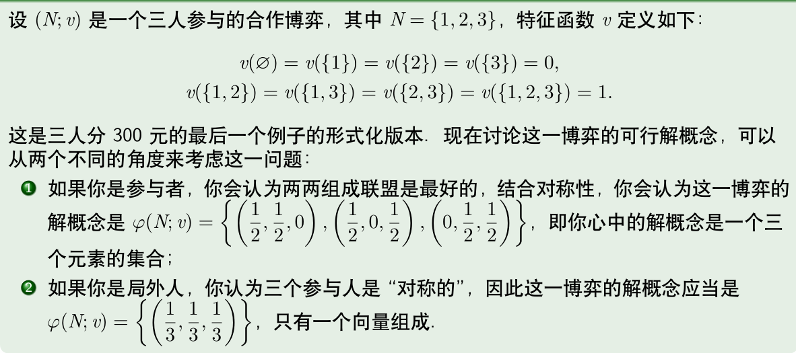
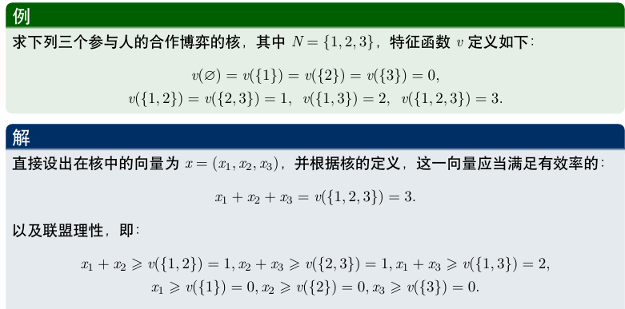
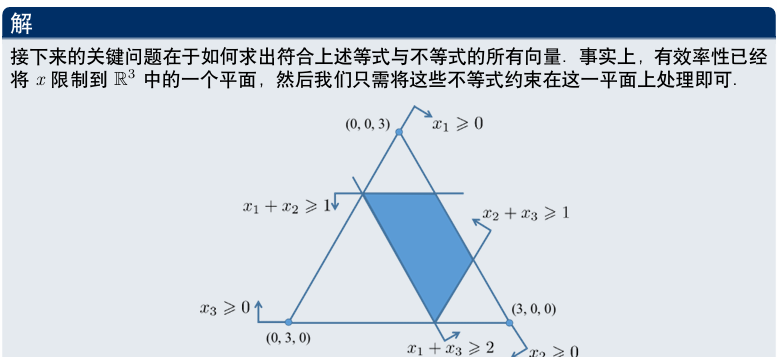
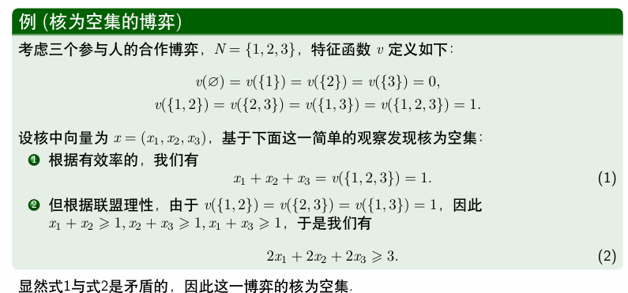
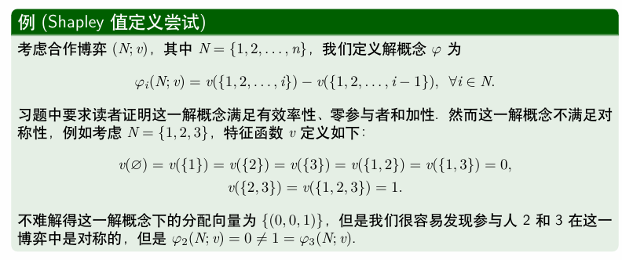
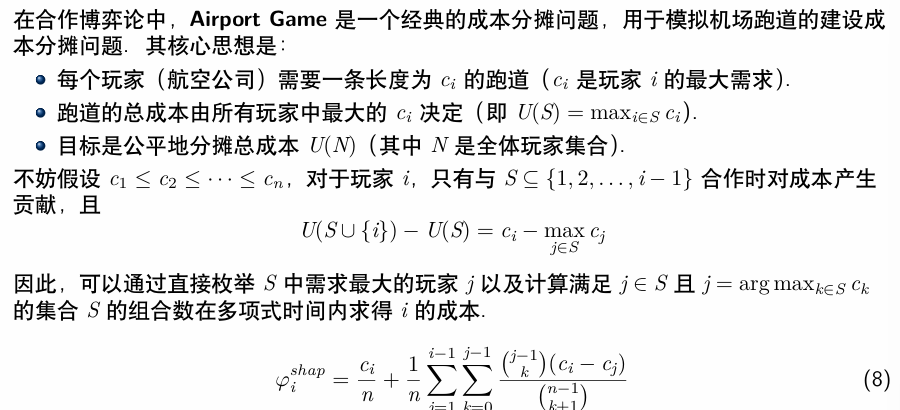

# Shapley 值

## 合作博弈

!!! definition "合作博弈"
    一个具有可转移效用（transferable utility）的合作博弈（或称为 TU 博弈）是一个满足如下条件的二元组 $(N;, v)$

    - $N = {1, 2, \ldots, n}$ 是一个有限的参与者集合；一个 $N$ 的子集被称为一个联盟（coalition），全体联盟构成的集合记为 $2^N$
    - $v:\ 2^N \rightarrow \mathbb{R}$ 称为该博弈的特征函数（characteristic function），对于任意的 $S \subseteq N$，$v(S)$ 表示联盟 $S$ 的价值（worth），且满足 $v(\emptyset)=0$

!!! example
    考虑一个场景，假设有三个人A，B，C，他们的特点分别如下：

    - A 擅长于发明专利，依靠这一才能年收入达 17 万美元；
    - B 有机敏的商业嗅觉，能准确发掘潜在市场，创建商业咨询公司年收入可达 15 万美元；
    - C 擅长市场营销，开办专门的销售公司年收入可达 18 万美元。

    显然，三个人的才能互补，于是他们考虑合作：

    - B 可以为 A 提供市场资讯，将A的发明专利卖给市场上最有需求的人，这样他们合作每年收入可达 35 万美元；
    - C 利用他的才能销售 A 的发明专利，合作年收入可达 38 万美元；
    - 当然 B 和 C 也可以合作组建一个提供市场咨询和销售一体化的公司，这样每年合作收入可达 36 万美元；
    - 最后 A，B，C 如果共同合作，A 在 B 的建议下发明最符合市场需求的专利，然后由 C 进行销售，这样他们合作每年收入可达 56 万美元。

    现在可以用定义形式化这一博弈：不难得到 $N = \{A, B, C\}$，全体联盟构成的集合
    $$ 2^N = \{\emptyset, \{A\}, \{B\}, \{C\}, \{A, B\}, \{A, C\}, \{B, C\}, \{A, B, C\}\} $$
    则该场景可以表示为一个合作博弈 $(N, v)$，其中特征函数 $v$ 定义如下：

    $$
    v(S) = 
    \begin{cases} 
    0 & S = \emptyset \\
    17 & S = \{A\} \\
    15 & S = \{B\} \\
    18 & S = \{C\} \\
    35 & S = \{A, B\} \\
    38 & S = \{A, C\} \\
    36 & S = \{B, C\} \\
    56 & S = \{A, B, C\} \\
    \end{cases}
    $$

    通过确定参与者以及特征函数构成的二元组，我们的确可以形式化地完整描述前面例子的所有信息．

!!! definition "合作博弈的解概念"
    一个合作博弈 $(N, v)$ 的解概念是一个函数 $\varphi$，它将每个博弈 $(N, v)$ 与一个 $\mathbb{R}^n$ 的子集 $\varphi(N, v)$ 联系起来。如果对于任意的博弈 $\varphi(N, v)$ 都是一个单点集，则称这一解概念为单点解（point solution）。

    更通俗地说，合作博弈的解概念就是一个函数，它将每个博弈映射到一个由可行的收入分配方案构成的集合。这个集合中的每个元素都是一个分配向量 $(\varphi_1, \varphi_2, \ldots, \varphi_n)$，其中 $\varphi_i$ 表示参与者 $i$ 在当前分配下可以获得的收入。

!!! example
    <figure markdown="span">
        {width=75%}
    </figure>

!!! definition "核"
    一个合作博弈 $(N, v)$ 的核（core）是一个解概念 $\varphi$，其中 $\varphi(N, v)$ 由满足以下两个条件的分配向量 $(x_1, x_2, \ldots, x_n)$ 组成：

    - **有效率的（efficient）** : $\sum_{i=1}^n x_i = v(N)$，即所有参与者分完了整个联盟的全部收入
    - **联盟理性（coalitionally rational）** : 对于任意的 $S \subseteq N$，有 $\sum_{i \in S} x_i \geq v(S)$，即对于任何联盟而言，他们在大联盟中分配到的收入一定不会比离开大联盟组成小联盟获得的收入少。
        - 否则参与者就没有理由去组成大联盟

!!! example
    === "example 1"
        <figure markdown="span">
            {width=75%}
        </figure>

        <figure markdown="span">
            {width=75%}
        </figure>  

    === "example 2"
        <figure markdown="span">
            {width=75%}
        </figure>

## Shapley 值

沙普利值是为了解决“公平分钱”这一问题而提出的一种方法，简单来说，一个参与者应得的报酬，等于他在所有可能的联盟中，加入联盟后带来的平均边际贡献。

!!! definition 
    令 $\varphi$ 为一个单点解，即对于任意的合作博弈 $(N; v)$（其中 $N = \{1, 2, \ldots, n\}$），$\varphi_i(N; v)$ 都是一个单点集，也就是唯一一个 $\mathbb{R}^n$ 中的向量。我们定义 $x(\varphi_i(N; v))$ 为向量 $\varphi(N; v)$ 中的第 $i$ 个位置的元素，即 $\varphi_i(N; v)$ 表示参与者 $i$ 在博弈 $(N; v)$ 中的分配到的收入。

沙普利值需要满足如下的性质：

!!! property "效率（Efficiency）"
    一个解概念 $\varphi$ 是有效率的 (efficiency)，若对于任意的合作博弈 $(N; v)$（其中 $N = \{1, 2, \ldots, n\}$），有 $\sum_{i=1}^{n} \varphi_i(N; v) = v(N)$。
    
    即所有参与者分完整个联盟的全部收入，这与核的要求一致。

!!! property "对称性（Symmetry）"
    - **参与人的对称性**：令 $(N; v)$ 是一个合作博弈，对于 $i, j \in N$，如果对于任意的 $S \subseteq N \setminus {i, j}$，有 $v(S \cup \{i\}) = v(S \cup \{j\})$，则称参与者 $i$ 和参与者 $j$ 是对称的（symmetric）。如

        用更通俗的话来说，两个参与人是对称的即对于任何不包含他们的联盟，二者分别加入这一联盟后，联盟增加的效用（或称边际贡献（marginal contribution））是一致的，

    - **解概念的对称性**：一个解概念 $\varphi$ 是对称的（symmetric），若对于任意的合作博弈 $(N; v)$，如果 $i, j \in N$ 是对称的，则 $\varphi_i(N; v) = \varphi_j(N; v)$。

!!! property "零参与者"
    一个解概念 $\varphi$ 是符合零贡献者 (null player) 性质的，若对于任意的合作博弈 $(N; v)$ 和任意的 $i \in N$，如果对于任意的 $S \subseteq N \setminus \{i\}$，有 $v(S \cup \{i\}) = v(S)$，则 $\varphi_i(N; v) = 0$。
    
    这意味着如果一个参与者对任何合作子集都没有增加价值，即他的边际贡献永远为 0，那么他们的分配应该为零。

!!! example
    <figure markdown="span">
        {width=75%}
    </figure>

上面这个例子中的不对称性来源于强制给定了这 $n$ 个参与人的排序，而不同的排序可能会带来不同的分配结果，因此一个自然的想法是：我们可以尝试把所有的排序对应的结果取平均。

设 $N = \{1, 2, \ldots, n\}$ 是一个合作博弈的参与者集合，$v$ 是该博弈的特征函数。我们记这 $n$ 个参与人的全体排列构成的集合 $S_n,\ |S_n| = n!$，对于任意排序 $\sigma \in S_n$，我们定义 

$$ P_i(\sigma) := \{ j \in N \mid \sigma(j) < \sigma(i) \} $$

即 $P_i(\sigma)$ 是在排序 $\sigma$ 中，位于参与者 $i$ 前面的所有参与者的集合。若在排序 $\sigma$ 中，参与者 $i$ 的前面没有其他参与者（排在第一位），则 $P_i(\sigma) = \emptyset$。

!!! definition "Shapley 值的定义"
    === "基于排序的 Shapley 值定义"

        令 $(N; v)$ 是一个合作博弈，其中 $N = \{1, 2, \ldots, n\}$，参与人 $i$ 的沙普利值定义为

        $$ SV_i(N; v) = \frac{1}{n!} \sum_{\sigma \in S_n} \left( v(P_i(\sigma) \cup \{i\}) - v(P_i(\sigma)) \right) $$ 
        
        这一公式表示在所有可能的参与人排列中，计算参与人 $i$ 的边际贡献的平均值。

    === "基于组合的 Shapley 值定义"

        令 $(N; v)$ 是一个合作博弈，其中 $N = \{1, 2, \ldots, n\}$，参与人 $i$ 的沙普利值定义为

        $$ SV_i(N; v) = \frac{1}{n!} \sum_{S \subseteq N \setminus \{i\} } |S|!(n - |S| - 1)!(v(S \cup \{i\}) - v(S)) $$

        $S \subseteq N \setminus \{i\}$ 表示不包含参与人 $i$ 的所有子集。这个公式表示在所有可能的子集中，计算参与人 $i$ 的边际贡献的加权平均值,其中权重是该子集的大小和剩余参与者的大小。

        这里相当于把 $n$ 个参与者分成了三个部分：第一部分是 $S$，第二部分是参与人 $i$，第三部分是剩余的参与者 $N \setminus (S \cup \{i\})$。那么 $|S|!$ 就是第一部分的排列数，$(n - |S| - 1)!$ 是第三部分的排列数，我们可以从基于排序的定义中得到这一公式。

### 留一法

一个自然的想法是使用逆向思维，即为了衡量数据集 $D_i$ 的贡献，可以考虑如果没有数据 $D_i$，模型的表现会受到多大的影响，这就是留一法（leave-one-out，简称 LOO）的基本思想。

基于留一法数据价值 $\varphi_i$ 的定义如下：
$$ \varphi_i^{LOO} = U(D) - U(D \setminus \{D_i\}) $$

即使用完整数据集训练的模型表现与去除数据 $D_i$ 后训练的模型表现之间的差异。换句话说，这表示在已有其他数据集的情况下，加入 $D_i$ 后模型性能的提升程度。这个定义的直观合理性在于，如果数据 $D_i$ 对模型贡献很大，那么去除 $D_i$ 后模型表现应当显著下降，即 $\varphi^{\text{LOO}}_i$ 的值应当较大。

然而，留一法存在一个缺陷：如果 $D_i = D_j$，显然 $\varphi^{\text{LOO}}_i = \varphi^{\text{LOO}}_j = 0$，因为去掉数据 $D_i$ 或 $D_j$ 后，由于存在完全重复的数据，模型表现不会受到影响。

### Data Shapley

Data-Shapley 基于 Shapley 值的思想来衡量数据集对模型的贡献。它通过考虑数据集在所有可能的子集中的边际贡献来计算每个数据点的重要性。

$$ \varphi_i^{\text{Shap}} = \frac{1}{n} \sum_{S \subseteq D \setminus \{D_i\}} \dfrac{U(S \cup \{D_i\}) - U(S)}{\binom{n-1}{|S|}} $$

这个式子比较复杂，我们可以将所有 $|S|$ 一致的项合并起来，使用记号
$$ \Delta_j(D_i) = \frac{1}{\binom{n-1}{j}} \sum_{S \subseteq D \setminus \{D_i\}, |S|=j} (U(S \cup \{D_i\}) - U(S)) $$
这个记号表示的是加入数据集 $D_i$ 后，对所有大小为 $j$ 的联盟带来的模型训练结果提升的平均值，它被称为 $D_i$ 对大小为 $j$ 的联盟的“边际贡献”。

于是 Data-Shapley 的定义可以简化为：
$$ \varphi_i^{\text{Shap}} = \dfrac{1}{n} \sum_{j=0}^{n-1} \Delta_j(D_i) $$

!!! info "Beta Shapley"
    在Data-Shapley 中，数据对任意大小的联盟的贡献是平等对待的，也就是说，一个数据集对小的联盟的贡献和对大的联盟的贡献在Data-Shapley 中具有相同的权重。
    
    然而，一个自然的问题是，当联盟本身已经很大时，此时再加入一个数据集，对联盟的贡献通常而言会比较小，所以对较大联盟的边际贡献值更容易受到噪声干扰。因此直观上来看，在数据估值中，如果对较大联盟的边际贡献的权重应当适当缩小，更加重视对较小联盟的边际贡献，可能对数据集的评估会更加准确。
    
    基于此，Beta-Shapley 的定义为
    $$ \varphi_i^{\text{Beta} } = \frac{1}{n} \sum_{j=0}^{n-1} w_j \Delta_j(D_i) $$

!!! info "Data-Banzhaf"
    Data-Banzhaf 的定义如下：
    $$ \varphi_i^{\text{banz}} = \sum_{S \subseteq D \setminus \{D_i\}} \frac{1}{2^{n-1}} (U(S \cup \{D_i\}) - U(S)) $$
    Data-Banzhaf 实际上是将 $D_i$ 对所有 $2^{n-1}$ 个联盟 $S \subseteq D \setminus \{D_i\}$ 的贡献取平均，而此前Data-Shapley 对每个单独的联盟的权重与联盟大小有关（权重大小为 $\dfrac{|S|!(n - |S| - 1)!}{n!}$）。

    Data-Banzhaf 和 Beta-Shapley 都是对 Data-Shapley 的优化，Beta-Shapley 解决了对大联盟边际贡献噪声大的问题，Data-Banzhaf 是从另一个角度，即针对随机学习算法带来的扰动进行优化．

!!! example "Airport Game"
    <figure markdown="span">
        {width=75%}
    </figure>

    最后一个式子的第一项表示的是每个玩家对于空集的贡献，第二项表示的是玩家 $i$ 对于联盟 $S$ 的贡献，其中 $S$ 里最大的玩家是 $j$。

    分子的二项式系数是指从剩余的 $j-1$ 个比 $i$ 小的玩家里挑出 $k$ 个，分母的二项式系数表示从 $n-1$ 个玩家中挑出 $k+1$ 个来，因为此时联盟的大小是 $k+1$，这就是 Shapley 值的权重系数。

    !!! tip
        在作业中我们可以证明每一段跑道的成本由使用这段跑道的所有公司评分，例如

        - 第一段跑道成本为 $c_1$，由 $n$ 家公司共同使用，每家公司支付成本 $\frac{c_1}{n}$；
        - 第二段跑道成本为 $c_2-c_1$，由 $n-1$ 家公司共同使用，每家公司支付成本 $\frac{c_2-c_1}{n-1}$；
        - 以此类推，直到最后一段

        因此 $i$ 使用了长度为 $c_i$ 的跑道，它应该支付的总成本（即对应的沙普利值）为

        $$ \varphi_i^{Shap} = \frac{c_1}{n} + \frac{c_2-c_1}{n-1} + \cdots + \frac{c_n-c_{n-1}}{n-i+1} $$
