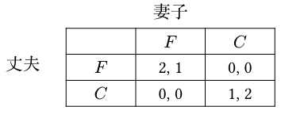
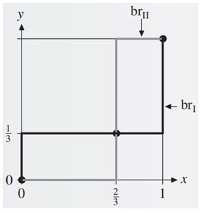
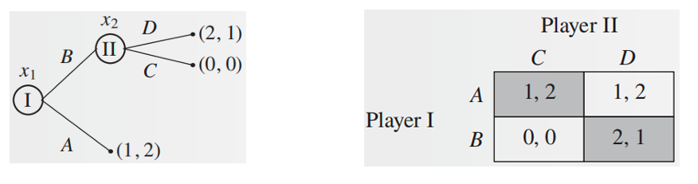
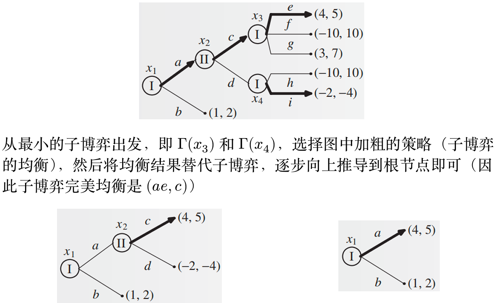
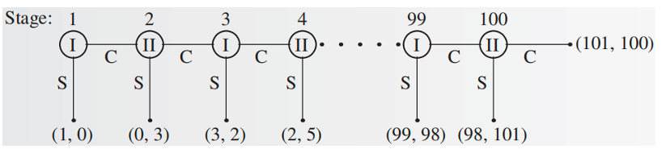
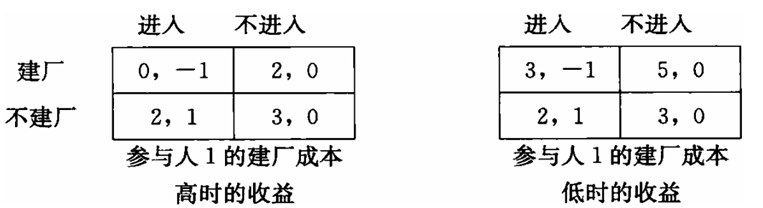
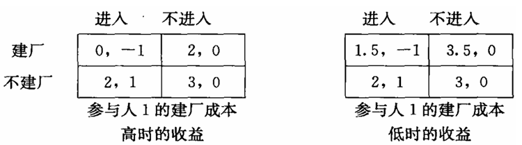
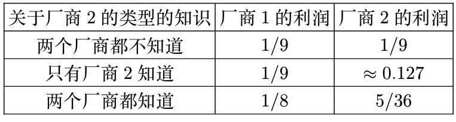

# 博弈论基础 2

## 混合策略纳什均衡

!!! definition "混合策略"
    令 $G = \left( N, (S_i) _ {i \in N}, (u_i) _ {i \in N} \right)$ 为一个策略性博弈。一个混合策略（mixed strategy）是 $S_i$ 上的概率分布，参与人 $i$ 的混合策略集记为

    $$ \Sigma_i = \Big\{ \sigma_i:\ S_i \to [0,1]:\ \sum_{s_i \in S_i} \sigma_i(s_i) = 1 \Big\} $$

    其中 $\sigma_i(s_i)$ 表示参与人 $i$ 在该混合策略下选择策略 $s_i$ 的概率。

- 简单来说，混合策略就是给 $S_i$ 中的每个策略（它们称之为纯策略（pure strategy））分配一个概率，然后按照这个概率随机选择策略。
- 纯策略可以视为混合策略的一个特例：只有一个策略概率为 1，其余策略概率都为 0。

!!! note
    我们引入一个记号：对每个参与人 $i$，令 $\Delta(S_i)$ 表示 $S_i$ 上的概率分布组成的集合，即 

    $$ \Delta(S_i) = \Big\{ p_i:\ S_i \to [0,1]:\ \sum_{s_i \in S_i} p_i(s_i) = 1 \Big\} $$ 

    显然我们有 $\Sigma_i = \Delta(S_i)$。

    当 $S_i$ 是一个连续策略空间时，求和需要替换为积分

对于混合策略，博弈中参与人的效用函数也需要做相应调整：

!!! definition "博弈的混合扩展"
    令 $ G = \left( N, (S_i) _ {i \in N}, (u_i) _ {i \in N} \right) $ 为一个策略性博弈。$G$ 的混合扩展（mixed extension）是一个博弈
    $$ \Gamma = \big( N, (\Sigma_i) _ {i \in N}, (U_i) _ {i \in N} \big) $$
    其中 $\Sigma_i = \Delta(S_i)$ 是参与人 $i$ 的混合策略集，它的收益函数 $U_i:\ \Sigma \to \mathbb{R}$ 会将每个混合策略向量 $\sigma = (\sigma_1, \ldots, \sigma_n) \in \Sigma_1 \times \cdots \times \Sigma_n$ 映射到一个实数，定义为

    $$ U_i(\sigma) = \mathbb{E}[u_i(\sigma)] = \sum_{s \in S} \prod_{j = 1}^n \sigma_j(s_j) u_i(s_1, \cdots , s_n) $$

- 共有 $n$ 个参与人，它们分别选择的策略恰好组成一个纯策略 $(s_1, \cdots , s_n)$ 的概率是 $\prod_{j = 1}^n \sigma_j(s_j)$
    - 这里还蕴含一个假定：每个参与人的行动相互独立。
- 这里我们使用的是了冯诺伊曼-摩根斯坦恩效用函数，效用的本质是参与人 $i$ 在混合策略向量 $\sigma$ 下的期望收益

!!! definition "混合策略纳什均衡"
    给定一个博弈的混合扩展 $\Gamma = \big( N, (\Sigma_i)_{i \in N}, (U_i)_{i \in N} \big)$，一个混合策略向量 $\sigma^* = (\sigma_1^*, \cdots, \sigma_n^*)$ 是一个混合策略纳什均衡，若对每个参与人 $i$，都有

    $$ U_i(\sigma^*) \geqslant U _ i(\sigma_i, \sigma _ {-i}^*), \quad \forall \sigma_i \in \Sigma_i $$

如果直接通过定义验证某个混合策略向量是否构成混合策略纳什均衡，需要将它和任意的混合策略 $\sigma_i$ 都进行验证，这显然是很复杂的，我们可以用一个等价条件来进行更方便的判断：

!!! note "混合策略纳什均衡等价条件"
    令 $ G = \left( N, (S_i) _ {i \in N}, (u_i) _ {i \in N} \right) $ 为一个策略性博弈，$\Gamma$ 为 $G$ 的混合拓展。一个混合策略向量 $\sigma^*$ 是 $\Gamma$ 的一个混合策略纳什均衡，当且仅当对每个参与人 $i$ 和每一个纯策略 $s_i \in S_i$，都有

    $$ U_i(\sigma^ *) \geqslant U_i(s_i, \sigma_{-i}^ *) $$

!!! example
    考虑如下性别大战：一对夫妻要安排他们周末的活动，可选择的活动有看足球赛（$F$）和听音乐会（$C$）。丈夫更喜欢看足球赛，而妻子更喜欢听音乐会。如果他们选择的活动不同，那么他们都不会高兴，如果他们选择的活动相同，那么他们都会高兴，只是高兴程度略有不同：

    <figure markdown="span">
        {width=75%}
    </figure>

    显然 $(F, F)$ 和 $(C, C)$ 是纯策略纳什均衡，我们还可以使用**最优反应法计算混合策略纳什均衡**

    记记丈夫的混合策略为 $(x,1−x)$（表示以 $x$ 的概率选择 $F$，$1−x$ 的概率选择 $C$），妻子的混合策略为 $(y,1−y)$。对于丈夫的每个混合策略 $(x,1−x)$，妻子的最优反应（best response，br）集合为

    $$ \begin{aligned}
    br_2(x) &= \argmax_{y \in [0, 1]} u_2 (x, y) \\\\ 
        &= \{ y \in [0, 1]:\ u_2 (x, y) \geqslant u_2 (x, z), \forall z \in [0, 1] \}
    \end{aligned} $$

    而 $u_2(x, y) = xy \cdot 1 + (1 - x)(1 - y) \cdot 2 = 2 - 2x - 2y + 3xy$，将 $x$ 视为定值，对 $y$ 求导得到 $3x - 2$，因此可以得到最优反应集合为（丈夫同理）：

    \[
    br_2(x) := 
    \begin{cases} 
    \{0\} & x \in \left[0, \dfrac{2}{3}\right) \\\\ 
    [0, 1] & x \in \left\{\dfrac{2}{3}\right\} \\\\
    \{1\} & x \in \left(\dfrac{2}{3}, 1\right]
    \end{cases}, \quad
    br_1(y) := 
    \begin{cases} 
    \{0\} & y \in \left[0, \dfrac{1}{3}\right) \\\\ 
    [0, 1] & y \in \left\{\dfrac{1}{3}\right\} \\\\ 
    \{1\} & y \in \left(\dfrac{1}{3}, 1\right]
    \end{cases}
    \]

    可以绘制出如下的图像：

    <figure markdown="span">
        {width=80%}
    </figure>

    有三个交点：$(0,0)$、$(\dfrac{2}{3},\dfrac{1}{3})$、$(1,1)$，第 1 和第 3 个是纯策略纳什均衡，第 2 个是混合策略纳什均衡

上面这个例子中混合策略纳什均衡下双方选择策略 $F$ 和 $C$ 的效用是相等的，这一结论可以一般化为：

!!! note "无差异原则"
    令 $\sigma^*$ 为一个混合策略纳什均衡，$s_i$ 和 $s_i'$ 为参与人 $i$ 的两个纯策略，若 $\sigma_i^*(s_i),\ \sigma_i^*(s_i') > 0$，则

    $$ U_i(s_i, \sigma_{-i}^*) = U_i(s_i', \sigma_{-i}^*) $$

    也就是说，如果一个参与人在混合策略纳什均衡下，如果某两个纯策略的概率都大于 0，那么这两个纯策略的效用应当是相等的。

    - 如果 $U_i(s_i, \sigma_{-i}^*) > U_i(s_i', \sigma_{-i}^*)$ 那么很显然参与人 $i$  应该增加 $s_i$ 的概率，而不考虑 $s_i'$，从而提高自己的收益
    - 即概率为正的所有纯策略的效用都是相等的，这些策略构成的集合称为混合策略的支撑集合
        - 被严格占优的策略不可能属于混合策略的支撑集合，因为我们可以直接用占优于这个策略的策略替换它，从而提高收益

!!! example
    现在我们可以使用**无差异原则**计算性别大战的混合策略纳什均衡。

    使用无差异原则时首先需要先找到纯策略纳什均衡，否则后续计算可能会忽略。这个例子的纯策略纳什均衡显然是 $(F, F)$ 和 $(C, C)$。

    夫妻两人的混合策略分别为 $\sigma_1 = (x, 1-x),\ \sigma_2 = (y, 1-y)$，且 $0<x<1,\ 0<y<1$（称为完全混合的均衡）。根据无差异原则必有丈夫选择 $F$ 和 $C$ 的效用相等：
    $$ U_1(F, \sigma_2) = 2y = 1-y = U_1(C, \sigma_2) $$
    解得 $y = \dfrac{1}{3}$，同理也可以解得 $x = \dfrac{2}{3}$，因此混合策略纳什均衡为 $(\dfrac{2}{3}, \dfrac{1}{3})$。

!!! tip
    无差异原则只是取得混合策略纳什均衡的必要条件，并非充分条件，因此求出结果后需要验证。

    在这个例子中不需要验证，因为本例只有两个策略，两个策略的效用都一致，不存在其他策略得到更高的效用。

!!! theorem "纳什定理"
    每一个策略型博弈 $G$，如果参与人的个数有限，每个参与人的纯策略数目有限，那么 $G$ 至少有一个混合策略纳什均衡。

    > 双人博弈纳什均衡的计算是 PPAD 完全问题。（目前没有多项式时间算法可以计算一般的两人博弈的混合策略纳什均衡）

## 完全信息动态博弈

!!! info "扩展式博弈"
    扩展式博弈（extensive-form game）使用树形结构来表示博弈的动态过程。每个节点代表一个参与人可以做出决策的时刻，边代表参与人可以选择的策略。

    - 根节点表示博弈的开始，每个叶节点都标志博弈的一个结束点。
    - 每个节点有一个参与人（称为该节点的所有者），它可以选择一条边来移动到下一个节点。
    - 每个叶节点上需要标注博弈在这一终点下的参与人效用。

    扩展式博弈每个参与人的策略是一个向量，表示其在所有可能行动的节点上的行动。即使选定某一策略后博弈停止，也要将此后所有节点的策略都定义好。

!!! info "子博弈"
    一个扩展式博弈的子博弈（subgame）由一个节点 $x$ 和所有该节点的后继节点组成

    - 实际上就是**以 $x$ 为根的子树**，记为 $\Gamma(x)$。

如果每个参与人在选择行动时，都知道他位于博弈树的哪个节点上，那么这个博弈就是完美信息博弈（game with perfect information），例如蜈蚣博弈，国际象棋等

!!! definition "子博弈完美均衡"
    在一个扩展式博弈 $\Gamma$ 中，一个策略向量 $\sigma^*$ 是子博弈完美均衡（subgame perfect equilibrium），如果对于博弈的任意子博弈 $\Gamma(x)$，局限在那个子博弈的策略向量 $\sigma^*$（即只考虑 $\sigma^*$ 中属于子博弈的那一部分） 是 $\Gamma(x)$ 的纳什均衡：对每个参与人 $i$，每个策略 $\sigma_i$ 和子博弈 $\Gamma(x)$，

    $$ u_i(\sigma^* | x) \geqslant u_i(\sigma_i, \sigma_{-i}^* | x), \quad \forall \sigma_i \in S_i(x) $$

当一个博弈存在不止一个均衡时，我们希望基于合理的选择标准选择一些均衡，而剔除另一些均衡，这样的一个选择叫做均衡精炼（equilibrium refinements）。

!!! example
    <figure markdown="span">
        {width=80%}
    </figure>

    - 这一博弈有两个纯策略纳什均衡：$(A,C)$ 和 $(B,D)$，参与人 I 更偏好 $(B,D)$，参与人 II 更偏好 $(A,C)$
    - $(A,C)$ 不是子博弈完美均衡，因为在 $x_2$ 处参与人 II 存在有利可图的偏离：选择 $D$ 而不是 $C$（因此子博弈完美均衡的确是纳什均衡的精炼）
    - 在 $(A,C)$ 下，I 不会偏离均衡，是因为 II **威胁** I：如果你选择 $B$，我就选择 $C$，然而这个威胁显然是不可置信的，因为如果 I 选择 $B$，那么 II 还是选择 $D$ 更有利

我们可以用 $P_{\sigma}(x)$ 表示当实施策略向量 $\sigma$ 时，博弈展开后将访问节点 $x$ 的概率。

!!! theorem 
    令 $\sigma^*$ 是扩展式博弈 $\Gamma$ 的纳什均衡，如果对所有 $x$ 都有 $P_{\sigma^*}(x) > 0$，则 $\sigma^*$ 是 $\Gamma$ 的子博弈完美均衡。

!!! note
    - 如果 $\sigma^*$ 不是子博弈完美均衡，那么在某个子博弈 $\Gamma(x)$ 上一定存在一个有利可图的偏移，且这个偏移产生的概率不为 0，这也会带来对全局的有利可图的偏移，那么 $\sigma^*$ 就不是纳什均衡了。
    - **推论**：完全混合的纳什均衡是子博弈完美均衡。

### 逆向归纳法

要想找到找到完美信息博弈的子博弈完美均衡，我们可以从最小的子博弈出发逆向求解：

<figure markdown="span">
    {width=80%}
</figure>

该方法的应用保证了每一个子博弈都使用了均衡策略，并且每一步都能做出选择，由此可得：

!!! theorem
    每个有限完美信息扩展式博弈都至少有一个子博弈完美纯策略均衡。

当然逆向归纳法也存在局限性：不是子博弈完美均衡的均衡可能更好：

- 重复囚徒困境有限轮，逆向归纳法会得到两个罪犯在每一轮都选择承认（因此需要新的博弈建模方式描述人们在长期关系中会合作这一事实）；
- 蜈蚣博弈：

    <figure markdown="span">
        {width=80%}
    </figure>

    显然，逆向归纳法的结果是参与人在第一轮就要选择停止，但现实中通常双方都会试探前进一段才会结束。

### 斯塔克尔伯格模型

经济学中子博弈完美均衡最基本的应用就是产量领导模型（或称斯塔克尔伯格（Stackelberg）模型），常用于描述有一家厂商处于支配地位或充当自然领导者的行业。

例如 IBM 是具有支配地位的行业，通常观察到的其它小企业的行为模式是等待 IBM 宣布新产量然后调整自己的产量决策，此时 IBM 就是斯塔克尔伯格领导者，其它厂商是跟随者。

设市场中有两个厂商：

- 厂商 1 是领导者，选择产量 $y_1$；
- 厂商 2 是跟随者，选择产量 $y_2$；
- 用 $p(y_1 +y_2)$ 表示总产量为 $y_1+y_2$ 时的市场价格；
- $c_1(y_1)$ 和 $c_2(y_2)$ 表示厂商 1 和 2 在生产 $y_1$ 和 $y_2$ 单位商品时的成本

我们使用逆向归纳法求解时，可以分为两步：

1. **跟随者的最优反应**：求解在厂商 1 的任意策略 $y_1$ 下，厂商 2 的最优反应 $y_2 = f_2(y_1)$
2. **领导者的最优决策**：厂商 1 观察哪一个 $y_1$ 结合对应的 $f_2(y_1)$ 可以使自己的效用最大化，即

    $$ \begin{aligned}
    \max_{y_1} \quad & \pi_1(y_1, y_2) = p(y_1 + y_2) y_1 - c_1(y_1) \\
    s.t. \quad & y_2 = \arg \max_{y_2} \pi_2(y_1, y_2) = p(y_1 + y_2) y_2 - c_2(y_2) \\
    \end{aligned} $$

这是一个双层优化问题（bi-level optimization problem），即优化的约束条件是另一个优化问题：厂商 1 在做决策时，他知道厂商 2 会根据他的决策做出最优反应.

在求解时，我们首先求解厂商 2 的最优反应函数 $y_2^* = f_2(y_1)$，然后将其带入厂商 1 的利润函数中，求解厂商 1 的最优产量 $y_1^*$

!!! example
    设总产量为 $y_1+y_2$ 时的市场价格为 $2−y_1−y_2$，并且厂商 1 和 2 生产相同的一件产品的单位生产成本分别为 $c_1，$c_2$，求在该假设下二者的子博弈完美均衡产量。

    **解**：

    我们先写出厂商 1 和 2 的利润函数：

    $$ \begin{aligned}
    & \pi_1 = (2 - y_1 - y_2) y_1 - c_1 y_1 \\
    & \pi_2 = (2 - y_1 - y_2) y_2 - c_2 y_2
    \end{aligned} $$

    然后在给定 $y_1$ 的情况下，求解厂商 2 的最优反应，解得
    $$ y_2 = \dfrac{2 - y_1 - c_2}{2} $$ 
    将 $y_2$ 带入厂商 1 的利润函数中，得到 
    $$ y_1^ * = \dfrac{2 + c_2 - 2c_1}{2} $$ 
    最后把 $y_1^ *$ 带入 $y_2$ 的最优反应函数中，得到
    $$ y_2^* = \dfrac{2 + 2c_1 - 3c_2}{4} $$ 

    > 上述求解过程与古诺模型的区别在于古诺模型中没有彼此的先后关系，因此我们也就不能这样一步一步回推地求解

## 不完全信息博弈

现实中的各种博弈不一定是完全信息的，如斗地主等扑克牌游戏中各玩家的手牌信息就不是所有玩家共同知道的，这称之为**不完全信息博弈**（game with incomplete information）。

!!! example "example 1"
    考虑一个包括两个企业的行业博弈。假定这个行业有一个在位者（参与人1）和一个潜在的进入者（参与人 2）。参与人 1 决定是否建立一个新工厂，同时参与人 2 决定是否进入该行业。
    
    假定参与人 2 不知道参与人 1 再建厂的成本是 3 还是 0，但参与人 1 自己知道。

    <figure markdown="span">
        {width=60%}
    </figure>

    这里我们不妨假设设参与人 2 对参与人 1 的类型有先验概率，即他认为参与人 1 成本为 3（成本高）的概率为 $p$，成本为 0（成本低）的概率为 $1−p$。

    - 求解均衡前要**首先检查是否存在劣策略**：
    
        参与人 1 有占优策略：成本低时，建厂；成本高时，不建厂。这样我们轻松得到了参与人 1 的均衡策略。

    - 根据参与人 1 的策略，参与人 2 进入的期望效用为
        $$ p - (1-p) = 2p - 1 $$

        不进入的期望效用显然为 0

    - 因此当 $p> 1/2$ 时，参与人 2 会选择进入；当 $p < 1/2$ 时，参与人 2 会选择不进入；当 $p = 1/2$ 时，参与人 2 对进入和不进入是无差异的

!!! example "example 2"
    如果将低成本时的建厂成本设定为 1.5，如下表，则参与人 1 只在高成本时有占优策略（不建厂）。

    <figure markdown="span">
        {width=60%}
    </figure>

    现在我们就只能使用用无差异原则求解均衡。设参与人 1 低成本时建厂概率为 $x$，参与人 2 进入概率为 $y$。首先考虑是否存在纯策略均衡：

    - $x = 1, y = 0$（对应纯策略组合 (建厂，不进入)），对低成本的参与人 1 而言，$x = 1$ 是 $y = 0$ 的最优反应

        对参与人 2 而言，$x = 1$ 时，$y = 0$ 的效用为 0，$y = 1$ 的效用为 $2p-1$，故 $y = 0$ 是 $x = 1$ 的最优反应当且仅当 $p \leqslant 1/2$
        
        因此 当 $p \leqslant 1/2$ 时，$(1,0)$ 是一个纯策略纳什均衡。

    - 同理我们可以验证 $x = 0, y = 1$ 在任意的 $p$ 下都是一个纯策略纳什均衡。

        （因为当 $x=0$，即参与人 1 选择不建厂时，参与人 2 选择进入的效用总是更高的）

    接下来考虑混合策略均衡，根据无差异条件：

    - 低成本参与人 1 是否建厂无差异：
        $$ 1.5y + 3.5(1-y) = 2y + 3(1-y) $$
        解得 $y = 1/2$

    - 参与人 2 是否进入无差异：
        $$ p + (1-p)(-x + (1-x)) = 0 $$
        解得 $x = \dfrac{1}{2(1-p)}$

    总而言之，这一博弈存在两个纯策略均衡（其中一个有条件）和一个混合策略纳什均衡：

    - 均衡下高成本参与人 1 永远选择占优策略不建厂；
    - 当 $p \leqslant 1/2$ 时，低成本参与人 1 选择建厂，参与人 2 选择不进入；
    - 低成本参与人 1 选择不建厂，参与人 2 选择进入；
    - 低成本参与人 1 以 $x = \dfrac{1}{2(1-p)}$ 概率选择建厂，参与人 2 以概率 1/2 选择进入。

### 不完全信息博弈的定义

我们可以对不完全信息博弈提供一个形式化的定义

!!! definition "不完全信息博弈"
    原先的三元组 $G = \left( N, (S_i) _ {i \in N}, (u_i) _ {i \in N} \right)$ 现在变成了五元组 
    $$ G = \left( N,\\ (S_i) _ {i \in N},\\ (u_i) _ {i \in N},\\ (T_i) _ {i \in N},\\ p \right)$$ 

    其中 $T_i$ 是每个参与人 $i$ 的类型构成的集合（type set），$p$ 是一个概率分布，表示参与人 $i$ 的类型为 $t_i \in T_i$ 的概率。

    - 先验分布 $p$ 给每种类型向量 $(t_1, \ldots, t_n)$ 赋予一个概率
        - 在上面这个行业博弈中，参与人 2 只有一种默认类型，故先验分布定义在两种类型向量（高成本，默认类型）和（低成本，默认类型）上，此处显然默认类型可以被省略，因此可以只定义参与人 1 两种类型的先验概率

    在一般的情况下，上述 $p$ 给出的是联合概率分布，因此边际分布为 
    $$ p(t_i) = \sum_{t_{-i}} p(t_i, t_{-i}) $$
    参与人是知道自己的类型为 $t_i$ 的，故对其他人的类型有后验概率分布为
    $$ p(t_{-i} | t_i) = \frac{p(t_i, t_{-i})}{p(t_i)} = \frac{p(t_i, t_{-i})}{\sum_{t_{-i}} p(t_i, t_{-i})} $$

    > 注意此前的行业博弈无需更新后验分布，事实上只要不同参与人是独立的就无需更新后验分布。

- 先验分布是所有参与人的共同知识
    - 例如斗地主时大家都会认为一方有很多炸弹的概率是比较小的
- 原先的参与人策略需要扩展至对参与人的每种类型都定义一个策略
    - 尽管参与人知道自己的类型，但参与人还是要为每个类型都定义策略的，这是因为**其他参与人不知道你的类型**，但计算均衡时需要基于所有类型下的策略才能算出效用
    - 参与人 $i$ 类型为 $t_i$ 下选择纯策略 $s_i$ 的概率记为 $\sigma_i(t_i; s_i)$
- 最后，参与人 $i$ 的效用与类型相关（考虑参与人 1 在高低成本下的效用不同）
    - 当所有人类型组合为 $t$，纯策略组合为 $s$ 时的效用记为 $u_i(t; s)$
    -  注意**效用与所有人的类型相关，而策略只与自己的类型相关**

### 不完全信息博弈的均衡
 
均衡的定义需要涉及收益的比较，故此处简单展开计算。

当参与人策略组合为 $\sigma=(\sigma_1,\ldots,\sigma_n)$ 时，如果参与人类型组合是 $t=(t_1,\ldots,t_n)$，那么每个纯策略组合 $(s_1,\ldots,s_n)$ 被选择的概率是 $\prod_{i\in N} \sigma_i(t_i;s_i)$，因此参与人 $i$ 的期望收益是

$$ U_i(t; \sigma) = \sum_{s\in S} \prod_{i=1}^n \sigma_i(t_i; s_i)u_i(t; s) $$

但是上述表达式中在不完全信息的情况下存在不确定性：参与人不知道其它参与人的类型，因此需要进一步对类型求取期望，得到（将 $t$ 拆成 $t_i,t_{-i}$）

$$ U_i(\sigma) \triangleq \mathbb{E}_{t_{-i}} U_i(t_i,t_{-i};\sigma) = \sum_{t_{-i}} p(t_{-i} | t_i)U_i(t_i,t_{-i};\sigma) $$

上面这个式子就是参与人 $i$ 在策略组合 $\sigma = (\sigma_1, \ldots, \sigma_n)$ 下的期望效用。

!!! definition "不完全信息（静态）博弈的均衡"
    不完全信息博弈的策略向量 $\sigma^* = (\sigma_1^*, \ldots, \sigma_n^*)$ 是不完全信息博弈的**贝叶斯均衡**（Bayesian equilibrium），如果对每个参与人 $i$ 和每个类型 $t_i \in T_i$，以及每个可能的纯策略 $s_i \in S_i$，都有

    $$ U_i(\sigma^*) \geqslant U_i(s_i, \sigma_{-i}^*) $$

上面的定义中存在两个细节：

- 对每个类型 $t_i$ 的原因在于此前计算 $U_i(\sigma)$ 时是基于参与人已知自己类型 $t_i$ 的后验概率分布的；
- 只需要考虑向纯策略 $s_i$ 的偏离的原因在此前混合策略纳什均衡的等价定义中已经解释了：
    - 如果 $\sigma_i^*(s_i) > 0$，则 $U_i(s_i, \sigma_{-i}^*) = U_i(s_i', \sigma_{-i}^*)$ 对任意 $s_i'$ 都成立；
    - 如果 $\sigma_i^*(s_i) = 0$，则不需要考虑该纯策略。

!!! info "不完全信息博弈的三个阶段"

    1. 自然（nature）根据概率分布 $p$ 选择一个类型向量 $t = (t_1, \ldots, t_n)$，每个参与人 $i$ 都知道自己的类型 $t_i$，但不知道其他参与人的类型 $t_{-i}$；
    2. 参与人 $i$ 根据自己的类型 $t_i$ 更新信息：对其他人类型的分布更新为 $p(t_{-i} | t_i)$（后验分布），然后所有参与人同时选择自己的行动
    3. 每个参与人 $i$ 得到收益 $u_i(t; s)$，其中 $s = (s_1, \ldots, s_n)$ 是所有参与人的纯策略构成的组合

    上述三个步骤划分了经济学文献中常见的不完全信息博弈的三个阶段：

    - 每个人的类型被指派之前的阶段被称为事前阶段（ex ante）
    - 每个人的类型被指派之后的阶段被称为事中阶段（interim）
    - 收益确定之后的阶段被称为事后阶段（ex post）

??? example
    回忆古诺竞争是两个寡头同时决定产量的博弈。假定企业的利润为
    $$ u_i = q_i(\theta_i - q_i - q_j) $$
    其中 $\theta_i$ 是线性需求函数的截距与企业 $i$ 的单位成本之差，$q_i$ 是企业 $i$ 选择的产量。

    企业 1 的类型 $\theta_1=1$ 是共同知识，但企业 2 拥有关于其单位成本的私人信息。企业 1 认为 $\theta_2=\frac{3}{4}$（高成本）和 $\theta_2=\frac{5}{4}$（低成本）的概率均为 $\frac{1}{2}$，且先验分布是共同知识。

    我们首先将博弈表达为不完全信息的形式（写出五元组）

    - 参与人集合 $N = \{ 1,2 \}$
    - 策略集合 $S_1 = \{ q_1 \},S_2 = \{ q_2 \}$
    - 收益函数 $u_1(q_1, q_2, \theta_1)=q_1(\theta_1 - q_1 - q_2),\ u_2(q_1, q_2, \theta_2)=q_2(\theta_2-q_1-q_2)$
    - 类型集合 $T_1=\{ \theta_1=1\},\ T_2=\{ \theta_2=\dfrac{3}{4},\ \theta_2 = \dfrac{5}{4}\}$
    - 先验分布 $p(\theta_2 = \dfrac{3}{4}) = \dfrac{1}{2},\ p(\theta_2 = \dfrac{5}{4}) = \dfrac{1}{2}$

    现在求解该博弈的纯策略贝叶斯纳什均衡：记企业 2 在 $\theta_2 = 5/4$ 时的产量为 $q_2^L$，在 $\theta_2 = 3/4$ 时的产量为 $q_2^H$，那么企业 2 的均衡产量必须满足

    $$ q_2(\theta_2) = \argmax_{q_2} q_2(\theta_2 - q_1 - q_2) $$

    通过一阶条件不难求出 $q_2(\theta_2) = \dfrac{\theta_2 - q_1}{2}$

    由于企业 1 不知道企业 2 属于哪种类型，因此他的收益只能是对企业 2 的类型取期望：

    $$ q_1 = \argmax_{q_1} \dfrac{1}{2} q_1(\theta_2 - q_1 - q_2^L) + \dfrac{1}{2} q_1(\theta_2 - q_1 - q_2^H) $$

    同样利用一阶条件解得 $q_1 = \dfrac{2 - q_2^H - q_2^L}{4} $

    把 $\theta_2$ 的两个取值带入 $q_2(\theta_2)$ 中，可以得到一个三元方程组：

    $$ \begin{cases}
        q_1 = \dfrac{2 - q_2^H - q_2^L}{4} \\\\
        q_2^L = \dfrac{5/4 - q_1}{2} \\\\
        q_2^H = \dfrac{3/4 - q_1}{2}
    \end{cases} $$

    这个方程组解得 $q_1^* = 1 / 3,\\ q_2^L = 11/24,\\ q_2^H = 5/24 $

!!! extra
    -  如果两个厂商都知道厂商 2 的类型，可以求出高低两种情况的纳什均衡，可以计算出此时的利润然后取平均；
    - 如果两个厂商都不知道厂商 2 的类型，本质上退回完全信息情景
        - 厂商 2 自己都不知道自己的类型，故只能按平均值计算自己的策略，厂商 1 也知道厂商 2 按平均值计算，从而博弈退化到完全信息场景

    <figure markdown="span">
        {width=60%}
    </figure>
