# 多臂老虎机算法

!!! info "多臂老虎机"
    一个赌鬼要玩多臂老虎机，摆在他面前有 $K$ 个臂（Arms）或动作选择（Actions），每一轮游戏中，他要选择拉动一个臂并会获得一个随机奖励（reward）（这一随机奖励来源于一个赌场设定好的分布，但赌鬼一开始不知道这一分布）。如果总共玩 $T$ 轮，他该如何最大化奖励？

## 随机多臂老虎机问题

!!! definition "随机多臂老虎机问题"
    在每一轮游戏中，赌鬼从 $K$ 个臂中选择一个臂 $a_t$，并获得一个随机奖励 $r_t$。每个臂的奖励分布是未知的，但在每一轮游戏中，赌鬼可以观察到所选臂的奖励。

    在每一步 $t=1,2,\ldots,T$ 中：

    1. 玩家选择一个臂 $a_t \in A = \{a_1, \ldots, a_K\}$；
    2. 玩家获得该臂对应的随机奖励 $r_t \sim R(a_t)$（$r_t \in [0,1]$）；
    3. 玩家依据过往轮次的奖励情况调整选择策略，实现奖励最大化。

    说明：

    - 奖励分布的均值记为 $\mu(a_k) = \mathbb{E}[R(a_k)]$，$k \in [K]$；
    - 最优臂 $a^*$ 的奖励均值 $\mu^* = \max_{a \in A} \mu(a)$；
    - 奖励均值差异 $\Delta(a) = \mu^* - \mu(a)$。

### 遗憾分析

我们需要设计 MAB 算法实现最大化奖励，实际上就是找最优臂。那么，分析 MAB 算法的性能就是在分析算法能否找到最优臂。我们用遗憾（regret）来度量实际选择和最优选择的差异。

!!! definition
    1. 伪遗憾（pseudo-regret）

        $$ R(T) = \sum_{t=1}^T \left( \mu^* - \mu(a_t) \right) = \mu^* \cdot T - \sum_{t=1}^T \mu(a_t) $$

    2. 期望遗憾（expected regret）：$ \mathbb{E}[R(T)] $

伪遗憾就是选择最优臂的期望收益减去实际收益，期望遗憾是伪遗憾的期望（玩家策略可能存在随机性，因此 $\mu(a_t)$ 可能是随机变量）。

显然，最大化奖励可以等价为最小化遗憾。

!!! info "次线性"
    一个函数 $f(x)$ 是次线性的，如果对于所有 $x$，有 $f(x) \leqslant cx$ 成立，其中 $c$ 是一个常数。

    在 MAB 问题中，我们常常关注算法遗憾界（regret bound）。一个好的遗憾界是次线性的（sub-linear），这意味着算法能逐渐学到最优臂，即
    $$ \dfrac{regret bound}{T} \to 0, \quad T \to \infty $$

!!! info "Hoeffding 不等式"
    假设 $X_1, X_2, \ldots, X_n$ 是 $[0,1]$ 上的独立随机变量，样本均值为 $\overline{X} = \frac{1}{n} \sum_{i=1}^n X_i$，样本均值为 $\mu = \mathbb{E}[X_i]$，则对于任意 $\varepsilon > 0$，有

    $$ \mathbb{P} \left( \left| \mu - \overline{X} \right| \geqslant \varepsilon \right) \leqslant 2e^{-2n\varepsilon^2} $$

    - 该不等式属于集中不等式（concentration inequalities），直观上来说，样本均值 $\overline{X}$ 会集中在期望 $\mu$ 附近，即样本均值与实际均值的差距很小的概率是很大的，并且随机变量个数越多（$N$ 越大）差距大的概率越小。
    
    我们称 $[\mu - \varepsilon, \mu + \varepsilon]$ 是置信区间（confidence interval），$\varepsilon$ 是置信半径（confidence radius）。

    若令 $\varepsilon = \sqrt{\frac{\alpha \log T}{n} }$，则有

    $$ \mathbb{P}(|\mu - \overline{X}_n| \geqslant \epsilon) = \mathbb{P}\left( \left| \mu - \overline{X}_n \right| \geqslant \sqrt{\frac{\alpha \log T}{n} } \right) \leqslant 2T^{-2\alpha},\ \forall \alpha > 0 $$

    - 在讨论时我们一般取 $\alpha = 2$

### 贪心算法

<figure markdown="span">
    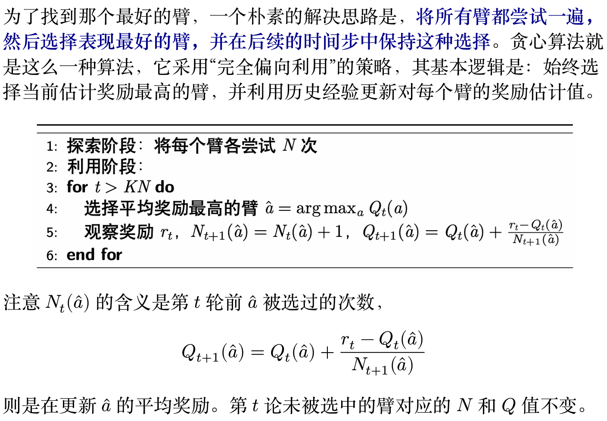{width=75%}
</figure>

!!! theorem
    贪心算法的期望遗憾界为 $O\left(T^{\frac{2}{3}}(K\log T)^{\frac{1}{3}}\right)$

证明过程如下：

#### 探索阶段

设共有 $K$ 个臂，当我们选择的不是最优臂 $a^*$ 时就会产生遗憾
$$ R(\text{exploration}) \leqslant N(K-1) $$

!!! tip
    注意我们会对每一个臂都尝试 $N$ 次，并且每次选择带来的遗憾都位于 $[0,1]$ 之间，因此探索阶段的遗憾不大于 $N(K-1)$。

#### 利用阶段

我们可以把利用阶段的结果分为两种情况：

- **事件 $E$（好事件）**： 所有臂 $a$ 的采样期望奖励 $Q(a)$ 与其真实期望 $\mu(a)$ 的差距都在某个小范围内，如
    $$ |\mu(a) - Q(a)| \leqslant \text{rad} $$
    这里我们取 $\text{rad} = \sqrt{\frac{2\log T}{N}}$
- **事件 $\bar{E}$（坏事件）**： 事件 $E$ 的补集，即至少有一个臂 $a$ 得采样估计不够准确，误差超过了 $\text{rad}$。

**分析坏事件：**

根据霍夫丁不等式以及坏事件的定义，我们可以发现坏事件发生的概率 $P(\bar{E})$ 很小：

$$ \begin{aligned}
P(\bar{E}) &\leqslant \sum_{a=1}^K P \big(|\mu(a) - Q(a)| > \text{rad} \big) \\
&\leqslant \sum_{a=1}^K 2e^{-2N(\text{rad})^2} \\
&= \sum_{a=1}^K 2e^{-4\log T} \\
&= 2K T^{-4} = O(K T^{-4})
\end{aligned} $$

而在坏事件中，最坏情况下的遗憾为 $T$（即每次选择的遗憾都是 1），因此坏事件对整体遗憾的贡献
$$ \mathbb{E}[R|\bar{E}] \leqslant T \times P(\bar{E}) = O(K T^{-3}) $$

**分析好事件：**

当好事件 $E$ 发生时，对所有的臂都成立 $|\mu(a) - Q(a)| \leqslant \text{rad}$，显然当我们选择最优臂 $a^*$ 时遗憾比选择其他臂要小，因此我们可以得到如下的不等式：
$$ \mu(a) + \text{rad} \geqslant Q(a) > Q(a^ * ) \geqslant \mu(a^ * ) - \text{rad} $$ 
整理上式可得单步选择中遗憾的上界为
$$ \mu(a^ *) - \mu(a) < 2 \ \text{rad} $$ 
这说明在好事件中遗憾总是不会很大，因此好事件对整体遗憾的贡献为
$$ \mathbb{E}[R|E] \leqslant (T-NK) \cdot 2 \text{rad} \cdot T $$

> 利用阶段的分析实际上是在说：小遗憾的事件大概率发生，大遗憾的事件小概率发生。

#### 综合两个阶段

现在我们把探索和利用两个阶段的遗憾加起来，得到总的期望遗憾界：
$$ \mathbb{E}[R(T)] \leqslant N(K-1) + (T-NK) \cdot 2 \text{rad} \cdot T + O(K T^{-3}) $$
其中 $O(K T^{-3})$ 很小，可以忽略，因此上式就变为
$$ \mathbb{E}[R(T)] \leqslant NK + 2 T \sqrt{\frac{2\log T}{N}} \cdot $$

为了最小化这个遗憾的上界，显然我们需要平衡探索成本（$N$ 增大时增加）和利用成本之间的（$N$ 增大时减小）关系。我们希望这两项的量级应当是相等的，于是

$$ \begin{aligned}
NK \approx T \sqrt{\frac{2\log T}{N}} \\\\
\Rightarrow N \approx \left( \frac{T^2 \log T}{2K^2} \right)^{2/3}
\end{aligned} $$

于是我们令 $N = (\frac{T}{K})^{2/3} \cdot O(\log T)^{1/3}$，带入上式就最终得到
$$ \mathbb{E}[R(T)] = O\left(T^{\frac{2}{3}}(K\log T)^{\frac{1}{3}}\right) $$

!!! info "$\varepsilon$-贪心算法"
    上面的贪心算法存在两个问题：

    - “探索”阶段的尝试带来遗憾；
    - “利用”阶段陷于局部最优带来遗憾。

    $\varepsilon$-贪心算法的思路是引入随机性：

    <figure markdown="span">
        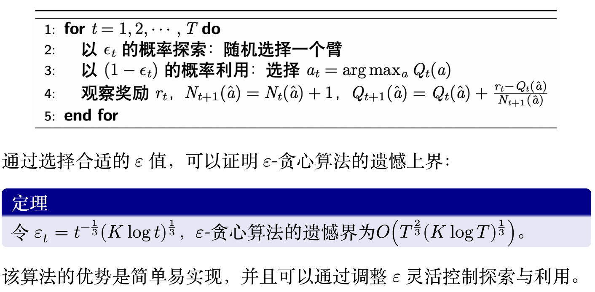{width=75%}
    </figure>

    其中 $N_t(\hat{a})$ 表示的是在时间 $t$ 时臂 $\hat{a}$ 在之前的操作中被选择的次数，$Q_t(\hat{a})$ 表示臂 $\hat{a}$ 在时间 $t$ 时的奖励均值估计。

### 上置信界算法

$\varepsilon$-贪心算法仍存在一个问题：虽然每个动作都有被选择的概率，但是这种选择太过于随机，导致最优臂被访问的概率较低，这并不能有助于智能体很大概率的发现最优选择，上置信界算法（upper confidence bound，UCB）很好地改进了这一点。

UCB 算法是多臂赌博机问题中一种经典的基于置信区间的探索-利用策略。其核心思想是为每个臂的奖励估计构建一个置信区间上界，选择上界最大的臂，从而在探索和利用之间自动平衡。

<figure markdown="span">
    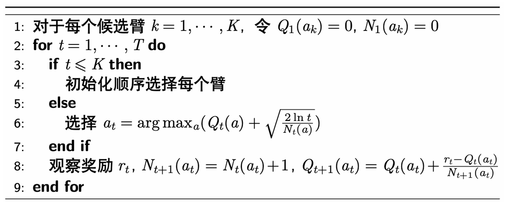{width=75%}
</figure>

简而言之，UCB 的算法流程是：

1. 首先将每一个候选臂都选择一遍，作为初始化
2. 然后在后续的时间步中，选择奖励均值估计量的上置信界最大的臂，其中均值估计量的上置信界定义为
    $$ Q_t(a) + \sqrt{\frac{2\log t}{N_t(a)}} $$
3. 最后更新被选中的臂的相关参数。

其中上置信界的直观理解是：

- 上置信界的前一项 $Q_t(a)$ 代表臂的估计奖励，这个值越大说明对应臂的历史表现越好；
- 后一项 $\sqrt{\dfrac{2\log t}{N_t(a)}}$ 是置信区间的半径，其会随着选择次数的增加而变小，并且该值越大则说明估计的不确定性越大，因此能过鼓励玩家尝试较少被选择的臂，避免陷入次优；
- 因此，选择上置信界最大的臂有利于偏向于选择表现较好或是较少选择的臂，从而算法能够逐渐收敛到最优臂。

总而言之。UCB 算法同时考虑了估计奖励与不确定性，较好的平衡了探
索与利用，也可以得到更好的遗憾界（证明省略）：

!!! theorem
    UCB 算法的期望遗憾界为 $O\left(\sqrt{KT\log T}\right)$。

### 汤普森采样算法

汤普森采样的思路是采用贝叶斯方法来解决探索-利用困境：为每个臂维护一个先验概率分布，表示对该臂奖励概率的“信念”。每次选择臂时，从每个臂的后验概率分布中进行采样，并选择采样值最高的臂。最后，根据获得的奖励更新所选臂的后验概率分布，从而在探索和利用之间取得平衡。

<figure markdown="span">
    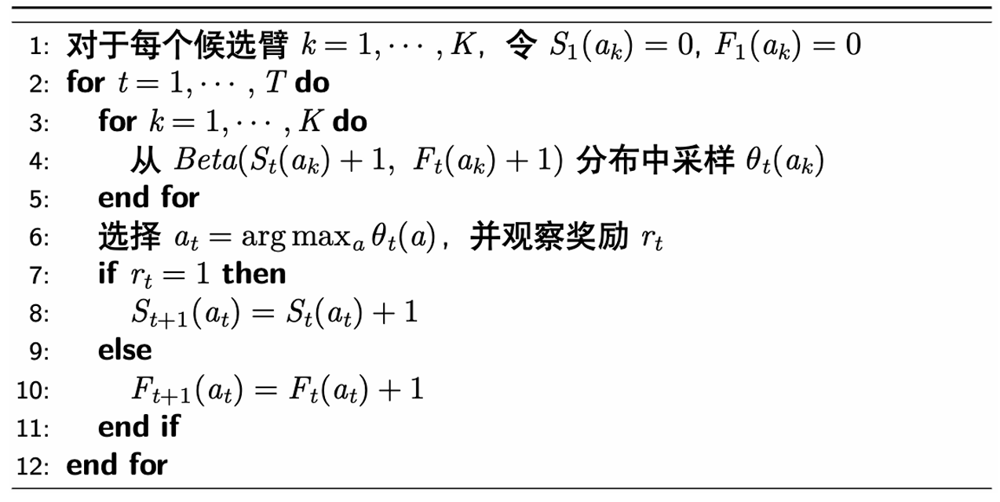{width=75%}
</figure>

在做决策时，算法不会直接选择均值最高或上限最高的臂，而是会从每个臂的后验分布中采样一个值，然后选择**采样值最大的臂**，具体来说：

- Beta 分布中参数 $\alpha$ 和 $\beta$ 分别表示伯努利试验中的成功和失败次数，$\alpha$ 越大分布越集中于 1，$\beta$ 越大则越接近于 0；
- 在每一个时间步中，对于每个臂，从其 $\text{Beta}(S_t(a)+1,\\ F_t(a)+1)$ 分布中进行采样。选择采样值最高的臂。执行所选臂，并观察奖励。
- 根据获得的奖励更新所选臂的 Beta 分布参数；
- 如果成功，则 $S_t(a)=S_t(a)+1$；如果失败，则 $F_t(a)=F_t(a)+1$。

!!! note
    - 如果一个臂没有经过充分探索，那么它的"信念"分布的范围会很大，因此汤普森采样会倾向于选择那些未被充分探索的臂；
    - 当一个臂被多次选择时，它的采样值会逐渐趋近于其真实奖励均值，如果它的采样值很高，就会被接着利用；如果采样值很低，它就不会被选择。这样就实现了探索和利用的平衡。

总而言之，汤普森采样算法相当简洁优雅，并且也能得到和 UCB 一致的遗憾界，甚至实证中表明其效果比 UCB 算法更好（证明省略）

!!! theorem
    汤普森采样算法的期望遗憾界为 $O\left(\sqrt{KT\log T}\right)$。

## 对抗性多臂老虎机

!!! info "对抗性多臂老虎机"
    对抗性多臂老虎机（Adversarial MAB）问题是多臂老虎机（MAB）问题的一种变体。相较于随机多臂老虎机问题的设定，对抗性多臂老虎机中的奖励（或代价）是由对手动态生成的，而不是从固定的奖励分布中随机抽取的。对手可能会根据玩家的策略进行调整，从而形成对抗性。其基本模型如下：

    在每一步 $t=1,2,\dots,T$ 中：
    
    1. 玩家在行动集合 $[n]=\{1,\dots,n\}$ 上选择一个概率分布 $p_t$；
    2. 对手在已知 $p_t$ 的情况下选择一个代价向量 $c_t\in[0,1]^n$，为每个行动分配一个代价；
    3. 玩家根据概率分布 $p_t$ 选择一个行动 $i_t$，并观察到该行动的代价 $c_t(i_t)$；
    4. 玩家学习整个代价向量 $c_t$，以调整未来的策略。

    注：

    1. 玩家的目标：选取一个策略序列 $p_1,p_2,\dots,p_T$，使得总代价最小化（相对于奖励最大化），即最小化期望代价 $\mathbb{E}_{i_t\sim p_t} \left[\sum_{t=1}^{T} c_t(i_t)\right]$。
    2. 对手不一定真实存在，这只是一个最坏情况分析；
    3. 在这种情况下，玩家不仅能学习到所选行动的代价，还能学习到所有行动的代价，因此这是一个**全反馈**的情境，与之前的情况不同。

### 遗憾的定义

在对抗性多臂老虎机中遗憾不再来自于随机抽取的成本，因此需要重新定义。

最朴素的遗憾定义的想法是，与所有轮次结束后（每一轮的成本都已知）的事后最优作差，然而下面的例子表明这一定义是不合理的：

!!! example
    设行动集合为 $\{1,2\}$，在每一轮 $t$，对手按如下步骤选择代价向量：
    
    假设算法选择一个概率分布 $p_t$，如果在此分布下选择行动 1 的概率至少为 $\frac{1}{2}$，那么 $c_t = (1,0)$，反之 $c_t = (0,1)$。在此情况下，在线算法期望代价至少为 $\frac{T}{2}$，而在事先知晓代价向量的情况下，最优算法的期望代价为 0。 
    
这一例子表明，与事后最优比较可能出现线性级别的遗憾，因此这一基准太强了。因此转而将遗憾定义为在线算法与最优固定行动事后代价之差。

!!! definition "遗憾"

    固定代价向量 $c_1, c_2, \ldots, c_T$，决策序列 $p_1, p_2, \ldots, p_T$ 的遗憾为

    $$ R_T = \mathbb{E}_{i_t \sim p_t} \left[ \sum_{t=1}^{T} c_t(i_t) \right] - \min_{i \in [n]} \sum_{t=1}^{T} c_t(i) $$

    即遗憾被定义为与每轮都选择同一行动的最优的固定行动的代价之差，这样的定义相对而言更加合理：
    
    - 在前面的例子中，固定策略序列（全选 0 或 1）的遗憾不再是简单的 0；
    - 平均遗憾：$\frac{\overline{R_T}}{T}$。若 $T \to \infty$，$\frac{\overline{R_T}}{T} \to 0$，则称算法是无遗憾（no-regret）的，等价的说，即 $R_T$ 关于 $T$ 是次线性的；
    - 这一定义的合理在于，有自然的算法实现无遗憾，但无悔的实现也不是平凡的。

!!! definition "跟风算法"
    跟风算法（Follow-The-Leader, FTL）指在每一个时间点 $t$，选择最小累积代价 $\sum_{s=1}^{t-1} c_s(i)$ 的行动 $i$

<figure markdown="span">
    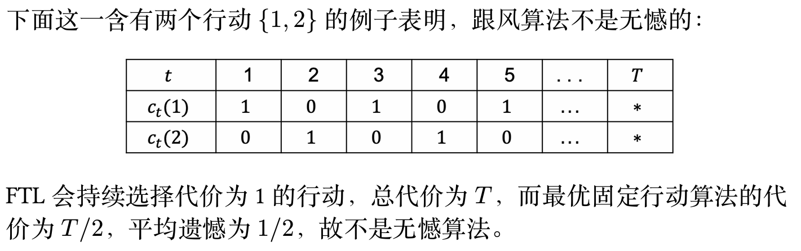{width=75%}
</figure>

!!! info "随机化是无憾的必要条件"
    事实上，任意的确定性算法都会有线性级别的遗憾：$\frac{n-1}{n} T$，其中 $n$ 是可能行动的个数：

    - 对手是知道我们的算法的，因此如果采用确定性算法，对手可以直接推断出我们每一步的选择，从而设置我们选择的行为有代价 1，其余行为代价为 0
    - 这样玩家的总代价为 $T$，而最优固定行动算法的总代价最高为 $\frac{T}{n}$（因为有 $n$ 种可能的行动）
    - 如果采用随机策略，则对手只能推断出我们的概率分布 $p_t$，而不能推断出我们的具体行动 $i_t \sim p_t$，因此对手无法完美利用我们的算法。

    综上所述，我们需要引入随机化来避免对手的推断。

### MWU 算法

!!! example
    考虑一个简化的在线学习场景，每个行动的代价之可能为 0 或 1，并且存在一个完美的行动，其代价永远为 0（但玩家一开始不知道哪个是完美行动），是否存在次线性遗憾的算法？
    
    - 观察：只要一个行动出现了非零代价，那就可以永远排除它，但我们并不知道剩余行动中哪个最好；
    - 可以设计算法如下：对每一步 $t=1,2,\dots,T$，记录截至目前从没出现过代价 1 的行动，然后在这些行动中根据均匀分布随机选择一个行动。

    在任意一轮 $t$ 中，令 $S_{good} = \{ i \in [n] \\ | \\ \text{行动 i 从未出现过代价 1} \},\ k = |S_{good}|$。因此每个 $i \in S_{good}$ 在下一轮被选中的概率为 $1/k$，每个 $i \notin S_{good}$ 被选中的概率为 0。

    对于任意 $\varepsilon \in (0, 1)$，下面两种情况之一一定会发生：

    - $S_{good}$ 中至多 $\varepsilon k$ 个行动有代价 1，此时这一阶段的期望代价至多为 $\varepsilon$
        - 因为每个行动被选中的概率为 $\dfrac{1}{k}$，选中 $\varepsilon k$ 个行动的概率为 $\varepsilon$，因此期望代价为 $\varepsilon$；
    - $S_{good}$ 中至少 $\varepsilon k$ 个行动有代价 1，每次出现这一情况时，下一步就可以排除掉至少 $\varepsilon k$ 个行动，因此这种情况最多出现 $\log_{1-\varepsilon} \frac{1}{n}$ 次

    因此总的遗憾至多为 

    $$ R_T = T \times \varepsilon + \log_{1-\varepsilon} \frac{1}{n} \times 1 = T \varepsilon + \frac{\ln n}{-\ln(1-\varepsilon)} \leqslant T \varepsilon + \frac{\ln n}{\varepsilon} $$

    最后的不等号来源于 $-\ln(1-\varepsilon) \geqslant \varepsilon (0 < \varepsilon < 1)$。显然当 $\varepsilon = \sqrt{\frac{\ln n}{T}}$ 时，$R_T \leqslant 2\sqrt{T \ln n}$，即次线性遗憾。

可以将上面的算法描述得更加形式化：

<figure markdown="span">
    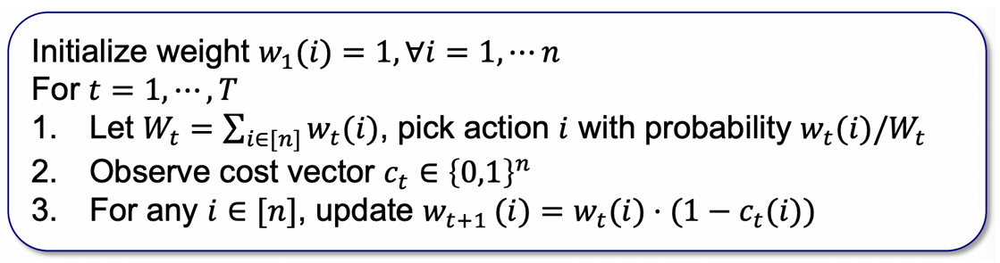{width=75%}
</figure>

在更一般的情况下，代价可以是 $[0,1]$ 中的任意值，并且不一定存在完美策略，因此我们需要对算法进行修改：

<figure markdown="span">
    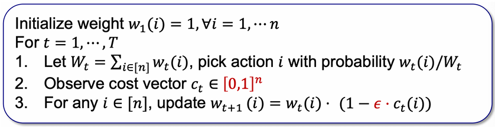{width=75%}
</figure>

第一处修改扩展了代价的范围，第二处修改使得权重更保守，否则不存在完美策略时所有行动的权重全部归零

上图给出的算法就是乘性权重（Multiplicative Weights Update, MWU）算法。算法的直观是，根据每个行动在之前阶段的表现来决定下一阶段的权重，即表现好的行动权重增加，表现差的行动权重减少。

!!! theorem
    乘性权重算法在之前的问题设定下的遗憾至多为 $O(\sqrt{T \ln n})$。

??? proof
    <figure markdown="span">
        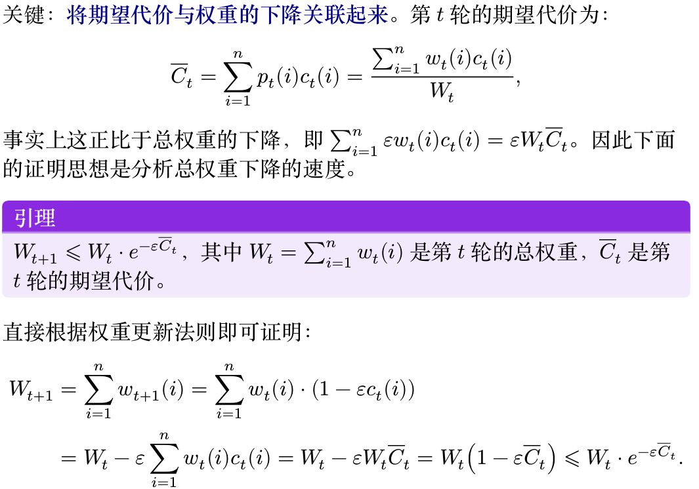{width=75%}
        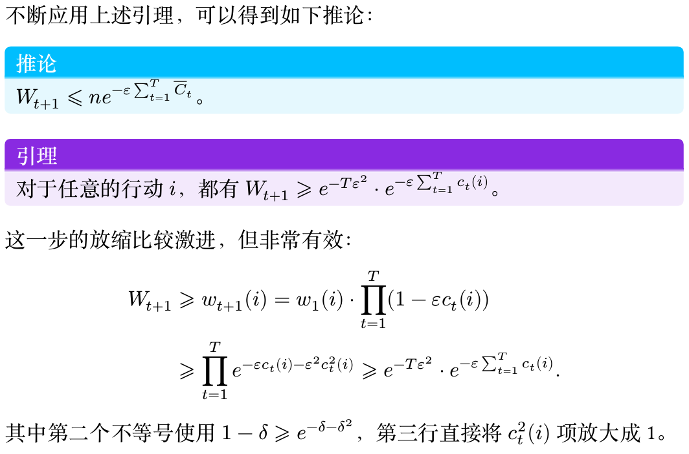{width=75%}
        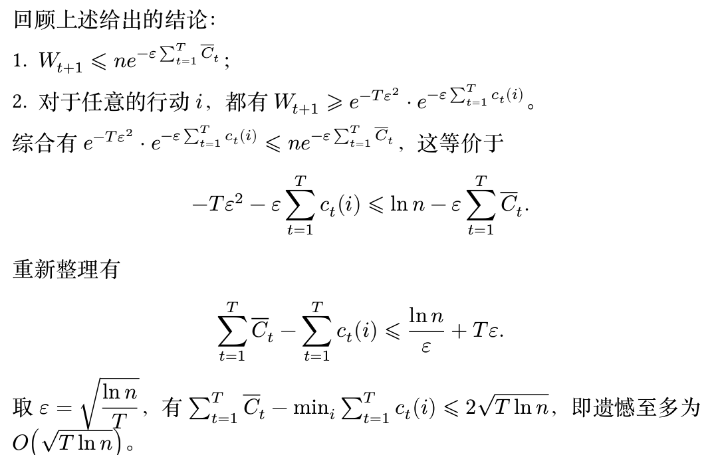{width=75%}
    </figure>

- 注意 MWU 算法对于任意的代价序列都是无憾的，这就是对抗性的意义，上述证明也不依赖于任何对代价序列的假设
- 如果使用 $w_{t+1}(i) =w_t(i) \cdot e^{-\varepsilon c_t(i)}$，因为 $e^{-\varepsilon} \approx 1−\varepsilon$，因此也是可以进行类似的分析的；
    - 这样得到的算法称为 Hedge 算法
- 如果从全反馈更换为老虎机反馈，算法思路不变，得到的是 Exp3 算法

## 多臂老虎机应用

- 多臂老虎机是面对具有不确定性的问题的“万金油”方法
- 在数据市场相关文献中的应用多臂老虎机的应用
    - 在线定价问题：数据卖家不确定数据对于买家的价值，可以使用随机多臂老虎机建模解决
    - 数据获取问题：数据买家不确定数据市场上哪些数据对于自己的训练任务而言最有效，可以使用随机或对抗性多臂老虎机建模解决

!!! example
    假设你要出售一份数据，你知道会有 $N$ 个人来购买你的数据，并且每个人对数据的估值 $v$ 都完全一致，都在 $[0,1]$ 中。买家是逐个到达的，你需要提供一个价格 $p$，如果 $v \geqslant p$，买家就会购买你的数据，否则买家会离开。你的目标是尽快地学习到 $v$ 的值，误差范围是 $\varepsilon = \frac{1}{N}$。

    - 如果的确遇到了最坏的情况，$\log N$ 次搜索之后，可以设置到价格 $p \geqslant \tilde{v} - \frac{1}{N}$，其中 $\tilde{v}$ 是我们第 $\log N$ 轮学习到的值
    - 在这种情况下，$N$ 轮之后的总收益是：

        $$ \underbrace{0}_{\text{前 $\log N$ 轮}} + \underbrace{(N-\log N)(v - \frac{2}{N})}_{\text{后 $N-\log N$ 轮}} \approx vN - v\log N - 2 $$

    - 则二分搜索的遗憾为 $R \approx vN - (vN - v\log N - 2) = v\log N + 2$

    !!! note "定理"
        存在一个改进的算法，使得其遗憾至多为 $1 + 2\log\log N$

    - 尽管二分搜索是在没有任何先验信息的情况下能搜索到 $N$ 的最快算法，但当猜测的 $p_i > v$ 时，卖家一分钱也赚不到
    - 也就是说，二分搜索在向上探索的时候可能过于激进，因此改进的算法需要在探索时更加保守

### 改进算法

<figure markdown="span">
    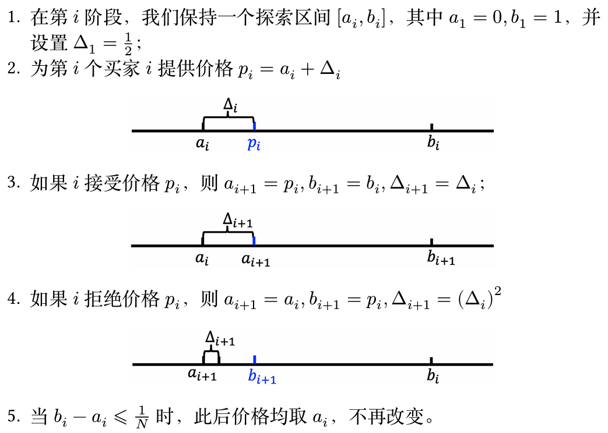{width=75%}
</figure>

<figure markdown="span">
    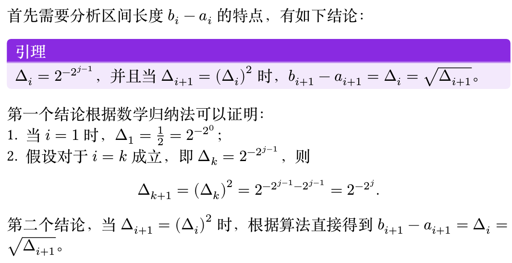{width=75%}
    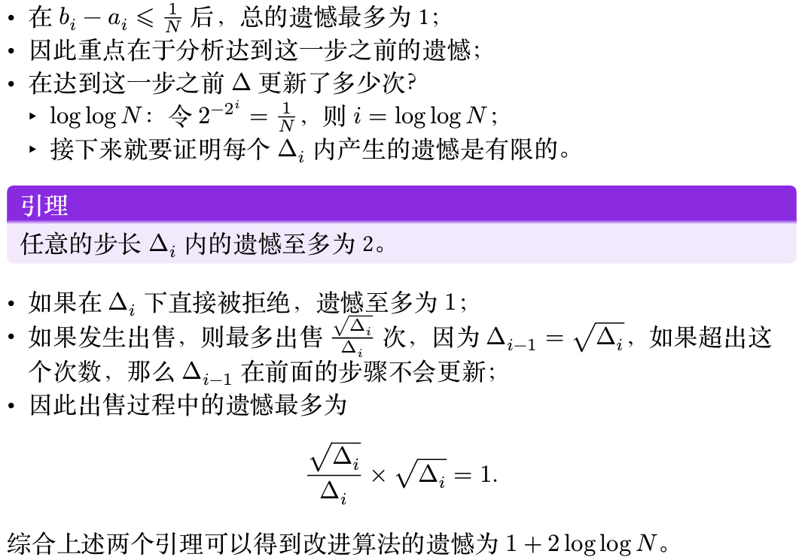{width=75%}
</figure>
