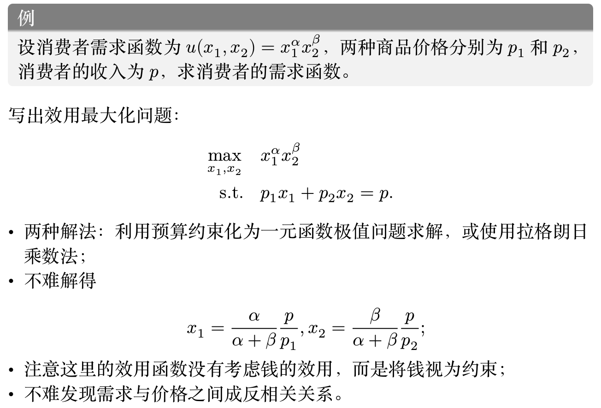
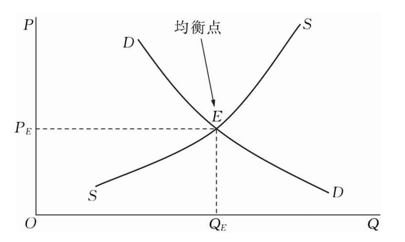
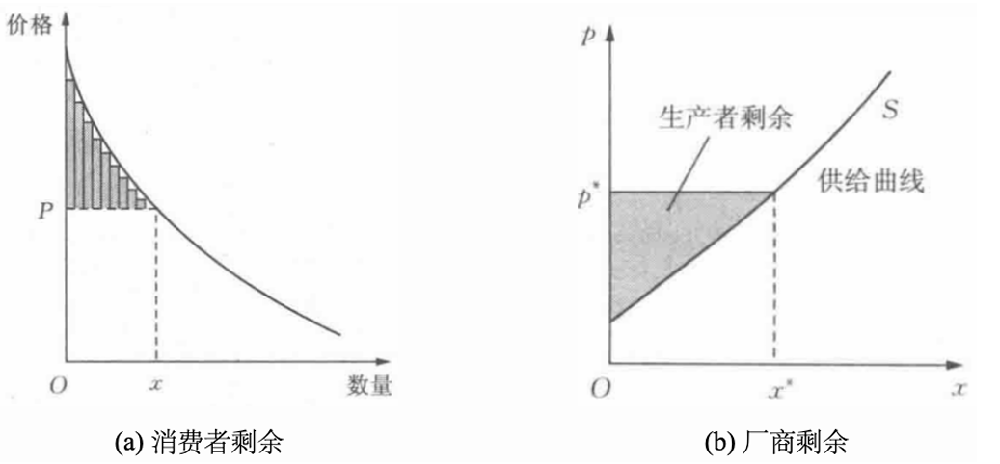
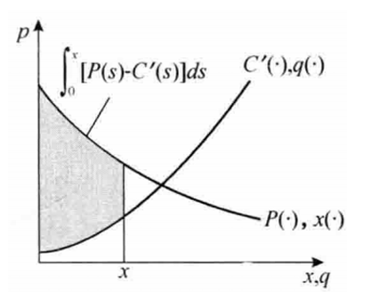

# 博弈论基础

## 微观经济学基础

### 效用

!!! definition "效用"
    我们称消费者对消费组合的偏好程度为这些消费组合对消费者产生的效用（utility）。

    形式化来说，记 $\bm{x} = (x_1, \ldots, x_n)$ 表示消费者的消费组合（又称消费束），其中 $x_i$ 表示购买 $x_i$ 单位的物品 $i$。

    效用函数就是将消费束映射到满意程度的函数：
    $$ u: \mathbb{R}^n \to \mathbb{R} $$

例如一个人对 20 个钥匙扣和 5 个本子的组合的偏好程度为 10，对 15 个钥匙扣和10 个本子的组合为 15，这就说明前者的效用为 10，后者的效用为 15。

- 只需要询问一个诚实的人，例如“你觉得 1 斤苹果和多少钱带给你的偏好是无差异的”，如此就可以得到一个消费者可以接受的价格
- 如 $u$(1 斤苹果，− 6元钱) = 0 表示 1 斤苹果和 6 元钱对消费者无差异
- 消费者越满意，消费束对应的效用值就越高

!!! note "理性人假设"
    理性人假设是指经济中每个参与人都会选择让自身效用最大化的行动

- 有时理性也有其他含义，例如使用贝叶斯公式来更新行动信念
- 理性人假设是经济学的理论研究基础，虽然饱受争议；不理性人的经济学称为行为经济学。

### 几类效用函数

- 柯布-道格拉斯效用函数
    - $u(x_1, x_2) = x_1^{\alpha} x_2^{1-\alpha}$，其中 $\alpha \in (0, 1)$
    - 特点：边际效用递减，具有常数弹性替代率
- 冯诺依曼-摩根斯坦效用函数
    - $u(L) = p \cdot u(\bm{x}) + (1-p) \cdot u(\bm{y})$，其中 $L$ 是一个随机结果，$p$ 是结果 $\bm{x}$ 的概率，$\bm{y}$ 是另一个结果
    - 用于描述不确定性下的效用，例如购买彩票 $L$，有
        - $p$ 的概率获得 $\bm{x}$，$1-p$ 的概率获得 $\bm{y}$
        - 那么购买这张彩票的效用等于获得 $\bm{x}$ 与获得 $\bm{y}$ 的效用的加权平均
    - 若 $u$ 是严格凹函数，则称为风险厌恶（risk-averse）
    - 若 $u$ 是严格凸函数，则称为风险偏好（risk-seeking）
    - 若 $u$ 是线性函数，则称为风险中性（risk-neutral）
- 拟线性效用函数
    - $u(\bm{x}, p) = v(\bm{x}) - p$
    - 其中 $v$ 是一个非负的效用函数，$p$ 是支付的价格，上式表示通过价格 $p$ 购买了消费束 $\bm{x}$ 后的效用
    - 事实上前面的几个效用函数都是在描述 $v$ 的形式，这里还考虑了价格的因素

### 边际效用递减规律

!!! definition "边际效用"
    边际效用是指消费者对某种物品的消费量每增加一单位所增加的额外满足程度。

!!! example
    例如我们在一个很热很热很热很热的杭州的夏日吃冰淇淋解暑，我们可能会思考吃几个冰激凌对你而言最满足

    |数量|1|2|3|4|5|6|
    |---|---|---|---|---|---|---|
    |效用|7|12|16|18|15|10|
    |边际效用|7|5|4|2|-3|-5|

- 在一定时间内，随着消费某种商品数量的不断增加，消费者从中得到的总效用是在增加的，但是增加的速度在递减，即边际效用是递减的
- 当商品消费量达到一定程度后，总效用达到最大值，如果继续增加消费，总效用不但不会增加，反而会逐渐减少，此时边际效用变为负数

### 效用最大化问题

考虑只有两个商品的情形：设消费者的效用函数为 $u(x_1, x_2)$，两种商品的价格分别为 $p_1$ 和 $p_2$，消费者的收入为 $p$。

这里强调了消费者的收入，这是因为在消费时消费者都有预算约束（budget constraint），因此效用最大化的目标可以写为

$$ \begin{aligned}
\max\limits_{x_1, x_2} \quad & u(x_1, x_2) \\
\text{s.t. } \quad & p_1 x_1 + p_2 x_2 \leqslant p
\end{aligned} $$

如果我们要求 $u$ 关于 $x_1$ 和 $x_2$ 是递增的，那么 $u$ 取最大值时预算约束必然取等号

!!! example
    <figure markdown="span">
        {width=80%}
    </figure>

把上面这个粒子的基本思想推广，就可以得到一般情况下的消费者需求函数：

!!! note "需求定律"
    在其他条件不变的情况下，商品的需求量与价格之间成反方向变动的关系，即价格上涨，需求量减少；价格下降，需求量增加。

    > 当然也存在一些例外，例如吉芬商品，但这里不做讨论。

!!! note "供给定律"
    对于正常商品来说，在其他条件不变的情况下，商品价格与需求量之间存在着正方向的变动关系，即一种商品的价格上升时，这种商品的供给量就会增加，相反，价格下降时供给量减少，这就是供给定律。

**市场出清（market clearing）**：市场机制能够自动地消除超额供给或超额需求，市场在短期内自发地趋于供给等于需求的均衡状态。

<figure markdown="span">
    {width=65%}
</figure>

上述均衡称为“竞争均衡”，因为其中重要的假设是厂商和消费者数量非常多，以至于**他们每个人各自的行动完全无法改变整个市场的价格**。

### 社会福利

社会福利等于消费者剩余（消费者福利）加上厂商剩余（厂商福利）

- 消费者剩余 = 买到的商品效用 - 支付
- 厂商剩余 = 出售的收益 - 成本

<figure markdown="span">
    {width=65%}
</figure>

- 注意到消费者支付等同于厂商出售的收益，因此两者抵消，
- 社会福利 = 消费者买到商品的效用 - 厂商成本

<figure markdown="span">
    {width=55%}
</figure>

我们不难发现显然在供给曲线和需求曲线相交的位置可以实现社会福利的最大化

!!! info "福利经济学第一定理"
    在竞争市场中，当市场供求达到均衡时，市场资源配置是社会福利最大化的。

但福利经济学第一定理成立的假设非常多：完全竞争、完全信息、无交易成本、无外部性、无规模经济等，而这些假设在现实中很难实现。在这些条件不满足的时候，就出现了**市场失灵（market failure）**。

- 垄断（monopoly）：一个产品只有一家厂商生产，故该厂商具有市场势力，自身可以决定产品价格，从而会破坏完全竞争市场的福利最优性；
    - 垄断厂商会通过提高价格攫取更多的消费者剩余
- 外部性（externalities）：性指一个人或一群人的行动和决策使另一个人或一群人受损或受益的情况，即社会成员从事经济活动时其成本与后果不完全由该行为人承担；
    - 例如河流上游工业园区，下游渔场，工业园区排污会影响渔场的生产活动（**负外部性**）
    - 例如植树造林不仅美化了环境，还为周围居民提供了清新的空气和休闲场所（**正外部性**）
- 信息不对称（asymmetric information）：指交易双方掌握的信息不对称

    > “柠檬” 在美国俚语中表示 “次品”或 “不中用的东西”，所以柠檬市场也称次品市场

    - 例如二手车市场中，卖家知道车的真实状况，而买家不知道，这就会导致“柠檬市场”（lemon market）现象，即劣质商品占据市场主导地位

!!! info "数据的特性"
    - 卖家垄断：例如 X，Meta，Google 等平台拥有大量自己独特的用户数据，因此具有垄断势力
    - 零成本复制性：使得数据出售更容易，人们更容易受到外部性的影响
    - 效用不确定性（信息不对称）：
        - 买家确定数据的效用，但卖家不确定买家认为的效用
        - 卖家知道数据的价值，但买家本身不确定数据效用
        - 买家和卖家都不确定数据的效用：卖家不清楚买家下游任务，买家没看到数据内容前不确定数据质量

    数据定价结合垄断可以实施**价格歧视**

    - 一级（完全）价格歧视：厂商完全掌握消费者偏好，**将每个消费者的价格定在其最大支付意愿上**，完全攫取消费者剩余
    - 三级价格歧视：根据消费者一些特征，如年龄、性别、地域等，**对不同消费者群体收取不同价格**（大数据杀熟，学生半价）
    - 二级价格歧视：先前的思路是收集消费者的信息做出个性化定价，而二级价格歧视是**按不同的价格出售不同数量的商品**，但购买相同数量产品的人都支付相同的价格
        - 例如批量购买货物时可以获得一些折扣，

## 博弈论：引入与基本概念

> 博弈论（game theory）可以被定义为对智能的理性决策者之间冲突与合作的数学模型研究

- 价格竞争：伯川德竞争（Bertrand competition）
- 产量竞争：古诺竞争（Cournot competition）

!!! definiton "博弈"
    博弈可被表达为一个三元组 $G = (N, (S_i)_{i \in N}, (u_i)_{i \in N})$，其中

    - $N$ 是参与博弈的玩家（player）集合，每个参与人记为 $i \in N$
    - $S_i$ 是玩家 $i$ 的可以选择的策略（strategy）的集合
    -  报酬函数（payoff function）：$u_i: S_1 \times \cdots \times S_n \to \mathbb{R}$，表示玩家 $i$ 在所有玩家都选择了某个策略组合时的效用

- 上述博弈表达称为策略式博弈（strategic game），对于其他更复杂的博弈（如拓展式、不完全信息）还会有其他额外需要描述的要素
- 这里要求博弈的参与人是理性且智能的
    - 理性是指参与人会选择最大化自身效用的行动
    - 智能人假设参与人有能力分析博弈的全局
    - 参与人都是理性、智能的是一项共同知识：我知道你知道我知道你知道...

!!! definition "博弈的解"
    博弈的解或解概念（solution concept）是对于一个博弈的一种预期结果，通常是一个策略组合，即参与人的行动选择，或收益的分配结果。

### 博弈论的分类

1. 非合作博弈：参与人之间没有合作，选择行动之后效用是各自的效用，与他人无关
    - 分类依据一：是否完全信息，即参与人之间是否互相知道对方的效用函数，是否知道博弈的全局信息
    - 分类依据二：静态博弈或动态博弈，即参与人的行动是一次同时完成的，还是序贯进行的
        - 注意，如果在两个互相看不见的房子里进行石头剪刀布，即使要求同时完成行动，但行动的先后不会影响结果，因此这也是静态博弈

    有四大类博弈：

    1. 完全信息静态博弈：参与人互相知道对方的效用函数，且行动是同时完成的（如囚徒困境）
    2. 完全信息动态博弈：参与人互相知道对方的效用函数，且行动是序贯进行的（价格领袖模型）
    3. 不完全信息静态博弈：参与人互相不知道对方的效用函数，且行动是同时完成的（如石头剪刀布、拍卖）
    4. 不完全信息动态博弈：参与人互相不知道对方的效用函数，且行动是序贯进行的（如扑克牌）

2. 合作博弈：考虑参与人之间合作后产生的联合效用

    - 重点关注如何分配联合效用，有很多的解概念（收益分配方式）
    - 目前广泛应用于数据估值（后续会介绍）

## 占优策略均衡

## 纳什均衡

