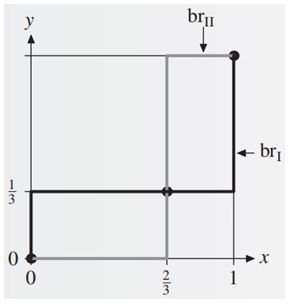

# 博弈论基础 2

## 混合策略纳什均衡

!!! definition "混合策略"
    令 $G = \left( N, (S_i) _ {i \in N}, (u_i) _ {i \in N} \right)$ 为一个策略性博弈。一个混合策略（mixed strategy）是 $S_i$ 上的概率分布，参与人 $i$ 的混合策略集记为

    $$ \Sigma_i = \Big\{ \sigma_i:\ S_i \to [0,1]:\ \sum_{s_i \in S_i} \sigma_i(s_i) = 1 \Big\} $$

    其中 $\sigma_i(s_i)$ 表示参与人 $i$ 在该混合策略下选择策略 $s_i$ 的概率。

- 简单来说，混合策略就是给 $S_i$ 中的每个策略（它们称之为纯策略（pure strategy））分配一个概率，然后按照这个概率随机选择策略。
- 纯策略可以视为混合策略的一个特例：只有一个策略概率为 1，其余策略概率都为 0。

!!! note
    我们引入一个记号：对每个参与人 $i$，令 $\Delta(S_i)$ 表示 $S_i$ 上的概率分布组成的集合，即 

    $$ \Delta(S_i) = \Big\{ p_i:\ S_i \to [0,1]:\ \sum_{s_i \in S_i} p_i(s_i) = 1 \Big\} $$ 

    显然我们有 $\Sigma_i = \Delta(S_i)$。

    当 $S_i$ 是一个连续策略空间时，求和需要替换为积分

对于混合策略，博弈中参与人的效用函数也需要做相应调整：

!!! definition "博弈的混合扩展"
    令 $ G = \left( N, (S_i) _ {i \in N}, (u_i) _ {i \in N} \right) $ 为一个策略性博弈。$G$ 的混合扩展（mixed extension）是一个博弈
    $$ \Gamma = \big( N, (\Sigma_i) _ {i \in N}, (U_i) _ {i \in N} \big) $$
    其中 $\Sigma_i = \Delta(S_i)$ 是参与人 $i$ 的混合策略集，它的收益函数 $U_i:\ \Sigma \to \mathbb{R}$ 会将每个混合策略向量 $\sigma = (\sigma_1, \ldots, \sigma_n) \in \Sigma_1 \times \cdots \times \Sigma_n$ 映射到一个实数，定义为

    $$ U_i(\sigma) = \mathbb{E}[u_i(\sigma)] = \sum_{s \in S} \prod_{j = 1}^n \sigma_j(s_j) u_i(s_1, \cdots , s_n) $$

- 共有 $n$ 个参与人，它们分别选择的策略恰好组成一个纯策略 $(s_1, \cdots , s_n)$ 的概率是 $\prod_{j = 1}^n \sigma_j(s_j)$
    - 这里还蕴含一个假定：每个参与人的行动相互独立。
- 这里我们使用的是了冯诺伊曼-摩根斯坦恩效用函数，效用的本质是参与人 $i$ 在混合策略向量 $\sigma$ 下的期望收益

!!! definition "混合策略纳什均衡"
    给定一个博弈的混合扩展 $\Gamma = \big( N, (\Sigma_i)_{i \in N}, (U_i)_{i \in N} \big)$，一个混合策略向量 $\sigma^* = (\sigma_1^*, \cdots, \sigma_n^*)$ 是一个混合策略纳什均衡，若对每个参与人 $i$，都有

    $$ U_i(\sigma^*) \geqslant U _ i(\sigma_i, \sigma _ {-i}^*) \quad \forall \sigma_i \in \Sigma_i $$

如果直接通过定义验证某个混合策略向量是否构成混合策略纳什均衡，需要将它和任意的混合策略 $\sigma_i$ 都进行验证，这显然是很复杂的，我们可以用一个等价条件来进行更方便的判断：

!!! note "混合策略纳什均衡等价条件"
    令 $ G = \left( N, (S_i) _ {i \in N}, (u_i) _ {i \in N} \right) $ 为一个策略性博弈，$\Gamma$ 为 $G$ 的混合拓展。一个混合策略向量 $\sigma^*$ 是 $\Gamma$ 的一个混合策略纳什均衡，当且仅当对每个参与人 $i$ 和每一个纯策略 $s_i \in S_i$，都有

    $$ U_i(\sigma^ *) \geqslant U_i(s_i, \sigma_{-i}^ *) $$

!!! example
    考虑如下性别大战：一对夫妻要安排他们周末的活动，可选择的活动有看足球赛（$F$）和听音乐会（$C$）。丈夫更喜欢看足球赛，而妻子更喜欢听音乐会。如果他们选择的活动不同，那么他们都不会高兴，如果他们选择的活动相同，那么他们都会高兴，只是高兴程度略有不同：

    <figure markdown="span">
        {width=75%}
    </figure>

    显然 $(F, F)$ 和 $(C, C)$ 是纯策略纳什均衡，我们还可以使用**最优反应法计算混合策略纳什均衡**

    记记丈夫的混合策略为 $(x,1−x)$（表示以 $x$ 的概率选择 $F$，$1−x$ 的概率选择 $C$），妻子的混合策略为 $(y,1−y)$。对于丈夫的每个混合策略 $(x,1−x)$，妻子的最优反应（best response，br）集合为

    $$ \begin{aligned}
    br_2(x) &= \argmax_{y \in [0, 1]} u_2 (x, y) \\\\ 
        &= \{ y \in [0, 1]:\ u_2 (x, y) \geqslant u_2 (x, z), \forall z \in [0, 1] \}
    \end{aligned} $$

    而 $u_2(x, y) = xy \cdot 1 + (1 - x)(1 - y) \cdot 2 = 2 - 2x - 2y + 3xy$，将 $x$ 视为定值，对 $y$ 求导得到 $3x - 2$，因此可以得到最优反应集合为（丈夫同理）：

    \[
    br_2(x) := 
    \begin{cases} 
    \{0\} & x \in \left[0, \dfrac{2}{3}\right) \\\\ 
    [0, 1] & x \in \left\{\dfrac{2}{3}\right\} \\\\
    \{1\} & x \in \left(\dfrac{2}{3}, 1\right]
    \end{cases}, \quad
    br_1(y) := 
    \begin{cases} 
    \{0\} & y \in \left[0, \dfrac{1}{3}\right) \\\\ 
    [0, 1] & y \in \left\{\dfrac{1}{3}\right\} \\\\ 
    \{1\} & y \in \left(\dfrac{1}{3}, 1\right]
    \end{cases}
    \]

    可以绘制出如下的图像：

    <figure markdown="span">
        {width=80%}
    </figure>

    有三个交点：$(0,0)$、$(\dfrac{2}{3},\dfrac{1}{3})$、$(1,1)$，第 1 和第 3 个是纯策略纳什均衡，第 2 个是混合策略纳什均衡

上面这个例子中混合策略纳什均衡下双方选择策略 $F$ 和 $C$ 的效用是相等的，这一结论可以一般化为：

!!! note "无差异原则"
    令 $\sigma^*$ 为一个混合策略纳什均衡，$s_i$ 和 $s_i'$ 为参与人 $i$ 的两个纯策略，若 $\sigma_i^*(s_i),\ \sigma_i^*(s_i') > 0$，则

    $$ U_i(s_i, \sigma_{-i}^*) = U_i(s_i', \sigma_{-i}^*) $$

    也就是说，如果一个参与人在混合策略纳什均衡下，如果某两个纯策略的概率都大于 0，那么这两个纯策略的效用应当是相等的。

    - 如果 $U_i(s_i, \sigma_{-i}^*) > U_i(s_i', \sigma_{-i}^*)$ 那么很显然参与人 $i$  应该增加 $s_i$ 的概率，而不考虑 $s_i'$，从而提高自己的收益
    - 即概率为正的所有纯策略的效用都是相等的，这些策略构成的集合称为混合策略的支撑集合
        - 被严格占优的策略不可能属于混合策略的支撑集合，因为我们可以直接用占优于这个策略的策略替换它，从而提高收益

!!! example
    现在我们可以使用**无差异原则**计算性别大战的混合策略纳什均衡。

    使用无差异原则时首先需要先找到纯策略纳什均衡，否则后续计算可能会忽略。这个例子的纯策略纳什均衡显然是 $(F, F)$ 和 $(C, C)$。

    夫妻两人的混合策略分别为 $\sigma_1 = (x, 1-x),\ \sigma_2 = (y, 1-y)$，且 $0<x<1,\ 0<y<1$（称为完全混合的均衡）。根据无差异原则必有丈夫选择 $F$ 和 $C$ 的效用相等：
    $$ U_1(F, \sigma_2) = 2y = 1-y = U_1(C, \sigma_2) $$
    解得 $y = \dfrac{1}{3}$，同理也可以解得 $x = \dfrac{2}{3}$，因此混合策略纳什均衡为 $(\dfrac{2}{3}, \dfrac{1}{3})$。

!!! tip
    无差异原则只是取得混合策略纳什均衡的必要条件，并非充分条件，因此求出结果后需要验证。

    在这个例子中不需要验证，，因为本例只有两个策略，两个策略的效用都一致，不存在其他策略得到更高的效用。

!!! theorem "纳什定理"
    每一个策略型博弈 $G$，如果参与人的个数有限，每个参与人的纯策略数目有限，那么 $G$ 至少有一个混合策略纳什均衡。

    > 双人博弈纳什均衡的计算是 PPAD 完全问题。
    > （目前没有多项式时间算法可以计算一般的两人博弈的混合策略纳什均衡）

## 完全信息动态博弈

## 不完全信息博弈

