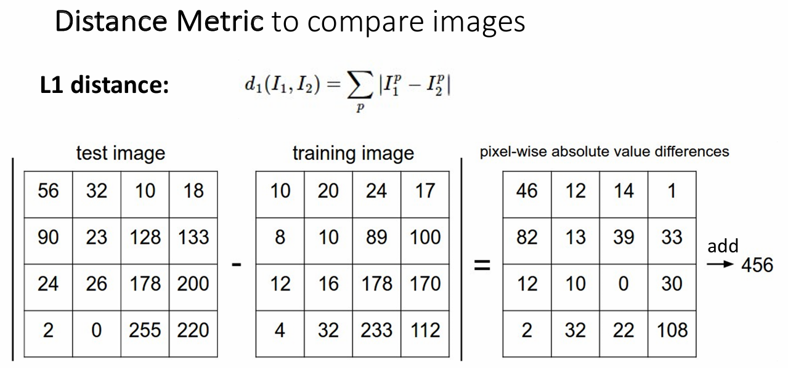
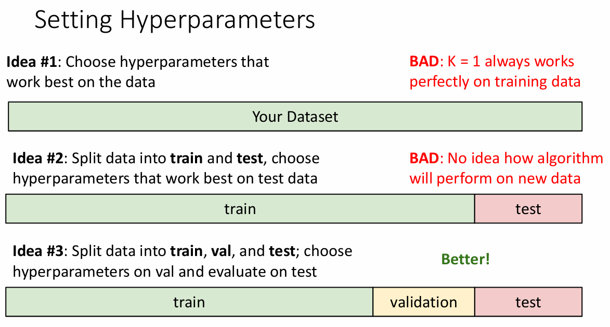
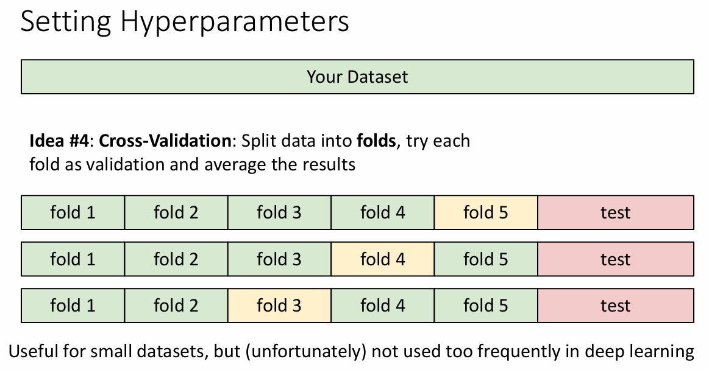
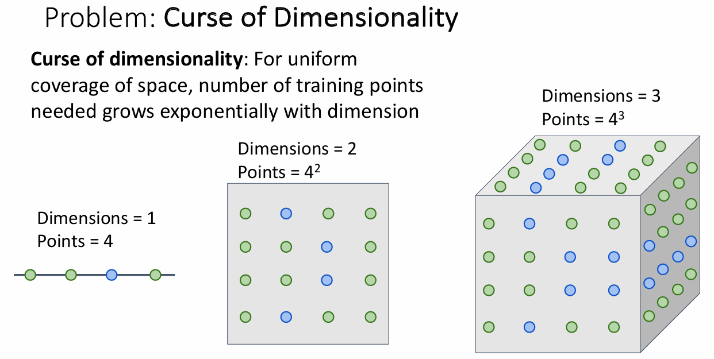

# Image Classification

- input: image
- output: label -- assign image to one of a fixed set of categories 

challenge: 

- semantic gap: the difference between low-level pixels and high-level concepts
- viewpoint variation: the same object can look different from different viewpoints
- intraclass variation: the same class can have a lot of variation
- fine-grained discrimination: distinguishing between similar categories
- background clutter: 需要识别的物体可能与环境融为一体
- illumination changes: 光照变化，会大幅影响像素
- deformation：物体变形（猫是可以随便变形的液体x）
- Occlusion：遮挡 

## machine learning

data-driven approach:

1. collect a dataset of images and labels
2. use machine learning to train a classifier
3. evaluate the classifier on a new image

MNIST 是一个手写数字数据集，每个图片是一个28x28的灰度图像，有10个类别，共计50000张训练图片和10000张测试图片。

由于 MNIST 数据集太简单，所以很多模型都能达到很高的准确率，因此通常只用来验证模型是否能正常工作。

ImageNet 是一个大型的图像数据集，有1000个类别，共计1400万张图片，被视为计算机视觉领域的标准测试集。 

当我们进行图像分类时，通常会涉及到两个主要的函数：train 和 predict。

- train: 输入训练数据集，让模型学习并记忆数据及其标签，输出一个模型
- predict: 输入与训练数据集相似的测试数据集，让模型根据数据的特征预测其标签，输出预测标签

## First classifier: Nearest Neighbor

我们首先需要能够衡量两个图片之间的相似度，例如曼哈顿距离(L1 distance)：

{width=70%}

如果只考虑最近的一个邻居，那么我们的分类器就很容易受到噪声等各种因素的影响。如果我们在这时考虑更多的邻居，例如 K 个，那么这个位置的点的分类就会是这 K 个点中最多的那个类别，这称为 K-Nearest Neighbor。 

对于 K-Nearest Neighbor 而言，有两个我们无法通过训练得到的超参数（hyperparamete r）：K 和 distance metric。

通常而言，我们有几种来确定超参数的方法：

{width=70%}

- 如果我们只考虑让模型在我们自己的训练集上表现最好，那么毫无疑问我们应该选择 K=1，因为这样的话所有训练数据的最近邻居都是它自己（距离为 0），虽然这样能达到 100% 的准确率，但毫无疑问这样的模型是过拟合的。
- 假如我们把数据集划分为训练集和测试集两部分，并且我们只关心测试集的准确率，这样也会得到不那么好的结果。因为每一次接触测试集的数据，我们的模型都会被“污染”，这会导致我们无法评估模型的泛化能力。
- 我们还可以把数据集分为训练集、验证集和测试集三部分，利用训练集训练，根据验证集上的表现结果调整参数，并最后在测试集上进行且仅进行一次测试，根据测试结果最终判定模型的好坏。

    > Evaluate on the test set only a single time, at the very end.

    虽然这在事实上是训练模型的正确方法，但这也意味着我们如果我们最终发现模型的表现不好，那么前面所做的所有工作就都白费了，这在实践中是难以接受的。

{width=70%}

- 还有一种方法是把数据分块，每次只用其中一块作为验证集，其余的作为训练集，这样我们可以多次验证模型的表现，最终取平均值作为模型的表现。这种方法叫做交叉验证（cross-validation），但在深度学习中很少使用。

    - 交叉验证的计算成本很高，因此人们更倾向于使用单一认证分割（single validation split），通常使用 50%-90% 的数据用于训练，其余用于验证。

## K-Nearest Neighbor: Universal Approximation

某种意义上，只要我们拥有足够多的训练数据，我们就可以利用 K-Nearest Neighbor 模型来近似任何函数，这称为 Universal Approximation（万能逼近，通用近似）。

<figure>
    
    
</figure>

但要达到这样的目的就需要我们拥有足够稠密的数据点，例如我们想要达到在一维数据中 4 个能够做到的密集程度，在二维数据中就需要 $ 4^2 $ 个，而在三维数据中就需要 $ 4^3 $ 个，在高维数据中就会出现维度爆炸问题。

{width=70%}

我们很少直接在原始的像素空间上进行 K-Nearest Neighbor，但利用深度卷积网络（deep convolutional network）可以在高维空间中学习到一个好的特征表示，这样就可以在特征空间中进行 K-Nearest Neighbor。

!!! abstract
    -  In **Image classification** we start with a **training set** of images and labels, and must predict labels on the test set
    - Image classification is challenging due to the semantic gap: we need invariance to occlusion, deformation, lighting, intraclass variation, etc
    - Image classification is a **building block** for other vision tasks
    - The **K-Nearest Neighbors** classifier predicts labels based on nearest training examples
    - Distance metric and K are **hyperparameters**
    - Choose hyperparameters using the **validation set**; only run on the test set once at the very end!
