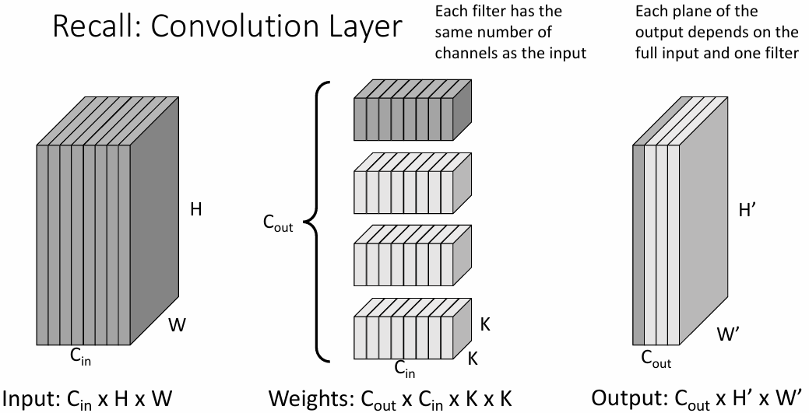
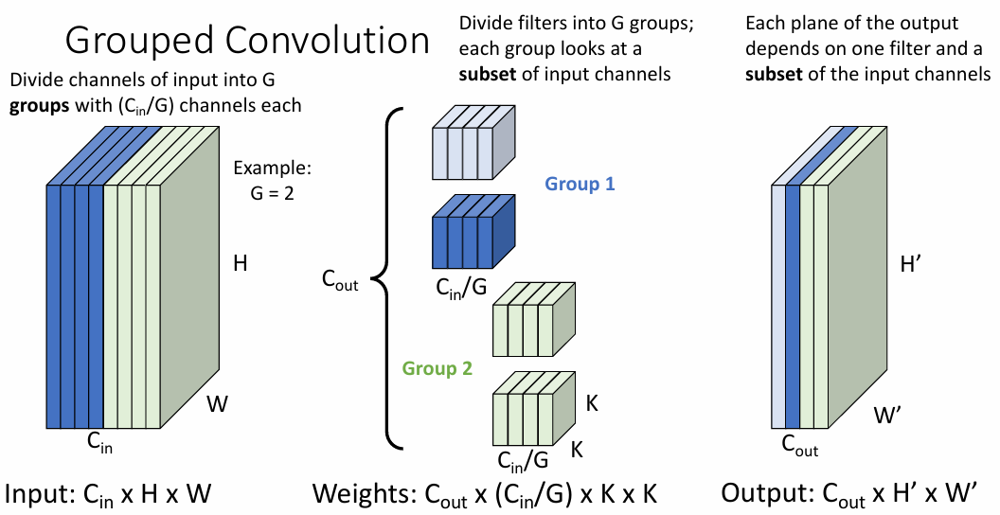
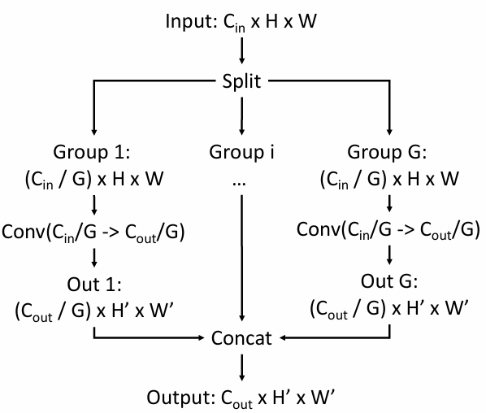
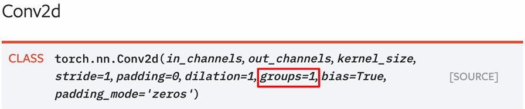
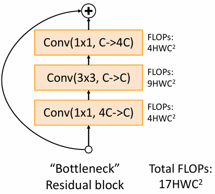
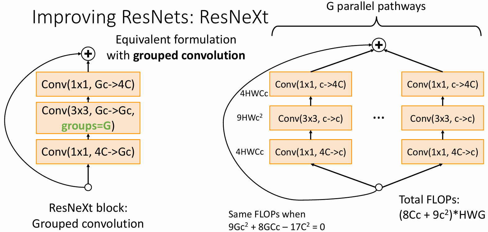
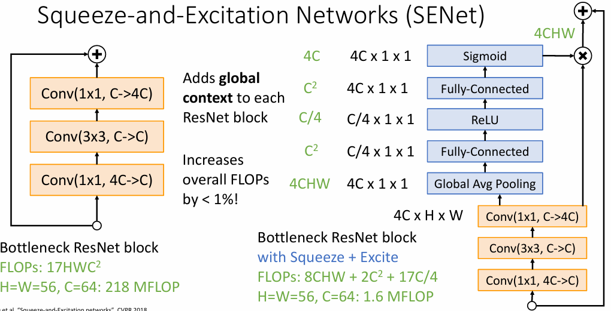
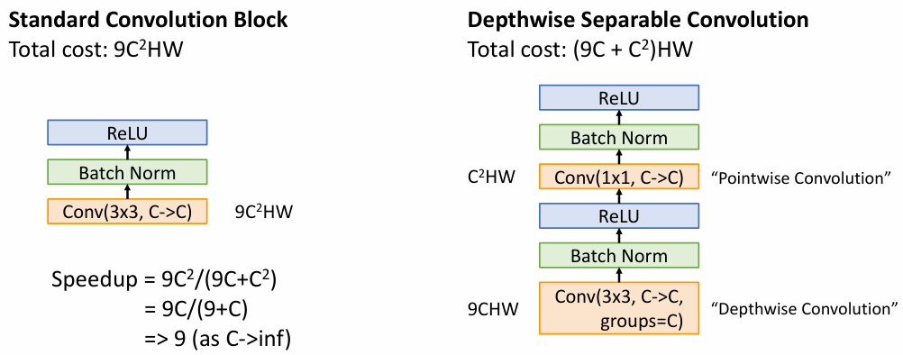
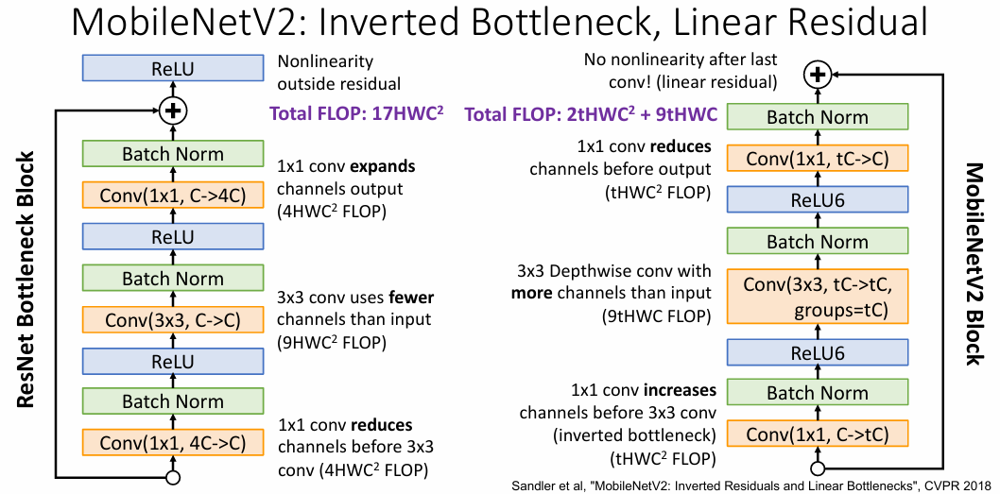

# CNN Architectures Ⅱ

!!! info "Measures of Model Complexity"
    - **Parameters**: 模型中可学习参数的数量
    - **Floating Point Operations (FLOPs)**: 模型进行一次 forward pass 时所需要进行的浮点运算次数
        - 许多论文只统计卷积层中的 FLOPs（不考虑 ReLU、pooling、BatchNorm 等）
        - 大部分论文用 1 FLOP 表示 1 次乘-加运算，因此两个 N 维向量的点积需要 N 次 FLOPs；有些论文使用 MADD 或 MACC（Multiply-Add or Multiply-Accumulate）而非 FLOP
        - 一些其他的资源（例如 NVIDIA marketing materials）可能会使用不同的定义，把一次乘-加运算定义为 2 FLOPs，这样的话，两个 N 维向量的点积需要 2N 次 FLOPs
    - **Network Runtime**: 模型在真实的硬件上进行一次 forward pass 所需的时间

## Grouped Convolution

<figure markdown="span">
    {width=60%}
</figure>

在经典的卷积层中，过滤器的每个通道都会与输入的每个通道进行卷积运算，输出的通道数取决于过滤器的数量。但在分组卷积中，输入数据和过滤器的通道都会被分为若干数量相等的组，每一组的过滤器只会与相应的输入数据组进行卷积运算，最后将所有的输出数据组合在一起。

<figure markdown="span">
    {width=60%}
</figure>

例如这里我们把输入数据和 filter 的通道分成了 $G$ 组，那么每一组的通道数就是 $C_{in}/G$。每一组的 filter 都只关注属于自己的那一组通道，而输出的每一个通道仅取决于其中一个 filter 和输入通道的一个子集。

<figure markdown="span">
    {width=60%}
</figure>

特别地，当 $G = C_{in}$ 时，如果 $C_{out} = G$，那么每一个 filter 只会与输入数据的一个通道进行卷积运算，这就让不同通道之间的信息不会混合，称其为 **Depthwise Convolution**。 

事实上，此时如果 $C_{out}$ 是 $G$ 的整数倍，那么就可以看作是 $C_{out}/C_{in}$ 个 Depthwise Convolution 的组合，同样也可以实现不同通道之间的信息分离。

!!! note "Grouped Convolution"
    <figure markdown="span">
        {width=55%}
    </figure>

    可视为拥有 $G$ 个并行的卷积层，每一个卷积层都只关注于 $C_{in}/G$ 个通道，并输出 $C_{out}/G$ 个通道，最后再将所有的输出通道合并。

    - input：$C_{in} \times H \times W$

        split into $G$ groups: $\dfrac{C_{in}}{G} \times H \times W$

    - weights：$G \times \dfrac{C_{out}}{G} \times \dfrac{C_{in}}{G} \times K \times K$
    - output：$G \times \dfrac{C_{out}}{G} \times H' \times W'$

    最后再把所有的输出通道合并，得到 $C_{out} \times H' \times W'$。

    - FLOPs：$G \times \dfrac{C_{out}}{G} \times \dfrac{C_{in}}{G} \times H' \times W' \times K \times K = \dfrac{C_{in} C_{out}}{G} H' W' K^2$

    > 常规的卷积操作就相当于 $G = 1$ 的情况。可以看到，所需要的 FLOPs 会直接变为原来的 $1/G$ 

!!! info "Grouped Convolution in PyTorch"
    PyTorch 的 `nn.Conv2d` 中为我们提供了 `groups` 参数，可以直接实现分组卷积。

    <figure markdown="span">
        {width=85%}
    </figure>

## Improving ResNets: ResNeXt

ResNeXt 是对 ResNet 的一种改进，其核心思想是将 ResNet 中的卷积层替换为分组卷积，使其能够更好地利用 GPU 的并行计算能力。

<figure markdown="span">
    {align=left width=33%}

    {align=right width=65%}
</figure>

我们可以计算得到，残差网络中一个瓶颈块的 FLOPs 为 $17HWC^2$ ，而 ResNeXt block 的 FLOPs 为 $(8Cc + 9c^2)HWG$，也就是说当
$$ 8Cc + 9c^2 - 17C^2 = 0 $$
时，这两者的 FLOPs 是相等的。

> 经过试验，我们可以发现在相同的 FLOPs 下，ResNeXt 的性能要优于 ResNet。

!!! info "Squeeze-and-Excitation Networks (SENet)"
    SENet 是另一种对 ResNet 的改进，其核心思想是引入了一个 Squeeze-and-Excitation 模块，由 Squeeze（挤压）和 Excitation（激励）两个操作组成，帮助网络更加有效地建模通道之间的依赖关系，用于动态地调整每一个通道的权重。

    <figure markdown="span">
        {width=65%}
    </figure>

    - **Squeeze**: 通过全局平均池化操作来将每个通道的空间信息压缩成一个数值。也就是说，网络从每个特征图中提取出一个全局统计量（通常是该通道的平均值），这是通道的全局描述（global context）。
    - **Excitation**: 通过两个全连接层，将全局特征向量映射为一个权重向量，再通过 Sigmoid 函数得到一个权重向量
        - 激励操作的输出是一个与输入特征图通道数相同的权重向量，表示每个通道的“重要性”。
    - **Scale（Recalibration，重新校准）**: 将激励操作的输出（权重系数）与原始输入的特征图逐通道相乘，这样便对每个通道进行了加权。重要的通道会得到增强，而不重要的通道会被抑制。

    通过对特征通道的动态重标定，SENet 能够对关键特征通道进行强调，从而提升网络的表达能力。

    > 将 SE 模块添加到任何现有架构中，几乎都可以得到 1% 到 2% 的性能提升，而且通常只会增加不到 1% 的 FLOPs 和运行时间。

## MobileNets

为了把深度学习模型应用到移动设备上，我们需要对模型复杂度和准确率进行 trade-off。MobileNets 就是为了在移动设备上进行实时图像分类和目标检测而设计的。

MobileNets 通过使用一种叫做**深度可分离卷积（Depthwise Separable Convolutions）**的技术，大大减少了计算量和参数量，从而能够在计算资源有限的设备上运行得更高效。

<figure markdown="span">
    {width=70%}
</figure>

### Depthwise Separable Convolutions

深度可分离卷积与传统的卷积操作相比，它分为两个步骤：

- **Depthwise Convolution（深度卷积）**：对输入的每一个通道进行卷积操作，但是每一个通道都使用独立的卷积核，不同通道之间不共享卷积核。就像我们上面提到的那样，这一步操作只关注每个通道内部的信息。
- **Pointwise Convolution（逐点卷积）**：对深度卷积的输出进行 $1 \times 1$ 的卷积操作，这一步操作可以看作是对通道之间的信息进行整合。

深度可分离卷积通过上述方式减少了计算量和参数量，同时也减少了过拟合的风险。

### MobileNet v2

<figure markdown="span">
    {width=70%}
</figure>

MobileNet v2 是对 MobileNet 的改进，主要包括两个方面：

- **倒残差结构（Inverted Residuals）**：与 ResNet 中先压缩后拓展的结构相反，MobileNet v2 先拓展后压缩。
    - 首先将输入的特征图通过扩展层升维，然后通过深度可分离卷积处理高维特征，最后再通过压缩层降维。
- **线性瓶颈（Linear Bottlenecks）**：在扩展层和压缩层之间加入线性激活函数，避免了非线性激活函数对信息的破坏。
    - 这里没有采用 ReLU 激活函数，而是直接使用了 ReLU6，即

    $$ ReLU6(x) = \begin{cases} 0 & x < 0 \\ x & 0 \leq x \leq 6 \\ 6 & x > 6 \end{cases} $$

## Neural Architecture Search (NAS)

Neural Architecture Search 的核心目标是让机器自动设计出更加高效、精确的网络结构，而不依赖人工手动设计。

NAS 的基本思路是通过搜索算法在一个大的搜索空间中寻找最优的网络结构。

1. **搜索空间（Search Space）**

    搜索空间定义了所有可能的网络架构的集合。在 NAS 中，搜索空间通常包括了网络的各种可能的层类型、连接方式、卷积核大小、激活函数等。这些设计空间通常非常庞大，包含了成千上万的架构。

    - **层类型**：例如卷积层、全连接层、池化层等。
    - **连接方式**：例如不同层之间的连接顺序，是否使用跳跃连接等。
    - **超参数**：如学习率、网络的深度和宽度、卷积核大小等

2. **搜索策略（Search Strategy）**

    通过强化学习、进化算法、梯度优化、贝叶斯优化等优化方法来搜索最优的网络结构，并不断更新搜索策略。

3. **性能评估（Performance Estimation）**

    对生成的网络架构的性能进行评估，通常使用验证集上的准确率来评估，但需要大量的计算资源。

NAS 中有一个称为 controllerr 的模块，它负责生成网络结构的超参数（子网络架构），然后通过训练这些子网络来评估其性能，再根据性能的反馈来更新 controllerr。

虽然 NAS 潜力巨大，但由于计算资源消耗大、搜索空间庞大、训练时间长等问题，NAS 目前仍有很长的路要走。

!!! summary "CNN Architectures Summary"
    - Early work (AlexNet-> VGG -> ResNet): **bigger networks work better**
    - New focus on **efficiency**: Improve accuracy, control for network complexity
    - **Grouped and Depthwise Convolution** appear in many modern architectures
    - **Squeeze-and-Excite** adds accuracy boost to just about any architecture while only adding a tiny amount of FLOPs and runtime
    - Tiny networks for **mobile devices** (MobileNet, ShuffleNet)
    - **Neural Architecture Search (NAS)** promised to automate architecture design
    - More recent work has moved towards **careful improvements to ResNet-like architectures**
    - ResNet and ResNeXt are still surprisingly strong and popular architectures!
