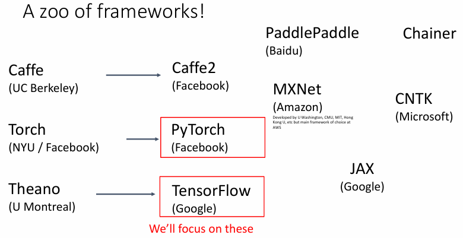
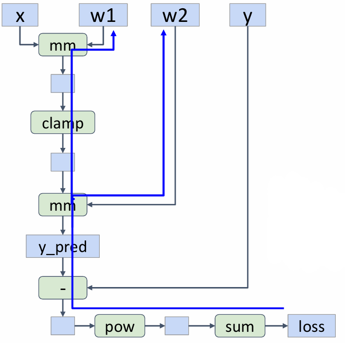
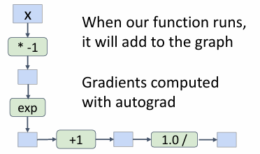
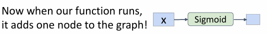
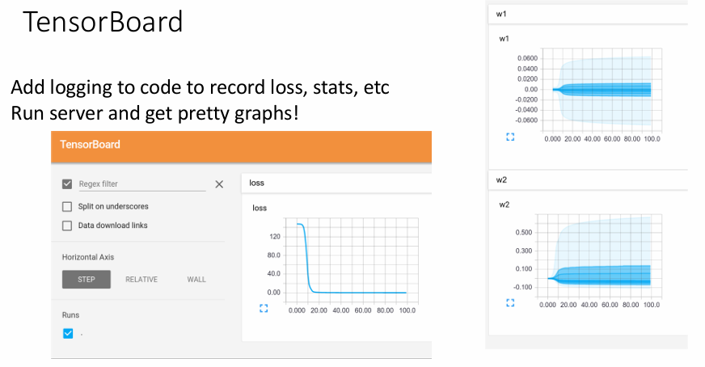
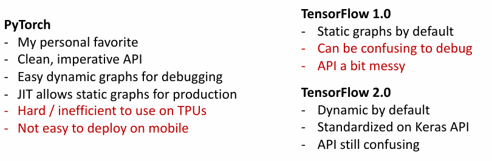

# Deep Learning Software —— PyTorch

<figure markdown="span">
    {width=70%}
</figure>

深度学习框架的核心在于

1. Allow rapid prototyping of new ideas

    允许我们快速实现新的想法

2. Automatically compute gradients for you

    能为我们自动计算梯度

3. Run it all efficiently on GPU (or TPU)

    能在 GPU（或 TPU）上高效运行

## Fundamental Concepts

- **Tensor**: Like a numpy array, but can run on GPU
- **Autograd**: Package for building computational graphs out of Tensors, and automatically computing gradients
- **Module**: A neural network layer; may store state or learnable weights

## Autograd

### Autograd 工作原理

在 PyTorch 中，我们可以借助 `torch.autograd` 来自动计算张量的梯度，这使得神经网络的反向传播变得非常简单，他也是 PyTorch 的核心特性之一

Autograd 的关键在于维护一个计算图，它会记录所有的计算操作，然后在反向传播时，根据这个计算图来计算梯度

- **前向传播**：在前向传播过程中，PyTorch 会记录你对张量进行的每个操作（加法、乘法、矩阵乘法等）。这些操作会以计算图的形式被自动记录下来。
- **反向传播**：一旦我们获得了损失值，我们可以通过调用 .backward() 方法来触发反向传播，计算所有相关张量的梯度。Autograd 会根据前向传播记录的操作顺序，从输出反向计算梯度，直到输入层。

具体来说，我们可以在创建张量时提供 `requires_grad=True` 参数来告诉 PyTorch 需要计算这个张量的梯度。当我们使用被设置为 `requires_grad=True` 的张量进行计算时，PyTorch 会自动记录这些计算操作，以构建计算图。

- 使用被设置为 `requires_grad=True` 的张量计算出的结果张量会被自动设置为 `requires_grad=True`。

当我们对最终的输出结果调用 `.backward()` 方法时，PyTorch 会自动计算所有相关张量的梯度，并且将这些梯度积累到对应张量的 `.grad` 属性中。

### 如何使用 Autograd

我们可以从下面这个简单的例子来看一下 Autograd 的使用方法

{align=right width=36%}

```python
import torch

N, D_in, H, D_out = 64, 1000, 100, 10
x = torch.randn(N, D_in)
y = torch.randn(N, D_out)
w1 = torch.randn(D_in, H, requires_grad=True)
w2 = torch.randn(H, D_out, requires_grad=True)

learning_rate = 1e-6
for t in range(500):
    y_pred = x.mm(w1).clamp(min=0).mm(w2)
    loss = (y_pred - y).pow(2).sum()
    print(t, loss.item())

    loss.backward()

    with torch.no_grad():
        w1 -= learning_rate * w1.grad
        w2 -= learning_rate * w2.grad
        w1.grad.zero_()
        w2.grad.zero_()
```

- 上述代码在每一次执行时，都会从无到有构建一个如右图所示的计算图，并在调用 `loss.backward()` 时，后从往前计算梯度。
- 当我们不希望某些操作被记录在计算图中时，我们可以使用 `with torch.no_grad()` 来包裹这些操作，以临时禁用 Autograd。
- 在每一次迭代结束后，我们需要调用 `w1.grad.zero_()` 和 `w2.grad.zero_()` 来清空这两个张量的梯度，否则梯度就会在每一次迭代中不断积累，从而导致 bug。

!!! tip
    - 如果我们不希望某些操作被记录在计算图中，可以使用 x.detach() 来创建一个新的张量，它与 x 拥有相同的数据，但不再记录操作。

        例如 `y = x.detach()` 表示创建一个与 x 数据相同的张量，但对它的操作不会被记录到计算图中

    - 有时需要在不影响主计算图的情况下对张量进行操作，requires_grad_() 方法允许我们直接改变张量的 requires_grad 属性：

        例如 `x.requires_grad_()` 表示从现在开始记录 x 的梯度

### 自定义函数

当我们使用一个普通的 Python 函数来定义新的操作时，PyTorch 实际上会记录这个函数内部的每一个操作，从而构建相当复杂的计算图。

```python
def sigmoid(x):
    return 1 / (1 + (-x).exp())
```

比如我们定义一个 sigmoid 函数，我们很容易知道它的导数是 `sigmoid(x) * (1 - sigmoid(x))`，但是如果我们直接把它在 PyTorch 中使用，PyTorch Autograd 会把这个函数展开成非常复杂的计算图，这样会导致计算效率低下。

```python hl_lines="2"
for t in range(500):
    y_pred = sigmoid(x.mm(w1)).mm(w2)
    loss = (y_pred - y).pow(2).sum()
    print(t, loss.item())

    loss.backward()
```

<figure markdown="span">
    {width=70%}
</figure>

为了解决这个问题，我们可以使用 `torch.autograd.Function` 来自定义一个 Autograd 函数，这样我们就可以直接定义这个函数的前向传播和反向传播。

```python
class Sigmoid(torch.autograd.Function):
    @staticmethod
    def forward(ctx, x):
        y = 1 / (1 + (-x).exp())
        ctx.save_for_backward(y)
        return y

    @staticmethod
    def backward(ctx, grad_y):
        y, = ctx.saved_tensors
        grad_x = y * (1 - y) * grad_y
        return grad_x

def sigmoid(x):
    return Sigmoid.apply(x)
```
        
这样一来 PyTorch 就会直接使用把我们定义的函数视为一个整体，在计算图中只相当于一个节点，从而提高了计算效率。

<figure markdown="span">
    {width=70%}
</figure>

> 一般来说这样的做法在实践中并不常见——大部分情况下直接使用 Python 函数就足够了。

## Some Modules

### nn

`torch.nn` 是 PyTorch 中的一个模块，它提供了很多有用的类和函数，用来帮助我们构建神经网络。

!!! example

    ```python
    import torch
    import torch.nn as nn

    N, D_in, H, D_out = 64, 1000, 100, 10
    x = torch.randn(N, D_in)
    y = torch.randn(N, D_out)

    model = nn.Sequential(
        nn.Linear(D_in, H),
        nn.ReLU(),
        nn.Linear(H, D_out),
    )

    learning_rate = 1e-2
    for t in range(500):
        y_pred = model(x)
        loss = nn.functional.mse_loss(y_pred, y)
        print(t, loss.item())
        
        loss.backward()

        with torch.no_grad():
            for param in model.parameters():
                param -= learning_rate * param.grad
        model.zero_grad()
    ```

    - 所使用到的模块包括
        - `nn.Linear`：全连接层
        - `nn.ReLU`：ReLU 激活函数
        - `nn.functional.mse_loss`：均方误差损失函数
    - 这里我们使用 `y_pred = model(x)` 来向模型提供数据并让其前向传递，得到预测标签
    - 在最后几行中我们更新模型中的所有参数，并且清空模型的梯度以避免梯度积累

### optim

我们还可以使用 `torch.optim` 模块来对我们的模型进行优化，比如

```python
...
learning_rate = 1e-4
optimizer = torch.optim.Adam(model.parameters(), lr=learning_rate)

for t in range(500):
    y_pred = model(x)
    loss = nn.functional.mse_loss(y_pred, y)

    loss.backward()

    optimizer.step()
    optimizer.zero_grad()
```

这里我们首先指定了优化器的更新规则是 Adam，接着在每一次迭代中都通过 `.step()` 和 `.zero_grad()` 函数来进行优化并清空梯度积累。

### 自定义模块

- A PyTorch Module is a neural net layer; it inputs and outputs Tensors
- Modules can contain weights or other modules

我们可以使用 `torch.nn` 来定义自己的模块和神经网络层。

```python
import torch
import torch.nn as nn
import torch.optim as optim

# 自定义神经网络模块
class SimpleNN(nn.Module):
    def __init__(self, D_in, H, D_out):
        super(SimpleNN, self).__init__()
        # 定义网络层
        self.fc1 = nn.Linear(D_in, H)  # 输入到隐藏层
        self.relu = nn.ReLU()  # 激活函数
        self.fc2 = nn.Linear(H, D_out)  # 隐藏层到输出层

    def forward(self, x):
        # 定义前向传播
        x = self.fc1(x)  # 输入到隐藏层
        x = self.relu(x)  # 激活函数
        x = self.fc2(x)  # 隐藏层到输出层
        return x

# 设置网络参数
N, D_in, H, D_out = 64, 1000, 100, 10
x = torch.randn(N, D_in)
y = torch.randn(N, D_out)

# 创建模型实例
model = SimpleNN(D_in, H, D_out)

optimizer = optim.SGD(model.parameters(), lr=1e-4)
for t in range(500):
    y_pred = model(x)
    loss = nn.functional.mse_loss(y_pred, y)

    loss.backward()
    optimizer.step()
    optimizer.zero_grad()
```

## Computation Graphs

计算图是深度学习框架中至关重要的部分，用于表示计算的过程，以及计算过程中的依赖关系。

各个深度学习框架中的计算图可以分为动态计算图（Dynamic Computation Graphs）和静态计算图（Static Computation Graphs）两种。


### DynamicComputation Graphs

在动态计算图中，图的构建是即时的，每次前向传播时都会重新构建计算图。

- **特点**
    - 即时构建：每次执行操作时都会立即创建计算图。也就是说，操作会在每次执行时动态地计算并记录计算过程。
    - 灵活性强：用户可以在执行时修改网络结构，例如条件判断、循环等操作，可以根据输入数据的不同执行不同的路径。

        我们甚至可以在每次迭代中改变网络结构，这样可以更灵活地构建网络，例如（一个仅供参考，实际中不建议这样做的例子

        ```python
        for t in range(500):
            w2 = w2a if prev_loss < 5.0 else w2b
            y_pred = x.mm(w1).clamp(min=0).mm(w2)
            ...
        ```

    - 逐步执行：前向传播会根据当前输入逐步执行，每个操作都立即计算出结果并反馈给后续的计算。
- **优势**
    - 灵活性和易调试：允许在每次执行时改变网络结构，非常适合用于需要控制流的模型，如循环神经网络（RNN）或者带有条件判断和循环的复杂模型。允许我们随时修改网络结构，并且能够方便地进行调试。
    - 简化代码：无需事先定义整个计算图，避免了构建复杂计算图时可能出现的静态错误。每次迭代时，计算图是“动态”地构建和执行的。
    - 适应性强：动态计算图在处理变长序列、递归模型或需要自定义操作的任务时表现出极大的优势。PyTorch 和 TensorFlow 2.x 都使用动态计算图（Eager Execution）来提高代码的可读性和灵活性。
- **缺点**
    - 低效：由于每次迭代都会重新构建计算图，尤其是在批量处理和大规模训练时，可能无法充分利用硬件加速。
    - 内存消耗较大：由于计算图是动态创建的，图的构建和维护过程可能需要更多的内存资源。

### Static Computation Graphs

在静态计算图中，计算图在训练开始之前就已经构建好。网络的所有操作、参数、数据流等都事先确定，整个计算图在模型训练或推理过程中都保持不变。

- **特点**
    - 预先构建：计算图在训练开始之前就已经构建好，网络的所有操作、参数、数据流等都事先确定。
    - 一次定义，多次使用：计算图只需要定义一次，之后可以重复使用，不需要每次迭代都重新构建。
    - 优化空间：静态计算图可以进行图优化，框架可以根据已经建立好的计算图进行多种优化策略（例如：算子融合、内存共享等），提高计算效率。
- **优势**
    - 高效：计算图的优化能够让框架更好地利用硬件加速（如 GPU），并且减少冗余操作，提高训练效率。
    - 内存使用优化：框架可以根据静态图进行内存布局优化，从而减少内存的消耗，特别是在复杂网络结构中。
    - 并行性：由于计算图是静态的，框架可以预先分析图的结构并执行更加高效的并行计算，通常能在大规模训练中获得更高的性能。
- **缺点**
    - 灵活性差：静态计算图在训练开始之前就已经构建好，网络结构和数据流都是固定的，对于需要灵活性和动态调整的模型而言，静态计算图可能不太适用。
    - 调试困难：静态计算图在构建过程中会进行优化，这导致实际执行的代码与我们书写的代码可能会有很大不同，这可能会大幅增加调试的难度。

!!! example

    ```python hl_lines="17"
    import torch

    def model(x, y, w1, w2a, w2b, prev_loss):
        w2 = w2a if prev_loss < 5.0 else w2b
        y_pred = x.mm(w1).clamp(min=0).mm(w2)
        loss = (y_pred - y).pow(2).sum()
        return loss

    N, D_in, H, D_out = 64, 1000, 100, 10
    x = torch.randn(N, D_in)
    y = torch.randn(N, D_out)
    w1 = torch.randn(D_in, H, requires_grad=True)
    w2a = torch.randn(H, D_out, requires_grad=True)
    w2b = torch.randn(H, D_out, requires_grad=True)

    #使用 torch.jit.script 将模型变为静态图
    graph = torch.jit.script(model)

    prev_loss = 5.0
    learning_rate = 1e-6
    for t in range(500):
        loss = graph(x, y, w1, w2a, w2b, prev_loss)
        prev_loss = loss.item()

        loss.backward()

        with torch.no_grad():
            w1 -= learning_rate * w1.grad
            w2a -= learning_rate * w2a.grad
            w2b -= learning_rate * w2b.grad
            w1.grad.zero_()
            w2a.grad.zero_()
            w2b.grad.zero_()
    ```

    - 在上述代码中，我们首先定义了一个模型函数 model，然后使用 `torch.jit.script` 将这个函数转换为静态图。
    
    又或者我们也可以在定义模型时使用 `@torch.jit.script` 装饰器来直接将模型转换为静态图

    ```python hl_lines="1"
    @torch.jit.script
    def model(x, y, w1, w2a, w2b, prev_loss):
        w2 = w2a if prev_loss < 5.0 else w2b
        y_pred = x.mm(w1).clamp(min=0).mm(w2)
        loss = (y_pred - y).pow(2).sum()
        return loss
    ```

!!! extra "TensorFlow"
    TensorFlow 1.x 默认使用静态计算图，需要先定义计算图，然后在 Session 中执行计算图。（动态图是可选项，需要使用 tf.enable_eager_execution() 开启）

    TensorFlow 2.x 引入了 Eager Execution，默认使用使用动态计算图，可以像 PyTorch 一样直接执行操作，不需要先定义计算图。（静态图是可选项，需要使用 tf.function 将函数转换为静态图）

!!! info "TensorBoard"
    - PyTorch：使用 `torch.utils.tensorboard` 模块来记录训练过程，可以记录标量、图像、音频、文本等信息。
    - TensorFlow：TensorBoard 是 TensorFlow 的可视化工具，可以用来展示计算图、损失曲线、参数分布等信息。

    <figure markdown="span">
        {width=70%}
    </figure>

!!! note "PyTorch vs TensorFlow"
    <figure markdown="span">
        {width=90%}
    </figure>
