# Recurrent Networks

对于一般的前馈神经网络而言，输入和输出是 one-to-one 的关系，即输入一个数据，输出一个数据。但是对于很多问题，输入和输出之间的关系是 one-to-many，many-to-one，many-to-many 的关系。这时候就需要使用循环神经网络（Recurrent Neural Networks, RNN）来解决这类问题。

Recurrent Neural Networks 是一种特殊的神经网络，它能接受一个序列作为输入，经过一系列处理后，输出一个输出序列。

<figure markdown="span">
    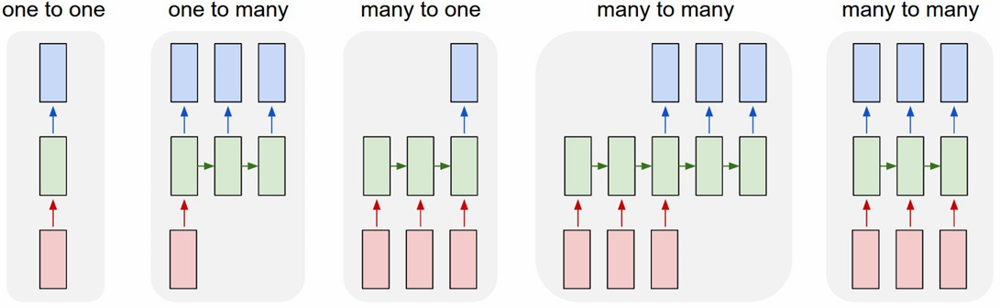{width=75%}
</figure>

- one to one: 例如图像分类任务，Image -> Label
- one to many: 例如图像描述任务，Image -> Description（sequence of words）
- many to one: 例如情感分析任务，Sequence of words -> Sentiment
- many to many: 例如机器翻译任务，Sequence of words -> Sequence of words；或者视频分类任务，Sequence of frames -> Sequence of labels

## Structure of RNN

### (Vanilla) Recurrent Neural Networks

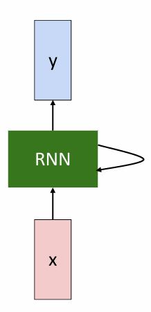{align=right width=20%}

> Key idea: RNNs have an "internal state" that is updated as a sequence is processed

我们可以对一个向量序列 $x$ 在每一个时刻应用相同的循环公式：
$$ h_t = f_W(h_{t-1}, x_t) $$
其中 $h_t$ 是当前时刻的隐藏状态，$h_{t-1}$ 是上一时刻的隐藏状态，$x_t$ 是当前时刻的输入，$f_W$ 是一个以 $W$ 为参数的函数。

也就是说，我们会根据当前时刻的输入和上一时刻的隐藏状态，计算出当前时刻的隐藏状态，并且根据当前时刻的隐藏状态，计算出当前时刻的输出。

> 有些类似于一个状态机，输出和当前状态有关，也可能和当前时刻的输入有关。

例如我们可能有如下公式：
$$ h_t = \tanh(W_{hh}h_{t-1} + W_{xh}x_t + b_h) $$
$$ y_t = W_{hy}h_t + b_y $$

!!! tip
    在同一个 RNN 中，所使用的所有权重矩阵 $W$ 和偏置向量 $b$ 都是共享的。（包括 $W_{hh}, W_{xh}, W_{hy}$ 和 $b_h, b_y$）

### Computational Graph

<figure markdown="span">
    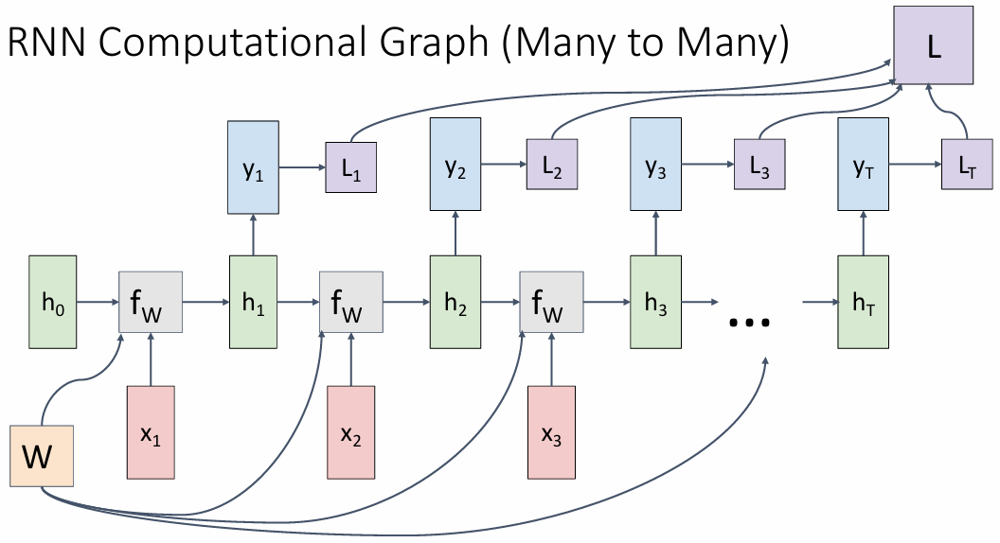{width=65%}
</figure>

在 many-to-many 的情况下，我们需要在每一个时刻都根据前一时刻的隐藏状态和当前时刻的输入计算出当前时刻的隐藏状态，然后再根据当前状态计算出当前时刻的输出。每进行一次输出都要计算一次损失，最后把所有时刻的损失加起来，得到整个序列的损失。

<figure markdown="span">
    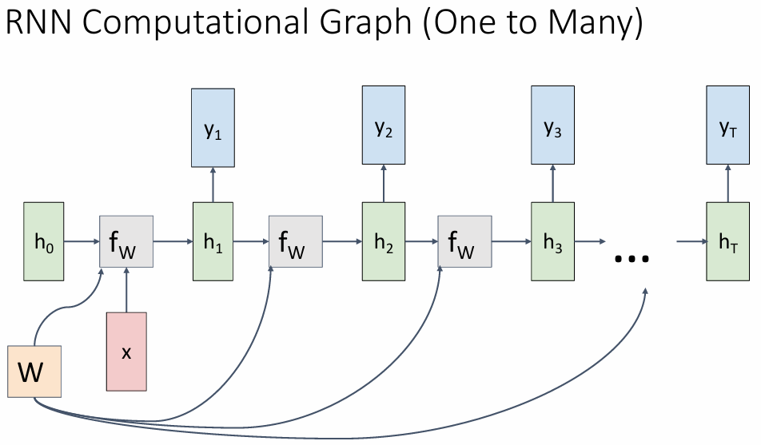{width=65%}
</figure>

在 many-to-one 的情况下，我们只需要根据输入利用循环方程不断更新隐藏状态，最后根据最后一个隐藏状态计算出输出。

<figure markdown="span">
    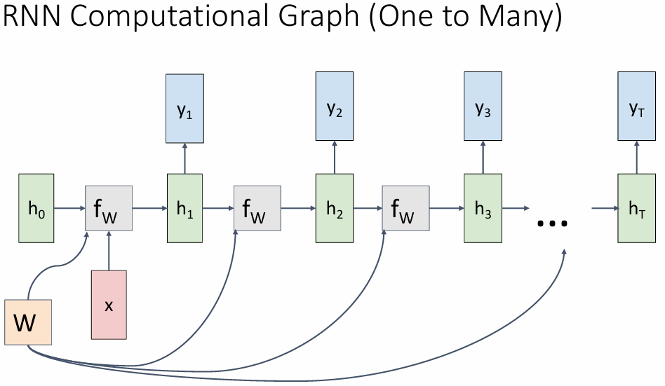{width=65%}
</figure>

在 one-to-many 的情况下，我们只需要根据输入计算出第一个隐藏状态，然后根据第一个隐藏状态计算出第一个输出，再根据第一个输出计算出第二个隐藏状态，以此类推。在此过程中不再需要输入，而只需要根据上一个输出计算下一个隐藏状态。

<figure markdown="span">
    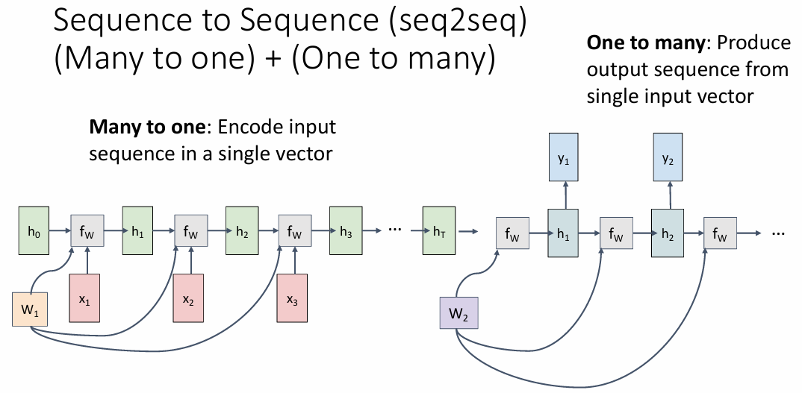{width=65%}
</figure>

我们还可以把 many-to-many 的情况拆分成 many-to-one + one-to-many，这也被称为 Sequence-to-Sequence （seq2seq）模型。

首先我们把输入序列经过 many-to-one RNN 编码为一个向量，它就是 many-to-one RNN 最终的隐藏状态，然后以这个向量作为另一个 one-to-many RNN 的初始隐藏状态，再生成输出序列。

!!! example "Language Modeling"
    language modeling 是一个经典的 NLP 任务，即给定一个句子的前面的单词，预测下一个单词。（或给定若干个字符，预测下一个字符）

    > Given characters 1, 2, …, t-1, model predicts character t

    例如这里我们将 "hello" 作为训练序列，所有可选输出单词表为 {h, e, l, o}，那么我们可以有如下的训练序列：

    <figure markdown="span">
        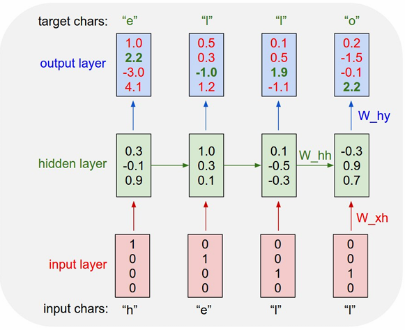{width=60%}
    </figure>

    训练过程如下：

    - 给定输入 "h"，将输出与目标输出 "e" 进行比较，计算损失
    - 给定输入 "he"，将输出与目标输出 "l" 进行比较，计算损失
    - 给定输入 "hel"，将输出与目标输出 "l" 进行比较，计算损失
    - 给定输入 "hell"，将输出与目标输出 "o" 进行比较，计算损失

    我们的目标是尽可能增大输出层中的绿色数字，减小红色数字。最后将所有损失加起来，得到整个序列的损失，然后进行反向传播更新参数。（通常使用交叉熵损失函数，即 softmax + negative log likelihood）

    <figure markdown="span">
        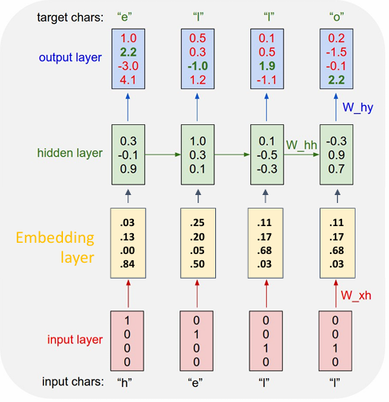{width=60%}
    </figure>

    在 test time，我们每次都将输出作为下一个输入，直到输出一个特殊的结束符号，它表示序列的结束。

    可以注意到，我们对每一个输入都编码为了一个 热独向量（one-hot vector），这是因为我们的输入是离散的，当我们利用这个向量乘以权重矩阵时，我们实际上是在选择权重矩阵的某一列。

    <figure markdown="span">
        {width=65%}
    </figure>

    当可能的字典很大时，one-hot 编码会变得非常稀疏，这时候我们可以使用嵌入层（Embedding Layer）来将输入编码为一个稠密的向量表示。

    > 嵌入层是一种特殊的全连接层，它能将类别数据映射到一个低维的连续空间，能够学习到更好的表示，提高计算效率。

    <figure markdown="span">
        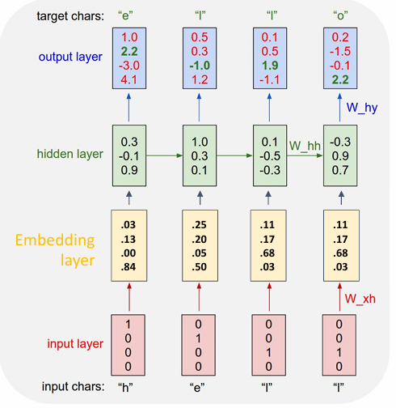{width=60%}
    </figure>

### Backpropagation Through Time

在通常的反向传播中，梯度会从每一层的输入传播到输出，然后再传播到下一层的输入。但是在 RNN 中，隐藏层的状态同时依赖于当前时刻的输入和上一时刻的隐藏状态，因此我们还需要将梯度从当前时刻传播到上一时刻，在时间维度上把 RNN 展开，这称之为 Backpropagation Through Time（BPTT）。

<figure markdown="span">
    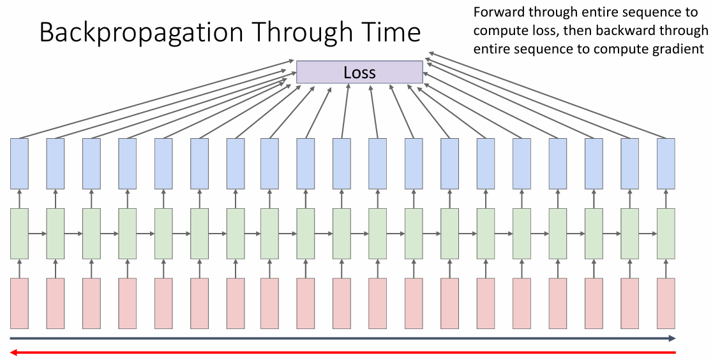{width=65%}
</figure>

但是需要注意的是，RNN 的输入序列很可能非常长（例如一段文本就可以轻易达到成千上万字符），这样展开的 RNN 就会变得非常深，导致梯度消失或梯度爆炸。为了解决这个问题，我们可以使用 Truncated BPTT，即只展开一小段时间，然后进行反向传播。

<figure markdown="span">
    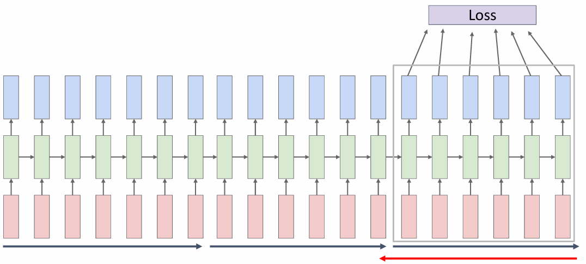{width=65%}
</figure>

如上图所示，我们每隔一段时间就截断一次，对损失进行汇总并反向传播、更新参数，然后再继续下一段时间的计算。

!!! exmaple "Image Captioning"
    <figure markdown="span">
        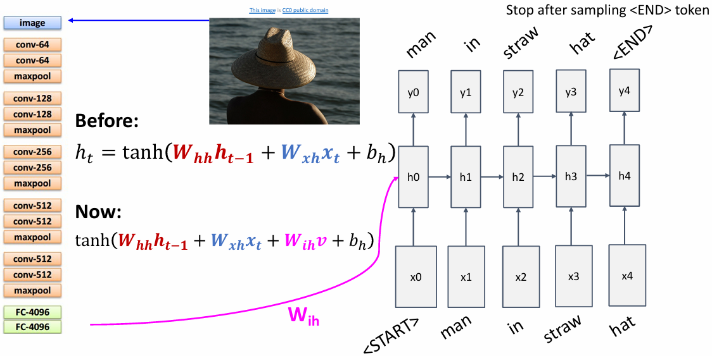{width=65%}
    </figure>

    首先使用已经训练好的 CNN 从图像中提取特征图，然后对这个特征图使用 RNN 生成描述图片的句子

## Long Short-Term Memory (LSTM)

### Vanilla RNN Gradient Flow

<figure markdown="span">
    {width=75%}
</figure>

上面的循环方程可以写为

$$ \begin{aligned}
h_t &= \tanh(W_{hh}h_{t-1} + W_{xh}x_t + b_h) \\\\
    &= \tanh \left(( W_{hh} \quad W_{xh} ) \begin{pmatrix} h_{t-1} \\ x_t \end{pmatrix} + b_h \right) \\\\
    &= \tanh \left( W \begin{pmatrix} h_{t-1} \\ x_t \end{pmatrix} + b_h \right)
\end{aligned} $$

那么我们可以注意到，在对 $h_{t}$ 进行反向传播时，每一步都会乘以一次 $W_{hh}$，当我们经过很多层传播时

- 如果 $W_{hh}$ 比较大（最大的奇异值大于 1），那么 $h_{t}$ 的值会不断趋近于无穷，导致梯度爆炸（Exploding gradients）
- 如果 $W_{hh}$ 比较小（最大的奇异值小于 1），那么 $h_{t}$ 的值会不断趋近于 0，导致梯度消失（Vanishing gradients）

对于梯度爆炸问题，我们可以使用梯度裁剪（Gradient Clipping）来解决，即当梯度的范数超过一个阈值时，对梯度进行缩放。

```python
grad_norm = np.sum(grad * grad)
if grad_norm > threshold:
    grad *= (threshold / grad_norm)
```

而对于梯度消失问题，我们可以使用 LSTM 来解决。

### LSTM

LSTM 通过引入一个创新的门控机制，能够更好地控制信息的流动，避免梯度消失和梯度爆炸问题。

<figure markdown="span">
    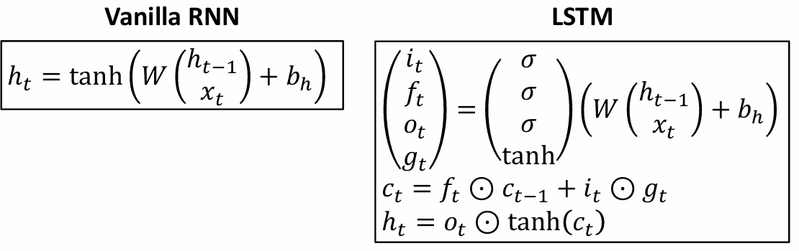{width=75%}
</figure>

LSTM 的关键创新之一是引入了记忆单元（cell state）。记忆单元是网络的一条主要信息通道，它能够沿着整个序列传递信息，并且允许网络对长期依赖进行学习。

- 记忆单元可以存储从前面时间步传播来的信息。每次通过时间步，LSTM 会选择性地更新或保留记忆单元的值，而不必将所有信息都丢失或改变。

!!! note
    - $i_t$：输入门（input gate），whether to write to cell
    - $f_t$：遗忘门（forget gate），whether to erase cell
    - $o_t$：输出门（output gate），how much to reveal cell
    - $g_t$：新的候选值（new candidate value）或者也被称为 "Gate gate(?)", how much to write to cell

<figure markdown="span">
    {width=65%}
</figure>

例如我们的参数矩阵 $W$ 大小为 $4h \times 2h$，让它与 $[h_{t-1}, x_t]$ 相乘，得到一个 $4h$ 维的向量，然后将这个向量分别应用 sigmoid 和 tanh 函数，得到 $i_t, f_t, o_t, g_t$，然后再按照公式逐元素计算出 $c_t$ 和 $h_t$。

$$ \begin{aligned}
c_t &= f_t \odot c_{t-1} + i_t \odot g_t \\
h_t &= o_t \odot \tanh(c_t)
\end{aligned} $$

<figure markdown="span">
    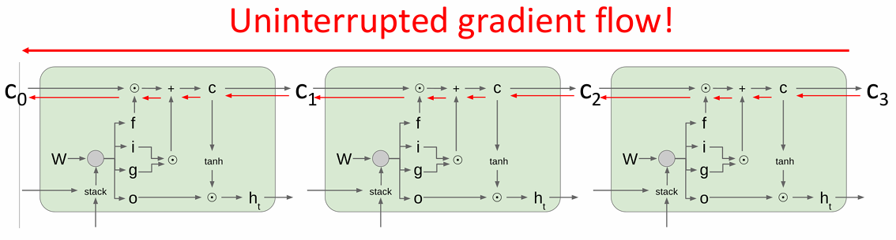{width=75%}
</figure>

通过引入了记忆单元（cell state）和门控机制，LSTM 的梯度可以有效地传播，而不会像传统 RNN 那样遭遇梯度消失的问题 —— 记忆单元通过在时间步之间直接传递信息，使得 梯度可以直接传递到远离当前时刻的时间步。

> 某种程度上和 ResNet 中的残差连接有些类似，都是通过直接传递信息来解决梯度消失的问题。

## Others

### Multilayer RNN

<figure markdown="span">
    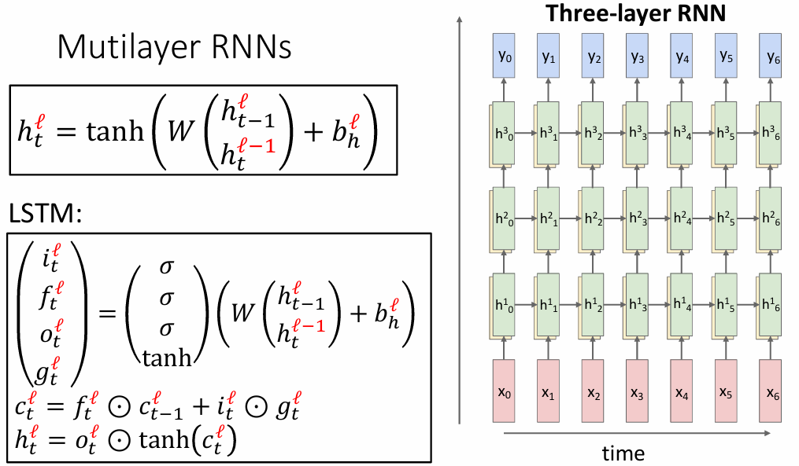{width=55%}
</figure>

我们还可以把单层的 RNN 拓展为多层 RNN —— 每一层的隐藏状态都会作为下一层的输入，并且每一层都有自己的权重矩阵。

### Gated Recurrent Unit (GRU)

GRU 是另一种类似于 LSTM 的门控循环单元，它只有两个门：更新门（update gate）和重置门（reset gate）。

<figure markdown="span">
    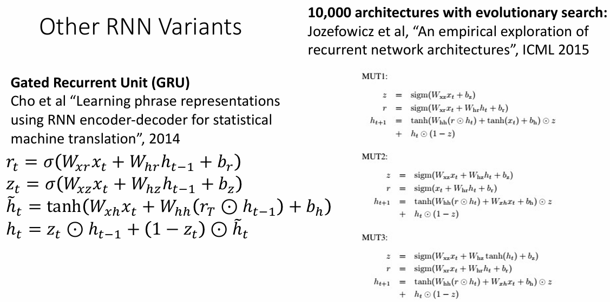{width=65%}
</figure>

!!! summary
    - RNNs allow a lot of flexibility in architecture design
    - Vanilla RNNs are simple but don’t work very well
    - Common to use LSTM or GRU: additive interactions improve gradient flow
    - Backward flow of gradients in RNN can explode or vanish.
        - Exploding is controlled with gradient clipping.--
        - Vanishing is controlled with additive interactions (LSTM)
    - Better/simpler architectures are a hot topic of current research
    - Better understanding (both theoretical and empirical) is needed.


