# Generative Models Ⅰ

## Basic Concepts

### Supervised vs Unsupervised Learning

#### Supervised Learning

**监督学习（Supervised Learning）**是指在训练模型时使用带标签的数据集。模型通过学习输入数据与对应的输出标签之间的关系来进行预测。

- data：（x, y），x 是输入数据，y 是标签
- goal：学习一个映射函数 f，使得 f(x) -> y
- examples：分类、回归、目标检测、语义分割、图像描述（image captioning）等

??? example
    <figure markdown="span">
        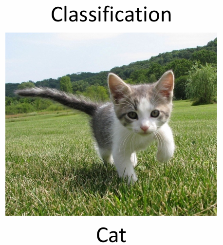{ align=left width=35% }
        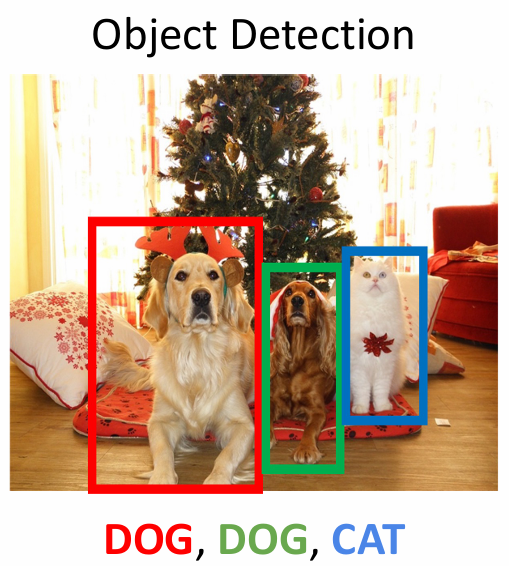{ align=right width=35% }
    </figure>

    <figure markdown="span">
        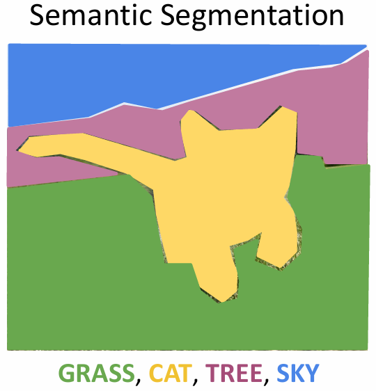{ align=left width=35% }
        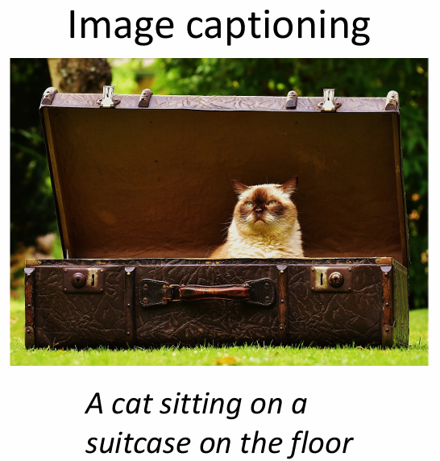{ align=right width=35% }
    </figure>

监督学习的局限在与训练所需的数据需要人工进行标注，这限制了模型的训练规模和多样性。

#### Unsupervised Learning

**无监督学习（Unsupervised Learning）**是指在训练模型时使用不带标签的数据集。模型通过学习输入数据的概率分布和隐藏的结构来进行预测。

- data：x，只有数据，没有标签
- goal：学习数据背后隐藏的结构和分布
- examples：聚类、降维、特征学习、密度估计、生成模型等

??? example
    <figure markdown="span">
        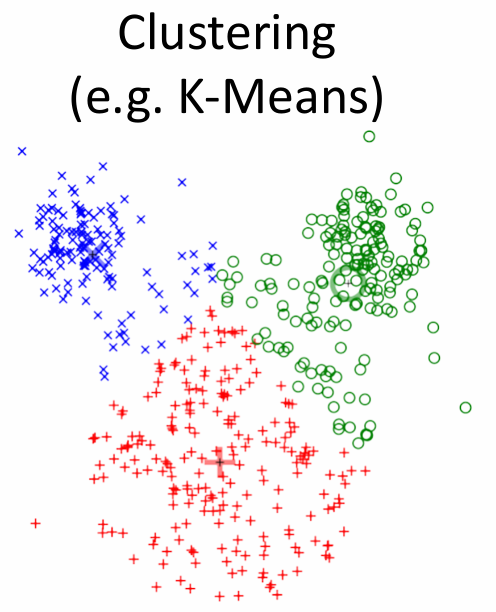{ align=left width=30% }
        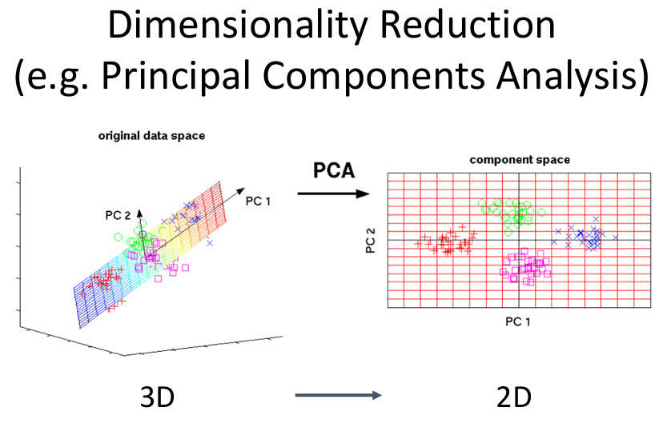{ align=right width=45% }
    </figure>

    <figure markdown="span">
        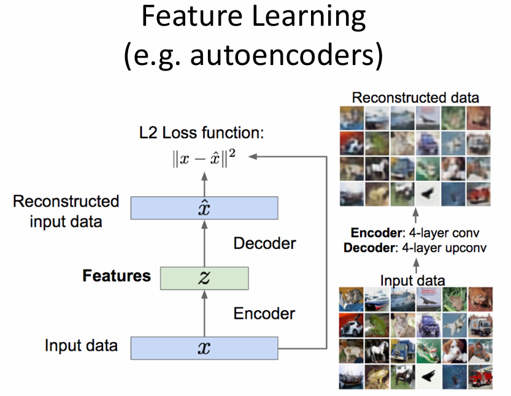{ align=left width=35% }
        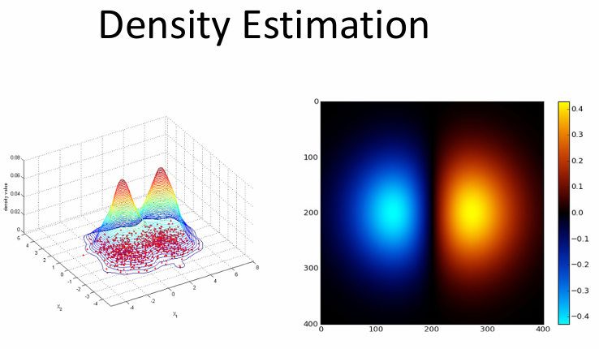{ align=right width=35% }
    </figure>

### Discriminative vs Generative Models

- **判别模型（Discriminative Model）**：直接建模条件概率 $P(y|x)$，即给定输入 x，预测输出 y。判别模型关注的是输入和输出之间的边界。常见的判别模型有逻辑回归、支持向量机（SVM）、神经网络等。
- **生成模型（Generative Model）**：学习在数据 x 上的概率分布 $P(x)$，生成模型关注的是数据的生成过程。常见的生成模型有高斯混合模型（GMM）、隐马尔可夫模型（HMM）、变分自编码器（VAE）、生成对抗网络（GAN）等。
- **条件生成模型（Conditional Generative Model）**：学习条件概率 $P(x|y)$，即在给定标签 y 的情况下，预测输入 x 的分布。条件生成模型可以用于图像生成、文本生成等任务。常见的条件生成模型有条件变分自编码器（CVAE）、条件生成对抗网络（CGAN）等。

#### Discriminative Model

在判别模型中，模型会根据给定的数据（图像）来生成各个标签的概率分布。

- 判别模型会对每一个图像单独进行一次预测，不同图像之间互不影响
- 如果判别模型接收到了一个与给定的标签集都不匹配的图像，模型仍会给出一个概率分布，但这个概率分布并没有实际意义。

<figure markdown="span">
    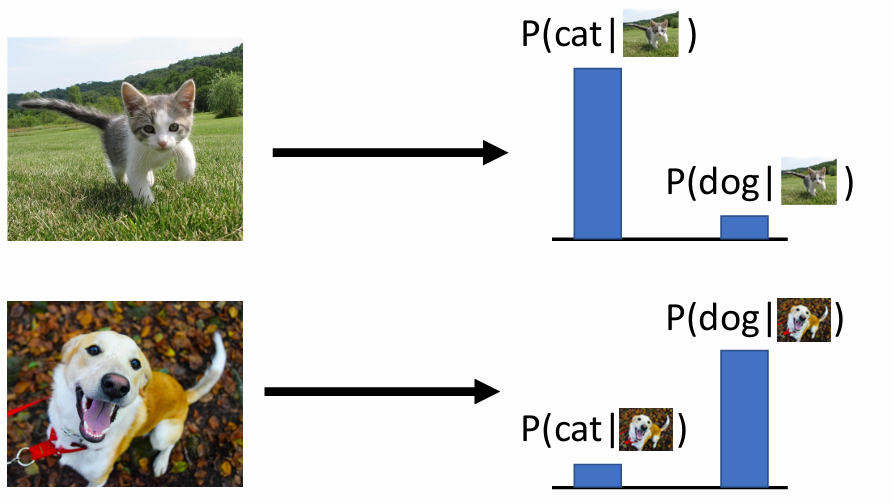{ width=50% }
</figure>

<figure markdown="span">
    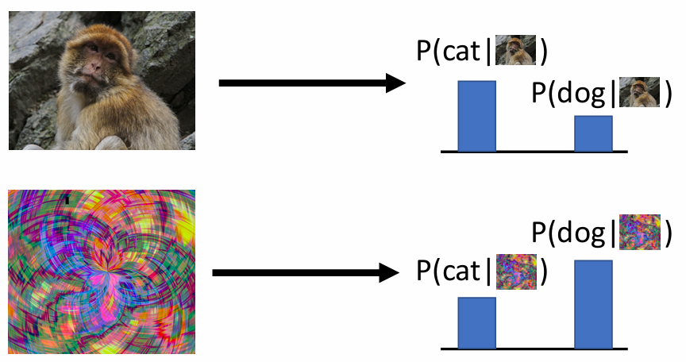{ width=50% }
</figure>

比如在上面的例子中，即使我们给出了猴子的照片和一个抽象的随机图片，模型仍然会对这些图像在所有标签上给出一个概率分布。

#### Generative Model

在生成模型中，模型会对所有接收到的图像进行概率分布的计算，所有可能的图像之间会在概率质量上相互竞争（所有图片的概率质量之和为1）。

<figure markdown="span">
    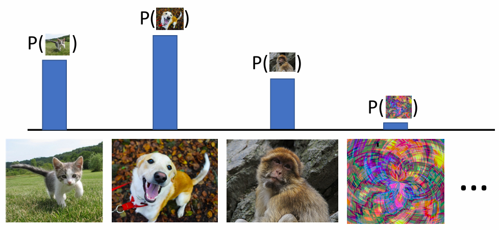{ width=70% }
</figure>

- 为了完成这一任务，生成模型需要深刻理解图像（数据）内在的结构和规律，例如狗相较于猫更有可能出现在户外，因此狗的概率质量会更高。
- 生成模型的另一特点是它能够拒绝（reject）不合理的输入，例如对他会给上面这个抽象图像分配一个很小的概率质量。

#### Conditional Generative Model

条件生成模型可以看作是生成模型的一个变种，它在对每一个图像进行概率分布计算时，会考虑到给定的标签：它在这个标签的条件下，计算图像的条件概率分布。

<figure markdown="span">
    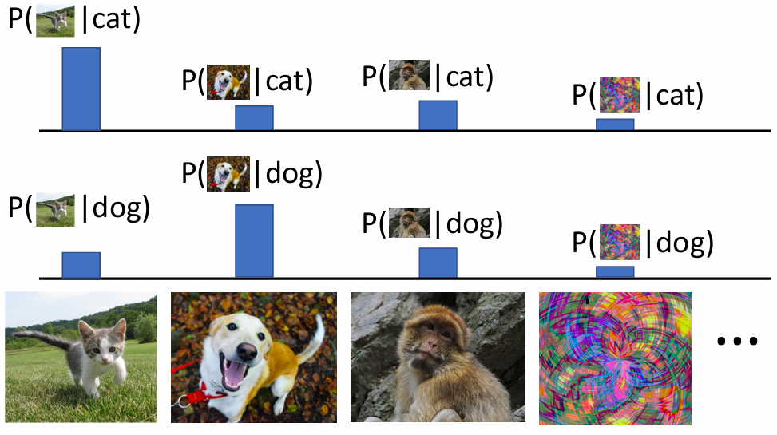{ width=65% }
</figure>

条件生成模型和生成模型一样，都能对“不合理”的输入进行拒绝（reject），并且还能在给定标签的条件下，计算图像的条件概率分布，这意味着它也可以训练为一个分类器

!!! note
    回顾一下概率论的知识，我们知道条件概率的贝叶斯公式为：

    $$ P(x|y) = \dfrac{P(y|x)}{P(y)} P(x) $$

    而 $P(y|x)$ 是判别模型的输出，$P(x)$ 是生成模型的输出，$P(y)$ 我们在训练时给定的标签的先验概率。这代表当我们已经拥有

    <figure markdown="span">
        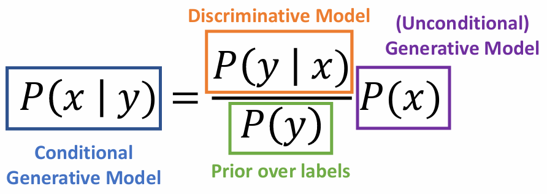{ width=50% }
    </figure>

!!! summary "What can we do with these models?"
    - Discriminative Model: 
        - 将标签和数据进行匹配，训练为一个特征提取器，feature learning（with labels）
    - Generative Model: 
        - 检测异常值，feature learning（without labels），从学习到的数据中提取特征、采样、生成新的数据
    - Conditional Generative Model: 
        - 在拒绝异常值的同时将标签和数据进行匹配，在给定标签的条件下生成新的数据

## Generative Models

<figure markdown="span">
    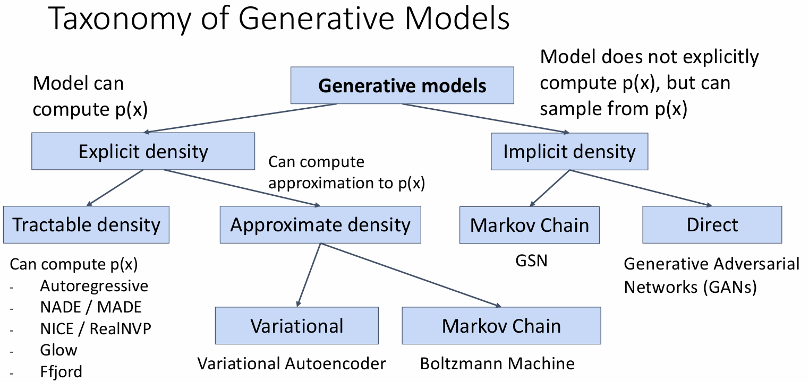{ width=80% }
</figure>

- explicit density：可以对数据的概率分布进行建模，计算 $P(x)$
    - tractable density：可以直接计算 $P(x)$
    - approximate density：可以近似计算 $P(x)$
        - Variational：通过变分推断近似计算 $P(x)$
        - Markov Chain：通过马尔可夫链近似计算 $P(x)$
- implicit density：不能直接显式地建模计算 $P(x)$，只能对 $P(x)$ 进行采样
    - Markov Chain：通过马尔可夫链采样 $P(x)$，例如 GSN
    - Direct：直接采样 $P(x)$，例如 GAN

### Autoregressive Models

Autoregressive Models（自回归模型）是一类生成模型，它通过将数据分解为条件概率的乘积来建模数据的生成过程。自回归模型的基本思想是：给定前面的数据，预测下一个数据点。

自回归模型具有显式的概率密度函数，例如我们可以写成 $p(x) = f(x, W)$。

给定一个数据集 $x^{(1)}, x^{(2)}, \ldots, x^{(N)}$，我们的目标是最大化训练数据的概率（最大似然估计）

$$ \begin{aligned}
W^* &= \arg\max_W \prod_{i} p(x^{(i)}) \\
&= \arg\max_W \sum_{i} \log p(x^{(i)}) \\
&= \arg\max_W \sum_{i} \log f(x^{(i)}, W) \\
\end{aligned} $$

最后一行的式子就是我们的损失函数，我们可以使用梯度下降法来优化这个损失函数。

那么现在我们要做的就是把这个概率分布建模出来，用一个明确的数学表达式来表示它。

假设数据集 $x$ 由多个部分组成，$x = (x_1, x_2, \ldots, x_T)$，我们可以将数据集的概率分布表示为条件概率的乘积：

$$ \begin{aligned}
p(x) &= p(x_1, x_2, \ldots, x_T) \\
&= p(x_1) p(x_2|x_1) p(x_3|x_1, x_2) \ldots p(x_T|x_1, x_2, \ldots, x_{T-1}) \\
&= \prod_{t=1}^{T} p(x_t|x_1, x_2, \ldots, x_{t-1}) \\
\end{aligned} $$

也就是说，后续的每一个数据点的概率分布都依赖于前面的数据点。我们注意到这和循环神经网络（RNN）的结构非常相似——每一个数据点的生成都依赖于前面的数据点。

#### PixelRNN

PixelRNN 是一种自回归模型，它通过将图像分解为像素的条件概率来建模图像的生成过程。PixelRNN 可以概括为：给定前面的像素，预测下一个像素。

- 从图像的左上角开始，每次一步生成一个像素
- 每一个像素的隐藏状态都依赖于它左侧和上方像素的隐藏状态以及 RGB 通道的值（LSTM recurrent）

    $$ h_{x,y} = f(h_{x-1,y}, h_{x,y-1}, W) $$

- 每一个像素的输出都是在 RGB 通道上以 [0, 255] 为范围的一个值，每个值的概率分布通过 softmax 函数进行归一化得到
- 每一个像素都隐式地依赖于在它上方和左侧的所有像素的值

<figure markdown="span">
    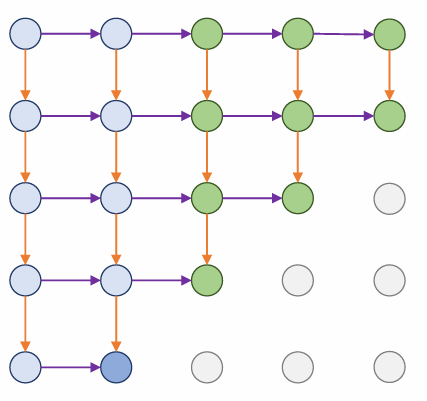{align=left width=40%}
    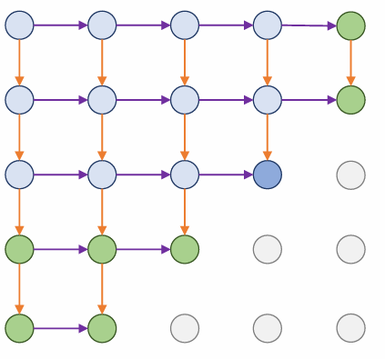{align=right width=40%}
</figure>

PixelRNN 的问题在于它在训练和测试时都需要逐个像素地生成图像，这使得它的速度非常慢。例如要生成一个 NxN 的图像，PixelRNN 需要进行 2N-1 次的计算。

#### PixelCNN

PixelCNN 和 PixelRNN 类似，也是一个自回归模型，它也从图像的角落开始生成像素。PixelCNN 的不同之处在于它使用了卷积神经网络（CNN）来建模像素之间的依赖关系，而不是使用循环神经网络（RNN）。

在每一次采样时，它依赖的不是上方和左侧的像素，而是感受野范围内已经生成的像素。由于在训练时它可以并行地对训练图像上的所有像素进行采样，因此它的训练速度速度比 PixelRNN 快得多；但是在测试时，它仍然需要逐个像素地生成图像，因此它的测试速度仍然很慢。

<figure markdown="span">
    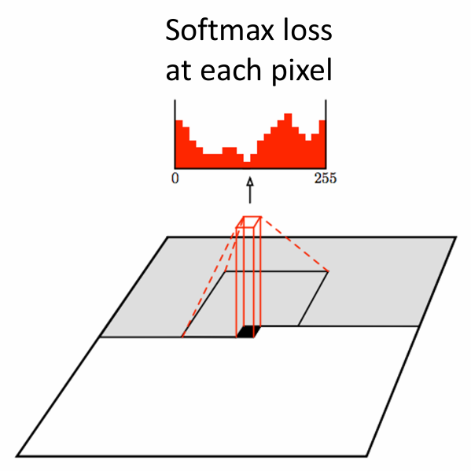{width=60%}
</figure>

!!! note "PixelRNN and PixelCNN"
    优点：
    - 可以显式地计算似然函数 $P(x)$
    - 训练数据的似然函数可以通过最大似然估计来优化
    - 具有良好的采样质量

    缺点：
    - 必须逐个像素地生成图像，速度慢

### Variational Autoencoder (VAE)

PixelRNN 和 PixelCNN 具有显式的密度函数 $P(x)$，从而允许我们通过训练来最大化训练数据上的似然函数。
$$ p_W(x) = \prod_{t=1}^T p_W(x_t|x_1, \ldots, x_{t-1}) $$

变分自编码器（Variational Autoencoder，VAE）与之不同的是它定义了一个隐式的、我们无法直接计算或优化的密度函数（intractable density）。虽然我们不能通过计算来优化这个密度函数，但是我们可以直接地对这个密度函数的**下界**（lower bound）进行优化，从而间接达到优化的目的。

为了明晰 Variational Autoencoder 的思想，我们需要对这两个单词进行分解，并逐一理解它们的含义。

#### Autoencoder

(Regular, non-variational) Autoencoders 是一种无监督的学习方法，它将从没有标签的原始数据中学习到数据的特征向量（或者也可以称为隐含表示，latent representation）。

Autoencoders 所提取到的特征应当是对我们下游工作（例如分类、回归等）有帮助的。而由于这是一个无监督学习过程，并且模型所学习到的特征通常是无法被我们人类直接理解的，因此我们需要一个方法来评估模型所学习到的特征是否有用。

常用的方法是在 encoder 提取出特征之后，使用一个 decoder 来尝试把这个特征向量重构成原始数据。"Autoencoder" 这个名字就是由此而来：先将输入数据编码成一个特征向量，然后再解码成原始数据。

<figure markdown="span">
    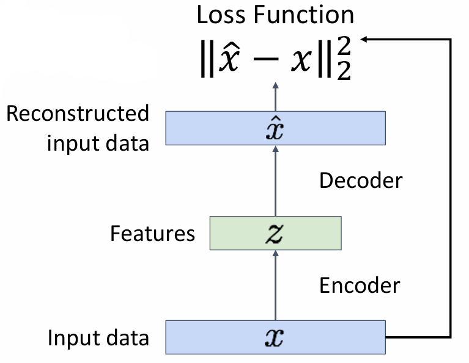{width=60%}
</figure>

我们并不希望模型学习到一个恒等映射（identity mapping）——因为恒等映射对于下游的任务并没有任何帮助。于是我们需要让特征的维度比输入数据的维度更小，这样才能迫使模型学会输入数据中去掉一些不必要的信息，总结、提炼出有效信息。

??? example "Autoencoder"
    <figure markdown="span">
        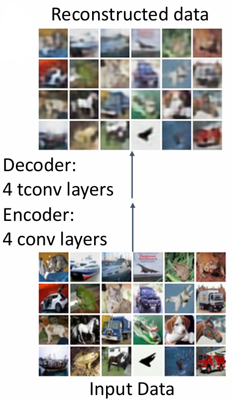{width=50%}
    </figure>

在完成训练之后，我们就要把 decoder 部分丢掉，只保留 encoder 部分。我们可以把 encoder 部分看作是一个特征提取器，它将输入数据编码成一个特征向量，也就是说我们也可以用 encoder 部分来作为分类等任务的特征提取器。

<figure markdown="span">
    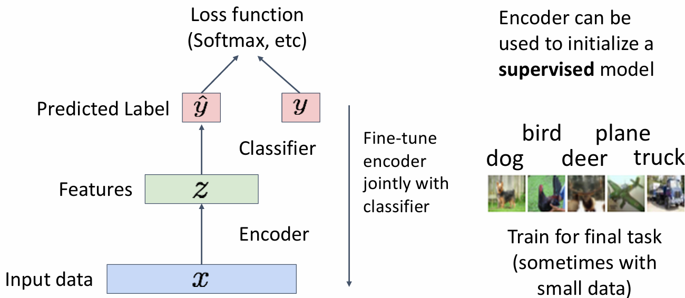{width=70%}
</figure>

!!! tip
    - autoencoder 可以从不带有标签的数据中学习到潜在的特征，并且可以用这些特征来初始化一个有监督的模型
    - autoencoder 的缺点在于不能从一个已经学习好的模型中采样生成新的数据。

#### Variational Autoencoder

假设训练数据 $\{ x^{(i)} \}_{i=1}^N$ 是从一个潜在的特征表示 $z$ 中生成得到的，并且特征 $z$ 是从一个先验分布 $p_{\theta^*}(z)$ 中采样得到的，于是我们可以将训练数据的生成过程表示为：
$$ p_{\theta^*}(x) = \int p_{\theta^*}(x|z^{(i)}) p_{\theta^*}(z^{(i)}) dz $$

为了简便起见，我们通常会假设 $p_{\theta^*}(z)$ 是一个简单的正态分布（高斯分布），并且不同的 $z$ 之间是独立的（协方差矩阵是对角矩阵）。

<figure markdown="span">
    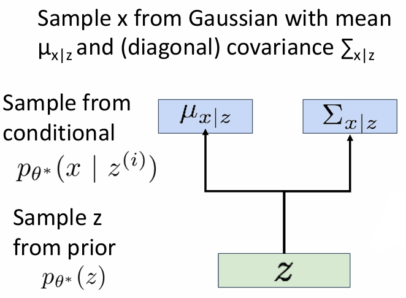{width=50%}
</figure>

我们想要做的是最大化训练数据的似然函数，但是由于我们无法观察到 $z$，因此我们无法直接计算 $p_{\theta^*}(x)$，我们可以考虑进行 marginalization。

!!! info "Marginalization"
    Marginalization 是指对一个变量进行积分或求和，以消除该变量的影响。

$$ p_{\theta}(x) = \int p_{\theta}(x，z)dz = \int p_{\theta}(x|z) p_{\theta}(z) dz $$

这里我们对 $z$ 进行积分，得到 $p_{\theta}(x)$。

- $p_{\theta}(z)$ 是我们假设的高斯先验分布，并不难计算
- 困难之处在于我们需要对 $z$ 进行积分，而 $z$ 是一个高维的变量，并没有什么计算高效的办法来计算这个积分。

#### Variational Lower Bound

上面的方法行不通，我们就需要换一个思路：
$$ p_{\theta}(x) = \dfrac{p_{\theta}(x|z) p_{\theta}(z)}{p_{\theta}(z|x)} $$

- $p_{\theta}(x|z)$ 可以通过我们之前的 decoder 计算得到
- $p_{\theta}(z)$ 是我们假设的高斯先验分布

这里的问题在于我们没有任何方法来直接计算 $p_{\theta}(z|x)$，于是我们可以考虑使用一个近似的分布 $q_{\phi}(z|x)$ 来代替 $p_{\theta}(z|x)$

$q_{\phi}(z|x)$ 可以通过训练另一个神经网络来计算得到，这个神经网络所做的是接受输入 $x$，并且输出特征 $z$ 的分布，于是我们可以知道这个网络就是一个 encoder。

<figure markdown="span">
    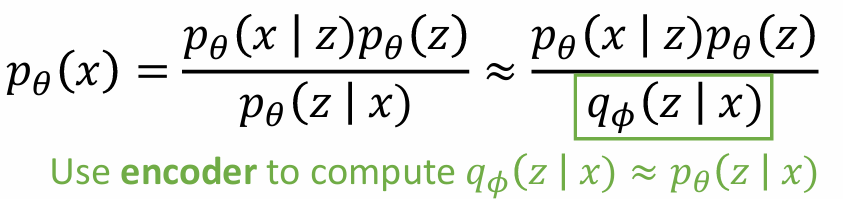{width=60%}
</figure>

最后，我们只需要同时训练 encoder 和 decoder 这两个网络，只要我们能保证 $q_{\phi}(z|x) \approx p_{\theta}(z|x)$，那么我们就能近似地求出 $p_{\theta}(x)$，其中 $p_{\theta}(x) \approx \dfrac{p_{\theta}(x|z) p_{\theta}(z)}{q_{\theta}(z|x)} $。

现在我们需要一些数学上的小技巧：

$$ \begin{aligned}
\log p_{\theta}(x) &= \log \dfrac{p_{\theta}(x|z) p(z)}{p_{\theta}(z|x)}  = \log \dfrac{p_{\theta}(x|z) p(z) q_{\phi}(z|x)}{p_{\theta}(z|x) q_{\phi}(z|x)} \\\\
&= \log p_{\theta}(x|z) - \dfrac{\log q_{\phi}(z|x)}{p(z)} + \log \dfrac{q_{\phi}(z|x)}{p_{\theta}(z|x)} 
\end{aligned} $$

因为 $\log p_{\theta}(x)$ 的结果并不依赖于 $z$，所以我们可以把它用数学期望“wrap”起来：
$$ \log p_{\theta}(x) = E_{z \sim q_{\phi}(z|x)} [ \log p_{\theta}(x|z) ] $$
于是上面的式子就变成了

$$ \begin{aligned}
\log p_{\theta}(x) &= \log \dfrac{p_{\theta}(x|z) p(z)}{p_{\theta}(z|x)}  = \log \dfrac{p_{\theta}(x|z) p(z) q_{\phi}(z|x)}{p_{\theta}(z|x) q_{\phi}(z|x)} \\\\
&= E_z [ \log p_{\theta}(x|z) ] - E_z \left[ \dfrac{\log q_{\phi}(z|x)}{p(z)} \right] + E_z \left[\log \dfrac{q_{\phi}(z|x)}{p_{\theta}(z|x)} \right] \\\\
&= E_{z \sim q_{\phi}(z|x)} [ \log p_{\theta}(x|z) ] - D_{KL} \left( q_{\phi}(z|x), p(z) \right) + D_{KL} \left( q_{\phi}(z|x), p_{\theta}(z|x) \right)
\end{aligned} $$

其中最后一行的 $D_{KL}$ 是 Kullback-Leibler Divergence（KL 散度），它是用来衡量两个概率分布之间的差异的。
- $D_{KL} \left( q_{\phi}(z|x), p(z) \right)$ 是先验概率与从 encoder 采样得到的概率之间的差异
- $D_{KL} \left( q_{\phi}(z|x), p_{\theta}(z|x) \right)$ 是encoder 采样得到的概率与 decoder 的后验概率之间的差异

由于 KL 散度是非负的，因此我们在去掉最后一项之后可以得到一个下界（lower bound）
$$ \log p_{\theta}(x) \geqslant E_{z \sim q_{\phi}(z|x)} [ \log p_{\theta}(x|z) ] - D_{KL} \left( q_{\phi}(z|x), p(z) \right) $$

<figure markdown="span">
    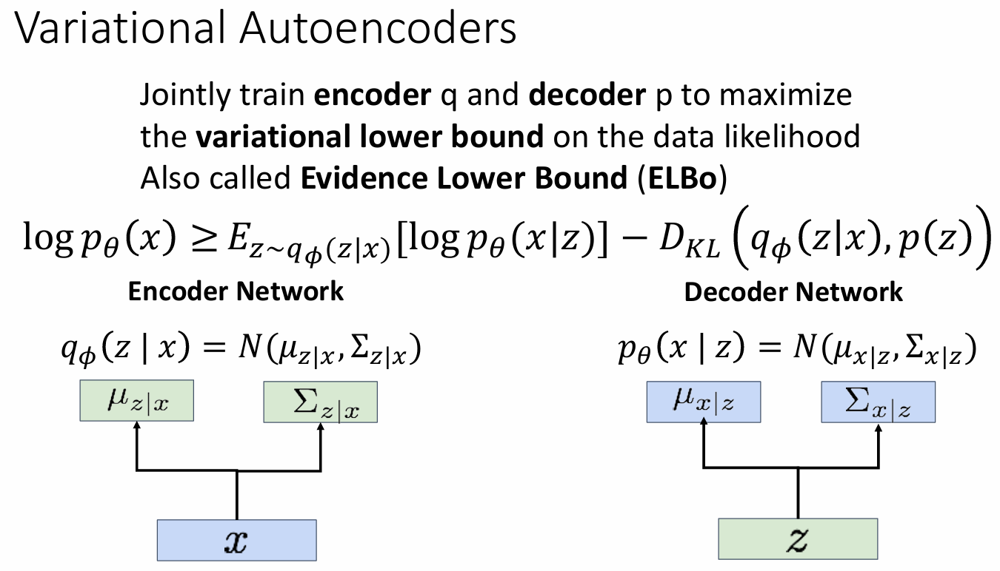{width=70%}
</figure>

??? example
    <figure markdown="span">
        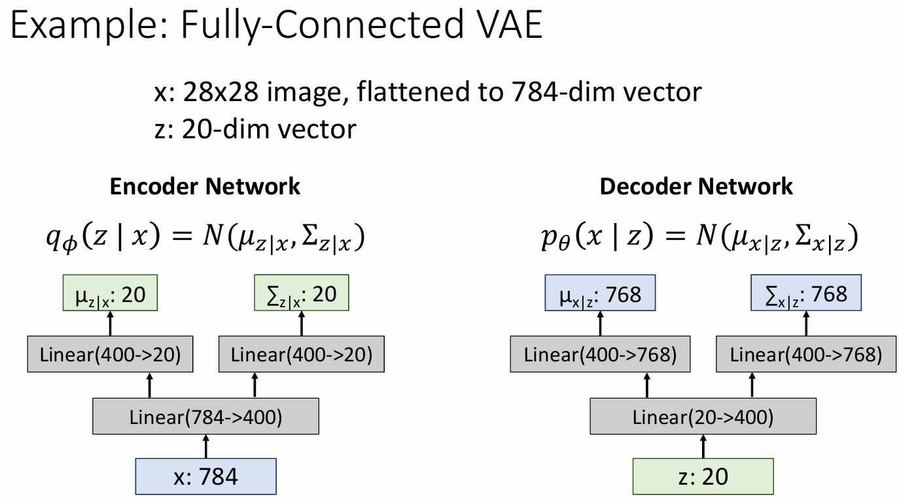{width=70%}
    </figure>

#### Train VAE

现在我们就已经得到了 Variantional Autoencoder 的训练目标函数——最大化下界（maximize the lower bound）
$ \log p_{\theta}(x) \geqslant E_{z \sim q_{\phi}(z|x)} [ \log p_{\theta}(x|z) ] - D_{KL} \left( q_{\phi}(z|x), p(z) \right) $

<figure markdown="span">
    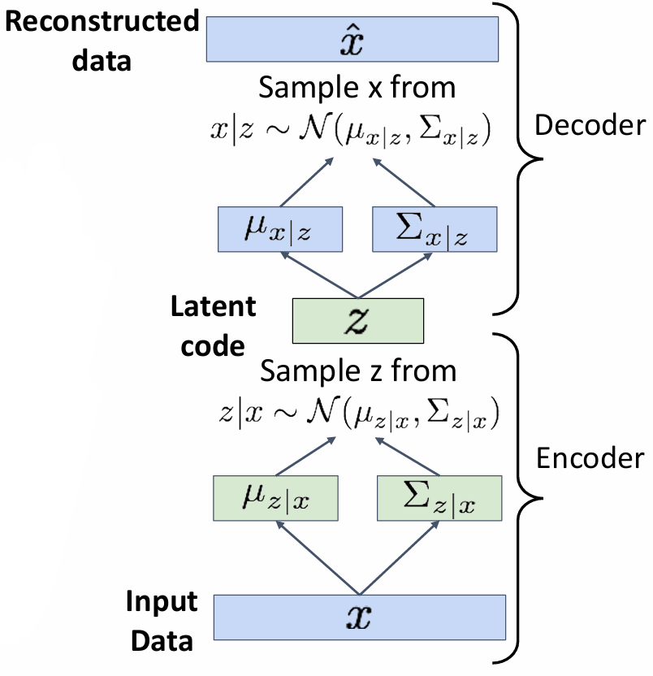{width=45%}
</figure>

1. Run input data through **encoder** to get a distribution over latent codes

    比如从一个小批量的输入数据 $x$ 中采样得到 $\mu_{z|x}$ 和 $\sigma_{z|x}$，然后根据我们的假设可以得到 $z$ 的分布 $z|x \sim \mathcal{N}(\mu_{z|x}, \sigma_{z|x})$。

2. Encode output should match the prior $p(z)$!

    由于我们已经假设了 $z$ 的分布是一个简单的正态分布，因此我们可以通过 KL 散度来衡量 encoder 的输出与先验分布之间的差异。
    
    $$ \begin{aligned}
    -D_{KL} \big( q_{\phi}(z|x), p(z) \big) &= \int_z q_{\phi}(z|x) \log \dfrac{p(z)}{q_{\phi}(z|x)} dz \\
    &= \int_z N(z; \mu_{z|x}, \sigma_{z|x}) \log \dfrac{N(z; 0, 1)}{N(z; \mu_{z|x}, \sigma_{z|x})} dz \\
    &= \dfrac{1}{2} \sum_{j=1}^J \Big( 1+ \log \big((\sigma_{z|x})_j^2 \big) - (\mu_{z|x})_j^2 - (\sigma_{z|x})_j^2 \Big) \\
    \end{aligned}$$

    当 $q_{\phi}$ 是对角线高斯分布，$p$ 是标准正态分布时（假设 z 的维度为 J），这是一个 closed-form solution（闭合解）。

3. Sample code z from encoder output

    从 $z|x \sim \mathcal{N}(\mu_{z|x}, \sigma_{z|x})$ 中采样得到 $z$，然后将 $z$ 传入 decoder 中

4. Run sampled code through **decoder** to get a distribution over data samples

    通过 decoder 将 $z$ 解码为 $\mu_{x|z}$ 和 $\sigma_{x|z}$，然后根据我们的假设可以得到 $x$ 的分布 $x|z \sim \mathcal{N}(\mu_{x|z}, \sigma_{x|z})$。

5. Original input data should be likely under the distribution output from (4)!

    此时我们把从第 4 步得到的 $x|z$ 的分布与输入的原始数据比较，它们应当非常相似

6. Can sample a reconstruction from (4)

    保证了第 4 步得到的分布与原始数据相似之后，我们就可以从第 4 步得到的分布中采样得到重构的图像。

#### Generating Data

在训练之后，我们可以使用 VAE 来生成新的数据

<figure markdown="span">
    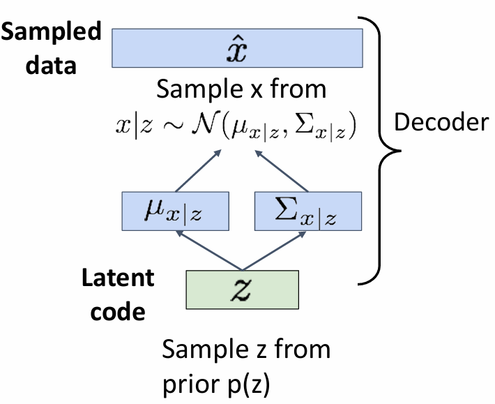{width=45%}
</figure>

1. Sample z from prior p(z)
2. Run sampled z through decoder to get distribution over data x
3. Sample from distribution in (2) to generate data

!!! example
    <figure markdown="span">
        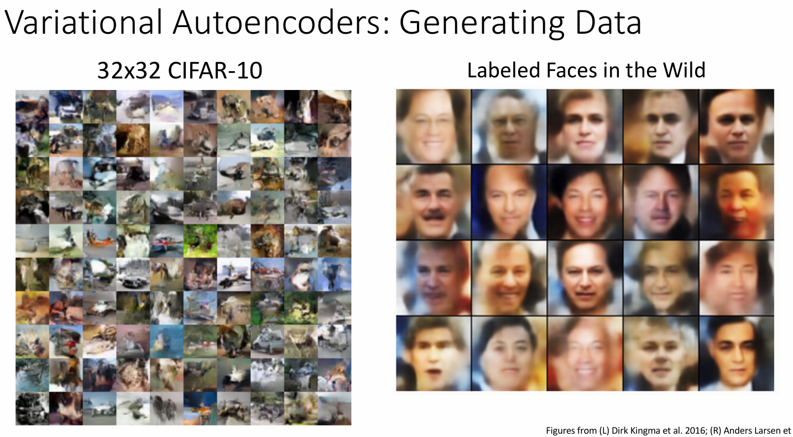{width=70%}
    </figure>

    可以看到，VAE 生成的图像在一定程度上与训练数据非常相似，并且具有一定的多样性。

#### Edit Images

<figure markdown="span">
    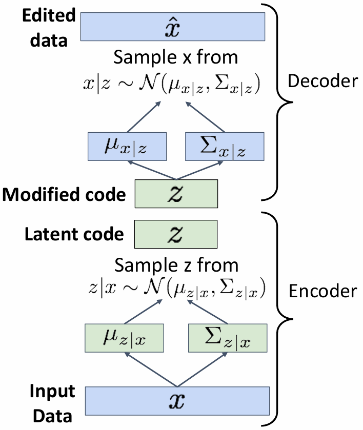{width=35%}
</figure>

我们还可以使用训练过后的 VAE 来对图像进行编辑。

1. Run input data through encoder to get a distribution over latent codes
2. Sample code z from encoder output
3. Modify some dimensions of sampled code
4. Run modified z through decoder to get a distribution over data samples
5. Sample new data from (4)

!!! example
    <figure markdown="span">
        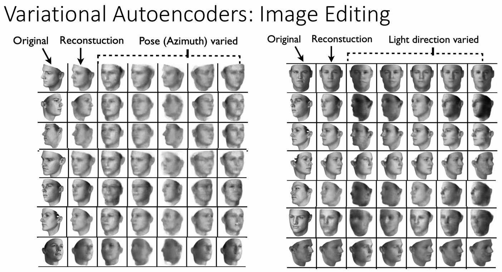{width=70%}
    </figure>

    上图中可以发现，VAE 学会了改变原有的人脸图像的角度、光照变化的，并且改变后的图像仍具有一定的真实性。

    这说明 VAE 学会了人脸图像的潜在特征，并且能够对这些特征进行编辑。

!!! summary "Variational Autoencoder"
    Probabilistic spin to traditional autoencoders => allows generating data
    
    Defines an intractable density => derive and optimize a (variational) lower bound

    优点：

    - Principled approach to generative models

        具有规律性的方法来生成模型

    - Allows inference of q(z|x), can be useful feature representation for other tasks

        允许推断 $q(z|x)$，可以用于其他任务的特征表示

    缺点：

    - Maximizes lower bound of likelihood: okay, but not as good evaluation as PixelRNN/PixelCNN

        虽然能够最大化似然函数的下界，但是图像的最终效果不如 PixelRNN/PixelCNN 的好

    - Samples blurrier and lower quality compared to state-of-the-art (GANs)

        采样效果模糊且质量较低，无法与 GANs 相比
