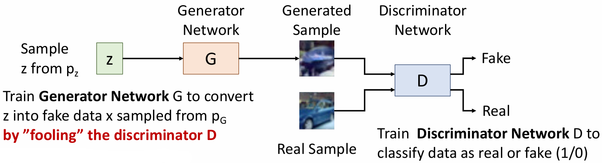
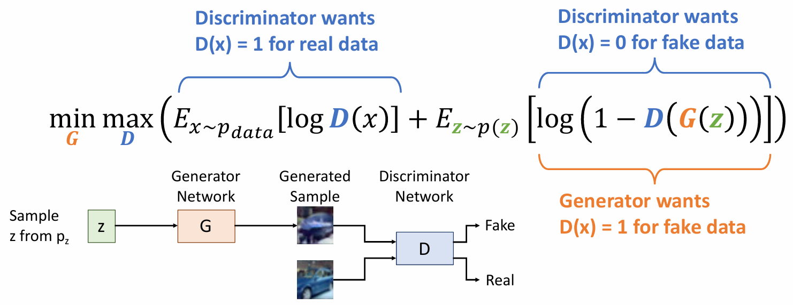
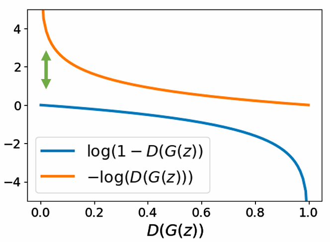

# Generative Models Ⅱ

- Autoregressive Models directly maximize likelihood of training data:

    $$ p_{\theta}(x) = \prod_{i=1}^N p_{\theta}(x_i | x_1, \ldots, x_{i-1}) $$

- Variational Autoencoders (VAEs) introduce a latent z, and maximize a lower bound:

    $$ p_{\theta}(x) = \int_z p_{\theta}(x | z) p(z) dz \geqslant E_{z \sim q_{\phi}(z | x)} \left[ \log p_{\theta}(x | z) \right] - D_{KL} \Big(q_{\phi}(z | x), p(z) \Big) $$

- Generative Adversarial Networks give up on modeling $p(x)$, but allow us to draw samples from $p(x)$

## Generative Adversarial Networks

GANs 的思路是假设我们拥有的数据 $x_i$ 来自于概率分布 $p_{data}(x)$，我们希望能推断出这个分布。

我们可以引入一个潜在变量 $z$，并假设 $z$ 来自于一个简单的先验分布 $p(z)$，比如高斯分布。接着我们从 $z \sim p(z)$ 中采样，并把它传递给一个生成器 $G$ 来生成数据 $x = G(z)$。

于是我们就得到了一个来自于生成器分布 $p_{G}$ 的采样数据 $x$，我们希望的是 $p_{G}$ 能够尽可能地接近 $p_{data}$。

<figure markdown="span">
    {width=75%}
</figure>

接下来我们要做的就是训练一个 Generator $G$，把它生成的采样数据和真实数据一起放到一个判别器网络（Discriminator Network）$D$ 中，$D$ 的任务就是判断输入的数据是来自于真实数据还是生成器生成的数据。

- $G$ 的目标是生成尽可能真实的数据 $x$，使得 $D$ 无法判断出它是生成的还是来自于真实数据。换句话说，$G$ 的目标是最大化 $D$ 的错误率。
- $D$ 的目标是尽可能准确地判断输入的数据是来自于真实数据还是生成器生成的数据。换句话说，$D$ 的目标是最大化 $D$ 的正确率。

我们会同时训练这两个网络，$G$ 和 $D$，并且它们的目标是相互冲突、对抗的这也是生成对抗网络（GAN）这个名字的由来。

### Training Objective

我们让生成器 $G$ 和判别器 $D$ 的在一个最小最大竞赛中共同训练，损失函数定义如下：

<figure markdown="span">
    {width=75%}
</figure>

简洁起见，我们可以把上面的式子写成下面的形式：
$$ \min_G \max_D V(D, G) $$
于是我们对 $D$ 和 $G$ 的更新就是
$$ D = D + \alpha_D \dfrac{\partial V}{\partial D} $$
$$ G = G - \alpha_G \dfrac{\partial V}{\partial G} $$
其中 $\alpha_D$ 和 $\alpha_G$ 是学习率。

!!! tip
    由于两者的损失函数是相互对抗的，所以我们无法通过最小化整体损失函数来训练它们，也无法通过观察损失函数的变化来判断它们的训练效果。

    因此我们只能交替训练 $G$ 和 $D$，每次训练一个网络时，另一个网络的参数保持不变。这样可以保证 $G$ 和 $D$ 的训练是相互独立的，避免了它们之间的相互影响。

在最开始时，生成器的生成效果很差，判别器很容易就能判断出输入的数据是来自于真实数据还是生成器生成的数据，因此 $D(G(z))$ 的值接近于 0。

假如我们直接寻找最小化 $\log (1-D(G(z)))$ 的梯度来更新 $G$，那么会因为开始时因为这个函数的的梯度很小而导致 $G$ 无法得到有效的训练。

于是我们可以转换思路，把训练 $G$ 的目标改为最小化 $-\log D(G(z))$，也就是最大化 $D(G(z))$。这样就可以避免训练开始时 $G$ 的梯度消失的问题。

<figure markdown="span">
    {width=55%}
</figure>

### Optimality

接下来我们要做的是证明为什么这一个优化目标可以保证生成器 $G$ 生成的数据分布 $p_G$ 和真实数据分布 $p_{data}$ 越来越接近。

我们要做的就是证明这个最小最大竞赛会在 $p_G = p_{data}$ 时达到全局最小值。

$$ \begin{aligned}
& \min_G \max_D \Big(\mathbb{E}_{x \sim p_{data}} [\log D(x)] + \mathbb{E}_{z \sim p(z)} [\log (1 - D(G(z)))] \Big) \\\\
&= \min_G \max_D \Big(\mathbb{E}_{x \sim p_{data}} [\log D(x)] + \mathbb{E}_{x \sim p_G} [\log (1 - D(x))] \Big) \\\\
&= \min_G \max_D \int_X \Big( p_{data}(x) \log D(x) + p_G(x) \log (1 - D(x)) \Big) dx \\\\
&= \min_G \int_X \max_D \Big( p_{data}(x) \log D(x) + p_G(x) \log (1 - D(x)) \Big) dx
\end{aligned} $$

上面第二个等号我们利用了数学期望的定义，第三个等号我们把积分符号移到了 max 外面。

这时候观察上面的式子中 max 里面的部分，我们可以发现如下的形式：
$$ f(y) = a \log y + b \log (1 - y) $$
$$ f'(y) = \dfrac{a}{y} - \dfrac{b}{1 - y} $$
我们很容易知道当导数等于 0 时，即 $y = \dfrac{a}{a + b}$ 时，$f(y)$ 达到局部极大值。

也就是说，Discriminator $D$ 的最优解是
$$ D^*(x) = \dfrac{p_{data}(x)}{p_{data}(x) + p_G(x)} $$
这是与 $p_{data}$ 和 $p_G$ 有关的一个函数。

现在我们把这个局部最大值带入到上面的式子里，就得到

$$ \begin{aligned}
& \min_G \max_D \Big(\mathbb{E}_{x \sim p_{data}} [\log D(x)] + \mathbb{E}_{z \sim p(z)} [\log (1 - D(G(z)))] \Big) \\\\
&= \min_G \int_X \max_D \Big( p_{data}(x) \log D^*(x) + p_G(x) \log (1 - D^*(x)) \Big) dx \\\\
&= \min_G \int_X \Big( p_{data}(x) \log \dfrac{p_{data}(x)}{p_{data}(x) + p_G(x)} + p_G(x) \log \dfrac{p_G(x)}{p_{data}(x) + p_G(x)} \Big) dx \\\\
&= \min_G \Big( \mathbb{E}_{x \sim p_{data}} \left[\log \dfrac{p_{data}(x)}{p_{data}(x) + p_G(x)} \right] + \mathbb{E}_{x \sim p_G} \left[\log \dfrac{p_G(x)}{p_{data}(x) + p_G(x)} \right]\Big)
\end{aligned} $$

接着我们还可以再给期望中的式子乘以一个常数 $\dfrac{2}{2}$，就得到

$$ \begin{aligned}
& \min_G \max_D \Big(\mathbb{E}_{x \sim p_{data}} [\log D(x)] + \mathbb{E}_{z \sim p(z)} [\log (1 - D(G(z)))] \Big) \\\\
&= \min_G  \Big( \mathbb{E}_{x \sim p_{data}} \left[\log \dfrac{p_{data}(x)}{p_{data}(x) + p_G(x)} \right] + \mathbb{E}_{x \sim p_G} \left[\log \dfrac{p_G(x)}{p_{data}(x) + p_G(x)} \right]\Big) \\\\
&= \min_G  \Big( \mathbb{E}_{x \sim p_{data}} \left[\log \dfrac{2}{2} \dfrac{p_{data}(x)}{p_{data}(x) + p_G(x)} \right] + \mathbb{E}_{x \sim p_G} \left[\log \dfrac{2}{2} \dfrac{p_G(x)}{p_{data}(x) + p_G(x)} \right]\Big) \\\\
&= \min_G  \Big( \mathbb{E}_{x \sim p_{data}} \left[\log \dfrac{2 \cdot p_{data}(x)}{p_{data}(x) + p_G(x)} \right] + \mathbb{E}_{x \sim p_G} \left[\log \dfrac{2 \cdot p_G(x)}{p_{data}(x) + p_G(x)} \right] - \log 4 \Big)
\end{aligned} $$

!!! note "一些概率论知识"
    - Kullback-Leibler Divergence (KL Divergence) 是用来衡量两个概率分布之间的差异的一个指标。它的定义如下：
    $$ KL(p,q) = \mathbb{E}_{x \sim p} \left[ \log \dfrac{p(x)}{q(x)} \right] $$

    - Jensen-Shannon Divergence (JS Divergence) 是 KL Divergence 的一个对称版本，它的定义如下：
    $$ JSD(p,q) = \dfrac{1}{2} KL(p, \dfrac{p + q}{2}) + \dfrac{1}{2} KL(q, \dfrac{p + q}{2}) $$

把 KL Divergence 和 JS Divergence 的定义带入上面的式子中，我们就可以得到

$$ \begin{aligned}
& \min_G \max_D \Big(\mathbb{E}_{x \sim p_{data}} [\log D(x)] + \mathbb{E}_{z \sim p(z)} [\log (1 - D(G(z)))] \Big) \\\\
&= \min_G  \Big( \mathbb{E}_{x \sim p_{data}} \left[\log \dfrac{2 \cdot p_{data}(x)}{p_{data}(x) + p_G(x)} \right] + \mathbb{E}_{x \sim p_G} \left[\log \dfrac{2 \cdot p_G(x)}{p_{data}(x) + p_G(x)} \right] - \log 4 \Big) \\\\
&= \min_G  \Big( KL(p_{data}, \dfrac{p_{data} + p_G}{2}) + KL(p_G, \dfrac{p_{data} + p_G}{2}) - \log 4 \Big) \\\\
&= \min_G  \Big(2 \cdot  JSD(p_{data}, p_G) - \log 4 \Big)
\end{aligned} $$

由于 JS Divergence 是非负的，并且当且仅当它的两个输入分布相等时才为 0，因此我们可以知道当 $p_{data} = p_G$ 时，$V(D, G)$ 达到全局最小值，QED

!!! Summary
    The global minimum of the minimax game happens when:

    - $D_G^*(x) = \dfrac{p_{data}(x)}{p_{data}(x) + p_G(x)} $

        - Optimal discriminator for any $G$

    - $p_G(x) = p_{data}(x)$

        - Optimal generator for optimal $D$

!!! warning "caveats"
    - $G$ 和 $D$ 都是具有固定架构的神经网络，我们无法确定它们是否能真正地表示最优的 $G$ 和 $D$。
    - 上面的证明并没有告诉我们这个优化方法是否收敛

