# Visualizing Models and Generating Images

## Visualizing Models

我们常常会好奇模型，尤其是深度学习模型，究竟是如何工作的。我们希望知道的是神经网络的各层正在寻找的特征是什么，希望知道经过良好训练后的模型会将图像如何处理，此时我们就可以通过把图像的输出可视化来更深入地了解模型的工作。

例如我们先前学到的 AlexNet、ResNet 等模型，它们在第一层中通常会倾向于寻找边缘和纹理等较为简单的特征。

<figure markdown="span">
    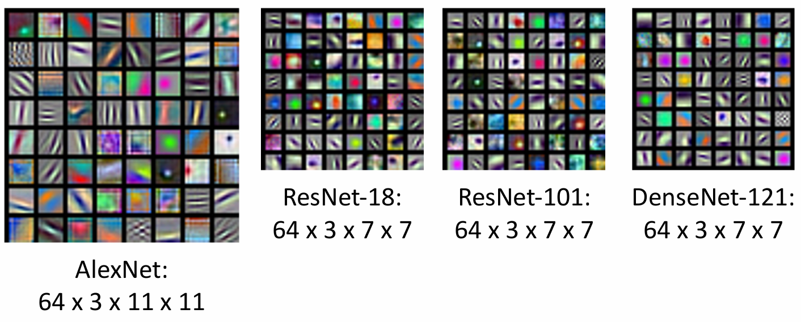{width=75%}
</figure>

而对于更高层的特征，虽然我们知道模型会倾向于学习更复杂的特征，但我们并不知道它们究竟是什么。并且由于更高层图像的通道数取决于前一个卷积层的 filter 数量，因此我们也更难以通过将图像可视化来了解它们。

!!! example
    <figure markdown="span">
        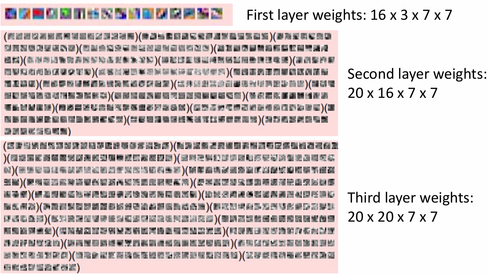{width=75%}
    </figure>

一般而言，在最后一层，模型会把接收到的图像最终转变为一个高维向量，例如 AlexNet 的最后一层会把输入图像变为一个 4096 维的向量。我们可以把这个向量看作是一个图像的特征表示，模型会通过这个向量来判断图像属于哪个类别。

虽然我们人类并不能直接理解这个高维向量，也无法将其可视化，但我们可以通过求出这个向量的 L2 最近邻（即图像在特征空间上的 L2 最近邻）来知道模型认为哪些图像是相似的。

!!! example
    <figure markdown="span">
        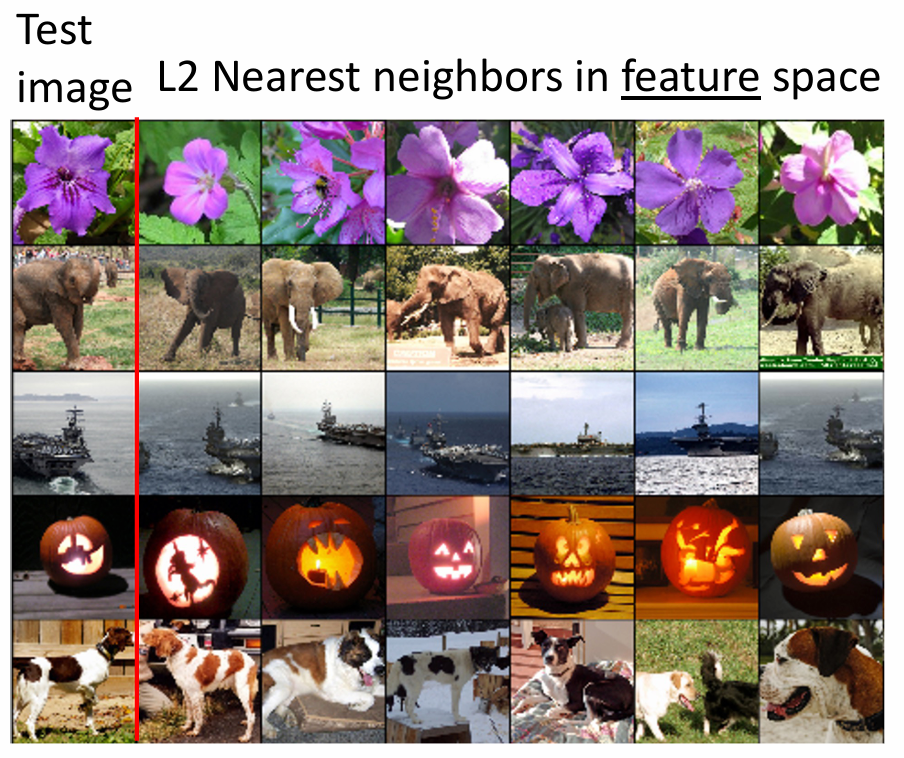{width=60%}
    </figure>

    比如我们在这里可以发现模型认为各种紫色的花是相似的，并且各种的大象的图像、万圣节南瓜灯的图像也是分别相似的。即使这些天预想具体的颜色、方向、背景等等都有很大不同，但模型都学习到了这些图像中隐含的特征，并且能通过比较它们的特征向量来判断它们是是否相似。

### Dimensionality Reduction

当然我们也可以通过降维的方法来可视化高维向量。比如我们可以使用 PCA 或 t-SNE 等方法将高维向量降到 2 维或 3 维，然后再将其可视化。

<figure markdown="span">
    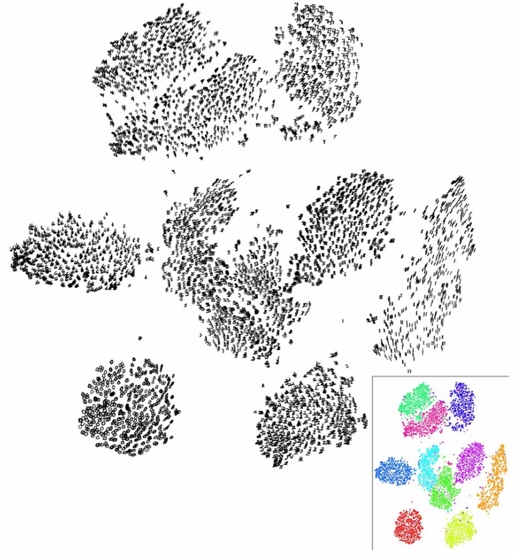{width=60%}
</figure>

上图是一个手写数字识别的例子，我们把模型学习到的高维向量降维到 2 维后，并且发现不同类别的图像在这个 2 维的特征空间上是分开的，并且相同类别的图像基本上是聚集在一起的。

上面的图并不够清晰，如果你去下载这张 [slides](https://web.eecs.umich.edu/~justincj/slides/eecs498/WI2022/598_WI2022_lecture21.pdf) 并查看原图，会发现图上每一个点都是一个数字，这说明模型已经成功地学会如何将不同的手写数字分类了。

### Maximally Activating Patches

Maximally Activating Patches 做的事是选择网络中某一层的某个通道（例如第五层卷积网络是 conv5 128×13×13，我们选择第 17 个通道），并且把各种图像都提供给这个网络，记录这个这个通道的激活值，并且把每张图像里最能激活这个通道的图像的块（patch）提取出来。然后我们就可以把这些块放在一起，看看这个通道究竟在寻找什么。

<figure markdown="span">
    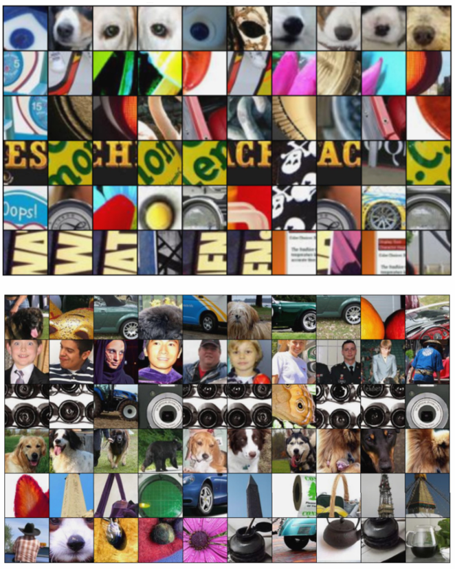{width=50%}
</figure>

比如在上面，每一行都代表使得同一个通道激活的图像块，每一列都表示不同的通道。我们可以看到第一行的图像块都是一些类似于狗的鼻子或眼睛的图像块，而第四行的图像块则是一些在不同的背景下的英文字母，这表示不同的通道在寻找不同的特征。

### Saliency via Occlusion

为了知道图像中哪些部分对于模型正确进行图像分类是最重要的，我们可以给掩盖掉（mask）图像的一小部分，并关注这么做时候对模型的分类结果有何影响。

这么做时候我们就会得到一个与原图像相对应的热图，热图上颜色越深表示这一部分对于模型的分类、识别越重要。通过这个方法我们也可以知道模型是否真的能有效地对图像进行分类，而不是借助一些取巧的方法（例如判断图像是否是“船”应该主要从船的主体部分，而非主要依靠水面上的深色倒影）。

<figure markdown="span">
    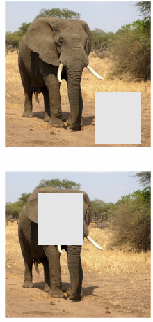{align=left width=40%}
    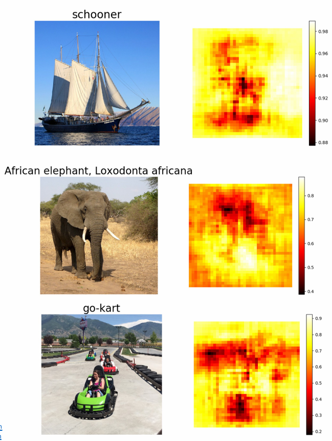{align=right width=40%}
</figure>

### Saliency via Backprop

和上面的方法类似，Saliency via Backprop 的思路是通过改变图像中每个像素点的值，利用梯度观察它们对于最终判断结果的影响，来得知模型对于哪些像素点更为关注。

<figure markdown="span">
    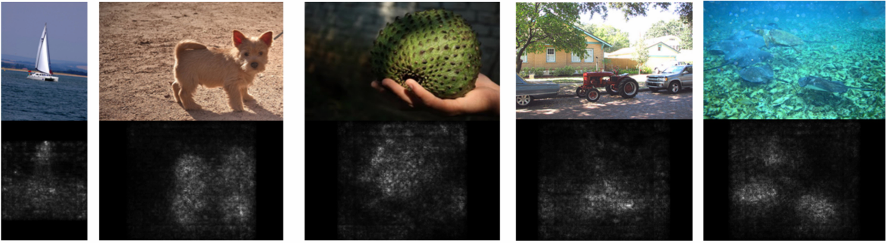{width=90%}
</figure>

### Intermediate Features via (guided) backprop

通常我们在对 ReLU 层进行反向传递时，我们会记录在正向传播过程中哪些位置的数据因它们为负数而被置为 0，并且在反向传递时把这些位置的像素置为 0。

<figure markdown="span">
    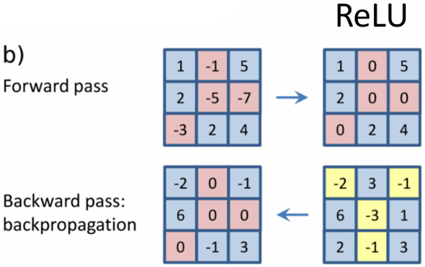{width=50%}
</figure>

而如果我们在反向传递过程中使用的是反卷积网络（deconvnet），我们要做的是把小于 0 的上游梯度置为 0。现在如果我们把这两种方法结合起来：把正向传播过程中因 ReLU 函数性质而被置于 0 的像素，以及上游梯度小于 0 的像素，在反向传播过程中都变为 0，就得到了 guided backpropagation

<figure markdown="span">
    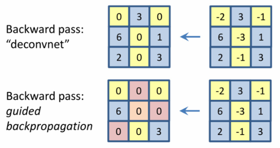{width=50%}
</figure>

这么做似乎很没有道理，我们也不知道这么做的意义为何，但是它确实能让我们得到一些告诉我们模型正在关注图像中哪些部分的漂亮的图片。

??? example
    <figure markdown="span">
        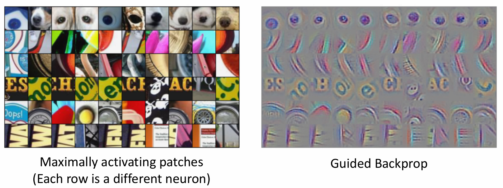{width=80%}
    </figure>

    <figure markdown="span">
        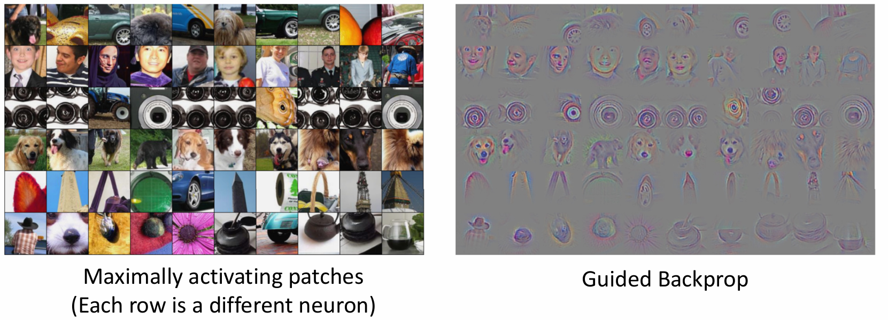{width=80%}
    </figure>

## Generating Images

### Gradient Ascent

Gradient Ascent 采用的是一个不同的思路。一直以来我们做的都是在给定训练图像的情况下，根据梯度不断改进卷积网络的参数，现在我们要做的事在给定卷积网络的情况下，对输入图像不断进行调整，使得这个图像可以让某一个神经网络的激活值最大化。

- **(Guided) backprop**: Find the part of an image that a neuron responds to
- **Gradient ascent**: Generate a synthetic image that maximally activates a neuron

即我们要做的是得到一个最优的图像 $I^*$，使得
$$ I^* = \argmax_I f(I) + R(I) $$
其中 $f(I)$ 是这一个神经元的得分，$R(I)$ 是对图像的正则化项

1. 把图像初始化为 0（或是初始化为随机图像）
2. 把图像正向传递，计算当前得分。例如
    $$ \argmax_I S_c(I) - \lambda \Vert I \Vert_2^2$$
    其中 $S_c(I)$ 表示图像在类别 C 上的得分（未经过 Softmax）

3. 反向传播得到神经元值相对于图像像素的梯度
4. 根据梯度对图像进行微小改变
5. 重复 2-4 步直到图像能使神经元值最大

!!! example
    <figure markdown="span">
        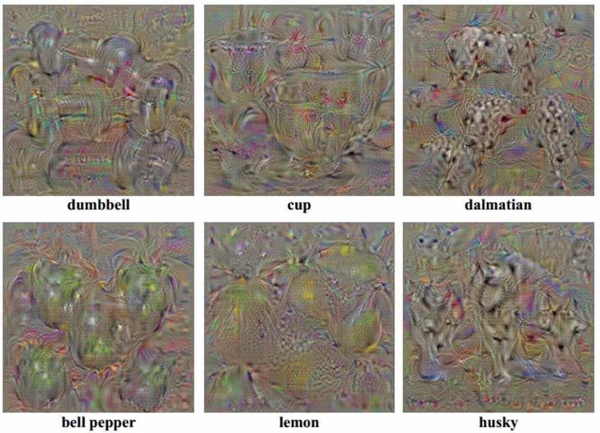{width=80%}
    </figure>

    上图是使用简单的 L2 正则项得到的各个类别的识别图像，我们可以观察到哑铃（dumbbell）图像中有着类似于哑铃的轮廓，cup 图像中隐约能观察到杯子的形状。

- 我们可以对正则化项进行一些比较 hack 的改进，让生成的图像更加平滑、重点更加突出

    <figure markdown="span">
        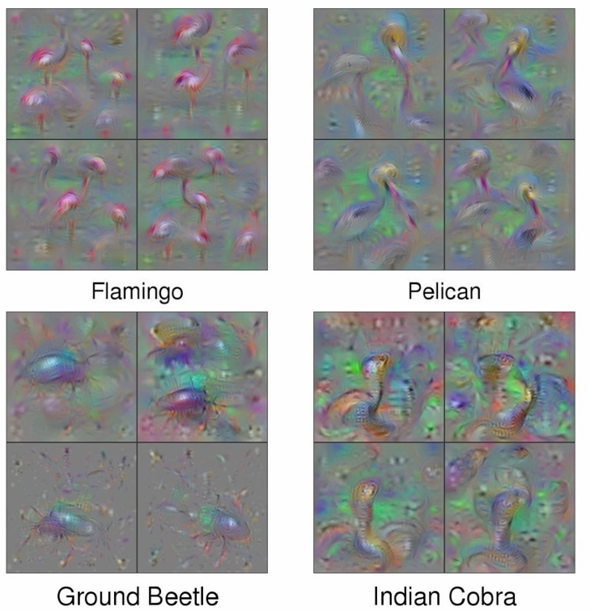{width=50%}
    </figure>

- 我们不仅可以对网络的最后一层使用 Gradient Ascent，也可以对中间层使用，从而直到这些网络具体在关注什么内容。

    <figure markdown="span">
        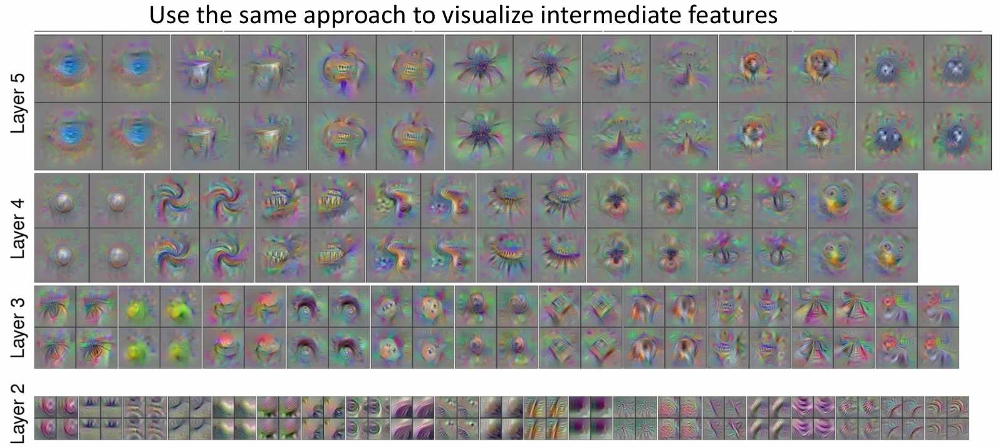{width=80%}
    </figure> 

??? extra 
    事实上有许多论文提出了各种各样的正则化方法，来让生成的图像更加好看

    <figure markdown="span">
        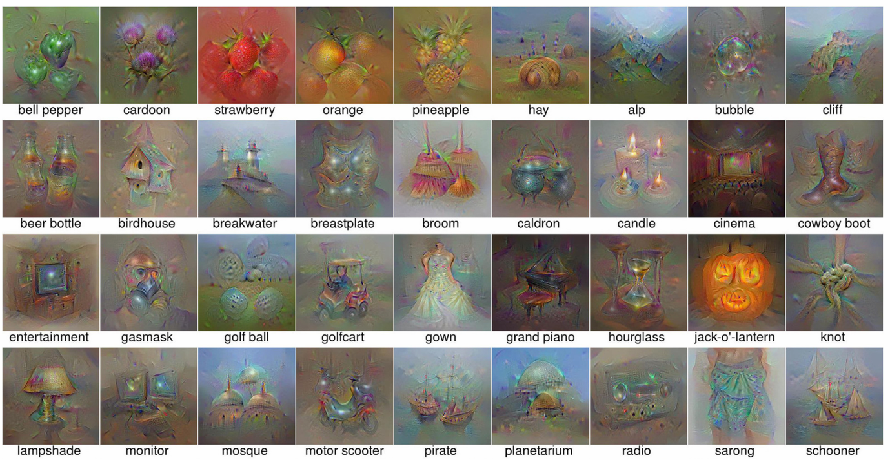{width=80%}
    </figure>

    <figure markdown="span">
        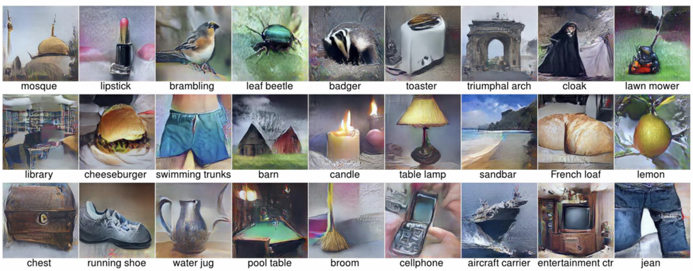{width=80%}
    </figure>

    但 Johnson 对于这些方法持保守态度，因为他认为我们得到这些图像化的最初目的就是想知道神经网络究竟在关注什么，但应用了这些充满技巧的正则化方法后，很难说是模型真的在关注这些内容，还是这些正则化方法迫使模型生成了这样漂亮的图像。

### Adversarial Attacks and Defense

如果我们对图像中的某些像素进行修改，就可以在肉眼难以观察的情况下改变模型对这张图像的分类，这称之为对抗攻击（adversarial attacks）

<figure markdown="span">
    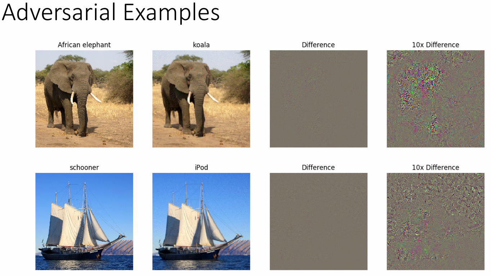{width=70%}
</figure>

- **Adversarial Attack**: Method for generating adversarial examples for a network（**Easy**）
- **Adversarial Defense**: Change to network architecture, training, etc that make it harder to attack（**Hard**）

对抗攻击可以大致分为两种：

- White-box attack：我们知道网络的架构和各种参数，可以知道任意输入图像对应的输出和梯度。
- Black-box attack：我们不知道网络的结构或权重，只能得到网络对于各种输入的预测结果

### Feature Inversion

Feature Inversion（特征反演）是指通过给定网络的特定输出或中间激活值，逆向推测输入数据的过程。

Given a CNN feature vector for an image, find a new image that:

- Matches the given feature vector
- "looks natural" (image prior regularization)

即尝试生成一个新的图像，使得这个图像经过网络后得到的特征向量与已知的特征向量越接近越好

<figure markdown="span">
    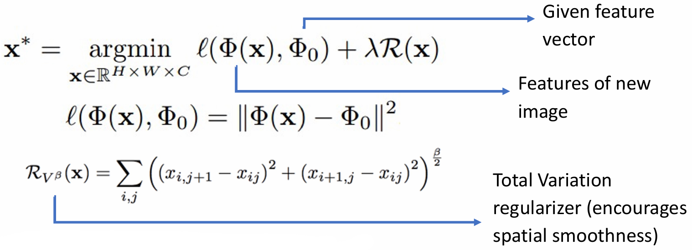{width=70%}
</figure>

??? exmaple
    <figure markdown="span">
        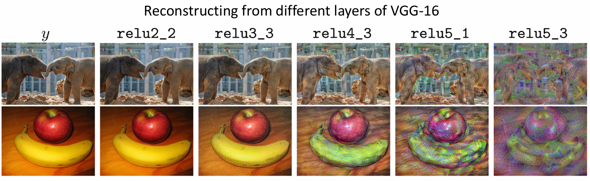{width=80%}
    </figure>

### DeepDream: Amplify Existing Features

DeepDream 的思路是不再通过从随机图像开始合成一个新图像，来最大化某个特定神经元的激活值，而是转而尝试通过现有的图像来达到，增强和激活神经元的目的。这最终会夸张、强化神经元已经学到的模式和特征，产生非常梦幻般、超现实主义的图像，因此被称为 DeepDream。

DeepDream 的工作原理可以分为以下几个步骤：

1. 选择一个训练好的卷积神经网络，通常选择的是在图像分类任务中经过大量训练的深度网络，接着选择网络的某一层（通常选择高层的卷积层，因为它们捕捉到了较为抽象的特征）
2. 通过把图像前向传递计算该层的激活值
3. 通过梯度上升法修改图像的像素值，使得该层学习到的特征被强化
4. 反复迭代，随着每轮优化，图像的形态逐渐变得更加怪异、梦幻，直到网络的目标层特征被极大放大。

??? example "一个非常夸张的例子"
    <figure markdown="span">
        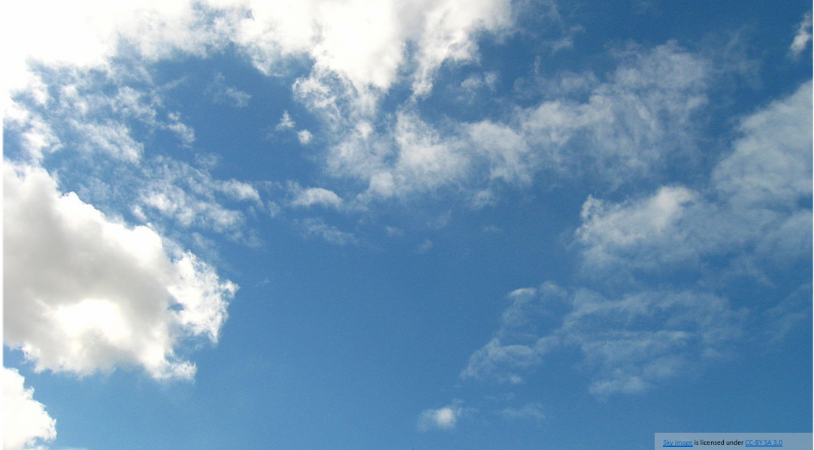{width=80%}
    </figure>

    上图是一张天空的原始图像

    <figure markdown="span">
        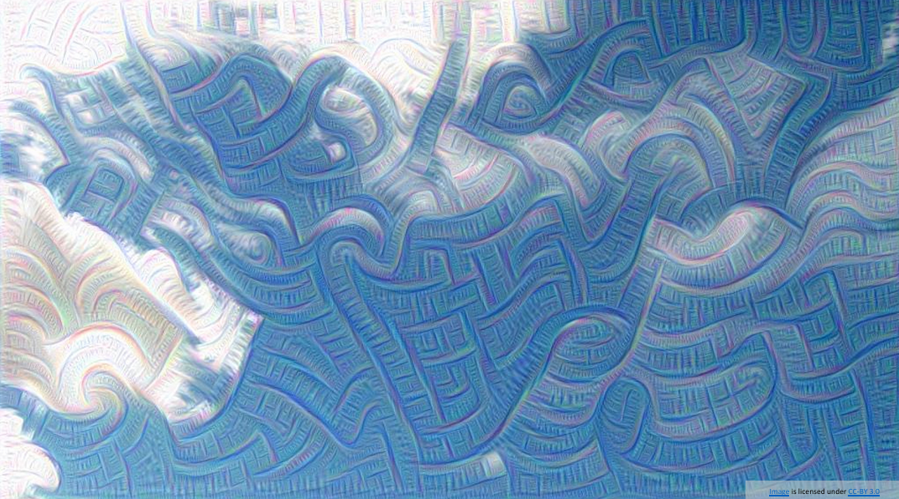{width=80%}
    </figure>

    这是浅层的卷积层在经过增强后得到的结果，可以看到浅层的网络学习到的是一些物体的边缘、轮廓。

    <figure markdown="span">
        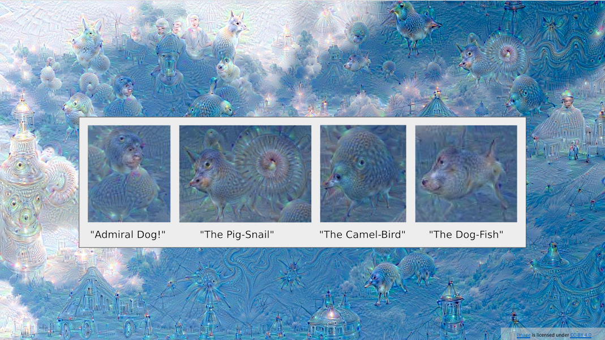{width=80%}
    </figure>

    上图是深层网络的增强后的结果，这里面充满了各种各样的、奇怪到令人不适的图像，这表示网络学习到的不同种类的物品、生物。

??? example "其他例子"
    <figure markdown="span">
        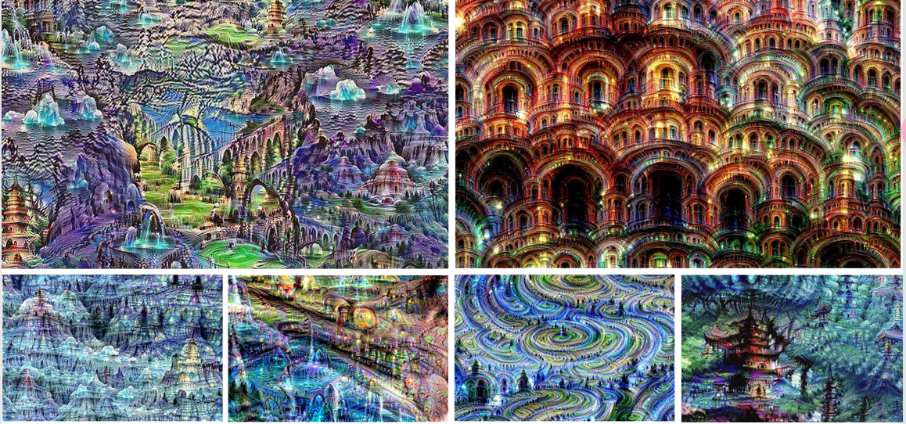{width=80%}
    </figure>

### Texture Synthesis

纹理合成（Texture Synthesis）一个或多个示例图像中提取纹理特征，并生成具有相似纹理特征的新图像或纹理区域的过程。纹理合成关注的是输入图像的表面纹理，但通常不会保留输入图像的空间特征。

<figure markdown="span">
    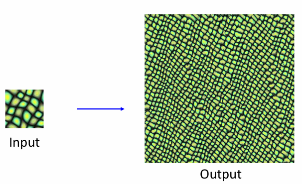{width=60%}
</figure>

#### Gram Matrix（格拉姆矩阵）

Gram Matrix 是描述图像、纹理或特征图之间相似度的数学工具。它通常用于计算特征之间的相关性，尤其是在纹理合成和风格迁移等深度学习任务中。通过利用 CNN 提取的特征，Gram Matrix 能够捕捉和量化图像中的**纹理特征**和**风格信息**。

- 在 CNN 中，每一层的输出都是一个 C×H×W 的张量，我们可以把它视为由若干个 C 维向量组成的 H×W 网格。 

    $$ F^l \in \mathbb{R}^{C \times H \times W} $$

- 两个 C 维向量的外积是一个 C×C 的矩阵，其中每个元素都是两个向量对应位置元素的乘积。
- 我们可以将 $F$ 展平为一个大小为 C×(H×W) 的矩阵，然后计算其 Gram Matrix：
    $$ G_{ij} = \sum_{k=1}^{H \times W} F_i(k) F_j(k) $$
    其中 $F_i(k)$ 和 $F_j(k)$ 分别是第 i 和第 j 个特征图在位置 k 处的值，$G_{ij}$ 表示这两个特征图在整个图像中的相似度

<figure markdown="span">
    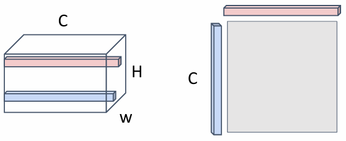{width=60%}
</figure>

#### Neural Texture Synthesis

1. Pretrain a CNN on ImageNet (VGG-19)
2.  Run texture forward through CNN, record activations on every layer; layer $i$ gives features $F^l \in \mathbb{R}^{C_i \times H_i \times W_i} $
3. At each layer compute the Gram matrix giving outer product of features:
    $$ G_{c,c'}^l = \sum_{h,w} F_{c,h,w}^l F_{c',h,w}^l \in \mathbb{R}^{C_l \times C_l } $$
4. Initialize generated image from random noise
5. Pass generated image through CNN, compute Gram matrix on each layer
6. Compute loss: weighted sum of L2 
distance between Gram matrices
7. Backprop to get gradient on image
8. Make gradient step on image
9. GOTO 5

<figure markdown="span">
    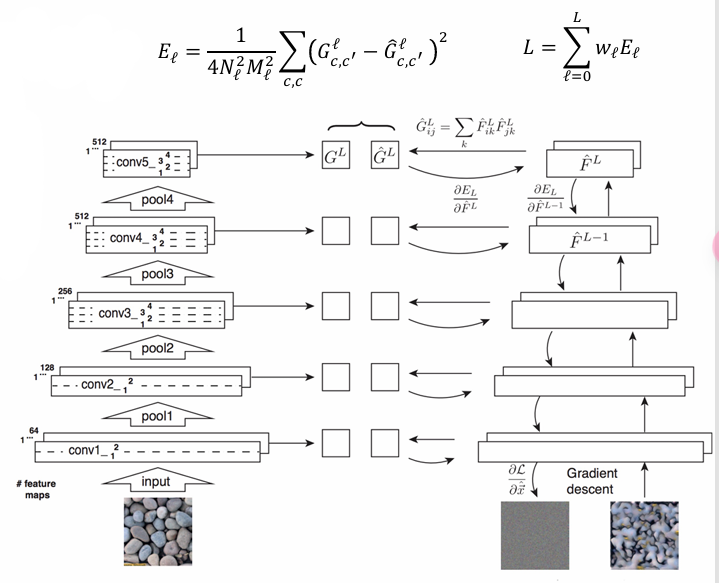{width=70%}
</figure>

??? example
    <figure markdown="span">
        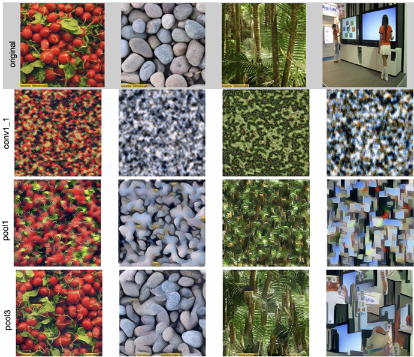{width=70%}
    </figure>

### Style Transfer

在风格迁移（style transfer）中，我们不仅关心图像的内容内容（例如，人物、建筑）的结构，还关心图像的风格（例如，梵高的画风）。

我们要做的是把特征重构（Feature reconstruction）和纹理合成（也成为 Gram reconstruction）结合起来，同时根据内容和风格生成新图像。

<figure markdown="span">
    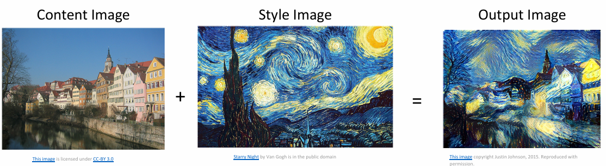{width=75%}
</figure>

<figure markdown="span">
    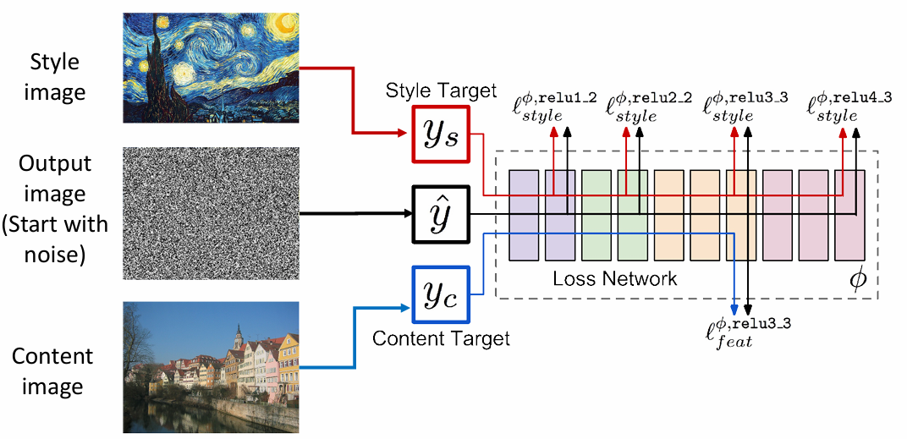{width=75%}
</figure>

!!! info "Multiple Style Images"
    我们还可以同时从多张图像中获取它们的风格，并混合起来作为我们新图像的风格。

    <figure markdown="span">
        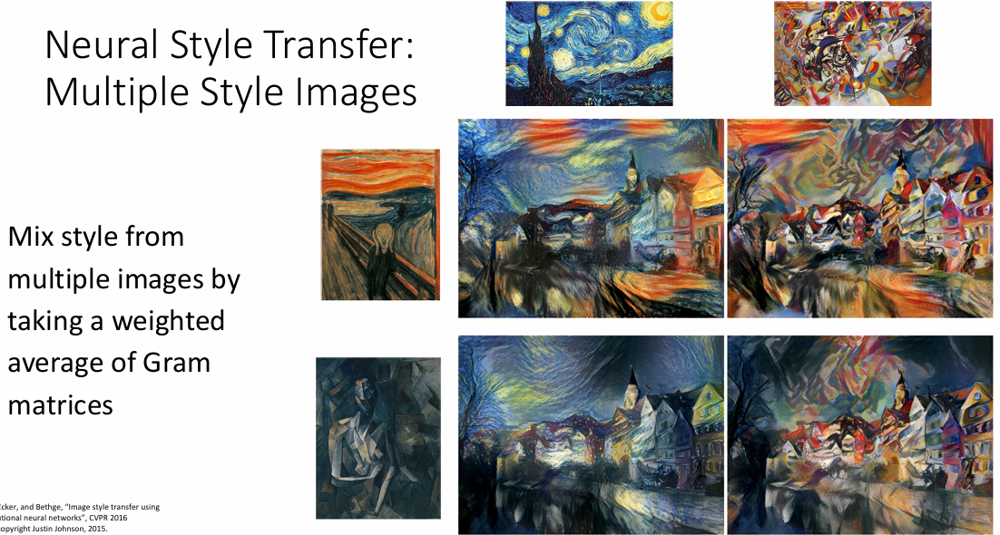{width=80%}
    </figure>

风格迁移的问题在于它需要很多次的 forward 和 backward，速度很慢，但可以通过训练另一个神经网络来实现即时的风格迁移效果。
