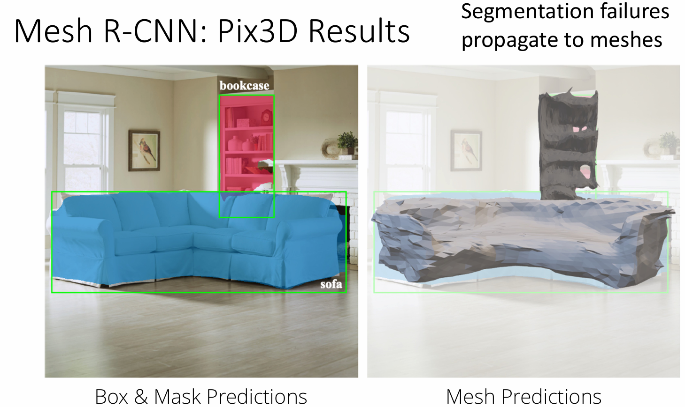

# 3D vision

!!! abstract 
    <figure markdown="span">
        {width=75%}
    </figure>

## Depth Map

Depth map（深度图）是一个灰度图像，其中每个像素的值表示该像素对应的场景点到相机的距离。

通常我们会把深度图和 RGB 图像结合在一起，形成一个 RGB-D 图像。（2.5D 图像）

<figure markdown="span">
    {width=45%}
</figure>

### Predicting Depth Maps

如果我们直接使用模型的预测深度图与实际深度图的 L2 距离来评估模型的性能，会由于深度图的尺度不一致而导致评估结果不准确，（例如较远的大物体和较近的小物体看起来可能会是一致的），这称为尺度不一致问题（Scale / Depth Ambiguity）。

这时候我们可以使用下图中的另一种函数来作为损失函数，来评估模型的性能。这个方程背后的数学原理不详细解释，大致可以理解为：我们可以通过对深度图进行归一化处理来消除尺度不一致问题。

<figure markdown="span">
    {width=75%}
</figure>

### Surface Normals

在三维视觉中，表面法线（Surface Normals）指的是对图像中的每一个像素都提供一个法线向量，表示该像素对应的三维表面的法线方向。向量的方向使用 RGB 颜色表示，例如下图中蓝色就大致表示法线方向向上等。

<figure markdown="span">
    {width=45%}
</figure>

!!! info "Predicting Normals"
    <figure markdown="span">
        {width=75%}
    </figure>

## Voxel Grid

!!! info "Voxel Grid"
    体素（Voxel）是三维空间中的一个立方体单元，类似于二维图像中的像素。体素网格（Voxel Grid）是由多个体素组成的三维网格，用于表示三维物体的形状和结构。体素网格可以用于三维重建、物体识别等任务。

    <figure markdown="span">
        {width=55%}
    </figure>

    - 体素网格会使用一个 V×V×V 的立方体来表示一个物体的三维形状，V 是体素网格的分辨率。它的概念十分容易理解：使用一个三维的网格来表示一个物体的三维形状。
    - 但如果想要表示一个物体的三维形状，体素网格的分辨率必须足够高，否则会导致物体的细节丢失。并且体素网格的存储和计算开销也会随着分辨率的增加而快速增加。

### 3D Convolution

三维卷积（3D Convolution）计算方式与二维卷积类似，只不过在计算时卷积核的大小是三维的。

<figure markdown="span">
    {width=70%}
</figure>

- 使用神经网络从一个二维图像中得到对应物体的三维体素网格后
- 对这个原始的体素网格进行若干次三维卷积计算
- 最后一次三维卷积后，使用一个全连接层来把三维体素网格转换为一个特征向量
- 对这个特征向量进行分类，计算它在每一个类别上的分数，预测它的类别

<figure markdown="span">
    {width=75%}
</figure>

那么现在的问题就是如何把一个二维图像转换为一个三维体素网格。

- 首先让模型使用二维 CNN 来提取图像的特征，得到二维的特征向量
- 在对这个二维特征进行处理，把它转换为三维特征
- 让这个三维特征经过若干个三维反卷积层，最终得到一个三维体素网格

### Voxel Tubes

观察上面的从二维图像转换为三维体素网格的过程，我们不难发现，当我们经过的三维卷积层数不断增加时，一个输出的三维像素点对应的感受野会以立方的形式快速增长，导致我们需要的计算量也会快速增加。因此就有人提出了体素管道的（Voxel Tubes）的方法来解决这个问题。

Voxel Tubes 与上面的三维卷积的不同之处在于，它在从图像中提取出二维特征之后，不会再使用其他的卷积层来把二位特征转换为三维特征，而是直接把二维特征 reinterpret 为三维特征，然后继续使用二维卷积层来处理这个三维特征，最终得到一个三维体素网格。

<figure markdown="span">
    {width=75%}
</figure>

!!! info "Voxel Problems: Memory Usage"
    <figure markdown="span">
        {width=65%}
    </figure>

    体素网格的分辨率越高，它所需的内存就越大。其中一个解决办法是使用八叉树（Octree）来存储体素网格。八叉树是一种空间划分的数据结构，可以有效地表示稀疏的三维数据。通过使用八叉树，我们可以只存储非空的体素，从而减少内存的使用。

    <figure markdown="span">
        {width=60%}
    </figure>

## Pointcloud

点云（Point Cloud）是一种表示三维物体形状的方法，它使用一组离散的点来表示物体的表面。

<figure markdown="span">
    {width=70%}
</figure>

- 可以在不使用大量点的情况下，较好地表示一个物体的三维结构
- 需要新的架构和新的损失函数来处理点云数据
- 如果我们想要从点云从提取出一个物体的三维形状并渲染，或是用作其他的任务，我们需要对点云数据进行其他额外的后期处理（例如把点云数据转换为其他数据格式以供使用）

### PointNet

<figure markdown="span">
    {width=70%}
</figure>

- 获取点云数据，共 P 个点，每个点都有三个数据表示它的三维空间坐标
- 对每一个点单独使用一个 MLP 来提取它的特征，得到一个 P×D 的点云特征矩阵
- 然后对这个点云特征矩阵进行全局最大池化（Global Max Pooling）操作，得到一个 D 维的全局特征向量
- 最后使用一个全连接层来把这个全局特征向量转换为一个特征向量，进行分类或其他任务

!!! note
    PointNet 的特点在于他处理的是一组无序的点的集合，因此它的输入顺序不应影响输出的结果。

    PointNet 通过使用全局最大池化来保证模型输出不受点云顺序的影响，且能保留点云的全局信息。

### Generating Pointcloud Outputs

<figure markdown="span">
    {width=70%}
</figure>

!!! info
    课上直接略过了这一部分的具体说明，总之我们需要知道的就是：我们会输入一个 RGB 图像，然后训练一个网络来处理它，最后输出一个点云数据。

### Loss Function

我们希望损失函数能很好的表示我们*预测*得到的点云数据和我们*应该*得到的点云数据的差异。换句话说，我们想要表示两个点集之间的差异。

通常而言，点云使用的损失函数是 Chamfer Distance（CD），它的计算方式是对每个点计算另一个点集中与它距离最近的点的 L2 距离，然后对所有点的距离求和。即
$$ d_{CD}(S_1, S_2) = \sum_{x \in S_1} \min_{y \in S_2} || x - y ||_2^2 + \sum_{y \in S_2} \min_{x \in S_1} || x - y ||_2^2 $$

<figure markdown="span">
    {width=75%}
</figure>

## Mesh

!!! info "Mesh vs Grid"
    - grid 指的是规则的网格，通常是正方形（2D）或立方体（3D）构成的图形，是一块一块的区域构成的图形
    - mesh 是图形学中的标准表示方法，通常用于表示三维物体的形状和结构。它由一组顶点（vertices）和面（faces）组成，其中顶点是三维空间中的点，面是由顶点连接而成的多边形。。

    <figure markdown="span">
        {width=30%}
    </figure>

### Triangle Mesh

- **Vertices**: Set of V points in 3D space
- **Faces**: Set of triangles over the vertices

**优点**：

- 三角网格是图形学中的标准表示方法
- 可以显式地表示三维形状
- 适用性好：可以高效地表示较为平坦的表面，也可以通过添加更多的三角形来提供精度更高的区域细节
- 可以在三角形之间进行插值计算，得到更平滑的表面，来实现更高质量的渲染效果

### Predicting Meshes

- **input**: single RGB Image of an object
- **output**: triangle mesh for the object
- **Key ideas**:
    - Iterative Refinement
    - Graph Convolution
    - Vertex Aligned-Features
    - Chamfer Loss Function

1. **Iterative Mesh Refinement**
    - 从一个初始的椭圆型网格开始，然后通过迭代的方式不断移动网格的顶点，来使得网格的形状更接近于我们想要的物体的形状。
    - 经过一次调整后，可以通过 unpooling 来增加顶点数量，然后再次调整顶点位置，不断迭代。

    <figure markdown="span">
        {width=80%}
    </figure>

2. **Graph Convolution**

    假设每个顶点 $v_i$ 都有一个特征 $f_i$，图卷积的新特征 $f_i'$ 可以通过对每个顶点的特征 $f_i$ 和它的邻居的特征 $f_j$ 进行加权求和来计算。
    $$ f_i' = W_0 f_i + \sum_{j \in N(i)} W_1 f_j $$

    - input: Graph with a feature vector at each vertex
    - output: New feature vector for each vertex

    <figure markdown="span">
        {width=55%}
    </figure>

    第一部分中每次 refine 都会使用一组图卷积层来处理每个顶点的特征。

3. **Vertex Aligned-Features**

    - 对于网格中的每个顶点，都利用 camera information（相机信息）来把它投影到特征图像平面上
    - 使用二次线性插值来从 CNN 特征图中进行采样

    > 某种程度上类似于我们在做图像分割时在 RoI-align 中使用的插值方法

    <figure markdown="span">
        {width=50%}
    </figure>

4. **Chamfer Loss Function**

    即使我们得到了相同的顶点，我们同样可能会得到不同的网格。我们需要一个损失函数来评估我们预测的网格和真实网格之间的差异。

    思路在于我们可以把网格转换为点云，然后使用 Chamfer Distance 来计算它们之间的差异。

    Loss = Chamfer distance between *predicted verts* and *ground-truth samples*

    <figure markdown="span">
        {width=75%}
    </figure>

    - 由于我们可以提前知道真实网格的顶点，因此我们离线地从真实网格中采样出一些点来作为真实网格的点云数据
    - 但对于预测网格，只能在线地从网格中采样

???+ extra "Mash R-CNN"
    Mash R-CNN 接受一个 RGB 图像作为输入，然后输出图像中的一系列物体，对于每个物体，都会有对应的

    - 边界框（Bounding Box）
    - 类别标签（Category Label）
    - 实例分割掩码（Instance Segmentation Mask）
    - 3D 三角网格（3D Triangle Mesh）

    其中前三个输出实际上就是使用 Mask R-CNN 来处理的结果，最后一个输出则是使用了 Mash head，即上面提到的迭代网格细化（Iterative Mesh Refinement）来处理的结果。

    Mash R-CNN 的聪明之处在于它并没有从一个固定的网格开始迭代，而是先从输入图像中识别出需要建立 3D 网格的物体，然后构建对应的 voxel grid，然后根据这个 voxel grid 来生成初始的 triangle mesh。

    <figure markdown="span">
        {width=60%}
    </figure>

    ??? example
        <figure markdown="span">
            {width=70%}
        </figure>

        <figure markdown="span">
            {width=65%}
        </figure>

## Implicit Surface

隐式表面（Implicit Surface）是一种表示三维物体形状的方法，它使用一个函数 
$$ o: \mathbb{R}^3 \to \{ 0, 1 \} $$ 
来把三维空间中的一个点映射到一个标量值，这个标量值表示它处于物体内部或外部的概率。其中三维物体的表面对应的是函数值为 1/2 的点集 $ \{ x: o(x)= \frac{1}{2} \} $

<figure markdown="span">
    {width=55%}
</figure>

我们要做事情类似于不断细化一个网格，判断格点是否在物体内部，直到我们找到一个合适的网格大或一个足够的分辨率为止。

<figure markdown="span">
    {width=95%}
</figure>
