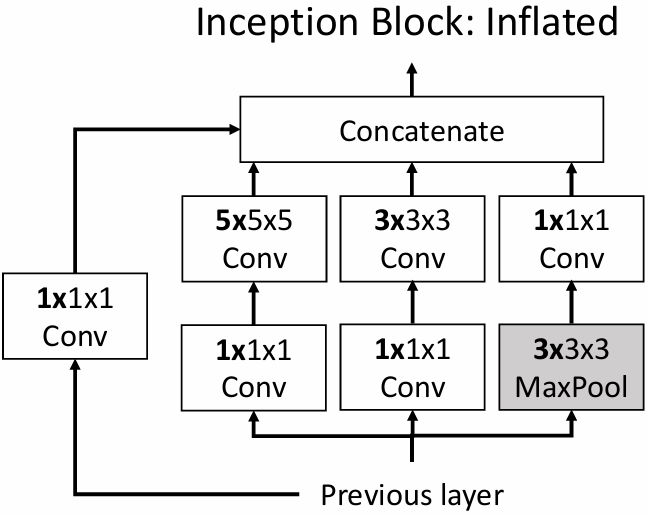

# Videos

视频（Video）可以认为是 2D 图像的时间序列，即 video = 2d + time，视频的每一帧都是一张 2D 图像。

它可以表示为一个四维张量 $T \times C \times H \times W$，或 $C \times T \times H \times W$ 其中 $T$ 是时间维度，$H$ 是高度，$W$ 是宽度，$C$ 是通道数。

<figure markdown="span">
    {width=65%}
</figure>

!!! warning
    但当我们想要将视频作为输入来训练一个模型时，我们会遇到一个问题：视频太大了。

    例如一个每秒 30 帧的视频，假如它未经任何压缩，每个像素点都需要使用 3 个字节（RGB）来表示，那么一个 640 x 480 的视频每分钟就需要大约 1.5 GB 的存储空间，一个 1920 x 1080 的视频每分钟就需要大约 10 GB 的存储空间，这显然会超出 GPU 的内存限制。

这个问题的解决方法是我们只截取视频的一小部分来进行训练——使用更低的帧率和更低的分辨率，例如 16 帧的视频，分辨率为 112 x 112。

<figure markdown="span">
    {width=85%}
</figure>

当我们训练时，我们会在视频中截取一些片段，然后对这些片段进行下采样，得到一个帧数更少、分辨率更低的视频。而当我们进行测试时，我们会截取更多不同的片段，并在这些片段上进行测试，最终取平均值作为结果。

## Video Classification

### Single-Frame CNN

Single-Frame CNN 的思路很简单直观，我们可以将视频中的每一帧都看作一张单独的 2D 图像，然后在每一帧上进行单独的训练和测试。虽然这未必是最好的方法，但它是最简单有效的实现方法。

<figure markdown="span">
    {width=70%}
</figure>

### Late Fusion

晚期融合（Late Fusion）的思路是先对每一帧图像单独使用一个 CNN 提取特征，然后将这些特征进行拼接、融合，最后使用进行分类任务得到各个类别的分数。

其中有两种不同的融合方式：

- 使用全连接层

    将各个 CNN 提取出的特征当作一个 $T \times D \times H' \times W'$ 的四维张量，然后将其展平为一个 $TDH'W'$ 的一维向量，最后使用一个 MLP 进行分类。

    <figure markdown="span">
        {width=75%}
    </figure>

- 使用平均池化层

    对提取出的帧特征进行平均池化，将其从一个 $T \times D \times H' \times W'$ 的四维张量变为一个 $D$ 维向量，然后使用一个线性层进行分类。

    <figure markdown="span">
        {width=75%}
    </figure>

当然这一种方法也存在缺陷：我们可以通过晚期融合让模型了解到一些较高层次的信息，但我们很难让模型察觉到帧与帧之间较低层次的运动。例如上面对 running 进行识别的例子，模型就很难注意到人在跑步时脚会上下运动这种 low-level 的信息。

### Early Fusion

与 Late Fusion 相对的是早期融合（Early Fusion），它会把形状为 $T \times 3 \times H \times W$ 的输入视频先 reshape 为 $3T \times H \times W$ 的三维张量，然后对它使用一个标准的 2D CNN 进行训练。

<figure markdown="span">
    {width=75%}
</figure>

- input：$3T \times H \times W$
- output：$D \times H \times W$

> 这么做的问题在于我们只使用了一个 CNN，这可能不足以捕捉和处理视频中的时间信息。

### 3D CNN

3D CNN 就是直接对视频进行卷积操作，它每一层的输入都是一个 $D \times T \times H \times W$ 的四维张量，在处理期间使用三维卷积和三维池化操作。

<figure markdown="span">
    {width=75%}
</figure>

### Late Fusion vs Early Fusion vs 3D CNN

**Late Fusion**

- Build slowly in space,
- All-at-once in time at end

| Layer               | Size (C x T x H x W) | Receptive Field (T x H x W) |
|---------------------|----------------------|-----------------------------|
| Input               | 3 x 20 x 64 x 64     |                             |
| Conv2D(3x3, 3->12)  | 12 x 20 x 64 x 64    | 1 x 3 x 3                   |
| Pool2D(4x4)         | 12 x 20 x 16 x 16    | 1 x 6 x 6                   |
| Conv2D(3x3, 12->24) | 24 x 20 x 16 x 16    | 1 x 14 x 14                 |
| GlobalAvgPool       | 24 x 1 x 1 x 1       | 20 x 64 x 64                |

<figure markdown="span">
    {width=65%}
</figure>

<figure markdown="span">
    {width=65%}
</figure>

**Early Fusion**

- Build slowly in space,
- All-at-once in time at start

| Layer                 | Size (C x T x H x W) | Receptive Field (T x H x W) |
|-----------------------|----------------------|-----------------------------|
| Input                 | 3 x 20 x 64 x 64     |                             |
| Conv2D(3x3, 3*10->12) | 12 x 64 x 64         | 20 x 3 x 3                  |
| Pool2D(4x4)           | 12 x 16 x 16         | 20 x 6 x 6                  |
| Conv2D(3x3, 12->24)   | 24 x 16 x 16         | 20 x 14 x 14                |
| GlobalAvgPool         | 4 x 1 x 1            | 20 x 64 x 64                |

**3D CNN**

- Build slowly in space,
- Build slowly in time
- 因此也很会被称为 "Slow Fusion"

| Layer                 | Size (C x T x H x W) | Receptive Field (T x H x W) |
|-----------------------|----------------------|-----------------------------|
| Input                 | 3 x 20 x 64 x 64     |                             |
| Conv2D(3x3, 3*10->12) | 12 x 20 x 64 x 64    | 3 x 3 x 3                   |
| Pool2D(4x4)           | 12 x 5 x 16 x 16     | 6 x 6 x 6                   |
| Conv2D(3x3, 12->24)   | 24 x 5 x 16 x 16     | 14 x 14 x 14                |
| GlobalAvgPool         | 24 x 1 x 1           | 20 x 64 x 64                |

!!! note "2D Conv (Early Fusion) vs 3D Conv (3D CNN)"
    当我们对多个帧进行 2D 卷积时，我们可以把输入 $C_{in} \times T \times H \times W$ 当作一个三维网格，其中每个点都是一个 $C_{in}$ 维的特征；输出 $C_{out} \times H \times W$ 则是一个二维网格，其中每个点都是一个 $C_{out}$ 维的特征。

    使用 2D 卷积时，我们的卷积核在空间上是平移不变的，但在时间上却不能保持平移不变性，这意味着我们可能需要为同一种变化在不同的时间维度上单独进行训练。例如如果我们想要识别从蓝色到橙色的色彩变化，那么我们就需要在 T=3 和 T=4 时分别对 CNN 进行训练，它们彼此之间不能共享权重。

    <figure markdown="span">
        {width=75%}
    </figure>

    3D 卷积的输入 $C_{in} \times T \times H \times W$ 同样可以当作一个三维网格，其中每个点都是一个 $C_{in}$ 维的特征；输出 $C_{out} \times T \times H \times W$ 也是一个三维网格，其中每个点都是一个 $C_{out}$ 维的特征。

    使用 3D 卷积时，我们的卷积核在空间上和时间上都是平移不变的，这意味着当我们能识别到某一个时刻出现从蓝色到橙色的变化，那么我们就可以在其他时刻也识别到这种变化。

    <figure markdown="span">
        {width=75%}
    </figure>

## Measuring Motion

### Optical Flow

光流法（optical flow）是一种计算图像序列中物体运动的方法，它可以通过分析连续帧之间的像素变化来估计物体的速度和方向。

光流法会根据相邻的两帧图像之间的像素变化来计算光流场（optical flow field），光流场是一个二维向量场，其中每个像素点的值表示该点在图像序列中的运动方向和速度。

- 通常而言，光流法记录信息的方式是分别记录每个像素点在水平方向和垂直方向上的位移 dx 和 dy。

<figure markdown="span">
    {width=65%}
</figure>

### Two-Stream Networks

Two-Stream Networks 是一种用于视频分析的深度学习模型，它使用两个独立的卷积神经网络（CNN）来处理视频中的空间和时间信息。一个 CNN 用于处理视频中的空间信息，另一个 CNN 用于处理视频中的时间信息。

Two-Stream Networks 的时间流（temporal stream）会接受维度为 $[2(T-1)] \times H \times W$ 的光流图像作为输入（因为时间序列长度为 $T$，有 $T-1$ 组 dx 和 dy），空间流（spatial stream）会接受单张 $3 \times H \times W$ 的 RGB 图像作为输入。然后把两者结合起来学习视频中的空间和时间信息。

<figure markdown="span">
    {width=70%}
</figure>

## Modeling long-term temporal structure

!!! question
    直到目前为止我们的时间序列 CNN 只能对很短的视频片段中的局部运动进行建模，那么我们该如何处理更长时间的时间序列呢？

    - 我们可以考虑使用循环网络！

我们可以首先使用 2D 或 3D 的 CNN 来从视频中提取出特征，接着使用 RNN 的思想来让模型学习视频中更长时间的时间序列信息。

为了减少计算量和内存的使用，我们在这一部分可以使用预训练好的 CNN（例如 C3D）来作为特征提取器，然后将提取出的特征输入到 RNN 中。这么做之后我们就不必为 CNN 进行反向传播，从而大大减少了计算量

- Inside CNN: Each value a function of a fixed temporal window (local temporal structure)
- Inside RNN: Each vector is a function of all previous vectors (global temporal structure)

CNN 学习到的是一个局部的时间序列结构，而 RNN 学习到的是一个全局的时间序列结构，那么我们可不可以把两者结合起来呢？

### Recurrent Convolutional Network

!!! info "Multi-layer RNN"
    在我们之前学习到的多层 RNN 中，每一层的隐藏状态都取决于本层上一时间步的隐藏状态和上一层在当前时间步的隐藏状态。

    <figure markdown="span">
        {width=40%}
    </figure>

我们可以模仿多层 RNN 的结构来设计一个多层的卷积网络（Recurrent Convolutional Network），它的每一层都可以类比于一个 RNN 的隐藏状态。

<figure markdown="span">
    {width=65%}
</figure>

- 整个网络使用的都是 2D 的特征图，形状为 $C \times H \times W$
- 每一层在每一个时间步的结果都取决于
    - 同一层在上一时间步的结果
    - 上一层在当前时间步的结果
- 每一层都会使用不同的权重，同一层的权重在不同时间步之间是共享的

!!! info "Recurrent Network"
    在循环神经网络中，我们计算新隐藏状态的方式是使用矩阵乘法，例如在原始的 RNN 中，我们会使用以下公式来计算新的隐藏状态：
    $$ h_{t+1} = \text{tanh}(W_{hh}h_t + W_{hx}x_{t+1}) $$

在 Recurrent Convolutional Network 中，需要把矩阵乘法操作替换为 2D 卷积操作。并且不局限于普通的 RNN，我们也可以让 RCN 模仿 LSTM 或 GRU 来对隐藏状态进行更新。

<figure markdown="span">
    {width=65%}
</figure>

### Spatio-Temporal Self-Attention (Nonlocal Block)

{align=right width=27%}

目前为止我们已经让循环卷积网络模仿了 RNN 和 LSTM 的结构，理所当然地，我们也可以让它模仿自注意力机制（Self-Attention）的结构。

> Attention is all you need, my friend.

简单回顾一下自注意力机制的结构：

- 首先接受一组输入向量 $x_1, \ldots, x_N$，
- 然后使用线性变换将其映射为三个向量 Query, Key 和 Value
- 接着计算每个查询向量和所有键向量之间的相似度，然后用 softmax 函数将其归一化为权重
- 最后用这些权重对值向量进行加权求和，把结果和输入向量残差连接起来作为最终的输出

<figure markdown="span">
    {width=85%}
</figure>

!!! tip
    这里有一个实践的小技巧：我们可以把最后一个卷积层初始化为 0，这样一来整个 block 的输出就是输入本身，这么一来我们就可以把整个 nonlocal block 插入到 3D CNN 之间进行训练，而不需要担心它会破坏模型的性能。

    <figure markdown="span">
        {width=75%}
    </figure>

## Inflating 2D Networks to 3D (I3D)

我们已经有了许多在图像（image）上表现出色的架构和模型，并且为之付出了许多工作。一个自然的想法是我们不希望在视频（video）上从头开始设计架构，而是希望能够将现有的 2D 模型扩展到 3D 模型上。

- Idea: take a 2D CNN architecture.

    Replace each 2D $K_h \times K_w$ conv/pool layer with a 3D $K_t \times K_h \times K_w$ version

!!! example "Inception Block: Original/Inflated"
    <figure markdown="span">
        {align=right width=40%}
        {align=left width=40%}
    </figure>

另一个想法是，我们不希望随机地初始化一个视频模型的权重，而是希望能够利用现有的 2D 模型的权重来初始化视频模型的权重。比如我们可以把一个 2D 模型的权重复制 $K_t$ 次，将它作为一个 3D 模型的权重。

<figure markdown="span">
    {width=55%}
</figure>

!!! tip
    这个想法来源于一个非常简单的观察：如果我们把一张图片复制 $K_t$ 次，那么我们就可以把它当作一个有 $K_t$ 帧的视频来处理，只不过这个视频的每一帧都是一样的。

    这意味着如果我们把一个 2D 模型的权重复制 $K_t$ 次，那么它在每一帧上的输出结果都会具有一定的“不变性”，这就使得我们可以把它当作一个 3D 模型来处理。

在下图中我们可以看到，使用了已经训练好的 2D 模型的权重来初始化 3D 模型的权重（一定程度上相当于预训练），相较于从头开始训练一个 video model，I3D 的表现要更好。

<figure markdown="span">
    {width=65%}
</figure>

!!! extra "Vision Transformers for Video"
    如果我们使用 Vision Transformer 来处理视频，它的表现会比我们前面提到的几种方法都要更好。

    <figure markdown="span">
        {width=70%}
    </figure>

    <figure markdown="span">
        {width=70%}
    </figure>

