# 电动力学

## 法拉第电磁感应定律

可以定义通过一个开放曲面的磁通量为
$$ \Phi_B = \iint \overrightarrow{B} \cdot d\overrightarrow{A} $$

根据法拉第电磁感应定律，感生电动势由磁通量的变化率决定
$$ \varepsilon = -\dfrac{ \mathrm{d}\Phi_B }{ \mathrm{d}t } $$

!!! tip "感生电动势的方向"
    上式中的负号表示感生电动势的方向总是使得感生电流的磁场方向抵消原磁场的变化，即”阻碍“磁场的变化，具体的方向可由右手定则确定，这就是楞次定律。

    楞次定律是能量守恒定律在电磁感应现象中的具体表现。

## 动生电动势和感生电动势

### 动生电动势

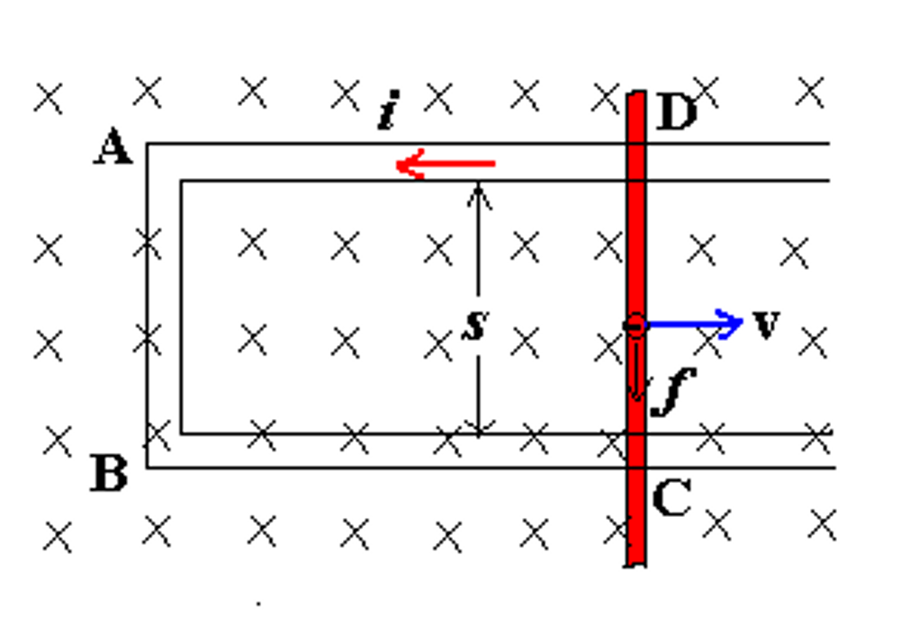{align=right width=33%}

动生电动势实际上由洛伦兹力产生。

电子在磁场中运动时，其受到的洛伦兹力为
$$ \overrightarrow{f} = -e(\overrightarrow{v} \times \overrightarrow{B}) $$

这是一个非静电力，电子在这个力的驱动下沿着 $\mathbf{DCBA}$ 方向运动，这样就产生了一个电动势。

$$ \overrightarrow{K} = \dfrac{\overrightarrow{f}}{-e} = \overrightarrow{v} \times \overrightarrow{B} $$

$$ \int_-^+ \overrightarrow{K} \cdot d\overrightarrow{l} = \int_C^D (\overrightarrow{v} \times \overrightarrow{B}) \cdot d\overrightarrow{l} = $$

!!! question
    我们都说洛伦兹力并不做功，但为什么我们又说洛伦兹力产生了动生电动势？

    因为实际上是外力克服了洛伦兹力的分量在做功，因此洛伦兹力有的分量做正功，有的分量做负功，总功为零。

!!! example "发电机"
    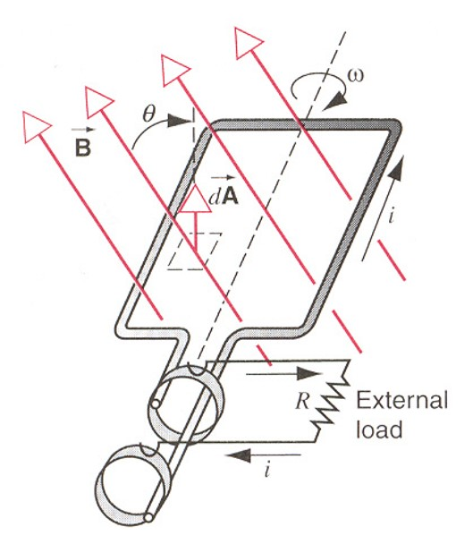{align=right width=33%}

    $$ \Phi_B = \overrightarrow{B} \cdot \overrightarrow{A} = BA \cos \theta = BA \cos \omega t $$

    $$ \varepsilon = -\dfrac{ \mathrm{d}\Phi_B }{ \mathrm{d}t } = -BA \dfrac{\cos \omega t}{ mathrm{d}t } = BA \omega \sin \omega t $$

### 感生电动势

磁场发生变化时，会在空间中产生一个涡旋电场，这个电场会使电荷在空间中运动，从而产生感生电动势。
$$ \varepsilon = \oint \overrightarrow{E} \cdot d\overrightarrow{l} $$

空间中的电场实际上包括静电场和磁场变化产生的感生电动势 

$$ \overrightarrow{E} = \overrightarrow{E}_{sta} + \overrightarrow{E}_{ind} $$

我们可以对空间中的电场环路定理进行推广

!!! info "电场环路定理的推广"
    感应电动势做的功相当于感生电场对电荷做的功，即
    $$ \varepsilon q_0 = q_0 E_{ind} 2 \pi r $$
    
    从而根据法拉第电磁感应定律

    $$ \varepsilon = E_{ind} 2 \pi r = -\dfrac{ \mathrm{d}\Phi_B }{ \mathrm{d}t } $$
    
    于是

    $$ \oint \overrightarrow{E} \cdot d\overrightarrow{l} = \oint (\overrightarrow{E}_{sta} + \overrightarrow{E}_{ind}) \cdot d\overrightarrow{l} = 0 + (-\dfrac{ \mathrm{d}\Phi_B }{ \mathrm{d}t }) = -\dfrac{ \mathrm{d}\Phi_B }{ \mathrm{d}t } $$

    又根据磁通量的定义，$ \Phi_B = \iint \overrightarrow{B} \cdot d\overrightarrow{A} $，所以
    $$ \oint \overrightarrow{E} \cdot d\overrightarrow{l} = -\iint \dfrac{ \partial \overrightarrow{B} }{ \partial t } \cdot d\overrightarrow{A} $$

    又根据 stokes 公式
    $$ \oint \overrightarrow{E} \cdot d\overrightarrow{l} = \iint (\nabla \times \overrightarrow{E}) \cdot d\overrightarrow{A} $$

    于是我们得到
    $$ \nabla \times \overrightarrow{E} = -\dfrac{ \partial \overrightarrow{B} }{ \partial t } $$

!!! warning
    由于在涡旋电场中，电场的环路积分不为零，所以感生电动势是非保守的，我们不能使用“电势”的概念。

!!! example 
    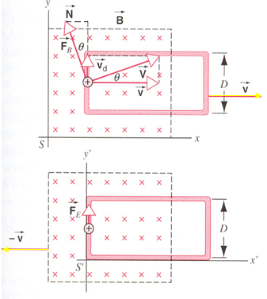{align=right width=33%}

    === "磁场参考系"
        在磁场参考系中，线圈向右匀速运动，有
        $$ \overrightarrow{V} = \overrightarrow{v} + \overrightarrow{v}_d, \enspace \overrightarrow{F}_B = \overrightarrow{N} + \overrightarrow{F}_i $$

        $$ \begin{aligned}
        \mathrm{d} \overrightarrow{W}_N &= N( v \mathrm{d}t ) = F_B \sin \theta v \mathrm{d}t \\
        &= (qVB) (v_d / V) (v \mathrm{d}t) \\
        &= (qBv) (v_d \mathrm{d}t) \\
        &= qBv \mathrm{d}l
        \end{aligned} $$

        从而我们可以求出感应电动势
        $$ W_N = \int qBv \mathrm{d}l = qBvD $$

        $$ \varepsilon = \dfrac{W_N}{q} = BvD $$

        注意到实际上洛伦兹力有两个方向的分量，而
        $$ \mathrm{d}W_i = -F_i \mathrm{d}l = -qvB \mathrm{d}l $$
        $$ W_i = -qvBD = -W_N$$
        也就是说，洛伦兹力的两个分量做的功大小相等，符号相反，总功为零。这就是我们上面提到的洛伦兹力实际上并不做功。

    === "线圈参考系"
        在线圈参考系中，我们可以通过上面的结论得到一种求感生电动势的方法
        $$ \varepsilon' = \int E' \mathrm{d} l = E' = BvD $$
        $$ \overrightarrow{E}' = \overrightarrow{v} \times \overrightarrow{B} $$
        这里的 $\varepsilon'$ 是感生电动势，而 $\overrightarrow{E}'$ 是感生电场。

## 电感

### 互感

<figure>
    
</figure>

当 $i_1$ 变化时，会在 $S_2$ 上感应出电动势 $\varepsilon_2$；同样地，当 $i_2$ 变化时，会在 $S_1$ 上感应出电动势 $\varepsilon_1$。

我们可以定义一个新的物理量：磁通匝链数 $\Psi$，它是磁通量和匝数的乘积。

$S_1$ 在 $S_2$ 上产生的磁通匝链数为

$$ \begin{aligned}
\Psi_{12} &= N_2 A_2 B_1 = N_2 \Phi_{12} \\
    &= M_{12} i_1 
\end{aligned}$$

同理，$S_2$ 在 $S_1$ 上产生的磁通匝链数为

$$ \begin{aligned}
\Psi_{21} &= N_1 A_1 B_2 = N_1 \Phi_{21} \\
    &= M_{21} i_2
\end{aligned}$$

于是我们可以通过互感系数 $M$ 来求出感生电动势的大小
$$ M_{12} = \frac{\Psi_{12}}{i_1} = \frac{N_2 \Phi_{12}}{i_1}; \quad \varepsilon_2 = -\frac{ \mathrm{d}\Psi_{12} }{\mathrm{d}t} = -M_{12} \frac{\mathrm{d}i_1}{\mathrm{d}t}, \quad (i_1 \text{change} ) $$

$$ M_{21} = \frac{\Psi_{21}}{i_2} = \frac{N_1 \Phi_{21}}{i_2}; \quad \varepsilon_1 = -\frac{ \mathrm{d}\Psi_{21} }{\mathrm{d}t} = -M_{21} \frac{\mathrm{d}i_2}{\mathrm{d}t}, \quad (i_2 \text{change} ) $$

!!! note "互感系数"
    上面的 $M_{12}$ 和 $M_{21}$ 就是互感系数，一般而言，它们两者相等，即
    $$M_{12} = M_{21} = M$$
    互感系数的单位为亨利（hery），$ 1H = 1 \dfrac{Wb}{A} $，常用的单位有$mH$、$\mu H$等。

### 自感

<figure>
    
</figure>

当通电线圈的电流发生变化时，线圈本身也会产生感生电动势，这种现象称为自感。

根据楞次定律，我们可以很显然地知道感生电动势所产生的磁场，会倾向于阻碍原磁场的变化。同时我们也可以注意到感应电动势会使得线圈两端出现电势差，并且这个电势差的大小就等于感生电动势的大小。

$$ \Psi = NBA = Li $$

$$ \varepsilon_L = -\dfrac{\mathrm{d} \Psi}{\mathrm{d}t} = -L \dfrac{\mathrm{d}i}{\mathrm{d}t} $$

$$ V_b - V_a = \varepsilon_L = -L \dfrac{\mathrm{d}i}{\mathrm{d}t} $$

其中，$L$ 被称为线圈的自感系数，单位也为亨利。

!!! note "如何计算自感系数"
    1. 假设电流大小为 $i$
    2. 利用 $i$ 计算电流产生的磁感应强度 $\overrightarrow{B}$
    3. 计算磁通匝链数 

        $$ \Psi = N\Phi_B = NBA = Li $$

    4. 计算自感系数

        $$ \begin{aligned} 
        L &= \dfrac{\Psi}{i} = \dfrac{N\Phi_B}{i} \\\\
        \varepsilon_L &= -\dfrac{\mathrm{d}\Psi}{\mathrm{d}t} \\\\
        &= -L \dfrac{\mathrm{d}i}{\mathrm{d}t} \\\\
        &= -N \dfrac{\mathrm{d}\Phi_B}{\mathrm{d}t}
        \end{aligned} $$

!!! example
    === "螺线管的自感系数"

        <figure>
            
        </figure>

        计算一段长度为 $l$，横截面积为 $A$ 的通电螺线管的自感系数 $L$，我们可以按照上面提到的方法进行计算。
        $$ B = \mu_0 n i $$
        $$ \Psi = N \Phi_B = nlBA = \mu_0 n^2 ilA $$
        $$ L = \dfrac{\Psi}{i} = \mu_0 n^2 lA = \mu_0 n^2 V $$

        其中，$V$ 是这一段螺线管的体积。因此我们可以得到单位体积和单位长度螺线管的自感系数：
        $$ L_v = \dfrac{L}{V} = \mu_0 n^2, \quad L_l = \dfrac{L}{l} = \mu_0 n^2 A $$  

    === "长方形螺绕环的自感系数"
        <figure>
            
        </figure>
        
        如上图所示，长方形螺绕环共有 $N$ 匝，内径为 $a$，外径为 $b$，宽度为 $h$，通电电流为 $i$。

        首先利用环路定理求出磁感应强度 $B$
        $$ \oint \overrightarrow{B} \cdot d\overrightarrow{l} = \mu_0 N i $$
        $$ B = \dfrac{\mu_0 N i}{2 \pi r} $$

        接着就可以求出磁通量 $\Phi_B$，进而求出自感系数 $L$

        $$ \begin{aligned}
        \Phi_B &= \iint \overrightarrow{B} \cdot d\overrightarrow{A} = \int_a^b \dfrac{\mu_0 N i}{2 \pi r} h dr \\
        &= \dfrac{\mu_0 N i h}{2 \pi} \ln \dfrac{b}{a} 
        \end{aligned} $$

        $$ L = \dfrac{N \Phi_B}{i} = \dfrac{\mu_0 N^2 h}{2 \pi} \ln \dfrac{b}{a} $$

    === "同轴电缆"
        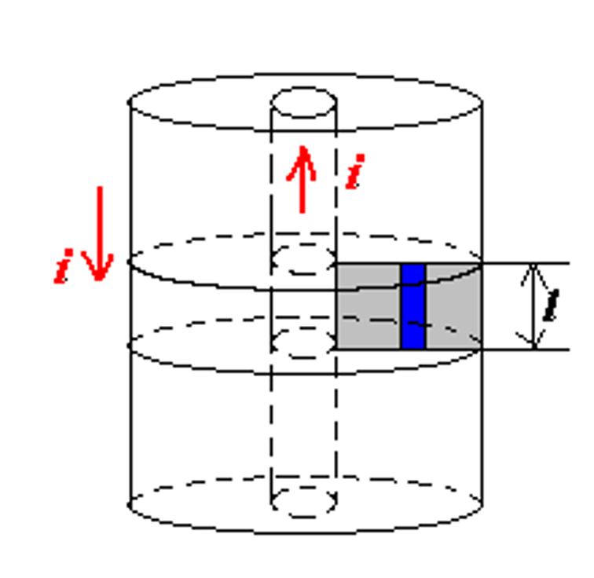{align=right width=25%}

        所谓同轴电缆（coaxial cable）就是由两个同轴的导线组成的电缆，内导线半径为 $R_1$，外导线半径为 $R_2$，两导线上的电流大小相等、方向相反。
        $$ \oint \overrightarrow{B} \cdot d\overrightarrow{l} = \mu_0 i $$
        $$ B = \dfrac{\mu_0 i}{2 \pi r} $$

        $$ \begin{aligned}
        \Phi_B &= \iint \overrightarrow{B} \cdot d\overrightarrow{A} = \int_{R_1}^{R_2} Bl dr \\
        &= \dfrac{\mu_0 il}{2 \pi} \int_{R_1}^{R_2} \dfrac{dr}{r} \\
        &= \dfrac{\mu_0 il}{2 \pi} \ln \dfrac{R_2}{R_1}
        \end{aligned} $$

        $$ L = \dfrac{\Phi_B}{i} = \dfrac{\mu_0 l}{2 \pi} \ln \dfrac{R_2}{R_1} $$
        其中，$l$ 是电缆的长度。

### 线圈的拼接

<figure>
        
</figure>

将两端线圈连接在一起，则它们既会产生互感，也会产生自感。

不妨记两个线圈的自感系数分别为 $L_1, \quad L_2$，在没有通量泄露的情况下，它们的互感系数为
$$ M = \sqrt{L_1 L_2} $$

左侧的连接方式使得使得两线圈电流方向相同，表示两线圈顺接；反之，右侧的连接方式表示两线圈反接。

- 顺接：$ L = L_1 + L_2 + 2M = L_1 + L_2 + 2\sqrt{L_1 L_2} $
- 反接：$ L = L_1 + L_2 - 2M = L_1 + L_2 - 2\sqrt{L_1 L_2} $

## 材料的磁性质

类似于在电容器中插入电介质可以让电容增大
$$ C = \kappa_e C_0 $$
在磁场中插入磁性材料同样也可以让自感系数增大 
$$ L = \kappa_m L_0 $$
其中，$\kappa_m$ 是磁导率，对于顺磁材料，$\kappa_m \approx 1$；对于铁磁材料，$\kappa_m \gg 1 (10^3 \sim 10^4)$。

### 原子与原子核磁性

#### 轨道磁矩

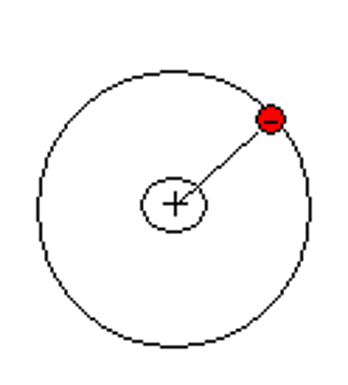{ align=right width=20% }

材料的磁性质主要由其价电子的磁矩来决定
$$ \mu = iA $$
$$ i = \dfrac{e}{T} = \dfrac{e}{2\pi r / v} = \dfrac{ev}{2\pi r} $$ 

$$ \therefore \mu = iA = \dfrac{ev}{2\pi r} \cdot \left(\pi r^2\right) = \dfrac{1}{2} erv $$

又因为我们知道电子在绕原子核旋转时会有一个角动量 $l = mvr$，所以
$$ \mu_l = \dfrac{e}{2m} l, \quad \quad \overrightarrow{\mu}_l = -\dfrac{e}{2m} \overrightarrow{l} $$

还有
$$ \overrightarrow{\mu}_L = -\dfrac{e}{2m} \overrightarrow{L} $$
其中，$\overrightarrow{L}$ 是原子所有电子的总轨道角动量，$\overrightarrow{\mu}_L$ 是原子所有电子的总轨道磁矩。

在量子的机制下，我们知道电子的轨道角动量是量子化的，
$$ L = \sqrt{L(L+1)} \dfrac{h}{2\pi} = \sqrt{L(L+1)} \hbar $$

#### 自旋磁矩

除了轨道磁矩外，粒子还具有自旋角动量 $S$ 和自旋磁矩 $\overrightarrow{\mu}_S$

| Particle      | Spin                | Type   |
|---------------|---------------------|--------|
| Electron      | $ s = \frac{1}{2} \hbar $ | Fermi  |
| Proton        | $ s = \frac{1}{2} \hbar $ | Fermi  |
| Neutron       | $ s = \frac{1}{2} \hbar $ | Fermi  |
| Deuteron      | $ s = \hbar $     | Bose   |
| Alpha Particle | $ s = 0 $        | Bose   |

可以注意到所有费米子的角动量都是 $\hbar$ 的半整数倍，而玻色子的角动量都是 $\hbar$ 的整数倍。

整个粒子的自旋磁矩为 
$$ \overrightarrow{\mu}_S = - \dfrac{e}{m} \overrightarrow{S} $$
其中 $\overrightarrow{S} = \sum \overrightarrow{s}$ 是粒子的总自旋角动量。

### 磁化强度

在电学部分，我们引入了极化强度 $P$ 来描述电介质的极化程度，而在磁学部分，我们也引入了磁化强度 $M$ 的概念来描述磁性材料的磁性质。

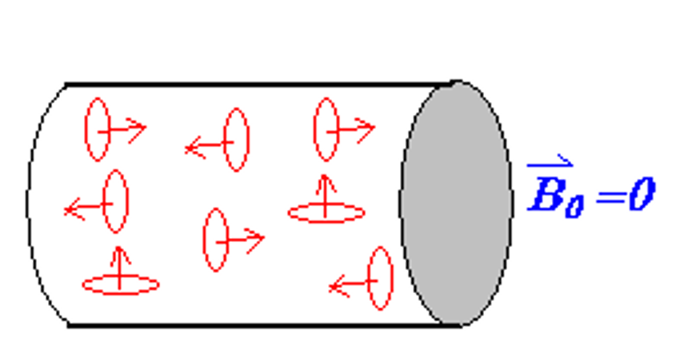{align=left width=40%}
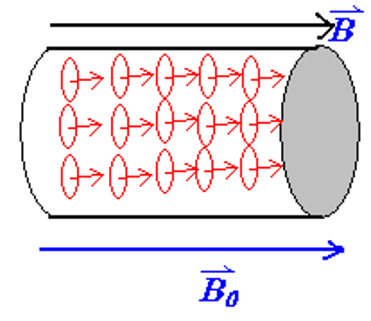{width=30%}

当铁磁材料处于外部磁场中时，其内部原本杂乱无章的分子（或原子）磁矩会在磁场的作用下，趋于方向与磁场方向一致。

从整体来看，就相当于在整个材料的外表面产生了一个大的环形束缚电流，而这个束缚电流又会在铁磁材料内部产生一个磁场，因此总的磁场是
$$ \overrightarrow{B} = \overrightarrow{B}_0 + \overrightarrow{B}'_M $$

#### 磁化强度矢量

磁化强度矢量定义为单位体积内磁矩的矢量和，即
$$ \overrightarrow{M} = \dfrac{\sum \overrightarrow{\mu_m}}{\Delta V} $$

!!! recall "极化强度矢量"
    回忆极化强度矢量的定义和性质，我们有
    $$ \overrightarrow{P} = \dfrac{\sum \overrightarrow{p}}{\Delta V} $$
    $$ \oiint \overrightarrow{P} \cdot d\overrightarrow{A} = -\sum q' $$
    $$ \overrightarrow{P} \cdot \overrightarrow{n} = \sigma'_e $$

很自然地，我们希望磁化强度矢量也具有类似于极化强度矢量的性质，即
$$ \oiint \overrightarrow{M} \cdot d\overrightarrow{l} = \sum i_{in} $$
$$ \overrightarrow{M} \times \overrightarrow{n} = \overrightarrow{j}' $$

{ align=right width=27% }

右图中，红色部分时环绕在磁材料表面的电流，电流面密度为
$$ j' = \dfrac{i'}{\Delta z} $$
在这里我们只需要除以 $\Delta z$ 是因为在我们用虚线框住的范围内，$y$ 方向上是没有电流的。

$$ \Delta m = i' \cdot \Delta A = j' \Delta x \Delta y \Delta z $$

$$ M = \frac{\Delta m}{\Delta V} = j' $$

$$ M \cdot \Delta z = i' $$

!!! tip "非均匀磁化"
    对于非均匀磁化，可以将其分割成许多小块，这样每一小块都可以认为是均匀磁化的，从而可以得到整体的磁化强度。

    <figure>
        
    </figure>

    $$ i'_1 = i_2 - i_1 = (M_2 - M_1) \cdot \Delta z $$ 

    $$ i'_2 = i_3 - i_2 = (M_3 - M_2) \cdot \Delta z $$

    $$ i'_3 = i_4 - i_3 = (M_4 - M_3) \cdot \Delta z $$

    $$ \therefore i'_1 + i'_2 + i'_3 = (M_4 - M_1) \cdot \Delta z = \sum_{inloop} i' $$

    $$ \oint \overrightarrow{M} \cdot d\overrightarrow{l} = (M_4 - M_1) \cdot \Delta z = \sum_{inloop} i' $$

    $$ \oint \overrightarrow{M} \cdot d\overrightarrow{l} = \sum_{inloop} i' $$

### 磁场强度

由磁场的环路定理，我们知道
$$ \oint_L \overrightarrow{B} \cdot d\overrightarrow{l} = \mu_0 \sum_{inL} (i_0 + i') = \mu_0 \sum_{inL} i_0 + \mu_0 \oint_L \overrightarrow{M} \cdot d\overrightarrow{l}$$
于是
$$ \oint_L (\dfrac{\overrightarrow{B}}{\mu_0} - \overrightarrow{M}) \cdot d\overrightarrow{l} = \sum_{inL} i_0 $$

因此我们可以定义磁场强度为
$$ \overrightarrow{H} = \dfrac{\overrightarrow{B}}{\mu_0} - \overrightarrow{M} $$
$$ \oint_L \overrightarrow{H} \cdot d\overrightarrow{l} = \sum_{inL} i_0 $$

磁场强度 $\overrightarrow{H}$ 的单位是奥斯特 Os,安培每米（A/m）。

!!! note
    在真空中，有
    $$ \overrightarrow{M} = 0, \quad \overrightarrow{H} = \dfrac{\overrightarrow{B}}{\mu_0}, \quad \overrightarrow{B} = \mu_0 \overrightarrow{H} $$

### 磁化强度、磁场强度与磁感应强度的关系

$$ \overrightarrow{M} = \chi_m \overrightarrow{H} $$

$$ \overrightarrow{B} = \kappa_m \mu_0 \overrightarrow{H} $$

由于
$$ \overrightarrow{B} = \mu_0 (\overrightarrow{H} + \overrightarrow{M}) = \mu_0 (1 + \chi_m) \overrightarrow{H} = \kappa_m \mu_0 \overrightarrow{H} $$
$$ \therefore \kappa_m = 1 + \chi_m $$
其中，$\chi_m$ 是磁化率，$\kappa_m$ 是磁导率。

这和我们之前对介电常数和极化率的定义是一致的。$ \kappa_e = 1 + \chi_e $

!!! example 
    在螺线管中插入铁磁材料，可以让它的自感系数增大

    <figure>
        
    </figure>

    $$ \oint_L \overrightarrow{H} \cdot d\overrightarrow{l} = \sum_{inL} i_0 $$
    $$ \overrightarrow{H} \cdot \Delta \overrightarrow{l} = N i_0 \ \Rightarrow \ H = n i_0 $$

    于是磁感应强度的比值为
    $$ B = \mu_0 \kappa_m H = \mu_0 \kappa_m n i_0 = \kappa_m B_0 $$
    $$ \therefore \dfrac{B}{B_0} = \kappa_m $$

    从而
    $$ \dfrac{L}{L_0} = \dfrac{\Psi}{\Psi_0} = \kappa_m $$

!!! idea
    从这样的角度看来，磁场强度 $H$ 与电场强度 $E$，磁感应强度 $B$ 与电感应强度 $D$ 之间的关系又是比较相似的。

    $$ D = \epsilon_0 E + P = \epsilon_0 \kappa_e E $$

    $$ B = \mu_0 (H + M) = \mu_0 \kappa_m H $$

#### 磁化率与磁导率

不同类型材料的磁化率、磁导率如下表所示：

|   |顺磁|抗磁|铁磁|
|---|---|---|---|
|$\chi_m$ | 大于0但很小 ($10^{-6}$) | 小于0但绝对值远小于1 | 与磁场强度有关 |
|$\kappa_m$ | 大于1但是接近1 | 小于1但是接近1 | 与磁场强度有关($10^2 \sim 10^3$) |

#### 磁化的微观解释

- 顺磁材料（paramagnetic materials）

<figure>
    
</figure>

材料内部原本杂乱无章的磁矩会在外部磁场的作用下，材料内部的磁矩会朝向磁场方向，磁化的程度与温度有关

居里定律：
$$ \overrightarrow{M} = \chi_m \overrightarrow{H} = \dfrac{C}{T} \overrightarrow{H}, \quad \chi_m(T) = \dfrac{C}{T} $$
其中 $C$ 为居里常数，$T$为温度

因为顺磁性的磁化率很小，磁化强度也很小，所以它对总磁场的影响很小

- 抗磁材料（diamagnetic materials）

抗磁材料在没有外磁场的情况下，各电子之间的磁矩相互抵消，内部总磁矩为0

$$ \overrightarrow{\mu}_m = 0, \quad \overrightarrow{J} = 0 $$ 

$$ \frac{Ze^2}{4\pi \varepsilon_0 r^2} = m \omega_0^2 r $$

$$ \omega_0 = \left( \frac{Ze^2}{4\pi \varepsilon_0 m r^3} \right)^{1/2} $$

由于磁场对电子的洛伦兹力相比于库仑力非常小，因此它对电子的轨道半径几乎没有影响

=== " $\overrightarrow{\omega} \parallel \overrightarrow{B} $"

    $$ \frac{Ze^2}{4\pi \varepsilon_0 r^2} + e \omega rB = m \omega^2 r $$

    $$ \omega = \omega_0 + \Delta \omega $$

    $$ \Delta \omega = \frac{eB}{2m} $$

=== " $\overrightarrow{\omega} \parallel -\overrightarrow{B} $"

    $$ \frac{Ze^2}{4\pi \varepsilon_0 r^2} - e \omega rB = m \omega^2 r $$

    $$ \omega = \omega_0 - \Delta \omega $$

    $$ \Delta \omega = \frac{eB}{2m} $$

加上外磁场后，电子会受到洛伦兹力，无论最开始时电子磁矩的方向与外磁场的方向相同还是相反，即无论电子会被加速还是减速，经过分析可以发现 $\Delta \omega$ 都会产生一个与外磁场方向相反的磁矩（**抗磁**）

我们可以分析出磁矩的变化量为：
$$ \mu = iA = \frac{ev}{2\pi r} \left( \pi r^2 \right) = \frac{1}{2} evr = \frac{e r^2}{2} \omega, \quad \overrightarrow{\mu_0} = -\frac{e r^2}{2} \overrightarrow{\omega_0} $$

$$ \Delta \overrightarrow{\mu} = -\frac{e r^2}{2} \Delta \overrightarrow{\omega} = -\frac{e^2 r^2}{4m} \overrightarrow{B} $$

- 铁磁材料（ferromagnetic materials）

铁磁材料初始的磁矩 $\mu_0 \neq 0$，且近邻原子磁矩间存在强相互作用

磁化强度矢量与温度的关系为

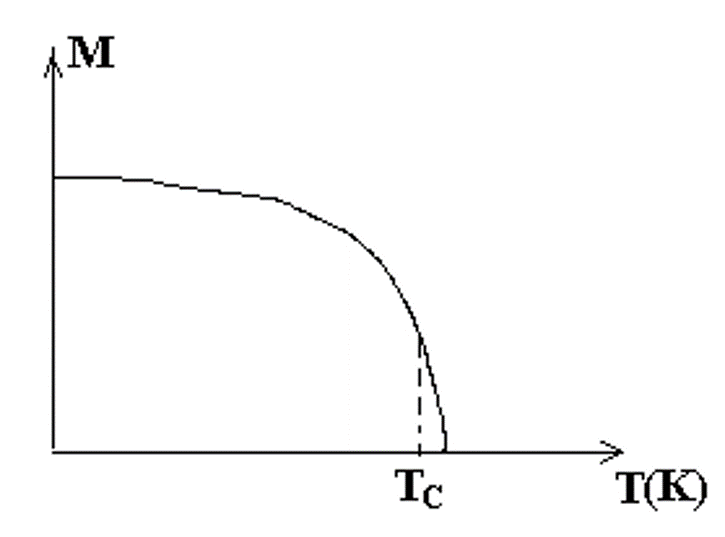{align=left width=40%}
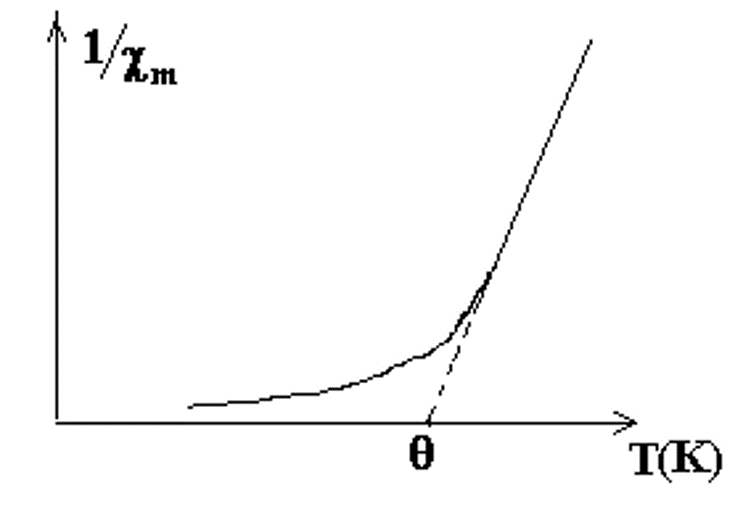{width=45%}

!!! example "磁畴"
    <figure>
        
    </figure>

    即使在没有外加磁场B的情况下，磁性材料中的磁偶极子（磁性小区域）也会倾向于在小范围内强烈地排列成特定的方向，形成所谓的“磁畴”。当施加外部磁场时，这些磁畴会重新排列，使得它们的方向一致，从而产生大的总磁化强度

    - 软铁磁体：指的是容易被磁化和退磁的磁性材料。它们在外部磁场作用下磁畴会有序排列，但磁场移除后磁畴会很快随机化。

    - 硬铁磁体：指的是不易被退磁的磁性材料，例如某些特殊合金。它们在外部磁场移除后仍能保持磁畴的有序排列，因此具有较强的磁性。

    - 永久磁体：通常指永久保持磁性的材料，例如稀土磁铁。它们的磁畴在没有外力作用下不会随机化，但可以通过施加外力（如磁场或震动）来改变磁畴的方向。

    - 居里点：是磁性材料的一个物理特性，指的是材料由铁磁性变为顺磁性的转变温度。对于铁来说，这个温度是770摄氏度。

## 磁场储存的能量

!!! note "电场的能量密度"
    之前我们学到，电容中的电场储存着能量，储存的能量与单位体积的能量密度分别为
    $$ U_e = \dfrac{1}{2} CV^2 $$
    $$ u_E = \dfrac{1}{2} \epsilon_0 E^2 $$

类似于电场，磁场中也同样储存着能量

### 螺线管中的能量

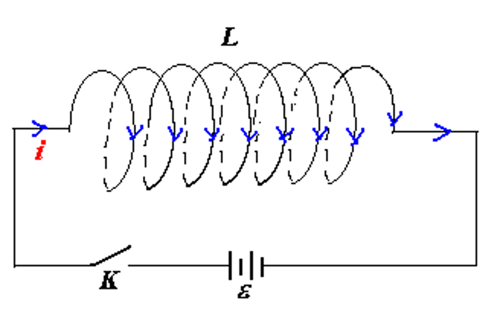{align=right width=30%}

对于一个自感系数为 $L$ 的螺线管，假设其连接电源后最大的电流为 $i_{max}$，那么
$$ dW = - \varepsilon_L dq = -\varepsilon_L i dt, \quad \varepsilon_L = -L \dfrac{di}{dt} $$
$$ \therefore dW = Li \dfrac{di}{dt} dt = Li di $$

$$ W = \int_0^{i_{max}} Li di = \dfrac{1}{2} Li_{max}^2 = \dfrac{1}{2} LI^2 $$

### 两个相连螺线管中的能量

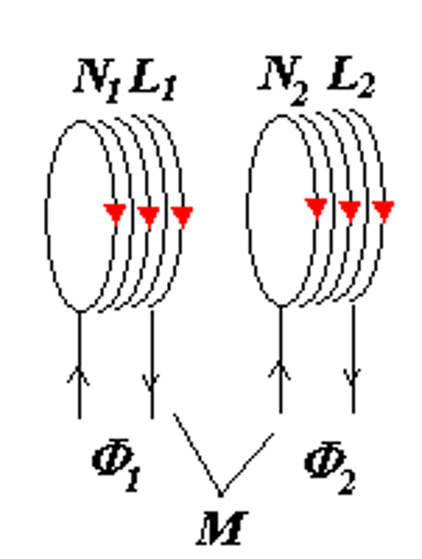{align=right width=26%}

两线圈互感所做的功为：

$$ \begin{aligned}
W &= W_1 + W_2 = -\int_0^{\infty} \varepsilon_{21} i_1 dt -\int_0^{\infty} \varepsilon_{12} i_2 dt \\\\
&= -\int_0^{\infty} ( -M_{21} i_1 \dfrac{di_2}{dt} - M_{12} i_2 \dfrac{di_1}{dt} ) dt \\\\
&= \int_0^{I_1 I_2} ( M_{21} i_1 di_2 + M_{12} i_2 di_1 ) \\\\
&= M \int_0^{I_1 I_2} d(i_1 i_2) \\\\
&= M I_1 I_2
\end{aligned} $$

所以总的磁场能为

$$ \begin{aligned}
U &= \dfrac{1}{2} L_1 I_1^2 + \dfrac{1}{2} L_2 I_2^2 + MI_1 I_2 \\
&=  \dfrac{1}{2} L_1 I_1^2 + \dfrac{1}{2} L_2 I_2^2 + \dfrac{1}{2}M_{12} I_1 I_2 + \dfrac{1}{2} M_{21} I_1 I_2
\end{aligned} $$

!!! note "$k$ 个螺线管相连所具有的总磁场能为"
    $$ U_m = \dfrac{1}{2} \sum_{i=1}^k L_i I_i^2 + \dfrac{1}{2} \sum_{i,j=1}^k M_{ij} I_i I_j $$

### 磁场的能量密度

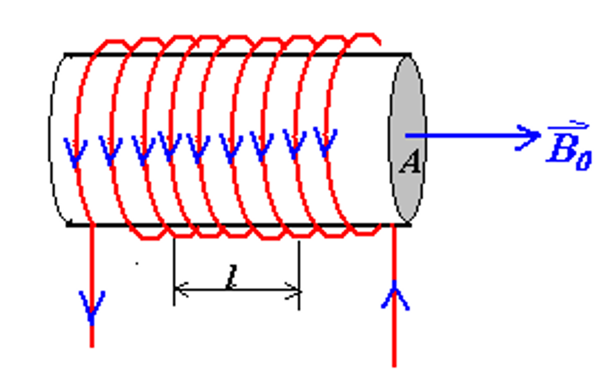{align=right width=25%}

考虑一段长度为 $l$，横截面积为 $A$ 的螺线管
$$ U = \dfrac{1}{2} LI^2 $$
$$ L = \mu_0 n^2 lA = \mu_0 n^2 V  $$
$$ B = \mu_0 n I $$

于是单位体积内的磁场的能量为

$$ \begin{aligned} 
u_B &= \dfrac{U}{V} = \dfrac{\dfrac{1}{2} LI^2}{lA} = \dfrac{\dfrac{1}{2} \mu_0 n^2 lA I^2}{lA} \\\\
&= \dfrac{1}{2} \mu_0 n^2 I^2 = \dfrac{(\mu_0 nI)^2 }{2\mu_0} = \dfrac{B^2}{2\mu_0}
\end{aligned} $$

!!! info "电场和磁场的能量密度"
    $$ u_B = \dfrac{B^2}{2\mu_0} = \dfrac{1}{2} \overrightarrow{B} \cdot \overrightarrow{H} $$

    $$ u_E= \dfrac{1}{2} \epsilon_0 E^2 = \dfrac{1}{2} \overrightarrow{D} \cdot \overrightarrow{E} $$

    两者具有相当程度的对称性。

!!! example 
    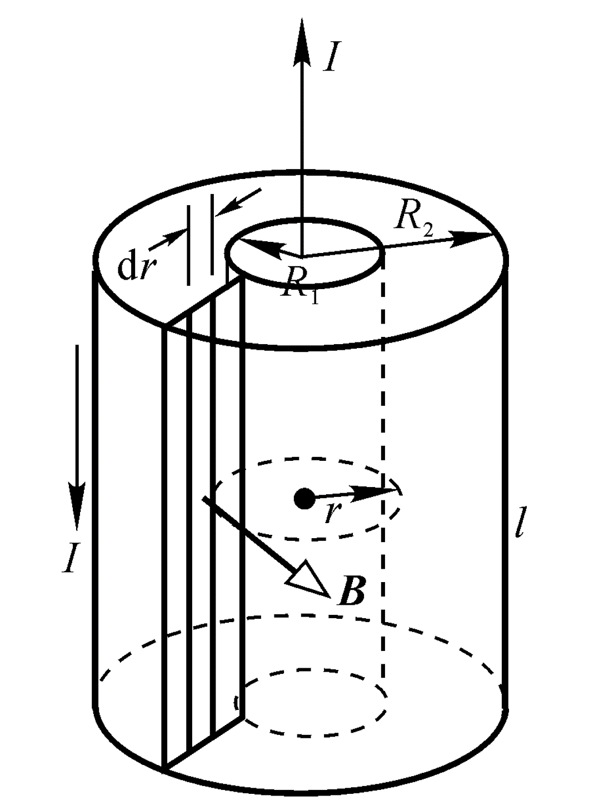{align=right width=25%}

    $$ \oint \overrightarrow{B} \cdot d\overrightarrow{l} = \mu_0 i $$

    $$ B = \dfrac{\mu_0 i}{2\pi r} $$

    $$ u_B = \dfrac{B^2}{2\mu_0} = \dfrac{1}{2\mu_0} \dfrac{\mu_0^2 i^2}{4 \pi^2 r^2} = \dfrac{\mu_0 i^2}{8 \pi^2 r^2} $$

    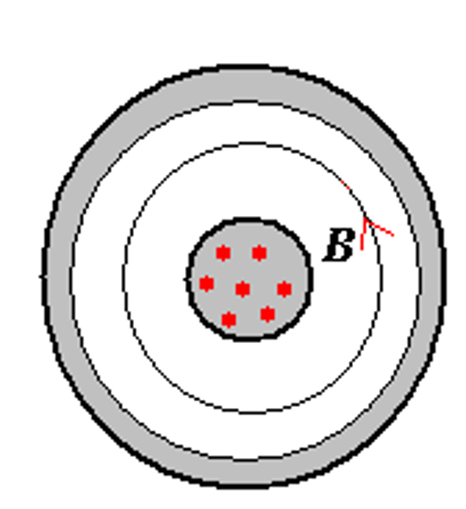{align=right width=25%}
    
    于是
    $$ dU_B = u_B \cdot 2 \pi rl \cdot dr = \dfrac{\mu_0 i^2}{8 \pi^2 r^2} \cdot 2 \pi rl \cdot dr = \dfrac{\mu_0 i^2 l}{4\pi} \dfrac{dr}{r} $$
    $$ U_B = \int_{R_1}^{R_2} dU_B = \dfrac{\mu_0 i^2 l}{4\pi} \ln \dfrac{R_2}{R_1} $$

    又因为
    $$ U_B = \dfrac{1}{2} Li^2 $$
    所以
    $$ L = \dfrac{2U_B}{i^2} = \dfrac{\mu_0 l}{2\pi} \ln \dfrac{R_2}{R_1} $$

## RL 电路

??? note "RC 电路"
    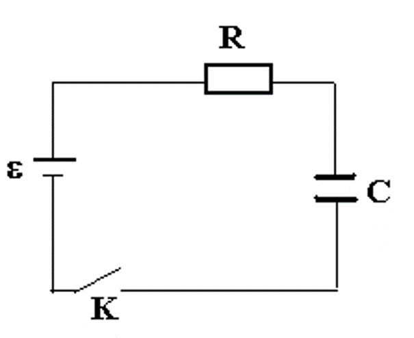{align=right width=23%}

    开关 K 闭合后
    $$ iR + \frac{q}{C} = \varepsilon $$ 
    $$ \frac{dq}{dt} + \frac{1}{RC} q = \frac{\varepsilon}{R} $$
    $$ q = C\varepsilon\left(1 - e^{-t/RC}\right) $$ 

<figure>
    
</figure>

### 开关打向 a（接通电源）

当开关打向a时，RL电路中的电流逐渐增大

$$ iR + L \frac{di}{dt} = \varepsilon $$

$$ \frac{di}{dt} = \frac{1}{L} \left( \varepsilon - iR \right) = -\frac{R}{L} \left( i - \frac{\varepsilon}{R} \right) $$

$$ i - \frac{\varepsilon}{R} = C'e^{-\frac{R}{L}t} $$

当 $t = 0$ 时，有 $i = 0$，$ \therefore C' = -\frac{\varepsilon}{R} $

所以
$$ i = \frac{\varepsilon}{R}\left(1 - e^{-\frac{R}{L}t}\right) = \frac{\varepsilon}{R}\left(1 - e^{-\frac{t}{\tau_L}}\right) $$
其中，$ \tau_L = \frac{L}{R} $ 被称为感应时间常数 

所以螺线管部分两端的电势差为
$$
V_L = -L \frac{di}{dt} = -\varepsilon e^{-\frac{t}{\tau_L}}
$$

!!! info "电流与螺线管两端的电势差随时间的变化"
    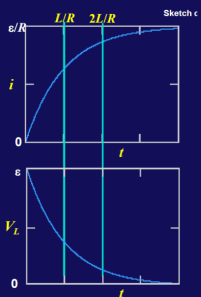{align=right width=25%}    

    - 电流：$ i = \frac{\varepsilon}{R}\left(1 - e^{-\frac{t}{\tau_L}}\right) $

        最大电流为 $\frac{\varepsilon}{R}$
        
        当 $t=\frac{L}{R}$ 时，电流约为最大电流的63%

    - 电势差：$ V_L = -L \frac{di}{dt} = -\varepsilon e^{-\frac{t}{\tau_L}} $

        最大电势差为 $\varepsilon$

        当 $t=\frac{L}{R}$ 时，电势差约为最大电势差的37%

### 开关打向 b（不接通电源）

当不接通电源时，螺线管中会产生一个阻碍电流减小的自感电动势，作用相当于一个不断衰弱的电源

$$ iR + L \frac{di}{dt} = 0 $$

$$ \frac{di}{dt} = -\frac{R}{L}i $$

$$ \Rightarrow i = i_0 e^{-\frac{R}{L}t} $$

其中 $c$ 是一个常数。再将 $t=0$, $i=\frac{\varepsilon}{R}$ 代入，得到 
$$ i = \dfrac{\varepsilon}{R}e^{-\frac{R}{L}t} $$

$$ V = L\dfrac{di}{dt} = -\varepsilon e^{-\frac{R}{L}t} $$

!!! info "电流与螺线管两端的电势差随时间的变化"
    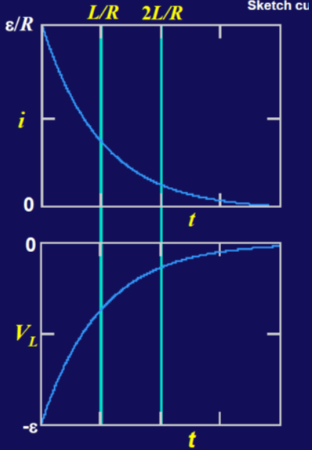{align=right width=25%}    

    - 电流：$ i = \frac{\varepsilon}{R} e^{-\frac{t}{\tau_L}} $

        最大电流为 $\frac{\varepsilon}{R}$
        
        当 $t=\frac{L}{R}$ 时，电流约为最大电流的37%

    - 电势差：$ V_L = -L \frac{di}{dt} = -\varepsilon e^{-\frac{t}{\tau_L}} $

        最大电势差为 $-\varepsilon$

        当 $t=\frac{L}{R}$ 时，电势差约为最大电势差的37%

## 电磁振荡

<figure>
    
</figure>

在LC电路中，电容器和线圈的能量不断地相互转换，即电场能与磁场能不断地相互转换，这种现象被称为电磁振荡。

!!! tip "与简谐振动的类比"
    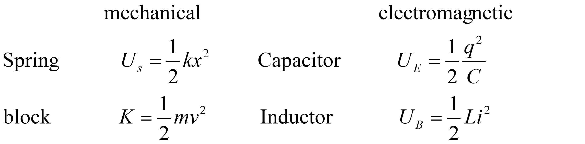{align=center width=50%}

    电磁振荡可以与简谐振动中的动能和势能相互转换进行类比。

    我们知道简谐振动的频率为 
    $$\omega = \sqrt{\dfrac{k}{m}}$$
    因此电磁振荡的频率为 
    $$\omega = \dfrac{1}{\sqrt{LC}}$$

??? proof
    $$ U = U_B + U_E = \frac{1}{2} Li^2 + \frac{1}{2} \frac{q^2}{C} $$

    $$ \frac{dU}{dt} = Li \frac{di}{dt} + \frac{q}{C} \frac{dq}{dt} = Li \frac{d^2 q}{dt^2} + \frac{q}{C} i = 0 $$

    $$ \frac{d^2 q}{dt^2} + \frac{1}{LC} q = 0 $$

    $$ \left( \frac{d^2 x}{dt^2} + \frac{k}{m} x = 0 \right) $$

    $$ \omega = \sqrt{\frac{k}{m}} = \frac{1}{\sqrt{LC}} $$

### 阻尼振动

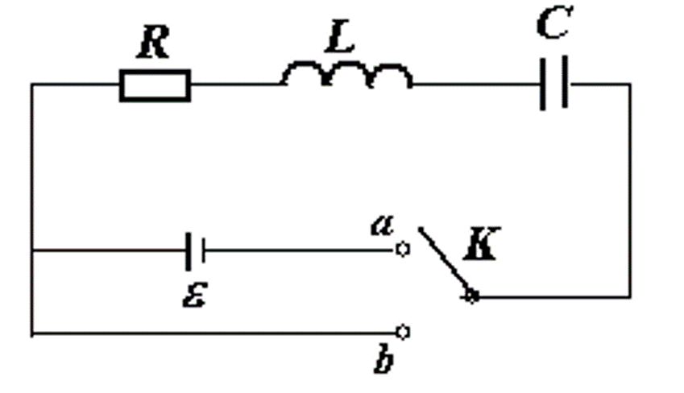{align=right width=25%}

在 RLC 电路中，除了电容与线圈的能量转换外，还有电阻的存在。电阻在电流中会发热，导致能量不断损耗，因此电磁振荡会逐渐衰减，这种现象被称为阻尼振动。

对于右图中接通电源和不接通电源两种情况，我们有
$$ L \frac{di}{dt} + iR + \frac{q}{C} = 
\begin{cases} 
\varepsilon & \text{K} \to a \\ 
0 & \text{K} \to b 
\end{cases} $$

再带入 $i=\frac{dq}{dt}$，有
$$ L \frac{d^2 q}{dt^2} + R \frac{dq}{dt} + \frac{q}{C} =
\begin{cases}
\varepsilon & \text{K} \to a \\
0 & \text{K} \to b
\end{cases} $$

=== "过阻尼"

    <table><tr>
    <td> 
 
Charging
 
</td>
    <td> 
 
Discharging
 
</td>
    </tr></table>

    当 $ \lambda^2 = \frac{b^2}{4ac} = \cfrac{R^2}{4L \cdot \cfrac{1}{C} } = \frac{R^2 C}{4L} > 1 $ 时，电路为过阻尼电路，电路不会发生电磁震荡，电荷 $q$ 随时间的变化为
    $$ q = e^{-\frac{R}{2L} t} (Ae^{ \sqrt{ \frac{R^2}{4L^2} - \frac{1}{LC} } t } + Be^{ -\sqrt{ \frac{R^2}{4L^2} - \frac{1}{LC} } t }) + C\varepsilon $$

=== "临界阻尼"

    <table><tr>
    <td> 
 
Charging
 
</td>
    <td> 
 
Discharging
 
</td>
    </tr></table>

    当 $ \lambda^2 = \dfrac{R^2 C}{4L} = 1 $ 时，为临界阻尼，也不会发生电磁震荡，并且此时电荷变化的速度最快。
    $$ q = e^{-\frac{R}{2L} t} (A + Bt) + C\varepsilon $$

    临界阻尼的图像与过阻尼相似，但是电荷变化的速度更快。

=== "阻尼振荡"

    <figure>
        
    </figure>

    当 $ \lambda^2 = \dfrac{R^2 C}{4L} < 1 $ 时，电路为欠阻尼电路，电路会发生阻尼震荡，做振幅不断减小的振动
    $$ \beta = i\omega = i\sqrt{\frac{1}{LC} - \frac{R^2}{4L^2}} = i\sqrt{\omega_0^2 - \frac{R^2}{4L^2}} $$
    
    电荷 $q$ 随时间的变化为
    $$ q = q_m e^{-\frac{R}{2L} t} (\cos \omega t + \varphi) + C\varepsilon $$
    其中角频率 $\omega = \sqrt{\omega_0^2 - \frac{R^2}{4L^2}} = \sqrt{\frac{1}{LC} - \frac{R^2}{4L^2}}$
    当 $R$ 很小时，$\omega \approx \sqrt{\frac{1}{LC}} = \omega_0$

---

### 受迫振动

<figure>
    
</figure>

类似于简谐振动中的受迫振动，当 RLC 电路中有交流电源时，电路中的电流和电荷会受到周期性的外力作用，从而产生受迫振动。

$$ \text{IF} \varepsilon = \varepsilon_m \cos \omega'' t $$

$$ q = q_m e^{- \frac{R}{2L} t} \cos (\omega t + \varphi) + C\varepsilon $$

当 $ \omega'' = \omega $ 时，即外加的交流电源频率与 RLC 电路的固有频率相同时，电路中的电流和电荷会达到最大值（共振）。
