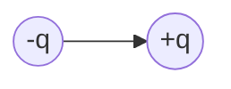

# 电磁学

## Chap25 电荷和库仑定律

- proton(质子)，electron(电子)，neutron(中子)
- quark(夸克)： $-\dfrac{1}{3}$ 或 $+\dfrac{2}{3}$

$$ F_{elec} = \dfrac{1}{4 \pi \epsilon_0} \dfrac{q_1q_2}{r^2} $$

- Insulators (绝缘体)
- Conductors (导体)
- Semiconductors (半导体)
- Superconductors (超导体)

### 电荷密度

有三种这样的密度：

1. Linear Charge density(线电荷密度) $\lambda = \dfrac{q}{L}$
2. Surface Charge Density(面电荷密度) $\sigma = \dfrac{q}{A}$
3. Volume Charge Density(体电荷密度) $\rho = \dfrac{q}{V}$

#### A Ring of Charge

{ align=left, width=250px }

推导：
$$ \lambda = \dfrac{q}{2\pi R}$$
$$ dF = \dfrac{1}{4\pi\epsilon_0} \dfrac{q_0dq}{r^2} = \dfrac{1}{4\pi\epsilon_0} \dfrac{q_0\lambda Rd\Phi}{(z^2+R^2)} $$

$$
\begin{aligned}
F_z &= \int dF_z = \int dF\cos\theta \\\\
&= \int \dfrac{1}{4\pi\epsilon_0} \dfrac{q_0\lambda Rd\Phi}{z^2+R^2} \dfrac{z}{\sqrt{z^2+R^2}}\\\\
&= \dfrac{1}{4\pi\epsilon_0} \dfrac{q_0\lambda Rz}{(z^2+R^2)^{3/2}} \int_0^{2\pi} d\Phi \\\\
&= \dfrac{1}{4\pi\epsilon_0} \dfrac{q_0qz}{(z^2+R^2)^{3/2}} \\\\
\end{aligned}
$$

从而推得
$$ \vec{F} = \dfrac{1}{4\pi\epsilon_0} \dfrac{q_0qz}{(z^2+R^2)^{3/2}} \hat{k}$$

当$z >> R$时，有
$$ \vec{F} \approx \dfrac{1}{4\pi\epsilon_0} \dfrac{q_0q}{z^2} \hat{k}$$

#### A Disk of Charge

{ align=left, width=250px }

推导：
$$ \sigma = \dfrac{q}{\pi R^2} $$
$$ dq = \sigma dA = \sigma(2\pi \omega d\omega) = 2\pi\sigma\omega d\omega $$
$$ dF_z = \dfrac{1}{4\pi\epsilon_0} \dfrac{q_0(2\pi\sigma\omega d\omega)z}{(z^2+\omega^2)^{3/2}} $$

$$
\begin{aligned}
F_z &= \dfrac{1}{4\pi\epsilon_0} q_02\pi\sigma z \int_0^R \dfrac{\omega d\omega}{(z^2+\omega^2)^{3/2}} \\\\
&= \dfrac{1}{4\pi\epsilon_0} \dfrac{2q_0q}{R^2} (1 - \dfrac{z}{\sqrt{z^2+R^2}}) \\\\
\end{aligned}
$$

### 电荷守恒

实验表明，在一个封闭系统中，任何物理过程都不会改变电荷总量

!!! example
    \\[ e^+ + e^- \rightarrow 2\gamma \\]
    \\[ n \rightarrow p + e_- + \tilde{\nu}_e \\]
    \\[ \pi^0 \rightarrow 2\gamma \\]

## Chap26 电场

Coulomb's Law:
$$ \vec{F} = \dfrac{1}{4\pi\epsilon_0} \dfrac{Q_0}{r^2} \hat{r} $$

$$ \vec{E} = \lim_{q_0 \rightarrow 0} \dfrac{\vec{F}}{q_0} $$

### Dipole（电偶极矩）

定义：两个相反等量电荷之间的距离乘以电荷量，$\vec{p} = q\vec{d}$

**在x轴上的点**

{ align=left, width=300px }

$$ E_x(x,0) =0 $$

$$ E_y(x,0) = -2 \dfrac{1}{4\pi\epsilon_0} \dfrac{Q}{r^2} \sin\theta $$

又有 $\sin\theta = \dfrac{a}{r}$, $r^2 = x^2+a^2$, 从而
$$ E_y(x,0) = -2 \dfrac{1}{4\pi\epsilon_0} \dfrac{Qa}{(x^2+a^2)^{3/2}} $$

**在y轴上的点**

{ align=left, width=300px }

$$ E_x(0,y) =0 $$

$$\begin{aligned}
E_x(0,y) &= \dfrac{Q}{4\pi\epsilon_0} \left( \dfrac{1}{(y-a)^2} - \dfrac{1}{(y+a)^2} \right) \\\\
&= \dfrac{Q}{4\pi\epsilon_0}  \dfrac{4ay}{y^4 \left( 1-\dfrac{a^2}{y^2} \right)^2}
\end{aligned}$$

**沿坐标轴的点**，且$r >> a$

沿x轴：
$$ E_x(r,0) = 0 $$
$$ E_y(r,0) = -2 \dfrac{1}{4\pi\epsilon_0} \dfrac{Qa}{(r^2+a^2)^{3/2}} $$

For $ r >> a $, 
$$ E_y(r,0) \approx -2 \dfrac{1}{4\pi\epsilon_0} \dfrac{Qa}{r^3} $$

沿y轴：
$$
E_x(0,r) = 0
$$
$$
E_y(0,r) = \dfrac{Q}{4\pi\epsilon_0}  \dfrac{4ar}{r^4 \left( 1-\dfrac{a^2}{r^2} \right)^2}
$$

For $r >> a$,
$$ E_y(0,r) \approx 4\dfrac{1}{4\pi\epsilon_0}  \dfrac{Qa}{r^3} $$
此时我们可以得到
$$ E \propto \dfrac{1}{r^3} $$

### Infinite Line of Charge

{ align=left, width=350px }

$$ dE = \dfrac{1}{4\pi\epsilon_0} \dfrac{dq}{r'^2} , dq = \lambda dx, r' =\dfrac{r}{\cos\theta} $$

Therefore,
$$ dE = \dfrac{1}{4\pi\epsilon_0} \dfrac{\lambda \cos^2 \theta dx}{r^2} $$

又因为
$$ x = r\tan \theta $$
$$ dx = r\sec^2 \theta d\theta $$
于是最终得到
$$ dE = \dfrac{1}{4\pi\epsilon_0} \dfrac{\lambda  d\theta}{r} $$

Components:
$$ dE_x = dE \sin\theta = \dfrac{1}{4\pi\epsilon_0} \dfrac{\lambda d\theta}{r} \sin\theta $$
$$ dE_y = dE \cos\theta = \dfrac{1}{4\pi\epsilon_0} \dfrac{\lambda d\theta}{r} \cos\theta $$
$$ E_x = \int dE_x = -\dfrac{1}{4\pi\epsilon_0} \dfrac{\lambda}{r} \int_{-\pi /2}^{{+\pi /2}} \sin\theta d\theta = 0 $$
$$ E_y = \int dE_y = \dfrac{1}{4\pi\epsilon_0} \dfrac{\lambda}{r} \int_{-\pi /2}^{{+\pi /2}} \cos\theta d\theta = \dfrac{\lambda}{2\pi\epsilon_0 r} $$

### 总结

- Dipole: $E \propto \dfrac{1}{r^3}$
- Point Charge: $E \propto \dfrac{1}{r^2}$
- Infinite Line of Charge: $E \propto \dfrac{1}{r} $

### A Uniform Ring of Charge

{ align=left, width=300px }

$$ dE = \dfrac{\lambda ds}{4\pi\epsilon_0} = \dfrac{\lambda ds}{4\pi\epsilon_0(z^2+R^2)} $$

$$ E_x = E_y = 0, E_z \neq 0 $$

$$\begin{aligned}
dE_z &= dE\cos\theta = \dfrac{\lambda ds}{4\pi\epsilon_0(z^2+R^2)} \dfrac{z}{(z^2+R^2)^{1/2}}  \\\\
&= \dfrac{z\lambda ds}{4\pi\epsilon_0(z^2+R^2)^{3/2}}
\end{aligned}$$

$$\begin{aligned}
E_z &= \int dE_z = \int \dfrac{z\lambda ds}{4\pi\epsilon_0(z^2+R^2)^{3/2}} \\\\
&= \dfrac{zq}{4\pi\epsilon_0(z^2+R^2)^{3/2}} \\\\
\end{aligned}$$

if $z >> R$, then $E_z \approx \dfrac{q}{4\pi\epsilon_0z^2}$

if $z \rightarrow 0$, then $E_z \approx 0$

### A Uniform Disk of Charge

{ align=left, width=250px }

$$ dq = 2\pi\omega·d\omega·\sigma $$

$$ dE = \dfrac{zdq}{4\pi\epsilon_0(z^2+\omega^2)^{3/2}} = \dfrac{z·2\pi\sigma\theta d\theta}{4\pi\epsilon_0(z^2+\omega^2)^{3/2}} $$

$$\begin{aligned}
E &= \int dE = \dfrac{\sigma z}{2\epsilon} \int_0^R \dfrac{\omega d\omega}{(z^2+\omega^2)^{3/2}} \\\\
&= \dfrac{\sigma z}{2\epsilon} \int_0^R \dfrac{d(z^2+\omega^2)}{(z^2+\omega^2)^{3/2}} \\\\
&= \dfrac{\sigma}{2\epsilon} \left( 1- \dfrac{1}{\sqrt{1+\dfrac{R^2}{z^2}}} \right)
\end{aligned}$$

- if $R >> z$， $\dfrac{1}{\sqrt{1+\dfrac{R^2}{z^2}}} \rightarrow 0$, so $E = \dfrac{\sigma}{2\epsilon}$ (Infinite sheet)

- if $z >> R$， $\dfrac{1}{\sqrt{1+\dfrac{R^2}{z^2}}} = 1 - \dfrac{1}{2} \dfrac{R^2}{z^2} + \dfrac{3}{8} \dfrac{R^4}{z^4} - \cdots$\\\\
so $E = \dfrac{\sigma}{2\epsilon} \left( 1- \dfrac{1}{2} \dfrac{R^2}{z^2} + \dfrac{3}{8} \dfrac{R^4}{z^4} - \cdots \right) \propto \dfrac{\sigma}{2\epsilon} \dfrac{1}{2} \dfrac{R^2}{z^2} = \dfrac{q}{4\pi\epsilon_0 z^2} $

### A Dipole in an Electric field

{ align=left, width=250px }

电偶极矩矢量：$ \vec{p} = q\vec{d} $

{ align=left, width=200px }

$$ \vec{\tau} = \vec{p} \times \vec{E} $$