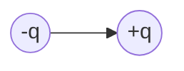

# 电磁学

## Chap25 电荷和库仑定律

- proton(质子)，electron(电子)，neutron(中子)
- quark(夸克)： $-\dfrac{1}{3}$ 或 $+\dfrac{2}{3}$

$$ F_{elec} = \dfrac{1}{4 \pi \epsilon_0} \dfrac{q_1q_2}{r^2} $$

- Insulators (绝缘体)
- Conductors (导体)
- Semiconductors (半导体)
- Superconductors (超导体)

### 电荷密度

有三种这样的密度：

1. Linear Charge density(线电荷密度) $\lambda = \dfrac{q}{L}$
2. Surface Charge Density(面电荷密度) $\sigma = \dfrac{q}{A}$
3. Volume Charge Density(体电荷密度) $\rho = \dfrac{q}{V}$

#### A Ring of Charge

{ align=left width=225px }

推导：
$$ \lambda = \dfrac{q}{2\pi R}$$
$$ dF = \dfrac{1}{4\pi\epsilon_0} \dfrac{q_0dq}{r^2} = \dfrac{1}{4\pi\epsilon_0} \dfrac{q_0\lambda Rd\Phi}{(z^2+R^2)} $$
$$
\begin{aligned}
F_z &= \int dF_z = \int dF\cos\theta \\\\
&= \int \dfrac{1}{4\pi\epsilon_0} \dfrac{q_0\lambda Rd\Phi}{z^2+R^2} \dfrac{z}{\sqrt{z^2+R^2}}\\\\
&= \dfrac{1}{4\pi\epsilon_0} \dfrac{q_0\lambda Rz}{(z^2+R^2)^{3/2}} \int_0^{2\pi} d\Phi \\\\
&= \dfrac{1}{4\pi\epsilon_0} \dfrac{q_0qz}{(z^2+R^2)^{3/2}} \\\\
\end{aligned}
$$

从而推得
$$ \boldsymbol{F} = \dfrac{1}{4\pi\epsilon_0} \dfrac{q_0qz}{(z^2+R^2)^{3/2}} \hat{k}$$

当$z >> R$时，有
$$ \boldsymbol{F} \approx \dfrac{1}{4\pi\epsilon_0} \dfrac{q_0q}{z^2} \hat{k}$$

#### A Disk of Charge

{ align=left width=250px }

推导：
$$ \sigma = \dfrac{q}{\pi R^2} $$
$$ dq = \sigma dA = \sigma(2\pi \omega d\omega) = 2\pi\sigma\omega d\omega $$
$$ dF_z = \dfrac{1}{4\pi\epsilon_0} \dfrac{q_0(2\pi\sigma\omega d\omega)z}{(z^2+\omega^2)^{3/2}} $$

$$
\begin{aligned}
F_z &= \dfrac{1}{4\pi\epsilon_0} q_02\pi\sigma z \int_0^R \dfrac{\omega d\omega}{(z^2+\omega^2)^{3/2}} \\\\
&= \dfrac{1}{4\pi\epsilon_0} \dfrac{2q_0q}{R^2} (1 - \dfrac{z}{\sqrt{z^2+R^2}}) \\\\
\end{aligned}
$$

### 电荷守恒

实验表明，在一个封闭系统中，任何物理过程都不会改变电荷总量

!!! example
    \\[ e^+ + e^- \rightarrow 2\gamma \\]
    \\[ n \rightarrow p + e_- + \tilde{\nu}_e \\]
    \\[ \pi^0 \rightarrow 2\gamma \\]

---

## Chap26 电场

Coulomb's Law:
$$ \boldsymbol{F} = \dfrac{1}{4\pi\epsilon_0} \dfrac{Q_0}{r^2} \hat{r} $$
$$ \boldsymbol{E} = \lim_{q_0 \rightarrow 0} \dfrac{\boldsymbol{F}}{q_0} $$

### Dipole（电偶极矩）

定义：两个相反等量电荷之间的距离乘以电荷量，$\boldsymbol{p} = q\boldsymbol{d}$

!!! note "坐标轴上的电偶极矩"
    === "在x轴上的点"
        { align=left width=250px }
        $$ E_x(x,0) = 0 $$

        $$ E_y(x,0) = -2 \dfrac{1}{4\pi\epsilon_0} \dfrac{Q}{r^2} \sin\theta $$

        又有 $\sin\theta = \dfrac{a}{r}$, $r^2 = x^2+a^2$, 从而
        $$ E_y(x,0) = -2 \dfrac{1}{4\pi\epsilon_0} \dfrac{Qa}{(x^2+a^2)^{3/2}} $$

    === "在y轴上的点"
        { align=left width=250px }
        $$ E_x(0,y) =0 $$

        $$\begin{aligned}
        E_x(0,y) &= \dfrac{Q}{4\pi\epsilon_0} \left( \dfrac{1}{(y-a)^2} - \dfrac{1}{(y+a)^2} \right) \\\\
        &= \dfrac{Q}{4\pi\epsilon_0}  \dfrac{4ay}{y^4 \left( 1-\dfrac{a^2}{y^2} \right)^2}
        \end{aligned}$$

    === "沿坐标轴的点"
        由$r >> a$

        沿x轴：
        $$ E_x(r,0) = 0 $$
        $$ E_y(r,0) = -2 \dfrac{1}{4\pi\epsilon_0} \dfrac{Qa}{(r^2+a^2)^{3/2}} $$

        For $ r >> a $, 
        $$ E_y(r,0) \approx -2 \dfrac{1}{4\pi\epsilon_0} \dfrac{Qa}{r^3} $$

        沿y轴：
        $$
        E_x(0,r) = 0
        $$
        $$
        E_y(0,r) = \dfrac{Q}{4\pi\epsilon_0}  \dfrac{4ar}{r^4 \left( 1-\dfrac{a^2}{r^2} \right)^2}
        $$

For $r >> a$,
$$ E_y(0,r) \approx 4\dfrac{1}{4\pi\epsilon_0}  \dfrac{Qa}{r^3} $$
此时我们可以得到
$$ E \propto \dfrac{1}{r^3} $$

### Infinite Line of Charge

{ width=380px }

$$ dE = \dfrac{1}{4\pi\epsilon_0} \dfrac{dq}{r'^2} ,\ dq = \lambda dx, \  r' =\dfrac{r}{\cos\theta} $$

Therefore,
$$ dE = \dfrac{1}{4\pi\epsilon_0} \dfrac{\lambda \cos^2 \theta dx}{r^2} $$

又因为
$$ x = r\tan \theta $$
$$ dx = r\sec^2 \theta d\theta $$
于是最终得到
$$ dE = \dfrac{1}{4\pi\epsilon_0} \dfrac{\lambda  d\theta}{r} $$

Components:
$$ dE_x = dE \sin\theta = \dfrac{1}{4\pi\epsilon_0} \dfrac{\lambda d\theta}{r} \sin\theta $$
$$ dE_y = dE \cos\theta = \dfrac{1}{4\pi\epsilon_0} \dfrac{\lambda d\theta}{r} \cos\theta $$
$$ E_x = \int dE_x = -\dfrac{1}{4\pi\epsilon_0} \dfrac{\lambda}{r} \int_{-\pi /2}^{{+\pi /2}} \sin\theta d\theta = 0 $$
$$ E_y = \int dE_y = \dfrac{1}{4\pi\epsilon_0} \dfrac{\lambda}{r} \int_{-\pi /2}^{{+\pi /2}} \cos\theta d\theta = \dfrac{\lambda}{2\pi\epsilon_0 r} $$

### 总结

- Dipole: $E \propto \dfrac{1}{r^3}$
- Point Charge: $E \propto \dfrac{1}{r^2}$
- Infinite Line of Charge: $E \propto \dfrac{1}{r} $

---

### A Uniform Ring of Charge

{ align=left width=250px }
$$ dE = \dfrac{\lambda ds}{4\pi\epsilon_0} = \dfrac{\lambda ds}{4\pi\epsilon_0(z^2+R^2)} $$

$$ E_x = E_y = 0, E_z \neq 0 $$

$$\begin{aligned}
dE_z &= dE\cos\theta = \dfrac{\lambda ds}{4\pi\epsilon_0(z^2+R^2)} \dfrac{z}{(z^2+R^2)^{1/2}}  \\\\
&= \dfrac{z\lambda ds}{4\pi\epsilon_0(z^2+R^2)^{3/2}}
\end{aligned}$$

$$\begin{aligned}
E_z &= \int dE_z = \int \dfrac{z\lambda ds}{4\pi\epsilon_0(z^2+R^2)^{3/2}} \\\\
&= \dfrac{zq}{4\pi\epsilon_0(z^2+R^2)^{3/2}} \\\\
\end{aligned}$$

if $z >> R$, then $E_z \approx \dfrac{q}{4\pi\epsilon_0z^2}$

if $z \rightarrow 0$, then $E_z \approx 0$

### A Uniform Disk of Charge

{ align=left width=250px }
$$ dq = 2\pi\omega·d\omega·\sigma $$

$$ dE = \dfrac{zdq}{4\pi\epsilon_0(z^2+\omega^2)^{3/2}} = \dfrac{z·2\pi\sigma\theta d\theta}{4\pi\epsilon_0(z^2+\omega^2)^{3/2}} $$

$$\begin{aligned}
E &= \int dE = \dfrac{\sigma z}{2\epsilon} \int_0^R \dfrac{\omega d\omega}{(z^2+\omega^2)^{3/2}} \\\\
&= \dfrac{\sigma z}{2\epsilon} \int_0^R \dfrac{d(z^2+\omega^2)}{(z^2+\omega^2)^{3/2}} \\\\
&= \dfrac{\sigma}{2\epsilon} \left( 1- \dfrac{1}{\sqrt{1+\dfrac{R^2}{z^2}}} \right)
\end{aligned}$$

- if $R >> z$， $\dfrac{1}{\sqrt{1+\dfrac{R^2}{z^2}}} \rightarrow 0$, so $E = \dfrac{\sigma}{2\epsilon}$ (Infinite sheet)

- if $z >> R$， $\dfrac{1}{\sqrt{1+\dfrac{R^2}{z^2}}} = 1 - \dfrac{1}{2} \dfrac{R^2}{z^2} + \dfrac{3}{8} \dfrac{R^4}{z^4} - \cdots$

- so $E = \dfrac{\sigma}{2\epsilon} \left( 1- \dfrac{1}{2} \dfrac{R^2}{z^2} + \dfrac{3}{8} \dfrac{R^4}{z^4} - \cdots \right) \propto \dfrac{\sigma}{2\epsilon} \dfrac{1}{2} \dfrac{R^2}{z^2} = \dfrac{q}{4\pi\epsilon_0 z^2} $

### A Dipole in an Electric field

{ align=left width=270px }

{ width=320px }

电偶极矩矢量：$ \boldsymbol{p} = q \boldsymbol{d} $
$$ \boldsymbol{\tau} = \boldsymbol{p} \times \boldsymbol{E} $$

---

## Chap27 Gauss's Law(高斯定理)

### 通量

Flux，流量，通量: $\Phi = \vec{E} \cdot \boldsymbol{A} = EA\cos\theta$

??? example "速度场的通量"
    
    
    $$\Phi = \boldsymbol{v} \cdot \boldsymbol{A} = vA\cos\theta$$

    { width=700px }

    $$ \Phi = \sum\boldsymbol{v} \cdot \boldsymbol{A} $$

    { width=300px }
    对于任意的一个闭合曲面，有

    $$\begin{aligned}
    \Phi &= \oiint \boldsymbol{v} \cdot d\boldsymbol{A} \\\\
    d\Phi &= \boldsymbol{v} \cdot d\boldsymbol{A} \\\\
    d\boldsymbol{A} &= dydz\boldsymbol{i} + dzdx\boldsymbol{j} + dxdy\boldsymbol{k} \\\\
    \boldsymbol{v} &= v_x\boldsymbol{i} + v_y\boldsymbol{j} + v_z\boldsymbol{k} \\\\
    \boldsymbol{v} \cdot d\boldsymbol{A} &= v_xdydz + v_ydzdx + v_xdxdy \\\\
    \end{aligned}$$

If there were within the volume no sources or sink of fluid.

如果在体积内没有流体的源头或汇集点，那么
$$ \Phi = \oiint \boldsymbol{v} \cdot d\boldsymbol{A} = 0 $$

If there were a source (源) within the volume:
$$ \Phi = \oiint \boldsymbol{v} \cdot d\boldsymbol{A} > 0 $$

If there were a sink of fluid:
$$ \Phi = \oiint \boldsymbol{v} \cdot d\boldsymbol{A} < 0 $$

### 电通量

Define:  electric flux $\Phi_E$ through the closed surface $A$
$$ \Phi = \sum \boldsymbol{E} \cdot \boldsymbol{A} = \oiint \boldsymbol{E} \cdot d\boldsymbol{A} $$

- 规定电通量“向外”为正，“向内”为负
- 对于一个开放曲面（不闭合），它的方向不确定，因此电通量的符号也不确定

??? example "例题"
    === "例一"
        { align=right width=150px }
        Imagine a cube of side a positioned in a region of constant electric field as shown

        Which of the following statements about the net electric flux $\Phi_E$ through the surface of this cube is true?

        - [x] A. $\Phi_E = 0$ 
        - B. Phi_E \propto 2a^2$ 
        - C. $\Phi_E \propto 6a^2$

        $$ \Phi = \sum \boldsymbol{E} \cdot \boldsymbol{A} = \oiint \boldsymbol{E} \cdot d\boldsymbol{A} $$

    === "例二"
        { align=right width=150px }
        Consider 2 spheres (of radius R and 2R) drawn around a single charge as shown.

        Which of the following statements about the net electric flux through the 2 surfaces ($\Phi_{2R}$ and $\Phi_R$) is true?
        
        - $\Phi_R < \Phi_{2R}$
        - [x] $\Phi_R = \Phi_{2R}$
        - $\Phi_R > \Phi_{2R}$

        **解析**：首先观察图片可以知道通过两个球面的电力线总数是相等的，因此电通量也是相等的。

        具体来说，根据 $ \Phi = \oiint \boldsymbol{E} \cdot d\boldsymbol{A} $，我们知道 $\boldsymbol{E} \propto r^2$ 和 $\boldsymbol{A} \propto \dfrac{1}{r^2}$，因此$r^2$和$\dfrac{1}{r^2}$就抵消了，所以在这里电通量是一个与距离无关的定值。

### Gauss' Law（高斯公式）

通过一个闭合曲面的总电通量与被这个曲面所包围的电荷量成正比

$$ \Phi = \oiint \boldsymbol{E} \cdot d\boldsymbol{A} = \Phi_E = \dfrac{q_{enclosed}}{\epsilon_0} $$

!!! example
    { align=left width=300 }

    $$ \begin{aligned}
    &a: \epsilon \oiint \boldsymbol{E} \cdot d\boldsymbol{A} = q > 0 \\\\
    &b: \epsilon \oiint \boldsymbol{E} \cdot d\boldsymbol{A} = -q < 0 \\\\
    &c: \epsilon \oiint \boldsymbol{E} \cdot d\boldsymbol{A} = q-q = 0 
    \end{aligned}$$

在利用高斯公式求解$E$时，我们需要选择一个恰当的闭合曲面，使得积分的处理较为简单

- 方向：我们可以使得闭合曲面与电场的方向垂直或平行

    - 如果 $\boldsymbol{E} \parallel d\boldsymbol{A}$，那么 $\boldsymbol{E} \cdot d\boldsymbol{A} = EdA$
    - 如果 $\boldsymbol{E} \perp d\boldsymbol{A}$，那么 $\boldsymbol{E} \cdot d\boldsymbol{A} = 0$

- 大小：当电场方向与平面垂直时，应当使得平面的任意点处电场大小$E$相等

这样一来就可以得到
$$ \oiint \boldsymbol{E} \cdot d\boldsymbol{A} = \oiint EdA = E \oiint dA = \dfrac{q_{enclosed}}{\epsilon_0} $$

这样一来就可以通过$q_{enclosed}$来求解$E$，或反之通过$E$来求解$q_{enclosed}$

我们也可以通过高斯公式来推导出库仑定律：
$$ \begin{aligned}
\oiint \boldsymbol{E} \cdot d\boldsymbol{A} &= \dfrac{Q}{\epsilon_0} \\\\
E \oiint dA &= \dfrac{Q}{\epsilon_0} \\\\
E \cdot 4\pi r^2 &= \dfrac{Q}{\epsilon_0} \\\\
E &= \dfrac{1}{4\pi\epsilon_0} \dfrac{Q}{r^2}
\end{aligned}$$

### 高斯定理的应用

#### 均匀带电球体

{ align=right width=250px }
求由一个半径为$a$，电荷密度为 $\rho (C/m^3)$ 的均匀带电球体所产生的电场强度

- **在球体外$(r > a)$**，由高斯定理可知

    $$ \oiint \boldsymbol{E} \cdot d\boldsymbol{A} = 4\pi r^2 E = \dfrac{q}{\epsilon_0} $$
    $$ q = \dfrac{4}{3}\pi a^3 \rho $$

    可以得到
    $$ E = \dfrac{\rho a^3}{3\epsilon_0 r^2} $$

    事实上利用 $E = \dfrac{1}{4\pi \epsilon_0 r^2} \dfrac{q}{r^2} $ 也可以得到相同的结果

- **在球体内$(r < a)$**，同样也由高斯定理，但此处包裹的电荷大小不再是由$a$决定

    $$ \oiint \boldsymbol{E} \cdot d\boldsymbol{A} = 4\pi r^2 E = \dfrac{q}{\epsilon_0} $$
    $$ q = \dfrac{4}{3}\pi r^3 \rho $$

    可以得到
    $$ E = \dfrac{\rho}{3\epsilon_0} r $$

根据以上分析，最终得到

{ width=400 }

#### 导体中的高斯定理

我们知道导体内部的电场大小为零，根据高斯定理可以推出其内部的电荷大小为零，说明导体的电荷只在它的表面上。

{ align=left width=300 }
{ width=200 }

要求一个带电导体产生的电场，我们可以在其外表面处取一个极小的高斯面，这样可以认为被高斯面包裹的导体表面上的电荷是均匀分布的（取足够小的高斯面后可以就认为高斯面内的导体表面是平的，从而忽略尖端带电效应）。

并且因为导体内部电场强度为0，由对称性也可以知道沿高斯面的侧面方向的电场强度也为0。
$$ \epsilon_0 \oiint \boldsymbol{E} \cdot d\boldsymbol{A} = \sigma \cdot \Delta A $$
$$ \epsilon_0 \boldsymbol{E} \boldsymbol{A} + 0 + 0 = \sigma \cdot \Delta A $$

$$ E = \dfrac{\sigma}{\epsilon_0} $$

#### 无限线电荷

由对称性可知只有在垂直于线电荷的方向上有电场强度，因此我们可以取一个半径为$r$，长度为$h$的圆柱形高斯面，这样可以得到

{ align=right width=300 }
应用高斯定理

- 在两端：$\boldsymbol{E} \cdot d\boldsymbol{A} = 0$
- 在侧面：
    $$ \oiint \boldsymbol{E} \cdot d\boldsymbol{A} = 2\pi rhE $$
    $$ q = \lambda h $$
    得到
    $$ E = \dfrac{\lambda}{2\pi \epsilon_0 r} $$

于是我们就得到了和先前使用库仑定律推导相同的结论。

??? example
    { align=right width=250 }
    密度为$\lambda$的无限长线电荷被放在空心圆柱的中轴线上，空心圆柱的内径为$r_i = a$, 外径为$r_o = b$，求空心圆柱内外的电场强度。

    空心圆柱外表面的电荷密度 $\sigma _o(C/m^2)$ 是多少？

    - A. $\sigma_o = -\dfrac{\lambda}{2\pi b}$
    - B. $\sigma_o = 0$
    - [x] C. $\sigma_o = +\dfrac{\lambda}{2\pi b}$

    **解析**：我们可以构造一个仅包围外表面的高斯面，其中一侧在圆柱外部，另一侧在空心圆柱里，那么就有 $E_{outside} = \dfrac{\lambda}{2\pi \epsilon_0 r}$ 与 $E_{conductor} = 0$，于是
    $$ \oiint \boldsymbol{E} \cdot d\boldsymbol{A} = (2\pi rL)E_{outside} + (2\pi rL)E_{conductor} = \dfrac{q}{\epsilon_0} = \dfrac{\sigma_o 2\pi bL}{\epsilon_0} $$

    又根据
    $$ E_{outside} = \dfrac{\lambda}{2\pi \epsilon_0 r} = \dfrac{\sigma_o b}{\epsilon_0 r} $$
    可以得到
    $$ \sigma_o = \dfrac{\lambda}{2\pi b} $$

#### 无限面电荷

显然的，我们在对无限面电荷构造高斯平面时，应当选择构造与这个平面平行且容易计算面积的形状，常用的有**与此平面垂直的圆柱体**或**一个立方体**

{ align=right width=250 }
由对称性可以知道只有与平面垂直的方向有电场，因此可很平凡地构造一个高斯面。

- 在侧面：$ \boldsymbol{E} \cdot d\boldsymbol{A} = 0 $
- 在两端：$ \oiint \boldsymbol{E} \cdot d\boldsymbol{A} = 2AE$$
- 所包裹住的电荷量大小：$\sigma A$

因此由高斯定理
$$ E = \dfrac{\sigma}{2\epsilon_0}

**结论**：一个无限面电荷产生的电场强度是一个**常量**。

??? example "一些其他例题"
    { align=right width=250 }
    两个带相反电荷的无限平面：

    可以构造两种高斯面，

    - 跨越两个平面的高斯圆柱：所包裹的总电荷为0，其两侧的电场强度都是0（相互抵消了）
    - 只跨过一个平面的高斯圆柱：所包裹的总电荷为0，在外侧的电场强度是0，在两平面之间的电场强度不为0

        电荷为$Q = \sigma A$
        $$ \oiint \boldsymbol{E} \cdot d\boldsymbol{A} = AE_{outside} + AE_{inside} $$

    得到
    $$ E = \dfrac{\sigma}{\epsilon_0} $$

!!! note "如何在作业题中运用高斯定理"
    牢记高斯公式在有关题目中一定是有效的
    $$ \epsilon_0 \oiint \boldsymbol{E} \cdot d\boldsymbol{A} = q_{enclosed} $$

    如何运用高斯定理？

    - 我们可以利用球面、圆柱体、平面的对称性来解决许多问题
    - 如果我们知道了电荷量，就可以计算电场大小；如果我们知道了电场大小，就可以计算电荷量

    半径为$r$的球面对称：
    $$ \epsilon_0 \oiint \boldsymbol{E} \cdot d\boldsymbol{A} = 4\pi \epsilon_0 r^2 E = q $$
    $$ E = \dfrac{1}{4\pi \epsilon_0} \dfrac{q}{r^2} $$

    半径为$r$的圆柱面对称：
    $$ \epsilon_0 \oiint \boldsymbol{E} \cdot d\boldsymbol{A} = \epsilon_0 2\pi rLE = q $$
    $$ E = \dfrac{q}{2\pi \epsilon_0 r} $$

    面积为$A$的平面对称：
    $$ \epsilon_0 \oiint \boldsymbol{E} \cdot d\boldsymbol{A} = \epsilon_0 2AE = q $$
    $$ E = \dfrac{\sigma}{2 \epsilon_0} $$

!!! example "两道例题"
    === "Example 1:  spheres"
        { align=right width=200 }
        如图，一个实心导体球被一个薄导体球面包裹，球携带的电荷为$Q_1$，球壳携带的电荷为$Q_2$，其中$Q_2 = -3Q_1$

        - A. 电荷在球上如何分布？
        - B. 电荷电荷在球壳上如何分布？
        - C. 当$r < R_1$, 在$R_1$和$R_2$之间，$r > R_2$时，电场大小分别是多少？
        - D. 使用导线将两者连接之后，电荷将会如何变化？

        ---

        **A**. 电荷分布在球的外表面上 $ \sigma = \dfrac{Q_1}{4\pi R_1^2} $

        **B**. 将球壳和球视为一个导体，由于导体内部的总电荷为0，那么球壳内表面上的电荷一定为$-Q_1$，外表面上的电荷为$-2Q_1$
        $$ \sigma_{inner} = \dfrac{Q_1}{4\pi R_2^2} $$
        $$ \sigma_{outer} = \dfrac{Q_1 + Q_2}{4\pi R_2^2} = \dfrac{-2Q_1}{4\pi R_2^2}$$

        **C**. $r < R_1$时：$\boldsymbol{E} = 0$

        在$R_1$和$R_2$之间：被包裹的电荷量为$Q_1$
        $$ \boldsymbol{E} = \dfrac{1}{4\pi \epsilon_0} \dfrac{Q_1}{r^2} \hat{r} $$

        $r > R_2$时：包裹的电荷量为 $Q_1 + Q_2 = -2Q_1$
        $$ \boldsymbol{E} = \dfrac{1}{4\pi \epsilon_0} \dfrac{Q_1 + Q_@}{r^2} \hat{r} = \boldsymbol{E} = -\dfrac{1}{4\pi \epsilon_0} \dfrac{2Q_1}{r^2} \hat{r}   $$

        **D**：达到电荷平衡后，球壳内表面以及实心球上不再有电荷，所有电荷都在球壳外表面上
        对于$r < R_2$，$\boldsymbol{E} = 0$
        对于$r > R_2$，$\boldsymbol{E} = -\dfrac{1}{4\pi \epsilon_0} \dfrac{2Q_1}{r^2} \hat{r} $

    === "Example 2: Cylinders"
        

        一条无限长的线电荷从半径为$R$的圆柱面中心穿过，仅考虑长度为$h$的部分，线电荷密度为$\lambda$，圆柱面具有的的总面电荷密度为$\sigma_{total}$。

        - A. 电荷在圆柱面上如何分布？考虑$\sigma_{inner}$与$\sigma_{outer}$
        - B. $r < R$时电场强度是多少？
        - C. $r > R$时电场强度是多少？

        ---

        { align=right width=300 }
        **A**. 将整个圆柱面以及线电荷视为一个导体，则圆柱面内表面和线电荷的总电荷为0.

        长度为$h$的这部分线电荷为$\lambda h$，故内表面产生的感应电荷为$Q_{inner} = -\lambda h$，于是
        $$ \sigma_{inner} = \dfrac{Q_{inner}}{2\pi Rh} = -\dfrac{\lambda}{2\pi R}  $$

        所以外表面电荷密度为
        $$ \sigma_{outer} = \sigma_{total} - \sigma_{inner} = \sigma_{total} + \dfrac{\lambda}{2\pi R} $$

        { align=right width=230 }
        **B**. 直接利用高斯定理即可得到
        $$ 2\pi rhE_r = \dfrac{q_{enclosed}}{\epsilon_0} = \dfrac{\lambda h}{\epsilon_0} $$
        $$ E_r = \dfrac{\lambda}{2\pi \epsilon_0 r}  $$

        **C**. 也是运用高斯定理，只不过还要加上$\sigma_{total}$的部分
        { align=right width=310 }

        $$ 2\pi rhE_r = \dfrac{Q + \lambda h}{\epsilon_0} = \dfrac{2\pi Rh \sigma_{total} + \lambda h}{\epsilon_0} $$

        于是
        $$ E_r = \dfrac{\sigma_{total}}{\epsilon_0} \dfrac{R}{r} + \dfrac{\lambda}{2\pi \epsilon_0 r} $$