# 电学

## 电荷和库仑定律

- proton(质子)，electron(电子)，neutron(中子)
- quark(夸克)： $-\dfrac{1}{3} e$ 或 $+\dfrac{2}{3} e$

$$ F_{elec} = \dfrac{1}{4 \pi \epsilon_0} \dfrac{q_1q_2}{r^2} $$

- Insulators (绝缘体)
- Conductors (导体)
- Semiconductors (半导体)
- Superconductors (超导体)

!!! note "电荷密度"
    一般而言，电荷有三种这样的密度：

    1. Linear Charge density(线电荷密度) $\lambda = \dfrac{q}{L}$
    2. Surface Charge Density(面电荷密度) $\sigma = \dfrac{q}{A}$
    3. Volume Charge Density(体电荷密度) $\rho = \dfrac{q}{V}$

### A Ring of Charge

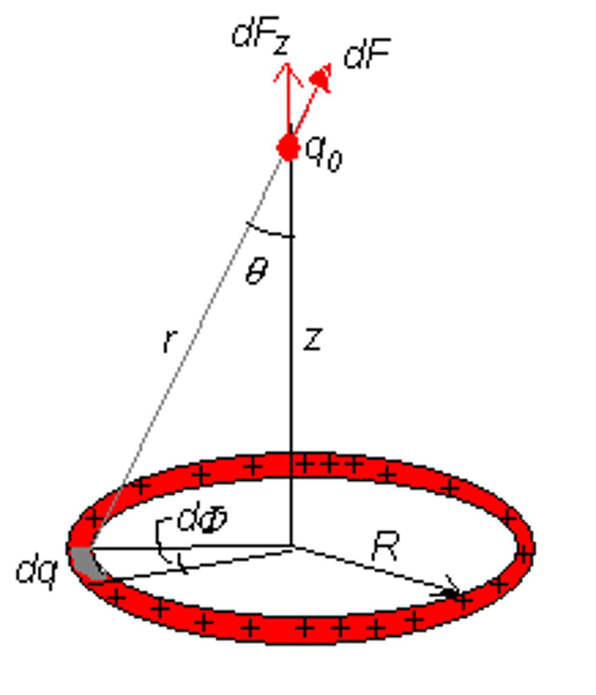{ align=left width=225px }

推导：
$$ \lambda = \dfrac{q}{2\pi R}$$
$$ dF = \dfrac{1}{4\pi\epsilon_0} \dfrac{q_0dq}{r^2} = \dfrac{1}{4\pi\epsilon_0} \dfrac{q_0\lambda Rd\Phi}{(z^2+R^2)} $$
$$
\begin{aligned}
F_z &= \int dF_z = \int dF\cos\theta \\\\
&= \int \dfrac{1}{4\pi\epsilon_0} \dfrac{q_0\lambda Rd\Phi}{z^2+R^2} \dfrac{z}{\sqrt{z^2+R^2}}\\\\
&= \dfrac{1}{4\pi\epsilon_0} \dfrac{q_0\lambda Rz}{(z^2+R^2)^{3/2}} \int_0^{2\pi} d\Phi \\\\
&= \dfrac{1}{4\pi\epsilon_0} \dfrac{q_0qz}{(z^2+R^2)^{3/2}} \\\\
\end{aligned}
$$

从而推得
$$ \overrightarrow{F} = \dfrac{1}{4\pi\epsilon_0} \dfrac{q_0qz}{(z^2+R^2)^{3/2}} \hat{k}$$

当$z >> R$时，有
$$ \overrightarrow{F} \approx \dfrac{1}{4\pi\epsilon_0} \dfrac{q_0q}{z^2} \hat{k}$$

### A Disk of Charge

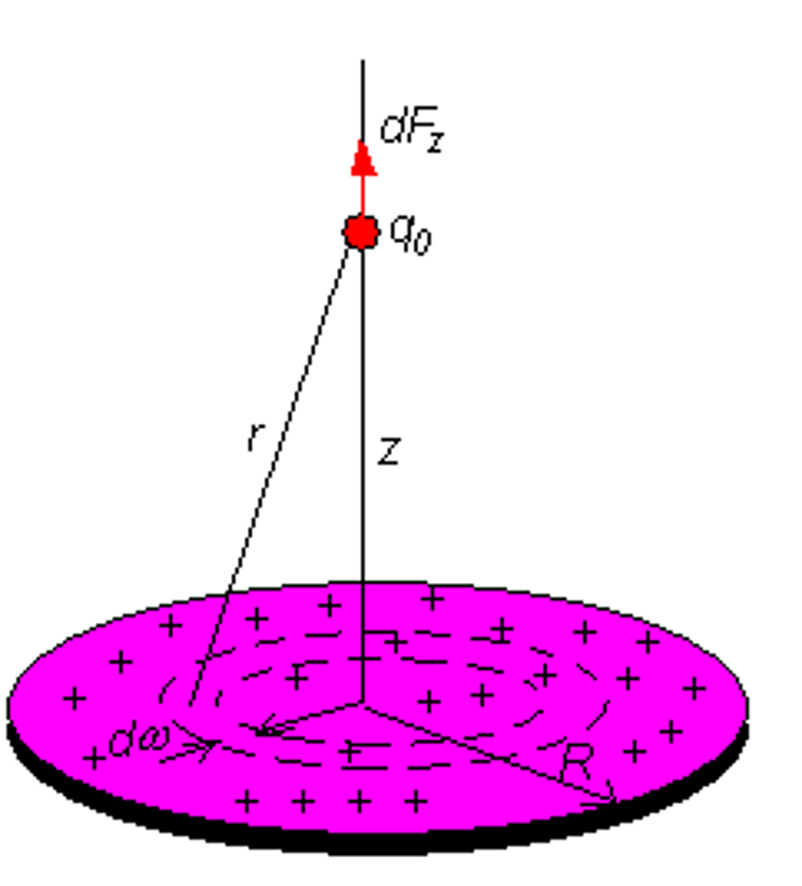{ align=left width=250px }

推导：
$$ \sigma = \dfrac{q}{\pi R^2} $$
$$ dq = \sigma dA = \sigma(2\pi \omega d\omega) = 2\pi\sigma\omega d\omega $$
$$ dF_z = \dfrac{1}{4\pi\epsilon_0} \dfrac{q_0(2\pi\sigma\omega d\omega)z}{(z^2+\omega^2)^{3/2}} $$

$$
\begin{aligned}
F_z &= \dfrac{1}{4\pi\epsilon_0} q_02\pi\sigma z \int_0^R \dfrac{\omega d\omega}{(z^2+\omega^2)^{3/2}} \\\\
&= \dfrac{1}{4\pi\epsilon_0} \dfrac{2q_0q}{R^2} (1 - \dfrac{z}{\sqrt{z^2+R^2}}) \\\\
\end{aligned}
$$

---

## 电场

Coulomb's Law:
$$ \overrightarrow{F} = \dfrac{1}{4\pi\epsilon_0} \dfrac{Q q_0}{r^2} \hat{r} $$
$$ \overrightarrow{E} = \lim_{q_0 \rightarrow 0} \dfrac{\overrightarrow{F}}{q_0} $$

### Dipole（电偶极矩）

定义：两个相反等量电荷之间的距离乘以电荷量，$\overrightarrow{p} = q\overrightarrow{d}$
```mermaid
flowchart LR
A(( -q )) --> B(( +q ))
```

!!! note "坐标轴上的电偶极矩"
    === "在x轴上的点"
        { align=left width=250px }
        $$ E_x(x,0) = 0 $$

        $$ E_y(x,0) = -2 \dfrac{1}{4\pi\epsilon_0} \dfrac{Q}{r^2} \sin\theta $$

        又有 $\sin\theta = \dfrac{a}{r}$, $r^2 = x^2+a^2$, 从而
        $$ E_y(x,0) = -2 \dfrac{1}{4\pi\epsilon_0} \dfrac{Qa}{(x^2+a^2)^{3/2}} $$

    === "在y轴上的点"
        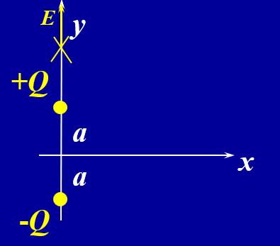{ align=left width=250px }
        $$ E_x(0,y) =0 $$

        $$\begin{aligned}
        E_x(0,y) &= \dfrac{Q}{4\pi\epsilon_0} \left( \dfrac{1}{(y-a)^2} - \dfrac{1}{(y+a)^2} \right) \\\\
        &= \dfrac{Q}{4\pi\epsilon_0}  \dfrac{4ay}{y^4 \left( 1-\dfrac{a^2}{y^2} \right)^2}
        \end{aligned}$$

我们可以对以上两种情况进行总结：

沿x轴：
$$ E_x(r,0) = 0 $$
$$ E_y(r,0) = -2 \dfrac{1}{4\pi\epsilon_0} \dfrac{Qa}{(r^2+a^2)^{3/2}} $$

当 $ r >> a$ 时，
$$ E_y(r,0) \approx -2 \dfrac{1}{4\pi\epsilon_0} \dfrac{Qa}{r^3} $$

沿y轴：
$$ E_x(0,r) = 0 $$
$$ E_y(0,r) = \dfrac{Q}{4\pi\epsilon_0}  \dfrac{4ar}{r^4 \left( 1-\dfrac{a^2}{r^2} \right)^2} $$

当 $r >> a$ 时，
$$ E_y(0,r) \approx 4\dfrac{1}{4\pi\epsilon_0}  \dfrac{Qa}{r^3} $$

综上，我们可以得到
$$ E \propto \dfrac{1}{r^3} $$

### 无限线电荷

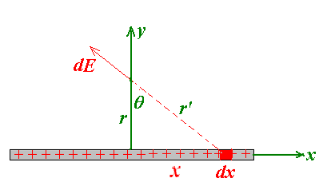{ width=380px }

$$ dE = \dfrac{1}{4\pi\epsilon_0} \dfrac{dq}{r'^2} ,\ dq = \lambda dx, \  r' =\dfrac{r}{\cos\theta} $$

Therefore,
$$ dE = \dfrac{1}{4\pi\epsilon_0} \dfrac{\lambda \cos^2 \theta dx}{r^2} $$

又因为
$$ x = r\tan \theta $$
$$ dx = r\sec^2 \theta d\theta $$
于是最终得到
$$ dE = \dfrac{1}{4\pi\epsilon_0} \dfrac{\lambda  d\theta}{r} $$

Components:
$$ dE_x = dE \sin\theta = \dfrac{1}{4\pi\epsilon_0} \dfrac{\lambda d\theta}{r} \sin\theta $$
$$ dE_y = dE \cos\theta = \dfrac{1}{4\pi\epsilon_0} \dfrac{\lambda d\theta}{r} \cos\theta $$
$$ E_x = \int dE_x = -\dfrac{1}{4\pi\epsilon_0} \dfrac{\lambda}{r} \int_{-\pi /2}^{{+\pi /2}} \sin\theta d\theta = 0 $$
$$ E_y = \int dE_y = \dfrac{1}{4\pi\epsilon_0} \dfrac{\lambda}{r} \int_{-\pi /2}^{{+\pi /2}} \cos\theta d\theta = \dfrac{\lambda}{2\pi\epsilon_0 r} $$

!!! summary "电场强度的变化"
    - Dipole: $E \propto \dfrac{1}{r^3}$
    - Point Charge: $E \propto \dfrac{1}{r^2}$
    - Infinite Line of Charge: $E \propto \dfrac{1}{r} $

---

### 均匀环电荷

{ align=left width=250px }
$$ dE = \dfrac{\lambda ds}{4\pi\epsilon_0} = \dfrac{\lambda ds}{4\pi\epsilon_0(z^2+R^2)} $$

$$ E_x = E_y = 0, E_z \neq 0 $$

$$\begin{aligned}
dE_z &= dE\cos\theta = \dfrac{\lambda ds}{4\pi\epsilon_0(z^2+R^2)} \dfrac{z}{(z^2+R^2)^{1/2}}  \\\\
&= \dfrac{z\lambda ds}{4\pi\epsilon_0(z^2+R^2)^{3/2}}
\end{aligned}$$

$$\begin{aligned}
E_z &= \int dE_z = \int \dfrac{z\lambda ds}{4\pi\epsilon_0(z^2+R^2)^{3/2}} \\\\
&= \dfrac{zq}{4\pi\epsilon_0(z^2+R^2)^{3/2}} \\\\
\end{aligned}$$

if $z >> R$, then $E_z \approx \dfrac{q}{4\pi\epsilon_0z^2}$

if $z \rightarrow 0$, then $E_z \approx 0$

### 均匀圆盘电荷

{ align=left width=250px }
$$ dq = 2\pi\omega·d\omega·\sigma $$

$$ dE = \dfrac{zdq}{4\pi\epsilon_0(z^2+\omega^2)^{3/2}} = \dfrac{z·2\pi\sigma\theta d\theta}{4\pi\epsilon_0(z^2+\omega^2)^{3/2}} $$

$$\begin{aligned}
E &= \int dE = \dfrac{\sigma z}{2\epsilon} \int_0^R \dfrac{\omega d\omega}{(z^2+\omega^2)^{3/2}} \\\\
&= \dfrac{\sigma z}{2\epsilon} \int_0^R \dfrac{d(z^2+\omega^2)}{(z^2+\omega^2)^{3/2}} \\\\
&= \dfrac{\sigma}{2\epsilon} \left( 1- \dfrac{1}{\sqrt{1+\dfrac{R^2}{z^2}}} \right)
\end{aligned}$$

- if $R >> z$， $\dfrac{1}{\sqrt{1+\dfrac{R^2}{z^2}}} \rightarrow 0$, so $E = \dfrac{\sigma}{2\epsilon}$ (Infinite sheet)

- if $z >> R$， $\dfrac{1}{\sqrt{1+\dfrac{R^2}{z^2}}} = 1 - \dfrac{1}{2} \dfrac{R^2}{z^2} + \dfrac{3}{8} \dfrac{R^4}{z^4} - \cdots$

- so $E = \dfrac{\sigma}{2\epsilon} \left( 1- \dfrac{1}{2} \dfrac{R^2}{z^2} + \dfrac{3}{8} \dfrac{R^4}{z^4} - \cdots \right) \propto \dfrac{\sigma}{2\epsilon} \dfrac{1}{2} \dfrac{R^2}{z^2} = \dfrac{q}{4\pi\epsilon_0 z^2} $

### Dipole(电偶极矩)

{ align=left width=270px }

{ width=320px }

电偶极矩矢量：$ \overrightarrow{p} = q \overrightarrow{d} $
$$ \overrightarrow{\tau} = \overrightarrow{p} \times \overrightarrow{E} $$

---

## Gauss's Law(高斯定理)

### 通量

Flux，流量，通量: $\Phi = \vec{E} \cdot \overrightarrow{A} = EA\cos\theta$

??? example "速度场的通量"
    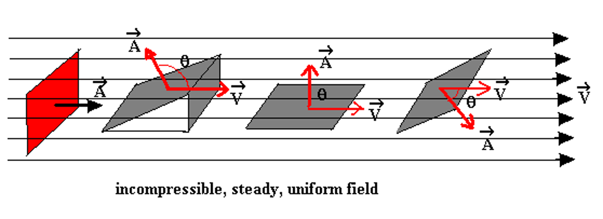
    
    $$\Phi = \overrightarrow{v} \cdot \overrightarrow{A} = vA\cos\theta$$

    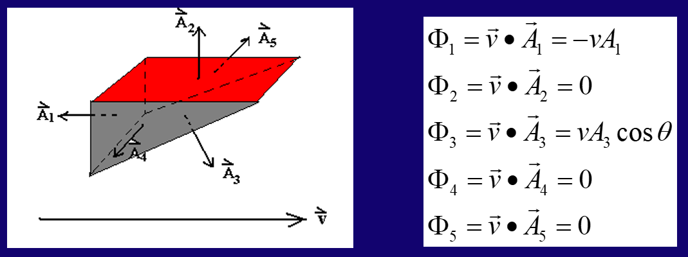{ width=700px }

    $$ \Phi = \sum\overrightarrow{v} \cdot \overrightarrow{A} $$

    { width=300px }
    对于任意的一个闭合曲面，有

    $$\begin{aligned}
    \Phi &= \oiint \overrightarrow{v} \cdot d\overrightarrow{A} \\\\
    d\Phi &= \overrightarrow{v} \cdot d\overrightarrow{A} \\\\
    d\overrightarrow{A} &= dydz\overrightarrow{i} + dzdx\overrightarrow{j} + dxdy\overrightarrow{k} \\\\
    \overrightarrow{v} &= v_x\overrightarrow{i} + v_y\overrightarrow{j} + v_z\overrightarrow{k} \\\\
    \overrightarrow{v} \cdot d\overrightarrow{A} &= v_xdydz + v_ydzdx + v_xdxdy \\\\
    \end{aligned}$$

If there were within the volume no sources or sink of fluid.

如果在体积内没有流体的源头或汇集点，那么
$$ \Phi = \oiint \overrightarrow{v} \cdot d\overrightarrow{A} = 0 $$

If there were a source (源) within the volume:
$$ \Phi = \oiint \overrightarrow{v} \cdot d\overrightarrow{A} > 0 $$

If there were a sink (汇) of fluid:
$$ \Phi = \oiint \overrightarrow{v} \cdot d\overrightarrow{A} < 0 $$

### 电通量

Define:  electric flux $\Phi_E$ through the closed surface $A$
$$ \Phi = \sum \overrightarrow{E} \cdot \overrightarrow{A} = \oiint \overrightarrow{E} \cdot d\overrightarrow{A} $$

- 规定电通量“向外”为正，“向内”为负
- 对于一个开放曲面（不闭合），它的方向不确定，因此电通量的符号也不确定

??? example "例题"
    === "例一"
        { align=right width=150px }
        Imagine a cube of side a positioned in a region of constant electric field as shown

        Which of the following statements about the net electric flux $\Phi_E$ through the surface of this cube is true?

        - [x] A. $\Phi_E = 0$ 
        - B. $Phi_E \propto 2a^2$ 
        - C. $\Phi_E \propto 6a^2$

        $$ \Phi = \sum \overrightarrow{E} \cdot \overrightarrow{A} = \oiint \overrightarrow{E} \cdot d\overrightarrow{A} $$

    === "例二"
        { align=right width=150px }
        Consider 2 spheres (of radius R and 2R) drawn around a single charge as shown.

        Which of the following statements about the net electric flux through the 2 surfaces ($\Phi_{2R}$ and $\Phi_R$) is true?
        
        - $\Phi_R < \Phi_{2R}$
        - [x] $\Phi_R = \Phi_{2R}$
        - $\Phi_R > \Phi_{2R}$

        **解析**：首先观察图片可以知道通过两个球面的电力线总数是相等的，因此电通量也是相等的。

        具体来说，根据 $ \Phi = \oiint \overrightarrow{E} \cdot d\overrightarrow{A} $，我们知道 $\overrightarrow{E} \propto r^2$ 和 $\overrightarrow{A} \propto \dfrac{1}{r^2}$，因此 $r^2$ 和 $\dfrac{1}{r^2}$就抵消了，所以在这里电通量是一个与距离无关的定值。

### 电场的高斯定理

通过一个闭合曲面的总电通量与被这个曲面所包围的电荷量成正比

$$ \Phi = \oiint \overrightarrow{E} \cdot d\overrightarrow{A} = \Phi_E = \dfrac{q_{enclosed}}{\epsilon_0} $$

!!! example
    { align=left width=300 }

    $$ \begin{aligned}
    &a: \epsilon \oiint \overrightarrow{E} \cdot d\overrightarrow{A} = q > 0 \\\\
    &b: \epsilon \oiint \overrightarrow{E} \cdot d\overrightarrow{A} = -q < 0 \\\\
    &c: \epsilon \oiint \overrightarrow{E} \cdot d\overrightarrow{A} = q-q = 0 
    \end{aligned}$$

在利用高斯公式求解$E$时，我们需要选择一个恰当的闭合曲面，使得积分的处理较为简单，即尽可能地寻找一个足够“对称”的曲面。

- 方向：我们可以使得闭合曲面与电场的方向垂直或平行

    - 如果 $\overrightarrow{E} \parallel d\overrightarrow{A}$，那么 $\overrightarrow{E} \cdot d\overrightarrow{A} = EdA$
    - 如果 $\overrightarrow{E} \perp d\overrightarrow{A}$，那么 $\overrightarrow{E} \cdot d\overrightarrow{A} = 0$

- 大小：当电场方向与平面垂直时，应当使得平面的任意点处电场大小$E$相等

这样一来就可以得到
$$ \oiint \overrightarrow{E} \cdot d\overrightarrow{A} = \oiint EdA = E \oiint dA = \dfrac{q_{enclosed}}{\epsilon_0} $$

这样一来就可以通过$q_{enclosed}$来求解$E$，或反之通过$E$来求解$q_{enclosed}$

我们也可以通过高斯公式来推导出库仑定律：
$$ \begin{aligned}
\oiint \overrightarrow{E} \cdot d\overrightarrow{A} &= \dfrac{Q}{\epsilon_0} \\\\
E \oiint dA &= \dfrac{Q}{\epsilon_0} \\\\
E \cdot 4\pi r^2 &= \dfrac{Q}{\epsilon_0} \\\\
E &= \dfrac{1}{4\pi\epsilon_0} \dfrac{Q}{r^2}
\end{aligned}$$

### 高斯定理的应用

#### 均匀带电球体

{ align=right width=250px }
求由一个半径为$a$，电荷密度为 $\rho (C/m^3)$ 的均匀带电球体所产生的电场强度

- **在球体外$(r > a)$**，由高斯定理可知
    $$ \oiint \overrightarrow{E} \cdot d\overrightarrow{A} = 4\pi r^2 E = \dfrac{q}{\epsilon_0} $$
    并且
    $$ q = \dfrac{4}{3}\pi a^3 \rho $$

    可以得到
    $$ E = \dfrac{\rho a^3}{3\epsilon_0 r^2} $$

    事实上利用 $E = \dfrac{1}{4\pi \epsilon_0} \dfrac{q}{r^2} $ 也可以得到相同的结果

- **在球体内$(r < a)$**，同样也由高斯定理，但此处包裹的电荷大小不再是由$a$决定
    $$ \oiint \overrightarrow{E} \cdot d\overrightarrow{A} = 4\pi r^2 E = \dfrac{q}{\epsilon_0} $$
    $$ q = \dfrac{4}{3}\pi r^3 \rho $$

    可以得到
    $$ E = \dfrac{\rho}{3\epsilon_0} r $$

根据以上分析，最终得到

{ width=400 }

#### 导体中的高斯定理

我们知道**导体内部的电场大小始终为零**，再根据高斯定理可以推出其内部的电荷大小为零，说明导体的电荷只分布在它的表面上。

{ align=left width=300 }
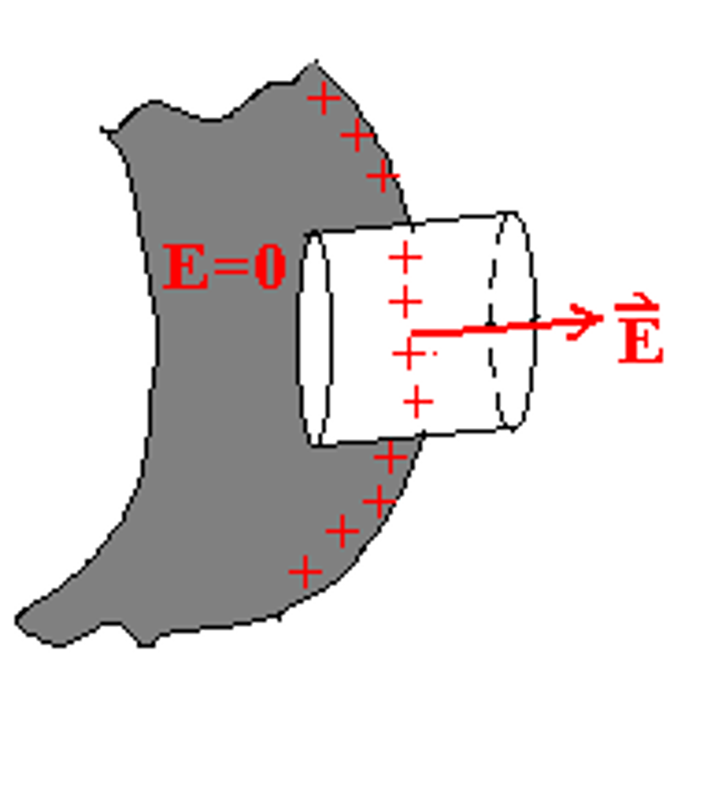{ width=200 }

想要求一个带电导体产生的电场，我们可以在其外表面处取一个极小的高斯面，这样可以认为被高斯面包裹的导体表面上的电荷是均匀分布的（取足够小的高斯面后可以就认为高斯面内的导体表面是平的，从而忽略尖端带电效应）。

并且因为导体内部电场强度为0，由对称性也可以知道沿高斯面的侧面方向的电场强度之和也为0。
$$ \epsilon_0 \oiint \overrightarrow{E} \cdot d\overrightarrow{A} = \sigma \cdot \Delta A $$
$$ \epsilon_0 E \Delta A + 0 + 0 = \sigma \cdot \Delta A $$

$$ E = \dfrac{\sigma}{\epsilon_0} $$

#### 无限线电荷

由对称性可知只有在垂直于线电荷的方向上有电场强度，因此我们可以取一个半径为$r$，长度为$h$的圆柱形高斯面，这样可以得到

{ align=right width=300 }
应用高斯定理

- 在两端：$\overrightarrow{E} \cdot d\overrightarrow{A} = 0$
- 在侧面：
    $$ \oiint \overrightarrow{E} \cdot d\overrightarrow{A} = 2\pi rhE $$
    $$ q = \lambda h $$
    得到
    $$ E = \dfrac{\lambda}{2\pi \epsilon_0 r} $$

于是我们就得到了和先前使用库仑定律推导相同的结论。

??? example
    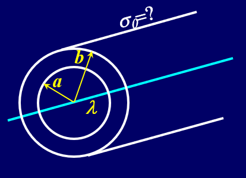{ align=right width=250 }
    密度为$\lambda$的无限长线电荷被放在空心圆柱的中轴线上，空心圆柱的内径为$r_i = a$, 外径为$r_o = b$，求空心圆柱外表面的电荷密度 $\sigma _o(C/m^2)$ 是多少？

    - A. $\sigma_o = -\dfrac{\lambda}{2\pi b}$
    - B. $\sigma_o = 0$
    - [x] C. $\sigma_o = +\dfrac{\lambda}{2\pi b}$

    **解析**：我们可以构造一个仅包围外表面的高斯面，其中一侧在圆柱外部，另一侧在空心圆柱里，那么就有 $E_{outside} = \dfrac{\lambda}{2\pi \epsilon_0 r}$ 与 $E_{conductor} = 0$，于是
    $$ \oiint \overrightarrow{E} \cdot d\overrightarrow{A} = (2\pi rL)E_{outside} + (2\pi rL)E_{conductor} = \dfrac{q}{\epsilon_0} = \dfrac{\sigma_o 2\pi bL}{\epsilon_0} $$

    又根据
    $$ E_{outside} = \dfrac{\lambda}{2\pi \epsilon_0 r} = \dfrac{\sigma_o b}{\epsilon_0 r} $$
    可以得到
    $$ \sigma_o = \dfrac{\lambda}{2\pi b} $$

#### 无限面电荷

显然的，我们在对无限面电荷构造高斯平面时，应当选择构造与这个平面平行且容易计算面积的形状，常用的有**与此平面垂直的圆柱体**或**一个立方体**

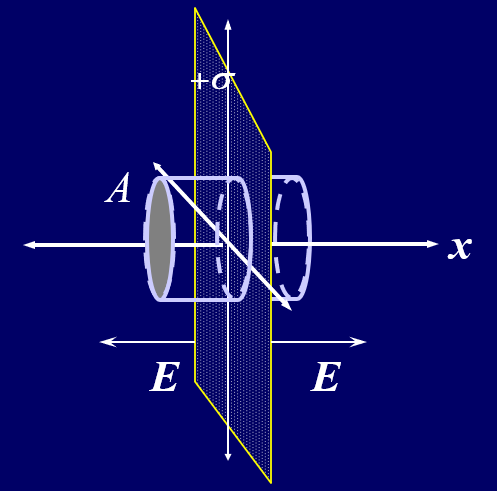{ align=right width=250 }
由对称性可以知道只有与平面垂直的方向有电场，因此可很平凡地构造一个高斯面。

- 在侧面：$ \overrightarrow{E} \cdot d\overrightarrow{A} = 0 $
- 在两端：$ \oiint \overrightarrow{E} \cdot d\overrightarrow{A} = 2AE$$
- 所包裹住的电荷量大小：$\sigma A$

因此由高斯定理
$$ E = \dfrac{\sigma}{2\epsilon_0} $$

**结论**：一个无限面电荷产生的电场强度是一个**常量**。

??? example "一些其他例题"
    { align=right width=250 }
    两个带相反电荷的无限平面：

    可以构造两种高斯面，

    - 跨越两个平面的高斯圆柱：所包裹的总电荷为0，其两侧的电场强度都是0（相互抵消了）
    - 只跨过一个平面的高斯圆柱：所包裹的总电荷为0，在外侧的电场强度是0，在两平面之间的电场强度不为0

        电荷为$Q = \sigma A$
        $$ \oiint \overrightarrow{E} \cdot d\overrightarrow{A} = AE_{outside} + AE_{inside} $$

    得到
    $$ E = \dfrac{\sigma}{\epsilon_0} $$

!!! note "如何在作业题中运用高斯定理"
    牢记高斯公式在有关题目中一定是有效的
    $$ \epsilon_0 \oiint \overrightarrow{E} \cdot d\overrightarrow{A} = q_{enclosed} $$

    如何运用高斯定理？

    - 我们可以利用**球面**、**圆柱体**、**平面**的对称性来解决许多问题
    - 如果我们知道了电荷量，就可以计算电场大小；如果我们知道了电场大小，就可以计算电荷量

    半径为$r$的球面对称：
    $$ \epsilon_0 \oiint \overrightarrow{E} \cdot d\overrightarrow{A} = 4\pi \epsilon_0 r^2 E = q $$
    $$ E = \dfrac{1}{4\pi \epsilon_0} \dfrac{q}{r^2} $$

    半径为$r$的圆柱面对称：
    $$ \epsilon_0 \oiint \overrightarrow{E} \cdot d\overrightarrow{A} = \epsilon_0 2\pi rLE = q $$
    $$ E = \dfrac{q}{2\pi \epsilon_0 r} $$

    面积为$A$的平面对称：
    $$ \epsilon_0 \oiint \overrightarrow{E} \cdot d\overrightarrow{A} = \epsilon_0 2AE = q $$
    $$ E = \dfrac{\sigma}{2 \epsilon_0} $$

!!! example "两道例题"
    === "Example 1:  spheres"
        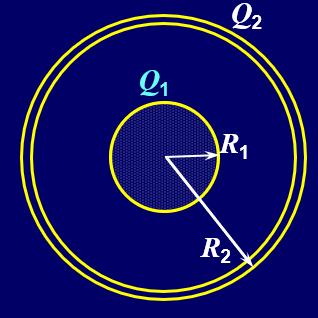{ align=right width=200 }
        如图，一个实心导体球被一个薄导体球面包裹，球携带的电荷为$Q_1$，球壳携带的电荷为$Q_2$，其中$Q_2 = -3Q_1$

        - A. 电荷在球上如何分布？
        - B. 电荷在球壳上如何分布？
        - C. 当$r < R_1$, 在$R_1$和$R_2$之间，$r > R_2$时，电场大小分别是多少？
        - D. 使用导线将两者连接之后，电荷将会如何变化？

        ---

        **A**. 电荷分布在球的外表面上 $ \sigma = \dfrac{Q_1}{4\pi R_1^2} $

        **B**. 将球壳和球视为一个大的导体，由于导体内部的总电荷为0，那么球壳内表面上的电荷一定为$-Q_1$，外表面上的电荷为$-2Q_1$
        $$ \sigma_{inner} = \dfrac{Q_1}{4\pi R_2^2} $$
        $$ \sigma_{outer} = \dfrac{Q_1 + Q_2}{4\pi R_2^2} = \dfrac{-2Q_1}{4\pi R_2^2}$$

        **C**. $r < R_1$时：$\overrightarrow{E} = 0$

        在$R_1$和$R_2$之间：被包裹的电荷量为$Q_1$
        $$ \overrightarrow{E} = \dfrac{1}{4\pi \epsilon_0} \dfrac{Q_1}{r^2} \hat{r} $$

        $r > R_2$时：包裹的电荷量为 $Q_1 + Q_2 = -2Q_1$
        $$ \overrightarrow{E} = \dfrac{1}{4\pi \epsilon_0} \dfrac{Q_1 + Q_2}{r^2} \hat{r} = \overrightarrow{E} = -\dfrac{1}{4\pi \epsilon_0} \dfrac{2Q_1}{r^2} \hat{r}   $$

        **D**：达到电荷平衡后，球壳内表面以及实心球上不再有电荷，所有电荷都在球壳外表面上

        对于$r < R_2$，$\overrightarrow{E} = 0$

        对于$r > R_2$，$\overrightarrow{E} = -\dfrac{1}{4\pi \epsilon_0} \dfrac{2Q_1}{r^2} \hat{r} $

    === "Example 2: Cylinders"
        

        一条无限长的线电荷从半径为$R$的带电圆柱面的中心穿过，仅考虑长度为$h$的部分，线电荷密度为$\lambda$，圆柱面具有的的总面电荷密度为$\sigma_{total}$。

        - A. 电荷在圆柱面上如何分布？考虑$\sigma_{inner}$与$\sigma_{outer}$
        - B. $r < R$时电场强度是多少？
        - C. $r > R$时电场强度是多少？

        ---

        { align=right width=300 }
        **A**. 将整个圆柱面以及线电荷视为一个导体，则圆柱面内表面和线电荷的总电荷为0.

        长度为$h$的这部分线电荷为$\lambda h$，故内表面产生的感应电荷为$Q_{inner} = -\lambda h$，于是
        $$ \sigma_{inner} = \dfrac{Q_{inner}}{2\pi Rh} = -\dfrac{\lambda}{2\pi R}  $$

        所以外表面电荷密度为
        $$ \sigma_{outer} = \sigma_{total} - \sigma_{inner} = \sigma_{total} + \dfrac{\lambda}{2\pi R} $$

        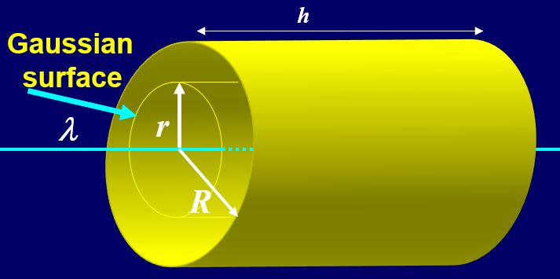{ align=right width=230 }
        **B**. 直接利用高斯定理即可得到
        $$ 2\pi rhE_r = \dfrac{q_{enclosed}}{\epsilon_0} = \dfrac{\lambda h}{\epsilon_0} $$
        $$ E_r = \dfrac{\lambda}{2\pi \epsilon_0 r}  $$

        **C**. 也是运用高斯定理，只不过还要加上$\sigma_{total}$的部分
        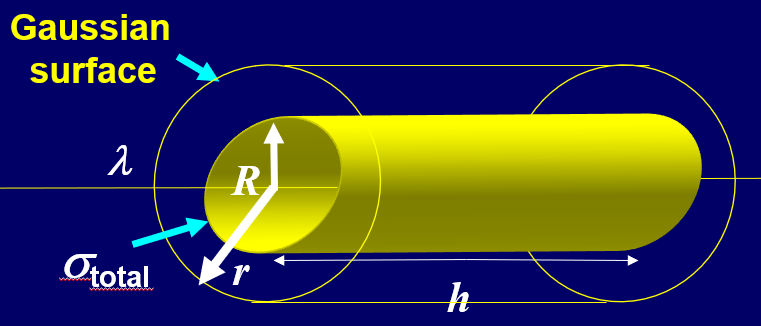{ align=right width=310 }

        $$ 2\pi rhE_r = \dfrac{Q + \lambda h}{\epsilon_0} = \dfrac{2\pi Rh \sigma_{total} + \lambda h}{\epsilon_0} $$

        于是
        $$ E_r = \dfrac{\sigma_{total}}{\epsilon_0} \dfrac{R}{r} + \dfrac{\lambda}{2\pi \epsilon_0 r} $$

---

## 电势能和电势

### 电势能

静电力是保守力，即静电力的做功大小与路径无关，仅取决于初、末位置，类比于重力以及重力势能，我们也可以定义电势能。

考虑一个带电粒子 $q$ 在电场 $\overrightarrow{E}$ 中运动，假设它从位置 $a$ 移动到位置 $b$，那么它的电势能变化为
$$ \Delta U = U_b - U_a = -\int_a^b \overrightarrow{F} \cdot d\overrightarrow{l} = -q \int_a^b \overrightarrow{E} \cdot d\overrightarrow{l} $$
这里的 $\int_a^b \overrightarrow{F} \cdot d\overrightarrow{l}$ 仅取决于初、末位置 $a$ 和 $b$，而与路径无关。

- 当电场力做正功时，电势能减小，反之电势能增加。 
- 电势能是一个标量，当带电粒子处于由多个电场叠加得到的电场中时，它总的电势能等于它在每个电场的电势能的标量和。
- 带电粒子在电场中某一点的电势能 $U(x,y,z)$ 等于将这个粒子从电势能为零的点移到点 $(x,y,z)$ 所做的功。通常我们将电势能为零的点设为无穷远处。

#### 静电场的环路定律

显然的，静电场沿着一个闭合回路的积分为零，即
$$ \oint \overrightarrow{E} \cdot d\overrightarrow{l} = 0 $$

根据 Stokes 公式，第二类曲线积分等于这条曲线所包围的面积的法向量积分，即
$$ \oint \overrightarrow{E} \cdot d\overrightarrow{l} = \iint (\nabla \times \overrightarrow{E}) \cdot d\overrightarrow{A} = 0 $$
因此我们可以得到
$$ \nabla \times \overrightarrow{E} = 0 $$

!!! note 
    事实上，利用数分2中学到的 Guass 公式，我们可以得到

    $$\begin{aligned}
    \oiint \overrightarrow{E} \cdot d\overrightarrow{A} &= \dfrac{q}{\epsilon_0} = \iiint \dfrac{\rho}{\epsilon_0} dv \\\\
    &= \iiint \nabla \cdot \overrightarrow{E} dv
    \end{aligned}$$

    因此我们可以得到
    $$ \nabla \cdot \overrightarrow{E} = \dfrac{\rho}{\epsilon_0} $$

### 电势

电势是电场中某一个点的物理量，它是一个标量，定义为单位正电荷在该点的电势能。即电势 $V$ 可以表示为
$$ V = \dfrac{U}{q} $$
其中 $U$ 是电势能，$q$ 是单位正电荷的电荷量。

与电势能相同，电势也是一个标量。我们通常也将无穷远处的电势设为零。

根据 
$$ W_{AB} = \int_A^B \overrightarrow{F}_{extern} \cdot d\overrightarrow{l} = -\int_A^B \overrightarrow{F}_e \cdot d\overrightarrow{l} = -\int_A^B q_0 \overrightarrow{E} \cdot d\overrightarrow{l} $$

我们在求电势差时可以使用以下公式:
$$ V_B - V_A \equiv \dfrac{W_{AB}}{q_0} = -\int_A^B \overrightarrow{E} \cdot d\overrightarrow{l} $$

!!! note
    我们在计算空间中某一点的电势时，可以将其视为从该点到无穷远处对电场所做的积分，即
    $$ V = \int_a^{\infty} \overrightarrow{E} \cdot d\overrightarrow{l} $$
    因为无穷远处电势为零，这一点的电势相当于从无穷远处到该点电场所做的功的相反数。

根据上述公式，我们可以在点电荷产生的电场求出电势差

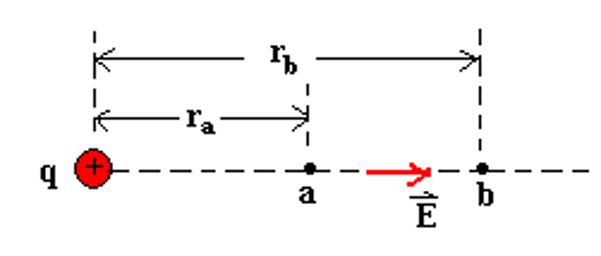{ align=left width=260 }
$\begin{aligned}
V_b - V_a &= -\int_A^B \overrightarrow{E} \cdot d\overrightarrow{l} = -\int_{r_a}^{r_b} \dfrac{q}{4\pi \epsilon_0 r^2} dr\\\\
&= \dfrac{q}{4\pi \epsilon_0}\left( \dfrac{1}{r_b} - \dfrac{1}{r_a} \right)
\end{aligned}$

此时我们令 $r_a = \infty$，$V_a = 0$，可以得到**点电荷在空间中产生的电势**
$$ V = \dfrac{q}{4\pi \epsilon_0 r} $$

!!! example "两个典型的例子"
    === "电偶极矩产生的电势"
        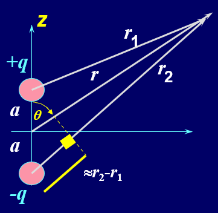{ align=right width=230 }

        $$ V(r) = \dfrac{1}{4\pi \epsilon_0} \left( \dfrac{q}{r_1} - \dfrac{q}{r_2} \right) = \dfrac{q}{4\pi \epsilon_0} \dfrac{r_2 - r_1}{r_1 r_2} $$

        当 $r >> a$ 时，我们有 $r_2 - r_1 \approx 2a\cos\theta$ 以及 $r_1 r_2 \approx r^2$

        此外我们还知道 $p = 2aq$，$\overrightarrow{p} = q \overrightarrow{d}$，$d = 2a$，所以我们可以得到
        $$ V( r ) = \dfrac{1}{4\pi \epsilon_0} \dfrac{2aq \cos\theta}{r^2} = \dfrac{\overrightarrow{p} \cdot \hat{r}}{4\pi \epsilon_0 r^2} $$ 
        
        - $\theta = 90^{\circ}$时，$V = 0$
        - $\theta = 0$时，$V_{max} > 0$
        - $\theta = 180^{\circ}$时，$V_{max} < 0$

    === "电四偶极矩产生的电势"
        { align=right width=230 }
        $\begin{aligned}
        V( r ) &= \sum_i V_i(r_i) \\\\
                &= \dfrac{1}{4\pi \epsilon_0} \left( \dfrac{q}{r-d} + \dfrac{-2q}{r} \dfrac{q}{r+d} \right) \\\\
                &= \dfrac{1}{4\pi \epsilon_0} \dfrac{2qd^2}{r (r^2 - d^2)} \\\\
                &= \dfrac{1}{4\pi \epsilon_0} \dfrac{2qd^2}{r^3 (1 - d^2 / r^2)}
        \end{aligned}$

        对于 $d << r$，即 $d^2 / r^2 << 1$，有
        $$  V( r ) = \dfrac{2qd^2}{4\pi \epsilon_0 r^3} = \dfrac{Q}{4\pi \epsilon_0 r^3}$$
        因为在电四偶极矩中 $Q = 2qd^2$

!!! note
    - 对于点电荷，$V \propto \dfrac{1}{r}$
    - 对于电偶极矩，$V \propto \dfrac{1}{r^2}$
    - 对于电四偶极矩，$V \propto \dfrac{1}{r^3}$

### 常见模型的电势能和电势

#### 带电球壳的电势能和电势

由高斯定理可以直接得到

- $E = \dfrac{q}{4\pi \epsilon_0 r^2}$，$(r \geqslant R)$
- $E = 0$，$(r < R)$

可以求得电势

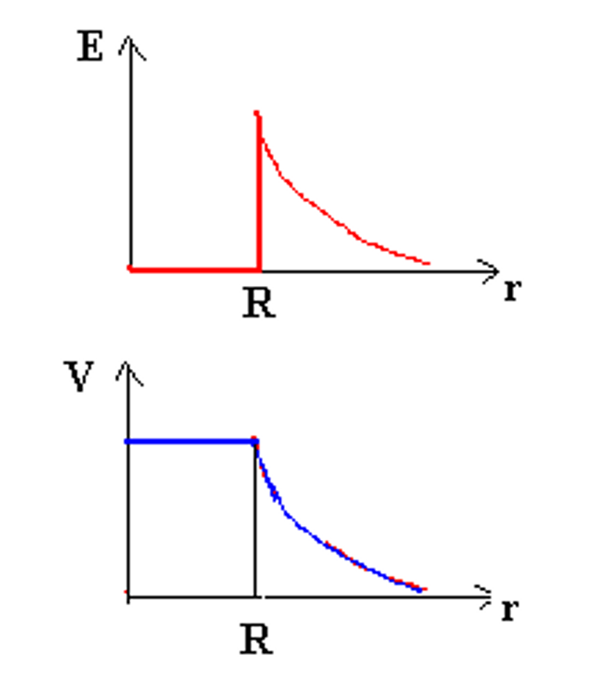{ align=right width=230 }

$$ r_P > R, V(P) = \int_P^{infty} \overrightarrow{E} \cdot d\overrightarrow{l} = \dfrac{q}{4\pi \epsilon_0 r_P} $$

$$\begin{aligned}   
r_P > R, V(P) &= \int_P^R \overrightarrow{E} \cdot d\overrightarrow{l} + \int_R^{infty} \overrightarrow{E} \cdot d\overrightarrow{l} \\\\
                &= 0 + \dfrac{q}{4\pi \epsilon_0 R} = \dfrac{q}{4\pi \epsilon_0 R}
\end{aligned}$$

电势能为

$$\begin{aligned}   
U &= \sum_{i,j=1, j \neq i}^n \dfrac{q_i q_j}{4\pi \epsilon_0 r_{ij}} = \dfrac{1}{2} \sum_{i=1}^n \sum_{j=1}^n \dfrac{q_i q_j}{4\pi \epsilon_0 r_{ij}} = \dfrac{1}{2} \sum_{i=1}^n q_i V_i \\\\
&= \dfrac{1}{2} \int V dq     = \dfrac{1}{2} \dfrac{q}{4\pi \epsilon_0 R} \cdot q \\\\
&= \dfrac{q^2}{8\pi \epsilon_0 R}
\end{aligned}$$

#### 圆环与圆盘的电势

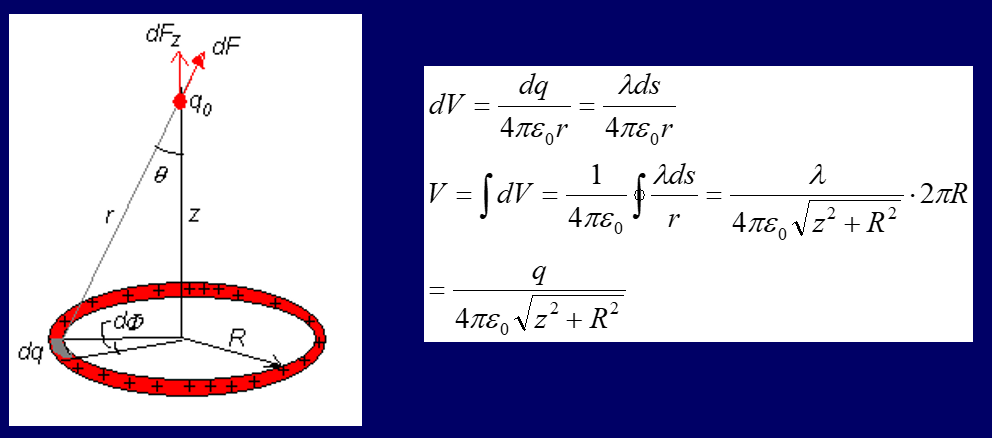{ width=80% }

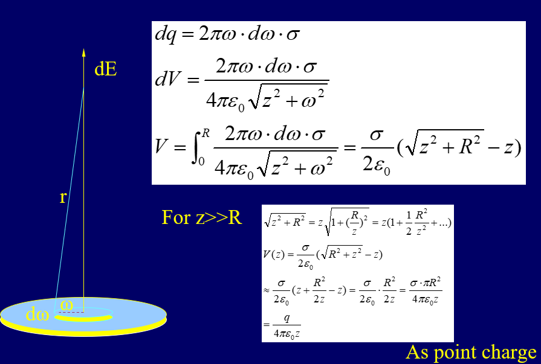{ width=80% }

### 等势面

- 在等势面上移动时电场力不做功
- 带电导体的表面是一个等势面（假如不是等势面，那么电子就会自由移动，最终达到平衡状态时就得到了一个等势面）

如果用一个导体球壳把一个点电荷包裹起来，点电荷不在球心的位置，那么

- 导体内表面产生的感应电荷分布不均匀，距离电荷越近的地方感应电荷越密集
- 导体外表面的电荷在球壳上均匀分布
- 导体内、外表面的电荷大小都与点电荷的大小相同，但是符号一个相同、一个不同

!!! note "尖端放电"
    { width=80% }

    由于导体表面是一个等势面，而曲率越大的地方电荷面密度就越大，当电势足够大时就会电离空气，也就是产生尖端放电现象

### 通过电势求电场

如果我们知道了空间任意一处的电场，就可以通过积分来求出任意一点的电势；类似地，假如我们知道了空间任意一处的电势，我们就可以通过微分来求出相应位置的电场。

也就是说，根据
$$ \Delta V = V_b - V_A = -\int_A^B \overrightarrow{E} \cdot d\overrightarrow{l} $$

就有 $ dV = -\overrightarrow{E} \cdot d\overrightarrow{l} $

从而 $ E = -(\dfrac{dV}{dl})_{max} $

我们用电势梯度描述电场中电势沿某一方向的变化率，而 $\overrightarrow{E}$ 沿着电势下降最快的方向，即电场沿着电势梯度最大的方向，或者说，电场是电势的负梯度。
$$ \overrightarrow{E} = -\overrightarrow{\nabla} V $$

- 在直角坐标系中，$$ \overrightarrow{\nabla} V = \dfrac{\partial V}{\partial x} \hat{x} + \dfrac{\partial V}{\partial y} \hat{y} + \dfrac{\partial V}{\partial z} \hat{z} $$
- 在球坐标系中，$$ \overrightarrow{\nabla} V = \dfrac{\partial V}{\partial r} \hat{r} + \dfrac{1}{r} \dfrac{\partial V}{\partial \theta} \hat{\theta} + \dfrac{1}{r \sin \theta} \dfrac{\partial V}{\partial \phi} \hat{\phi} $$

!!! note "镜像法求电势"
    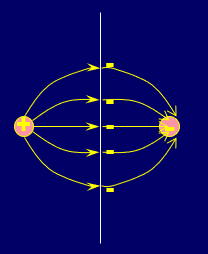{ align=right width=200 }

    在求一个靠近导体的电荷所产生的电势与电场时，我们可以考虑在对称的位置构造一个大小相同、正负相反的虚拟电荷。
    
    这样我们就构造出一个电偶极矩，再通过电偶极矩求电势的方法就可以求出某一点处的电势或电场大小了。

!!! summary "电势与电场的关系"
    如果我们知道了任意位置的电场$E$，我们就可以求出任意位置的电势$V$
    $$ V_B - V_A = -\int_A^B \overrightarrow{E} \cdot d\overrightarrow{l} $$
    $$ V_P = -\int_P^{\infty} \overrightarrow{E} \cdot d\overrightarrow{l} = \int_{\infty}^P \overrightarrow{E} \cdot d\overrightarrow{l} $$

    反之，如果我们知道了任意位置的电势$V$，我们就可以求出任意位置的电场$E$。
    $$ \overrightarrow{E} = -\overrightarrow{\nabla} V $$

---

## 电容与电介质

电容器由分离的两个导体组成，这两个导体带有大小相同、符号相反的电荷 $+q$ 与 $-q$。

!!! info "电容的定义，Capacitance"
    电容器的电容定义为：电容器上其中一个导体所含有的的电荷相对于两导体间电势差的变化率，即
    $$ C = \dfrac{q}{\Delta V} $$
    其中 $q$ 是电容器带有的电荷量，$V$ 是电容器的两个导体间的电势差。

- 电容是电容器所具有的一个固有的性质，与带电量与电势差大小无关，仅与电容器的材料、大小、形状等有关

### 常见模型的电容

#### 平行板电容器

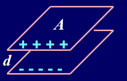{ align=right width=230 }
$$ E = \dfrac{\sigma}{\epsilon_0} = \dfrac{q}{A \epsilon_0} $$
$$ \Delta V = -\int_A^B \overrightarrow{E} \cdot d\overrightarrow{l} = \dfrac{q}{A \epsilon_0} d $$
$$ C = \dfrac{q}{\Delta V} = \dfrac{\epsilon_0 A}{d} $$

因此平行板电容器的电容与平行板的面积成正比，与板之间的距离成反比。

#### 圆柱形电容器

{ align=right width=250 }
首先用高斯定理计算出电场
$$ \oiint \overrightarrow{E} \cdot d\overrightarrow{A} = 2 \pi rLE = \dfrac{Q}{\epsilon_0} $$
$$ \Rightarrow E = \dfrac{Q}{2 \pi \epsilon_0 Lr} $$

再根据电势与电场的关系

$$\begin{aligned} \Delta V &= -\int_b^a \overrightarrow{E} \cdot d\overrightarrow{l} = -\int_b^a E \cdot dr \\\\
                        &= \int_a^b \dfrac{Q}{2 \pi \epsilon_0 rL} dr = \dfrac{Q}{2 \pi \epsilon_0 L} \ln \dfrac{b}{a}
\end{aligned}$$

$$ C = \dfrac{Q}{V} = \dfrac{2 \pi \epsilon_0 L}{\ln \dfrac{b}{a}} $$

因此，对于单位长度的圆柱形电容器，其电容为
$$ C' = \dfrac{C}{L} = \dfrac{2 \pi \epsilon_0}{\ln \dfrac{b}{a}} $$

#### 球形电容器

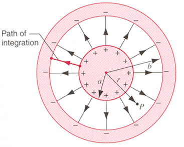{ align=right width=220 }
$$ \overrightarrow{E} = \dfrac{q \hat{r}}{4\pi \epsilon_0 r^2}, a<r<b $$

$$ \Delta V = \int_a^b \overrightarrow{E} \cdot d\overrightarrow{r} = \int_a^b \dfrac{q}{4\pi \epsilon_0 r^2} dr = \dfrac{q}{4\pi \epsilon_0} \left( \dfrac{1}{a} - \dfrac{1}{b} \right) $$

$$ C = \dfrac{q}{\Delta V} = 4\pi \epsilon_0 \dfrac{ab}{b-a} $$

!!! note
    特别的，将球形电容器的外壳移至无穷远处，即 $b \to \infty$ 时，有
    $$ C = 4\pi \epsilon_0 a $$
    这也说明一个单独的带电导体也可以视为一个电容器（电容器的另一端在无穷远处）。

### 电容器的并联与串联

!!! note
    并联电容器的电容等于各个电容器的电容之和，串联电容器的电容的倒数等于各个电容器电容的倒数之和，这恰**与电阻的串联和并联相反**。

=== "并联"
    { width=80% }

    两个电容并联时，电势差相同，它们等价于一个电容更大的电容器
    $$ V = \dfrac{Q_1}{C_1} = \dfrac{Q_2}{C_2} $$
    $$ \Rightarrow Q = Q_1 + Q_2 = C_1 V +  C_2 V = (C_1 + C_2)V $$

    $$ C = \dfrac{Q}{V} = C_1 + C_2 $$

=== "串联"
    { width=80% }

    两个电容串联时，它们带有的电荷量相同
    $$ Q = Q_1 = Q_2 = C_1 V_1 = C_2 V_2 $$
    $$ V = V_1 + V_2 = \dfrac{Q}{C_1} + \dfrac{Q}{C_2} = Q\left( \dfrac{1}{C_1} + \dfrac{1}{C_2} \right) $$ 

    $$ C = \dfrac{Q}{V} = \dfrac{1}{\dfrac{1}{C_1} + \dfrac{1}{C_2}} $$

    $$ \dfrac{1}{C} = \dfrac{1}{C_1} + \dfrac{1}{C_2} $$

### 电容器的能量

考虑两个不带电的平行板导体，我们不断地将其中一个平行板上的电子移到另个平行板上，最终就得到了一个平行板电容器，这过程中所做的功就等于让电荷克服电场力所做的功，也即电容器所具有的能量。

设平行板电容器的电容为 $C$，电势差为 $V$，那么它具有的能量为
$$ U = \int_0^Q V dq = \int_0^Q \dfrac{q}{C} dq = \dfrac{Q^2}{2C} = \dfrac{1}{2} CV^2 $$
电容器的能量储存在它的电场当中。

- 并且，我们知道平行板电容器产生的电场是均匀的，有 $V = Ed$，$C = \dfrac{A \epsilon_0}{d} $，因此
$$ U = \dfrac{1}{2} E^2 \epsilon_0 Ad $$

- 此外，我们还可以得到单位体积内的静电场能量密度（注意到体积 $V = Ad$）
$$ u = \dfrac{1}{2} E^2 \epsilon_0 $$

!!! tip
    虽然上面的这几个公式我们是由平行板电容器推导出来的，但实际上电容器的能量公式以及能量密度公式对于任何电容器都是成立的。

### 电介质(Dielectrics)

将绝缘体插入电容器的平面之间时，电容器的电容大小会发生变化，这个插入电场中的绝缘体就称为电介质。

介电常数 $\kappa_e$ 是电介质的一个特性参数，它表示填充电介质后电容器的电容与真空中的电容之比，具体来说
$$ C = \kappa_e C_0 $$

- 介电常数 $\kappa_e$ 始终大于1
- 电介质的插入使得电容器能够储存更多的能量

我们也可以得到插入电介质后其他物理量的变化

- 当电荷总量 $Q$ 不变时

$$ V = \dfrac{Q}{C} = \dfrac{Q}{\kappa_e C_0} = \dfrac{V_0}{\kappa_e} $$

$$ E = \dfrac{V}{d} = \dfrac{V_0}{\kappa_e d} = \dfrac{E_0}{\kappa_e} $$

- 当电势差 $V$ 不变时

$$ Q = \kappa_e C_0 V = \kappa_e Q_0 $$

#### 宏观理解

- 若在平行板电容器间插入一个**导体**，导体的上下表面都会产生**感应电荷**，相当于将一个电容器变成了两个电容器的串联

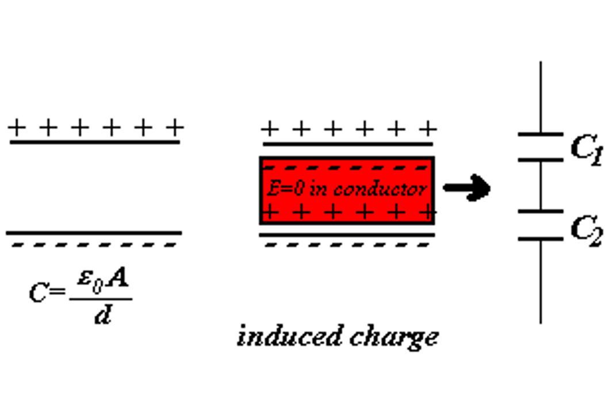{ width=80% }

$$ C_1 = \epsilon_0 \dfrac{A}{d_1} $$
$$ C_2 = \epsilon_0 \dfrac{A}{d_2} $$
$$ C = \dfrac{C_1 C_2}{C_1 + C_2} = \epsilon_0 \dfrac{A}{d_1 + d_2} > \epsilon_0 \dfrac{A}{d} $$
因为显然 $d_1 + d_2 < d$

- 若在平行板电容器间插入一个**电介质**，电介质与电容器之间几乎没有缝隙。此时电介质的表面会产生**束缚电荷**，由于电介质内部会产生感应电场，将原电场的一部分抵消从而使电势差减小，在带电量不变的情况下，由 $C = \dfrac{Q}{V}$ 可知电容增大。此时我们就称这个电介质被极化（Polarization）了。

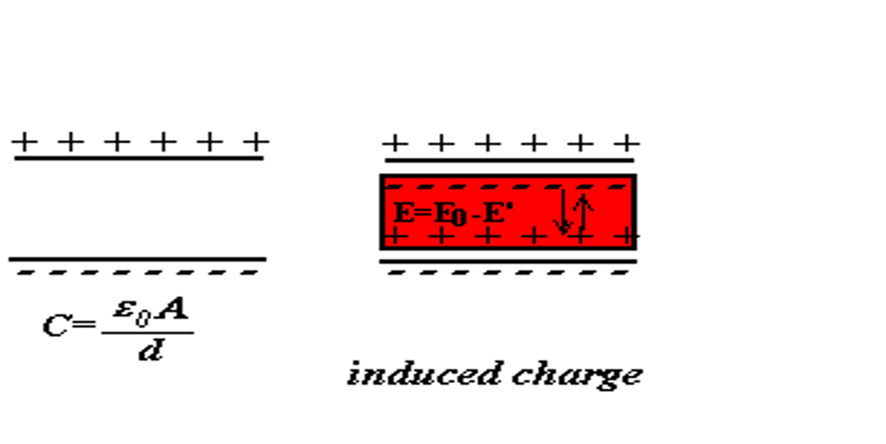{ width=80% }

$$ V = Ed = (E_0 - E')d < E_0 d $$ 

$$ C = \dfrac{q}{Ed} = \dfrac{q}{(E_0 - E')d} > \dfrac{q}{E_0 d} = C_0 $$

从以上两种情况可以看出，无论插入导体还是电介质都可以使电容增大.但插入导体后将会使得两个小电容器的 $d$ 变得很小，这样就容易导致电容器被击穿，因此通常采取插入电介质的方法来提高电容。

!!! tip
    虽然导体和电介质在外部电场中产生的电荷在英文中都称为“induced charge”，但在中文中我们通常将导体上的电荷称为感应电荷，而电介质上的电荷称为束缚电荷，这样我们就可以区分开它们。

#### 极化的微观解释

!!! info "无极分子电介质与有极分子电介质"
    - Non-polar dielectrics (无极分子电介质)

        指的是分子的正负电荷中心重合，如氮气、氧气二氧化碳等。

    - Polar dielectrics (有极分子电介质)

        指的是分子的正负电荷中心不重合，如水、氯化氢等。

- 对于无极分子电介质，当一个外界电场作用于其上时，它的正负电荷中心会产生位移，不再重合，从而形成感生电偶极矩（Induced electric dipole moment），进而产生一个与外界电场方向相反的电场，这就是电子位移极化（Electric displacement polarization）。

    - 当电介质内部的正负电荷矢量求和之后，最终只有两侧的电荷没有被抵消掉，相当于在电介质的表面分别产生了正负电荷。

    { width=80% }

- 对于有极分子电介质，当一个外界电场作用于其上时，其内部原本杂乱无章的电荷（电偶极矩）会受力发生偏转，产生的力矩会使电偶极矩偏向于电场的方向，称其为取向极化（Alignment polarization）。

    - 当发生取向极化时，实际上也会发生电子位移极化，但后者的效果会比前者低两个数量级，因此通常可以忽略；但在高频电场中时，电子位移极化会占据更主要的位置。

    { width=80% }

### 极化强度矢量 

!!! INFO "极化强度矢量 $\overrightarrow{P}$ (Polarization)"
    极化强度矢量 $\overrightarrow{P}$ 定义为单位体积内的电偶极矩之和，即
    $$ \overrightarrow{P} = \dfrac{\sum \overrightarrow{p}}{\Delta V} $$

    通常来说，极化强度矢量是一个空间的函数 $\overrightarrow{P}(x, y, z)$，它可能是均匀的，也可能是非均匀的。

{ align=left width=45% }
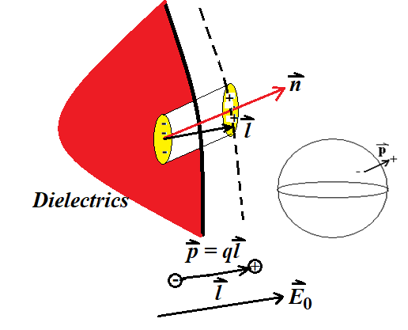{ width=50% }

对于均匀的电介质，束缚电荷仅分布在电介质的表面。

对于不均匀的电介质，不妨设其为一个球体，考虑一个外部电场 $\overrightarrow{E}_0$，直觉告诉我们正电荷将更多地聚集在球体的右侧，负电荷反之。但要求出具体的极化强度矢量就需要一些技巧。

不妨在球体右表面取一个很小的圆柱体

- 或许可能会带来误导，但实际上图中圆柱的底面和顶面与其母线垂直
- 圆柱体的轴线方向 $\overrightarrow{n}$ 与球体的半径方向相同
- $\overrightarrow{l}$ 表示电偶极矩的长度矢量，与外部电场方向相同，与 $\overrightarrow{n}$ 有一定夹角，
- 下面的 $n$ 表示单位体积中分子的数量
$$ dN = ndV = nld A \cos \theta $$

$$\begin{aligned}
dq' &= qdN = nqld A \cos \theta \\\\
    &= PdA \cos \theta \\\\
    &= \overrightarrow{P} \cdot d\overrightarrow{A}
\end{aligned}$$

{ align=right width=23% }

$$ \oiint \overrightarrow{P} \cdot d\overrightarrow{A} = \sum_{out}q' = -\sum_{in}q' $$

$$ \sigma' = \dfrac{dq'}{dA} = P\cos \theta = \overrightarrow{P} \cdot \overrightarrow{n} = P_n $$

这里的 $\sigma'$ 表示因外部电场而产生的束缚电荷的面密度

由上式就可以推断出面电荷的符号与外部电场之间的关系

- $\theta < \dfrac{\pi}{2}$，$\sigma_e' > 0$，+

- $\theta > \dfrac{\pi}{2}$，$\sigma_e' < 0$，-

### 退极化场

上面提到过，束缚电荷会在电介质内部产生一个与外界电场方向相反的电场 $\overrightarrow{E}'$，称其为退极化场(Depolarization Field)
$$ \overrightarrow{E} = \overrightarrow{E}_0 + \overrightarrow{E}' $$

!!! Example
    === "球形电介质"
        考虑一个球形电介质，带有均匀的极化强度矢量 $\overrightarrow{P}$，计算球心的退极化场 $\overrightarrow{E}'$

        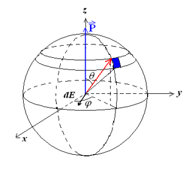{ align=right width=40% }
        
        $$ \sigma_e' = P_n = P\cos \theta $$

        $$ dE' = \dfrac{dq'}{4\pi \epsilon_0 R^2} = \dfrac{\sigma_e' dA}{4\pi \epsilon_0 R^2} = \dfrac{P\cos \theta dA}{4\pi \epsilon_0 R^2} $$

        $$ dA = Rd\theta \cdot R\sin \theta d\phi = R^2 \sin \theta d\theta d\phi $$

        从而可以得到
        $$ dE' = \dfrac{P}{4\pi \epsilon_0} \cos \theta \sin \theta d\theta d\phi $$

        $$\begin{aligned}
        dE_z' &= dE' \cos (\pi - \theta) = -dE' \cos \theta \\\\
        &= -\dfrac{P}{4\pi \epsilon_0} \cos^2 \theta \sin \theta d\theta d\phi
        \end{aligned}$$

        $$\begin{aligned}
        E_z' &= \oiint dE' \\\\
        &= -\dfrac{P}{4\pi \epsilon_0} \int_0^{\pi} \cos^2 \theta \sin \theta d\theta \int_0^{2\pi} d\phi \\\\
        &= -\dfrac{P}{3\epsilon_0}
        \end{aligned}$$

    === "平行板电介质"
        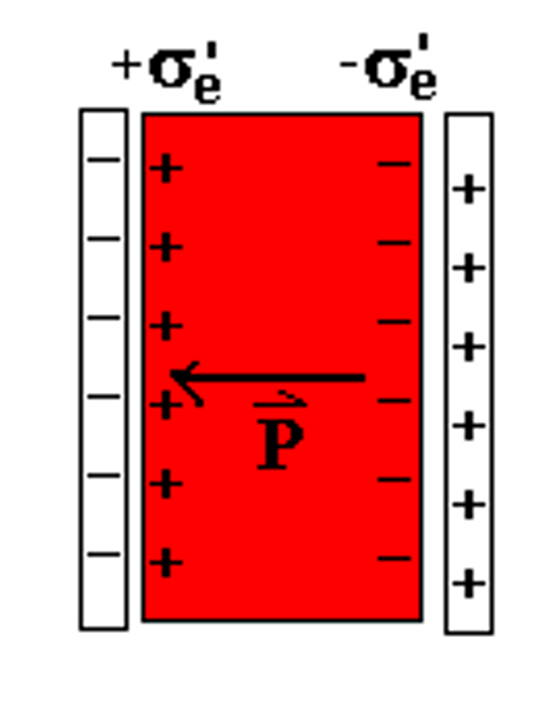{ align=right width=40% }

        $$ \sigma_e' = P\cos \theta = P $$

        $$ E = \dfrac{\sigma_e'}{\epsilon_0} $$

### 电介质的极化规律

- 对于各向同性（general isotropic）的材料
$$ \overrightarrow{P} = \chi_e \epsilon_0 \overrightarrow{E} $$

    - 其中 $\chi_e$ 称为极化率（Polarization coefficient）
    - $\kappa_e = 1 + \chi_e$

- 对于不各向同性（anisotropic）的材料($SiO_2$晶体水晶等)

$$
\begin{pmatrix}P_x \\\\ P_y \\\\ P_z \\\\ \end{pmatrix} = 
\begin{pmatrix}\chi_{xx} & \chi_{xy} & \chi_{xz}\\\\ \chi_{yx} & \chi_{yy} & \chi_{yz}\\\\ \chi_{zx} & \chi_{zy} & \chi_{zz}\\\\ \end{pmatrix}
\begin{pmatrix} \epsilon_0 E_x \\\\ \epsilon_0 E_y \\\\ \epsilon_0 E_z \\\\ \end{pmatrix}
$$

$$ P_x = \chi_{xx} \epsilon_0 E_x + \chi_{xy} \epsilon_0 E_y +\chi_{xz} \epsilon_0 E_z $$

$$ P_y = \chi_{yx} \epsilon_0 E_x + \chi_{yy} \epsilon_0 E_y +\chi_{yz} \epsilon_0 E_z $$

$$ P_z = \chi_{zx} \epsilon_0 E_x + \chi_{zy} \epsilon_0 E_y +\chi_{zz} \epsilon_0 E_z $$

### 电位移矢量

现在我们引入一个新的物理量，电位移矢量 $\overrightarrow{D}$，它定义为
$$ \overrightarrow{D} = \epsilon_0 \overrightarrow{E} + \overrightarrow{P}$$

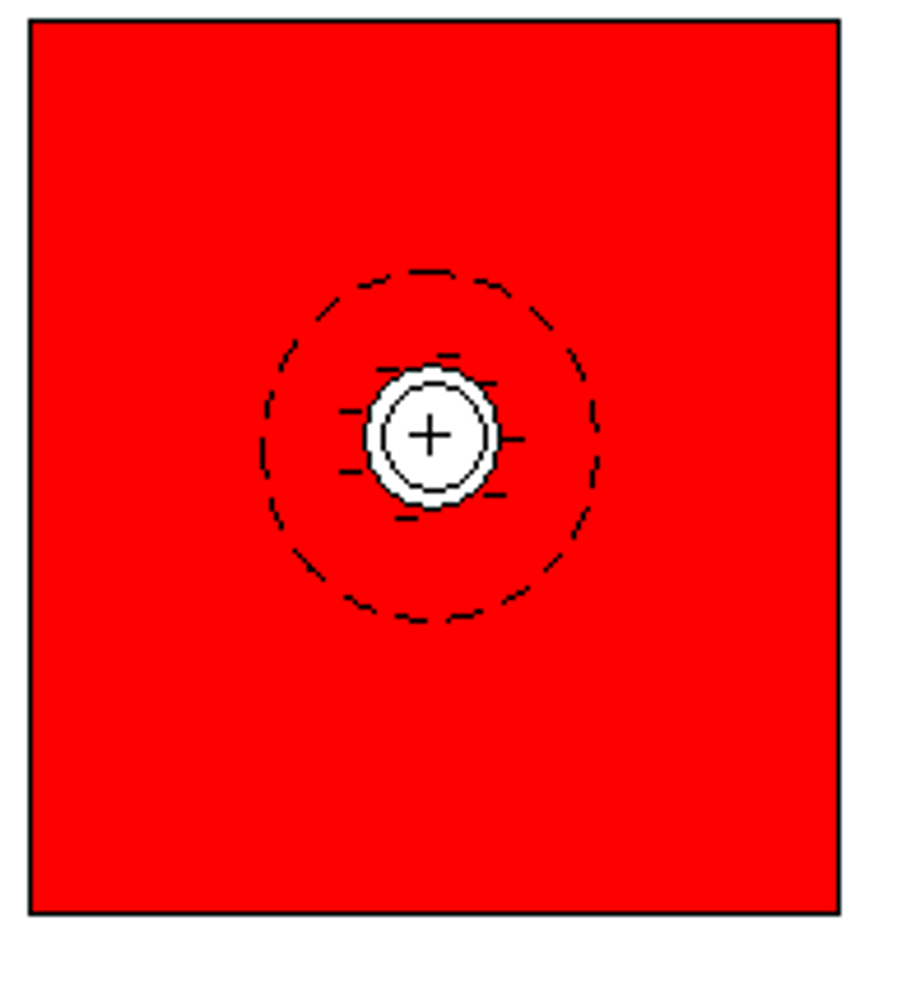{ align=right width=30% }

由高斯定理，此时高斯面包围的电荷包括点电荷和束缚电荷，因此有
$$ \epsilon_0 \oiint \overrightarrow{E} \cdot d\overrightarrow{A} = \sum_{In}(q_0 + q') $$

又根据极化强度矢量的定义和前面推导出的式子，我们有
$$ \oiint \overrightarrow{P} \cdot d\overrightarrow{A} = -\sum_{In} q' $$

于是
$$ \oiint (\epsilon_0 \overrightarrow{E} + \overrightarrow{P}) \cdot d\overrightarrow{A} = \sum_{In} q_0 $$

因此最终得到
$$ \overrightarrow{D} \cdot d\overrightarrow{A} = \sum_{In} q_0 $$
这就是**电介质中的高斯定理**

!!! tip
    当我们直接对电介质使用普通的高斯定律 $ \oiint \overrightarrow{E} \cdot d\overrightarrow{A} = \dfrac{q_{in}}{\epsilon_0} $ 时，我们会发现这时候已经将电介质中的束缚电荷考虑进去了
    
    假如我们希望求出电介质中的自由电荷，我们就需要使用电介质中的高斯定律 $ \oiint \overrightarrow{D} \cdot d\overrightarrow{A} = q_{free} $

    这就是为什么我们需要引入电位移矢量 $\overrightarrow{D}$ 的原因。

!!! note
    利用电位移矢量 $\overrightarrow{D}$ 我们可以得到如下推导：

    $$\begin{aligned}
    \overrightarrow{D} &= \epsilon_0 \overrightarrow{E} + \overrightarrow{P} \\\\
    &= \epsilon_0 \overrightarrow{E} + \chi_e \epsilon_0 \overrightarrow{E} \\\\
    &= (1 + \chi_e) \epsilon_0 \overrightarrow{E} \\\\
    &= \kappa_e \epsilon_0 \overrightarrow{E} \end{aligned}$$
    
    因此 $$ \kappa_e = 1 + \chi_e $$

    - $\kappa_e$ Dielectric constant（介电常数）
    - $\chi_e$ Polarization coefficient（极化率）
    
---

## 稳恒电流

### 电流强度与电流密度

**电流强度** $i$ 定义为单位时间内通过某个截面的电荷量，即
$$ i = \lim_{\Delta t \to 0} \dfrac{\Delta q}{\Delta t} = \dfrac{dq}{dt} $$

&& $\overrightarrow{j}$ 定义为单位时间内通过单位面积的电荷量

$$\begin{aligned}
di &= \overrightarrow{j} \cdot d\overrightarrow{A} \\\\
i &= \iint_A \overrightarrow{j} \cdot d\overrightarrow{A} \\\\
&= \iint j \cos\theta dA
\end{aligned}$$

### 电流连续性方程

在电流场中，电荷不会消失，因此电流在空间中的分布是连续的，即电流的流入量等于流出量。
$$ \oiint_A \overrightarrow{j} \cdot d\overrightarrow{A} = -\dfrac{dq}{dt} = 0 $$

### 欧姆定律、电阻、电阻率

- 欧姆定律：电流强度与电压成正比，与电阻成反比
- $\Delta V = iR$，$i = \dfrac{\Delta V}{R}$，$R = \dfrac{\Delta V}{i}$
- 电导：电阻的倒数，单位为 $\Omega^{-1}$，记为 $G = \dfrac{1}{R}$
- 单位：电阻：欧姆($\Omega$)，电导：西门子($\Omega^{-1} = S$)

$$ R = \rho \dfrac{L}{A} = \int \rho \dfrac{dl}{A} $$
其中 $\rho$ 为电阻率（resistivity），$L$ 为电阻的长度，$A$ 为电阻的横截面积

电导率：$ \sigma = \dfrac{1}{\rho} $

### 欧姆定律的微分和积分形式

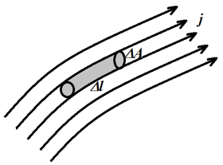{ align=right width=40% }

微分形式：
$$ \Delta i = \dfrac{\Delta V}{R} $$
$$ j\Delta A = \dfrac{E \Delta l}{\rho \dfrac{\Delta l}{\Delta A}} = \dfrac{E \Delta A}{\rho} $$                    
$$ j = \dfrac{E}{\rho} = \sigma E $$

由上式可以得到 $ \overrightarrow{j} = \dfrac{E}{\rho} = \sigma \overrightarrow{E} $

微分形式的欧姆定律对于每一点都是成立的，更普适。

积分形式：
$$ i = \iint \overrightarrow{j} \cdot d\overrightarrow{A} $$
$$ \Delta V = \iint \overrightarrow{E} \cdot d\overrightarrow{l}       $$
$$ R = \int \rho \dfrac{dl}{A} $$

### 电功率和焦耳定律

电功率 $P$ 的单位为瓦特（W），定义为单位时间内电场力做的功，

$$ W = q V = i \Delta t V $$

$$ P = \dfrac{W}{\Delta t} = iV = i^2 R = \dfrac{V^2}{R} $$

### 欧姆定律的微观解释

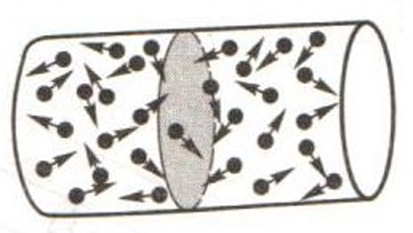{ align=right width=30% }

电流实际上就是定向移动的电荷

- 当外界电场为零时，到体内的电荷做无规则的热运动，电荷之间的运动相互抵消，因此电流为零。
- 当外界电场不为零时，电场会使电荷受力，电荷会在电场中做定向漂移运动，从而产生电流。

电荷在导体中运动时会与其他电荷发生碰撞或相互干涉，因此在这里有几个重要的概念值得强调：

- 平均自由程（mean free path）：$\lambda$，电荷在导体中每次相互碰撞之间移动的平均距离
- 平均自由时间（mean free time）：$\tau$，电荷在导体中每次相互碰撞之间移动的平均时间
- 平均热运动速度（mean thermal speed）：$v_{t}$
- 平均漂移速度（mean drift speed）：$u$

首先考虑牛顿定律

$$\begin{aligned}
\overrightarrow{a} &= -\dfrac{e}{m} \overrightarrow{E} \\\\
\overrightarrow{u_1} &= \overrightarrow{a}\tau = -\dfrac{e}{m} \overrightarrow{E} \tau \\\\
\overrightarrow{u} &=\dfrac{\overrightarrow{u_0} + \overrightarrow{u_1}}{2} = -\dfrac{e}{2m} \overrightarrow{E} \tau = -\dfrac{e}{2m} \dfrac{\lambda}{v_{t}} \overrightarrow{E}
\end{aligned}$$

我们又有电流密度的定义，即单位时间内通过某个截面的电荷量，不妨设单位体积里有 $n$ 个电子（电子密度）

$$\begin{aligned}
\Delta q &= neu \Delta t \cdot \Delta A \\\\
\Delta i &= \dfrac{\Delta q}{\Delta t} = neu \Delta A \\\\
j &= \dfrac{\Delta i}{\Delta A} = neu
\end{aligned}$$

此外，我们再定义一个 $\sigma$ 那么我们最终就可以得到电流密度矢量的表达式

$$\begin{aligned}
\sigma &= \dfrac{ne^2}{2m} \dfrac{\lambda}{v_t} \\\\
\overrightarrow{j} &= -ne\overrightarrow{u} = \dfrac{ne^2}{2m} \dfrac{\lambda}{v_t} \overrightarrow{E} \\\\
&= \sigma \overrightarrow{E}
\end{aligned}$$

### 电动势

电动势（Electromotive Force，emf）$\varepsilon$ 定义为将单位正电荷从负极通过电源内部移到正极，非静电力所做的功，即
$$ \varepsilon = \int_{-}^{+} \overrightarrow{K} d\overrightarrow{l} $$
其中 $\overrightarrow{K}$ 为非静电力