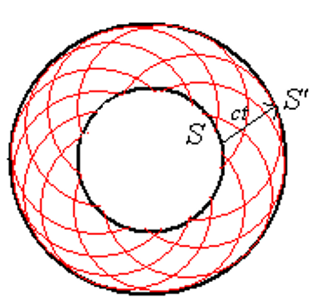

# 几何光学

## 可见光

<figure>
    
</figure>

!!! property "可见光"
    - 可见光波长范围：$400nm - 700nm$ 
    - 可见光频率范围：$7 \times 10^{14} Hz - 4 \times 10^{14} Hz $
    - 波长与频率对应的关系：$\lambda f = c$
    - 人眼最敏感的可见光波长为 $550nm$ 左右，为黄绿光
    - 波长越长，则频率越低、能量越低，因此红光能量最低，紫光能量最高

### 波的多普勒效应

!!! note "多普勒效应"
    $$ f = f_0 \dfrac{v \pm v_0}{v \pm v_s} $$ 
    其中 $v_0$ 表示观测者的运动速度，$v_s$ 表示波源的运动速度

对于光波来说，需要使用相对论多普勒效应
$$ f = f_0 \dfrac{ \sqrt{1 - \dfrac{u^2}{v^2} } }{ 1+\dfrac{u}{v} \cos\theta } $$

其中 $f_0$ 是在波源保持静止的参考系中测得的频率，$\theta$ 是相对运动方向与光波传播方向的夹角

- 横向（transverse）多普勒效应：$\theta = \dfrac{\pi}{2}$ $$ f = f_0 \sqrt{1 - \dfrac{u^2}{v^2} }  $$

- 纵向（longitudinal）多普勒效应：

    - 波源靠近 $\theta = \pi$: $$ f = f_0 \sqrt{\dfrac{1+\frac{u}{c}}{1-\frac{u}{c}}} $$

    - 波源远离 $\theta = 0$： $$ f = f_0 \sqrt{\dfrac{1-\frac{u}{c}}{1+\frac{u}{c}}} $$

对于光波，会出现红移和蓝移现象

- 红移：光源和观察者彼此远离，频率减小，波长增大，光谱向红光靠近 
$$ f = f_0 \sqrt{\dfrac{1-\frac{u}{c}}{1+\frac{u}{c}}} $$

- 蓝移：光源和观察者彼此接近，频率增大，波长减小，光谱向蓝光靠近
$$ f = f_0 \sqrt{\dfrac{1+\frac{u}{c}}{1-\frac{u}{c}}} $$

## 几何光学

!!! info 
    - 几何光学：在光沿直线传播的情况下讨论问题，遇见的物体大小远大于光的波长$\lambda$

        mirrors(反射镜)， lenses(透镜)， prisms(棱镜)
        
    - 物理光学：光的传播通过狭缝或是遇见的物体尺寸非常小，足以和光的波长$\lambda$相比，需要考虑波动性

        reflection(反射)， refraction(折射)， interference(干涉)， diffraction(衍射)， polarization(偏振)

!!! note "几何光学三定律"
    1. 光沿直线传播：光在均匀介质中沿直线传播
    2. 光的反射定律：反射角等于入射角
    3. 光的折射定律：折射角、入射角和折射率之间存在如下关系
        $$ n_1 \sin \theta_1 = n_2 \sin \theta_2 $$

        其中 $n_1$ 和 $n_2$ 分别是两种介质的折射率，$\theta_1$ 和 $\theta_2$ 分别是入射角和折射角

折射率的定义：$n = \dfrac{c}{v}$，其中 $c$ 是真空中的光速，$v$ 是介质中的光速，根据麦克斯韦方程组，我们知道折射率为 $n = \sqrt{\kappa_e \kappa_m}$

在相同的介质中，不同频率的光的折射率也有所不同，频率越高，折射率越大
$$ n_{blue} = 1.53, \quad n_{red} = 1.52 $$

### 全反射

当光从光密介质射入光疏介质（如从玻璃或水到空气），当入射角大于临界角时，光就不会再发生折射，而是全部被反射回光密介质，这种现象称为全反射

<figure>
    
</figure>

当入射角恰好达到临界角时，折射角为 $\theta_2 = 90^\circ$，又由 $n_1 \sin \theta_1 = n_2 \sin \theta_2$，可得
$$ \sin \theta_1 = \dfrac{n_2}{n_1} $$

!!! tip
    空气中的折射率为 1，因此我们可以以下公式求解某介质的折射率
    $$ n = \dfrac{\sin \theta_1}{\sin \theta_2} $$
    其中 $\theta_1$ 为空气中的入射角，$\theta_2$ 为折射角

### 色散

<figure>
    
</figure>

色散是指白光或复色光在通过介质时，由于其中不同波长的光由于折射率的不同而产生的不同程度的偏折，从而使得白光被分解为各种单色光的现象。这是光的波动性的一种表现

在相同的介质中，不同频率的光的折射率也有所不同，频率越高（波长越短），折射率越大；频率越低（波长越长），折射率越小

- 短波长的光（如紫光）波长小，频率高，折射率大，偏折角大
- 长波长的光（如红光）波长大，频率低，折射率小，偏折角小

!!! note "求棱镜的折射率"
    { align=right width=30% }

    原光线与经过棱镜折射后的光线夹角为 $\delta$，棱镜的顶角为 $\alpha = i_2 - i'_2$

    $$ \begin{aligned}
    \delta &= (i_1 - i_2) + (i'_1 - i'_2) = (i_1 + i'_1) - (i_2 + i'_2) \\
    &= (i_1 + i'_1) - \alpha 
    \end{aligned} $$

    要求出棱镜的折射率，我们需要知道偏移角 $\delta$ 的最小值。对 $\delta$ 关于入射角 $i_1$ 求导，令导数为 0，即可求得最小值
    $$ \dfrac{d\delta}{di _ 1} = 1 + \dfrac{di' _ 1}{di _ 1} = 0 $$
    因此我们知道此时 $i_1 = i'_1$，带入求得 $\delta_{min} = 2i _ 1 - \alpha$ 后，再带入折射定律，即可求得折射率
    $$ n = \dfrac{\sin \left( \dfrac{\delta _ {min} + \alpha}{2} \right) }{\sin \dfrac{\alpha}{2}} $$

### 惠更斯原理

!!! info "惠更斯原理"
    波前（例如球面波或平面波的最边缘）上的每一点都可以被看作是一个新的次波源，这些次波源会以相同的速度向外发出次级波前。通过将所有这些次级波前叠加起来，可以得到新的总波前。这意味着，任何时刻的总波前都是由之前所有点产生的次级波前组合而成的。

    { align=left width=30% }
    { width=30% }

!!! example "惠更斯原理解释光的反射和折射"
    <figure>
        
    </figure>

    - 反射：
    $$ A_1 C_1 = A_n B_n = v_1 t_n $$
    $$ \Delta A_1 C_1 B_n \cong \Delta B_n A_n A_1 $$
    $$ \therefore \angle A_n A_1 B_n = \angle C_1 B_n A_1 $$
    最后就可以得到反射定律：反射角等于入射角
    $$ \Rightarrow i_1' = i_1  $$

    - 折射：
    $$ \angle D_1 B_n A_1 = i_2 $$
    $$ \sin i_2 = \frac{A_1 D_1}{A_1 B_n}, \quad \sin i_1 = \frac{A_n B_n}{A_1 B_n} $$
    $$ \therefore \frac{\sin i_1}{\sin i_2} = \frac{A_n B_n}{A_1 D_1} = \frac{v_1 t}{v_2 t} = \frac{v_1}{v_2} $$
    
    这时我们把 $v=\dfrac{c}{n}$ 带入上式，就可以得到折射定律
    $$ \dfrac{\sin i_1}{\sin i_2} = \dfrac{n_2}{n_1} $$

### 费马原理

{ align=right width=25% }

光在介质中的运动速度小于真空中的光速，在同等的时间内，光在介质中的运动距离要更短。我们将光程定义为在相同的时间内，光在介质中的运动距离乘以介质的折射率，也就是说，光程相当于光在真空中运动的“等效距离”
$$ L = n_1 s_1 + n_2 s_2 $$
其中 $s_1$ 和 $s_2$ 分别是光在两种介质中的实际运动距离，$n_1$ 和 $n_2$ 分别是两种介质的折射率

对于更一般的情况，我们采用积分的形式
$$ L = \int n ds $$

!!! info "费马原理"
    费马原理是指，若光线在传播过程中可以成像，那么光程的变分为零（对于某一个变量求偏导为零，也就是光程取极值），即
    $$ \delta L = \delta \int n ds = 0 $$

!!! example "使用费马原理证明反射和折射"
    === "反射"
        { align=right width=30% }

        如图所示，光在空气中照射到介质发生反射，光程为 
        $$ L = \sqrt{a^2 + x^2} + \sqrt{b^2 + (d-x)^2} $$

        对光程求变分，令 $\delta L = 0$，即
        $$ \dfrac{dL}{dx} = \dfrac{x}{\sqrt{a^2 + x^2}} - \dfrac{d-x}{\sqrt{b^2 + (d-x)^2}} = 0 $$
        于是我们就得到
        $$ \dfrac{x}{\sqrt{a^2 + x^2}} = \dfrac{d-x}{\sqrt{b^2 + (d-x)^2}} $$
        即
        $$ \sin \theta_1 = \sin \theta_2 \Rightarrow \theta_1 = \theta_2 $$
        反射角等于入射角，这就是反射定律

    === "折射"
        { align=right width=30% }

        如图所示，光在从折射率为 $n_1$ 的介质射入折射率为 $n_2$ 的介质，光程为 
        $$ L = n_1 \sqrt{a^2 + x^2} + n_2 \sqrt{b^2 + (d-x)^2} $$

        对光程求变分，令 $\delta L = 0$，即
        $$ \dfrac{dL}{dx} = n_1 \dfrac{x}{\sqrt{a^2 + x^2}} - n_2 \dfrac{d-x}{\sqrt{b^2 + (d-x)^2}} = 0 $$
        于是我们就得到
        $$ n_1 \dfrac{x}{\sqrt{a^2 + x^2}} = n_2 \dfrac{d-x}{\sqrt{b^2 + (d-x)^2}} $$
        即
        $$ n_1 \sin \theta_1 = n_2 \sin \theta_2 $$
        这就是折射定律

## 成像

光线经过透镜折射或者镜面反射后，会在一定位置形成物体的像，像分为实像和虚像，成像的物体也可分为实物和虚物

{ align=left width=40% }
{ width=43% }

{ align=left width=40% }
{ width=40% }

- 实像：经过折射或反射后的实际光线通过同一点，就称在交点处形成实像
- 虚像：经过折射或反射后的光线不通过同一点，但它们的反向延长线交于一点，就称在交点处形成虚像
- 实物：出发光线交汇于同一点（从同一点出发）
- 虚物：出发光线不交汇于同一点，但出发光线的延长线交于一点

根据费马原理我们知道成像时所有的光线等光程。

我们讨论的问题一般是物体从透镜左边发出光线，在透镜右侧成像，因此称左侧为物方，右侧为像方。

### 球面镜成像

<figure>
    
</figure>

我们首先讨论球面镜折射成像的规律，在上图中，点 $C$ 为球心，$r$ 为半径，$Q$ 和 $Q'$ 分别是物体和像的位置，物和像距离球面的距离分别为 $o$ 和 $i$

首先在三角形 $QCM$ 和 $Q'CM$ 中使用正弦定理

$$ \begin{cases}
\dfrac{p}{\sin \phi} = \dfrac{o+r}{\sin \theta} = \dfrac{r}{\sin u} \\\\
\dfrac{p'}{\sin \phi} = \dfrac{i-r}{\sin \theta'} = \dfrac{r}{\sin u'}
\end{cases} $$

其中 $n \sin \theta = n' \sin \theta'$，$\theta - u = \theta' + u' = \phi$

于是得到

$$ \begin{cases}
\dfrac{p}{o+r} = \dfrac{\sin \phi}{\sin \theta} \\\\
\dfrac{p'}{i-r} = \dfrac{\sin \phi}{\sin \theta'}
\end{cases} $$

我们再使用余弦定理，并带入 $\cos \phi = 1 - 2\sin^2 \dfrac{\phi}{2}$

$$ \begin{cases}
p^2 = (o+r)^2 + r^2 - 2r(o+r) \cos \phi = o^2 + 4r(o+r) \sin^2 \dfrac{\phi}{2} \\\\
p'^2 = (i-r)^2 + r^2 - 2r(i-r) \cos \phi = i^2 + 4r(i-r) \sin^2 \dfrac{\phi}{2}
\end{cases} $$

代回前面的式子就得到
$$ \Longrightarrow \dfrac{o^2}{n^2 (o+r)^2} - \dfrac{i^2}{n'^2 (i-r)^2} = -4r \sin^2 \dfrac{\phi}{2} \left[ \dfrac{1}{n^2 (o+r)} + \dfrac{1}{n'^2 (i-r)} \right] $$

上面这个式子告诉我们，由于从同一点出发的光线的 $\phi$ 不同，成像的位置也会不同，因此球面不能成像。

仅有两种情况下球面可以成像

- 其中一种情况满足

    $$ \begin{cases}
    \dfrac{o^2}{n^2 (o+r)^2} - \dfrac{i^2}{n'^2 (i-r)^2} = 0 \\\\
    \dfrac{1}{n^2 (o+r)} + \dfrac{1}{n'^2 (i-r)} = 0
    \end{cases} $$

    此时 $o$ 和 $i$ 与 $\phi$ 无关，物和像所在的这一对点我们称为**齐明点**。

- 另一种情况是傍轴近似的情况，即 $\phi$ 很小
    $$ \sin^2 \dfrac{\phi}{2} \approx \dfrac{\phi^2}{4} \to 0 $$

    此时我们可以近似得到
    $$ \dfrac{o^2}{n^2 (o+r)^2} = \dfrac{i^2}{n'^2 (i-r)^2} $$
    即
    $$ \dfrac{o}{n (o+r)} = \dfrac{i}{n' (i-r)} $$
    $$ \dfrac{n'}{i} + \dfrac{n}{o} = \dfrac{n'-n}{r} $$

    当 $i \to \infty$ 时，我们可以得到这个球面镜的第一焦距为 
    $$ f = \dfrac{n}{n'-n} r $$
    当 $o \to f$ 时，我们可以得到这个球面镜的第二焦距为
    $$ f' = \dfrac{n'}{n'-n} r $$
    于是
    $$ \dfrac{f}{f'} = \dfrac{n}{n'} \Longrightarrow \dfrac{f}{o} + \dfrac{f'}{i} = 1 $$

这就是球面镜的焦距公式

!!! note "符号约定"
    我们假设光线从左侧照射到右侧

    - $Q$ 在左侧时为实物，$o>0$ 

        $Q$ 在右侧时为虚物，$o<0$

    - $Q'$ 在右侧时为实像，$i>0$

        $Q'$ 在左侧时为虚像，$i<0$

    - 球心 $C$ 在左侧时为凹面镜，$r<0$

        球心 $C$ 在右侧时为凸面镜，$r>0$

    { align=left width=30% }
    { width=40% }

### 球面镜反射成像

{ align=right width=30% }

球面镜发生反射时，$Q$ 和 $Q'$ 都在左侧，成虚像 $i < 0$

事实上反射可以看作是折射的一种特殊情况
$$ n \sin \theta = n' \sin \theta' $$

如果 $\theta > 0$，则 $\theta' < 0$，就得到
$$ n = -n' $$

于是第一和第二焦距分别为
$$ f = \dfrac{n}{n'-n} r = -\dfrac{r}{2} $$
$$ f' = \dfrac{n'}{n'-n} r = \dfrac{r}{2} $$

带入焦距公式 $ \dfrac{f}{o} + \dfrac{f'}{i} = 1 $ 就可以得到
$$ \dfrac{1}{o} + \dfrac{1}{i} = -\dfrac{2}{r} $$

特别的，对于一个平面镜，可以认为 $r \to \infty$，此时焦距公式就变为
$$ \dfrac{1}{o} + \dfrac{1}{i} = 0 $$

即物体和像到镜面的距离相等

### 傍轴物点成像和横向放大率

<figure>
    
</figure>

我们记物体和像距离透镜轴线的距离分别为 $y, y'$，我们规定在轴线上方时为正，下方时为负。

当物体很靠近轴线时，$y^2, y'^2 << o^2, i^2, r^2$，并且
$$ n\theta \approx n'\theta',\quad y \approx o \cdot \theta,\quad y' \approx i \cdot \theta' $$

因此放大率为 
$$ m = \dfrac{y'}{y} = -\dfrac{i\theta'}{o\theta} = -\dfrac{ni}{n'o} $$

对于反射，则是
$$ m = -\dfrac{i}{o} $$

### 薄透镜成像

对于绝大多数的情况，光不止会经过一个折射面

    
    

对这两个面分别使用球面镜成像的公式，我们可以得到

\\[ \begin{cases}
\dfrac{f_1}{o_1} + \dfrac{f'_1}{i_1} = 1 \\\\\\\\
\dfrac{f_2}{o_2} + \dfrac{f'_2}{i_2} = 1
\end{cases} \\]
\\[ \begin{aligned}
f_1 = \dfrac{n}{n_L-n} r_1, \quad f'_1 = \dfrac{n_L}{n_L-n} r_1 \\\\
f_2 = \dfrac{n_L}{n'-n_L} r_2, \quad f'_2 = \dfrac{n'}{n'-n_L} r_2
\end{aligned} \\]

其中我们知道 $-o_2 = i_1 - d$，即 $o_2 = d - i_1$，当透镜是一个**薄透镜**时，$d$ 很小，$i_1 \approx o_2$，因此

$$ \begin{cases}
\dfrac{f'_1 f_2}{i_1} + \dfrac{f_1 f_2}{o_1} = f_2 \\\\
\dfrac{f'_1 f'_2}{i_2} + \dfrac{f'_1 f_2}{-i_1} = f'_1 
\end{cases}
\Longrightarrow
\dfrac{f'_1 f'_2}{i_2} + \dfrac{f_1 f_2}{o_1} = f'_1 + f_2 
$$

$$ \Rightarrow \dfrac{f'_1 f'_2}{i} + \dfrac{f_1 f_2}{o} = f'_1 + f_2  $$

!!! note "磨镜者公式"
    将上面的式子与下式进行比较
    $$ \dfrac{f}{o} + \dfrac{f'}{i} = 1 $$

    可以得到下面两个式子

    $$ \begin{cases}
    f' = \cfrac{f'_1 f'_2}{f'_1 + f_2} = \cfrac{ \cfrac{n_L}{n_L-n} \cdot \cfrac{n'}{n'-n_L} r_1 r_2 }{ \cfrac{n_L}{n_L-n} r_1 + \cfrac{n_L}{n'-n_L} r_2 } = \cfrac{n'}{ \cfrac{n_L-n}{r_1} + \cfrac{n'-n_L}{r_2} } \\\\
    f = \cfrac{f_1 f_2}{f'_1 + f_2} = \cfrac{ \cfrac{n}{n_L-n} \cdot \cfrac{n_L}{n'-n_L} r_1 r_2 }{ \cfrac{n_L}{n_L-n} r_1 + \cfrac{n_L}{n'-n_L} r_2 } = \cfrac{n}{ \cfrac{n_L-n}{r_1} + \cfrac{n'-n_L}{r_2} }
    \end{cases} $$

    所以 $\dfrac{f'}{f} = \dfrac{n'}{n}$，如果在空气中, $n=n'=1$

    最终就可以得到磨镜者公式
    $$ f = f' = \dfrac{1}{ (n_L - 1) (\dfrac{1}{r_1} - \dfrac{1}{r_2}) } $$

!!! tip "凸透镜与凹透镜"
    - 如果 $f>0, f'>0$ 则说明透镜是一个凸透镜（converging lens）
    - 如果 $f<0, f'<0$ 则说明透镜是一个凹透镜（diverging lens）

### 成像焦距公式

对于
$$ \dfrac{f}{o} + \dfrac{f'}{i} = 1 $$

如果 $n=n', f=f'$ 就可以得到高斯形式的成像焦距公式
$$ \dfrac{1}{o} + \dfrac{1}{i} = \dfrac{1}{f} $$

<figure>
    
</figure>

对于上图来说，如果
$$ o = f + x $$
$$ i = f' + x' $$
就有
$$ \dfrac{1}{f + x} + \dfrac{1}{f' + x'} = \dfrac{1}{f} $$

就得到牛顿形式的成像焦距公式
$$ x x' = f^2 = f f' $$

!!! tip
    - 当物体 $Q$ 在左焦点 $F$ 左边时，$x>0$；在右边时，$x<0$
    - 当像 $Q'$ 在右焦点 $F'$ 右边时，$x'>0$；在左边时，$x'<0$

#### 横向放大倍数

<figure>
    
</figure>

现在我们回过头来讨论上面这幅图的放大倍数，首先我们有

$$ \begin{cases}
o_1 = o \\
-o_2 = i_1 \\
i_2 = i
\end{cases} $$

两个折射面的放大倍率分别为
$$ m_1 = -\dfrac{n i_1}{n_L o_1} \quad m_2 = -\dfrac{n_L i_2}{n' o_2} $$

于是总的放大倍数为

$$ \begin{aligned}
m = m_1 m_2 &= \dfrac{n i_1}{n_L o_1} \cdot \dfrac{n_L i_2}{n' o_2} \\
&= \dfrac{n i_1}{n_L o_1} \cdot \dfrac{n_L i}{n' (-i_1)} \\
&= -\dfrac{ni}{n'o} = -\dfrac{f i}{f' o}
\end{aligned}$$

!!! note "屈光度"
    屈光度（diopter）定义为焦距的倒数，
    $$ P = \dfrac{1}{f(m)} $$
    其中 $m$ 是放大倍数

    例如 $f = -50cm =-0.5m$，则 $P = -2.00D$ 为 200 度