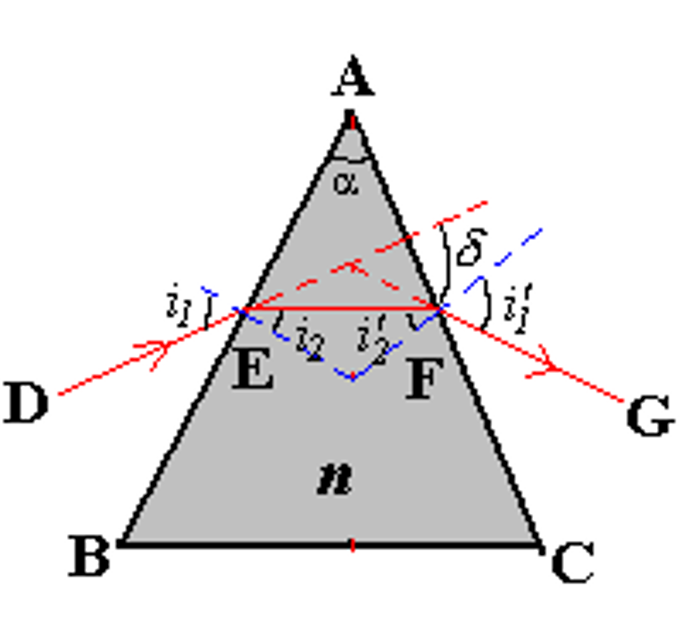
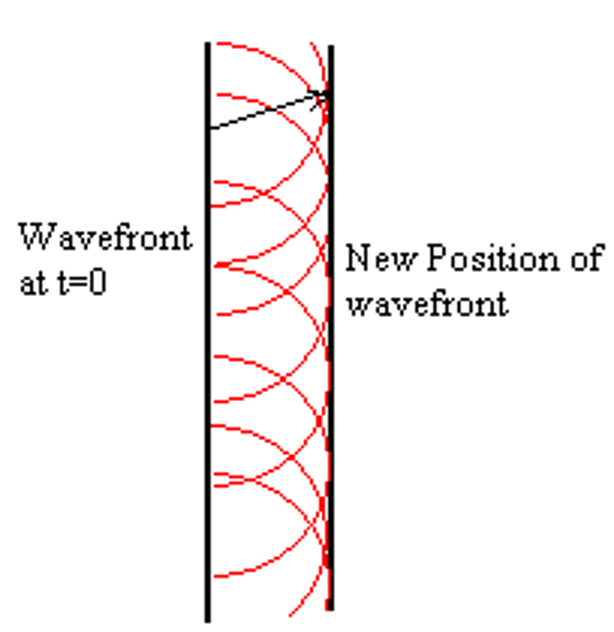

# 光学

## 可见光

<figure>
    
</figure>

!!! property "可见光"
    - 可见光波长范围：$400nm - 700nm$ 
    - 可见光频率范围：$7 \times 10^{14} Hz - 4 \times 10^{14} Hz $
    - 波长与频率对应的关系：$\lambda f = c$
    - 人眼最敏感的可见光波长为$550nm$左右，为黄绿光
    - 波长越长，则频率越低、能量越低，因此红光能量最低，紫光能量最高

### 波的多普勒效应

!!! note "多普勒效应"
    $$ f = f_0 \dfrac{v \pm v_0}{v \pm v_s} $$ 

    其中 $v_0$ 表示观测者的运动速度，$v_s$ 表示波源的运动速度

对于光波来说，需要使用相对论多普勒效应
$$ f = f_0 \dfrac{ \sqrt{1 - \dfrac{u^2}{v^2} } }{ 1+\dfrac{u}{v} \cos\theta } $$

其中 $f_0$ 是在波源保持静止的参考系中测得的频率，$\theta$ 是相对运动方向与光波传播方向的夹角

- 横向（transverse）多普勒效应：$\theta = \dfrac{\pi}{2}$
    
    $$ f = f_0 \sqrt{1 - \dfrac{u^2}{v^2} }  $$

- 纵向（longitudinal）多普勒效应：

    - 波源靠近 $\theta = \pi$:
        $$ f = f_0 \sqrt{\dfrac{1+\frac{u}{c}}{1-\frac{u}{c}}} $$

    - 波源远离 $\theta = 0$

        $$ f = f_0 \sqrt{\dfrac{1-\frac{u}{c}}{1+\frac{u}{c}}} $$

对于光波，会出现红移和蓝移现象

- 红移：光源和观察者彼此远离，频率减小，波长增大，光谱向红光靠近 
$$ f = f_0 \sqrt{\dfrac{1-\frac{u}{c}}{1+\frac{u}{c}}} $$

- 蓝移：光源和观察者彼此接近，频率增大，波长减小，光谱向蓝光靠近
$$ f = f_0 \sqrt{\dfrac{1+\frac{u}{c}}{1-\frac{u}{c}}} $$

## 几何光学

!!! info 
    - 几何光学：在光沿直线传播的情况下讨论问题，遇见的物体大小远大于光的波长$\lambda$

        mirrors(反射镜)， lenses(透镜)， prisms(棱镜)
        
    - 物理光学：光的传播通过狭缝或是遇见的物体尺寸非常小，足以和光的波长$\lambda$相比，需要考虑波动性

        reflection(反射)， refraction(折射)， interference(干涉)， diffraction(衍射)， polarization(偏振)

!!! note "几何光学三定律"
    1. 光沿直线传播：光在均匀介质中沿直线传播
    2. 光的反射定律：反射角等于入射角
    3. 光的折射定律：折射角、入射角和折射率之间存在如下关系

        $$ n_1 \sin \theta_1 = n_2 \sin \theta_2 $$

        其中 $n_1$ 和 $n_2$ 分别是两种介质的折射率，$\theta_1$ 和 $\theta_2$ 分别是入射角和折射角

折射率的定义：$n = \dfrac{c}{v}$，其中 $c$ 是真空中的光速，$v$ 是介质中的光速，根据麦克斯韦方程组，我们知道折射率为 $n = \sqrt{\kappa_e \kappa_m}$

在相同的介质中，不同频率的光的折射率也有所不同，频率越高，折射率越大
$$ n_{blue} = 1.53, \quad n_{red} = 1.52 $$

### 全反射

当光从光密介质射入光疏介质（如从玻璃或水到空气），当入射角大于临界角时，光就不会再发生折射，而是全部被反射回光密介质，这种现象称为全反射

<figure>
    
</figure>

当入射角恰好达到临界角时，折射角为 $\theta_2 = 90^\circ$，又由 $n_1 \sin \theta_1 = n_2 \sin \theta_2$，可得
$$ \sin \theta_1 = \dfrac{n_2}{n_1} $$

!!! tip
    空气中的折射率为1，因此我们可以以下公式求解某介质的折射率
    $$ n = \dfrac{\sin \theta_1}{\sin \theta_2} $$
    其中 $\theta_1$ 为空气中的入射角，$\theta_2$ 为折射角

### 色散

<figure>
    
</figure>

色散是指白光或复色光在通过介质时，由于其中不同波长的光由于折射率的不同而产生的不同程度的偏折，从而使得白光被分解为各种单色光的现象。这是光的波动性的一种表现

在相同的介质中，不同频率的光的折射率也有所不同，频率越高（波长越短），折射率越大；频率越低（波长越长），折射率越小

- 短波长的光（如紫光）波长小，频率高，折射率大，偏折角大
- 长波长的光（如红光）波长大，频率低，折射率小，偏折角小

!!! note "求棱镜的折射率"
    { align=right width=30% }

    原光线与经过棱镜折射后的光线夹角为 $\delta$，棱镜的顶角为 $\alpha = i_2 - i'_2$

    $$ \begin{aligned}
    \delta &= (i_1 - i_2) + (i'_1 - i'_2) = (i_1 + i'_1) - (i_2 - i'_2) \\
    &= (i_1 + i'_1) - \alpha 
    \end{aligned} $$

    要求出棱镜的折射率，我们需要知道偏移角 $\delta$ 的最小值，对 $\delta$ 关于入射角 $i_1$ 求导，令导数为0，即可求得最小值

    $$ \dfrac{d\delta}{di_1} = 1 + \dfrac{di'_1}{di_1} = 0 $$

    因此我们知道此时 $i_1 = i'_1$，带入求得 $\delta_{min} = 2i_1 - \alpha$ 后，再带入折射定律，即可求得折射率

    $$ n = \dfrac{\sin \left( \dfrac{\delta_{min} + \alpha}{2} \right) }{\sin \dfrac{\alpha}{2}} $$

### 惠更斯原理

!!! info "惠更斯原理"
    波前（例如球面波或平面波的最边缘）上的每一点都可以被看作是一个新的次波源，这些次波源会以相同的速度向外发出次级波前。通过将所有这些次级波前叠加起来，可以得到新的总波前。这意味着，任何时刻的总波前都是由之前所有点产生的次级波前组合而成的。

    { align=left width=30% }
    { align=right width=30% }

!!! example "惠更斯原理解释光的反射和折射"
    <figure>
        
    </figure>

    - 反射：
    $$ A_1 C_1 = A_n B_n = v_1 t_n $$
    $$ \Delta A_1 C_1 B_n \cong \Delta B_n A_n A_1 $$
    $$ \therefore \angle A_n A_1 B_n = \angle C_1 B_n A_1 $$
    最后就可以得到反射定律：反射角等于入射角
    $$ \Rightarrow i_1' = i_1  $$

    - 折射：
    $$ \angle D_1 B_n A_1 = i_2 $$
    $$ \sin i_2 = \frac{A_1 D_1}{A_1 B_n}, \quad \sin i_1 = \frac{A_n B_n}{A_1 B_n} $$
    $$ \therefore \frac{\sin i_1}{\sin i_2} = \frac{A_n B_n}{A_1 D_1} = \frac{v_1 t}{v_2 t} = \frac{v_1}{v_2} $$
    
    这时我们把 $v=\dfrac{c}{n}$ 带入上式，就可以得到折射定律

    $$ \dfrac{\sin i_1}{\sin i_2} = \dfrac{n_2}{n_1} $$

### 费马原理

## 成像

### 球面镜成像

### 球面镜反射成像

### 傍轴物点成像和横向放大率

### 薄透镜成像

