# 磁学

## 稳恒磁场

### 磁学基本现象

- 磁铁吸引铁、镍、钴等磁性物质
- 指北针指向地理北极（磁南极），指南针指向地理南极（磁北极），磁力线从磁北极指向磁南极
- 磁极同性相斥，异性相吸
- 奥斯特实验：电流通过导线时，导线周围会产生磁场；

    电线切割磁感线时，电线会产生感应电动势，这就是电磁感应现象。

- 右手定则
- 同向电流之间相互吸引，反向电流之间相互排斥
- 磁场由运动的电荷产生

### 安培定律（Ampere's Law）

根据库仑定律，我们知道两个点电荷之间的相互作用力是由它们之间的电场产生的

$$ d\overrightarrow{F}_{12} = \dfrac{dq_1 \cdot dq_2}{4\pi \epsilon_0 r_{1 2}^2} \hat{r}_{12} $$

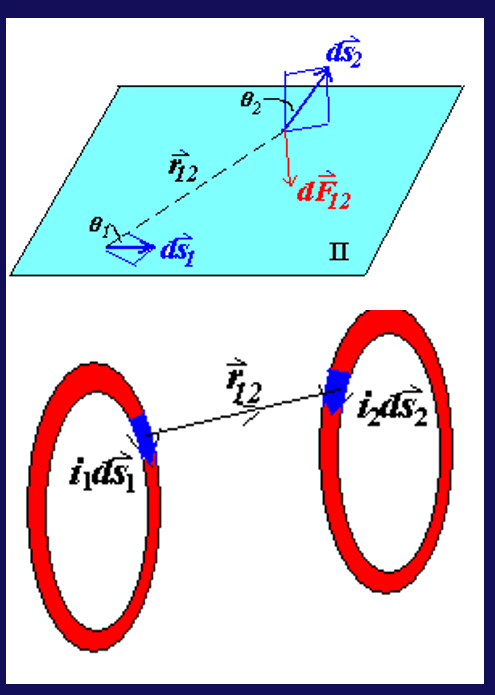{ align=right width=30% }

那么我们可以类比求出磁场力，即两个电流元（current element）$i_1ds_1$ 和 $i_2ds_2$ 之间的相互作用力
$$ dF_{12} = k \dfrac{i_1 i_2 ds_1 \sin\theta_1 ds_2 \sin\theta_2}{r_{12}^2} $$
其中 $k$ 是一个比例系数

假如我们再将电流元本身的方向以及它们之间的位移矢量也考虑进来，就得到

$$ d\overrightarrow{F}_{12} = k \dfrac{i_2 d\overrightarrow{s}_2 \times (i_1 d\overrightarrow{s}_1 \times \hat{r} _ {12})}{r_{12}^2} $$

- 其中 $k = \dfrac{\mu_0}{4\pi} = 10^{-7} \text{N/A}^2$ 称为磁场常数（magnetic constant）
- $\mu_0$ 称为真空磁导率或磁导率（permeability constant），$\mu_0 = 4\pi \times 10^{-7} \text{N/A}^2$

??? example "两道例题"
    === "平行同向的电流"
        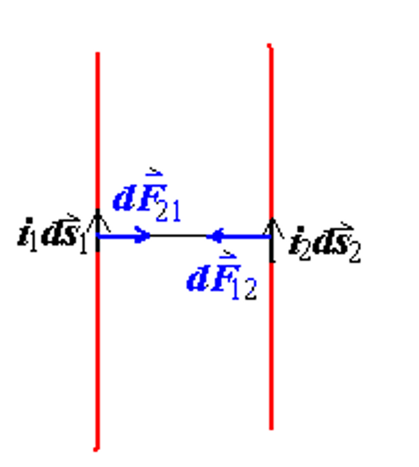{ align=right width=30% }
        对于两个平行且同向的电流，电流元 $i_1 ds_1$ 对 $i_2 ds_2$ 的作用力为

        $$ d\overrightarrow{F_{12}} = \dfrac{\mu_0}{4\pi} \dfrac{i_2 d\overrightarrow{s}_2 \times (i_1 d\overrightarrow{s}_1 \times \hat{r}_{12})}{r_{12}^2} $$

        又因为 $ ds_1 \perp \hat{r}_{12} $，因此

        $$ dF_{12} = \dfrac{\mu_0}{4\pi} \dfrac{i_1 i_2 ds_1 ds_2}{r_{12}^2} $$

        类似地，电流元 $i_2 ds_2$ 对 $i_1 ds_1$ 的作用力为
        $$ dF_{21} = \dfrac{\mu_0}{4\pi} \dfrac{i_1 i_2 ds_1 ds_2}{r_{21}^2} $$

        因此我们得到 $ dF_{12} = dF_{21} $，即两个电流的相互作用力大小是相同的，事实上我们也可以发现两个同向的电流会相互吸引

    === "相互垂直的电流"
        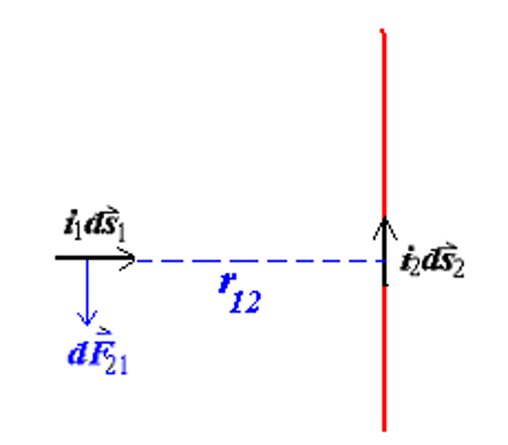{ align=right width=30% }
        对于两段相互垂直的电流，

        $$ d\overrightarrow{F}_{12} = \dfrac{\mu_0}{4\pi} \dfrac{i_2 d\overrightarrow{s}_2 \times (i_1 d\overrightarrow{s}_1 \times \hat{r}_{12})}{r_{12}^2} $$

        又因为 $ ds_1 \parallel \hat{r}_{12} $，因此

        $$ dF_{12} = 0 $$

        $$ d\overrightarrow{F}_{21} = \dfrac{\mu_0}{4\pi} \dfrac{i_1 d\overrightarrow{s}_1 \times (i_2 d\overrightarrow{s}_2 \times \hat{r}_{21})}{r_{21}^2} $$

        但是这里需要注意的是，$ ds_2 \perp \hat{r}_{21} $，因此

        $$ dF_{21} = \dfrac{\mu_0}{4\pi} \dfrac{i_1 i_2 ds_1 ds_2}{r_{21}^2} $$

        这里我们就得到一个反直觉的结论，$ dF_{12} \neq dF_{21} $，这是需要多加注意的

### 磁感应强度

在上面我们反复使用了下面的公式

$$ d\overrightarrow{F}_{12} = \dfrac{\mu_0}{4\pi} \dfrac{i_2 d\overrightarrow{s}_2 \times (i_1 d\overrightarrow{s}_2 \times \hat{r}_{12})}{r_{12}^2} $$

这是对于电流元的作用力，而对于整个环流电路的作用力，我们可以将其积分，得到

$$ d\overrightarrow{F}_2 = i_2 d\overrightarrow{s}_2 \times \dfrac{\mu_0}{4\pi} \oint_{L1} \dfrac{i_1 d\overrightarrow{s}_1 \times \hat{r}_{12}}{r_{12}^2} $$

因此我们可以对上式叉乘符号的右侧进行定义：

$$ \overrightarrow{B}_1 = \dfrac{\mu_0}{4\pi} \oint_{L1} \dfrac{i_1 d\overrightarrow{s}_1 \times \hat{r}_{12}}{r_{12}^2} $$

于是我们就得到
$$ d\overrightarrow{F}_2 = i_2 d\overrightarrow{s}_2 \times \overrightarrow{B}_1 $$

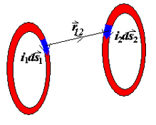{ align=right width=30% }

$ \overrightarrow{B}_1 $ 是由环路电流 $i_1$ 在电流元 $i_2 d\overrightarrow{s}_2$ 处产生的磁感应强度、

- 对于 $\overrightarrow{B}_1$ 的大小，我们定义为 $F_2$ 变化最快的方向中 $F_2$ 与 $i_2 ds_2$ 的比值

$$ B_1 = \dfrac{(F_2)_{max}}{i_2 ds_2} $$  

- $\overrightarrow{B}_1$ 的方向由 $i_1 ds_1$ 与 $\hat{r}_{12}$ 的叉乘方向决定

$$ \overrightarrow{B}_1 = \dfrac{\mu_0}{4\pi} \oint_{L1} \dfrac{i_1 d\overrightarrow{s}_1 \times \hat{r}_{12}}{r_{12}^2} $$

### 环路电流的磁场

#### Biot-Savart Law (毕奥-萨阀尔定理)

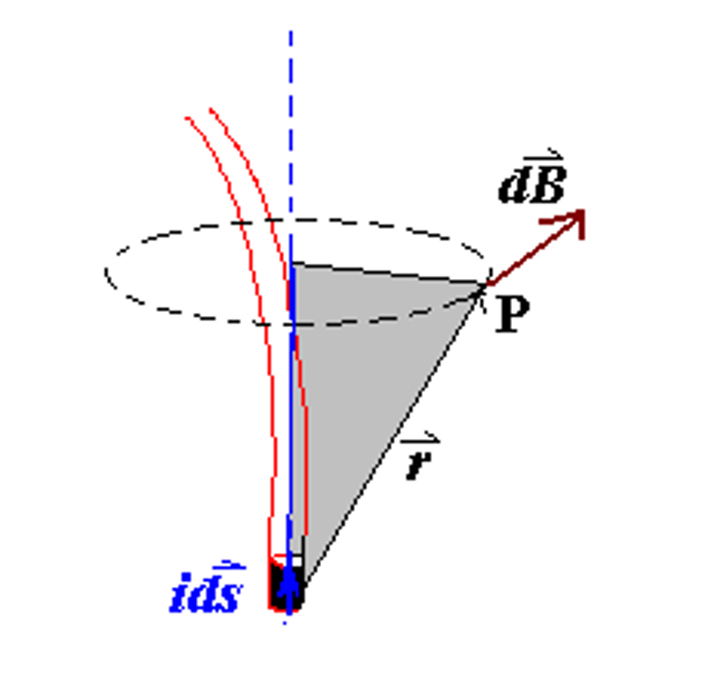{ align=right width=30% }

$$ \overrightarrow{B} = \dfrac{\mu_0}{4\pi} \oint_L \dfrac{i d\overrightarrow{s} \times \hat{r}}{r^2} $$

这个定理描述的是一个直电流产生的磁场方向，实际上就是中学阶段我们已经学到了的右手定则（right hand rule）

#### 长的直线电流

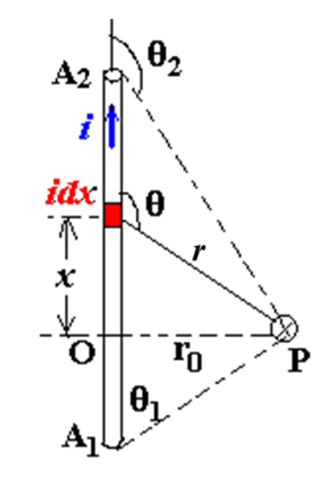{ align=right width=20% }

根据 $ d\overrightarrow{B} = \dfrac{\mu_0}{4\pi} \dfrac{i d\overrightarrow{s} \times \hat{r}}{r^2} $，我们知道 $ d\overrightarrow{B} = \dfrac{\mu_0}{4\pi} \dfrac{i dx \sin\theta}{r^2} $

这里我们关注的是直线电流旁点 $P$ 处的磁场强度，直接进行积分
$$ B = \int_{A_1}^{A_2} dB = \dfrac{\mu_0 i}{4\pi} \int_{A_1}^{A_2} \dfrac{i \sin\theta dx}{r^2} $$
其中 $r = \dfrac{r_0}{\sin\theta}$ ， $x = -r_0 \cot\theta$， $dx = \dfrac{r_0 d\theta}{\sin^2 \theta}$

于是最终就有

$$\begin{aligned}
B &= \int_{\theta_1}^{\theta_2} \dfrac{\mu_0}{4\pi} \dfrac{\sin\theta \cdot \dfrac{r_0 d\theta}{\sin^2 \theta} }{r^2_0 / \sin^2 \theta} \\\\
&= \dfrac{\mu_0 i}{4\pi r_0} \int_{\theta_1}^{\theta_2} \sin\theta d\theta \\\\
&= \dfrac{\mu_0 i}{4\pi r_0} (\cos\theta_1 - \cos\theta_2)
\end{aligned}$$

对于无限长的带电线，有一定夹角

- $\theta_1 = 0$ ， $\cos\theta_1 = 1$
- $\theta_2 = \pi$ ， $\cos\theta_2 = -1$  

于是
$$ B = \dfrac{\mu_0 i}{4\pi r_0} (\cos\theta_1 - \cos\theta_2) = \dfrac{\mu_0 i}{2\pi r_0} $$ 

当 $ r_0 << L $ 时，就可以使用上面的结论

#### 环流电路的磁场
<figure>
        
</figure>

考虑在环流电路中轴线上的一点 $A$，显然，我们有 $ \left| d\overrightarrow{B} \right| = \left| d\overrightarrow{B}' \right| $

并且根据 $ d\overrightarrow{B} = \dfrac{\mu_0}{4\pi} \dfrac{i d\overrightarrow{s} \times \hat{r}}{r^2} $ ， $ dB = \dfrac{\mu_0}{4\pi} \dfrac{i ds}{r^2} \sin\theta $ 和 $ dB_x = dB \cdot \cos\alpha $，其中 $\alpha$ 是直径与电流元到点 $A$ 连线的夹角。

又因为此时电流元方向始终和电流元与点 $A$ 的连线方向垂直，因此 $\theta = \dfrac{\pi}{2}$，同时我们还有 $r = r_0 / \sin\alpha$，于是 

$$\begin{aligned}
B_x &= \oint B_x = \oint dB \cos\alpha \\\\
&= \dfrac{\mu_0 i}{4\pi} \oint \dfrac{ds}{r^2} \cos\alpha \\\\
&= \dfrac{\mu_0 i}{4\pi} \oint \dfrac{\sin^2 \alpha}{r_0^2} \cos\alpha ds \\\\
&= \dfrac{\mu_0 i}{4\pi r_0^2} \sin^2 \alpha \cos\alpha \cdot 2\pi R \\\\
\end{aligned}$$

最后我们把带有 $\alpha$ 的项消掉 

$\sin \alpha = \dfrac{r_0}{\sqrt{r_0^2 + R^2}}  $ ， $ \cos\alpha = \dfrac{R}{\sqrt{r_0^2 + R^2}}$   

就得到
$$ B = \dfrac{\mu_0}{2} \dfrac{iR^2}{(R^2 + r_0^2)^{3/2}} $$

!!! tip
    实际上分母就是电流元与点 $A$ 的距离的三次方，在记忆时不必死记硬背

- 在环流电路的中心时，$r_0 = 0$，$B = \dfrac{\mu_0 i}{2R}$
- 当 $r_0 >> R$ 时，$B = \dfrac{\mu_0 i R^2}{2r_0^3}$
- 同样的，环流电路产生的磁感应强度方向由右手定则决定

!!! note "磁偶极矩"
    对环流电路产生的的磁感应强度可以做一些形式上的变换
    $$ B = \dfrac{\mu_0 i R^2}{2r_0^3} = \dfrac{\mu_0 i \pi R^2}{2\pi r_0^3} = \dfrac{\mu_0 i A}{2\pi r_0^3} $$

    于是我们就可以定义磁偶极矩为电流大小与环流电路包裹住的圆形截面面积的乘积：
    $$ \mu = iA = i\pi R^2 $$
    $$ B = \dfrac{\mu_0 i R^2}{2r_0^3} = \dfrac{\mu_0}{2\pi} \dfrac{\mu}{r_0^3} $$

    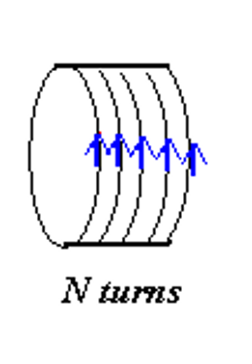{ align=right width=24% }

    对于多匝的线圈，磁偶极矩可以定义为
    $$ \mu = iA = Ni\pi R^2 $$
    事实上，有
    $$ \overrightarrow{\mu} = i\overrightarrow{A} $$

#### 螺线管（solenoid）的磁场

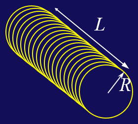{ align=right width=24% }

在实际实验中，我们通常使用螺线管来产生恒定不变的磁场。

一根螺线管是一条在半径为 $R$，长度为 $L$ 的圆柱体上缠绕的电线，其中每单位长度绕 $n$ 匝，通过的电流大小为 $i$.

当 $R<<L$ 时，螺线管内部的磁场就可以认为是大小恒定不变的，且方向沿着圆柱的轴线方向。我们可以使用安培定律来求出这个磁场的大小。

<figure>
        
</figure>

如上图所示，螺线管长度为 $L$，半径为 $R$，每单位长度绕 $n$ 匝线圈，点 $P$ 与螺线管中心的距离为 $x$。

首先我们由环流电路的磁场公式，得到

$$ dB = \dfrac{\mu_0}{2} \dfrac{R^2 in dl}{[ R^2 + (x-l)^2 ]^{3/2}} $$

$$ B = \dfrac{\mu_0}{2} \int_{-L/2}^{L/2} \dfrac{R^2 in dl}{[ R^2 + (x-l)^2 ]^{3/2}}  $$

同时我们还有

$ r = \sqrt{R^2 + (x-l)^2} = \dfrac{R}{\sin\beta} $

$ \dfrac{x-l}{R} = \cot\beta \Rightarrow dl = \dfrac{R}{\sin^2\beta} d \beta $

于是代入进去我们就得到

$$\begin{aligned}
B &= \dfrac{\mu_0}{2} \int_{\beta_1}^{\beta_2} \dfrac{R^2 ni \dfrac{R}{\sin^2 \beta} d \beta }{\left( \dfrac{R^2}{\sin^2 \beta} \right)^{3/2}} \\\\
&= \dfrac{\mu_0}{2} \cdot ni \int_{\beta_1}^{\beta_2} \sin\beta d\beta \\\\
&= \dfrac{1}{2} \mu_0 ni (\cos\beta_1 - \cos\beta_2)
\end{aligned}$$

最后还有

$\cos\beta_1 = \dfrac{x+L/2}{\sqrt{R^2 + (x+L/2)^2}}       $ ， $\cos\beta_2 = \dfrac{x-L/2}{\sqrt{R^2 + (x-L/2)^2}} $

- 当螺线管是无限长（$L \to \infty$）时，在螺线管的内部，有 $\beta_1 = 0, \beta_2 = \pi$

    $ B = \dfrac{1}{2} \mu_0 ni(1+1) = \mu_0 ni $

- 在螺线管的端头时，有 $\beta_1 = 0, \beta_2 = \dfrac{\pi}{2}$

    $ B = \dfrac{1}{2} \mu_0 ni(1-0) = \dfrac{1}{2} \mu_0 ni $

### 磁场的高斯定理和安培环路定理

回顾静电场的高斯定理和安培环路定理：

- 高斯定理：$ \oiint \overrightarrow{E} \cdot d\overrightarrow{A} = \dfrac{1}{\epsilon_0} \sum q$ ， $ \nabla \cdot \overrightarrow{E} = \dfrac{\rho_e}{\epsilon_0} $   
- 环路定理：$ \oint \overrightarrow{E} \cdot d\overrightarrow{l} = 0$ ， $ \nabla \times \overrightarrow{E} = 0$

由电流产生的磁场与静电场有一些共同的特征，但磁场 $B$ 的这些特征与静电场的有所不同。

类似于电通量，我们也有磁通量的概念：通过一个面的磁感线的数量，即磁感应强度 $B$ 与有向面积 $A$ 的乘积。
$$ \Phi_B = \iint \overrightarrow{B} \cdot d\overrightarrow{A} = \iint B \cos\theta dA $$

$$ \overrightarrow{B} = \lim_{\Delta A \to 0} \dfrac{\Delta \Phi_B}{\Delta A} $$
其中 $\Phi_B$ 的单位为 $\text{T} \cdot \text{m}^2 = \text{Wb}$（韦伯）。

于是最终得到磁场的高斯定理:

$ \oiint \overrightarrow{B} \cdot d\overrightarrow{A} = 0 $ ， $ \nabla \cdot \overrightarrow{B} = 0 $

??? proof "证明磁场的高斯定理"
    <figure>
        
    </figure>
    目标：证明 $\oiint \overrightarrow{B} \cdot d\overrightarrow{A} = 0$

    对于电流元 $id\overrightarrow{s}$ 产生的磁场，我们有 
    $$ d\overrightarrow{B} = \dfrac{\mu_0}{4\pi} \dfrac{i d\overrightarrow{s} \times \hat{r}}{r^2} $$
    
    对于图中这一个红色的任意闭合曲面，我们可以考虑一个穿过这个曲面的小圆环（多个小圆环叠加起来就可以覆盖到整个闭合曲面）
    
    $$ dA_1^* = |dA_1 \cos\theta_1| = dA_1|\cos\theta_1|, \enspace \theta_1 > \dfrac{\pi}{2}, \enspace \cos\theta_1 < 0 $$

    $$ dA_2^* = |dA_2 \cos\theta_2| = dA_2|\cos\theta_2|, \enspace \theta_2 < \dfrac{\pi}{2}, \enspace \cos\theta_2 > 0 $$

    显然，在这个圆环上，有 $dA_1 = dA_2, \enspace |\cos\theta_1| = |\cos\theta_2|$，因此这两个小面积的磁场大小相同，面积大小相同但方向相反
    $$ d\Phi_1 = d\Phi_2 $$
    $$ d\Phi_1 + d\Phi_2 = 0 $$
    $$ \oiint \overrightarrow{B} \cdot d\overrightarrow{A} = 0 $$

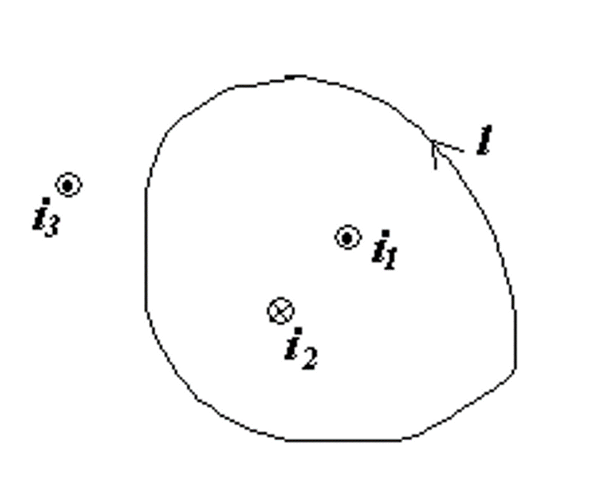{ align=right width=25% }

$$ \oint \overrightarrow{B} \cdot d\overrightarrow{l} = \mu_0 \sum_{inloop} i $$ 

这里，$\sum_{inloop} i$ 是环路内的电流总和。对于环路内的电流，根据右手定则，电流方向与环路方向相同时，电流为正，否则为负。

如在右图中，$i_1$ 为正，$i_2$ 为负，因此 $$ \oint \overrightarrow{B} \cdot d\overrightarrow{l} = \mu_0(i_1 - i_2) $$

利用环路定理，我们就可以很方便地求出环路上的磁感应强度。

!!! note
    环路内部具体某一点的磁感应强度实际上还会受到环路外部的电流的影响，但环路外部的电流不会对 $\overrightarrow{B} \cdot d\overrightarrow{l}$ 积分后的最终结果产生影响，因为积分过后外部的电流的影响会被相互抵消。

    例如在上面的例子中 $i_3$ 对环路内部的磁场并没有影响。

!!! tip 
    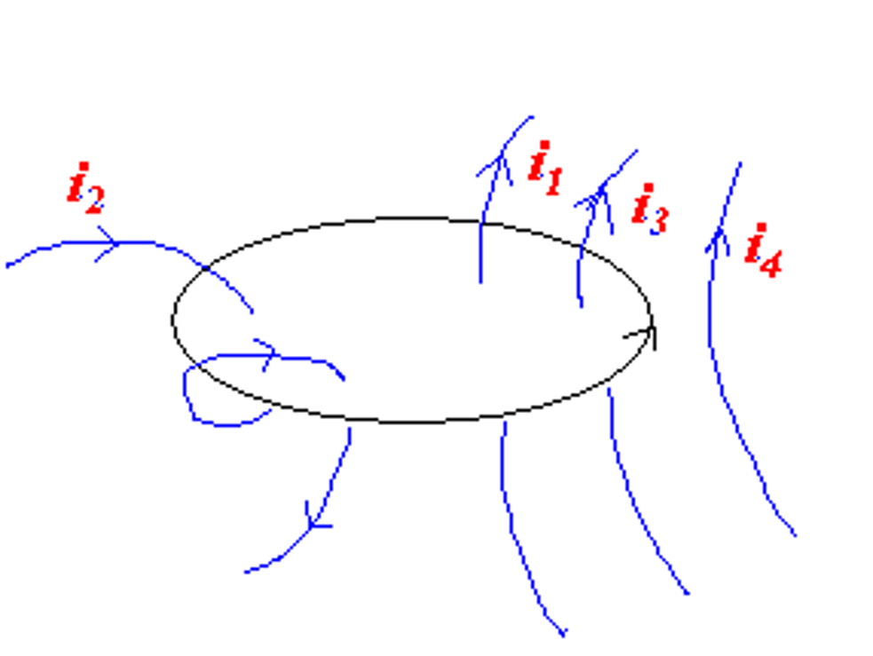{ align=right width=25% }

    在使用环路定理的时候，我们只考虑**穿过环路内部**的电流，而忽略掉其他所有的内容。对于电流的方向，我们以右手定则来判断“正负”。
    
    例如在右图中
    $$ \oint \overrightarrow{B} \cdot d\overrightarrow{l} = \mu_0 (i_1 + i_3 - 2i_2) $$

#### 无限长直导线的磁场

<figure>
    
</figure>

考虑一个无限长直导线，半径为 $R$，大小为 $i$的电流均匀分布在导线内部，我们考虑距离导线的中心距离为 $r$ 处的磁场。

!!! solution "无限长直导线的磁场"
    === "$r > R$"
        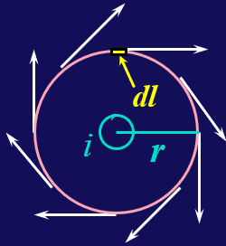{ align=right width=30% }
        首先我们选择一个半径为 $r$ 的圆环作为回路，然后对这个回路运用安培环路定理

        - 为什么？因为这样能使得环路上的磁场高度对称，大小一致，且能保证磁场方向始终沿着环路的切线方向，从而极大程度地简化计算。

        于是我们有
        $$ \oint \overrightarrow{B} \cdot d\overrightarrow{l} = B \cdot 2\pi r = \mu_0 i $$
        于是
        $$ B = \dfrac{\mu_0 i}{2\pi r} $$

    === "$r < R$"
        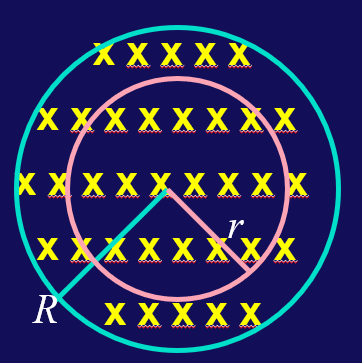{ align=right width=30% }
        同理，我们还是选择一个半径为 $r$ 的圆环作为回路，但是此时环路内的电流大小为
        $$ i_{enclosed} = \dfrac{\pi r^2}{\pi R^2} i = \dfrac{r^2}{R^2} i $$
        根据环流定律
        $$ \oint \overrightarrow{B} \cdot d\overrightarrow{l} = B \cdot 2\pi r = \mu_0 i_{enclosed} = \mu_0 \dfrac{r^2}{R^2} i $$
        于是
        $$ B = \dfrac{\mu_0 r}{2\pi R^2} i $$

!!! tip
    这说明无限长直导线的磁场在 $r=R$ 处磁场达到最大
    <figure>
        
    </figure>

#### 无穷电流面的磁场

<figure>
    
</figure>

考虑一个单位长度有 $n$ 条导线组成的无限电流面，每条导线带有的电流大小为 $i$。

由对称性可知，在垂直于电流面方向（图中水平方向）上的磁场大小为零；而在平行于电流面方向（图中竖直方向）上的磁场大小相等，方向相反。

取一个边长为 $w$ 的正方形回路，根据安培环路定理，我们有
$$ \oint \overrightarrow{B} \cdot d\overrightarrow{l} = Bw + 0 + Bw + 0 = 2Bw = \mu_0 nwi $$
于是
$$ B = \dfrac{1}{2} \mu_0 ni$$

#### 无穷螺线管的磁场

<figure>
    
</figure>

!!! info "为何使用螺线管产生稳定的磁场？"
    前面我们提到过，产生稳定的电场时，我们可以使用平行板电容器；而产生稳定的磁场时，我们可以使用螺线管。

    如果我们把螺线管沿着纵向切一刀，并从截面方向来看，就可以看到两个大小相等，方向相反的电流面，这与电容器的两个极板很类似：

    - 在电流面的两侧，两个电流面产生的磁场方向相反，相互抵消，总磁场大小为零
    - 在电流面的中间，两个电流面产生的磁场方向相同，相互叠加，总磁场大小为

    $$ B = \mu_0 ni $$

或者我们也可以使用安培环路定理来求解
$$ \oint \overrightarrow{B} \cdot d\overrightarrow{l} = Bw = \mu_0 nwi $$
于是
$$ B = \mu_0 ni $$

#### 螺绕环的磁场

<figure>
    
</figure>

- 在螺绕环外，磁场大小为零
- 在螺绕环内，记螺绕环总的电流数量为 $N$，每个电流大小为 $i$

$$ \oint \overrightarrow{B} \cdot d\overrightarrow{l} = B \cdot 2\pi r = \mu_0 Ni $$

$$ B = \dfrac{\mu_0 Ni}{2\pi r} = \mu_0 ni $$

!!! summary "常见的几种模型的磁场大小"
    - 无限长直导线

        - 导线外部：$B = \dfrac{\mu_0 i}{2\pi r}$
        - 导线内部：$B = \dfrac{\mu_0 r}{2\pi R^2} i$

    - 无限电流面：$B = \dfrac{1}{2} \mu_0 ni$
    - 无限螺线管：$B = \mu_0 ni$
    - 螺绕环：$B = \mu_0 ni$
    - 圆环轴线上的磁场：$B \propto \dfrac{\mu_0 i R^2}{2z^3}$

### 电流在磁场中受到的力和力矩

$$ d\overrightarrow{F} = i d\overrightarrow{l} \times \overrightarrow{B} $$ 

!!! warning
    判断受力的方向时要抛弃掉高中所学的所谓“左手定则”，而全部使用右手定则，即利用叉乘的性质来判断受力方向。安培力与洛伦兹力在本质上是一样的。

!!! example 
    <figure>
        
    </figure>

    $F_1$ 和 $F_3$ 的计算很简单，对于 $F_2$，根据对称性很容易发现它在水平方向上的力为零，只有竖直方向上的力
    $$ F_2 = F_{\vert} = \int_0^{\pi} iBR d\theta \sin\theta = iBR \int_0^{\pi} \sin\theta d\theta = 2iBR $$

#### 矩形线圈

<figure>
    
</figure>

对于一个矩形线圈，如果它绕着一个与磁场方向垂直的轴线旋转，那么它会受到一个力矩。

$$\begin{aligned}
\tau &= F_{AB} \cdot \dfrac{b}{2} \cdot \sin\theta + F_{AB} \cdot \dfrac{b}{2} \cdot \sin\theta \\
&= 2 \times (iaB \cdot \dfrac{b}{2} \cdot \sin\theta) \\
&= iBA \sin\theta
\end{aligned}$$

即
$$ \overrightarrow{tau} = iA(\overrightarrow{n} \times \overrightarrow{B}) = \overrightarrow{\mu} \times \overrightarrow{B} $$

#### 任意形状线圈

<figure>
    
</figure>

我们可以把上面的结论推广到任意形状的线圈，我们可以把任意形状的线圈分解为一个个小矩形，对所有小矩形带有的电流进行累加，发现只有最外侧的电流不会相互抵消，最终得到的电流就是这个线圈的总电流。

先分析受力
$$ dF_1 = ids_1B\sin\theta_1 $$
$$ dF_2 = ids_2B\sin\theta_2 $$
$$ ds_1 \sin\theta_1 = ds_2 \sin\theta_2 = dh $$
$$ dF_1 = dF_2 = iBdh $$

再分析力矩
$$ d\tau = dF_1 \cdot x_1 + dF_2 \cdot x_2 = iB \cdot dh \cdot (x_1 + x_2) = iB \cdot dA $$
$$ \tau = \int dL = \int iBdA = iBA $$

!!! tip
    磁偶极矩的方向可以通过右手定则来判断
    $$ \overrightarrow{\mu} = i\overrightarrow{A} $$

    线圈在磁场中收到的力矩使得它在磁场中旋转，具有使得磁偶极矩的方向转到与磁场方向相同的趋势。

!!! note 
    类似于电偶极矩的势能
    $$ U = -\overrightarrow{\p} \cdot \overrightarrow{E} $$
    磁偶极矩也有相同形式的势能
    $$ U = -\overrightarrow{\mu} \cdot \overrightarrow{B} $$

### 电荷在磁场中的运动

!!! note "洛伦兹力"
    $$ \overrightarrow{F}_L = q\overrightarrow{v} \times \overrightarrow{B} $$

    洛伦兹力不做功，洛伦兹力只改变速度方向，不改变速度大小

    洛伦兹力的方向可用右手定则来判断

    在匀强磁场中，带电粒子在垂直于磁场的平面上做圆周运动 
    $$ qvB = \dfrac{mv^2}{R} \rightarrow R = \dfrac{mv}{qB} $$
    $$ T = \dfrac{2\pi R}{v} = \dfrac{2\pi m}{qB} $$
    $$ f = \dfrac{1}{T} = \dfrac{qB}{2\pi m} $$

!!! note "质谱仪（速度选择器）"
    <figure>
        
    </figure>

    $$ qE = qvB \rightarrow v = \dfrac{E}{B} $$
    
    在速度选择器后紧接着一个匀强磁场，就可以根据粒子运动半径的大小来判断粒子的质荷比 

    $$ R = \dfrac{mv}{qB} $$