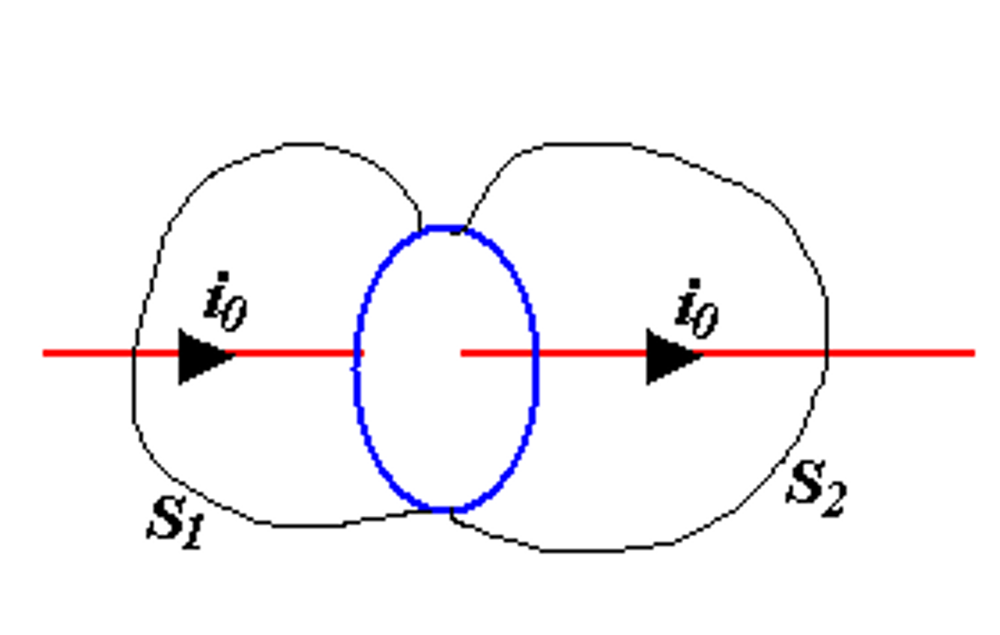
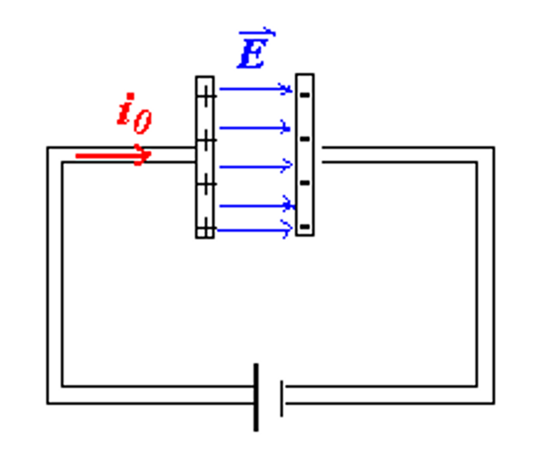
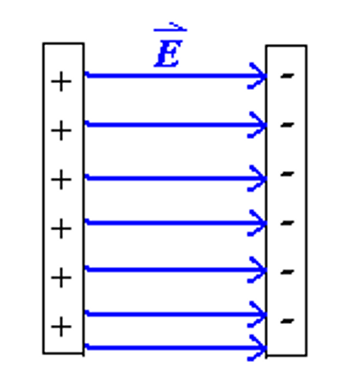
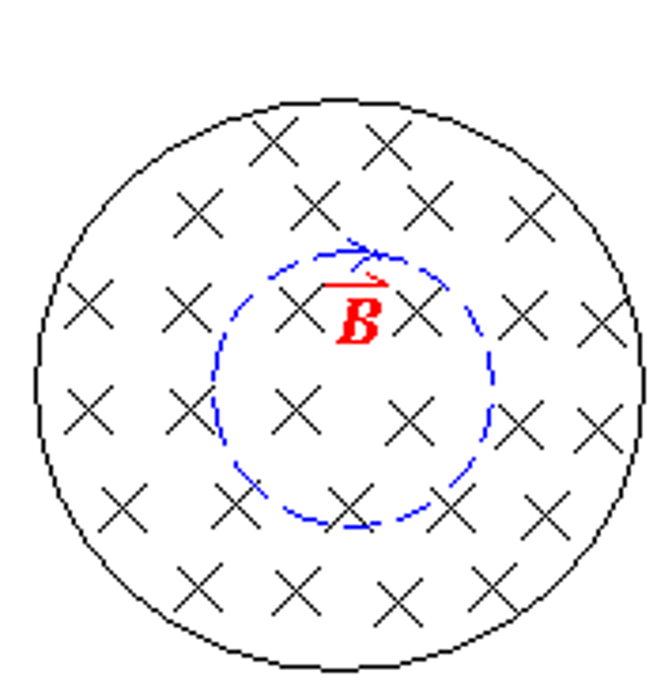
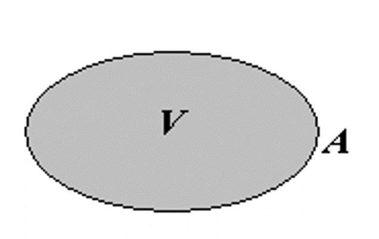
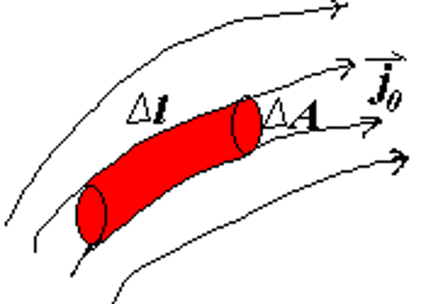
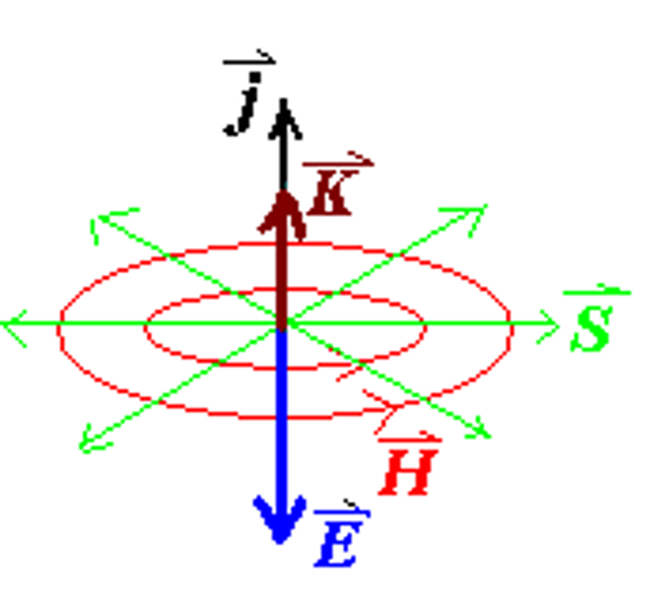
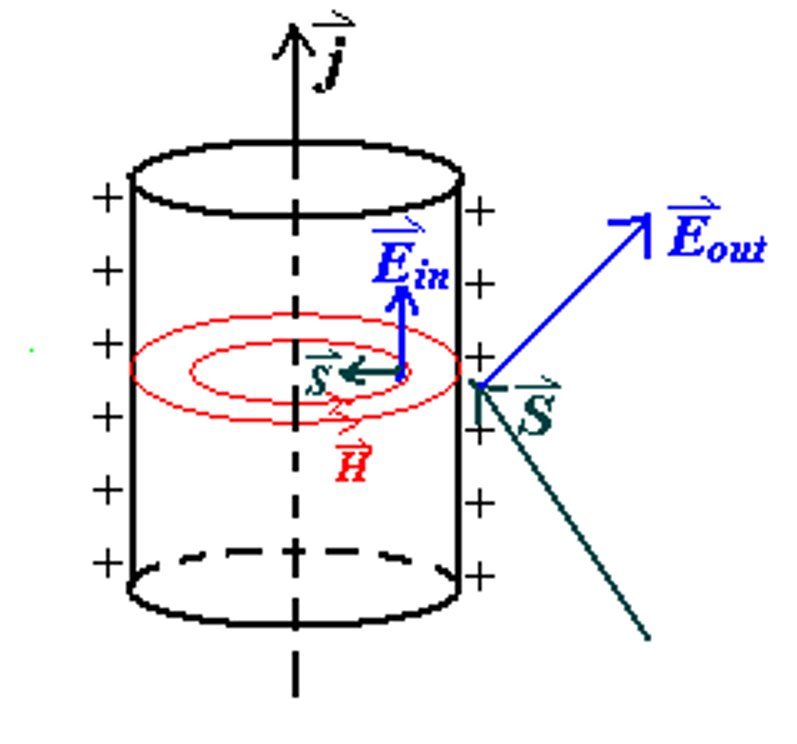
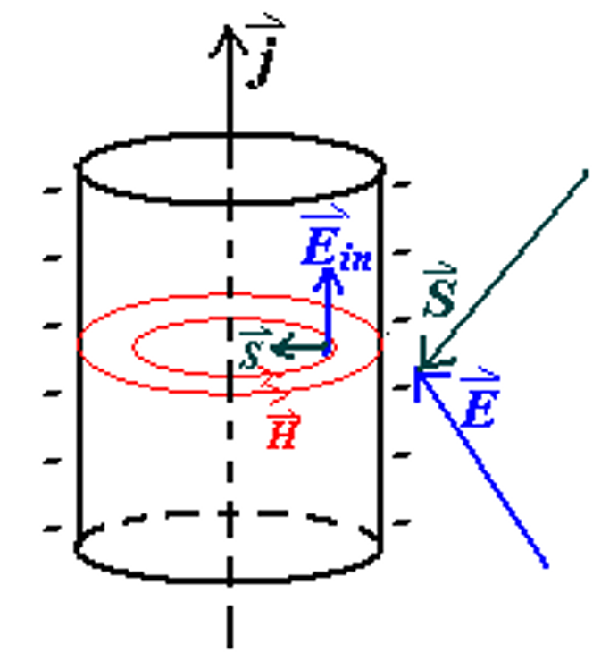
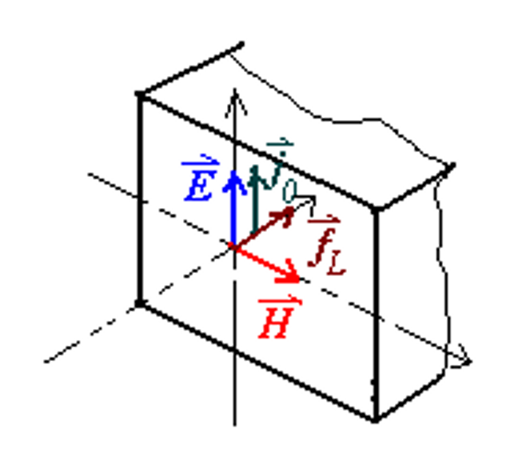

# 麦克斯韦方程组与电磁波

!!! info "一些我们已经学过的公式"
    在真空中：

    - 电场的高斯定理：$$ \oiint \overrightarrow{E}·d\overrightarrow{A} = \frac{q_0}{\epsilon_0} $$
    - 磁场的高斯定理：$$ \oiint \overrightarrow{B}·d\overrightarrow{A} = 0 $$
    - 法拉第电磁感应定律：$$ \oint \overrightarrow{E}·d\overrightarrow{l} = -\frac{d\Phi_B}{dt} = -\iint \frac{ \partial \overrightarrow{B} }{ \partial t } \cdot \overrightarrow{A} $$
    - 安培环路定理：$$ \oint \overrightarrow{B} \cdot \overrightarrow{l} = \mu_0 i $$

    在电介质或磁材料中：
    $$
    \begin{cases}
    \displaystyle\oiint \overrightarrow{D}·d\overrightarrow{A} = q_0 \\\\\\\\
    \displaystyle\oiint \overrightarrow{B}·d\overrightarrow{A} = 0 \\\\\\\\
    \displaystyle\oint \overrightarrow{E}·d\overrightarrow{l} = -\iint \frac{ \partial \overrightarrow{B} }{ \partial t } \cdot \overrightarrow{A}  \\\\\\\\
    \displaystyle\oint \overrightarrow{H}·d\overrightarrow{l} = i_0 = \displaystyle\iint \overrightarrow{j} \cdot \overrightarrow{A}
    \end{cases}
    $$

    其中
    $$ \overrightarrow{D} = \epsilon_0 \overrightarrow{E} + \overrightarrow{P} = \kappa_e \epsilon_0 \overrightarrow{E} $$
    $$ \overrightarrow{B} = \mu (\overrightarrow{H} + \overrightarrow{M}) = \kappa_m \mu_0 \overrightarrow{H} $$
    $$ \overrightarrow{j}_0 = \sigma \overrightarrow{E} $$

    $$
    \begin{cases}
    \nabla \cdot \overrightarrow{D} = \rho_{e0} \\
    \nabla \cdot \overrightarrow{B} = 0 \\
    \nabla \times \overrightarrow{E} = -\dfrac{ \partial \overrightarrow{B} }{ \partial t } \\
    \nabla \times \overrightarrow{H} = \overrightarrow{j}_0
    \end{cases}
    $$

## 对称性原则

很自然的，科学家们希望所有的物理公式都具有一种对称性，这样才能更好地描述自然界的规律。观察上面磁场的高斯定律，我们显然不希望等式的右侧只有一个0；对于电场的安培环路定律，我们也希望它能与磁场的安培环路定律具有一种对称的相似性，

因此我们引入了一个新的定义：磁荷 $q_m$ ，即只带有正极或负极的磁单极（类比于点电荷）。这样，我们就可以得到磁场的高斯定律和电场的环路定理做出修正：

$$ \begin{cases}
\displaystyle\oiint \overrightarrow{B} \cdot \overrightarrow{dS} = q_m \\\\
\displaystyle\oint \overrightarrow{E} \cdot \overrightarrow{dl} = \dfrac{dq_m}{dt}= -\displaystyle\oiint \dfrac{\partial \overrightarrow{B}}{\partial t} \cdot \overrightarrow{dS}
\end{cases} $$

## 感应磁场与位移电流

{ align=right width=22% }
借助磁场的环路定理和 stokes 公式，我们可以知道，通过一个环路的电流大小等于通过以这个环路为边界的曲面电流密度的积分

如右图，电流通过蓝色的回路，以蓝色回路为边缘构造两个曲面 $S_1$ 和 $S_2$，则通过这两个曲面的电流大小相等，方向相反

$$ \oint \overrightarrow{H} \cdot d\overrightarrow{l} = i_0 = \iint_{S_2} \overrightarrow{j}_0 \cdot d\overrightarrow{A} $$

$$ -\iint_{S_1} \overrightarrow{j}_0 \cdot d\overrightarrow{A} = \iint_{S_2} \overrightarrow{j}_0 \cdot d\overrightarrow{A} = i_0 $$

$$ \oiint_S \overrightarrow{j}_0 \cdot d\overrightarrow{A} = \iint_{S_1} \overrightarrow{j}_0 \cdot d\overrightarrow{A} + \iint_{S_2} \overrightarrow{j}_0 \cdot d\overrightarrow{A} = 0 $$

上面公式的物理含义是，通过一个闭合曲面的电流恒等于零（流入的电流等于流出的电流），

但是这样的结论在讨论一个电容器的充电时则会出现问题。

<figure>
    
</figure>

对于（1，2）构成的闭合曲面以及（1，4）构成的闭合曲面，其内部的电流之和为零。但当我们选择曲面（1，3）时，就发现电流从曲面1进入，但并没有从曲面3流出，这就说明我们上面的结论存在问题。

为了解决这个问题，我们引入了位移电流 $I_D$ 的概念。位移电流是由于电场的变化而产生的，它的大小与电场的变化率成正比，方向与电场的变化方向相同。
$$ \oint \overrightarrow{H} \cdot d\overrightarrow{l} = I_{free} + I_D $$

但是位移电流的概念是怎么得到的呢？我们可以从下面的推导中看到：

首先考虑（1，3）构成的曲面 $S$，电流只进入不流出
$$ \oiint_S \overrightarrow{j}_0 \cdot d\overrightarrow{A} = -\dfrac{dq_0}{dt} $$
又根据高斯定律，
$$ \oiint_S \overrightarrow{D} \cdot d\overrightarrow{A} = q_0 $$
于是
$$ \dfrac{dq_0}{dt} = \dfrac{d}{dt} \oiint_S \overrightarrow{D} \cdot d\overrightarrow{A} = \oiint_S \dfrac{\partial \overrightarrow{D}}{\partial t} \cdot d\overrightarrow{A} $$

$$ \therefore \oiint_S \left( \overrightarrow{j}_0 + \dfrac{\partial \overrightarrow{D}}{\partial t} \right) \cdot d\overrightarrow{A} = 0 $$

此时在曲面1进入的量等于从曲面3流出的量，即

$$ -\oiint_{S_1} \left( \overrightarrow{j}_0 + \dfrac{\partial \overrightarrow{D}}{\partial t} \right) \cdot d\overrightarrow{A} = \oiint_{S_2} \left( \overrightarrow{j}_0 + \dfrac{\partial \overrightarrow{D}}{\partial t} \right) \cdot d\overrightarrow{A} $$

考虑到电位移矢量与磁感应强度的对称关系，我们也可以定义一个类似于磁通量的物理量：电位移通量
!!! info 
    电位移通量 
    $$ \Phi_D = \iint \overrightarrow{D} \cdot d\overrightarrow{A} $$
    位移电流
    $$ I_D = \dfrac{d\Phi_D}{dt} = \iint \dfrac{\partial \overrightarrow{D}}{\partial t} \cdot d\overrightarrow{A} $$
    位移电流密度
    $$ \overrightarrow{j}_D = \dfrac{\partial \overrightarrow{D}}{\partial t} $$

综合以上的内容，我们就得到了新的安培环路定理：
$$ \oint \overrightarrow{H} \cdot d\overrightarrow{l} = i_0 + i_D = \iint \left( \overrightarrow{j}_0 + \dfrac{\partial \overrightarrow{D}}{\partial t} \right) \cdot d\overrightarrow{A} $$

根据 stokes 公式，我们可以得到

$$ \begin{aligned}
\oint \overrightarrow{H} \cdot d\overrightarrow{l} &= \iint \left( \overrightarrow{j}_0 + \dfrac{\partial \overrightarrow{D}}{\partial t} \right) \cdot d\overrightarrow{A} \\\\
&= \iint \nabla \times \overrightarrow{H} \cdot d\overrightarrow{A}
\end{aligned} $$

于是
$$ \nabla \times \overrightarrow{H} = \overrightarrow{j}_0 + \dfrac{\partial \overrightarrow{D}}{\partial t} $$

!!! example
    {align=right width=30%}

    $$ \begin{aligned}
    & E = \dfrac{\sigma_e}{\epsilon_0} = \dfrac{q}{\epsilon_0 A} , \quad \overrightarrow{D} = \epsilon_0 \overrightarrow{E} \\\\
    & \Rightarrow q = \epsilon_0 A E = \epsilon_0 A \Phi_E = AD \\\\
    & \Rightarrow i_0 = \dfrac{dq}{dt} = \epsilon_0 \dfrac{d \Phi_E}{dt} = \dfrac{d \Phi_D}{dt} = i_D 
    \end{aligned} $$

    充电时，两个电极板之间的位移电流的大小等于导线中电流的大小，这样就使得整个电路中的电流是“连续”的。

    充满电之后，$i_0 = i_D = 0$

{ align=left width=25% }

{ align=right width=25% }

当电极板之间是真空（没有电介质）时

$$ \begin{aligned}
\oint \overrightarrow{H} \cdot d\overrightarrow{l} &= \int \int \frac{\partial \overrightarrow{D}}{\partial t} \cdot d\overrightarrow{A}  \enspace (I_D) \\\\
\Rightarrow \oint \frac{\overrightarrow{B}}{\mu_0} \cdot d\overrightarrow{l} &= \epsilon_0 \int \int \frac{\partial \overrightarrow{E}}{\partial t} \cdot d\overrightarrow{A} \\\\
\Rightarrow \oint \overrightarrow{B} \cdot d\overrightarrow{l} &= \mu_0 \epsilon_0 \int \int \frac{\partial \overrightarrow{E}}{\partial t} \cdot d\overrightarrow{A}
\end{aligned} $$

于是从最后一个式子我们可以知道：变化的电场会产生一个涡旋的磁场（eddy magnetic field）。

!!! tip
    电场的变化会产生涡旋磁场，磁场的变化会产生涡旋电场。
    
    但磁场变化时由于楞次定律的存在，涡旋电场的方向与磁场变化的方向**相反**（有负号）；而电场变化时，涡旋磁场的方向与电场变化的方向**相同**（无负号）。

    $$ \oint \overrightarrow{E} \cdot d\overrightarrow{l} = -\iint \dfrac{\partial \overrightarrow{B}}{\partial t} \cdot d\overrightarrow{A} $$

    $$ \oint \overrightarrow{B} \cdot d\overrightarrow{l} = \mu_0 \epsilon_0 \int \int \frac{\partial \overrightarrow{E}}{\partial t} \cdot d\overrightarrow{A} $$

经过上面的讨论和拓展后，我们就得到了麦克斯韦方程组：

!!! info "麦克斯韦方程组"
    在真空中：

    - 电场的高斯定理：$$ \oiint \overrightarrow{E}·d\overrightarrow{A} = \frac{q_0}{\epsilon_0} $$
    - 磁场的高斯定理：$$ \oiint \overrightarrow{B}·d\overrightarrow{A} = 0 $$
    - 法拉第电磁感应定律：$$ \oint \overrightarrow{E}·d\overrightarrow{l} = -\frac{d\Phi_B}{dt} = -\iint \frac{ \partial \overrightarrow{B} }{ \partial t } \cdot \overrightarrow{A} $$
    - 安培环路定理（被麦克斯韦拓展）：$$ \oint \overrightarrow{B} \cdot \overrightarrow{l} = \mu_0 i + \mu_0 \epsilon_0 \iint \frac{ \partial \overrightarrow{E} }{ \partial t } \cdot \overrightarrow{A} $$

    在电介质或磁材料中：
    $$
    \begin{cases}
    \displaystyle\oiint \overrightarrow{D}·d\overrightarrow{A} = q_0 \\\\\\\\
    \displaystyle\oiint \overrightarrow{B}·d\overrightarrow{A} = 0 \\\\\\\\
    \displaystyle\oint \overrightarrow{E}·d\overrightarrow{l} = -\iint \frac{ \partial \overrightarrow{B} }{ \partial t } \cdot \overrightarrow{A} \\\\\\\\
    \displaystyle\oint \overrightarrow{H}·d\overrightarrow{l} = i_0 + \frac{ \partial \overrightarrow{D} }{ \partial t } \cdot \overrightarrow{A}
    \end{cases}
    $$

    其中
    $$ \overrightarrow{D} = \epsilon \overrightarrow{E} + \overrightarrow{P} = \kappa_e \epsilon_0 \overrightarrow{E} $$
    $$ \overrightarrow{B} = \mu (\overrightarrow{H} + \overrightarrow{M}) = \kappa_m \mu_0 \overrightarrow{H} $$
    $$ \overrightarrow{j}_0 = \sigma \overrightarrow{E} $$

    $$
    \begin{cases}
    \nabla \cdot \overrightarrow{D} = \rho_{e0} \\
    \nabla \cdot \overrightarrow{B} = 0 \\
    \nabla \times \overrightarrow{E} = -\dfrac{ \partial \overrightarrow{B} }{ \partial t } \\
    \nabla \times \overrightarrow{H} = \overrightarrow{j}_0 + \dfrac{\partial \overrightarrow{D}}{\partial t}
    \end{cases}
    $$

## 电磁波

### 电磁波的传播

- 电磁波的传播不需要介质，可以在真空中传播

<figure>
    
</figure>

- 变化的磁场会产生涡旋的电场：$$ \oint \overrightarrow{E} \cdot d\overrightarrow{l} = -\iint \dfrac{\partial \overrightarrow{B}}{\partial t} \cdot d\overrightarrow{A} $$
- 变化的电场会产生涡旋的磁场：$$ \oint \overrightarrow{H} \cdot d\overrightarrow{l} = \iint \frac{\partial \overrightarrow{D}}{\partial t} \cdot d\overrightarrow{A} $$

    假如由于感应产生的电场和磁场的都在不断变化，那么就会形成”一串“不断传播的电磁场，这就是电磁波。

    <figure>
        
    </figure>

!!! note 
    在自由空间（真空）中，
    $$ \rho_{e0} = 0, \quad \overrightarrow{j}_0 = 0 $$
    在自由空间中传播的电磁波具有以下 5 条性质：

    1. 电磁波是横波，电场和磁场均垂直于传播方向 $\overrightarrow{E} \perp \overrightarrow{k}, \quad \overrightarrow{H} \perp \overrightarrow{k}$

        <figure>
            
        </figure>
        
    2. 电场和磁场始终相互垂直 $\overrightarrow{E} \perp \overrightarrow{H}$
    3. $E$ 与 $H$ 同相位

        <figure>
            
        </figure>

    4. $\sqrt{\kappa_e \epsilon_0} E_0 = \sqrt{\kappa_m \mu_0} H_0$
    5. 电磁波的传播速度为：$$ v = \frac{1}{\sqrt{\kappa_e \epsilon_0 \kappa_m \mu_0}} $$

        在真空中，$\kappa_e = \kappa_m = 1$，所以 $$v = \dfrac{1}{\sqrt{\epsilon_0 \mu_0}} = c = 3 \times 10^8 m/sLV $$

### 从麦克斯韦方程组到电磁波

我们利用麦克斯韦方程组推导出一些电磁波的性质：

$$ 
\begin{cases}
\displaystyle\oiint \overrightarrow{E}·d\overrightarrow{A} = \dfrac{q_0}{\epsilon_0} \\\\
\displaystyle\oiint \overrightarrow{B}·d\overrightarrow{A} = 0 \\\\
\displaystyle\oint \overrightarrow{E}·d\overrightarrow{l} = -\iint \dfrac{ \partial \overrightarrow{B} }{ \partial t } \cdot \overrightarrow{A} \\\\
\displaystyle\oint \overrightarrow{B} \cdot \overrightarrow{l} = \mu_0 i + \mu_0 \epsilon_0 \iint \dfrac{ \partial \overrightarrow{E} }{ \partial t } \cdot \overrightarrow{A}
\end{cases}
\Longrightarrow
\begin{cases}
\text{in free space} (\rho_{e0} = 0, \overrightarrow{j}_0 = 0) \\\\
\nabla \cdot \overrightarrow{D} = \rho_{e0} \\\\
\nabla \cdot \overrightarrow{B} = 0 \\\\
\nabla \times \overrightarrow{E} = -\dfrac{ \partial \overrightarrow{B} }{ \partial t } = -\kappa_m \mu_0 \dfrac{ \partial \overrightarrow{H} }{ \partial t } \\\\
\nabla \times \overrightarrow{H} = \overrightarrow{j}_0 + \dfrac{\partial \overrightarrow{D}}{\partial t}
\end{cases}
$$

根据向量点乘与叉乘的含义，我们可以把右侧的式子进行展开

$$
\begin{cases}
\dfrac{\partial E_x}{\partial x} + \dfrac{\partial E_y}{\partial y} + \dfrac{\partial E_z}{\partial z} = 0 \\\\
\begin{vmatrix}
\hat{i} & \hat{j} & \hat{k} \\\\
\dfrac{\partial}{\partial x} & \dfrac{\partial}{\partial y} & \dfrac{\partial}{\partial z} \\\\
E_x & E_y & E_z
\end{vmatrix} = -\kappa_m \mu_0 \left(
\dfrac{\partial H_x}{\partial t} \hat{i} +
\dfrac{\partial H_y}{\partial t} \hat{j} +
\dfrac{\partial H_z}{\partial t} \hat{k}
\right) \\\\
\dfrac{\partial H_x}{\partial x} + \dfrac{\partial H_y}{\partial y} + \dfrac{\partial H_z}{\partial z} = 0 \\\\
\begin{vmatrix}
\hat{i} & \hat{j} & \hat{k} \\\\
\dfrac{\partial}{\partial x} & \dfrac{\partial}{\partial y} & \dfrac{\partial}{\partial z} \\\\
H_x & H_y & H_z
\end{vmatrix} = \kappa_e \epsilon_0 \left(
\dfrac{\partial E_x}{\partial t} \hat{i} +
\dfrac{\partial E_y}{\partial t} \hat{j} +
\dfrac{\partial E_z}{\partial t} \hat{k}
\right)
\end{cases}
$$

首先假设一个点波源，它发出的电磁波就是一个球面，在很远处的自由空间中，取一个较小的弧面，这个弧面的电磁波可以近似认为是一个**平面波**。以电磁波传播的方向为$z$轴，电场和磁场所在方向分别为$x$轴和$y$轴。

<figure>
    
</figure>

将上面得到的式子展开，那么就可以得到以下8个方程：

$$
\begin{align*}
    &\frac{\partial E_x}{\partial x} + \frac{\partial E_y}{\partial y} + \frac{\partial E_z}{\partial z} = 0 \tag{1} \\\\
    &\frac{\partial E_z}{\partial y} - \frac{\partial E_y}{\partial z} = -\kappa_m \mu_0 \frac{\partial H_x}{\partial t} \tag{2-1} \\\\
    &\frac{\partial E_x}{\partial z} - \frac{\partial E_z}{\partial x} = -\kappa_m \mu_0 \frac{\partial H_y}{\partial t} \tag{2-2} \\\\
    &\frac{\partial E_y}{\partial x} - \frac{\partial E_x}{\partial y} = -\kappa_m \mu_0 \frac{\partial H_z}{\partial t} \tag{2-3} \\\\
    &\frac{\partial H_x}{\partial x} + \frac{\partial H_y}{\partial y} + \frac{\partial H_z}{\partial z} = 0 \tag{3} \\\\
    &\frac{\partial H_z}{\partial y} - \frac{\partial H_y}{\partial z} = \kappa_e \epsilon_0 \frac{\partial E_x}{\partial t} \tag{4-1} \\\\
    &\frac{\partial H_x}{\partial z} - \frac{\partial H_z}{\partial x} = \kappa_e \epsilon_0 \frac{\partial E_y}{\partial t} \tag{4-2} \\\\
    &\frac{\partial H_y}{\partial x} - \frac{\partial H_x}{\partial y} = \kappa_e \epsilon_0 \frac{\partial E_z}{\partial t} \tag{4-3}
\end{align*}
$$

接下来我们将使用这些方程来推导电磁波的5条性质。

### 横波

首先我们知道电场强度 $E$ 在$x$和$y$方向上的分量都与$x$和$y$无关，仅与$z$和时间$t$有关，磁场强度 $H$ 也是如此，因此
$$ \dfrac{\partial E_x}{\partial x} = \dfrac{\partial E_y}{\partial y} = \dfrac{\partial E_x}{\partial y} = \dfrac{\partial E_y}{\partial x} = 0 $$
$$ \dfrac{\partial H_x}{\partial x} = \dfrac{\partial H_y}{\partial y} = \dfrac{\partial H_x}{\partial y} = \dfrac{\partial H_y}{\partial x} = 0 $$
把它们带入上面的方程中，就有

$$ \begin{aligned}
\text{From} \quad (1) &\Longrightarrow \dfrac{\partial E_z}{\partial z} = 0 \\\\
(2-3) &\Longrightarrow \dfrac{\partial H_z}{\partial t} = 0 \\\\
(3) &\Longrightarrow \dfrac{\partial H_z}{\partial z} = 0 \\\\
(4-3) &\Longrightarrow \dfrac{\partial E_z}{\partial t} = 0
\end{aligned} $$

因此电场强度和磁场强度在$z$方向的分量$E_z, H_z$与空间和时间都无关，是一个常数，我们不妨将它们都设为0，即$E_z = H_z = 0$。

于是我们就得到 $\overrightarrow{E}$ 和 $\overrightarrow{H}$ 都与传播方向垂直
$$ \overrightarrow{E} \perp \overrightarrow{k}, \quad \overrightarrow{H} \perp \overrightarrow{k} $$

### 电场与磁场相互垂直 $\overrightarrow{E} \perp \overrightarrow{H}$

利用刚刚得到的 $E_z = H_z = 0$，再重新带入方程组中，我们有

$$ \begin{aligned}
\text{From} \quad (2-1) &\Longrightarrow \dfrac{\partial E_y}{\partial z} = \kappa_m \mu_0 \dfrac{\partial H_x}{\partial t} \\\\
(2-2) &\Longrightarrow \dfrac{\partial E_x}{\partial z} = -\kappa_m \mu_0 \dfrac{\partial H_y}{\partial t} \\\\
(4-1) &\Longrightarrow \dfrac{\partial H_y}{\partial z} = -\kappa_e \epsilon_0 \dfrac{\partial E_x}{\partial t} \\\\
(4-2) &\Longrightarrow \dfrac{\partial H_x}{\partial z} = \kappa_e \epsilon_0 \dfrac{\partial E_y}{\partial t}
\end{aligned} $$

由于$x$轴和$y$轴是可以任意定义的，那么我们不妨设电场$\overrightarrow{E}$的方向为$x$轴的方向，于是
$$ \overrightarrow{E} \parallel \text{x axis} \quad \Rightarrow \quad E_x \neq 0, E_y = 0 $$

再把它带入上面的（2-1）和（4-2）中，就有

$$ \dfrac{\partial H_x}{\partial t} = \dfrac{\partial H_x}{\partial z} = 0 $$

这说明此时磁场强度$\overrightarrow{H}$的方向沿着$y$轴，于是就说明了电场强度$\overrightarrow{E}$和磁场强度$\overrightarrow{H}$始终相互垂直。
$$ \overrightarrow{E} \perp \overrightarrow{H} $$

### 波动方程

<figure>
    
</figure>

下面我们来推导电磁波剩余的3条性质。

对上面四个方程中（2-2）的两边对$t$求偏导，有
$$ \frac{\partial^2 E_x}{\partial z^2} = -\kappa_m \mu_0 \frac{\partial}{\partial t} \cdot \frac{\partial H_y}{\partial z} = \kappa_m \mu_0 K_e \epsilon_0 \frac{\partial^2 E_x}{\partial t^2} $$

同理我们可以对（4-1）两边做相同的操作，就与就得到以下两个方程：

$$ \begin{cases}
\frac{\partial^2 E_x}{\partial z^2} - \kappa_e \epsilon_0 K_m \mu_0 \frac{\partial^2 E_x}{\partial t^2} &= 0 \\\\
\frac{\partial^2 H_y}{\partial z^2} - \kappa_e \epsilon_0 K_m \mu_0 \frac{\partial^2 H_y}{\partial t^2} &= 0
\end{cases} $$

对于这两个方程，我们可以猜测他们的根具有如下的形式：

$$ \begin{cases}
E_x=E_{x0} e^{i(\omega t - kz)} \\
H_y=H_{y0} e^{i(\omega t - kz)}
\end{cases} $$

其中 $\omega=\frac{2\pi}{T}$ 是角频率，$k=\dfrac{2\pi}{\lambda}$ 是波数，$\lambda$ 是波长。

带入上面的方程中，得到

$$ \begin{cases}
k^2 = \kappa_e \epsilon_0 \kappa_m \mu_0 \omega^2 \\
k = \omega \sqrt{\kappa_e \epsilon_0 \kappa_m \mu_0}
\end{cases} $$

又因为 $v = \dfrac{\lambda}{T} = \dfrac{\omega}{k}$，所以

$$ v=\dfrac{\omega}{k}= \dfrac{1}{\sqrt{\kappa_e \epsilon_0 \kappa_m \mu_0}} $$ 

并且在真空中，磁导率 $\kappa_m = 1$，电导率 $\kappa_e = 1$，带入数据计算后发现 $v = \dfrac{1}{\sqrt{ \epsilon_0 \mu_0}} = 3 \times 10^8 m/s = c$。

因此我们就证明了上面提到的电磁波的第5条性质，并且还推测**光也是一种电磁波**。

!!! tip
    我们在中学中已经学到过，光在非真空的介质中传播速度为 $v = \dfrac{c}{n}$，其中 $n$ 是介质的折射率，$c$ 是真空中的光速。对比上面的式子，我们发现 
    $$ v = \dfrac{1}{\sqrt{\kappa_e \epsilon_0 \kappa_m \mu_0}} = \dfrac{c}{\sqrt{\kappa_e \kappa_m}} $$
    因此我们可以得到折射率实际上就是
    $$ n = \sqrt{\kappa_e \kappa_m} $$
 
进一步地，我们将上面的试探解带入式（2-2）$ \dfrac{\partial E_x}{\partial z} = -\kappa_m \mu_0 \dfrac{\partial H_y}{\partial t} $ 中，就有

$$ \begin{aligned}
-i k E_{x_0} e^{i(\omega t - kx)} &= -\kappa_m \mu_0 i \omega H_{y_0} e^{i(\omega t - kx)} \\\\
k E_{x_0} &= \kappa_m \mu_0 \omega H_{y_0} \\\\
E_{x_0} &= \kappa_m \mu_0 \frac{\omega}{k} H_{y_0} = \kappa_m \mu_0 v H_{y_0} \\\\
&= \kappa_m \mu_0 \frac{1}{\sqrt{\kappa_m \mu_0 \kappa_e \varepsilon_0}} H_{y_0} \\\\
\sqrt{\kappa_e \varepsilon_0} E_{x_0} &= \sqrt{\kappa_m \mu_0} H_{y_0} \\\\
\sqrt{\kappa_e \varepsilon_0} E_{x_0} e^{i \phi_E} &= \sqrt{\kappa_m \mu_0} H_{y_0} e^{i \phi_H}
\end{aligned} $$

那么我们就利用波动方程一次性证明了第3和第4条性质

$$ \begin{cases}
\sqrt{\kappa_e \varepsilon_0} E_0 = \sqrt{\kappa_m \mu_0} H_0 \\
\phi_E = \phi_H
\end{cases} $$

!!! note “真空中 $E$ 与 $B$ 的关系”
    在真空中，$\kappa_e = \kappa_m = 1$，所以
    $$ \sqrt{\varepsilon_0} E_0 = \sqrt{\mu_0} H_0 $$
    $$ E_0 = \dfrac{\mu_0 H_0}{\sqrt{\varepsilon_0 \mu_0}}=cB_0 $$
    或者
    $$ B_0 = \dfrac{E_0}{c} $$

    因此我们知道在真空中电场强度与磁感应强度只差一个常数——光速，并且磁感应强度的大小远小于电场强度。因此在实际的实验中，电场的测量是远比磁场方便的，后续我们在讨论光的强度等问题时，都是默认以电场强度为基准，而不考虑磁感应强度。

## 电磁波的能流密度和动量

### 电磁波的能流密度

{ align=right width=30% }

电磁波的能量包括电场和磁场两部分
$$ U = \iiint \left( \dfrac{1}{2} \varepsilon_0 E^2 + \dfrac{1}{2} \dfrac{B^2}{\mu_0} \right) dv $$

上面的式子仅对于真空中的电磁波有效，对于更一般的情况
$$ U = U_E + U_B = \iiint \left( \dfrac{1}{2} \varepsilon_0 E^2 + \dfrac{1}{2} \dfrac{B^2}{\mu_0} \right) dv $$

接下来我们考虑电磁波的能量随时间变化的速率

$$ \begin{aligned}
\dfrac{dU}{dt} &= \dfrac{d}{dt} \iiint \left( \dfrac{1}{2} \overrightarrow{D} \cdot \overrightarrow{E} + \dfrac{1}{2} \overrightarrow{B} \cdot \overrightarrow{H} \right) dv \\\\
&= \dfrac{1}{2} \iiint \dfrac{\partial}{\partial t} \left( \overrightarrow{D} \cdot \overrightarrow{E} + \overrightarrow{B} \cdot \overrightarrow{H} \right) dv
\end{aligned} $$

为了更好地分析，我们可以把被积分的式子展开

$$ \begin{aligned}
\dfrac{\partial}{\partial t} \left( \overrightarrow{D} \cdot \overrightarrow{E} + \overrightarrow{B} \cdot \overrightarrow{H} \right) 
&= \kappa_e \varepsilon_0 \dfrac{\partial}{\partial t} (\overrightarrow{E} \cdot \overrightarrow{E}) + \kappa_m \mu_0 \dfrac{\partial}{\partial t} (\overrightarrow{H} \cdot \overrightarrow{H}) \\\\
&= 2 \kappa_e \varepsilon_0 \overrightarrow{E} \cdot \dfrac{\partial \overrightarrow{E}}{\partial t} + 2 \kappa_m \mu_0 \overrightarrow{H} \cdot \dfrac{\partial \overrightarrow{H}}{\partial t} \\\\
&= 2 \overrightarrow{E} \cdot \dfrac{\partial \overrightarrow{D}}{\partial t} + 2 \overrightarrow{H} \cdot \dfrac{\partial \overrightarrow{B}}{\partial t}
\end{aligned} $$

化简整理到这一步之后，我们可以回忆麦克斯韦方程组

$$ \begin{cases}
\dfrac{\partial \overrightarrow{D}}{\partial t} = \nabla \times \overrightarrow{H} - \overrightarrow{j}_0 \\\\
\dfrac{\partial \overrightarrow{B}}{\partial t} = -\nabla \times \overrightarrow{E}
\end{cases} $$

带入上式后就得到

$$ \begin{aligned}
\dfrac{\partial}{\partial t} \left( \overrightarrow{D} \cdot \overrightarrow{E} + \overrightarrow{B} \cdot \overrightarrow{H} \right) 
&= 2 \overrightarrow{E} \cdot \dfrac{\partial \overrightarrow{D}}{\partial t} + 2 \overrightarrow{H} \cdot \dfrac{\partial \overrightarrow{B}}{\partial t} \\\\
&= 2 \left[ \overrightarrow{E} \cdot (\nabla \times \overrightarrow{H}) - \overrightarrow{H} \cdot (\nabla \times \overrightarrow{E}) - \overrightarrow{j}_0 \cdot \overrightarrow{E} \right] \\\\
&= -2 \nabla \cdot (\overrightarrow{E} \times \overrightarrow{H}) - 2 \overrightarrow{j}_0 \cdot \overrightarrow{E}
\end{aligned} $$

上面最后一步的化简我们使用了下面这个公式
$$ \overrightarrow{E} \cdot (\nabla \times \overrightarrow{H}) - \overrightarrow{H} \cdot (\nabla \times \overrightarrow{E}) = - \nabla \cdot (\overrightarrow{E} \times \overrightarrow{H}) $$

最后利用高斯定律再次对整个式子进行整理

$$ \begin{aligned}
\dfrac{dU}{dt} &= - \iiint \nabla \cdot (\overrightarrow{E} \times \overrightarrow{H}) dv - \iiint (\overrightarrow{j}_0 \cdot \overrightarrow{E}) dv \\\\
&= - \iint (\overrightarrow{E} \times \overrightarrow{H}) \cdot d\overrightarrow{A} - \iiint (\overrightarrow{j}_0 \cdot \overrightarrow{E}) dv
\end{aligned} $$

#### 化简方程右边的第二项

下面我们来看看上式中第二项 $ \displaystyle\iiint (\overrightarrow{j}_0 \cdot \overrightarrow{E}) dv $  具体是什么

{ align=right width=23% }

根据欧姆定律的微分形式，我们知道 
$$ \overrightarrow{j}_0 =\sigma (\overrightarrow{E}+\overrightarrow{K}) $$ 
$$ \therefore \overrightarrow{E}=\dfrac{1}{\sigma} \overrightarrow{j}_0 - \overrightarrow{K} = \rho\overrightarrow{j}_0 - \overrightarrow{K} $$

所以

$$ \begin{aligned}
\iiint \left( \overrightarrow{j_0} \cdot \overrightarrow{E} \right) dv & = \left( \overrightarrow{j_0} \cdot \overrightarrow{E} \right) \Delta A \cdot \Delta l \\\\
& = \overrightarrow{j_0} \cdot \left( \rho \overrightarrow{j_0} - \overrightarrow{K} \right) \Delta A \cdot \Delta l \\\\
& = \rho j_0^2 \Delta A \cdot \Delta l - \overrightarrow{j_0} \cdot \overrightarrow{K} \Delta A \cdot \Delta l \\\\
& = \rho \frac{\Delta l}{\Delta A} \left( j_0 A \right)^2 - \left( j_0 A \right) \left( \overrightarrow{K} \cdot \Delta l \right) \\\\
& = R i_0^2 - i_0 \Delta \varepsilon \\\\
& = Q - P
\end{aligned} $$

在这里，$Q$ 代表的是电流由于电阻发热的功率，$P$ 是电源提供的功率。

#### 玻印廷矢量（Poynting vector）

$$ \dfrac{dU}{dt} = - \iint (\overrightarrow{E} \times \overrightarrow{H}) \cdot d\overrightarrow{A} - \iiint (\overrightarrow{j}_0 \cdot \overrightarrow{E}) dv $$

我们也可以对方程的第一项进行化简，我们引入一个新的矢量：玻印廷矢量（Poynting vector）$\overrightarrow{S}$，定义为
$$ \overrightarrow{S} = \overrightarrow{E} \times \overrightarrow{H} $$

那么我们最终将上面的方程化简为
$$ \dfrac{dU}{dt} = - \iint \overrightarrow{S} \cdot d\overrightarrow{A} - \iiint (\overrightarrow{j}_0 \cdot \overrightarrow{E}) dv $$

其中，$ \displaystyle \iint \overrightarrow{S} \cdot d\overrightarrow{A} $ 表示表面积为 $A$ 的面积上电磁波在单位时间内向外辐射出的能量，称为电磁波能量通量

!!! info "Poynting Vector"
    $$ \overrightarrow{S} = \overrightarrow{E} \times \overrightarrow{H} = \dfrac{\overrightarrow{E} \times \overrightarrow{B}}{\mu_0}  $$

    - $\overrightarrow{S}$ 的方向是电磁波传播的方向
    - $\overrightarrow{S}$ 大小的均值就是电磁波在单位时间内通过单位面积的能量

    $$ S = \dfrac{EB}{\mu_0} = \dfrac{E^2}{\mu_0 c} = \dfrac{E^2}{Z_0} = \dfrac{E^2}{377 \Omega} $$
    其中 $Z_0 = \mu_0 c = 377 \Omega$ 是真空中的特征阻抗

    电磁波的**强度**就是玻印廷矢量在时间和空间上的均值（单位时间、单位面积），单位为瓦特每平方米（W/m²）

    $$ I = \left< I \right> = \dfrac{\left< E^2 \right>}{Z_0} = \dfrac{E_{max}^2}{377 \Omega} \left< sin^2(kz - \omega t) \right> = \dfrac{1}{2} \dfrac{E_{max}^2}{377 \Omega} $$

### 电磁波的能量密度

我们知道电场的能量密度和磁场的能量密度分别为
$$ u_E = \dfrac{1}{2} \varepsilon_0 E^2, \quad u_B = \dfrac{1}{2} \dfrac{B^2}{\mu_0} $$

而在电磁波中，$B=\dfrac{E}{c}$，于是
$$ u_B = \dfrac{1}{2} \dfrac{B^2}{\mu_0} = \dfrac{1}{2} \dfrac{E^2}{\mu_0 c^2} = \dfrac{1}{2} \dfrac{E^2}{\mu_0 \dfrac{1}{\varepsilon_0 \mu_0}} = \dfrac{1}{2} \varepsilon_0 E^2 = u_E $$

这说明电磁波中电场和磁场的能量密度是相等的，因此电磁波的总能量密度为

$$ u = u_E + u_B = \varepsilon_0 E^2 = \dfrac{B^2}{\mu_0} $$

上面提到过，在实际的实验中 $E$ 要比 $B$ 大很多，更容易测量，因此我们在这里用 $E$ 来表示电磁波总的能量密度。

通常来说，我们更关注电磁波的*平均*能量密度，
$$ \left< u \right> = \varepsilon_0 \left< E^2 \right> = \varepsilon_0 E_{max}^2 \left< sin^2(kz - \omega t) \right> = \dfrac{\varepsilon_0 E_{max}^2}{2} $$

这时我们可以引入电场强度的均方根，$E_{rms} = \dfrac{E_{max}}{\sqrt{2}}$，那么电磁波的平均能量密度就可以表示为
$$ \left< u \right> =  \dfrac{\varepsilon_0 E_{max}^2}{2} = \varepsilon_0 E_{rms}^2 $$

回顾我们上面对**波的强度**的定义，$I$ 可以被定义 为单位面积上的平均功率 = 平均能量密度乘以波的传播速度，即

<figure>
    
</figure>

最后得到的结果依然和我们之前的定义相同！

??? example
    <figure>
        
    </figure>
    
## 电路中的能量传输

> 🐯：小心我拿这个出题考你们

<figure>
    
</figure>

{ align=left width=30% }

{ align=left width=30% }

{ width=25% }

$$ \overrightarrow{S} = \overrightarrow{E} \times \overrightarrow{H} $$

- 对于如上图的一个直流电路，我们知道在电源中电场 $E$ 由正极指向负极，电流方向恰好相反，而磁场强度 $H$ 的方向由电流方向决定，根据右手定则，我们可以发现 $S$ 的方向是沿电源的径向向外的。
- 对于与正极相连的导线，在导线的内部有一个由电源提供的电场，方向与导线平行，根据右手定则，我们可以发现 $S$ 的方向是沿导线的径向向内；

    而在导线的外表面，除了电源提供的电场之外，由于外表面还有正电荷，因此总的电场是向导线外倾斜着的，于是 $S$ 的除了具有径向向里的分量之外，还有沿着电流方向的分量。因此我们可以知道能量流动的方向：一方面沿着导线流向电阻，另一方面被导线的电阻消耗

    > 假如导线是超导体的话，能量就不会被导线所消耗，所有的能量都会流向电阻

- 对于与负极相连的导线，我们可以得到类似的分析：

    导线内部的 $S$ 是沿径向向内的；而导线外表面的 $S$ 除了有径向向外的分量之外，还有逆着电流方向的分量

于是最终分析得到的 $S$ 的方向就和第一张图中箭头的方向一致，即能量从电源流向电阻。

### 电磁波的动量与辐射压强

{ align=right width=30% }

当电磁波传播到一个物体上时，根据 $\overrightarrow{j}_0 = \sigma \overrightarrow{E}$，我们可以知道产生的电流方向与电磁波的电场方向一致。这个物体中电子收到的力为
$$ \overrightarrow{f}_L = -e \overrightarrow{v} \times \overrightarrow{B} = -\mu_0 e \overrightarrow{v} \times \overrightarrow{H} $$

因此物体会受到一个沿电磁波传播方向的力，而电磁波也会收到一个相反方向的力，所以电磁波会被反射回去

力 $\Delta F$ 在面积为 $\Delta A$ 的表面上做的功等与电磁波减少的能量

$$ \Delta \overrightarrow{F} \cdot c \Delta t = (\overrightarrow{S}_{in} - \overrightarrow{S}_{out}) \cdot \Delta A \Delta t $$ 

于是

$$ \Delta \overrightarrow{F} = \dfrac{1}{c} (\overrightarrow{S}_{in} - \overrightarrow{S}_{out}) \Delta A $$

电磁波作用在物体上的压强为

$$ P = \dfrac{ \left| \Delta \overrightarrow{F} \right| }{\Delta A} = \dfrac{1}{c} (\left| \overrightarrow{S}_{in} \right| - \left| \overrightarrow{S}_{out} \right|) $$

电磁波的动量变化为

$$ \Delta \overrightarrow{G} = -\Delta \overrightarrow{G}_P = \Delta \overrightarrow{F} \cdot \Delta t = -\dfrac{1}{c} (\overrightarrow{S}_{out} - \overrightarrow{S}_{in}) \Delta A \Delta t $$

于是单位体积内的动量变化为

$$ \begin{aligned}
\Delta \overrightarrow{g} &= \dfrac{\Delta \overrightarrow{G}}{\Delta V} = -\dfrac{1}{c} (\overrightarrow{S}_{out} - \overrightarrow{S}_{in}) \dfrac{\Delta A \Delta t}{\Delta A c \Delta t} \\\\
&= \dfrac{1}{c^2} (\overrightarrow{S}_{out} - \overrightarrow{S}_{in})
\end{aligned} $$

其中 $\overrightarrow{g}_{in}=\dfrac{1}{c^2} \overrightarrow{S}_{in}$ 为入射光的动量密度，$\overrightarrow{g}_{out}=\dfrac{1}{c^2} \overrightarrow{S}_{out}$ 为反射光的动量密度

电磁波的动量密度为
$$ \overrightarrow{g} = \dfrac{1}{c^2} \overrightarrow{S} = \dfrac{1}{c^2} (\overrightarrow{E} \times \overrightarrow{H}) $$

### 光压

因为光就是一种电磁波，所以光照射在物体上也会有压力作用，称之为光压

- 对于黑体（吸收所有的光）来说，光压的大小为 $ P = \dfrac{1}{c} \left| \overrightarrow{S}_{in} \right| = \dfrac{1}{c} EH $
- 对于白体（反射所有的光）来说，光压的大小为 $ P = \dfrac{2}{c} \left| \overrightarrow{S}_{in} \right| = \dfrac{2}{c} EH $

??? example
    <figure>
        
    </figure>

