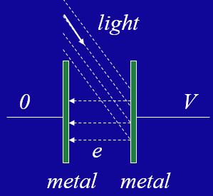

# 量子力学

> 量子力学的部分就花了两节课光速飞过了，也不知道哪些是重点，就稍微记一些公式和概念好了

## 光的本质（The Nature of Light）

光既是波也是粒子，但不是传统的波，也不是传统的粒子

- 波动性：干涉、衍射
- 粒子性：黑体辐射、光电效应、康普顿散射

!!! definition "黑体辐射"
    黑体：在任何条件下，对任何波长的外来辐射完全吸收而无任何反射的物体，即吸收比为1的物体。理想黑体可以吸收所有照射到它表面的电磁辐射，并将这些辐射转化为热辐射，其光谱特征仅与该黑体的温度有关，与黑体的材质无关。

    **韦恩公式**：黑体辐射的波长最大值 $\lambda_{max}$ 与温度 $T$ 之间的关系为 $\lambda_{max} T = b$，其中 $b = 2.898 \times 10^{-3} m \cdot K$，即 $\lambda_{max} = \dfrac{b}{T}$

    **普朗克辐射定律**：
    $$ R(\lambda, T) = \dfrac{2\pi hc^2}{\lambda^5} \dfrac{1}{e^{\frac{hc}{\lambda kT}} - 1} = \dfrac{2\pi hc^2}{\lambda^5} \dfrac{1}{e^{\frac{h\nu}{kT}} - 1} $$
    其中，$R(\lambda, T)$ 为单位面积黑体辐射的辐射强度，$h=6.63 \times 10^{-34} J \cdot s $ 为普朗克常数，$c$ 为光速，$\lambda$ 为波长，$T$ 为温度，$k$ 为玻尔兹曼常数，$\nu$ 为光频率。

    除了常见的普朗克常数外，还有约化普朗克常数 $\hbar = \dfrac{h}{2\pi}$。

### 光子的性质

光有波粒二象性

- 波动性：$\overrightarrow{E} = \overrightarrow{E}_m \cos(\overrightarrow{k} \cdot \overrightarrow{r} - \omega t)$，或者用复数表示：$\overrightarrow{E} = \overrightarrow{E}_m e^{i(\overrightarrow{k} \cdot \overrightarrow{r} - \omega t)}$

    - 其中 $k=\dfrac{2\pi}{\lambda}$ 为波数（波矢 wave vector），$\omega = 2\pi f = 2\pi \nu$ 为角频率

- 粒子性：光子——光的量子化

    - 光子静质量为 $M_{photon} = 0$
    - 能量为 $E = h\nu = \hbar \omega$
    - 动量为 $p = \dfrac{E}{c} = \dfrac{h}{\lambda} = \hbar k$

!!! note "一些常见符号的辨析"
    - $\omega$ 为角频率，单位为弧度每秒 $\omega = 2\pi f = \dfrac{2\pi}{T}$
    - $\nu$ 为频率，单位为赫兹 $\nu = \dfrac{1}{T}$，有时也用 $f$ 表示
    - $\lambda$ 为波长，$\lambda = \dfrac{c}{\nu} = \dfrac{2\pi}{k}$
    - $k$ 为波数，$k = \dfrac{2\pi}{\lambda}$

### 光电效应

{align=right width=25%}

当高于某个频率的光照射到金属上时，金属的电子会吸收能量后逸出金属表面形成，这种现象称为**光电效应**。这个特定的频率被称为截止频率，记为 $\nu_0$，不同的金属有不同的截止频率（阈值频率）。

- 截止频率：截止频率的存在是因为电子需要克服金属的束缚做功才能逸出金属表面，我们把逸出需要的做功大小称为逸出功 $W_0$，或工作函数 $\phi$，即 $W_0 = h\nu_0$

- 光子能量和电子动能：入射光子的能量一部分用于电子逸出，一部分用于电子的动能，即 
    $$ h\nu = \dfrac{1}{2}mv^2 + W_0 $$
    这个式子中的 $\dfrac{1}{2}mv^2$ 指的是受激电子的最大动能，因为可能还有其它因素影响电子的动能，比如电子与金属表面的碰撞等

- 通常而言我们仅考虑一个电子受到一个光子的激发，而不考虑多个光子对于同一个电子的作用，因此当我们增加入射光的强度（光子数目）而不改变光的频率时，只会增加电子的数量（增大电流）而不会影响电子的最大动能

在上面的图中，最终达到稳定时两个金属板之间会有一个电势差 $V$，并且此时电子的最大动能恰好不能克服电势差，即
$$ K = \dfrac{1}{2}mv^2 = eV $$
因此我们可以求出达到平衡时的电势差为
$$ V = \dfrac{h}{e}\nu - \dfrac{\phi}{e} $$

!!! info "康普顿散射"
    康普顿散射是指入射光子与自由电子碰撞后，光子的能量和动量发生变化，从而使得光子的波长发生变化。这个现象是量子力学的一个重要实验现象，也是光子的粒子性的一个重要证据。

    考虑右边的一个例子，光子与一个静止的电子发生碰撞后，光子的波长由 $\nu$ 变为 $\nu'$，而电子的动能由 $0$ 变为 $K$，根据能量守恒和动量守恒，我们可以得到
    $$ \begin{cases}
    h\nu + m_0c^2 = h\nu' + mc^2 \Longrightarrow \dfrac{hc}{\lambda_0} = \dfrac{hc}{\lambda'} + m_0c^2 \left[ \dfrac{1}{\sqrt{1-(v/c)^2}} - 1 \right] \\\\\\
    \dfrac{h}{\lambda_0} = \dfrac{h}{\lambda'} \cos\phi + \dfrac{m_0 v}{\sqrt{1-(v/c)^2}} \cos\theta \\\\\\
    \dfrac{h}{\lambda_0} \sin\phi = \dfrac{m_0 v}{\sqrt{1-(v/c)^2}} \sin\theta
    \end{cases} $$

    可以求得光子的波长变化为
    $$ \Delta \lambda = \lambda' - \lambda_0 = \dfrac{h}{m_0c} (1-\cos\phi) $$

## 物质波（Matter Wave）

!!! quote "物质波的提出"
    1924 年，从未系统学习过物理学的德布罗意提出了物质波的概念，他认为不仅是光具有波动性，任何物质都具有波动性。

在宏观世界中，物质的动量为 $p = mv$，动能为 $E_k = \dfrac{1}{2}mv^2$。而在量子世界中，物质的动量和动能可以用波长和频率来表示，我们把它也用于宏观世界，即

- 动量波长关系：$p = \dfrac{h}{\lambda} = \hbar k$
- 能量频率关系：$E = h\nu = \hbar \omega$
- 物质波振动的波长为 $\lambda = \dfrac{h}{p} = \dfrac{h}{mv} = \dfrac{h}{\sqrt{2mE}} $

### 波函数

物质波满足这样的一个波函数：
$$ \varPsi(x,t) = \psi_0 e^{i(kx-\omega t)} = \psi_0 e^{\frac{i}{\hbar} (px-Et)} $$
其中 $\psi_0$ 是波的振幅。

!!! note "波函数的物理解释：几率波"
    > The product $\varPsi_0 \varPsi_0^* dx$ gives the probability that the particle in question will be found between positions $x$ and $x+dx$. 
    
    $\varPsi_0 \varPsi_0^* dx$ 表示粒子在位置 $x$ 和 $x+dx$ 之间被找到的概率，其中 $\varPsi_0^*$ 是波函数的负数共轭

    - 几率密度为 $P(x) = \varPsi_0 \varPsi_0^*$

    - 粒子在位置 $x_1$ 和 $x_2$ 之间找到的概率为
    $$ \int_{x_1}^{x_2} P(x) dx = \int_{x_1}^{x_2} \varPsi_0 \varPsi_0^* dx $$

    - 显然这个几率密度也要满足归一化的性质
    $$ \int_{-\infty}^{\infty} P(x) dx = \int_{-\infty}^{\infty} \varPsi_0 \varPsi_0^* dx = 1 $$

    对于一个自由粒子来说，有
    $$ P(x) = [ \psi_0 e^{i(kx-\omega t)} ] [ \psi_0^* e^{-i(kx-\omega t)} ] = |\psi_0|^2 = const $$

    由于自由粒子所受的合外力为 0，因此它的动量变化为 $\Delta p_x = 0$。从 $ \varPsi(x,t) = \psi_0 e^{\frac{i}{\hbar} (px-Et)} $ 可以知道这时候几率密度可是一个很小的常数。它的物理意义是在一维空间中任意时刻、任意位置，粒子的分布几率都相同。

### 各种算符的定义

#### 期望算符

根据测不准原理，我们无法准确地找到粒子的位置、动量、能量和速度，但我们可以讨论它们的预期值（expectation values），或者说平均值（average values）。

一个粒子的期望位置可以被定义为
$$ \bar{x} = \dfrac{\displaystyle\int_{-\infty}^{\infty} xP(x) dx}{\displaystyle\int_{-\infty}^{\infty} P(x) dx} = \int_{-\infty}^{\infty} xP(x) dx $$
其中 $\displaystyle\int_{-\infty}^{\infty} P(x) dx = 1$

这时候我们把 $P = |\Psi|^2 = \Psi^* \Psi$ 代入得到 

$$ \bar{x} = \dfrac{\displaystyle\int_{-\infty}^{\infty} x\Psi^* \Psi dx}{\displaystyle\int_{-\infty}^{\infty} \Psi^* \Psi dx} = \int_{-\infty}^{\infty} \Psi^* x \Psi dx = \left< \psi |x| \psi \right> = \left< |x| \right> $$

其中 $\displaystyle\int_{-\infty}^{\infty} \Psi^* \Psi dx = 1$

上面的 $\left< || \right> $ 算符表示被 $\Psi^*$ 和 $\Psi$ 夹在中间从负无穷到正无穷积分

类似地，我们也可以对其他的标量值求期望值，例如势能 $U(x)$
$$ \overline{U} = \int_{-\infty}^{\infty} \Psi^* U(x) \Psi dx = \left< \psi |U(x)| \psi \right> $$

#### 动量算符

我们已经知道 $\varPsi(x,t) = \psi_0 e^{i(kx-\omega t)},\quad p = \hbar k,\quad E=\hbar \omega$

对波函数关于 $x$ 求偏导，得到
$$ \dfrac{\partial \varPsi}{\partial x} = ik \psi_0 e^{i(kx-\omega t)} $$
再对方程两边同时乘上 $-i\hbar$ 就得到
$$ -i\hbar \dfrac{\partial \varPsi}{\partial x} = (-i\hbar) ik \psi_0 e^{i(kx-\omega t)} = \hbar k \psi_0 e^{i(kx-\omega t)} $$
注意到动量 $p = \hbar k$，于是
$$ -i\hbar \dfrac{\partial }{\partial x} \varPsi = p \cdot \psi_0 e^{i(kx-\omega t)} = p \Psi $$
那么我们就得到了动量算符为
$$ p \leftrightarrow -i\hbar \dfrac{\partial }{\partial x} $$

!!! note "使用动量算符求动量期望值"
    $$ \begin{aligned}
    \bar{p} &= \int_{-\infty}^{\infty} \Psi^* \left(-i\hbar \dfrac{\partial }{\partial x} \right) \Psi dx \\\\
    &= \int_{-\infty}^{\infty} \Psi^* \left(-i\hbar \dfrac{\partial }{\partial x} \right) \psi_0 e^{i(kx-\omega t)} dx \\\\
    &= \int_{-\infty}^{\infty} \Psi^* (-i\hbar) ik \psi_0 e^{i(kx-\omega t)} dx \\\\
    &= \hbar k \int_{-\infty}^{\infty} \Psi^* \psi_0 e^{i(kx-\omega t)} dx \\\\
    &= \hbar k \int_{-\infty}^{\infty} \Psi^* \Psi dx \\\\
    &= \hbar k
    \end{aligned} $$

#### 能量算符

能量算符的推导和动量算符十分相似
$$ \dfrac{\partial \varPsi}{\partial t} = -i\omega \psi_0 e^{i(kx-\omega t)} $$
两边乘上 $i\hbar$ 并且代入 $E=\hbar \omega$，就得到
$$ i\hbar \dfrac{\partial \varPsi}{\partial t} = (i\hbar) (-i\omega) \psi_0 e^{i(kx-\omega t)} = \hbar \omega  \psi_0 e^{i(kx-\omega t)} = E\varPsi $$
于是我们就知道能量算符（Energy operator）为
$$ E \leftrightarrow i\hbar \dfrac{\partial}{\partial t} $$

!!! note "使用能量算符求能量期望值"
    $$ \begin{aligned}
    \bar{E} &= \int_{-\infty}^{\infty} \Psi^* \left(i\hbar \dfrac{\partial}{\partial t} \right) \Psi dx \\\\
    &= \int_{-\infty}^{\infty} \Psi^* \left(-i\hbar \dfrac{\partial}{\partial t} \right) \psi_0 e^{i(kx-\omega t)} dx \\\\
    &= \int_{-\infty}^{\infty} \Psi^* (i\hbar) (-i\omega) \psi_0 e^{i(kx-\omega t)} dx \\\\
    &= \hbar \omega \int_{-\infty}^{\infty} \Psi^* \psi_0 e^{i(kx-\omega t)} dx \\\\
    &= \hbar \omega \int_{-\infty}^{\infty} \Psi^* \Psi dx \\\\
    &= \hbar \omega
    \end{aligned} $$

### 薛定谔方程

!!! quote "薛定谔方程"
    薛定谔方程告诉我们如何把非自由粒子和波函数结合起来

一个粒子的总能量包括动能和势能两部分
$$ E = \dfrac{1}{2} mv^2 + U = \dfrac{p^2}{2m} + U $$
把波函数应用到这上面就得到

$$ \begin{aligned}
E \varPsi &= \dfrac{p^2}{2m} \varPsi + U \varPsi \\\\
i\hbar \dfrac{\partial}{\partial t} \varPsi &= \dfrac{1}{2m} (-i\hbar \dfrac{\partial }{\partial x}) (-i\hbar \dfrac{\partial }{\partial x}) \varPsi + U \varPsi \\\\
i\hbar \dfrac{\partial}{\partial t} \varPsi &= -\dfrac{\hbar^2}{2m} \dfrac{\partial^2}{\partial x^2} \varPsi + U \varPsi 
\end{aligned} $$

于是我们最终就得到了一维含时薛定谔方程：
$$ i\hbar \dfrac{\partial \varPsi(x,t)}{\partial t} = \left[ -\dfrac{\hbar^2}{2m} \dfrac{d^2}{d x^2}  + U(x,t) \right] \varPsi(x,t) $$
可以简写为
$$ i\hbar \dfrac{\partial \varPsi(x,t)}{\partial t} = \hat{H} \varPsi(x,t) $$
其中 $\hat{H}$ 为哈密顿算符（Hamilton operator）

!!! extra "哈密顿算符"
    - 一维情况下，$ \hat{H} = -\dfrac{\hbar^2}{2m} \dfrac{d^2}{d x^2}  + U(x,t) $
    - 三维情况下，$ \hat{H} = -\dfrac{\hbar^2}{2m} \nabla^2  + U(x,y,z,t) $

        其中 $\nabla^2 = \dfrac{\partial^2}{\partial x^2} + \dfrac{\partial^2}{\partial y^2} + \dfrac{\partial^2}{\partial z^2}$ 被称为拉普拉斯算符

### 定态薛定谔方程

当势能函数与时间无关时 $U(x)$，波函数可以写成如下形式
$$ \varPsi(x,t) = \psi(x) e^{-i\omega t} = \psi e^{-i\omega t} $$
从而可以把时间和空间分离开，带入到薛定谔方程中得到

$$ \begin{aligned}
i\hbar \dfrac{\partial}{\partial t} \varPsi &= -\dfrac{\hbar^2}{2m} \dfrac{\partial^2}{\partial x^2} \varPsi + U \varPsi \\\\
i\hbar \dfrac{\partial}{\partial t} (\psi e^{-i\omega t}) &= -\dfrac{\hbar^2}{2m} \dfrac{\partial^2}{\partial x^2} (\psi e^{-i\omega t}) + U \psi e^{-i\omega t} \\\\
(-i \omega) i\hbar \psi e^{-i\omega t} &= -\dfrac{\hbar^2}{2m} \dfrac{d^2 \psi}{d x^2}  e^{-i\omega t} + U \psi e^{-i\omega t} \\\\
\hbar \omega \psi &= -\dfrac{\hbar^2}{2m} \dfrac{d^2}{d x^2} \psi + U \psi \\\\
\end{aligned} $$

最后我们再把 $E = \hbar \omega$ 代入，就得到了一维定态薛定谔方程
$$ E \psi(x) = -\dfrac{\hbar^2}{2m} \dfrac{d^2 \psi(x)}{d x^2} + U(x) \psi(x) $$

这里的 $E$ 和 $U(x)$ 分别是粒子的总能量和势能，于是可以化简为
$$ \dfrac{d^2 \psi(x)}{d x^2} + \dfrac{2m}{\hbar^2} (E - U) \psi(x) = 0 $$
又因为左边实际上就是哈密顿算符 $\hat{H}$ 乘以波函数，于是可以写成
$$ \hat{H} \psi(x) = E \psi(x) $$

!!! tip "哈密顿算符的本征方程"
    上面的这个式子实际上和我们在线性代数中学到的矩阵（线性映射）的本征方程 $AX = \lambda X$ 是一样的，因此我们称
    $$ \hat{H} \psi(x)_n = E_n \psi(x)_n $$
    为哈密顿算符的本征方程
    - $\psi(x)_n$ 为哈密顿算符的本征函数
    - $E_n$ 为哈密顿算符的本征值

!!! info "量子力学的一些其他概念"
    > 方明虎老师在 23 年的课上讲到这里课程的内容就结束了，但是量子力学还有一些概念没提到或是只是提了一下，这里就简单记录一下

    - 势垒隧道（barrier tunneling）

        粒子运动遇到一个高于粒子能量的势垒时，按照经典力学，只有粒子能量 $E$ 大于势垒 $U$ 的时候才能越过势垒；但在量子力学中，能量 $E$ 小于 $U$ 时，粒子也有一定概率运动到势垒另一侧，或按一定概率被势垒反射回来。
    
        势垒隧道（势垒贯穿）是个形象的比喻，就是说不需要很高的能量越过势垒，而是在能量较低的时候也可能射过去，就像在势垒下面凿了个隧道。

    - 测不准原理（uncertainty principle）

        测不准原理是量子力学的一个基本原理，它表明我们无法同时准确地测量一个粒子的位置和动量，或者说同时准确地测量一个粒子能量和时间。量子力学中的粒子是通过波函数来描述的，波函数给出的是粒子位置和动量的概率分布，而不是确定的数值。当我们试图精确测量一个粒子的位置时，就会使得它的动量变得不确定，反之亦然。
        $$ \Delta x \Delta p \geq \dfrac{\hbar}{2} $$

        $$ \Delta E \Delta t \geq \dfrac{\hbar}{2} $$
        上面这两个式子中 $\Delta x$ 和 $\Delta p$ 分别是粒子位置和动量的不确定度，$\Delta E$ 和 $\Delta t$ 分别是粒子能量和时间的不确定度。

        第一个式子称为海森伯不确定关系，表示微观粒子的位置和动量不能同时具有确定的值，给出了同时测定一个微观粒子位置和动量的精度的极限，无论测量仪器精度如何，测量结果都不可能超过这一极限，因此也称为测不准关系。
