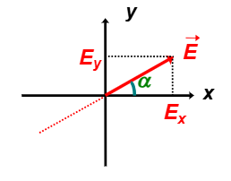
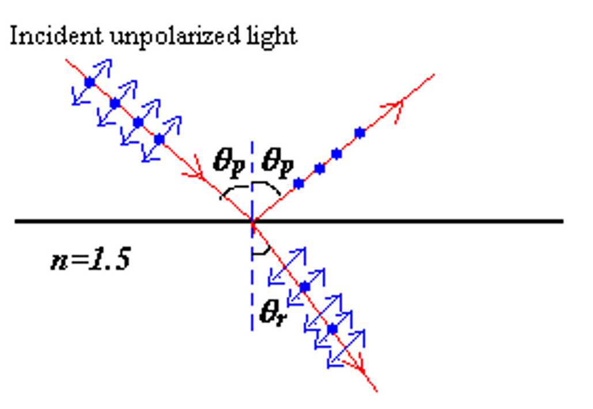
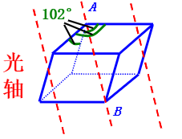
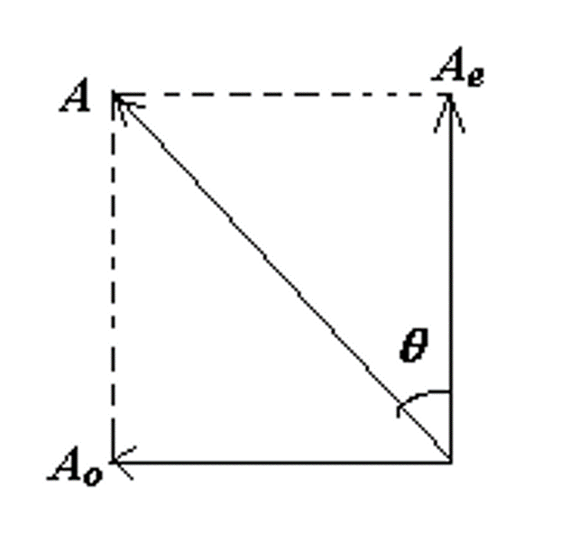

# 波动光学

!!! abstract 
    在几何光学中，$\lambda << d$，即光波的波长远小于光程差，可以忽略波动性。而在波动光学中，$\lambda \approx d$，即光波的波长与光程差比较接近，波动性不能忽略。

    主要包括三个部分

    - Interference 干涉
    - Diffraction 衍射
    - Polarization 偏振

## 干涉（Interference）

### 定态光波

所谓定态波就是指波的振幅和相位都与时间无关的波，例如
$$ U(P,t) = A(P) \cos(\omega t - \varphi(P)) $$
中的 $A(P)$ 和$ \varphi(P)$ 都仅仅是与空间有关的函数，而与时间无关。

!!! example
    - 定态平面波

        $$  \begin{aligned}
        & \begin{cases} A(P) = A_0 ,\text{constant, independent of (x,y,z)} \\ 
        \varphi(P) = \overrightarrow{k} \cdot \overrightarrow{r} + \varphi_0 = k_x x + k_y y + k_z z + \varphi_0 
        \end{cases} \\\\
        & k = \dfrac{2\pi}{\lambda}, \overrightarrow{r} = x \overrightarrow{i} + y \overrightarrow{j} + z \overrightarrow{k}
        \end{aligned} $$  

    - 定态球面波

        $$ \begin{cases} 
        A(P) = \dfrac{a}{r} \\ 
        \varphi(P) = kr \varphi_0 
        \end{cases} $$

光也是一种波，因此定态光波可以描述为
$$ \overrightarrow{E}(P,t) = \overrightarrow{E}_0 (P) \cos(\omega t - \varphi(P)) $$
$$ \overrightarrow{H}(P,t) = \overrightarrow{H}_0 (P) \cos(\omega t - \varphi(P)) $$

### 波的负数描述

$$ \begin{aligned}
& U(P,t) = A(P) \cos[\omega t - \varphi(P)] \\\\
\Longleftrightarrow \quad & \widetilde{U}(P,t) = A(P) e^{\pm i[\omega t - \varphi(P)]}
\end{aligned} $$

上面的正负符号的不同是由于欧拉公式的不同形式，但是在实际应用中，我们通常使用负号。

对于一个定态波，我们可以把它的空间和时间分离，即
$$ \widetilde{U}(P,t) = A(P) e^{i[\varphi(P) - \omega t]} = A(P) e^{i\varphi(P)} e^{-i\omega t} $$
其中，$\widetilde{U}(P) = A(P) e^{i\varphi(P)}$ 是波的复振幅，$e^{-i\omega t}$ 是波的时间因子。

!!! note
    - 平面波 $$ \widetilde{U}(P) =  e^{i(\overrightarrow{k} \cdot \overrightarrow{r} + \varphi_0)} = A e^{i(k_x x + k_y y + k_z z + \varphi_0)} $$
    - 球面波 $$ \widetilde{U}(P) = \dfrac{a}{r} e^{i(kr + \varphi_0)} $$

    波的强度与振幅的平方成正比，即 $I \propto |A|^2$，但是一般而言我们会直接使用等号
    $$ I(P) - [A(P)]^2 = \widetilde{U}^*(P) \cdot \widetilde{U}(P) $$

### 波的干涉与相干条件

两列波叠加的结果为
$$ \widetilde{U}(P,t) = \widetilde{U}_1(P,t) + \widetilde{U}_2(P,t) = [A_1(P) e^{i\varphi_1(P)} + A_2(P) e^{i\varphi_2(P)}] e^{-i\omega t} $$ 

因此波的强度为

$$ \begin{aligned}
I(P) &= \widetilde{U}^*(P) \cdot \widetilde{U}(P) \\\\
&= [A_1 e^{-i\varphi_1(P)} + A_2 e^{-i\varphi_2(P)}] [A_1 e^{i\varphi_1(P)} + A_2 e^{i\varphi_2(P)}] \\\\
&= A_1^2 + A_2^2 + A_1 A_2 [e^{i(\varphi_1 - \varphi_2)} + e^{-i(\varphi_1 - \varphi_2)}] \\\\
&= A_1^2 + A_2^2 + 2 A_1 A_2 \cos(\varphi_1 - \varphi_2)
\end{aligned} $$

由于 $I_1(P) = A_1^2, I_2(P) = A_2^2$，因此两列波的强度之和为
$$ I(P) = I_1(P) + I_2(P) + 2 \sqrt{I_1(P) I_2(P)} \cos(\varphi_1 - \varphi_2) $$

!!! note "干涉现象的光强分布"
    <figure>
        
    </figure>

    因此一般来说 $I(P) \neq I_1(P) + I_2(P)$，只有当 $\varphi_1 - \varphi_2 = 2n\pi$ 时，两列波才是完全相干的。

    $$ \begin{cases}
    \cos(\varphi_1 - \varphi_2) > 0, \quad I(P) > I_1(P) + I_2(P) \\\\
    \cos(\varphi_1 - \varphi_2) < 0, \quad I(P) < I_1(P) + I_2(P)
    \end{cases} $$

    两个光波之间的相位差 $\Delta \varphi = \varphi_1 - \varphi_2$ 是干涉现象的关键，当相位差不固定时，那么它在在统计意义上的平均值为零，即
    $$ \overline{\cos \Delta \varphi} = \overline{\cos(\varphi_1 - \varphi_2)} = 0 $$
    相位差会随时间变化时，我们称两列波不相干（incoherent）。

除了相位差需要保持固定之外，两个波的频率还需要保持一致，即 $\omega_1 = \omega_2$，这就是两个波的相干条件。

### 介质中的光程差

相位差在分析光的干涉时十分重要，为便于计算光通过不同媒质时的相位差，我们引入“光程差”的概念。

根据已经学习到的知识，我们知道光程就是 $L = \int n ds$，因此光程差就是。由于光波的相位与它传播的距离，即光程相关，那么我们可以知道相位差与光程差的关系为
$$ \Delta \varphi = \dfrac{2\pi}{\lambda} \Delta L $$
其中 $\Delta L$ 是光程差，$\lambda$ 是光的波长

!!! summary "光的干涉" 
    光相干的条件为

    - 频率相同
    - 振动方向相同
    - 相位差恒定

    判断光是否干涉：
    $$ \begin{aligned}
    & \Delta \varphi = 
    \begin{cases} 
    \pm 2k\pi, &k=0,1,2,\cdots \text{干涉增强} \\\\
    \pm (2k+1)\pi, &k=0,1,2,\cdots \text{干涉减弱}
    \end{cases} \\\\
    & \Delta L =
    \begin{cases}
    \pm k\lambda, &k=0,1,2,\cdots \text{干涉增强}\\\\
    \pm (2k+1)\dfrac{\lambda}{2}, &k=0,1,2,\cdots \text{干涉减弱}
    \end{cases}
    \end{aligned} $$

### 杨氏双缝干涉实验

<figure>
    
</figure>

杨氏双缝实验需要满足的条件是

- 两缝之间的间距 $d$ 要远大于光的波长 $\lambda$，即 $d >> \lambda$
- 缝到屏幕的距离 $D$ 要远大于缝之间的距离 $d$，即 $D >> d$。

<figure>
    
</figure>

光程差 $\Delta L = r_2 - r_1 \approx d \sin \theta \approx d \tan\theta = d \cdot \dfrac{y}{D}$

- 干涉相长：$d \sin\theta = m\lambda$
- 亮纹中心：$x = \dfrac{m\lambda D}{d}$
- 干涉相消：$d \sin\theta = (m + \dfrac{1}{2})\lambda$
- 暗纹中心：$x = \dfrac{(m + \dfrac{1}{2})\lambda D}{d}$
- 两相邻亮纹（暗纹）的间距：$\Delta x = \dfrac{D}{d}\lambda$

!!! question
    - 将双缝干涉装置由空气中放入水中时，屏上的干涉条纹有何变化？

        由于水的折射率大于空气折射率，因此光在水中的波长减小，根据 $\Delta x = \dfrac{D}{d}\lambda$，条纹间距会减小

    - 若使用白光为光源进行双缝干涉实验，可以观察到几级清晰可辨的彩色光谱？

        用白光照射时，在中央白色明纹两侧，只有第一级彩色光谱是清晰可辨的。

!!! tip
    当两缝的间距小于光的波长时，将无法看到干涉亮条纹。

    因为亮条纹要求 $d \sin\theta = m \lambda$，即 $\sin\theta = \dfrac{m \lambda}{d}$。
    
    当 $d < \lambda$ 时，就有 $\sin\theta > 1$，这是不可能的，因此无法看到亮条纹。

### 洛埃德镜实验

<figure>
    
</figure>

- 当屏移到 $A'B'$ 位置时，在屏上的 $P$ 点会出现暗条纹。这一实验结果表明当光在镜子表面发生反射时，反射光的相位会变化一个 $\pi$。

!!! note "半波损失（Reflection Phase Shifts）"
    - 光从光疏介质反射到光密介质，反射光的相位会变化一个 $\pi$。
    - 光从光密介质反射到光疏介质，反射光的相位不变。

    <figure>
        
    </figure>

    可以类比于更一般的波的反射，当波传播到更“难”传播，或者说更“稠密”的介质中时，反射回来的波会有一个 $\pi$ 的相位差，这就是半波损失。

    - **折射波不会出现半波损失**

### 等厚干涉

{align=right width=24%}

可以通过计算证明，在分别在上表面和下表面反射的两束光的光程差为
$$ \Delta L = 2nh \cos i $$

- 亮条纹（maxmum）：$\Delta L = 2nh \cos i = m\lambda$
- 暗条纹（minmum）：$\Delta L = 2nh \cos i = (m + \dfrac{1}{2})\lambda$

!!! tip
    这里要注意，如果 $n_1 < n$，那么在反射时会产生半波损失，那么光程差就相当于 $2nh \cos i + \dfrac{\lambda}{2}$。

通常而言我们考虑垂直入射的情况，即 $i = 0$，那么光程差就化简为
$$ \Delta L = 2nh $$

#### 劈尖膜

<figure>
    
</figure>

由于光线在空气劈尖的下表面发生反射时会有半波损失，因此实际的光程差为
$$ \Delta L = 2nh + \dfrac{\lambda}{2} $$
其中 $h$ 为入射位置对应的空气劈尖厚度。

于是发生干涉时，亮条纹和暗条纹的条件为

$$ \Delta L = 2nh + \dfrac{\lambda}{2} = \begin{cases}
m\lambda, & m = 0,1,2,\cdots \text{亮条纹} \\
(m + \dfrac{1}{2})\lambda, & m = 0,1,2,\cdots \text{暗条纹}
\end{cases} $$

亮、暗条纹对应的厚度为

$$ h = \begin{cases}
\dfrac{(m-\dfrac{1}{2})}{2n} \lambda, & m = 1,2,3,\cdots \quad \text{亮条纹} \\\\
\dfrac{m}{2n} \lambda, & m = 0,1,2,\cdots \quad \text{暗条纹}
\end{cases} $$

于是相邻的两个条纹对应的厚度差为 $\Delta h = \dfrac{\lambda}{2n}$

!!! example 
    <figure>
        
    </figure>

    如果工件的表面是完全平滑没有凹凸的，那么等厚干涉条纹将会是等间距交错的明暗条纹，并且所有连续条纹对应位置的空气劈尖厚度一定是相同的。

    如果出现下凹，那么下凹处的披肩厚度将会比周围的厚度大，因此会观测到干涉条纹向着厚度更低的地方弯曲。

    例如上图中干涉条纹弯向空气膜的左端，红线上的劈尖厚度处处相等，因此可以知道左侧的表面出现了下凹。利用相似三角形的知识我们可以知道
    $$ \dfrac{a}{b} = \dfrac{\Delta h}{e_k - e_{k+1}} = \dfrac{\Delta h}{\lambda / 2} $$
    这里 $e_k$ 表示第 $k$ 级条纹对应的劈尖厚度，并且在空气中 $n=1$，所以
    $$ \Delta h = \dfrac{a}{b} \dfrac{\lambda}{2} $$

#### 牛顿环

{align=right width=30%}

$$ \Delta L = 2e + \dfrac{\lambda}{2} = \begin{cases}
m\lambda, & m = 0,1,2,\cdots \text{亮纹} \\
(m + \dfrac{1}{2})\lambda, & m = 0,1,2,\cdots \text{暗纹}
\end{cases} $$

根据几何关系，
$$ r^2 + (R - e)^2 = R^2 $$
由于 $e$ 很小，所以它的二次项可以忽略，因此
$$ e = \dfrac{r^2}{2R} $$

导入到上面光程差的式子中，计算得到

$$ r = \begin{cases}
\sqrt{(m - \dfrac{1}{2})\lambda R}, & m = 1,2,3,\cdots \quad \text{亮条纹} \\\\
\sqrt{m \lambda R}, & m = 0,1,2,\cdots \quad \text{暗条纹}
\end{cases} $$

于是我们知道牛顿环干涉条纹是一系列明暗相间的同心圆环，并且中心是一个暗斑。

{align=right width=20%}

由于
$$ \Delta r = r_{m+1} - r_m = \dfrac{\sqrt{R\lambda}}{\sqrt{R} + \sqrt{R+1}} $$
因此牛顿环的条纹间距是不等的，且内疏外密。

---

## 衍射（Diffraction）

光在传播过程中，会出现绕过障碍物的边缘而偏离直线传播的现象，这称为光的衍射现象。

!!! note "菲涅耳衍射和弗朗和夫衍射"
    

        
        
    

    - 菲涅耳衍射：当光源和观察屏，或两者之一离障碍物（衍射屏）的距离为有限远时，所发生的衍射现象。（左图）
    - 弗朗和夫衍射：光源和观察屏离障碍物的距离均为无限远时，所发生的衍射现象。（右图）

!!! info "惠更斯—菲涅耳原理"
    - 惠更斯原理：媒质中波动所到达的各点都可以看作一个新的子波源，这些子波源向空间发射球面子波。在以后的任一时刻，这些子波的包络面就是波在该时刻的新的波阵面。
    - 惠更斯—菲涅耳原理：波传到的任何一点都是子波的波源，各子波在空间某点的相干叠加，就决定了该点波的强度。

    {align=right width=35%}

    $$ \mathrm{d}E_P = C \dfrac{\mathrm{d}S}{r} K(\theta) \cos(\dfrac{2\pi}{\lambda} r \omega t + \varphi_0) $$
    $$ E_P = \int_S C \dfrac{K(\theta)}{r} \cos(\dfrac{2\pi}{\lambda} r \omega t + \varphi_0) \mathrm{d}S $$
    其中 $K(\theta)$ 为倾斜银子

    - $\theta = 0$ 时，$K=K_{max}=1$，沿原波传播方向的子波振幅最大
    - $\theta$ 增大时 $K$ 减小
    - $\theta \geqslant \dfrac{\pi}{2}$ 时 $K=0$，因为子波不能向后传播

!!! tip "弗朗和夫衍射中的惠更斯—菲涅耳原理"
    由于在弗朗和夫衍射中光源和观察屏到障碍物的距离均为无限远，因此这时候 $K(\theta)$ 和 $r$ 都可以视作一个常数，因此
    $$ E_P \propto \int_S \cos(\dfrac{2\pi}{\lambda} r \omega t + \varphi_0) \mathrm{d}S $$

### 弗朗和夫单缝衍射

实验装置图以及光路图如下

<figure>
    
</figure>

<figure>
    
</figure>

由于缝中各点的光都可以看作一个新的波源，我们考虑这些波源朝着角度为 $\theta$ 的方向发射新的子波的情况，显然光程差为 $\Delta L = \delta = a \sin\theta$

当 $\theta=0$ 时，子波的相干点 $P$ 在中心轴上，没有光程差，相位相同，因此相干加强，形成中心明纹

#### 菲涅耳半波带法

在波阵面上截取一个条状带，使它上下两边缘发的光在屏上 $P$ 处的光程差为 $\dfrac{\lambda}{2}$，此带称为半波带。

- 例如当 $a \sin\theta = \lambda$ 时，可将缝分为两个半波带
- 两相邻半波带上对应点在相同的 $P$ 点处干涉相消，形成暗条纹

<figure>
    
</figure>

由半波带法可得条件：

- 暗纹：$a \sin\theta = \pm k \lambda, \quad k = 1,2,3,\cdots$
- 明纹（近似）：$a \sin\theta = \pm (2k+1) \dfrac{\lambda}{2}, \quad k = 1,2,3,\cdots$
- 中央明纹（中心）：$a \sin\theta = 0$

#### 振幅矢量叠加法

{align=right width=30%}

我们知道可以把一个波用复数的形式表示，如右图就是一个波在复平面上的表示，波的实际振幅是它在实轴上的投影大小。

假如我们把一个单缝分割为多份，每一份的宽度都是 $\Delta x$，那么相邻两份之间的相位差就是
$$ \Delta \varphi = \dfrac{2\pi}{\lambda} \Delta x \sin\theta $$
在复平面上的表现就是相邻两个波都相差一个 $\Delta \varphi$ 的角度。

<figure>
    
</figure>

{align=right width=25%}

如上图所示，假如我们把一个缝分割成 $N$ 份，那么

$$ \begin{aligned}
E_1 &= E_0 e^{i \cdot 0} \\
E_2 &= E_0 e^{i \cdot \Delta \varphi} \\
&\cdots \\
E_N &= E_0 e^{i \cdot (N-1)\Delta \varphi} \\
\end{aligned} $$

其中 $\Delta \varphi = \dfrac{2\pi}{\lambda} \cdot \dfrac{a}{N} \sin\theta$ 是相邻矢量之间的夹角。

我们再把总的角度偏转记为 $\delta = N \Delta \varphi = \dfrac{2\pi}{\lambda} a \sin\theta$，我们令
$$ \alpha = \dfrac{\delta}{2} = \dfrac{\pi}{\lambda} a \sin\theta$$
于是就得到

$$ \begin{aligned}
E_{\theta} &= \overline{MN} = 2R\sin\alpha \\
&= 2 \cdot \dfrac{\mathop{MN}\limits^\frown}{2\alpha} \cdot \sin\alpha \\
&= \mathop{MN}\limits^\frown \dfrac{\sin\alpha}{\alpha}
\end{aligned} $$

显然当 $\theta=0$ 时光波的电场的强度最大，这时候 $\mathop{MN}\limits^\frown = E_m$，所以
$$ E_{\theta} = E_m \dfrac{\sin\alpha}{\alpha} $$
在 $P$ 点成像时光的强度为
$$ I_{\theta} = E_{\theta}^2 = E_m^2 \left( \dfrac{\sin\alpha}{\alpha} \right)^2 = I_m \left( \dfrac{\sin\alpha}{\alpha} \right)^2 $$

!!! tip "振幅矢量叠加法"
    $$ I_{\theta} = I_m \left( \dfrac{\sin\alpha}{\alpha} \right)^2 $$

    - 当 $\alpha = \dfrac{\pi a \sin\theta}{\lambda} = m\pi \quad m= \pm 1, \pm 2, \cdots$ 时

        - $I_{\theta} = I_m \left( \dfrac{\sin\alpha}{\alpha} \right)^2 = 0$，出现暗纹（极小）

        此时 $a\sin\theta = m\lambda$

    - 当 $\theta=0$ 时，$\alpha = \dfrac{\pi a \sin\theta}{\lambda} \to 0, \, \lim\limits_{\alpha \to 0} (\dfrac{\sin\alpha}{\alpha}) = 1$

        - 于是 $I_{\theta=0} = I_m$

    - 当 $\alpha = \dfrac{\pi a \sin\theta}{\lambda} = (m+\dfrac{1}{2})\pi, \, a\sin\theta = (m+\dfrac{1}{2})\lambda$，极大，出现亮纹

    <figure>
        
    </figure>

    可以计算 $m=1,2,\cdots$ 时与中心亮纹的光强之比为
    $$ \dfrac{I_1}{I_m}=0.045,\, \dfrac{I_2}{I_m}=0.016,\, \dfrac{I_3}{I_m}=0.0083 $$
    对应的 $\alpha$ 为 $\pm 1.43\pi,\, \pm 2.46\pi,\, \pm 3.47\pi$
    这些较弱的亮纹称为次极大

!!! note "半角宽度"
    我们把条纹宽度对应的衍射角宽度的一半称为半角宽度

    <figure>
        
    </figure>

    例如在上图中，主极大的角宽度为 $\Delta \theta_0$，半角宽度为 $\theta_1$
    
    $$\Delta \theta_0 = 2\theta_1 \approx 2 \dfrac{\lambda}{a}$$

    线宽度为 $\Delta x_0 = 2 f \cdot \tan\theta_1 \approx 2f \theta_1 = 2f \dfrac{\lambda}{a}$

    - $a$ 越大，半角宽度越小
    - $a$ 越小，半角宽度越大

!!! summary
    $$ \delta = a\sin\theta = \begin{cases}
    0 & \text{中心亮条纹} \\\\
    2m \cdot \dfrac{\lambda}{2} = m\lambda & m = \pm 1, \pm 2 \cdots \, \text{极小（暗条纹）} \\\\
    (2m+1) \cdot \dfrac{\lambda}{2} & m = \pm 1, \pm 2 \cdots \, \text{极大（亮条纹）}
    \end{cases} $$

### 弗朗和夫园孔衍射

<figure>
    
</figure>

试验结果表明 
$$\Delta \theta = 0.61 \dfrac{\lambda}{a} = 1.22 \dfrac{\lambda}{D} $$
这里的 $D$ 是小孔的直径，$a$ 是小孔的半径

我们将中心的大亮斑称为爱里斑

<figure>
    
</figure>

### 瑞利判据与分辨本领

一个理想点光源的成的像就是点光源，但由于衍射现象的存在（衍射受限，diffraction limit），一个点光源的像是一个光斑（爱里斑，Airy disk）。当两个物点很靠近时，它们的象斑有可能相互重叠，导致分辨不清。

<figure>
    
</figure>

!!! info "瑞利判据"
    对于两个等光强的非相干物点,若其中一点的象斑中心恰好落在另一点的象斑的边缘(第一暗纹处),则此两物点被认为是刚刚可以分辨。

    此时两个爱里斑重叠部分的光强为爱里斑中心光强的80%。

    <figure>
        
    </figure>

    - 不能分辨（not resolved）：一个爱里斑的中心在里一个爱里斑内部
    - 恰能分辨（just resolved）：一个爱里斑的中心在另一个爱里斑的第一暗环上，即在里一个爱里斑的边缘
    - 可分辨（resolved）：两个爱里斑完全分开

    <figure>
        
    </figure>

!!! info "分辨本领"
    我们将 $\theta_{min}$ 定义为两个物点的最小分辨角，即在能够分辨两个物点的情况下，它们象斑中心之间的角度。
    $$ \sin\theta_{min} \approx \theta_{min} = 1.22 \dfrac{\lambda}{D} $$

    分辨本领(reolving power) $R$ 定义为 $R = \dfrac{1}{\theta_{min}}$

### 光栅

!!! note "光栅"

    光栅是由大量等宽等间距的平行狭缝(或反射面) 构成的光学元件

    光栅常数：周期长度 $d$，即光栅上相邻两个狭缝之间的距离

    - $d = a + b$，$a$ 是狭缝的宽度，$b$ 是狭缝之间的间隔

光栅实际上就是多个单缝衍射结果的叠加。

??? info "单缝衍射"
    $$ E_{\theta} = E_m \dfrac{\sin\alpha}{\alpha}, \quad \alpha = \dfrac{\pi a \sin\theta}{\lambda} $$

    $$ I = I_{\theta} = I_m \left( \dfrac{\sin\alpha}{\alpha} \right)^2 $$

{align=right width=30%}

我们同样可以考虑使用振幅矢量叠加法来分析光栅的衍射现象，如右图所示，我们把光栅有 $N$ 个狭缝，相邻两个狭缝产生的光的相位差（振幅矢量夹角）为 $\delta$，于是

$$ \begin{aligned}
E_1 &= E_m \left( \dfrac{\sin\alpha}{\alpha} \right)^2 e^{i 0} \\
E_2 &= E_m \left( \dfrac{\sin\alpha}{\alpha} \right)^2 e^{i \delta} \\
E_3 &= E_m \left( \dfrac{\sin\alpha}{\alpha} \right)^2 e^{i 2\delta} \\
&\cdots \\
E_N &= E_m \left( \dfrac{\sin\alpha}{\alpha} \right)^2 e^{i (N-1)\delta} \\
\end{aligned} $$

令 
$$ \delta = \dfrac{2\pi}{\lambda} \cdot d \sin\theta = 2\beta$$
那么就有
$$ \beta = \dfrac{\pi d \sin\theta}{\lambda} $$

---

{align=right width=35%}

从右图中可以知道 $ \angle OCB_N = N\delta = 2N\beta$，以及 
$$ \overline{OC} \sin\beta \approx \dfrac{\overline{OB}_1}{2} = \dfrac{E_1}{2} $$
$$ \Longrightarrow \overline{OC} = \dfrac{E_1}{2\sin\beta} $$
于是

$$ \begin{aligned}
E_{\theta} &= \overline{OB_N} = 2 \overline{OC} \sin N\beta \\\\
&= 2 \cdot \dfrac{E_1}{2\sin \beta} \cdot \sin N\beta \\\\
&= E_1 \dfrac{\sin N\beta}{\sin \beta}
\end{aligned} $$

按照矢量叠加的方法最终得到的光强为
$$ I_{\theta} = I_m \left( \dfrac{\sin\alpha}{\alpha} \right)^2 \left( \dfrac{\sin N\beta}{\sin \beta} \right)^2 $$

!!! tip
    $$ \alpha = \dfrac{\pi a \sin\theta}{\lambda} $$

    $$ \beta = \dfrac{\pi d \sin\theta}{\lambda} $$
    其中 $a$ 为每一个狭缝的宽度，$d$ 为相邻狭缝之间的距离（一个狭缝中心到另一个狭缝中心）

    $$ I_{\theta} = I_m \left( \dfrac{\sin\alpha}{\alpha} \right)^2 \left( \dfrac{\sin N\beta}{\sin \beta} \right)^2 $$
    中的 $\left( \dfrac{\sin\alpha}{\alpha} \right)^2$ 来自于单个狭缝的衍射，$\left( \dfrac{\sin N\beta}{\sin \beta} \right)^2$ 来自于狭缝之间的干涉

- 当 $d \sin\theta = m\lambda$ 时，$\delta = 2m\pi$ 每一个振幅矢量的方向相同，相互叠加后的振幅最大，为亮纹，称为主极大（principal maximum）其中 $m = 0, \pm 1, \pm 2 \cdots$。
    
    - 由于 $ |m\lambda| = d \sin\theta < d$，所以 $|m_{max}| < \dfrac{d}{\lambda}$ 
    - $m$ 为主极大级数，$m=0$ 称中央明纹。光栅极大的位置由相邻狭缝间的干涉极大决定！

由于此时 $\beta = m\pi$，所以 $\sin N\beta = \sin\beta = 0$，于是
$$ \lim\limits_{\sin\beta \to 0} \dfrac{\sin N\beta}{\sin \beta} = N \quad \Longrightarrow I_{\theta} = N^2 I_m $$

- 当 $\sin N\beta = 0$，但 $sin \beta \neq 0$ 时，$I_{\theta} = 0$

    - 此时 $\beta = (m + \dfrac{n}{N}) \pi,\quad \sin\theta = \dfrac{\lambda}{d} (m+\dfrac{n}{N}) $

    其中 $m = 0, \pm 1, \pm 2 \cdots$，$n = 1, 2, 3, \cdots, N-1$，这时候光强为 0，有 $N-1$ 条暗纹（极小）

!!! abstract "光栅衍射的谱线特点"
    1. 主级大明纹的位置与缝数 $N$ 无关，它们对称地分布在中央明纹的两侧，中央明纹光强最大
    2. 在相邻的两个主级大之间，有 $N−1$ 个极小（暗纹）和 $N−2$ 个光强很小的次极大。当 $N$ 很大时，实际上在相邻的主极大之间形成一片暗区，即能获得又细又亮暗区很宽的光栅衍射条纹。

    我们可以观察主极大之间极小和次级大的数目来推断光栅的狭缝数目：两个较大的波峰之间有 $x$ 个小波峰时，则光栅的狭缝数目为 $x+2$

    <figure>
        
    </figure>

!!! note "主极大的半角宽度"
    {align=right width=35%}
    $$ d\sin\theta = m\lambda $$

    - 当 $\theta$ 很小时，$\theta \approx \sin\theta = \dfrac{m\lambda}{d}$，于是
        $$ \theta_m + \Delta \theta \approx  (m+\dfrac{1}{N})\dfrac{\lambda}{d} $$
        于是半角宽度为 $\Delta \theta = \dfrac{\lambda}{Nd}$

    - 当 $\theta$ 不那么小时，$\theta \neq \sin\theta$，对 $\sin\theta = m\lambda$ 两边求导（或者认为是泰拉展开），得到
        $$ d\cos\theta \Delta \theta = \dfrac{1}{N} \lambda $$
        于是
        $$ \Delta \theta = \dfrac{\lambda}{Nd \cos\theta} $$

    因此可以知道，光栅的狭缝数目越多。主极大的半角宽度越小，分辨本领越高。

#### 光栅的缺级

光栅的缺级是指在光栅的衍射光谱中，不同多个狭缝之间干涉产生的主极大的位置恰好与单缝自己衍射得到的极小（暗纹）位置重合，而导致光栅的衍射光谱中的亮纹消失不见的现象

??? example 
    <figure>
        
    </figure>

    如上图所示，当 $d\sin\theta = m\lambda$ 时，光栅的衍射光谱中的亮纹消失不见，这就是光栅的缺级。

    $$ a\sin\theta = k\lambda ,\quad d\sin\theta = m\lambda $$
    当 $\dfrac{k}{m} = \dfrac{a}{d} $ 时，光栅衍射的明纹将会消失，出现缺级现象

#### 光栅的色散和分辨本领

!!! info "光栅的光谱"
    复色光照射光栅时，谱线按波长**从小到大**向外侧依次分开排列，形成光栅光谱。

    <figure>
        
    </figure>

!!! note "光栅的色散本领和分辨本领"
    - 色散本领：定义为光栅中变化的角度 $\Delta \theta$ 与变化的波长 $\Delta \lambda$ 的比值

        $$ D = \dfrac{\Delta \theta}{\Delta \lambda}

        根据之前得到的 $ d\cos\theta \Delta \theta = \dfrac{1}{N} \lambda $，可以知道
        $$ D = D = \dfrac{\Delta \theta}{\Delta \lambda} = \dfrac{m}{d\cos\theta} $$
        因此光栅的色散本领仅与光栅常数 $d$ 和 级数 $m$ 有关，而与狭缝数目 $N$ 无关

    {align=right width=35%}

    - 分辨本领：把波长相近的两条谱线分辨的清楚的本领 $R = \dfrac{\lambda}{\Delta \lambda}$

        - 我们可以注意到当波长为 $\lambda + \Delta \lambda$ 的主极大恰好在波长为 $\lambda$ 的光的极小位置上时它们恰好可以被分辨

    波长为 $\lambda + \Delta \lambda$ 的第 $k$ 级主极大的角位置为
    $$ d\sin\theta = k(\lambda + \Delta \lambda) $$
    波长为 $\lambda$ 的第 $kN+1$ 级极小的角位置为
    $$ Nd\sin\theta = (kN + 1)\lambda $$
    于是 
    $$ R = \dfrac{\lambda}{\Delta \lambda} = kN $$

!!! tip "分辨本领的另一种求法"
    根据瑞利判据，当两个不同波长的光恰好可以被分辨时，一个光的主极大正好在另一波长光的主极大旁边的极小位置，即它们的角度差恰好为半角宽度
    $$ \Delta \theta = \dfrac{\lambda}{Nd \cos\theta} $$
    此时可以恰好被分辨出来的波长差为
    $$ \Delta \lambda = \dfrac{\Delta \theta}{D} = \dfrac{\lambda}{Nd \cos\theta} \cdot \dfrac{d\cos\theta}{m} = \dfrac{\lambda}{Nm} $$
    因此分辨本领为
    $$ R = \dfrac{\lambda}{\Delta \lambda} = mN $$
    
    - 光栅的分辨本领与光栅的狭缝数目 $N$ 和 相应的级数 $m$ 有关，而与光栅常数 $d$ 无关

### X 光衍射

当光照射到晶体上时，会被原子散射，从而产生光程差

<figure>
    
</figure>

发生干涉加强时（**Bragg 公式**）
$$ 2d\sin\theta = m\lambda $$
其中 $d$ 是晶面间距（晶格常数），$\Phi$ 是掠射角

## 偏振（Polarization）

<figure>
    
</figure>

线偏振光指的是光波中的电矢量在一个平面内振动的光波，从光的传播方向来看，电场矢量只在一条线内运动

<figure>
    
</figure>

一束非偏振光（自然光）通过偏振片后，只有与偏振片的透光轴（transmission axis，TA）平行的电矢量才能通过，这时候光就变成了线偏振光

- 当自然光通过偏振片后，光的强度会变为原来的一半 $I_1 = I_0$

假如线偏振光再通过一个偏振片，两个偏振片的透光轴夹角为 $\theta$，那么透过第二个偏振片的光强为 $I_2 = I_1 \cos^2\theta$，这就是**马吕斯定律**（Malus's Law）S

### 偏振光的分解

{align=right width=25%}

线偏振光的电场始终在一条直线上，可以被分解到两个正交的方向上
$$ E_x = E_{x0} \sin(kz - \omega t + \varphi_x) $$
$$ E_y = E_{y0} \sin(kz - \omega t + \varphi_y) $$

- 对于线偏振光而言，相位差 $ \varphi_x - \varphi_y = 2k\pi $，并且 $ \dfrac{E_{y0}}{E_{x0}} = \tan\theta $
- 对于圆偏振光而言，相位差 $ \varphi_x - \varphi_y = k\pi + \dfrac{\pi}{2} $，并且 $ E_{y0} = E_{x0} $

!!! note "圆偏振光"
    

        
        
    

    圆偏振光的电场振幅在一个平面内旋转，且振幅大小不变

    - 右旋圆偏振光 (RCP)：沿光传播方向看，电场矢量顺时针旋转

        $ E_x = E_{x0} \sin(kz - \omega t + \dfrac{\pi}{2}) \quad E_y = E_{x0} \sin(kz - \omega t) $

    - 左旋圆偏振光 (LCP)：沿光传播方向看，电场矢量逆时针旋转

        $ E_x = E_{x0} \sin(kz - \omega t - \dfrac{\pi}{2}) \quad E_y = E_{x0} \sin(kz - \omega t) $

    !!! tip
        关于旋转方向的判断，我们可以简记为相位靠前的朝着相位靠后的方向旋转。
        
        因为相位靠后的电场矢量会不断追上来，到达当前我们作为观测基准的平面上。

!!! info "五类偏振光"
    共有五类偏振光

    1. 无偏振光（自然光）：光波的电场在任意方向上振动，且振动方向随机变化，没有固定的振动方向。自然光可以看作是**由两个振动方向垂直、相互间没有固定相位差、等振幅的线偏振光（非相干光）组合而成的**。
    2. 线偏振光：见上面的描述
    3. 部分偏振光：部分偏振光相当于偏振光和无偏振光的叠加。部分偏振光可分解为两束振动方向相互垂直的、**不等幅**的、**不相干**的线偏振光。

    !!! note "偏振度"
        我们记 $I_{max}$ 为光在所有方向中的最大光强，$I_{min}$ 为光在所有方向中的最小光强，那么偏振度 $P$ 定义为
        $$ P = \dfrac{I_{max} - I_{min}}{I_{max} + I_{min}} $$

        - 对于线偏振光而言，$I_{min} = 0$ ，$P = 1$
        - 对于无偏振光而言，$I_{max} = I_{min}$，$P = 0$

    4. 圆偏振光：可认为是在两个相互垂直的方向上的电场振幅相等，且相位差为 $\pm \dfrac{\pi}{2}$ 的两束线偏振光的叠加。
    5. 椭圆偏振光：
        $$ E_x = E_{x0} \sin(kz - \omega t + \delta) $$
        $$ E_y = E_{y0} \sin(kz - \omega t) $$

        其中 $E_{x0} \neq E_{y0}$ 或 $\delta \neq \pm \dfrac{\pi}{2}$

### 布儒斯特角

!!! info "布儒斯特定律"
    {align=right width=30%}

    布儒斯特定律指的是当自然光从介质 $n_1$ 射入介质 $n_2$ 时，存在一个特定的入射角 $\theta_p$，使得折射角和反射角之和为 $90^\circ$，此时反射光就为线偏振光。

    根据 $\theta_p + \theta_r = 90^\circ$ 以及 $n_1 \sin\theta_p = n_2 \sin\theta_r$ 可得
    $$ n_1 \sin\theta_p = n_2 \sin(90^\circ - \theta_p) = n_2 \cos\theta_p $$
    $$ \therefore \tan\theta_p = \dfrac{n_2}{n_1} $$

### 双折射（Birefringence）

!!! info "双折射现象"
    <figure>
        
    </figure>

    双折射现象是指一束入射光经某些晶体折射后可分成两束光线的现象，这两束光线的传播方向不同，光线的振动方向也不同。

    其中一束光线遵循通常的折射定律（Snell's Law），称为寻常光（ordinary ray）或 o 光，另一束光线则不遵循折射定律，称为非寻常光（extra-ordinary ray）或 e 光。

    - o 光从各个角度射入晶体的折射率都相同
    - 由于晶体的各向异性，e 光从不同角度射入晶体时的折射率会有所不同，这就是我们认为 e 光不遵循一般的折射定律的原因

    考虑到折射率对于光速的影响，我们可以知道：

    - o 光沿晶体的各个方向传播速度相同
    - e 光沿晶体的不同方向传播速度不同，速度在 $v_o$ 和 $v_e$ 之间变化（$v_e$ 可能大于 $v_o$，也可能小于 $v_o$）
    - 我们把 $v_o$ 和 $v_e$ 对应的折射率 $n_o$ 和 $n_e$ 称为主折射率

### 主平面与光轴

{align=right width=30%}

- 当光在晶体内沿某个特殊方向传播时，将不会发生双折射，该方向称为晶体的**光轴**。
- 光轴是一特殊的方向，凡平行于此方向的直线均为光轴。

    - 在光轴方向上 o 光和 e 光的折射率相同
    - 单轴晶体：只有一个光轴的晶体
    - 双轴晶体：有两个光轴的晶体

!!! note "主平面"
    主平面是指**晶体中光的传播方向**与**晶体光轴**构成的平面。

    <figure>
        
    </figure>

    - o 光的电场振动方向与主平面垂直
    - e 光的电场振动方向在主平面内

    
    

- 对于负晶体而言，$v_e > v_o$，$n_e < n_o$

    常见的负晶体有 $CaCO_3$（方解石）等

- 对于正晶体而言，$v_e < v_o$，$n_e > n_o$

    常见的正晶体有 $SiO_2$（石英）等

!!! tip "光轴与快慢轴的关系"
    - 负晶体：e 光在光轴方向传播最慢，光轴为慢轴；垂直于光轴方向的传播速度最快，为快轴
    - 正晶体：e 光在光轴方向传播最快，光轴为快轴；垂直于光轴方向的传播速度最慢，为慢轴

### 波片

    
    

上图中虚线表示晶体的光轴，当光垂直于光轴传入时，我们可以按照光在晶体内的振动方向把这束光分解为 o 光和 e 光。它们在晶体内部的传播速度不同，因此会产生相位差。
$$ \Delta \varphi = \dfrac{2\pi}{\lambda} (n_e - n_o)d $$

!!! note "不同厚度的波片"
    根据波片厚度的不同，o 光和 e 光之间的相位差也会不同。

    - 四分之一波片（quarter-wave plate, QWP，$\dfrac{1}{4} \lambda$ 片）：
    $$ (n_e - n_o)d = \pm \dfrac{\lambda}{4}, \quad \Delta \varphi = \pm \dfrac{\pi}{2} $$

    - 半波片（half-wave plate, HWP，$\dfrac{1}{2} \lambda$ 片）：
    $$ (n_e - n_o)d = \pm \dfrac{\lambda}{2}, \quad \Delta \varphi = \pm \pi $$

    - 全波片（full-wave plate, FWP，$\lambda$ 片）：
    $$ (n_e - n_o)d = \pm \lambda, \quad \Delta \varphi = \pm 2\pi $$

{align=right width=23%}

由于 o 光和 e 光的振动方向相互垂直，因此我们可以把光的振幅分解到快轴和慢轴两个方向上，如右图所示。

值得特别一提的是，当一束线偏振光以与光轴成 $45^\circ$ 的角度经过一个四分之一波片后，o 光和 e 光之间的相位差为 $\pm \dfrac{\pi}{2}$，并且光在快轴和慢轴上的分量相等，因此这束光就变成了圆偏振光。回顾之前的内容，我们知道这就是圆偏振光的特点，因此四分之一波片可以将线偏振光转化为圆偏振光。

一束圆偏振光可以被看做任意两个相互垂直、等振幅的线偏振光的叠加，因此当一束圆偏振光经过一个四分之一波片后，可以得到一个方向和波片的光轴平行的线偏振光。

!!! example "线偏振光经过四分之一波片"
    

        
        
    

    在上图中，一束自然光经过线偏振片后得到了一束和快、慢轴成 $45^\circ$ 的线偏振光。这束光经过四分之一波片后，快轴方向上的光要比慢轴方向上的光多走了 $\dfrac{\lambda}{4}$，因此这束光就变成了圆偏振光。

!!! example "两道简单的例题"
    <figure>
        
    </figure>

    第一问中，线偏振光与波片的慢轴方向平行，不会被分解，因此经过波片后不会发生任何改变。它经过下一个偏振片时所有的光都会被挡住，因此光强为 0。

    第二问中，线偏振光与波片的快、慢轴成 $45^\circ$，因此会被分解为两束垂直的光
    $$ E_f = E_s = \dfrac{E_0}{\sqrt{2}} $$
    快轴和慢轴两个份量上的光经过下一个偏振片后，可以通过马吕斯定律求出两个分量偏振后的光强，把它们相加就是最终的光强。
    $$ I_2 = \dfrac{E_f^2}{2} \cos^2 45^\circ + \dfrac{E_s^2}{2} \cos^2 45^\circ = \dfrac{E_0^2}{2} = \dfrac{1}{2} I_0 $$

!!! info "散射产生的偏振"
    <figure>
        
    </figure>

    当光子撞击到某些粒子表面时，会产生散射现象。如果散射后的方向和振动的方向平行，并且由于光是横波，那么光波在这个方向上的振动就会消失，变成线偏振波。
